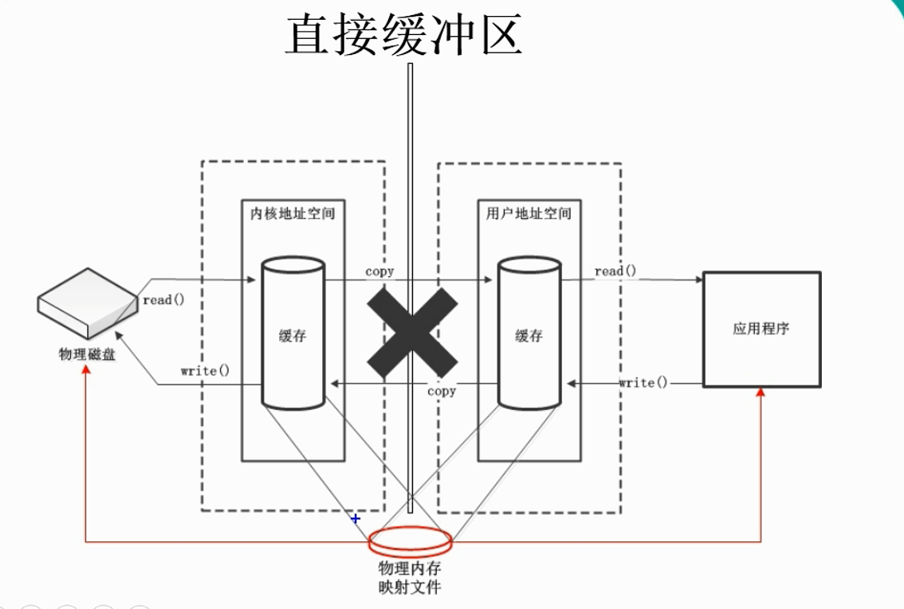

# Java NIO 与 IO 的主要区别


# 1、通道和缓冲区

java NIO 系统的核心在于： 通道(Channel)和缓冲区(Buffer).通道表示打开到IO设备(例如：文件、套接字)的连接。若需要使用 NIO 系统，需要获取用于连接 IO 设备的通过以及用于容纳数据的缓冲区。然后操作缓冲区，对数据进行处理。

简而言之，Channel 负责传输， Buffer 负责存储

## 1、缓冲区

缓冲区(buffer)：一个用于特定基本数据类型的容器。由 java.nio包定义的，所有缓冲区都是 buffer 抽象类的子类

Java NIO 中的 buffer 主要是用于与 NIO 通道进行交互，数据是从通道读入缓存区，从缓存区写入通道中的

### 缓冲区类型

```java
ByteBuffer
CharBuffer
ShortBuffer
IntBuffer
LongBuffer
FloatBuffer
DoubleBuffer

上述缓冲区的管理方式几乎一致，通过 allocate() 获取缓冲区
```

### 缓冲区常用方法

```java
buffer 四个核心属性

capacity：容量，表示缓冲区中最大存储数据的容量。一旦声明不能改变。
limit 界限，表示缓冲区中可以操作数据的大小(limit后数据不能进行读写)
position 位置，表示缓冲区中正在操作数据的位置

position <= limit <= capacity
```

```java
ByteBuffer.allocate(1024);

public static ByteBuffer allocate(int capacity) {
        if (capacity < 0)
            throw new IllegalArgumentException();
        return new HeapByteBuffer(capacity, capacity);
    }
    
     HeapByteBuffer(int cap, int lim) {            // package-private
        super(-1, 0, lim, cap, new byte[cap], 0);
        /*
        hb = new byte[cap];
        offset = 0;
        */
    }
    
    太深了 封装的，反正就是 将 position capacity limit 初始化
```

```java
public byte get(int i) {
	//  final byte[] hb;  
        return hb[ix(checkIndex(i))];
    }
    
     protected int ix(int i) {
     // offset 默认为 0
        return i + offset;
    }
    // 如果现在 position 大于等于 Limit 就抛出异常
    // 因为现在的 position 是还没有自增前的，自增了就超过了
final int nextGetIndex() {                          // package-private
        if (position >= limit)
            throw new BufferUnderflowException();
        return position++;
    }
    
```

```java
 public ByteBuffer put(byte x) {
        hb[ix(nextPutIndex())] = x;
        return this;
    }
```

```
都看过了就不重复了
```


## 2、直接缓冲区与非直接缓冲区

非直接缓冲区

```
通过 allocate() 方法分配缓冲区，将缓冲区建立在 JVM 的内存中
```

直接缓冲区

```
通过 allocateDirect() 方法分配直接缓冲区，将缓冲区建立在物理内存中。可以提高效率
但是不稳定，一般比非直接的快 5-10 倍，但是你不确定垃圾回收机制什么时候才可以回收缓冲区，所以用多了，可能内存就不够用了
```




```
ByteBuffer b = ByteBuffer.allocateDirect(1024);
分配直接缓冲区
b.isDirect() 是否为直接缓冲区 true 为直接缓冲区
```

## 3、通道 Channel

```
通道  Channel 表示 IO 源与目标打开的连接。Channel 类似于传统的"流"，只不过 Channel 本身不能直接访问数据，Channel 只能与 buffer 进行交互
```


```
通道 Channel 用于源节点与目标节点的连接，在 Java NIO 中负责缓冲区中数据的传输。 Channel 本身不存储数据，因此需要配合缓冲区进行传输

主要实现类
FileChannel 阻塞
SocketChannel 
ServerSocketChannel
DatagramChannel
```


获取通道

```java
1、java 针对支持通道的类提供了 getChannel() 方法
// 是非直接缓冲区

    本地IO 
        FileInputStream/FileOutputStream
        RandomAccessFile

    网络IO
        Socket
        ServerSocket
        DatagramSocket
	
2、在 JDK 1.7 中的 NIO.2 针对各个通道提供了静态方法 open() 


	 public static FileChannel open(Path path, OpenOption... options);
	 FileChannel fileChannel = 
                 FileChannel.open(Paths.get("d:/", "e/","c/"), StandardOpenOption.READ);
                 
-------------------------------------------------------------------------------
    
                 FileChannel.open(Paths.get("D:/2.png"),StandardOpenOption.WRITE,
                  StandardOpenOption.CREATE_NEW);// 如果文件存在报错，不存在创建
                  
        FileChannel.open(Paths.get("D:/2.png"),StandardOpenOption.WRITE,
                StandardOpenOption.CREATE); // 如果文件存在覆盖，不存在也创建

 // 将该通道文件的一个区域直接映射到内存中。
        MappedByteBuffer map = channel.map(MapMode.READ_ONLY, 0, channel.size());
     	
和 ByteBuffer.allocateDirect(222);
// 只有 ByteBuffer 才可以获取直接缓冲区，其他BtyteBuffer 都不行           
map 方法也可以获取直接缓冲区 

3、在 JDK1.7 中的 NIO.2 的 Files 工具类的 newByteChannel()


```


# 2、分散读取与聚集写入

```
分散Scatter 聚集Gather

分散读取(Scattering Reads): 将通道中的数据分散到多个缓冲区中
聚集写入(Gathering Writers): 将多个缓冲区中的数据聚集到通道中
```


# 3、NIO_字符集

```java
 // 字符集
    @Test
    public void fun1() {
        // 获取所有匹配的编码集 
        SortedMap<String,Charset> availableCharsets = Charset.availableCharsets();
        
        // 遍历循环 map
        Set<Entry<String, Charset>> entrySet = availableCharsets.entrySet();
        // 遍历获取所有支持的 编码集
        for (Entry<String, Charset> entry : entrySet) {
            System.out.println(entry.getKey() + ":" + entry.getValue());
        }
    }
```


```java
 // 字符集
    @Test
    public void fun1() {
        // 获取所有匹配的编码集
        SortedMap<String, Charset> availableCharsets = Charset.availableCharsets();

        // 遍历循环 map
        Set<Entry<String, Charset>> entrySet = availableCharsets.entrySet();
        // 遍历获取所有支持的 编码集
        for (Entry<String, Charset> entry : entrySet) {
            System.out.println(entry.getKey() + ":" + entry.getValue());
        }
    }

    // 字符集
    @Test
    public void fun2() throws Exception {
        Charset charset = Charset.forName("GBK");

        // 获取编码器 字符变成 byte
        CharsetEncoder encoder = charset.newEncoder();

        // 获取解码器 byte 变成 字符
        CharsetDecoder decoder = charset.newDecoder();

        CharBuffer cBuf = CharBuffer.allocate(1024);
        cBuf.put("您好 NIO");
        cBuf.flip();


        // 编码
        ByteBuffer encode = encoder.encode(cBuf);

        for (int i = 0; i < encode.limit(); i++) {
            System.out.println(encode.get());
        }

        encode.rewind();
        CharBuffer decode = decoder.decode(encode);
        
        for (int i = 0; i < decode.limit(); i++) {
            System.out.println(decode.get());
        }
    }
    
```


