安装

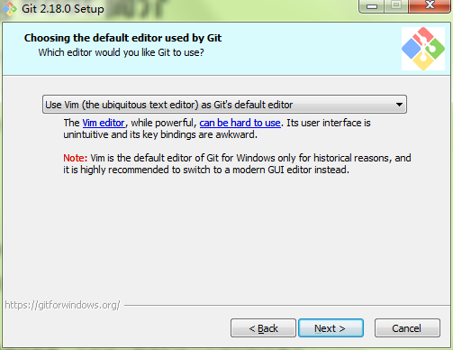

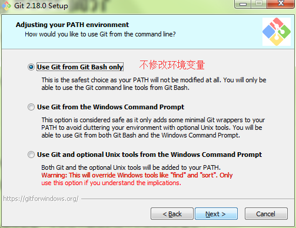

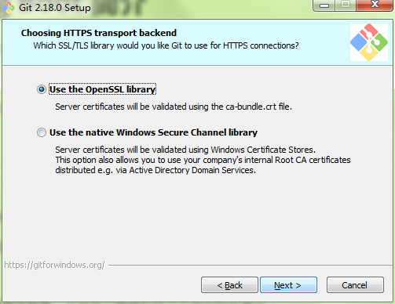

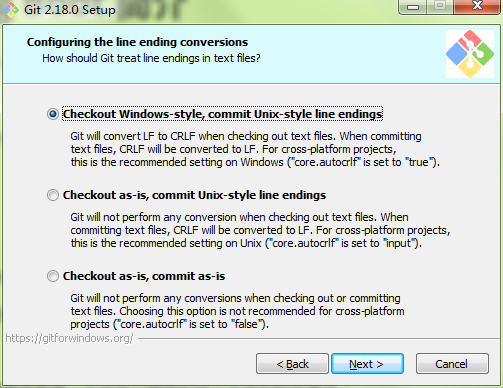

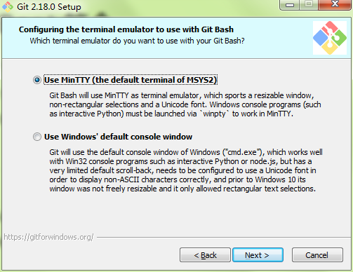

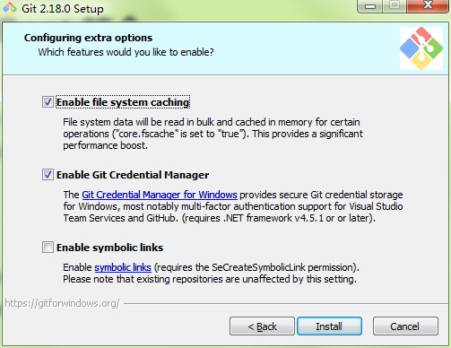


# 一、git介绍

## 1、git区域划分

工作区

​	写代码的地方

暂存区

​	临时存储的地方

本地库

​	历史版本

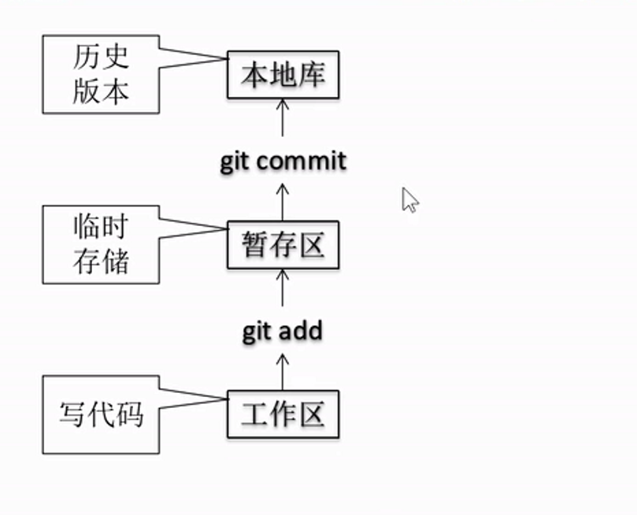

## 2、Git和代码托管中心

代码托管中心的任务：维护远程库

GitHub

码云

## 3、Git命令操作

### 1、本地库初始化

```shell
命令 
	git init
效果 
	会帮你创建一个 .git 目录
注意
	.git目录存放的是本地库相关的子目录和文件，不要删除，也不要胡乱修改
	

```

### 2、设置签名

```shell
形式
	用户名： tom
	Email地址：hahaha@qq.com
作用
	区分不同开发人员的身份
辨析
	这里设置的签名和登录远程库(代码托管中心)的账号、密码没有任何关系。
命令
	项目级别/仓库级别
		仅在当前本地库范围内有效
		git config user.name tom
		git config user.email hahah@qq.com
	系统用户级别
		登录当前操作系统的用户的范围
		git config --global user.name tom
		git config --global user.email hahah@qq.com
	优先级：两者都有 采用项目级别/仓库级别的签名
		二者都没有不允许
		
	项目级别/仓库级别的签名信息会包存到哪里
		cat .git/config
		会存放到 .git/config 里面
	系统用户级别的签名信息会包存到哪里
		会存放到当前的家目录下面的 .gitconfig 里面   
		cd ~ 到当前家目录
         cat .gitconfig 文件下
```

### 3、常用操作

```
查看状态
git status
$ git status
On branch master
	在 master 主干上
No commits yet
	没有任何提交(暂存区里面什么都没有)
nothing to commit (create/copy files and use "git add" to track)
	暂存区里面
	
添加
git add xxx 将其添加到 xxx 暂存区，如果有相同的文件就是修改
移除
git rm --cached xxx  将 xxx 从暂存区移除 真实的文件不会删除
提交
git commit xxx 将 xxx 从暂存区添加到本地仓库
会出现一个页面，要求你输入提交的数据的注释

```

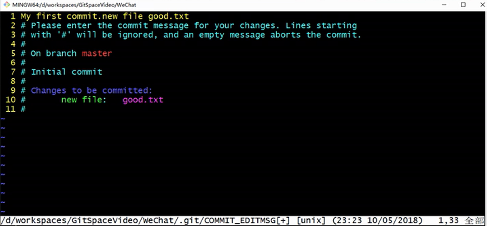

```shell
修改已经提交的文件
git add xxx , 然后 git commit 提交
或者
git commit -a xxx

因为你 commit 提交以后还要 写注释，所以你可以
git commit -m "xxx注释信息" xxx   提交 xxx 然后 -m 后面跟上注释信息
```

### 4、操作版本的历史记录

```shell
git log  查看历史记录
	commit 8b1f09dab8c4490194405037ad1cd18063d6d4d9 (HEAD -> master)
	Author: zhu_pro <zhu_pro@qq.com>
	Date:   Tue Jul 31 18:43:59 2018 +0800
    my second
    
    以 commit的数字为 key 文件为值
    HEAD 是一个指针，指向我们当前的版本
    
    多屏显示时控制方式
    	空格向下翻页
    	b 向上翻页
    	q 退出
    
git log --pretty=oneline
	以每条提交一行的方法来显示提交记录
	显示完整 hash 值
git log --oneline 
	只显示一部分 hash 值
git reflog 
	比 git log --oneline  多了一些信息 
	696e078 (HEAD -> master) HEAD@{0}: commit: four commit
	164f73c HEAD@{1}: commit: three commit
	8b1f09d HEAD@{2}: commit (initial): my second
	HRAD@{1} 你要到 164f73c 这个版本需要移动 一步。
	HRAD@{移动当当前版本需要多少步} 
	

```

前进或者后退

基于索引值操作(推荐)

```shell
git reset -hard 局部索引值
git reset -hard 8b1f09d 
取索引值来进行版本切换，不需要要拿全部的索引值，你只需要拿  git reflog 的部分索引值就可以了
```

使用 ^ 符号 只能往后退

```shell
696e078 (HEAD -> master) four commit
164f73c three commit
8b1f09d my second

git reset --hard HEAD^^
一个 ^(异或)符号就往后移动一个 ^^就从 696e078 移动到了 8b1f09d
```

使用 ~ 符号 只能往后退

```
git reset --hard HEAD~2   后退二步
```

reset 命令的三个参数对比

```
--soft 参数
	不会碰暂存区和工作区。操作本地库
	仅仅在本地库移动 HEAD 指针
--mixed 参数
	在本地库移动HEAD指针
	重置缓存区
--hard 参数
	在本地库移动HEAD指针
	重置暂存区
	重置工作区
```

### 5、删除文件

```
git rm xxx 删除 xxx
	变成  deleted: xxx 红色状态 在工作区
git add xxx 将删除操作提交
	变成 deleted: xxx 绿色状态  就是add到暂存区了
git commit xxx 将删除操作提交 提交到 本地库了 
	deleted: xxx  就消失了
	
文件一开始在工作区是红色的 只要暂存区数据不一致或文件不存在暂存区就是红色的
然后git add 将其添加到 暂存区 只要工作区数据不一致或文件不存在本地库就是绿色的
最后git commit 使用 git status 查询，文件就不会显示，因为相关数据已经到本地库了
	
git 不会删除，只会标记，该文件是删除状态
	只要你提交到本地库他就是不可磨灭的

```

怎么找回

```
git reset --hard xxxxx 版本号就可以找回
```

如果你的文件只是在暂存区，也可以使用 git reset --hard  索引号 来进行找回

因为 --hard 会找回    工作区     暂存区    本地库


总结

```
前提：删除前，文件存在时的状态提交到了本地库
操作： git reset --hard 指针位置
	删除操作已经提交到本地库：指针位置指向历史记录
	删除操作尚未提交到本地库：指针位置使用 HEAD
```

### 6、比较文件

```
git diff xxx
	将工作区中的文件和暂存区进行比较
	如果你将操作提交到了暂存区，再使用这个命令就是没有用的

我们在  ddd 后面添加了  @@@@@@@
diff --git a/good.txt b/good.txt
index cae5dc4..eeb67d1 100644
--- a/good.txt
+++ b/good.txt
@@ -1,7 +1,7 @@
 aaaaa
 bbbbb
 ccccc
-ddddd	删除了一行
+ddddd @@@@@@@@@@  添加了一行
 eeeee
 fffff
 ggggg
 
虽然我们只是在 ddd 后面添加了参数，但是对于 git 来说，你就是将其删除了一行，添加了一行
因为 git 是以 行 的方式来管理文件的

git diff HEAD xxx
	将工作区中的文件和本地库进行比较
	
git diff HEAD^ good.txt
与上一个版本比较
git diff HEAD~2 good.txt
与上两个版本比较

不带文件名比较多个文件
git diff

$ git diff HEAD 696e078 good.txt
是反过来的 是 696e078 good.txt 与 当前版本
而且是你 696e078 good.txt 版本的本地库和 当前版本 的本地库比较

 aaaaa
 bbbbb
 ccccc
-ddddd @@@@@@@@@@
-eeeee @@@@@@@@@@@
+ddddd
+eeeee
 fffff
 ggggg

情况是 当前版本的本地库 在 ddd eee 后面添加了 @，
而 696e078 是上一个版本

所以说是上一本版本和当前版本比较

```

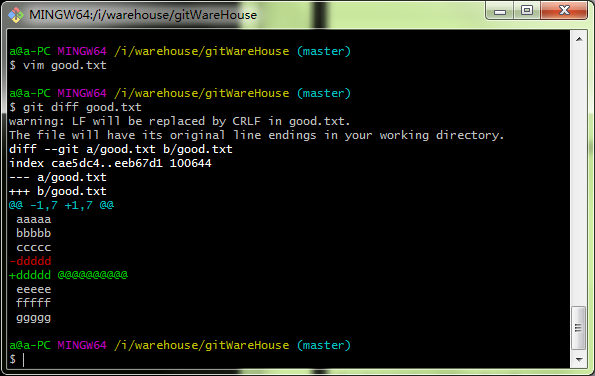

## 4、git 分支

```
分支我们一般用
feature_功能 来命名
feature_game 

出现 bug 修复使用
hot_fix 分支
```

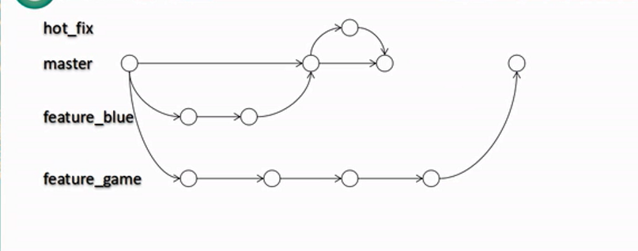分支的好处

```
同时并行推进多个功能开发，提高开发效率
如果各个分支在开发工程中，如果某一个分支开发失败，不会对其他分支存在影响。
	失败的分支删除重新开始即可。
```

```shell
查看所有分支
git branch -v

创建分支
git branch feature_xxx

切换分支
git checkout feature_xxx

合并分支
	1、切换到接收修改的分支上(被合并，增加新内容)
	2、执行 git merge feature_xxx 
		将 feature_xxx 合并到当前分支上
```

合并分支后产生的冲突

```4
$ git merge feature_test
Auto-merging good.txt
CONFLICT (content): Merge conflict in good.txt
Automatic merge failed; fix conflicts and then commit the result.
自动合并失败 你需要 修正冲突，然后提交结果。

你需要手动将其冲突的删除

然后 git add xxx 将其提交到 暂存区
然后使用 git commit 将其提交到本地库
	注意 git commit 不能带文件，直接 git commit 就可以了，但是可以写注释

```

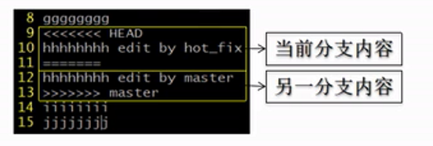


## 5、git 基本原理

### 1、哈希

```
哈希是一个系列的加密算法，各个不同的哈希算法虽然加密强度不同，但是有以下几个共同点：
	1、不管输入数据的数据量有多大，输入同一个哈希算法，得到的加密结果长度固定。
	2、哈希算法确定，输入数据确定，输出数据能够保证不变
	3、哈希算法确定，输入数据有变化，输出数据一定有变化，而且变化很大
	4、哈希算法不可逆
	5、Git 底层采用的是 SHA-1 算法
	
	哈希算法可以被用来验证文件。
```

### 2、Git 保存版本的机制

集中式版本控制工具的文件管理机制

```
以文件变更列表的方式存储信息。这类系统将它们保存的信息看做是一组基本文件和每个文件随时间逐步累积的差异
```

Git 的文件管理机制

```
git 把数据看做是小型文件系统的一组快照。每次提交更新时 git 都会对当前的全部文件制作一个快照并保存这个快照的索引。为了高效，如果文件没有修改，git不再重新存储该文件，而是只保留一个链接指向之前存储的文件。所以git的工作方式可以称之为快照流。
```


# 二、git和github交互

### 1、下载上传

```
git 的每一个不同的本地库，都是独立的不同的。和在别的电脑里面一样的
	都需要 git init 等操作，重新初始化

获取远程库
因为远程地址太长了，所有你可以将其保存起来，使用别名来代替远程地址
查看远程地址的别名
git remote -v
创建远程地址的别名
git remote add 别名 远程地址
git remote add origin https:xxxxxxxx


推送(将本地复制到远程页面)
git push 别名/远程地址 分支 
git push 别名/远程地址 master 

克隆(将远程的复制到本地) 
git clone 别名/远程地址
	有三个效果
		完整的吧远程库下载到本地
		创建 远程地址别名
		初始化本地库
	相当于就是把远程库下载到本地库，直接将远程库变成了本地库
	就是说你使用 clone 命令时，不需要 init 本地库，也不需要创建本地库，而是直接从远程库
	下载仓库，将其下载的仓库作为本地库。
	
	比如：a文件夹是你操作  git clone 地址 的文件夹
		你要下载的是 b 仓库。
		那么你下载以后，b 就在 a 里面，而本地库是 b 不是 a.
		你吧 .git 等也全部下载下来了。都在 b 里面
	


```

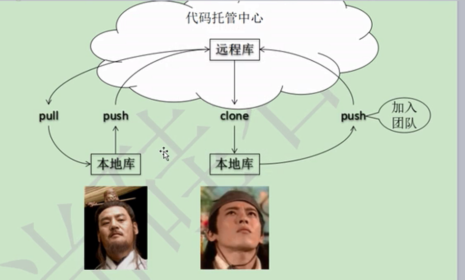

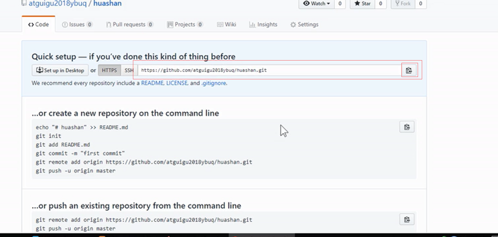


### 2、加入团队

```
如果你想用自己的 github 往别人的 github 里面提交数据，是不可以的
你需要被别人加入团队才可以
```

```
访问其 repository 然后点击 setting  点击 collaboration
```


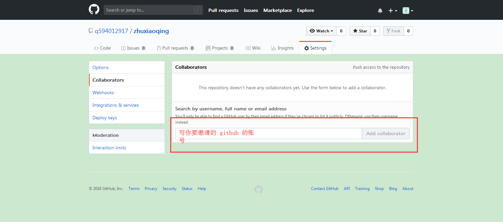

```
你需要登录起被邀请的账号，然后访问下面邀请链接
```


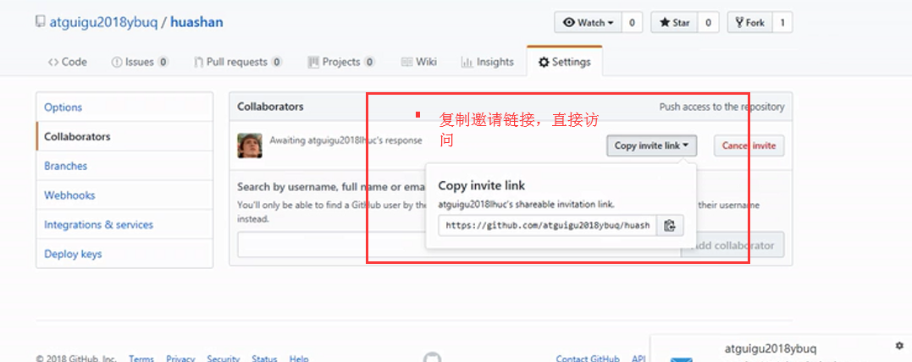


```
然后就可以写了
```

### 3、拉取

```
抓取数据
git fetch 别名 分支
git fetch 别名 master

抓取下来的数据在一个单独的分支上。名字是  别名/分支

你需要使用 
git merge 别名/分支 将其合并到 master 上

git pull 别名 分支
  pull = fetch + merge
```

## 4、远程冲突

```
如果在你之前其他人更新了同一个文件同一行的话，那么就会冲突， push 不上去

提示
	使用命令号登录 github 账号
	Username for 'https://github.com' : 用户名(你的github账号的用户名) 
	
你打开冲突的文件和之前的分支冲突是一样的

如果不是基于 github 远程库的最新版所做的修改，不能推送，必须先拉取。
拉取下来后如果进入冲突状态，则按照"分支冲突解决"操作解决即可
```

## 5、跨团队协作

```shell

```

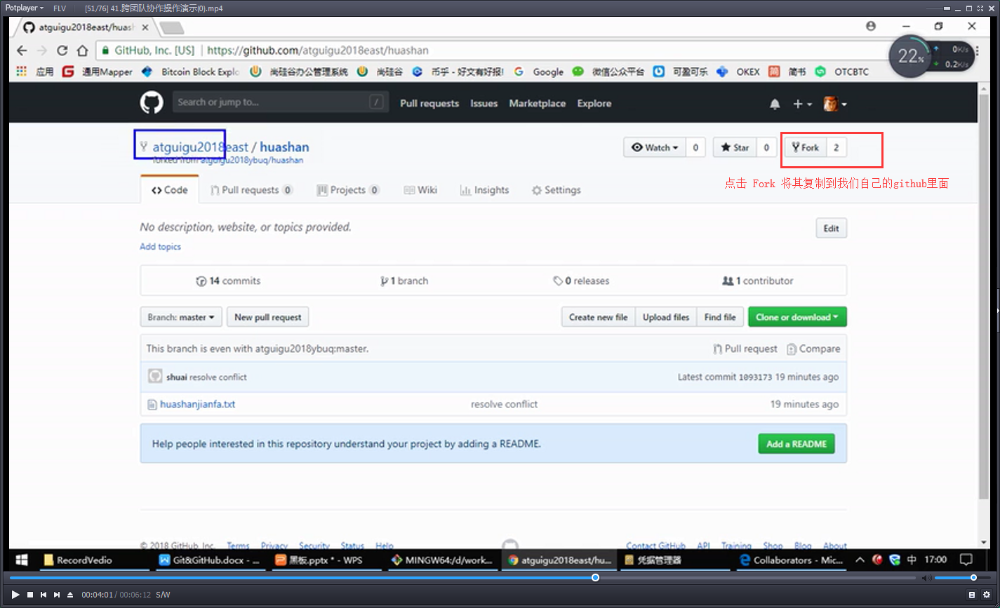

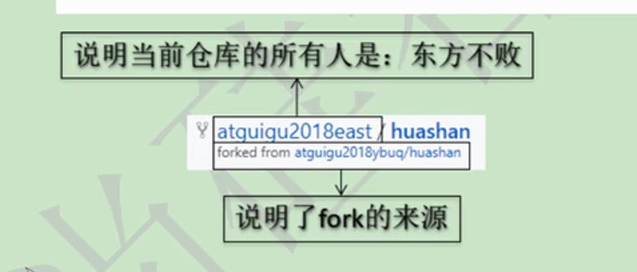

本地修改，然后推送到远程

Pull  Request

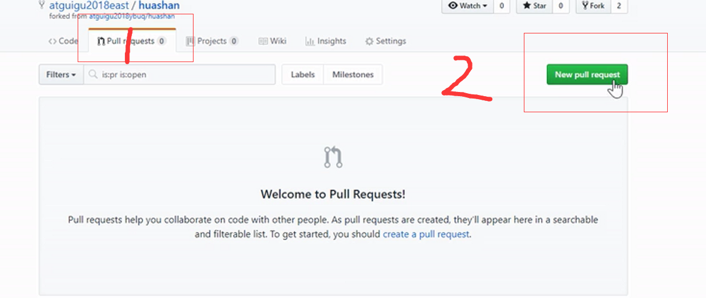


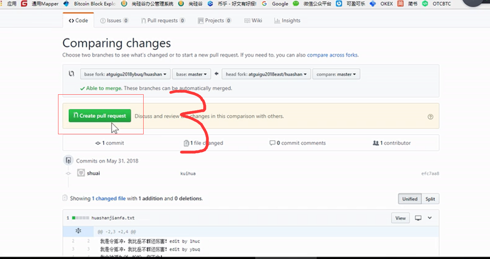

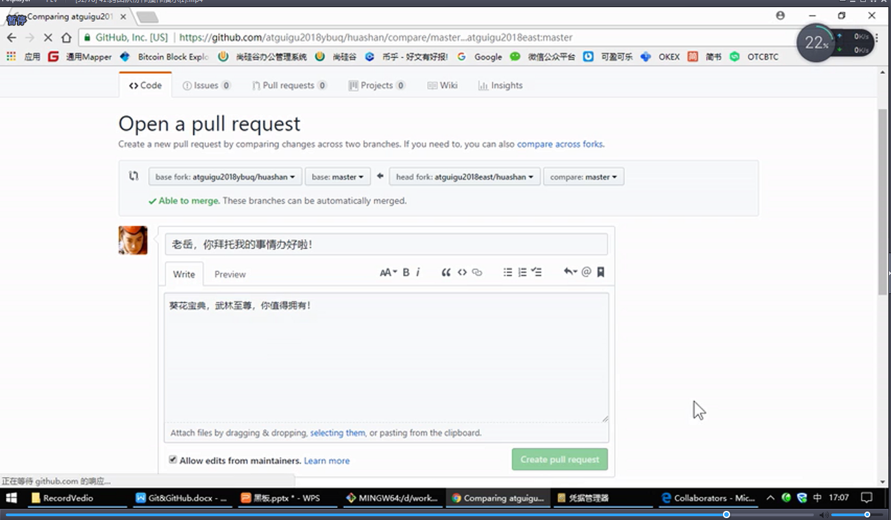


主办方，被 Fork 的方

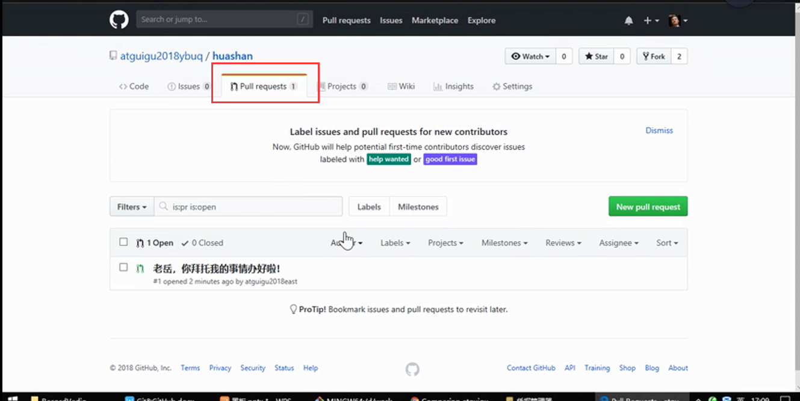

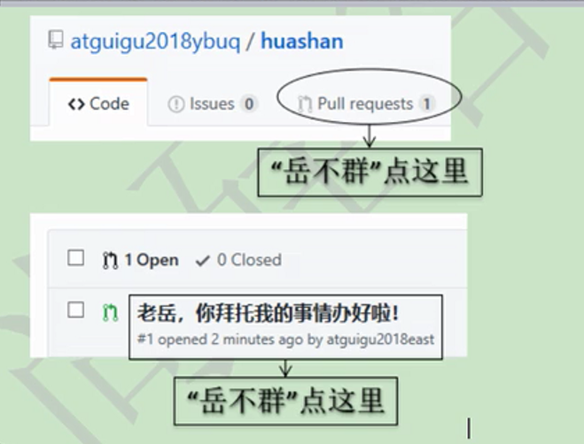


审核代码

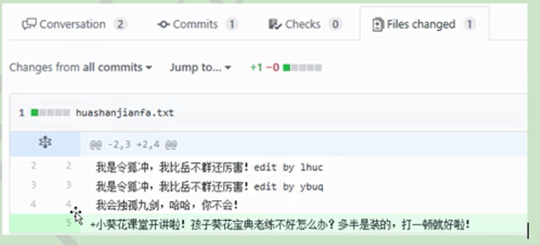

合并

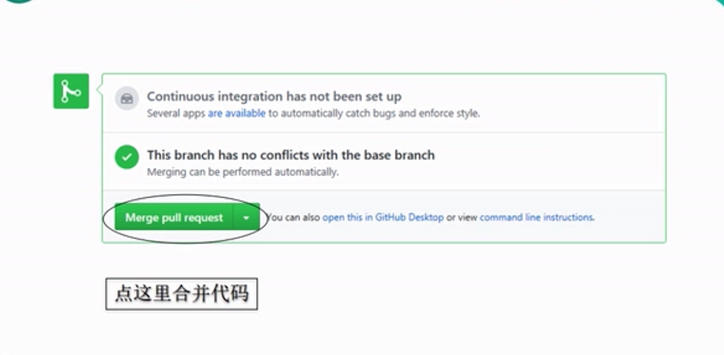

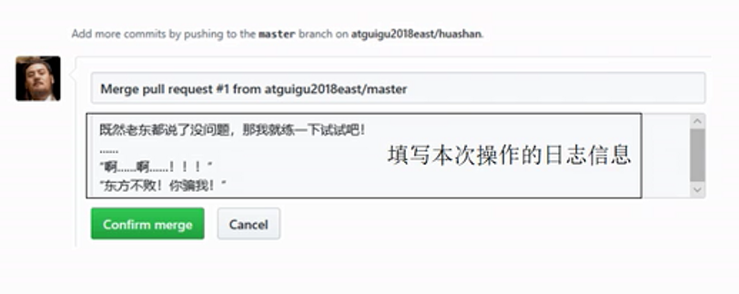

## 6、SSH 免密码登录


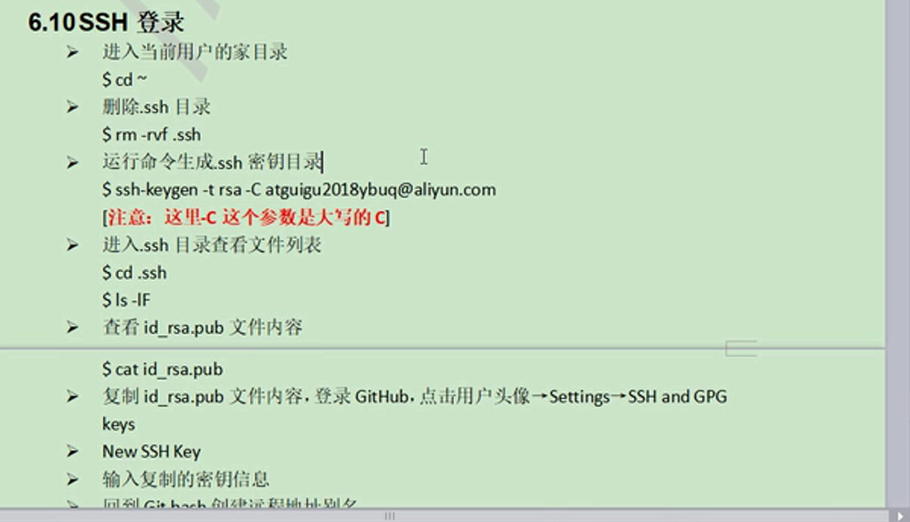

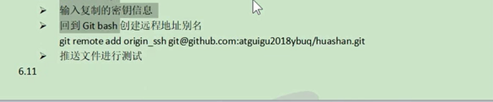


git 命令行操作结束了


## 7、git 图形化界面


