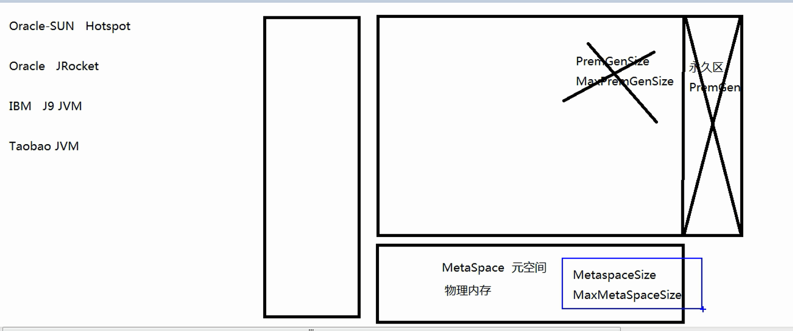
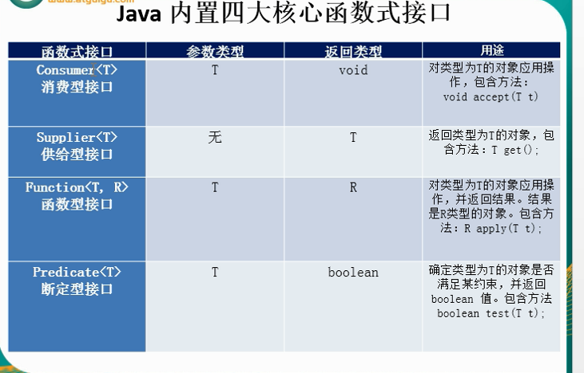
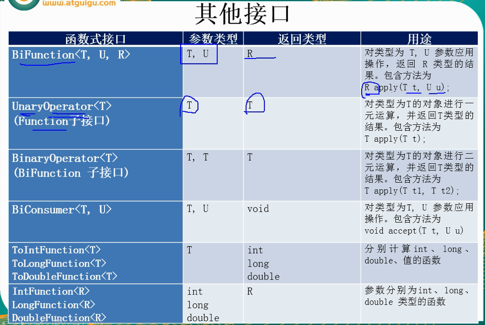
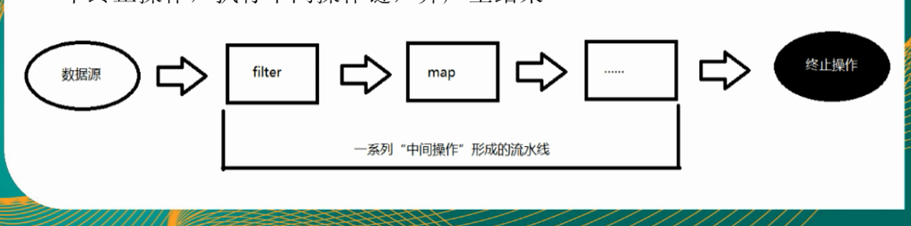
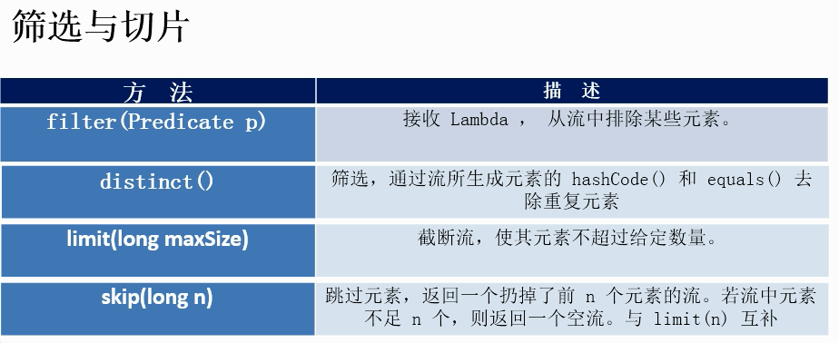

java8新特性

```
Lambda 表达式
函数式接口
方法引用与构造器
Stream API
接口中的默认方法与静态方法
新时间日期API
其他新特性
```

# 零、HashMap和JVM数据结构更新

```
hashMap
Hash 算法
是一个数组，存的是 entry
根据hash算法来计算出你的数据的在数组的下标
查看当前数组的下标是否有元素，有的话就形成链表，添加在链表头
hashmap里面，形成链表我们称之为hash碰撞，碰撞多了那么其查询速度就会减慢。因为你定位到数组以后，还要查询链表，链表的话是要一个一个查询的。一个一个 equals
所以就有了 加载因子 默认是 0.75
	意思是当 当前的元素到达了 hash表(就是数组) 的 75% 的时候，就进行扩容
		一般不能到 100% 再扩容，因为 比如 0 1 2 3 数组  hash算法可能就计算出 013，而 2没有计算出，那么2下标就一直是空的，其他下标可能都有很长的链表，所以最好到 75% 就扩容
		扩容了以后，数组链表里面的每一个元素都会重新进行hash计算，以减少链表的数据
		
jdk 1.8 以后，多了 红黑树，
先 数组-链表-红黑树
如果当你碰撞的元素个数大于8，并且总元素大于64的时候，会将其变成红黑树

红黑树，除了添加以外效率都高，红黑树 到达加载因子后进行扩容，不会再计算红黑树里面的元素的hash了，而是。。。(不清楚)
链表从1.8开始碰撞的元素添加到链表的末尾，而不是头
```

```
ConcurrentHashMap 也变了
并发级别
	16
	改成了 CAS 算法
	
```

```
java1.8  分为堆栈方法区，
JVM 其实有很多种
Oracle-SUN Hotspot(默认java JVM)  在jdk 1.8以前，其实 方法区属于 堆，叫做永久区(PremGen)
	堆的其他部分称之为垃圾回收区。
	jdk1.8 将永久区独立出来了，变成了 方法区(Metaspace元空间)
		Metaspace 元空间也从使用JVM的虚拟内存变成了使用物理内存
		默认是你物理空间多大，就配置多大
		
下面的JVM 都是没有 永久区 的。早都已经独立出来了
Oracle JRocket 
IBM J9 JVM
Taobao JVM
```




```
遍历同样大小的数组和链表， 哪个比较快？ 如果按照大学教科书上的算法分析方法，你会得出结论，这2者一样快， 因为时间复杂度都是 O(n)。 但是在实践中， 这2者却有极大的差异。   通过下面的分析你会发现， 其实数组比链表要快很多。
```

```
PU缓存会把一片连续的内存空间读入， 因为数组结构是连续的内存地址，所以数组全部或者部分元素被连续存在CPU缓存里面， 平均读取每个元素的时间只要3个CPU时钟周期。   而链表的节点是分散在堆空间里面的，这时候CPU缓存帮不上忙，只能是去读取内存，平均读取时间需要100个CPU时钟周期。 这样算下来，数组访问的速度比链表快33倍！ （这里只是介绍概念，具体的数字因CPU而异）

```

```
CPU 寄存器 – immediate access (0-1个CPU时钟周期)
CPU L1 缓存  – fast access (3个CPU时钟周期)
CPU L2 缓存 – slightly slower access (10个CPU时钟周期)
内存 (RAM)   – slow access (100个CPU时钟周期)
硬盘 (file system) – very slow (10,000,000个CPU时钟周期)

各级别的存储器速度差异非常大，CPU寄存器速度是内存速度的100倍！ 这就是为什么CPU产商发明了CPU缓存。 而这个CPU缓存，就是数组和链表的区别的关键所在。
```

```
1 在访问方式上 
数组可以随机访问其中的元素 
链表则必须是顺序访问，不能随机访问 
2 空间的使用上 
链表可以随意扩大 
数组则不能

因为数组可以根据你的下标，然后 元素地址=当前地址+元素大小*下标
而链表因为内存空间不是连续的，所以你必须从第一个元素开始查询，因为你只能从上一个元素从得到当前元素的下表
```

# 一、Lambda 表达式

## 1、为什么要用Lambda表达式

```
Lambda是一个匿名函数，我们可以吧Lambda表达式理解为是一段可以传递的代码(将代码像数据一样进行传递)。可以写出更简洁、更灵活的代码。作为一种更紧凑的代码风格，使java的语言能力得到了提升。
```

## 2、Lambda 表达式的基础语法

```
Lambda 表达式的基础语法：java8中引入了一个新的操作符 "->"该操作符为箭头操作符或 Lambda 操作符
	箭头操作符将 Lambda 表达式分成两部分：
	
左侧： Lambda 表达式的参数列表
右侧： Lambda 表达式中所需执行的功能，即 Lambda 体
	
```

```java
语法格式一： 无参数，无返回值
	() -> System.out.println("Hello Lambda!");
	在jdk1.8 内部类里面使用外部类的变量，外部类的变量也不需要加 final 了。
	但是本质还是 final的，只是省略了
	
@Test
public void test1() {
    Runnable r = () -> System.out.println("Hello Lambda!");
    r.run(); 
}
```


```java
语法格式二：  有一个参数，并且无返回值
	(x) -> System.out.println(x);
@Test
public void test2() {
    Consumer<String> con = (x) -> System.out.println(x);
    con.accept("Hello Lambda!");// 输出 Hello Lambda!
}

```

```java
语法格式三： 若只有一个参数，小括号可以省略不写
	x -> System.out.println(x);
@Test
public void test3() {
    Consumer<String> con = x -> System.out.println(x);
    con.accept("Hello Lambda!");// 输出 Hello Lambda!
}
```

```java
语法格式四： 若有两个或以上的参数,有返回值，并且 Lambda 体中有多条语句

@Test
public void test4() {
	Comparator<Integer> com = (x, y)  -> {
		System.out.println("函数式接口");
		return Integer.compare(x, y);
	}
}
```

```java
语法格式五： 若 Lambda 体中只有一条语句，return 和 大括号都可以省略不写

@Test
public void test4() {
	Comparator<Integer> com = (x, y)  ->  Integer.compare(x, y);
}
```

```
语法格式六： Lambda 表达式的参数列表的数据类型可以省略不写(就是(x,y) -> ... 的 x 和 y)
	因为 JVM 编译器可以通过上下文推断出数据类型，即"类型推断"

@Test
public void test4() {
	Comparator<Integer> com = (Integer x, Integer y)  ->  Integer.compare(x, y);
}
```

## 3、Lambda 表达式需要“函数式接口”的支持

```
函数式接口：接口中只有一个抽象方法的接口，称为函数式接口。可以使用注解
@FunctionalInterface 修饰，可以检查是否是函数式接口
```


## 1、Java 内置四大核心函数式接口






## 2、方法引用

```
方法引用 ： 若 Lambba 体中的内容有方法实现了，我们可以使用"方法引用"
	(可以理解为方法引用是 Lambda 表达式的另外一种表现形式)

主要有三种语法格式
	对象::实例方法名
    类::静态方法名
    类::实例方法名
```

```java
 /**
     *  lambda 方法引用
     *  注意方法引用  你引用的方法必须返回值和参数都必须和你的接口相等就是
     *    Consumer<String> 是引用函数式接口 有 void accept(String x);
     *    System.out 是被引用类 println 是被引用的方法 
     *        是 void println(String x);
     *        两者的方法的返回值 和 参数都相同时,可以使用 Lambda 表达式
     *    
     *   简单的说就是 lambda 体中调用方法的参数与返回值类型，要与函数式接口中抽象方法的函数列表和返回值类型保持一致
     */
    // 对象::实例方法 
    @Test
    public void test2() {
        // 正常方式
        PrintStream ps1 = System.out;
        Consumer<String> con1 = (x) -> ps1.println(x);
        
        PrintStream ps2 = System.out;
        // 方法引用
        Consumer<String> con2 = ps2::println;
        
        // 方法引用再进化
        Consumer<String> con3 = System.out::println;
    }
```

````java

    /**
     *  类::实例方法 
     *  若 Lambda 参数列表中的第一参数是实例方法的调用者，而第二参数是实例方法的参数时，
     *    可以使用  ClassName::method
     */
    @Test
    public void test3() {
        // 正常方式
        BiPredicate<String, String> bp = (x, y) -> x.equals(y);
        
        
        // 方法引用
        BiPredicate<String, String> con2 = String::equals;
        
    }
````

## 3、构造器引用

```
格式
	ClassName::new
```

```java
 
    /**
     * 构造器引用
     * 
     * 你的函数式接口的方有几个参数就调用几个参数的构造器
     * 需要调用的构造器的参数列表要与函数式接口中抽象方法的参数列表保持一致
     * 如果不一致，会报错
     */
    @Test
    public void test5() {
        // 普通的 Lambda
        Supplier<String> sup = () -> new String();
        
        //构造器引用
        Supplier<String> sup2 = String::new;
    }
    
```

## 4、数组引用

```java
Type::new;
```

```java
 /**
     * 数组引用
     * Type[]::new;
     */
    @Test
    public void test6() {
        Function<Integer, String[]> fun = (x) -> new String[x];
        String[] strs1 = fun.apply(10);
        
        Function<Integer, String[]> fun2 = String[]::new;
        String[] strs2 = fun.apply(10);
        
    }
```


# 二、强大的 Stream API

```java
java8中有两大最为重要的改变。第一个是 Lambda 表达式;另外一个则是 Stream API(java.util.stream.*)

Stream是 java8 中处理集合的关键抽象概念，它可以指定你希望对集合进行的操作，可以执行非常复杂的查找、过滤和映射数据等操作。使用Stream API 对集合数据进行操作，就类似于使用 SQL 执行的数据库查询。
也可以使用 Stream API 来并行执行操作。简而言之，Stream API 提供了一种高效且易于使用的处理数据的方式
```

## 1、Stream 的操作三个步骤

### 1、创建 Stream

一个数据源(如：集合，数组)，获取一个流

### 2、中间操作

一个中间操作链，对数据源的数据进行处理

### 3、终止操作(终端操作)

一个终止操作，执行中间操作链，并产生结果




```
Stream 自己不会存储元素
Stream 不会改变源对象。相反，他们会返回一个持有结果的新 Stream
Strem 操作是延迟执行的。这意味着他们会等到需要结果的时候才执行
```


## 1、创建流

```java
package cn.zhu.stream;

import java.util.ArrayList;
import java.util.Arrays;
import java.util.List;
import java.util.stream.IntStream;
import java.util.stream.Stream;

/**
 * 创建流的四种方式
 * ClassName: Test1Create 
 * @Description: TODO
 * @author a
 * @date 2018年9月16日
 */
/**
 * Stream 的三个操作步骤
 * 创建 Stream
 * 中间操作
 * 终止操作
 */
//1、创建 Stream
public class Test01Create {
   public void fun1() {
       // 1、可以通过 Collection 系列集合提供的 stream()(串行刘)
       // parallelStream
       List<String> list = new ArrayList<>();
       Stream<String> stream = list.stream();
       
       //2、通过 Arrays 中的静态方法 stream() 获取数组流
       String[] str = new String[10];
       Stream<String> stream2 = Arrays.stream(str);
       
       int[] intArray = new int[10];
       IntStream stream3 = Arrays.stream(intArray);
       
       //3、 通过 Stream 类中的静态方法 of()
       Stream<String> of = Stream.of("a","b","c");
       
       //4、创建无限流
       // 迭代
       Stream<Integer> iterate = Stream.iterate(0, (x) -> x+2);
       iterate.forEach(System.out::println);
       
       //生成
       Stream<Double> generate = Stream.generate(()->Math.random());
       generate.limit(10).forEach(System.out::println);

   }
    
}
```


## 2、Stream 的中间操作

```
多个中间操作可以连接起来形成一个流水线，除非流水线上触发终止操作，否则中间操作不会执行任何的处理！而在终止操作时一次性全部处理，称为 "惰性求值"
```


### 1、筛选与切片



```java
/**
 * 筛选与切片
 * filter 接收 Lambda 从流中排除某些元素
 * limit 截断流，使其元素不超过给定的数量
 * skip(n) 跳过元素,返回一个扔掉了前 n 个元素的流。若流中元素不足 n 个，则返回一个空流
 * distinct 筛选 通过流所生成元素的 hashCode() 和 equals() 去除重复元素
 */
```

### 2、映射

```
map - 接收 lambda 将元素转换成其他形式或提取信息。接收一个函数作为参数，该函数会被应用到每个元素上，并将其映射成一个新的元素。  

	将 map 里面返回的数据返回添加到最终的集合里面 相当于 一个开始是一个空的 List 然后一直 add  吧 map 返回的元素添加到集合中
	
flatMap -- 接收一个函数作为参数，将流中的每个值都换成另一个流，然后吧所有的流连接成一个流

	将 flatMap 里面返回的数据返回添加到最终的集合里面 相当于 一个开始是一个空的 List 然后一直 addAll  吧 map 返回的元素添加到集合中
```

### 3、排序

```
sorted() 自然排序 Comparable 使用元素继承 Comparable 实现 CompareTo 方法
sorted(Comparator comparator) 定制排序( Comparator)

```

### 4、查找 与匹配

```
allMatch -- 检查是否匹配所有元素
anyMatch -- 检查是否至少匹配一个元素
noneMatch --查询是否没有匹配的元素   如果有一个匹配的元素就返回 false 没有匹配的元素返回 true
findFirst -- 返回第一个元素
findAny -- 返回当前流中的任意元素
count -- 返回流中元素的总个数
max -- 返回流中最大值
min -- 返回流中最小值
```

## 3、终止操作

### 1、归约

```
reduce 缩小 减小 
reduce(T identity, BinaryOperator) / reduce(BinaryOperator)
可以将流中元素反复结合起来，得到一个值。
```

### 2、收集

```
collect 将流转换为其他形式。接收一个 Collector 接口的实现，用于给Stream 中的元素做汇总的方法
```


```java
 @Test
    public void fun2() {
        // 自定义容器 将流存里面
        HashSet<Employee> collect = employees.stream().collect(Collectors.toCollection(HashSet::new));
       
        // 总数
        Long collect2 = employees.stream().collect(Collectors.counting());
        // 平均值
        Double collect3 = employees.stream().collect(Collectors.averagingDouble(Employee::getAge));
        // 总和
        DoubleSummaryStatistics collect4 = employees.stream().collect(Collectors.summarizingDouble(Employee::getAge));
        // 最大值
        Optional<Employee> collect5 = employees.stream().collect(Collectors.maxBy((x, y)->x.getAge() - y.getAge()));
        Optional<Employee> collect6 = employees.stream().collect(Collectors.maxBy((x, y)-> Integer.compare(x.getAge(), y.getAge())));
        // 最小值
        Optional<Employee> collect7 = employees.stream().collect(Collectors.minBy((x,y) -> Integer.compare(x.getAge(), y.getAge())));
        
        // 分组  只要返回值一样的就将其分为一组
        Map<Integer, List<Employee>> collect8 = employees.stream().collect(Collectors.groupingBy(Employee::getAge));
       
        // 多级分组 .. 和上面的一样
        
        // 分区 和分组一样就是只有 true 和 false
        Map<Boolean, List<Employee>> collect9 = employees.stream().collect(Collectors.partitioningBy((x)->x.getAge()==1));
        
        /**
         *  summarizing  收集 
         *  collect -- 将流转换为其他形式。接收一个 Collector 接口的实现，用于给 Stream 中元素做汇总的方法
         */
        DoubleSummaryStatistics collect10 = employees.stream().collect(Collectors.summarizingDouble(Employee::getAge));
        /**
         * collect10.getCount()
         * collect10.getMax()
         * collect10.getMin()
         * collect10.getSum()
         * collect10.getAverage() 
         */
        
        // 连接
        String collect11 = employees.stream().map(Employee::getName)
        .collect(Collectors.joining(",","===","==="));
        System.out.println(collect11);   
        
        
    }
```


## 4、并行流 和 顺序流

```
parallel() 并行流
sequential() 顺序流 单线程流
```


# 三、Optional 类

```java
Optional<T> 类 java.util.Optional 是一个容器类，代表一个值存在或不存在，原来用 Null 表示一个值不存在，现在 Optional  可以更好的表达这个概念。并且可以避免空指针异常。
```

```
Optional.of(T t) 创建一个 Optional 实例 如果是 null 会抛出 NullPointerException
Optional.empty() 创建一个空的 Optional 实例  在调用 get() 的时候会抛出 NoSuchElementException 
Optional.ofNullable(T t) 若 t 不为 null，创建 Optional 实例，否则创建空实例
	里面就是  return value == null ? empty() : of(value);
isPresent(): 判断是否包含值
orElse(T t):如果调用对象包含值，返回该值，否则返回 t
orElseGet(Supplier s): 如果调用对象包含值，返回该值，否则返回 s 获取的值
map(Function f): 如果有值对其处理，并返回处理后的 Optional,否则返回 Optional.empty()
		Optional<ArrayList> ofNullable = Optional.ofNullable(new ArrayList());
        Optional<Integer> map = ofNullable.map(x-> x.size());
        将其 map 返回的元素返回
flatMap(Function mapper): 与 map 类似，要求返回值必须是 Optional
	Optional<Integer> map2 = ofNullable.flatMap(x -> Optional.of(x.size()));
	返回值必须使用 Optional 包装起来
```


# 四、接口中的默认方法与静态方法

## 1、接口中默认方法的 "类优先" 原则

```
若一个接口中定义了一个默认方法，而另外一个父类或接口中又定义了一个同名的方法时
**选择父类中的方法。
	如果一个父类提供了具体的实现，那么接口中具有相同名称和参数的默认方法会被忽略

**接口冲突。
	如果一个父接口提供一个默认方法，而另一个接口也提供了一个具有相同名称和参数列表的方法(不管方法是否是默认方法)，那么必须覆盖该方法来解决冲突.

```


# 五、 Time API

## 1、Time 包简介

### 1、java.time 时间和日期操作

```
instant 时间戳
LocalDate 日期
LocalDateTime 日期和时间
LocalTime 时间
```

### 2、java.time.chrono   一些时间的特殊格式 

(日本的 平成 几几 年， 正和几几年  台湾的中华民国几几年) 这种特殊时间格式


### 3、java.time.format   对时间日期格式化的

### 4、java.time.temporal  对时间进行运算的

### 5、java.time.zone 时区


## 2、使用 LocalDate、LocalTime、LocalDateTime

```
LocalDate、LocalTime、LocalDateTime 类的实例是不可变的对象，分别表示使用 ISO-8601 日历系统的日期、时间、日期和时间。它们提供了简单的日期或时间，并不包括当前的时间信息。也不包含与时区相关的信息

ISO-8601 日历系统是国际标准化组织制定的现代公民的日期和时间的表示法。
```


## 3、日期的操纵

TemporalAdjuster :  时间校正器。有时我们可能需要获取例如：将日期调整到"周日"等操作。

TemporalAdjusters :  该类通过静态方法提供了大量的常用 TemporalAdjuster 的实现


