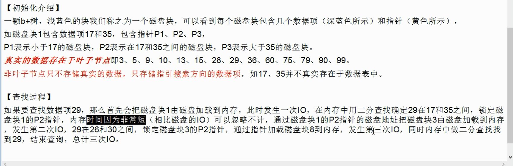
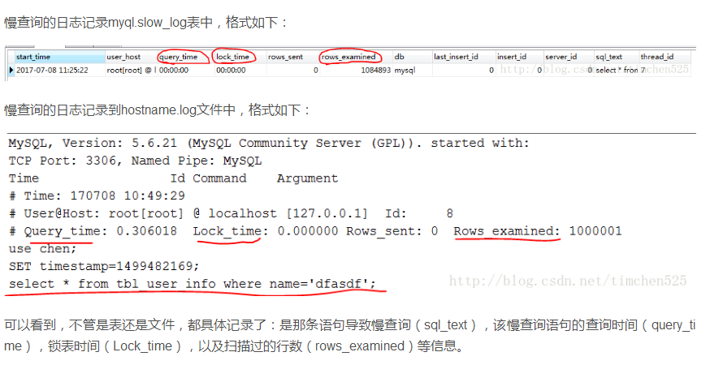
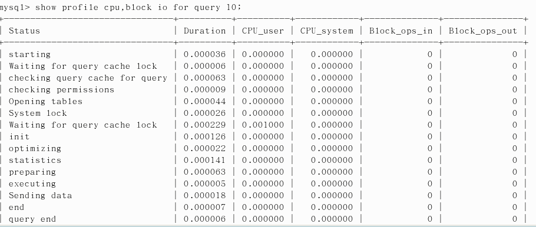

 

# 一、Mysql 安装

## 1、查看 mysql 安装时创建的 mysql 用户和 mysql 组

```shell
[root@MiWiFi-R3L-srv opt]# cat /etc/passwd | grep mysql    # 查看用户
mysql:x:995:992:MySQL server:/var/lib/mysql:/bin/bash

[root@MiWiFi-R3L-srv opt]# cat /etc/group | grep mysql	   # 查看组
mysql:x:992:

# 查看 mysql 版本
[root@MiWiFi-R3L-srv opt]# mysqladmin --version
mysqladmin  Ver 8.42 Distrib 5.5.48, for Linux on i686

# 查看 mysql 安装位置
ps -ef | grep mysqls

# 报错试试这个
 mysql_install_db --user=mysql --datadir=/var/lib/mysql 

# 还有记得查看日志

# 自动启动 mysql
chkconfig mysql on
# 设置 mysql 账号密码
/usr/bin/mysqladmin -u root password 123456

#启动 mysql  
 没有密码时  : mysql
 有密码时    : mysql -uroot -p13456
```


# 二、配置文件

| 路径              | 解释                       | 备注                        |
| ----------------- | -------------------------- | --------------------------- |
| /var/lib/mysql/   | mysql 数据库文件的存放路径 | /var/lib/mysql/xxx.pid      |
| /usr/share/mysql  | 配置文件目录               | mysql.server 命令及配置文件 |
| /usr/bin          | 相关命令目录               | mysqladmin mysqldump 等命令 |
| /etc/init.d/mysql | 启动相关脚本               |                             |


```shell
5.5 版本
配置文件在 /usr/share/mysql 下的 my-huge.cnf  是 mysql 的默认配置文件
我们一般是不动这个配置文件的，而是将其复制出来，在复制的文件里面做自定义配置

5.6 版本
	/usr/share/mysql/my-default.cnf
```


## 1、修改字符集和数据存储路径

```shell
# 查看数据库字符集
show variables like '%char%';
+--------------------------+----------------------------+
| Variable_name            | Value                      |
+--------------------------+----------------------------+
| character_set_client     | utf8                       |
| character_set_connection | utf8                       |
| character_set_database   | latin1                     |
| character_set_filesystem | binary                     |
| character_set_results    | utf8                       |
| character_set_server     | latin1                     |
| character_set_system     | utf8                       |
| character_sets_dir       | /usr/share/mysql/charsets/ |
+--------------------------+----------------------------+
```


修改

```shell
# 修改数据库字符集

[client]
password        = 123456
port            = 3306
default-character-set     = utf8
# Here follows entries for some specific programs
# The MySQL server
[mysqld]
port = 3306
character_set_server=utf8
character_set_client=utf8
collation-server=utf8_general_ci
#(注意 linux 下 mysql 安装完后是默认:表名区分大小写;列名不区分大小写；0:区分大小写 1:不区分大小写)
lower_case_table_names=1
#(设置最大连接数，默认为 151, Mysql 服务器允许最大连接数为 16384)
max_connections=1000
[mysql]
default-character-set=utf8
```


## 2、配置文件简介

#### 1、二进制日志 log-bin

```shell
主从复制
#Replication Master Server(default)
#binary logging is required for replication
log-bin= D:/dev/MySQL/data/mysqlbin   # 指定输出到该文件下 mysqlbin

它会把主机上面的一些行情变化记录下来，用于主从复制
```


#### 2、错误日志 log-err

```shell
默认是关闭的,记录严重的警告和错误信息，每次启动和关闭的详细信息
log-err= D:/dev/MySQL/data/mysqlerr   # 指定输出到该文件下 mysqlerr
 
```


#### 3、查询日志 log

```shell
默认关闭记录查询的 sql 语句，如果开启会减低 mysql 的整体性能， 因为记录日志也是需要消耗系统资源的
```


#### 4、数据文件

```shell
两系统 的数据库存放位置
	windows xxx\data目录下可以挑选很多库
	linux  看看当前系统中的全部库后再进去
		默认路径 ： /var/lib/mysql

frm 文件 
	代表存放表结构
myd 文件  (my data)
	存放表数据
myi 文件  (my index)
	存放表索引
```


#### 5、如何配置

没说

# 三、MySQL高级_MySQL逻辑架构简介


Connectors  连接点

第二层 业务逻辑处理层

Connectors Pool  连接层  (数据源等 durid)

Utilities  工具 容灾备份等

SQL Interface  存储过程 ，视图触发器等等  将其sql 语句根据 select insert  是写操作还是读操作 

Parser  解析转换    从 from 开启解析    将其解析

Optimizer 优化器，会将其执行语句的执行顺序，按照自己认为最优的执行语句的顺序来执行。也就是说可能会改

​		       变语句的执行顺序，来达到最优，指的是 比如 先执行 from 再执行 group by 这种的

Cache  缓存

第三层 存储引擎

第四层 文件存储层


和其他数据库相比，Mysql 有点与众不同，它的架构可以在多种不同场景中应用并发挥良好作用。主要体现在存储引擎的架构上，插件式的存储引擎架构将查询处理和其他的系统任务以及数据的存储提取相分离。这种架构可以根据业务的需求和实际需要选择合适的存储引擎


## 1、架构简介

### 1、连接层

最上层是一些客户端和连接服务，包括本地sock通信和大多数基于客户端/服务端工具实现的类似于tcp/ip的通信。主要完成一些类似于连接处理，授权认证，以相关的安全方案。在改层上引入了线程池的概念，为通过认证安全接入的客户端提供线程。同样在该层上可以实现基于SSL的安全连接。服务器也会为安全接入的每个客户端验证它所具有的操作权限。

### 2、服务层

第二层架构主要完成核心服务功能，如SQL接口，并完成缓存的查询，SQL的分析及部分内置函数的执行。所有的跨存储引擎的功能也在这一层，如存储过程、函数等。在该层，服务器会解析查询并创建相应的内部解析树，并对其完成相应的优化如确定查询表的顺序，是否利用索引等。最后生成相应的执行操作。如果是select语句，服务器还会查询内部的缓存。如果缓存空间足够大，这样在解决大量读操作的环境中能够很好的提升系统的性能。

### 3、引擎层

在存储引擎层，存储引擎真正的负责了MySQL 中数据的存储和提取，服务器通过API与存储引擎进行通信。不同的存储引擎具有的功能不同，这样我们可以根据自己的实际需要进行选取。

### 4、存储层

数据存储层，主要是将数据存储在运行于裸设备的文件系统之上，并完成与存储引擎的交互。 

  

**1、第一层负责连接管理、授权认证、安全等等。**
每个客户端的连接都对应着服务器上的一个线程。服务器上维护了一个线程池，避免为每个连接都创建销毁一个线程。当客户端连接到MySQL服务器时，服务器对其进行认证。可以通过用户名和密码的方式进行认证，也可以通过SSL证书进行认证。登录认证通过后，服务器还会验证该客户端是否有执行某个查询的权限。

**2、第二层负责解析查询(编译SQL)，并对其进行优化(如调整表的读取顺序，选择合适的索引等)**。对于SELECT语句，在解析查询前，服务器会先检查查询缓存，如果能在其中找到对应的查询结果，则无需再进行查询解析、优化等过程，直接返回查询结果。存储过程、触发器、视图等都在这一层实现。

**3、第三层是存储引擎，存储引擎负责在MySQL中存储数据、提取数据、开启一个事务等等。**存储引擎通过API与上层进行通信，这些API屏蔽了不同存储引擎之间的差异，使得这些差异对上层查询过程透明。存储引擎不会去解析SQL。


## 2、查询命令

```shell
# 查看你的 mysql 现在已提供什么存储引擎
show engines;

#看你的 mysql 当前默认的存储引擎
show variables like '%storge_engine%';
```


### 3、MyISAM 和 InnoDB

| 对比项        | MyISAM                     | InnoDB                                                       |
| ------------- | -------------------------- | ------------------------------------------------------------ |
| 主外键foreign | 不支持                     | 支持                                                         |
| 事务          | 不支持                     | 支持                                                         |
| 行表锁        | 表锁                       | 行锁                                                         |
| 缓存          | 只缓存索引，不缓存真实数据 | 不仅缓存索引还要缓存真实数据，对内存要求较高，而且内存大小对性能有决定性的影响 |
| 表空间        | 小                         | 大                                                           |
| 关注点        | 性能                       | 事务                                                         |
| 默认安装      | Y                          | Y                                                            |

# 四、索引

## 1、索引优化分析

1、性能下降 sql 慢

2、执行时间长

3、等待时间长

有以下原因

​	1、查询语句写的烂

​	2、索引失效

```shell
索引创建
单值索引
create index idx_user_name on user(name);
create index 索引名 on 表名(字段名)

复合索引
create index idx_user_nameEmail on user(name,email);
```

​	3、关联查询太多join

​	4服务器调优以及各个参数设置(缓冲、线程数等)

## 2、常见通用的join查询

### 1、SQL执行顺序

手写

```sql
SELECT DISTINCT
	<select_list>
FROM
	... JOIN ... ON ...
WHERE
	...
GROUP BY
	...
HAVING
	...
ORDER BY
	...
LIMIT
	...
	
```


机读

```sql
FROM
ON
JOIN
WHERE
GROUP BY
HAVING
SELECT
DISTINCT
ORDER BY
LIMIT

```


2、常见的七种sql 查询


mysql 默认不支持 Full OUTER JOIN 但是你可以用 union 来代替

```sql
第六幅图
SELECT *
FROM TableA A 
LEFT JOIN TableB B
ON A.Key = B.Key
Union
SELECT *
FROM TableA A
RIGHT JOIN TableB B
ON A.Key = B.Key

第七幅图
SELECT *
FROM TableA A
LEFT JOIN TableB B
ON A.Key = B.Key
WHERE B.Key IS NULL
Union
SELECT *
FROM TableA A 
RIGHT JOIN TableB B
ON A.Key = B.Key
WHERE A.Key IS NULL

```

## 3、索引简介

### 1、是什么

Mysql 官方对索引的定义为: 索引是帮助Mysql高效获取数据的数据结构。

可以得到索引的本质: 索引是数据结构

你可以简单的理解为 排好序的快速查找数据结构 

一般来说索引本身也很大，不可能全部存储在内存中，因此索引往往以索引文件的形式存储在磁盘上。

平常说的索引没有特别指明的，都是指 B 树(多路搜索树，并不一定是二叉的)结构组织的索引。其中聚合索引，次要索引，覆盖索引，前缀索引，唯一索引默认都是使用 B+ 树索引，统称索引。除了B树索引，还有 哈希索引(Hash) 等


在数据之外，数据库还维护着满足特定查找算法的数据结构，这些数据结构以某种方式引用(指向数据)，这样就可以在这些数据结构上实现高级查找算法了。这种数据结构，就是索引。


### 2、索引的优势和劣势

优势

1. 提高了数据检索的效率，降低数据库 io 成本
2. 通过索引列对数据进行排序，降低数据排序的成本，降低了CPU的消耗

劣势

1. 索引需要占用空间
2. 会降低更新表的速度(insert,update,delete)，因为你更新表，也需要更新索引.


##  4、索引分类

单值索引 

​	即一个索引只包含单个列，一个表可以有多个单列索引

唯一索引 

​	索引列的值必须唯一，但允许有空值

符合索引 

​	即一个索引包含多个列

基本语法

```sql
创建
	CREATE [UNIQUE] INDEX indexName ON mytable(columnname(length));
	ALTER mytable ADD  [UNIQUE] INDEX [indexName] ON (columname(length))
删除
	DROP INDEX [indexName] ON mytable;
查看
	SHOW INDEX FROM table_name\G
	
	\G 代表 竖着显示
	默认 横着显示
```

使用四种方式来添加数据表的索引

```SQL
ALTER TABLE tbl_name ADD PRIMARY KEY(column_list); 
	该语句添加一个主键，这意味着索引值必须是唯一的，切不能为 NULL；
ALTER TABLE tbl_name ADD UNIQUE index_name(column_list);
	这条语句创建索引的值必须是唯一的(除了NULL外，NULL 可能会出现多次)
ALTER TABLE tbl_name ADD INDEX index_name(column_list)
	添加普通索引，索引值可出现多次
ALTER TABLE tbl_name ADD FULLTEXT index_name(column_list)
	该语句指定了索引为 FULLTEXT,用于全文索引
```


## 5、索引原理

BTree索引 检索原理




## 6、该不该建立索引分析

### 1、哪些情况需要创建索引

1.  主键自动建立唯一索引

2. 频繁作为查询条件的字段应该创建索引

3. 查询中与其他表关联的字段，外键关系建立索引

4. 频繁更新的字段不适合创建索引

   ​	因为每次更新不仅更新记录还会更新索引，需要更新(重排)索引树

5. Where 条件里用不到的字段不创建索引

6. 单键/组合索引的选择问题，who (在高并发下倾向创建组合索引)

7. 查询中排序的字段，排序字段若通过索引去访问将大大提高排序速度

8. 查询中统计或者分组字段(分组之前会自动先排序)

### 2、哪些情况不需要创建索引

1. 表的记录太少

2. 经常增删改的表

      提高了查询的速度，但是会降低增删改的速度，因为修改数据的时候，还会修改索引

3. 数据重复且分布平均的表字段，因此应该只为最经常查询和最经常排序的的数据建立索引。

   注意，如果某个数据列包含许多重复的内容，为它建立索引就没有太大的实际效果


## 7、性能分析

### 1、MySQL Query Optimizer

1、Mysql 中有专门负责 SELECT 语句的优化器模块，主要功能:

通过计算分析系统中收集到的统计信息，为客户端请求的 Query 提供他认为最优的执行计划(他认为最优的数据检索方式，但不见得是 DBA 认为最优的，这部分最耗费时间)

2、当客户端向 mysql 请求一条 Query ，命令解析器模块完成请求分类，区别出是 SELECT 并转发给 MySQL Query Optimizer 时，Mysql Query Optimizer 首先会对整条 Query 进行优化，处理掉一些常量表达式的预算，直接换算成常量值。并对 Query 中的查询条件进行简化和转换，如去掉一些无用或显而易见的条件、结构调整等。然后分析 Query 中的 Hint 信息(如果有)，看显示 Hint 信息是否可以完全确定该 Query 的执行计划。如果没有 Hint 或 Hint 信息还不足以完全确定执行计划，则会读取涉及对象的统计信息，根据 Query 进行相应的计算分析,然后再得出最后的执行计划。

### 2、Mysql 的常见瓶颈

1、CPU 

​	CPU 在饱和的时候一般发生在数据装入内存或从磁盘上读取数据的时候

2、IO

​	磁盘I/O瓶颈发生在装入数据远大于内存容量的时候

3、服务器硬件的性能瓶颈

​	top,free,iostat 和 vmstat 来查看系统的性能状态

### 3、Explain

使用 EXPLAIN 关键字可以模拟优化器执行 SQL 查询语句，从而知道MySQL 是如何处理你的SQL语句的。分析你的查询语句或是表结构的性能瓶颈

#### 1、能干嘛

1. 表的读取顺序(id)
2. 数据读取操作的操作类型(select_type)
3. 哪些索引可以使用
4. 哪些索引被实际使用 
5. 表之间的引用
6. 每张表有多少行被优化器查询

#### 2、执行计划包含的信息

id | select_type | table | type | possible_keys | key | key_len | ref | rows | Extra

名词解释

##### 1、id

​	select 查询的序列号，包含一组数字，表示查询中执行 select 子句或操作表的顺序

​	有三种情况

​		1、id 相同，执行顺序由上至下(就是按照表格的顺序加载)


​		2、id 不同，如果是子查询，id的序号会递增，id值越大优先级越高，越先被执行


​		3、id 相同不用，同时存在


注意 derived 是 衍生 的意思。是指虚拟表

derived 2 表示是指 id 为 2 的表衍生而成的虚拟表


##### 2、select_type

| select_type可能的值 | 说明                                                         |
| ------------------- | ------------------------------------------------------------ |
| SIMPLE              | 简单的 select 查询，查询中不包含子查询或者 UNION             |
| PRIMARY             | 查询中若包含任何复杂的子部分，最外层查询则被标记为           |
| SUBQUERY            | 在SELECT或WHERE列表中包含了子查询                            |
| DERIVED             | 在FROM列表中包含的子查询被标记为DERIVED(衍生)。MYSQL会递归执行这些子查询，把结果放在临时表里 |
| UNION               | 如果第二个SELECT出现在UNION之后，则被标记为UNION;若UNION包含在FROM子句的子查询中，外层SELECT将被标记为：DERIVED |
| UNION RESULT        | 从UNION表获取结果的SELECT                                    |

##### 3、table

就是你的表的名字，有别名就是别名

##### 4、type

ALL | index | range | ref | eq_ref | const , system | NULL 

type 的访问类型排列

显示查询使用了何种类型

从最好到最差依次是：

system > const > eq_ref > ref > range > index > ALL

详细的

system > const > eq_ref > ref > ref_or_null > index_merge > unique_subquery > index_subquery > range > index > ALL

一般来说，得保证查询至少达到 range 级别，最好能达到 ref.


**system**

​	表只有一行记录(等于系统表)，这是const类型的特例，平时不会出现，这个也可以忽略不计

**const**

​	表示通过索引一次就找到了, const用于比较primary key 或者unique索引。因为只匹配一行数据，所以很快。如将主键至于where列表中，Mysql 就能将该查询转换为一个常量。


**eq_ref**

​	唯一性索引扫描，对于每个索引键，表中只有一条记录与之匹配。常见于主键或唯一索引扫描

唯一索引扫描就是**eq_ref**


t1 员工表  t2 部门表 

**ref**

​	非唯一性索引扫描，返回匹配某个单独值的所有行。

​	本质上也是一种索引访问，它返回所有匹配某个单独值的行，然而，

​	它可能会找到多个符合条件的行，所以他应该属于查找和扫描的混合体

非唯一性索引就是 **ref**


**range**

​	只检索给定范围的行，使用一个索引来选择行。key 列显示使用了哪个索引

​	一般就是在你的 where 语句中出现了 between 、<、>、in 等的查询

​	这种范围扫描索引扫描比全表扫描要好，因为它只需要开始于索引的某一点，而结束于另一点，不用扫描全部索引


**Index**

Full Index Scan， index 与 All 的区别为 index 类型只遍历索引树。这通常比 ALL 快，因为索引文件通常比数据文件小。(也就是说虽然all和index都是读全表，但index是从索引中读取的，而all是从硬盘中读取的) 


**ALL**

Full Table Scan, 将遍历全表以找到匹配的行


##### 5、possible_keys

​	显示可能应用在这张表中的索引，一个或多个。

​	查询涉及到的字段上若存在索引，则该索引将被列出，但不一定被查询实际使用

##### 6、key

​	实际上使用到的索引。如果为NULL。则没有使用索引。

​	查询中若使用了覆盖索引，则该索引仅出现在key列表中


7、**Key_len**

表示索引中使用的字节数，可通过该列计算查询中使用的索引的长度。在不损失精确度的情况下，长度越短越好

key_len 显示的值为索引字段的最大可能长度，并未实际使用长度，即key_len 是根据表定义计算而得，不是通过表内检索出的


你所使用的条件越多，需要的 key_len 就越大，前提是你使用了索引，没有使用索引 key_len 为 null

表示索引耗费的资源

```
key_len的长度计算公式：
varchr(10)变长字段且允许NULL   = 10 * ( character set：utf8=3,gbk=2,latin1=1)+1(NULL)+2(变长字段)
varchr(10)变长字段且不允许NULL = 10 *( character set：utf8=3,gbk=2,latin1=1)+2(变长字段)
char(10)固定字段且允许NULL     = 10 * ( character set：utf8=3,gbk=2,latin1=1)+1(NULL)
char(10)固定字段且不允许NULL   = 10 * ( character set：utf8=3,gbk=2,latin1=1)
timestamp占用4字节
```


##### 8、ref

显示索引的那一列被使用了，如果可能的话，是一个常数。哪些列或常量被用于查找索引列上的值


shared.t2.col1 表示使用了 shared库t2表col1字段。第二个字段是一个const(常量)

t2的ref 表示 where 后面 t2.xxx = sss 如果 t2.xxx是索引的话，ref就会显示 sss，如果sss是常量的话就显示const，如果是另一个表的字段就显示，xx库.xx表.xx字段

t1的ref也是一样。显示 t1.xxx=sss     sss是什么；

##### 9、rows

根据表统计信息及索引选用情况，大致估算出找到所需的记录所需要读取的行数


##### 10、Extra

包含不适合在其他列中显示但十分重要的额外信息。

**1、Using filesort**

说明mysql会对数据使用一个外部的索引排序，而不是表内的索引顺序进行读取。

MySQL中无法利用索引完成的排序操作称为"文件排序"

也就是说你 order by 没有使用到索引。


**2、Using temporary**

使用了临时表保存中间结果，MySQL 在对查询结果排序时使用临时表。常见于排序 order by 和分组排序 group by


**3、Using index**

表示相应的 select 操作中使用了覆盖索引(Covering index),避免了访问表的数据行，效率不错··！

如果同时出现了 using where ,表明索引 被用来执行索引键值的查找。

如果没有出现 using where, 表明索引用来读取数据而非执行查找动作。


**覆盖索引**

​	覆盖索引(Covering index),一说为索引覆盖。

**理解方式一:** 就是 select 的数据列只用从索引中就能够取得，不必读取数据行，MySQL 可以利用索引返回select列表中的字段，而不必根据索引再次读取数据文件，换句话说**查询列要被所建的索引覆盖**

**理解方式二:**索引是高效找到行的一个方法，但是一般数据库也能使用索引扎到一个列的数据，因此它不必读取整个行。毕竟索引叶子节点存储了它们索引的数据；当能通过读取索引就可以得到想要的数据，那就不需要读取行了。一个索引包含了(覆盖了)满足查询结果的数据就叫覆盖索引

**注意：**

​	如果要使用覆盖索引，一定要注意select列表中只取出需要的列，不可select * 

​	因此如果将所有的字段一起做索引会导致索引文件过大，查询性能下降

**4、Using where**

表明使用了where过滤

**5、using join buffer**

使用了连接缓存

**6、impossible where**

where子句的值总是false,不能用来获取任何元素。

**7、select tables optimized away**

在没有 Group by 子句的情况下，基于索引优化 Min/Max 操作或者

对于 MyISAM 存储引擎优化 COUNT(*)操作，不必等到执行阶段再进行计算查询执行计划生成的阶段即可完成优化

**8、distinct**

优化 distinct 操作，在找到第一匹配的元素后即停止找同样值的动作

## 8、热身Case


# 五、索引优化

## 1、Join语句的优化

多表优化策略

 Left join  索引的话，Left join 条件用于确定如何从右表搜索行，左边一定都有。

​	所以右边是我们的关键点，一定要建立索引。

​	因为左链接的时候，左边的表是一定会被遍历的，就是遍历 索引和遍历表的问题。

​	右边的话是根据左边的，左边遍历以后，可以通过搜索右边的索引来直接获取右边的表的值。

**结论**

​	Left   join 索引建右边

​	Right join 索引建左边

Join 语句的优化

**尽可能减少 join 语句中的 NestedLoop 的循环总次数；**

**永远用小结果集驱动大的结果集**

**优先优化NestedLoop的内层循环**

**保证join语句被驱动表上join条件字段已经被索引**

**当无法保证被驱动表的join条件字段被索引且内存资源充足的前提下，不要太吝惜JoinBuffer的设置**

## 2、索引失效(应该避免)

1、全值匹配我最爱

​	如果是**复合索引** idx_a_b_c 你必须 a b c 按顺序使用，如果你没有使用 a 直接使用 b 是无法使用这个**复合索引**的，当然你可以只使用 a 不使用b 。按顺序来，无需强制全部使用

2、最佳左前缀法则

​	如果索引了多列，要遵守最左前缀法则。指的是查询从索引的最左前列开始并且**不跳过索引中的列**

3、不在索引列上做任何操作(计算、函数、(自动or手动)类型转换)，做了这些操作会导致索引失效而转向全表扫描

4、存储引擎不能使用索引中范围条件右边的列，也就是说范围之后，全失效，也就是说复合索引，在 id_a_b_c

​	b > 1; 那么 c 索引就会失效


5、尽量使用覆盖索引(只访问索引的查询(索引列和查询列一致))，减少select * 


6、mysql 在使用不等于(!=或者<>)的时候无法使用索引会导致全表扫描


7、is null , is not null 也无法使用索引


8、like以通配符开头(%adb..)mysql 索引失效会变成全表扫描的操作


问题：解决 like'%字符串%'时索引不失效 

​	你可以使用覆盖索引

​	即 select name,age from tableA  where name like '%ss%';

​	create index idx_name_age on tableA(name,age);

​	这样就会全扫描 index ，而不会扫描表

9、字符串不加单引号索引失效


10、少用or,用它来连接时会索引失效(OR会使索引失效，最好使用UNION代替 )


11、innodb 的 in 会导致索引失效，因为in 本质就是 Or

你可以将语句转换为子查询

```sql
select * from test_table2
where pay_id in (
　　select pay_id from test_table2 
　　where pay_id > 1
);

可以转换为
select * from test_tables2 t1 ,
(
	select pay_id from test_tables2 
    where pay_id > 1
) t2
where t1.pay_id = t2.pay_id;

```


**小总结**


## 3、面试题


​	定值、范围还是排序，一般 order by 是给个范围

​	group by 基本上都需要进行排序，会有临时表产生

**一般性建议**

对于单键索引，尽量选择针对当前query 过滤性更好的索引

在选择组合索引的时候，当前query 中过滤性最好的字段在索引字段顺序中，位置越靠前越好

在选择组合索引的时候，尽量选择可以能够包含当前query中的 where子句中更多字段的索引

尽可能通过分析信息和调整query的写法来达到选择合适索引的目的

## 4、小总结


like 'xx%' 是范围查询，但是他不会导致后面的索引失效

create index idx_a_b_c on tableA(a,b,c);

b >2 a>1 c=3  mysql 会使用 optimizer 帮你自动排序  变成  a >1 b>2 c=3 这样按照组合索引排序

select * from a=2 order c,b  索引失效 出现  using filesort

select * from a=2 order b,c  索引使用到了 abc;

select * from a=2,b =2 order c,b  索引使用到了 abc 

​	因为 b是常量，只有一条记录不需要排序

优化总结口诀

​	全值匹配我最爱，最左前缀要遵守;

​	带头大哥不能死，中间兄弟不能断；

​	索引列上少计算，范围之后全失效；

​	LIKE百分写最右，覆盖索引不写星；

​	不等空值还有or，索引失效要少用；

​	var引号不可丢，sql高级也不难；


# 六、查询截取分析

1、观察，至少跑1天，看看生产的慢SQL情况

2、开启慢查询日志，设置阙值，比如超过5秒钟的就是慢SQL，并将它抓取出来。

3、explain + 慢sql分析

4、show profile

5、运维经理 or DBA, 进行SQL数据库服务器的参数调优。


====总结

1、慢查询的开启并捕获

2、explain + 慢sql分析

3、show profile 查询 SQL 在 MySQL服务器里面的执行细节和生命周期情况

4、SQL数据库服务器的参数调优。


## 1、查询优化

### 1、永远小表驱动大表

​	类似嵌套循环Nested Loop

**in 和 exists**

**in** 

SELECT
    *
FROM
    `user`
WHERE
    `user`.id IN (
        SELECT
            `order`.user_id
        FROM
            `order`
    )

确定给定的值是否与子查询或列表中的值匹配。in 在查询的时候，首先查询子查询的表，然后将内表和外表做一个笛卡尔积，然后按照条件进行筛选。所以相对内表较小的时候，in 的速度较快

**exists**

SELECT
    `user`.*
FROM
    `user`
WHERE
    EXISTS (
        SELECT
            `order`.user_id
        FROM
            `order`
        WHERE
            `user`.id = `order`.user_id
    )

查询外表，然后将其外表中的每条记录与内表循环匹配，匹配留下，不匹配false;

exists 对外表用loop逐条查询，每次查询都会查看exists的条件语句，当exists里面的条件语句能够返回记录行时(无论记录行多少，只要能返回)，条件就为真，返回当前loop到的这条记录，反之如果exists里的条件不能返回记录行，则当前loop到的这条记录被丢弃，exists的条件就像一个bool条件，当能返回结果集则为true,不能返回结果集则为false

**区别及应用场景**

in和 exists 的区别: 如果子查询得出的结果集记录较小，主查询中的表较大且又有索引时，应该用 in;反之如果外层的主查询记录较小时，子查询的表大，又有索引时使用 exists。其实我们区分 In 和 exists 主要是造成了驱动顺序的改变(这是性能变化的关键)，如果是exists, 那么以外表为驱动表，先被访问，如果是IN，那么先执行子查询，所有我们会以驱动表的快速返回为目标，那么就会考虑到索引及结果集的关系了，另外in时不对null进行处理

​	in s是把外表和内表做 hash 连接，而 exists 是对外表做 loop 循环，每次loop循环再对内表进行查询。一直以来认为 exists 比in 效率高的说法是不正确的。

**not in 和not exists**

　　　　如果查询语句使用了not in 那么内外表都进行全表扫描，没有用到索引；而not extsts 的子查询依然能用到表上的索引。所以无论那个表大，用not exists都比not in要快。


### 2、order by 关键字优化

order by 子句，尽量使用 index 方式排序，避免使用 filesort 方式排序

​	MySQL 支持两种方式的排序，Filesort 和 index, index效率高，它指mysql扫描索引本身完成排序。Filesort方式效率较低


可以看出 一个  asc 和 一个 desc 是不能用上索引的

order by 满足两情况，会使用 Index 方式排序：

```java
	order by 语句使用索引最左原则
	使用where子句与order by子句条件列组合满足索引最左前列
```


尽可能在索引列上完成排序操作，遵照索引建的最佳左前缀

如果不在索引列上，filesort有两种算法

```
双路排序
	mysql 4.1之前是使用的双路排序，字面意思就是两次扫描磁盘，最终得到数据，读取行指针和order by列，对他	  们进行排序，然后扫描已经排序好的列表，按照列表中的值重新从列表中读取对应的数据输出
	
	从磁盘取排序字段，在buffer进行排序，再从磁盘取其他字段
	
取一批数据，要对磁盘进行了两次扫描，众所周知，I/O是很耗时的，所以在mysql4.1之后，出现了第二种改进的算法，就是单路排序。

单路排序
	从磁盘读取查询需要的所有列，按照order by列在buffer对它们进行排序，然后扫描排序后的列表进行输出，它的效率更快一些，避免了第二次读取数据。并且把随机io变成了顺序io，但是它会使用更多的空间，因为它吧每一行都保存下来了
	
结论
	由于单路是后出的，总体而言好过双路
	但是用单路有问题

	在sort_buffer 中，方法B比方法A要多占用很多空间，因为方法B是把所有字段都取出，所以有可能取出的数据的总大小超出了sort_buffer的容量，导致每次只能取sort_buffer容量的大小的数据，进行排序(创建tmp文件，多路合并)，排完在取取sort_buffer容量的大小，再排......从而多次I/O.
    
    本来想省一次i/o的操作，反而导致了大量的i/o操作，反而得不偿失。
```

优化策略

```
增大sort_buffer_size参数的设置
增大max_length_for_sort_data参数的设置
Why
提高order by的速度
1、order by时 select * 是一个大忌只query需要的字段，这点非常重要。这里这的影响是:
	1.1 当query的字段大小总和小于max_length_for_sort_data而且排序字段不是TEXT|BLOB类型时，会用改进后算法---单路排序，否则使用老算法---多路排序
	1.2 两种算法的数据都有可能超出sort_buffer的容量，超出之后，会创建tmp文件进行合并排序，导致多次/o,但是用单路排序算法的风险更大一些，所以要提高sort_buffer_size

2、尝试提高 sort_buffer_size
	不管用哪种算法，提高这个参数都会提高效率，当然，要根据系统的能力去提高，因为这个参数是针对每个进程的
3、尝试提高 max_length_for_sort_data
	提高这个参数，会增加用改进算法的概率。但是如果设的太高，数据总容量超出sort_buffer_size的概率就增大，明显症状是高的磁盘i/o活动和低的处理器使用率。
```


mysql就要启动双路排序和单路排序

优化策略

小总结


### 3、gruop by 关键字优化

group by 实质上是先排序后进行分组，遵照索引建的最佳左前缀

当无法使用索引列，增大max_length_for_sort_data参数的设置+增大sort_buffer_size参数的设置

where高于having，能写在where,能写在where限定的条件上就不要去having限定了


## 2、慢查询日志

### 1、是什么

Mysql的慢查询日志是MySQL提供的一种日志记录，它用来记录在MySQL中响应时间超过阀值的语句，具体指运行时间超过了long_query_time值的SQL,则会被记录到慢查询慢日志中


具体指运行时间超过了long_query_time值的SQL，则会被记录到慢查询日志中。long_query_time的默认值为10，意思是运行10秒以上的语句。


由他来查看哪些SQL超出了我们的最大忍耐时间值，比如一条sql执行超过5秒，我们就算慢SQL，希望能收集超过5秒的sql,结合之前explain进行全面分析。

### 2、说明

默认情况下，MySQL数据库没有开启慢查询日志，需要我们手动来设置这个参数。

当然，如果不是调优需要的话，一般不建议启动该参数，因为开启慢查询日志会或多或少带来一定的性能影响。慢查询日志支持将日志记录写入文件

### 3、查看是否开启及如何开启


```sql
查看是否开启慢查询
	SHOW VARIABLES LIKE '%slow_query_log%';
	默认情况下 slow_query_log的值为OFF，表示慢查询日志是禁用的，
	可以通过设置slow_query_log的值来开启

如何开启
	set global slow_query_log=1;
	使用 set global slow_query_log=1开启了慢查询日志只对当前数据库生效，
	如果Mysql重启后则会生效。
	
```

#### 1、如何永久生效

```
如果要永久生效，就必须修改配置文件my.cnf (其他系统变量也是如此)

修改my.cnf文件，[mysqld]下增加或修改参数
slow_query_log 和 slow_query_log_file 后，然后重启MySQL服务器。也即将如下两行配置进my.cnf文件

slow_query_log=1
slow_query_log_file=/var/lib/mysql/zhu.log

关于慢查询的参数slow_query_log_file，它指定慢查询日志文件的存放路径，系统默认会给一个缺省的文件host_name-slow.log(如果没有指定参数slow_query_log_file的话)

```

#### 2、修改慢查询的阙值(几秒的sql会被标记为慢查询)

```
这个是有参数long_query_time控制的，默认情况下long_query_time的值为10秒，

命令：
	查询	SHOW VARIABLES LIKE  'long_query_time%';
	设置  set global long_query_time=3;
	使用命令行命令修改 long_query_time 需要重新连接或新开一个会话才能生效
	在修改后没有重新连接也可以先使用
		show global variables like 'long_query_time'; 
	来查看修改后的值
	
可以使用命令修改，也可以在my.cnf参数里面修改。
假如运行时间正好等于long_query_time情况，并不会被记录下来。也就是说，
早mysql源码里面是判断大于 long_query_time,而非大于等于
```

#### 3、如何测试

```
mysql 中可以使用sleep()函数
select sleep(4); 睡眠4秒
```




#### 4、慢查询参数说明

```
总查询次数 (queries total), 去重后的sql数量 (unique)
输出报表的内容排序(sorted by)
最重大的慢sql统计信息, 包括 平均执行时间, 等待锁时间, 结果行的总数, 扫描的行总数.
Count, sql的执行次数及占总的slow log数量的百分比.
Time, 执行时间, 包括总时间, 平均时间, 最小, 最大时间, 时间占到总慢sql时间的百分比.
95% of Time, 去除最快和最慢的sql, 覆盖率占95%的sql的执行时间.
Lock Time, 等待锁的时间.
95% of Lock , 95%的慢sql等待锁时间.
Rows sent, 结果行统计数量, 包括平均, 最小, 最大数量.
Rows examined, 扫描的行数量.
Database, 属于哪个数据库
Users, 哪个用户,IP, 占到所有用户执行的sql百分比
Query abstract, 抽象后的sql语句
Query sample, sql语句
```

#### 5、查询当前系统中有多少条慢查询记录

```
show global status like '%Slow_queries%';
```

#### 6、整体配置

```
[mysqlId]下配置：
slow_query_log=1
slow_query_log_file=/var/lib/mysql/zhu.log
long_query_time=3
#输出格式
log_output=FILE
```

#### 7、日志分析工具 mysqldumpslow

 在生产环境中，如果要手工分析日志，查找、分析SQL,显然是个体力活，MySQL提供了日志分析工具mysqldumpslow.

其帮助信息


```
s:是表示按照何种方式排序
c:访问次数
l:锁定时间 lock
r:返回记录
t:查询时间
al:平均锁定时间
ar:平均返回记录数
at:平均查询时间
t:即返回前面多少条的数据
g:后边搭配一个正则匹配模式，大小写不敏感
```


工作常用参考

```
得到返回结果集最多的10个SQL
mysqldumpslow -s r -t 10 /var/lib/mysql/zhu.log

得到访问次数最多的10个SQL
mysqldumpslow -s c -t 10 /var/lib/mysql/zhu.log

得到按照时间排序的前10条里面含有左链接的查询语句
mysqldumpslow -s t -t 10 -g "left join" /var/lib/mysql/zhu.log

另外建议在使用这些命令时结合 | 和 more 使用，否则有可能出现爆屏的情况
mysqldumpslow -s r -t 10 /var/lib/mysql/zhu.log | more


```


### 4、测试

```
设置参数 log_bin_trust_function_creators

创建函数，假如报错:This function has none of DETETMINISTIC.....
#由于开启慢查询日志，因为我们开启了bin-log,我们就必须为我们的function指定一个参数。

show variables like 'log_bin_trust_function_creators';
set global log_bin_trust_function_creators=1;

#这样添加了参数以后，如果mysqld重启，上述参数又会消失，永久方法：
windows 下 my.ini[mysqld]加上 log_bin_trust_function_creators=1
linux下 /etc/my.cnf下 my.cnf[mysqld] 加上 log_bin_trust_function_creators=1

```

## 3、Show Profile

### 是什么

是mysql提供可以用来分析当前会话中语句执行的资源消耗情况。可以用于sql的调优的测量

默认情况下，参数处于关闭状态，并保存最近次的运行结果

### 1、怎么操作

看看当前mysql版本是否支持

```sql
Show variables like 'profiling';
默认是关闭，使用当前需要开启

或者
Show variables like 'profiling%'
```

开启功能

```sql
set profiling=on;
```

查询结果

```
show profiles;
会显示开启以后所有的 查询语句，以及其运行的时间
```

诊断SQL

```
show profile cpu,block io for query 上一步前面的问题SQL数字号码
如
	show profile cpu,block io for query 10
```

参数备注

```
type :
| ALL	--显示所有信息
| BLOCK IO --显示块IO相关开销
| CONTEXT SWITCHES --上下文切换相关开销
| CPU	--显示CPU相关开销信息
| IPC --显示发送和接收相关开销信息
| MEMORY	--显示内存相关开销信息
| PAGE FAULTS		--显示页面错误相关开销信息
| SOURCE	--显示和 Source_function,source_file,source_line相关的开销信息
| SWAPS	--显示交换次数相关开销的信息
```


诊断SQL的状态分析

```
status
	converting HEAP to MyISAM 查询结果太大，内存都不够用了往磁盘上搬了
	Creating tmp table 创建临时表
		拷贝数据到临时表
		用完再删除
	Copying to tmp table on disk 把内存中临时表复制到磁盘，危险！！！
	locked	死锁
```




## 4、全局查询日志

只允许在测试环境用

永远不要在生产环境开启这个功能

### 配置启用

```
在mysql的my.cnf 中，设置如下：
#开启
general_log=1
#记录日志文件的路径
general_log_file=/path/logfile
#输出格式
log_output=FILE
```


### 编码启动

```sql
命令
	set global general_log=1;
	set global log_output='TABLE'
	
此后，你所编写的sql语句，将会记录到Mysql库里的 general_log 表
select * from mysql.general_log;
```


单值索引和组合索引

因为一次查询中，只能用到一个索引。所以选择组合索引