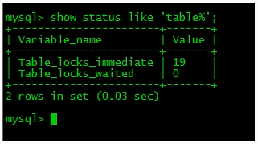
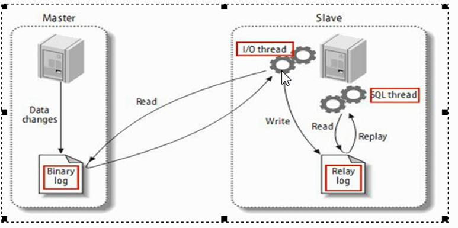
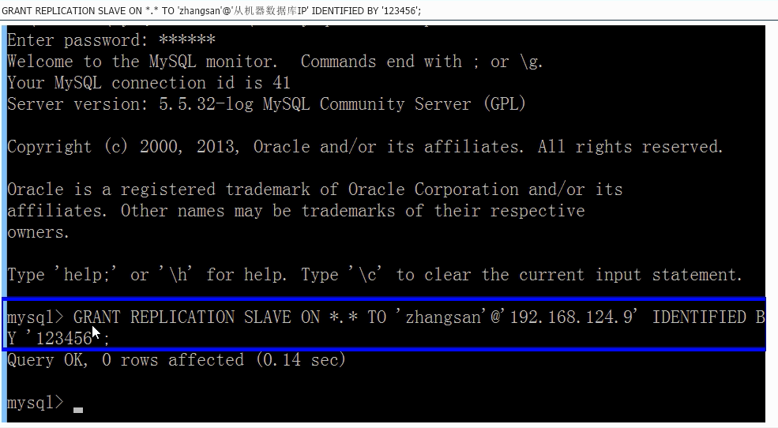
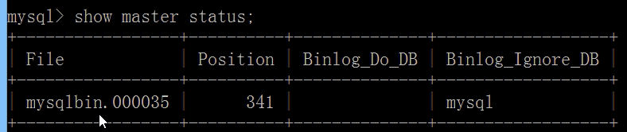
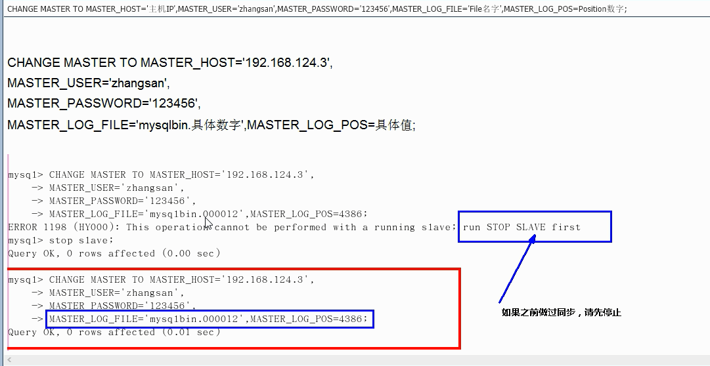
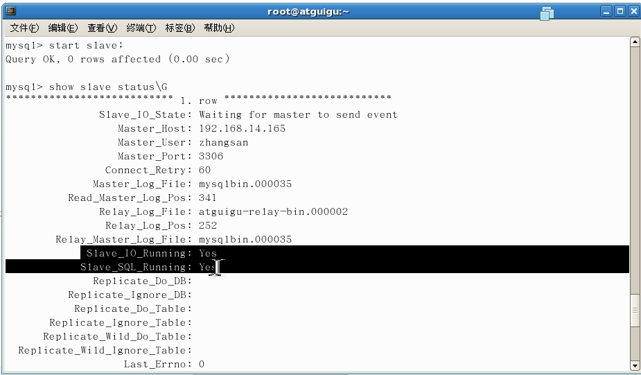

# 一、锁的概述

## 1、定义

锁是计算机协调多个进程或线程并发访问某一资源的机制。

在数据库中，除了传统的计算资源(如CPU、RAM、I/O等)的争用以外，数据也是一种供许多用户共享的资源。如何保证数据并发访问的一致性、有效性是所有数据库必须解决的一个问题，锁冲突也是影响数据库并发访问性能的一个重要因素。从这个角度来说，锁对数据库而言显的尤其重要，也更加复杂


## 2、锁的分类

### 1、从对数据操作的类型来分

```
读锁(共享锁S)
	针对同一份数据，多个读操作可以同时进行而不会互相影响。

写锁(排它锁X)
	当前写操作没有完成前，它会阻断其他写锁和读锁。
```

## 2、从对数据操作的类型


### 1、表锁   MyISAM

```
偏向 MyISAM 存储引擎，开销小，加锁快;无死锁;锁的力度大，发生锁冲突的概率最高，并发度最低。

手动增加表锁
	lock table 表名字 read(write), 表名字2 read(write),其他;
	例子：lock table mylock read,book write;
	
释放表锁
	unlock tables;
	
查看表上加的锁
	show open tables;
	
对于表锁是一个连接一锁，锁上以后需要自己释放。

1、表锁获取了写锁，也就获取了读锁。
2、表锁你获取过锁以后，你想查询别的表，你就必须先获取其表的表锁，或将锁释放掉。不然你就不能查询别的表。
	会报错，但是别的连接不会报错，而是一直等待
	Table 'department' was not locked with LOCK TABLES
3、别的连接查询(X锁)，更改 加了锁的表，会堵塞。直到加锁的连接将锁释放。
	如果没有阻塞，那就是mysql有缓存，你的查询的结果是从缓存取的(针对 X 锁)
```

结论

```
MyISAM 在执行查询语句(SELECT)前，会自动给涉及的所有表加读锁，在执行增删改操作前，会自动给涉及的表加写锁。
MYSQL的表级锁有两种模式：
	表共享读锁(Table Read Lock)
	表共享写锁(Table Write Lock)

1、对MyISAM表的读操作(加读锁)，不会阻塞其他进程对同一表的读请求，但会阻塞对同一表的写请求，只有当读锁释放后，才会执行其他进程的写操作。

2、对MyISAM表的写操作(加写锁)，会阻塞其他进程对同一表的读和写操作，只有当写锁释放后，才会执行其它进程的读写操作。
```


表锁分析

```
如何分析表锁定
可以通过检查 table_locks_waited 和 table_locks_immediate 状态变量来分析系统上的表锁定;

SQL: show status like 'table%';

这里有两个状态变量记录mySQL内部表级锁定的情况，两个变量说明如下：
	Table_locks_immediate : 产生表级锁定的次数，表示可以立即获取锁的查询次数，每次立即获取锁值加1；
	Table_locks_waited: 出现表级锁定争用而发生等待的次数(不能立即获取锁的次数，没等待一次锁值加1)，
    严重的表级锁争用情况。
    
此外，MyISAM的读写锁调度是写优先，这也是myisam不适合做 写为主表的引擎。因为写锁后，其他线程不能做任何操作，大量的更新会使查询很难得到锁，从而造成永远阻塞（就是如果同时请求锁，一个请求写锁，一个请求读锁。那么写锁先获取）
```




### 2、行锁   InnoDB

```
偏向InnoDB存储引擎，开销大，加锁慢;会出现死锁;锁定粒度最小,发生锁冲突的概率最低，并发度也最高
InnoDB与MyISAM的最大不同有两点:
	一、支持事务(transaction)
	二、采用了行级锁
	
	使用 for update;  X锁
	lock in share mode S锁
```

事务

```
原子性 Atomicity
	事务是一个原子操作单元，其对数据的修改，要么全部执行，要么全部不执行。
一致性 Consistent
	在事务开始和完成时，数据都必须保持一致状态。
隔离性	Lsolation
持久性 Durable

并发事务处理带来的问题
	脏读
	不可重复读
	幻读
	
查看当前数据库的事务隔离级别
show variables like 'tx_isolation';

关闭自动提交
set autocommit=0;
	innodb 下的每一个语句都是一个事务，默认自动提交，你可以将其关闭自动提交。
```

间隙锁

```
当我们用范围条件而不是相等条件检索数据，并请求共享或排他锁时，InnoDB会给符合条件的已有数据记录的索引项加锁;对于键值在条件范围内胆并不存在的记录，叫做 间隙 GAP ，
InnoDB 也会对这个'间隙'加锁，这种锁机制就是所谓的间隙锁(Next-Key锁)。

危害
	因为query执行过程中通过范围查找的话，他就锁定整个范围内所有的索引键值，即使这个键值并不存在。
	间隙锁有一个比较致命的弱点，就是当锁定一个范围键值之后，即使某些不存在的键值也会被无辜的锁定，而造成在锁定的时候无法插入锁定键值范围内的任何数据。在某些场景下这可能会对性能造成很大的危害
```


Innodb 和 myISAM 对比

```
InnoDB存储引擎由于实现了行级锁定，虽然在锁定机制的实现方面所带来的性能损耗可能比表级锁会要高些，但是在整体的并发出来能力方面要远远由于 MYISAM的表级锁定的。当系统并发量较高的时候，inndb的整体性能就会有比较明显的优势了
```


如何分析行锁定

```
通过检查 InnoDB_row_lock状态变量来分析系统上的行锁的争用情况
show status like 'innidb_row_lock%';\

对各个状态量的说明如下
Innodb_row_lock_current_waits 当前正在等待锁定的数量
Innodb_row_lock_time 从系统启动到现在锁定总时间长度
Innodb_row_lock_time_avg: 每次等待所花平均时间
Innodb_row_lock_time_max: 从系统启动到现在等待最长的一次所花的时间
Innodb_row_lock_waits: 系统起动后到现在总共等待的次数7

d尤其是当等待的次数很高，而且每次等待时长也不小的时候，我们就需要分析系统中为什么有如此多的等待，然后根据分析结果着手指定优化计划。
```


### 3、页锁	BDB	

```
开销和加锁时间介于表锁和行锁之间，会出现死锁；锁定粒度介于表锁和行锁之间，并发度一般
```


# 二、主从复制

## 1、复制的基本原理

slave 会从master读取 binlog来进行数据同步

三步骤



mysql复制过程分成三步；

​	1、master将改变记录到二进制日志(binary log).这些记录过程叫做二进制日志时间，binary log evevts;

​	2、slave将master的 binary log events拷贝到它的中继日志(relay log);

​	3、slave重做中继日志中的事件，将改变应用到自己的数据库中。Mysql复制是异步且串行化的

## 2、复制的基本原则

每个slave只有一个master

每个slave只能有一个唯一的服务器ID

每个master可以有多个salve


复制的最大问题  延迟

## 3、一主一从常见配置

Mysql版本一致且后台以服务运行

主从配置在[mysqld]节点下，都是小写

### 主机修改my.ini配置文件

```
【必须】主服务器唯一ID
server-id=1

【必须 】启用二进制日志
log-bin=自己本地的路径/mysqlbin
log-bin=D:/hah/MysqlServer5.5/data/mysqlbin

【可选】启用错误日志
log-err=自己本地的路径/mysqlerr
log-err=D:/hah/MysqlServer5.5/data/mysqlerr

【可选】根目录  mysql装在哪就写哪。
basedir="自己本地路径"
basedir="D:/devSoft/MySQLServer5.5/"

【可选】临时目录
tmpdir="自己的本地路径"
tmpdir="D:/hah/MySQLServer5.5"

【可选】数据目录 数据库的位置 
datadir="自己本地路径/Data"
datadir="D:/devSoft/MySQLServer5.5/Data/"

【可选】read-only=0
主机，读写都可以

【可选】设置不要复制的数据库
binlog-ignore-db=mysql 

【可选】设置需要复制的数据库
binlog-do-db=需要复制的主数据库名字

```


### 从机修改my.cnf配置文件

```
【必须】从服务器唯一ID
server-id=2

【可选】启动二进制日志  建议打开
log-bin=mysql-bin

```


因为修改过配置文件，请主机+从机都重启后台mysql服务

主机从机都关闭防火墙

​	linux 关闭防火墙 service iptables stop

### 在Windows主机上建立账户并授权slave

```
GRANT REPLICATION SLAVE ON *.* TO 'zhangsan'@'从机器数据库IP' IDENTIFIED BY '123456';
grant replication slave on *.* to 'zhangsan'@'从机器数据库IP' identified by '123456';
允许复制 从机 ip   将 账号： 张三 密码： 123456 授权给 从机器数据库IP ，从机可以通过 账号和密码登录主机

刷新一下这个命令
flush privileges;

查询master的状态(你每次操作过数据库以后，position和file有可能会变化)
show master status;
记录下file和 position 的值
file
	是二进制文件
position
	从file里面的 341 行开始抄
	记录了当前file文件的要复制的起点
	因为就算没有设置slave file也是一直存在的，我们每次操作数据库都会产生file,position就是标记从机应该从file的哪行开始复制

Binlog_Do_DB
	需要复制的数据库
Binlog_Ignore_DB
	忽略的数据库


```






### 在Linux从机上配置需要复制的主机

```
CHANGE MASTER TO MASTER_HOST='主机IP',
MASTER_USER='zhangsan',
MASTER_PASSWORD='123456',
MASTER_LOG_FILE='File名字',MASTER_LOG_POS=Position数字;

启动从服务器复制功能
start slave;

下面两个参数都是Yes,则说明从配置成功！
show slave status\G
	Slave_IO_Running:yes
	Slave_SQL_Running:yes
```





主机新建库、新建表、insert记录，从机复制

如何停止从服务复制功能

```
stop slave;
```

