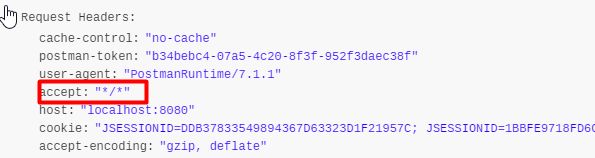

```
DataSourceInitializer一、**Spring Boot 入门
```

# 一、Spring Boot 简介

> 简化Spring应用开发的一个框架；
>
> 整个Spring技术栈的一个大整合；
>
> J2EE开发的一站式解决方案；

## 2、微服务

2014，martin fowler

微服务：架构风格（服务微化）

一个应用应该是一组小型服务；可以通过HTTP的方式进行互通；

单体应用：ALL IN ONE

微服务：每一个功能元素最终都是一个可独立替换和独立升级的软件单元；

[详细参照微服务文档](https://martinfowler.com/articles/microservices.html#MicroservicesAndSoa)


## 3、环境准备

http://www.gulixueyuan.com/ 谷粒学院

环境约束

–jdk1.8：Spring Boot 推荐jdk1.7及以上；java version "1.8.0_112"

–maven3.x：maven 3.3以上版本；Apache Maven 3.3.9

–IntelliJIDEA2017：IntelliJ IDEA 2017.2.2 x64、STS

–SpringBoot 1.5.9.RELEASE：1.5.9；

统一环境；


### 1、MAVEN设置；

给maven 的settings.xml配置文件的profiles标签添加

```xml
<profile>
  <id>jdk-1.8</id>
  <activation>
    <activeByDefault>true</activeByDefault>
    <jdk>1.8</jdk>
  </activation>
  <properties>
    <maven.compiler.source>1.8</maven.compiler.source>
    <maven.compiler.target>1.8</maven.compiler.target>
    <maven.compiler.compilerVersion>1.8</maven.compiler.compilerVersion>
  </properties>
</profile>
```

### 2、IDEA设置

整合maven进来；


## 4、Spring Boot HelloWorld

一个功能：

浏览器发送hello请求，服务器接受请求并处理，响应Hello World字符串；


### 1、创建一个maven工程；（jar）

### 2、导入spring boot相关的依赖

```xml
    <parent>
        <groupId>org.springframework.boot</groupId>
        <artifactId>spring-boot-starter-parent</artifactId>
        <version>1.5.9.RELEASE</version>
    </parent>
    <dependencies>
        <dependency>
            <groupId>org.springframework.boot</groupId>
            <artifactId>spring-boot-starter-web</artifactId>
        </dependency>
    </dependencies>
```

### 3、编写一个主程序；启动Spring Boot应用

```java
/**
 *  @SpringBootApplication 来标注一个主程序类，说明这是一个Spring Boot应用
 */
@SpringBootApplication
public class HelloWorldMainApplication {

    public static void main(String[] args) {

        // Spring应用启动起来
        SpringApplication.run(HelloWorldMainApplication.class,args);
    }
}
```

### 4、编写相关的Controller、Service

```java
@Controller
public class HelloController {

    @ResponseBody
    @RequestMapping("/hello")
    public String hello(){
        return "Hello World!";
    }
}

```


### 5、运行主程序测试

### 6、简化部署

```xml
 <!-- 这个插件，可以将应用打包成一个可执行的jar包；-->
    <build>
        <plugins>
            <plugin>
                <groupId>org.springframework.boot</groupId>
                <artifactId>spring-boot-maven-plugin</artifactId>
            </plugin>
        </plugins>
    </build>
```

将这个应用打成jar包，直接使用java -jar的命令进行执行；

## 5、Hello World探究

### 1、POM文件

#### 1、父项目

```xml
<parent>
    <groupId>org.springframework.boot</groupId>
    <artifactId>spring-boot-starter-parent</artifactId>
    <version>1.5.9.RELEASE</version>
</parent>

他的父项目是
<parent>0
  <groupId>org.springframework.boot</groupId>
  <artifactId>spring-boot-dependencies</artifactId>
  <version>1.5.9.RELEASE</version>
  <relativePath>../../spring-boot-dependencies</relativePath>
</parent>
他来真正管理Spring Boot应用里面的所有依赖版本；

```

Spring Boot的版本仲裁中心；

以后我们导入依赖默认是不需要写版本；（没有在dependencies里面管理的依赖自然需要声明版本号）

#### 2、启动器

```xml
<dependency>
    <groupId>org.springframework.boot</groupId>
    <artifactId>spring-boot-starter-web</artifactId>
</dependency>
```

**spring-boot-starter**-==web==：

​	spring-boot-starter：spring-boot场景启动器；帮我们导入了web模块正常运行所依赖的组件；


Spring Boot将所有的功能场景都抽取出来，做成一个个的starters（启动器），只需要在项目里面引入这些starter相关场景的所有依赖都会导入进来。要用什么功能就导入什么场景的启动器


### 2、主程序类，主入口类

```java
/**
 *  @SpringBootApplication 来标注一个主程序类，说明这是一个Spring Boot应用
 */
@SpringBootApplication
public class HelloWorldMainApplication {

    public static void main(String[] args) {

        // Spring应用启动起来
        SpringApplication.run(HelloWorldMainApplication.class,args);
    }
}

```

@**SpringBootApplication**:    Spring Boot应用标注在某个类上说明这个类是SpringBoot的主配置类，SpringBoot就应该运行这个类的main方法来启动SpringBoot应用；


```java
@Target(ElementType.TYPE)
@Retention(RetentionPolicy.RUNTIME)
@Documented
@Inherited
@SpringBootConfiguration
@EnableAutoConfiguration
@ComponentScan(excludeFilters = {
      @Filter(type = FilterType.CUSTOM, classes = TypeExcludeFilter.class),
      @Filter(type = FilterType.CUSTOM, classes = AutoConfigurationExcludeFilter.class) })
public @interface SpringBootApplication {
```

@**SpringBootConfiguration**:Spring Boot的配置类；

​		标注在某个类上，表示这是一个Spring Boot的配置类；

​		@**Configuration**:配置类上来标注这个注解；

​			配置类 -----  配置文件；配置类也是容器中的一个组件；@Component


@**EnableAutoConfiguration**：开启自动配置功能；

​		以前我们需要配置的东西，Spring Boot帮我们自动配置；@**EnableAutoConfiguration**告诉SpringBoot开启自动配置功能；这样自动配置才能生效；

```java
@AutoConfigurationPackage
@Import(EnableAutoConfigurationImportSelector.class)
public @interface EnableAutoConfiguration {
```

​      	@**AutoConfigurationPackage**：自动配置包

​		@**Import**(AutoConfigurationPackages.Registrar.class)：

​		Spring的底层注解@Import，给容器中导入一个组件；导入的组件由AutoConfigurationPackages.Registrar.class；

==将主配置类（@SpringBootApplication标注的类）的所在包及下面所有子包里面的所有组件扫描到Spring容器；==

​	@**Import**(EnableAutoConfigurationImportSelector.class)；

​		给容器中导入组件？

​		**EnableAutoConfigurationImportSelector**：导入哪些组件的选择器；

​		将所有需要导入的组件以全类名的方式返回；这些组件就会被添加到容器中；

​		会给容器中导入非常多的自动配置类（xxxAutoConfiguration）；就是给容器中导入这个场景需要的所有组件，并配置好这些组件；		

有了自动配置类，免去了我们手动编写配置注入功能组件等的工作；

​		SpringFactoriesLoader.loadFactoryNames(EnableAutoConfiguration.class,classLoader)；


==Spring Boot在启动的时候从类路径下的META-INF/spring.factories中获取EnableAutoConfiguration指定的值，将这些值作为自动配置类导入到容器中，自动配置类就生效，帮我们进行自动配置工作；==以前我们需要自己配置的东西，自动配置类都帮我们；

J2EE的整体整合解决方案和自动配置都在spring-boot-autoconfigure-1.5.9.RELEASE.jar；


​		

==Spring注解版（谷粒学院）==


## 6、使用Spring Initializer快速创建Spring Boot项目

### 1、IDEA：使用 Spring Initializer快速创建项目

IDE都支持使用Spring的项目创建向导快速创建一个Spring Boot项目；

选择我们需要的模块；向导会联网创建Spring Boot项目；

默认生成的Spring Boot项目；

- 主程序已经生成好了，我们只需要我们自己的逻辑
- resources文件夹中目录结构
  - static：保存所有的静态资源； js css  images；
  - templates：保存所有的模板页面；（Spring Boot默认jar包使用嵌入式的Tomcat，默认不支持JSP页面）；可以使用模板引擎（freemarker、thymeleaf）；
  - application.properties：Spring Boot应用的配置文件；可以修改一些默认设置；

### 2、STS使用 Spring Starter Project快速创建项目


------


# 二、配置文件

## 1、配置文件

SpringBoot使用一个全局的配置文件，配置文件名是固定的；

•application.properties

•application.yml


配置文件的作用：修改SpringBoot自动配置的默认值；SpringBoot在底层都给我们自动配置好；


YAML（YAML Ain't Markup Language）

​	YAML  A Markup Language：是一个标记语言

​	YAML   isn't Markup Language：不是一个标记语言；

标记语言：

​	以前的配置文件；大多都使用的是  **xxxx.xml**文件；

​	YAML：**以数据为中心**，比json、xml等更适合做配置文件；

​	YAML：配置例子

```yaml
server:
  port: 8081
```

​	XML：

```xml
<server>
	<port>8081</port>
</server>
```


## 2、YAML语法：

### 1、基本语法

k:(空格)v：表示一对键值对（空格必须有）；

以**空格**的缩进来控制层级关系；只要是左对齐的一列数据，都是同一个层级的

```yaml
server:
    port: 8081
    path: /hello
```

属性和值也是大小写敏感；


### 2、值的写法

#### 字面量：普通的值（数字，字符串，布尔）

​	k: v：字面直接来写；

​		字符串默认不用加上单引号或者双引号；  默认为双引号

​		""：双引号；不会转义字符串里面的特殊字符；特殊字符会作为本身想表示的意思

​				name:   "zhangsan \n lisi"：输出；zhangsan 换行  lisi

​		''：单引号；会转义特殊字符，特殊字符最终只是一个普通的字符串数据

​				name:   ‘zhangsan \n lisi’：输出；zhangsan \n  lisi


#### 对象、Map（属性和值）（键值对）：

​	k: v：在下一行来写对象的属性和值的关系；注意缩进

​		对象还是k: v的方式

```yaml
friends:
		lastName: zhangsan
		age: 20
```

行内写法：

```yaml
friends: {lastName: zhangsan,age: 18}
```


#### 数组（List、Set）：

用- 值表示数组中的一个元素

```yaml
pets:
 - cat
 - dog
 - pig
```

行内写法

```yaml
pets: [cat,dog,pig]
```

@**ConfigurationProperties**: 

告诉 SpringBoot 将本类中的所有的属性和配置文件中相关的配置进行绑定

​	prefix = "person" 配置文件中哪个下面的所有属性进行一一映射

```java
 @ConfigurationProperties(prefix = "person")
```

```pom
 <!-- 导入配置文件提示 -->
        <dependency>
            <groupId>org.springframework.boot</groupId>
            <artifactId>spring-boot-configuration-processor</artifactId>
            <optional>true</optional>
        </dependency>
```

## 3、配置文件的注入

配置文件

```yaml
server:
  port: 8080

person:
    age: 18
    lastName: zhangsan
    boss: false
    birth: 2017/12/12
    maps: {k1: v1,k2: v2}
    lists:
      - lisi
      - zhaoliu
    dog:
      name: 小狗
      age: 2
```

javaBean:

```java
/**
 * 将配置文件中配置的每一个属性的值，映射到这个组件中
 * @ConfigurationProperties: 告诉 SpringBoot 将本类中的所有的属性和配置文件中相关的配置
 *  进行绑定
 *  prefix = "person" 配置文件中哪个下面的所有属性进行一一映射
 *
 *  只有这个组件是容器中的组件才能使用 才能使用容器提供的  @ConfigurationProperties功能
 */
@Component
@ConfigurationProperties(prefix = "person")
public class Person {
	private String lastName;
	private Integer age;
	private Boolean boss;
	private Date birth;

	private Map<String, Object> maps;
	private List<Object> lists;
	private Dog dog;
}
```

@**ConfigurationProperties**: 

告诉 SpringBoot 将本类中的所有的属性和配置文件中相关的配置进行绑定

​	prefix = "person" 配置文件中哪个下面的所有属性进行一一映射

```java
 @ConfigurationProperties(prefix = "person")
```

```pom
 <!-- 导入配置文件提示 -->
        <dependency>
            <groupId>org.springframework.boot</groupId>
            <artifactId>spring-boot-configuration-processor</artifactId>
            <optional>true</optional>
        </dependency>
```

#### 1、Properties配置

```properties
#idea默认编码是Utf-8
# 在这里是 utf-8 在运行会把 张三转换成 ASCII
person.last-name=张三
person.age=18
person.birth=2017/12/15
person.boss=false
person.maps.k1=v1
person.maps.k2=v2
person.lists=a,b,c
person.dog.name=dog
per.dog.age=15
```

在 File Encoding --> properties 选择 UTF-8  并将 Transparent native-to-ascii conversion 勾上

解决 properites 的编码问题


#### 2、@Value 获取值和 @ConfigurationProperties 获取值比较

|                | @ConfigurationProperties              | @Value       |
| -------------- | ------------------------------------- | ------------ |
| 功能           | 批量注入配置文件中的属性              | 一个一个指定 |
| 松散绑定       | last-name 和 lastName 一样的意思,支持 | 不支持       |
| spEL           | 不支持                                | 支持         |
| JSR303数据校验 | 支持                                  | 不支持       |
| 复杂类型封装   | 支持                                  | 不支持       |

如果说，我们只是在某个业务逻辑中需要获取一下配置文件中的某个值。就使用 @Value

如果说，我们专门编写了一个javaBean来和配置文件进行映射，我们就使用@ConfigurationProperties


#### 3、配置文件注入值数据校验

@ConfigurationProperties 支持 JSR303数据校验 加上 @Validated 注解

必须手动将其加入 Spring 容器才可以

```java
@Component
@ConfigurationProperties(prefix = "person")
@Validated
public class Person {
	@Email // 必须是邮箱格式
	private String lastName;
	private Integer age;
	private Boolean boss;
	private Date birth;

	private Map<String, Object> maps;
	private List<Object> lists;
	private Dog dog;
}
```

```java
@Target({ElementType.TYPE, ElementType.METHOD})
@Retention(RetentionPolicy.RUNTIME)
@Documented
public @interface ConfigurationProperties {}
```

```java
@Target({ElementType.TYPE})
@Retention(RetentionPolicy.RUNTIME)
@Documented
@Import({EnableConfigurationPropertiesImportSelector.class})
public @interface EnableConfigurationProperties {
    Class<?>[] value() default {};
}

```

@EnableConfigurationProperties(Person.class)

​	让 @ConfigurationProperties() 生效的注解。

当然你也可以直接将标注了 @ConfigurationProperties()  类的注解直接加入到容器中

但是你要进行自定义的 Starter 的话，是需要@EnableConfigurationProperties(value=要实例化的类)；

来进行实例化

#### 4、@PropertySource&@ImportResource

@PropertySource : 加载指定的配置文件；

```java
@Component
@ConfigurationProperties(prefix = "person")
//@Validated
@PropertySource(value = {"classpath:person.properties"})
public class Person {
	//@Email // 必须是邮箱格式
	private String lastName;
	private Integer age;
	private Boolean boss;
	private Date birth;

	private Map<String, Object> maps;
	private List<Object> lists;
	private Dog dog;
```

@ImportResource: 导入 Spring 的配置文件，让配置文件里面的内容生效

标注在一个配置类上

```java
@ImportResource(locations = {"classpath:beans.xml"})
@SpringBootApplication
public class SpringBoot01HelloworldQuickApplication {}
```

SpringBoot推荐的给容器中添加组件的方式:推荐使用全注解的方式

配置类 推荐

### 4、配置文件占位符

#### 1、随机数

```properties
${random.value}、${random.int}、${random.long}
${random.int(10)}、${random.int[1024,65536]}
```

#### 2、占位符之前配置的值，如果没有可以使用:指定默认值

```properties
person.last-name=张三${random.value}
person.birth=2017/12/15
person.dog.name=${person.last-name}_dog_${person.hello:haha}
```

```yaml
server:
  port: 8080
person:
    lastName: zhangsan
    boss: false
    birth: 2017/12/12
    maps: {k1: v1,k2: v2}
    lists:
      - lisi
      - zhaoliu
    dog:
      name: 小狗${person.lastName}
      age: 2
    age: 18
```

### 5、Profile

#### 1、多profile文件

我们在主配置文件编写的时候，文件名可以是 application-{profile}.properties/yml

默认使用 application.properties 的配置;

#### 2、properties激活开发环境

在application.properties里面输入你要激活的环境

就能激活application-{profile}.properties的开发环境

```pro
spring.profiles.active=prod
```

#### 3、yml 支持多文档快方式

使用  --- 分割。--- 上面就是一个文档块。下面又是一个文档块

#### 4、yml profile 激活开发环境

```yaml
servet:
  port: 8081
spring: 
  profiles:
    active: dev
---
server:
  port: 8083
spring:
  profiles: dev
---
server:
  port: 8084
spring:
  profiles: prod
```

使用 

spring: 
  profiles:
    active: dev

​	来指定要运行的开发环境。默认运行第一个文档块

spring:
  profiles: prod

​	使用上面的来指定，该文档块的开发环境

#### 5、使用命令行方式激活指定profile

1、在配置文件中指定 spring.profiles.active=dev

2.命令行

​     在 IDE 的 program arguments:里面输入也可以在cmd里面

​	    --spring.profiles-active=dev

​    在 IDE 的 VM options 里面输入修改虚拟机的参数方式

​	-Dspring.profiles.active=dev


##### 配置文件加载位置

spring boot 启动会扫描以下位置的 application.properties 或者 application.yml 文件作为spring boot 的默认配置文件

- file: ./config/    就是项目根目录的 config 文件夹下

- file: ./    就是项目根目录下

- classpath: /config

- classpath: /

  以上是按照优先级**从高到低**的顺序，所有位置的文件都会被加载，**高优先级配置内容**会覆盖**低优先级配置**内容

  springBoto从这四个位置全部加载主配置文件，**互补配置**

```properties
#配置项目的访问路径
server.context-path=/boot02
```

 我们也可以通过配置spring.config.location来改变默认配置

项目打包好以后，我们可以使用命令行参数的形式，启动项目的时候来指定配置文件的新位置;

指定配置文件和默认加载的这些配置文件共同起作用形成互补配置;

必须要项目打包好以后，使用命令行的方式

​	--pring.config.location=配置文件的路径


### 6、外部配置加载顺序

**==SpringBoot也可以从以下位置加载配置； 优先级从高到低；高优先级的配置覆盖低优先级的配置，所有的配置会形成互补配置==**

**1.命令行参数**

所有的配置都可以在命令行上进行指定

java -jar spring-boot-02-config-02-0.0.1-SNAPSHOT.jar --server.port=8087  --server.context-path=/abc

多个配置用空格分开； --配置项=值


2.来自java:comp/env的JNDI属性

3.Java系统属性（System.getProperties()）

4.操作系统环境变量

5.RandomValuePropertySource配置的random.*属性值


==**由jar包外向jar包内进行寻找；**==

==**优先加载带profile**==


**6.jar包外部的application-{profile}.properties或application.yml(带spring.profile)配置文件**

**7.jar包内部的application-{profile}.properties或application.yml(带spring.profile)配置文件**


==**再来加载不带profile**==

**8.jar包外部的application.properties或application.yml(不带spring.profile)配置文件**

**9.jar包内部的application.properties或application.yml(不带spring.profile)配置文件**


10.@Configuration注解类上的@PropertySource

11.通过SpringApplication.setDefaultProperties指定的默认属性

所有支持的配置加载来源；

[参考官方文档](https://docs.spring.io/spring-boot/docs/1.5.9.RELEASE/reference/htmlsingle/#boot-features-external-config)


### 7、自动配置原理

配置文件到底能写什么？怎么写？自动配置原理；

[配置文件能配置的属性参照](https://docs.spring.io/spring-boot/docs/1.5.9.RELEASE/reference/htmlsingle/#common-application-properties)

使用的是 @import 的三种导入组件的方式

```java
@Import
    1. @Import (要导入到容器中的组件); 容器中就会自动注册这个组件，id 默认是组件的全类名
    2. ImportSelector :返回需要导入的组件的全类名数组
    3. ImportBeanDefinitionRegistrar
```

```java

    @Import(value = { MyImportSelector.class }) 首先你需要一个自定义的类实现 ImportSelector 接口。 
        // 自定义逻辑  返回 需要导入的组件
        public class MyImportSelector implements ImportSelector {
        // 返回值，就是要导入到容器中的组件全类名
        @Override
        public String[] selectImports(AnnotationMetadata importingClassMetadata) {
            /*
             *  AnnotationMetadata 当前标注 @Import 注解的类的所有注解信息
             *  就是 标注 @Import 注解的类 标注的其他的注解的信息
             */
            return new String[]{};
        }
```

```java
@Import(value = { MyImportSelector.class, MyImportBeanDefinitionRegistrar.class})

        public class MyImportBeanDefinitionRegistrar implements ImportBeanDefinitionRegistrar {
        /** 
         * AnnotationMetadata ： 当前类的注解信息
         * BeanDefinitionRegistry ： bean 定义的注册类
         *  吧所有需要添加到容器中的 bean 调用
         *  BeanDefinitionRegistry.registerBeanDefinition 来注册类 手动注册 bean 到容器中
         */
        @Override
        public void registerBeanDefinitions(AnnotationMetadata importingClassMetadata, BeanDefinitionRegistry registry) {
            boolean definition = registry.containsBeanDefinition("person");
            if (definition) {
                // 自定义 bean 名
                // beanDefinition  RootBeanDefinition
                // 指定 bean 的定义信息，(Bean 的类型，bean...)
                RootBeanDefinition rootBeanDefinition = new RootBeanDefinition(Person.class);
                // 注册一个 Bean 指定 Bean 名
                registry.registerBeanDefinition("haha", rootBeanDefinition);
            }
        }
    }
        // 只是注册了 RootBeanDefinition 并没有将 bean 初始化。 因为只是 registerBeanDefinition 注册

            初始化会调用 invokeInitMethods(beanName, wrappedBean, mbd); mbd 就是 RootBeanDefinition
            这里的初始化是 实例已经创建好了 doCreateBean()
            充填好了 bean populateBean()
            invokeInitMethods() 进行调用 spring 的 init-menthod 方法; 再其前后调用 BeanPostProcessor

```

**自动配置原理**

1）、SrpingBoot启动的时候加载主配置类，开启了自动配置功能

2）、@EnableAutoConfiguration 作用

​	利用 @Import({EnableAutoConfigurationImportSelector.class}) 导入组件

```java
@Target({ElementType.TYPE})
@Retention(RetentionPolicy.RUNTIME)
@Documented
@Inherited
@AutoConfigurationPackage
@Import({EnableAutoConfigurationImportSelector.class})
public @interface EnableAutoConfiguration {
    String ENABLED_OVERRIDE_PROPERTY = "spring.boot.enableautoconfiguration";
    Class<?>[] exclude() default {};
    String[] excludeName() default {};
}
```

- 利用 EnableAutoConfigurationImportSelector 给容器中导入了一些组件

- 可以查看 selectImports()方法的内容

- List<String> configurations = this.getCandidateConfigurations(annotationMetadata, attributes);获取候选的配置

   - ```java
     SpringFactoriesLoader.loadFactoryNames()
     扫描所有 jar 包类路径下 META-INF/spring.factories 
     把扫描到的这些文件的内容包装成 properties 对象
     从properties中获取到EnableAutoConfiguration.class 类对应的的值，然后将他们添加在容器中
     ```

   - 将类路径下  META-INF/spring.factories  里面配置的所有 EnableAutoConfiguration 的值加入到了容器中;

3）、每一个自动配置类进行自动配置功能

4）、以HttpEncodingAutoConfiguration为例解释自动配置原理

```java
@Configuration // 表示这是一个配置类 
@EnableConfigurationProperties({HttpEncodingProperties.class})// 启动指定类的ConfigurationProperties 功能
@ConditionalOnWebApplication// spring 底层有有一个 @Conditional 注解，根据不同的条件，如果满足指定的
// 条件，整个配置类里面的配置才会生效，判断当前应用是是否是 web 应用，当前配置类生效。
// CharacterEncodingFilter: SpringMVC中进行乱码解决的过滤器
@ConditionalOnClass({CharacterEncodingFilter.class})// 判断我们当前项目有没有这个类
// 判断配置文件中是否存在某个配置 spring.http.encoding.enabled;如果不存在判断也是成立的
// 即使配置文件中不配置 spring.http.encoding.enabled 也是默认生效的
@ConditionalOnProperty(
    prefix = "spring.http.encoding",
    value = {"enabled"},
    matchIfMissing = true
)
public class HttpEncodingAutoConfiguration {
    // 将已经读取的配置文件的类自动注入
     private final HttpEncodingProperties properties;
    // 在只有一个有参构造器的情况下，参数的值就会从容器中拿
    public HttpEncodingAutoConfiguration(HttpEncodingProperties properties) {
		this.properties = properties;
	}

}
```

根据当前不同的条件判断，决定这个配置类是否生效

```java
	// 给容器中添加一个组件
    @Bean
    @ConditionalOnMissingBean({CharacterEncodingFilter.class})
    public CharacterEncodingFilter characterEncodingFilter() {
        CharacterEncodingFilter filter = new OrderedCharacterEncodingFilter();
        filter.setEncoding(this.properties.getCharset().name());
        filter.setForceRequestEncoding(this.properties.shouldForce(Type.REQUEST));
        filter.setForceResponseEncoding(this.properties.shouldForce(Type.RESPONSE));
        return filter;
    }
```


首先我们看下 EnableConfigurationProperties 原理

```java
@Target(ElementType.TYPE)
@Retention(RetentionPolicy.RUNTIME)
@Documented
// 注入EnableConfigurationPropertiesImportSelector 注册器，将 value指定的 class 注入到beanFactory
@Import(EnableConfigurationPropertiesImportSelector.class)
public @interface EnableConfigurationProperties {

	/**
	 * Convenient way to quickly register {@link ConfigurationProperties} annotated beans
	 * with Spring. Standard Spring Beans will also be scanned regardless of this value.
	 * @return {@link ConfigurationProperties} annotated beans to register
	 */
	Class<?>[] value() default {};

}
```

然后我们看下 HttpEncodingProperties

```java
@ConfigurationProperties( prefix = "spring.http.encoding")// 从配置文件中获取指定的注解进行绑定
public class HttpEncodingProperties {
```

结论：所有在配置类中能配置的属性都是在xxxProperties类中封装着，配置文件能配置什么就可以参照某个

功能对应的属性类

看下 ConditionalOnWebApplication 判断条件，满足条件才给注册配置类

```java
@Target({ElementType.TYPE, ElementType.METHOD})
@Retention(RetentionPolicy.RUNTIME)
@Documented
@Conditional({OnWebApplicationCondition.class})
public @interface ConditionalOnWebApplication {
}
```

看下 ConditionalOnClass

```java
@Target({ElementType.TYPE, ElementType.METHOD})
@Retention(RetentionPolicy.RUNTIME)
@Documented
@Conditional({OnClassCondition.class})
public @interface ConditionalOnClass {
```


精髓：

​	1）、SpringBoot启动会加载大量的自动配置类

​	2）、我们看我们需要的功能有没有SpringBoot默认写好的自动配置类

​	3）、我们再来看这个自动类中到底配置了哪些组件（只要我们要用的组件有，我们就不需要再来配置了）

​	4）、给容器中自动配置类添加组件的时候，会从Properties 类中获取某些属性。我们就可以在配置文件中指定这些属性的值；

xxxAutoConfiguraion  自动配置类

给容器中添加组件

xxxProperties： 封装配置文件中相关属性 


### 2、细节


#### 1、@Conditional派生注解（Spring注解版原生的@Conditional作用）

作用：必须是@Conditional指定的条件成立，才给容器中添加组件，配置类(或@Bean方法)里面的所有内容才生效；

| @Conditional扩展注解            | 作用（判断是否满足当前指定条件）                 |
| ------------------------------- | ------------------------------------------------ |
| @ConditionalOnJava              | 系统的java版本是否符合要求                       |
| @ConditionalOnBean              | 容器中存在指定Bean；                             |
| @ConditionalOnMissingBean       | 容器中不存在指定Bean；                           |
| @ConditionalOnExpression        | 满足SpEL表达式指定                               |
| @ConditionalOnClass             | 系统中有指定的类                                 |
| @ConditionalOnMissingClass      | 系统中没有指定的类                               |
| @ConditionalOnSingleCandidate   | 容器中只有一个指定的Bean，或者这个Bean是首选Bean |
| @ConditionalOnProperty          | 系统中指定的属性是否有指定的值                   |
| @ConditionalOnResource          | 类路径下是否存在指定资源文件                     |
| @ConditionalOnWebApplication    | 当前是web环境                                    |
| @ConditionalOnNotWebApplication | 当前不是web环境                                  |
| @ConditionalOnJndi              | JNDI存在指定项                                   |

**自动配置类必须在一定的条件下才能生效；**

我们怎么知道哪些自动配置类生效；

```properties
#开启springBoot的 debug
debug=true
```


**==我们可以通过启用  debug=true属性；来让控制台打印自动配置报告==**，这样我们就可以很方便的知道哪些自动配置类生效；

```java
=========================
AUTO-CONFIGURATION REPORT
=========================


Positive matches:（自动配置类启用的）
-----------------

   DispatcherServletAutoConfiguration matched:
      - @ConditionalOnClass found required class 'org.springframework.web.servlet.DispatcherServlet'; @ConditionalOnMissingClass did not find unwanted class (OnClassCondition)
      - @ConditionalOnWebApplication (required) found StandardServletEnvironment (OnWebApplicationCondition)
        
    
Negative matches:（没有启动，没有匹配成功的自动配置类）
-----------------

   ActiveMQAutoConfiguration:
      Did not match:
         - @ConditionalOnClass did not find required classes 'javax.jms.ConnectionFactory', 'org.apache.activemq.ActiveMQConnectionFactory' (OnClassCondition)

   AopAutoConfiguration:
      Did not match:
         - @ConditionalOnClass did not find required classes 'org.aspectj.lang.annotation.Aspect', 'org.aspectj.lang.reflect.Advice' (OnClassCondition)
        
```


# 三、日志

## 1、日志框架


 小张；开发一个大型系统；

​		1、System.out.println("")；将关键数据打印在控制台；去掉？写在一个文件？

​		2、框架来记录系统的一些运行时信息；日志框架 ；  zhanglogging.jar；

​		3、高大上的几个功能？异步模式？自动归档？xxxx？  zhanglogging-good.jar？ 

​		4、将以前框架卸下来？换上新的框架，重新修改之前相关的API；zhanglogging-prefect.jar；

​		5、JDBC---数据库驱动；

​			写了一个统一的接口层；日志门面（日志的一个抽象层）；logging-abstract.jar；

​			给项目中导入具体的日志实现就行了；我们之前的日志框架都是实现的抽象层；


**市面上的日志框架；**

JUL、JCL、Jboss-logging、logback、log4j、log4j2、slf4j....


| 日志门面  （日志的抽象层）                                   | 日志实现                                             |
| ------------------------------------------------------------ | ---------------------------------------------------- |
| ~~JCL（Jakarta  Commons Logging）~~    SLF4j（Simple  Logging Facade for Java）    **~~jboss-logging~~** | Log4j  JUL（java.util.logging）  Log4j2  **Logback** |

Logback 和 Log4j  是同一个人写的 Log4j   和 Log4j2   是 apache 的

SLF4j Logback 和 Log4j  都一个人写的

左边选一个门面（抽象层）、右边来选一个实现；

日志门面：  SLF4J；

日志实现：Logback；


SpringBoot：底层是Spring框架，Spring框架默认是用JCL；‘

​	**==SpringBoot选用 SLF4j和logback；==**

## 2、SLF4j使用

### 1、如何在系统中使用SLF4j   https://www.slf4j.org

以后开发的时候，日志记录方法的调用，不应该来直接调用日志的实现类，而是调用日志抽象层里面的方法；

给系统里面导入slf4j的jar和  logback的实现jar

```java
import org.slf4j.Logger;
import org.slf4j.LoggerFactory;

public class HelloWorld {
  public static void main(String[] args) {
    Logger logger = LoggerFactory.getLogger(HelloWorld.class);
    logger.info("Hello World");
  }
}
```

图示；


每一个日志的实现框架都有自己的配置文件。使用slf4j以后，**配置文件还是做成日志实现框架自己本身的配置文件；**

### 2、遗留问题

a（slf4j+logback）: Spring（commons-logging）、Hibernate（jboss-logging）、MyBatis、xxxx

统一日志记录，即使是别的框架和我一起统一使用slf4j进行输出？


**如何让系统中所有的日志都统一到slf4j；**

==1、将系统中其他日志框架先排除出去；==

==2、用中间包来替换原有的日志框架；==

==3、我们导入slf4j其他的实现==

## 3、SpringBoot日志关系

```xml
		<dependency>
			<groupId>org.springframework.boot</groupId>
			<artifactId>spring-boot-starter</artifactId>
		</dependency>
```


SpringBoot使用它来做日志功能；

```xml
	<dependency>
			<groupId>org.springframework.boot</groupId>
			<artifactId>spring-boot-starter-logging</artifactId>
		</dependency>
```

底层依赖关系


总结：

​	1）、SpringBoot底层也是使用slf4j+logback的方式进行日志记录

​	2）、SpringBoot也把其他的日志都替换成了slf4j；

​	3）、中间替换包？

```java
@SuppressWarnings("rawtypes")
public abstract class LogFactory {

    static String UNSUPPORTED_OPERATION_IN_JCL_OVER_SLF4J = "http://www.slf4j.org/codes.html#unsupported_operation_in_jcl_over_slf4j";

    static LogFactory logFactory = new SLF4JLogFactory();
```


​	4）、如果我们要引入其他框架？一定要把这个框架的默认日志依赖移除掉？

​			Spring框架用的是commons-logging；

```xml
		<dependency>
			<groupId>org.springframework</groupId>
			<artifactId>spring-core</artifactId>
			<exclusions>
				<exclusion>
					<groupId>commons-logging</groupId>
					<artifactId>commons-logging</artifactId>
				</exclusion>
			</exclusions>
		</dependency>
```

**==SpringBoot能自动适配所有的日志，而且底层使用slf4j+logback的方式记录日志，引入其他 框架的时候，只需要把这个框架依赖的日志框架排除掉即可；==**

## 4、日志使用；

### 1、默认配置

SpringBoot默认帮我们配置好了日志；

```java
	//记录器
	Logger logger = LoggerFactory.getLogger(getClass());
	@Test
	public void contextLoads() {
		//System.out.println();

		//日志的级别；
		//由低到高   trace<debug<info<warn<error
		//可以调整输出的日志级别；日志就只会在这个级别以以后的高级别生效
		logger.trace("这是trace日志...");
		logger.debug("这是debug日志...");
		//SpringBoot默认给我们使用的是info级别的，没有指定级别的就用SpringBoot默认规定的级别；root级别
		logger.info("这是info日志...");
		logger.warn("这是warn日志...");
		logger.error("这是error日志...");


	}
```


```
    日志输出格式：
		%d表示日期时间，
		%thread表示线程名，
		%-5level：级别从左显示5个字符宽度
		%logger{50} 表示logger名字最长50个字符，否则按照句点分割。 
		%msg：日志消息，
		%n是换行符
    -->
    %d{yyyy-MM-dd HH:mm:ss.SSS} [%thread] %-5level %logger{50} - %msg%n

```

SpringBoot修改日志的默认配置

```properties
logging.level.com.atguigu=trace


#logging.path=
# 不指定路径在当前项目下生成springboot.log日志
# 可以指定完整的路径；
#logging.file=G:/springboot.log

# 在当前磁盘的根路径下创建spring文件夹和里面的log文件夹；使用 spring.log 作为默认文件
logging.path=/spring/log

#  在控制台输出的日志的格式
logging.pattern.console=%d{yyyy-MM-dd} [%thread] %-5level %logger{50} - %msg%n
# 指定文件中日志输出的格式
logging.pattern.file=%d{yyyy-MM-dd} === [%thread] === %-5level === %logger{50} ==== %msg%n
```

### 2、指定配置

给类路径下放上每个日志框架自己的配置文件即可；SpringBoot就不使用他默认配置的了

| Logging System          | Customization                                                |
| ----------------------- | ------------------------------------------------------------ |
| Logback                 | `logback-spring.xml`, `logback-spring.groovy`, `logback.xml` or `logback.groovy` |
| Log4j2                  | `log4j2-spring.xml` or `log4j2.xml`                          |
| JDK (Java Util Logging) | `logging.properties`                                         |

logback.xml：直接就被日志框架识别了；

**logback-spring.xml**：日志框架就不直接加载日志的配置项，由SpringBoot解析日志配置，可以使用SpringBoot的高级Profile功能

```xml
<springProfile name="staging">
    <!-- configuration to be enabled when the "staging" profile is active -->
  	可以指定某段配置只在某个环境下生效
</springProfile>

```

如：

```xml
<appender name="stdout" class="ch.qos.logback.core.ConsoleAppender">
        <!--
        日志输出格式：
			%d表示日期时间，
			%thread表示线程名，
			%-5level：级别从左显示5个字符宽度
			%logger{50} 表示logger名字最长50个字符，否则按照句点分割。 
			%msg：日志消息，
			%n是换行符
        -->
        <layout class="ch.qos.logback.classic.PatternLayout">
            <springProfile name="dev">
                <pattern>%d{yyyy-MM-dd HH:mm:ss.SSS} ----> [%thread] ---> %-5level %logger{50} - %msg%n</pattern>
            </springProfile>
            <springProfile name="!dev">
                <pattern>%d{yyyy-MM-dd HH:mm:ss.SSS} ==== [%thread] ==== %-5level %logger{50} - %msg%n</pattern>
            </springProfile>
        </layout>
    </appender>
```


如果使用logback.xml作为日志配置文件，还要使用profile功能，会有以下错误

 `no applicable action for [springProfile]`

## 5、切换日志框架

可以按照slf4j的日志适配图，进行相关的切换；

slf4j+log4j的方式；

```xml
<dependency>
  <groupId>org.springframework.boot</groupId>
  <artifactId>spring-boot-starter-web</artifactId>
  <exclusions>
    <exclusion>
      <artifactId>logback-classic</artifactId>
      <groupId>ch.qos.logback</groupId>
    </exclusion>
    <exclusion>
      <artifactId>log4j-over-slf4j</artifactId>
      <groupId>org.slf4j</groupId>
    </exclusion>
  </exclusions>
</dependency>

<dependency>
  <groupId>org.slf4j</groupId>
  <artifactId>slf4j-log4j12</artifactId>
</dependency>

```


切换为log4j2

```xml
   <dependency>
            <groupId>org.springframework.boot</groupId>
            <artifactId>spring-boot-starter-web</artifactId>
            <exclusions>
                <exclusion>
                    <artifactId>spring-boot-starter-logging</artifactId>
                    <groupId>org.springframework.boot</groupId>
                </exclusion>
            </exclusions>
        </dependency>

<dependency>
  <groupId>org.springframework.boot</groupId>
  <artifactId>spring-boot-starter-log4j2</artifactId>
</dependency>
```

------

# 四、Web开发

## 1、简介

使用了 WebMvcAutoConfiguration 来进行资源配置

使用SpringBoot；

**1）、创建SpringBoot应用，选中我们需要的模块；**

**2）、SpringBoot已经默认将这些场景配置好了，只需要在配置文件中指定少量配置就可以运行起来**

**3）、自己编写业务代码；**

 **自动配置原理？**

这个场景SpringBoot帮我们配置了什么？能不能修改？能修改哪些配置？能不能扩展？xxx

```
xxxxAutoConfiguration：帮我们给容器中自动配置组件；
xxxxProperties:配置类来封装配置文件的内容；


```


## 2、SpringBoot对静态资源的映射规则；

```java
public void addResourceHandlers(ResourceHandlerRegistry registry) {
			if (!this.resourceProperties.isAddMappings()) {
				logger.debug("Default resource handling disabled");
				return;
			}
			Integer cachePeriod = this.resourceProperties.getCachePeriod();
			if (!registry.hasMappingForPattern("/webjars/**")) {
				customizeResourceHandlerRegistration(
						registry.addResourceHandler("/webjars/**")
								.addResourceLocations(
										"classpath:/META-INF/resources/webjars/")
						.setCachePeriod(cachePeriod));
			}
    		// staticPathPattern = "/**";
			String staticPathPattern  = this.mvcProperties.getStaticPathPattern();
    		// 如果没有 "/**"; 映射就使用下面的
   			// this.resourceProperties.getStaticLocations() 等于
    		// "/" 
    		"classpath:/META-INF/resources/",
    		"classpath:/resources/",
			"classpath:/static/", 
    		"classpath:/public/"
			if (!registry.hasMappingForPattern(staticPathPattern)) {
				customizeResourceHandlerRegistration(
						registry.addResourceHandler(staticPathPattern)
								.addResourceLocations(
										this.resourceProperties.getStaticLocations())
						.setCachePeriod(cachePeriod));
			}
		}

// 欢迎页映射
		@Bean
		public WelcomePageHandlerMapping welcomePageHandlerMapping(
				ResourceProperties resourceProperties) {
            // getWelcomePage() 就是 getStaticLocations() 然后加上 +"index.html"
            //getStaticPathPattern() 就是 "/**"
			return new WelcomePageHandlerMapping(resourceProperties.getWelcomePage(),
					this.mvcProperties.getStaticPathPattern());
		}
// 配置喜欢的图标
		@Configuration
		@ConditionalOnProperty(value = "spring.mvc.favicon.enabled", matchIfMissing = true)
public static class FaviconConfiguration {

			private final ResourceProperties resourceProperties;

			public FaviconConfiguration(ResourceProperties resourceProperties) {
				this.resourceProperties = resourceProperties;
			}

			@Bean
			public SimpleUrlHandlerMapping faviconHandlerMapping() {
				SimpleUrlHandlerMapping mapping = new SimpleUrlHandlerMapping();
                // 应该是设置优先级 有个 PriorityOrder 和 Order
				mapping.setOrder(Ordered.HIGHEST_PRECEDENCE + 1);
                //  **/favicon.ico
                // 设置映射为"/"
				mapping.setUrlMap(Collections.singletonMap("**/favicon.ico",
						faviconRequestHandler()));
				return mapping;
			}

			@Bean
			public ResourceHttpRequestHandler faviconRequestHandler() {
				ResourceHttpRequestHandler requestHandler = new ResourceHttpRequestHandler();
				requestHandler
						.setLocations(this.resourceProperties.getFaviconLocations());
				return requestHandler;
			}

		}

	}
```

this.resourceProperties.getStaticLocations() 就是 RESOURCE_LOCATIONS 数组里面的值

```java
private static final String[] SERVLET_RESOURCE_LOCATIONS = { "/" };

	private static final String[] CLASSPATH_RESOURCE_LOCATIONS = {
			"classpath:/META-INF/resources/", "classpath:/resources/",
			"classpath:/static/", "classpath:/public/" };

	private static final String[] RESOURCE_LOCATIONS;

	static {
		RESOURCE_LOCATIONS = new String[CLASSPATH_RESOURCE_LOCATIONS.length
				+ SERVLET_RESOURCE_LOCATIONS.length];
		System.arraycopy(SERVLET_RESOURCE_LOCATIONS, 0, RESOURCE_LOCATIONS, 0,
				SERVLET_RESOURCE_LOCATIONS.length);
		System.arraycopy(CLASSPATH_RESOURCE_LOCATIONS, 0, RESOURCE_LOCATIONS,
				SERVLET_RESOURCE_LOCATIONS.length, CLASSPATH_RESOURCE_LOCATIONS.length);
	}
```


1)、所有/webjars/**, 都去 classpath:/META-INF/resources/webjars/ 找资源

webjars： 以 jar 包的方式引入静态资源；

http://www.webjars.org/


localhost:8080/webjars/jquery/3.3.1/jquery.js

```xml
<!--引入jquery-webjar-->在访问的时候只需要写webjars下面资源的名称即可
		<dependency>
			<groupId>org.webjars</groupId>
			<artifactId>jquery</artifactId>
			<version>3.3.1</version>
		</dependency>
```

==2）、"/**" 访问当前项目的任何资源，都去（静态资源的文件夹）找映射==

```
 "classpath:/META-INF/resources/", 
"classpath:/resources/",
"classpath:/static/", 
"classpath:/public/" 
"/"：当前项目的根路径

```

localhost:8080/abc ===  去静态资源文件夹里面找abc

==3）、欢迎页； 静态资源文件夹下的所有index.html页面；被"/**"映射；==

​	localhost:8080/   找index页面

==4）、所有的 **/favicon.ico  都是在静态资源文件下找；==


## 3、模板引擎

JSP、Velocity、Freemarker、Thymeleaf


SpringBoot推荐的Thymeleaf；

语法更简单，功能更强大；


### 1、引入thymeleaf；

```xml
		<dependency>
			<groupId>org.springframework.boot</groupId>
			<artifactId>spring-boot-starter-thymeleaf</artifactId>
          	2.1.6
		</dependency>
切换thymeleaf版本
<properties>
     <!-- 我们可以去 github 上面搜索 thymeleaf 和  thymeleaf-layout-dialect
		取其最新的版本即可
-->
		<thymeleaf.version>3.0.9.RELEASE</thymeleaf.version>
		<!-- 布局功能的支持程序  thymeleaf3主程序  layout2以上版本 -->
		<!-- thymeleaf2   layout1-->
		<thymeleaf-layout-dialect.version>2.2.2</thymeleaf-layout-dialect.version>
  </properties>
```

### 2、Thymeleaf使用

```java
@ConfigurationProperties(prefix = "spring.thymeleaf")
public class ThymeleafProperties {

	private static final Charset DEFAULT_ENCODING = Charset.forName("UTF-8");

	private static final MimeType DEFAULT_CONTENT_TYPE = MimeType.valueOf("text/html");

	public static final String DEFAULT_PREFIX = "classpath:/templates/";

	public static final String DEFAULT_SUFFIX = ".html";
  	//
```

只要我们把HTML页面放在classpath:/templates/，thymeleaf就能自动渲染；

使用：

1、导入thymeleaf的名称空间

```xml
<html lang="en" xmlns:th="http://www.thymeleaf.org">
```

2、使用thymeleaf语法；

```html
<!DOCTYPE html>
<html lang="en" xmlns:th="http://www.thymeleaf.org">
<head>
    <meta charset="UTF-8">
    <title>Title</title>
</head>
<body>
    <h1>成功！</h1>
    <!--th:text 将div里面的文本内容设置为 -->
    <div th:text="${hello}">这是显示欢迎信息</div>
</body>
</html>
```

### 3、语法规则

1）、th:text; 改变当前元素里面的文本内容;

​	th: 任意 html 属性：来替换原生属性的值

### 3、语法规则

1）、th:text；改变当前元素里面的文本内容；

​	th：任意html属性；来替换原生属性的值


2）、表达式？

```properties
Simple expressions:（表达式语法）
    Variable Expressions: ${...}：获取变量值；OGNL；
    		1）、获取对象的属性、调用方法
    		2）、使用内置的基本对象：
    			#ctx : the context object.
    			#vars: the context variables.
                #locale : the context locale.
                #request : (only in Web Contexts) the HttpServletRequest object.
                #response : (only in Web Contexts) the HttpServletResponse object.
                #session : (only in Web Contexts) the HttpSession object.
                #servletContext : (only in Web Contexts) the ServletContext object.
                
                ${session.foo}
            3）、内置的一些工具对象：
#execInfo : information about the template being processed.
#messages : methods for obtaining externalized messages inside variables expressions, in the same way as they would be obtained using #{…} syntax.
#uris : methods for escaping parts of URLs/URIs
#conversions : methods for executing the configured conversion service (if any).
#dates : methods for java.util.Date objects: formatting, component extraction, etc.
#calendars : analogous to #dates , but for java.util.Calendar objects.
#numbers : methods for formatting numeric objects.
#strings : methods for String objects: contains, startsWith, prepending/appending, etc.
#objects : methods for objects in general.
#bools : methods for boolean evaluation.
#arrays : methods for arrays.
#lists : methods for lists.
#sets : methods for sets.
#maps : methods for maps.
#aggregates : methods for creating aggregates on arrays or collections.
#ids : methods for dealing with id attributes that might be repeated (for example, as a result of an iteration).

    Selection Variable Expressions: *{...}：选择表达式：和${}在功能上是一样；
    	补充：配合 th:object="${session.user}：
   <div th:object="${session.user}">
    <p>Name: <span th:text="*{firstName}">Sebastian</span>.</p>
    <p>Surname: <span th:text="*{lastName}">Pepper</span>.</p>
    <p>Nationality: <span th:text="*{nationality}">Saturn</span>.</p>
    </div>
    
    Message Expressions: #{...}：获取国际化内容
    Link URL Expressions: @{...}：定义URL；
    		@{/order/process(execId=${execId},execType='FAST')}
    Fragment Expressions: ~{...}：片段引用表达式
    		<div th:insert="~{commons :: main}">...</div>
    		
Literals（字面量）
      Text literals: 'one text' , 'Another one!' ,…
      Number literals: 0 , 34 , 3.0 , 12.3 ,…
      Boolean literals: true , false
      Null literal: null
      Literal tokens: one , sometext , main ,…
Text operations:（文本操作）
    String concatenation: +
    Literal substitutions: |The name is ${name}|
Arithmetic operations:（数学运算）
    Binary operators: + , - , * , / , %
    Minus sign (unary operator): -
Boolean operations:（布尔运算）
    Binary operators: and , or
    Boolean negation (unary operator): ! , not
Comparisons and equality:（比较运算）
    Comparators: > , < , >= , <= ( gt , lt , ge , le )
    Equality operators: == , != ( eq , ne )
Conditional operators:条件运算（三元运算符）
    If-then: (if) ? (then)
    If-then-else: (if) ? (then) : (else)
    Default: (value) ?: (defaultvalue)
Special tokens:
    No-Operation: _  true ? a : _  代表如果为 false 不发生任何事 _
注释：
    单行：<!--/*  xxxxx  */-->    
    双行：          
    <!--/*-->          
         Xxxxxx          
         Xxxxxx         
    <!--*/-->
    
    th:each="emp:${emps}

```

片段引入(后面还有）

```html
1、
	片段：<nav class="navbar" th:fragment="topbar"> 使用 th:fragment 给片段命名
 	提取： <div th:replace="~{commons/bar :: topbar}"></div>  commons 是thmeleaf目录下的目录bar是		bar.html topbar 是命名的名字
        
2、
    片段：<nav  class="col-md" id="sidebar">
    提取：<div th:replace="~{commons/bar :: #sidebar(activeUri='emps')}"></div> #代表 selector
       就是选择器，id 用 # class 用 . 
        activeUri 是变量。就和java 的一样，传入值，可以在 片段的标签里面使用
        
        th:insert 将片段申明标签一起插入
        th:replace 将片段声明的标签去掉，将内容插入 (最常用)
        th:include 去掉声明提取的标签 将片段申明标签一起插入
        
   
        
```


## 4、SpringMVC自动配置

https://docs.spring.io/spring-boot/docs/1.5.10.RELEASE/reference/htmlsingle/#boot-features-developing-web-applications

### 1. Spring MVC auto-configuration

Spring Boot 自动配置好了SpringMVC

以下是SpringBoot对SpringMVC的默认配置:**==（WebMvcAutoConfiguration）==**

- Inclusion of `ContentNegotiatingViewResolver` and `BeanNameViewResolver` beans.

  - 自动配置了ViewResolver（视图解析器：根据方法的返回值得到视图对象（View），视图对象决定如何渲染（转发？重定向？））
  - ContentNegotiatingViewResolver：组合所有的视图解析器的；
  - ==如何定制：我们可以自己给容器中添加一个视图解析器；自动的将其组合进来；==

- Support for serving static resources, including support for WebJars (see below).静态资源文件夹路径,webjars

- Static `index.html` support. 静态首页访问

- Custom `Favicon` support (see below).  favicon.ico

  ​

- 自动注册了 of `Converter`, `GenericConverter`, `Formatter` beans.

  - Converter：转换器；  public String hello(User user)：类型转换使用Converter
  - `Formatter`  格式化器；  2017.12.17===Date；

```java
		@Bean
		@ConditionalOnProperty(prefix = "spring.mvc", name = "date-format")//在文件中配置日期格式化的规则
		public Formatter<Date> dateFormatter() {
			return new DateFormatter(this.mvcProperties.getDateFormat());//日期格式化组件
		}
```

​	==自己添加的格式化器转换器，我们只需要放在容器中即可==

- Support for `HttpMessageConverters` (see below).

  - HttpMessageConverter：SpringMVC用来转换Http请求和响应的；User---Json；

  - `HttpMessageConverters` 是从容器中确定；获取所有的HttpMessageConverter；

    ==自己给容器中添加HttpMessageConverter，只需要将自己的组件注册容器中（@Bean,@Component）==

    ​

- Automatic registration of `MessageCodesResolver` (see below).定义错误代码生成规则

- Automatic use of a `ConfigurableWebBindingInitializer` bean (see below).

  ==我们可以配置一个ConfigurableWebBindingInitializer来替换默认的；（添加到容器）==

  ```
  初始化WebDataBinder；
  请求数据=====JavaBean；
  
  ```

**org.springframework.boot.autoconfigure.web：web的所有自动场景；**

If you want to keep Spring Boot MVC features, and you just want to add additional [MVC configuration](https://docs.spring.io/spring/docs/4.3.14.RELEASE/spring-framework-reference/htmlsingle#mvc) (interceptors, formatters, view controllers etc.) you can add your own `@Configuration` class of type `WebMvcConfigurerAdapter`, but **without** `@EnableWebMvc`. If you wish to provide custom instances of `RequestMappingHandlerMapping`, `RequestMappingHandlerAdapter` or `ExceptionHandlerExceptionResolver` you can declare a `WebMvcRegistrationsAdapter` instance providing such components.

If you want to take complete control of Spring MVC, you can add your own `@Configuration` annotated with `@EnableWebMvc`.

### 2、扩展SpringMVC

```xml
    <mvc:view-controller path="/hello" view-name="success"/>
    <mvc:interceptors>
        <mvc:interceptor>
            <mvc:mapping path="/hello"/>
            <bean></bean>
        </mvc:interceptor>
    </mvc:interceptors>
```

**==编写一个配置类（@Configuration），是WebMvcConfigurerAdapter类型；不能标注@EnableWebMvc==**;

既保留了所有的自动配置，也能用我们扩展的配置；

```java
//使用WebMvcConfigurerAdapter可以来扩展SpringMVC的功能
@Configuration
public class MyMvcConfig extends WebMvcConfigurerAdapter {

    @Override
    public void addViewControllers(ViewControllerRegistry registry) {
       // super.addViewControllers(registry);
        //浏览器发送 /atguigu 请求来到 success
        registry.addViewController("/atguigu").setViewName("success");
    }
}
```

原理：

​	1）、WebMvcAutoConfiguration是SpringMVC的自动配置类

​	2）、在做其他自动配置时会导入；@Import(**EnableWebMvcConfiguration**.class)

```java
    @Configuration
	public static class EnableWebMvcConfiguration extends DelegatingWebMvcConfiguration {
      private final WebMvcConfigurerComposite configurers = new WebMvcConfigurerComposite();

	 //从容器中获取所有的WebMvcConfigurer
      @Autowired(required = false)
      public void setConfigurers(List<WebMvcConfigurer> configurers) {
          if (!CollectionUtils.isEmpty(configurers)) {
              this.configurers.addWebMvcConfigurers(configurers);
            	//一个参考实现；将所有的WebMvcConfigurer相关配置都来一起调用；  
            	@Override
             // public void addViewControllers(ViewControllerRegistry registry) {
              //    for (WebMvcConfigurer delegate : this.delegates) {
               //       delegate.addViewControllers(registry);
               //   }
              }
          }
        protected void addFormatters(FormatterRegistry registry) {
		this.configurers.addFormatters(registry);
	}
        
        @Override
	public void addFormatters(FormatterRegistry registry) {
        // 到了这里将所有相应继承了 WebMvcConfigurer 的实现的方法全部运行一遍、
        // 将其注入到 configurers 里面。
		for (WebMvcConfigurer delegate : this.delegates) {
			delegate.addFormatters(registry);
		}
	}
        
	}
//然后在 WebMvcConfigurationSupport 相应的 @Bean 方法里面 会调用
public class WebMvcConfigurationSupport implements ApplicationContextAware, ServletContextAware {
@Bean
public FormattingConversionService mvcConversionService() {
		FormattingConversionService conversionService = new 							          DefaultFormattingConversionService();
    	// 这里调用 上面的方法 将 conversionService 传入，最终所有的相应的方法产生的对象都会注入到 conversionService 里面。而 conversionService 最终会被通过 doCreateBean 等 SpringMVC 一系列
    IOC 容器初始化，最终会被保存在 IOC 容器中
		addFormatters(conversionService);
		return conversionService;
	}
}
```

就是SpringMVC 主要组件 @Bean 的时候，会进行设置，就会把所有的 WebMvcConfigurer 的类的方法运行一遍，这样就会把相应的数据设置进去了

​	3）、容器中所有的WebMvcConfigurer都会一起起作用；

​	4）、我们的配置类也会被调用；

​	效果：SpringMVC的自动配置和我们的扩展配置都会起作用；

### 3、全面接管SpringMVC；

SpringBoot对SpringMVC的自动配置不需要了，所有都是我们自己配置；所有的SpringMVC的自动配置都失效了

**我们需要在配置类中添加@EnableWebMvc即可；**

```java
//使用WebMvcConfigurerAdapter可以来扩展SpringMVC的功能
@EnableWebMvc
@Configuration
public class MyMvcConfig extends WebMvcConfigurerAdapter {

    @Override
    public void addViewControllers(ViewControllerRegistry registry) {
       // super.addViewControllers(registry);
        //浏览器发送 /atguigu 请求来到 success
        registry.addViewController("/atguigu").setViewName("success");
    }
}
```

原理：

为什么@EnableWebMvc自动配置就失效了；

1）@EnableWebMvc的核心

```java
@Import(DelegatingWebMvcConfiguration.class)
public @interface EnableWebMvc {
```

2）、

```java
@Configuration
public class DelegatingWebMvcConfiguration extends WebMvcConfigurationSupport {
```

3）、

```java
@Configuration
@ConditionalOnWebApplication
@ConditionalOnClass({ Servlet.class, DispatcherServlet.class,
		WebMvcConfigurerAdapter.class })
//容器中没有这个组件的时候，这个自动配置类才生效
@ConditionalOnMissingBean(WebMvcConfigurationSupport.class)
@AutoConfigureOrder(Ordered.HIGHEST_PRECEDENCE + 10)
@AutoConfigureAfter({ DispatcherServletAutoConfiguration.class,
		ValidationAutoConfiguration.class })
public class WebMvcAutoConfiguration {
```

4）、@EnableWebMvc将WebMvcConfigurationSupport组件导入进来；

5）、导入的WebMvcConfigurationSupport只是SpringMVC最基本的功能；


## 5、如何修改SpringBoot的默认配置

模式：

​	1）、SpringBoot在自动配置很多组件的时候，先看容器中有没有用户自己配置的（@Bean、@Component）如果有就用用户配置的，如果没有，才自动配置；如果有些组件可以有多个（ViewResolver）将用户配置的和自己默认的组合起来；

​	2）、在SpringBoot中会有非常多的xxxConfigurer帮助我们进行扩展配置

​	3）、在SpringBoot中会有很多的xxxCustomizer帮助我们进行定制配置

## 6、RestfulCRUD

### 1）、默认访问首页

```java
//使用WebMvcConfigurerAdapter可以来扩展SpringMVC的功能
//@EnableWebMvc   不要接管SpringMVC
@Configuration
public class MyMvcConfig extends WebMvcConfigurerAdapter {

    @Override
    public void addViewControllers(ViewControllerRegistry registry) {
       // super.addViewControllers(registry);
        //浏览器发送 /atguigu 请求来到 success
        registry.addViewController("/atguigu").setViewName("success");
    }

    //所有的WebMvcConfigurerAdapter组件都会一起起作用
    @Bean //将组件注册在容器
    public WebMvcConfigurerAdapter webMvcConfigurerAdapter(){
        WebMvcConfigurerAdapter adapter = new WebMvcConfigurerAdapter() {
            @Override
            public void addViewControllers(ViewControllerRegistry registry) {
                registry.addViewController("/").setViewName("login");
                registry.addViewController("/index.html").setViewName("login");
            }
        };
        return adapter;
    }
}

```

### 2）、国际化

**1）、编写国际化配置文件；**

2）、使用ResourceBundleMessageSource管理国际化资源文件

3）、在页面使用fmt:message取出国际化内容


步骤：

1）、编写国际化配置文件，抽取页面需要显示的国际化消息


2）、SpringBoot自动配置好了管理国际化资源文件的组件；

```java
@ConfigurationProperties(prefix = "spring.messages")
public class MessageSourceAutoConfiguration {
    
    /**
	 * Comma-separated list of basenames (essentially a fully-qualified classpath
	 * location), each following the ResourceBundle convention with relaxed support for
	 * slash based locations. If it doesn't contain a package qualifier (such as
	 * "org.mypackage"), it will be resolved from the classpath root.
	 */
	private String basename = "messages";  
    //我们的配置文件可以直接放在类路径下叫messages.properties；
    
    @Bean
	public MessageSource messageSource() {
		ResourceBundleMessageSource messageSource = new ResourceBundleMessageSource();
		if (StringUtils.hasText(this.basename)) {
            //设置国际化资源文件的基础名（去掉语言国家代码的）
			messageSource.setBasenames(StringUtils.commaDelimitedListToStringArray(
					StringUtils.trimAllWhitespace(this.basename)));
		}
		if (this.encoding != null) {
			messageSource.setDefaultEncoding(this.encoding.name());
		}
		messageSource.setFallbackToSystemLocale(this.fallbackToSystemLocale);
		messageSource.setCacheSeconds(this.cacheSeconds);
		messageSource.setAlwaysUseMessageFormat(this.alwaysUseMessageFormat);
		return messageSource;
	}
```


3）、去页面获取国际化的值；


```html
<!DOCTYPE html>
<html lang="en"  xmlns:th="http://www.thymeleaf.org">
	<head>
		<meta http-equiv="Content-Type" content="text/html; charset=UTF-8">
		<meta name="viewport" content="width=device-width, initial-scale=1, shrink-to-fit=no">
		<meta name="description" content="">
		<meta name="author" content="">
		<title>Signin Template for Bootstrap</title>
		<!-- Bootstrap core CSS -->
		<link href="asserts/css/bootstrap.min.css" th:href="@{/webjars/bootstrap/4.0.0/css/bootstrap.css}" rel="stylesheet">
		<!-- Custom styles for this template -->
		<link href="asserts/css/signin.css" th:href="@{/asserts/css/signin.css}" rel="stylesheet">
	</head>

	<body class="text-center">
		<form class="form-signin" action="dashboard.html">
			
			<h1 class="h3 mb-3 font-weight-normal" th:text="#{login.tip}">Please sign in</h1>
			<label class="sr-only" th:text="#{login.username}">Username</label>
			<input type="text" class="form-control" placeholder="Username" th:placeholder="#{login.username}" required="" autofocus="">
			<label class="sr-only" th:text="#{login.password}">Password</label>
			<input type="password" class="form-control" placeholder="Password" th:placeholder="#{login.password}" required="">
			<div class="checkbox mb-3">
				<label>
          		<input type="checkbox" value="remember-me"/> [[#{login.remember}]]
        </label>
			</div>
			<button class="btn btn-lg btn-primary btn-block" type="submit" th:text="#{login.btn}">Sign in</button>
			<p class="mt-5 mb-3 text-muted">© 2017-2018</p>
			<a class="btn btn-sm">中文</a>
			<a class="btn btn-sm">English</a>
		</form>

	</body>

</html>
```

效果：根据浏览器语言设置的信息切换了国际化；


原理：

​	国际化Locale（区域信息对象）；LocaleResolver（获取区域信息对象）；

```java
		@Bean
		@ConditionalOnMissingBean
		@ConditionalOnProperty(prefix = "spring.mvc", name = "locale")
		public LocaleResolver localeResolver() {
			if (this.mvcProperties
					.getLocaleResolver() == WebMvcProperties.LocaleResolver.FIXED) {
				return new FixedLocaleResolver(this.mvcProperties.getLocale());
			}
			AcceptHeaderLocaleResolver localeResolver = new AcceptHeaderLocaleResolver();
			localeResolver.setDefaultLocale(this.mvcProperties.getLocale());
			return localeResolver;
		}
默认的就是根据请求头带来的区域信息获取Locale进行国际化
```

4）、点击链接切换国际化

```java
/**
 * 可以在连接上携带区域信息
 */
public class MyLocaleResolver implements LocaleResolver {
    
    @Override
    public Locale resolveLocale(HttpServletRequest request) {
        String l = request.getParameter("l");
        Locale locale = Locale.getDefault();
        if(!StringUtils.isEmpty(l)){
            String[] split = l.split("_");
            locale = new Locale(split[0],split[1]);
        }
        return locale;
    }

    @Override
    public void setLocale(HttpServletRequest request, HttpServletResponse response, Locale locale) {

    }
}


 @Bean
    public LocaleResolver localeResolver(){
        return new MyLocaleResolver();
    }
}


```

### 3）、登陆

开发期间模板引擎页面修改以后，要实时生效

1）、禁用模板引擎的缓存

```
# 禁用缓存
spring.thymeleaf.cache=false 

```

2）、页面修改完成以后ctrl+f9：重新编译；


登陆错误消息的显示

```html
<p style="color: red" th:text="${msg}" th:if="${not #strings.isEmpty(msg)}"></p>
```


### 4）、拦截器进行登陆检查

拦截器

```java
/**
 * 登陆检查，
 */
public class LoginHandlerInterceptor implements HandlerInterceptor {
    //目标方法执行之前
    @Override
    public boolean preHandle(HttpServletRequest request, HttpServletResponse response, Object handler) throws Exception {
        Object user = request.getSession().getAttribute("loginUser");
        if(user == null){
            //未登陆，返回登陆页面
            request.setAttribute("msg","没有权限请先登陆");
            request.getRequestDispatcher("/index.html").forward(request,response);
            return false;
        }else{
            //已登陆，放行请求
            return true;
        }

    }

    @Override
    public void postHandle(HttpServletRequest request, HttpServletResponse response, Object handler, ModelAndView modelAndView) throws Exception {

    }

    @Override
    public void afterCompletion(HttpServletRequest request, HttpServletResponse response, Object handler, Exception ex) throws Exception {

    }
}

```


注册拦截器

```java
  //所有的WebMvcConfigurerAdapter组件都会一起起作用
    @Bean //将组件注册在容器
    public WebMvcConfigurerAdapter webMvcConfigurerAdapter(){
        WebMvcConfigurerAdapter adapter = new WebMvcConfigurerAdapter() {
            @Override
            public void addViewControllers(ViewControllerRegistry registry) {
                registry.addViewController("/").setViewName("login");
                registry.addViewController("/index.html").setViewName("login");
                registry.addViewController("/main.html").setViewName("dashboard");
            }

            //注册拦截器
            @Override
            public void addInterceptors(InterceptorRegistry registry) {
                //super.addInterceptors(registry);
                //静态资源；  *.css , *.js
                //SpringBoot已经做好了静态资源映射
                registry.addInterceptor(new LoginHandlerInterceptor()).addPathPatterns("/**")
                        .excludePathPatterns("/index.html","/","/user/login");
            }
        };
        return adapter;
    }
```

### 5）、CRUD-员工列表

实验要求：

1）、RestfulCRUD：CRUD满足Rest风格；

URI：  /资源名称/资源标识       HTTP请求方式区分对资源CRUD操作

|      | 普通CRUD（uri来区分操作） | RestfulCRUD       |
| ---- | ------------------------- | ----------------- |
| 查询 | getEmp                    | emp---GET         |
| 添加 | addEmp?xxx                | emp---POST        |
| 修改 | updateEmp?id=xxx&xxx=xx   | emp/{id}---PUT    |
| 删除 | deleteEmp?id=1            | emp/{id}---DELETE |

2）、实验的请求架构;

| 实验功能                             | 请求URI | 请求方式 |
| ------------------------------------ | ------- | -------- |
| 查询所有员工                         | emps    | GET      |
| 查询某个员工(来到修改页面)           | emp/1   | GET      |
| 来到添加页面                         | emp     | GET      |
| 添加员工                             | emp     | POST     |
| 来到修改页面（查出员工进行信息回显） | emp/1   | GET      |
| 修改员工                             | emp     | PUT      |
| 删除员工                             | emp/1   | DELETE   |

3）、员工列表：

#### thymeleaf公共页面元素抽取

```html
1、抽取公共片段
<div th:fragment="copy">
&copy; 2011 The Good Thymes Virtual Grocery
</div>

2、引入公共片段
两种写法都一样的
<div th:insert="~{footer :: copy}"></div>
<div th:insert="footer :: copy"></div>
~{templatename::selector}：模板名::选择器
~{templatename::fragmentname}:模板名::片段名

3、默认效果：
insert的公共片段在div标签中
如果使用th:insert等属性进行引入，可以不用写~{}：
行内写法可以加上：[[~{}]];[(~{})]；

<!-- 引入抽取的 topbar -->
	<!-- 模板名，会使用 thymeleaf 的前后缀配置规则进行解析-->
	<div th:insert="~{dashboard :: topbar}"></div>
```


三种引入公共片段的th属性：

**th:insert**：将公共片段整个插入到声明引入的元素中  （连标签一起）

**th:replace**：将声明引入的元素替换为公共片段

**th:include**：将被引入的片段的内容包含进这个标签中（不带最外层标签）


```html
<footer th:fragment="copy">
&copy; 2011 The Good Thymes Virtual Grocery
</footer>

引入方式
<div th:insert="footer :: copy"></div>
<div th:replace="footer :: copy"></div>
<div th:include="footer :: copy"></div>

效果
<div>
    <footer>
    &copy; 2011 The Good Thymes Virtual Grocery
    </footer>
</div>

<footer>
&copy; 2011 The Good Thymes Virtual Grocery
</footer>

<div>
&copy; 2011 The Good Thymes Virtual Grocery
</div>
```


引入片段的时候传入参数： 

```html
<nav class="col-md-2 d-none d-md-block bg-light sidebar" id="sidebar">
    <div class="sidebar-sticky">
        <ul class="nav flex-column">
            <li class="nav-item">
                <a class="nav-link active"
                   th:class="${activeUri=='main.html'?'nav-link active':'nav-link'}"
                   href="#" th:href="@{/main.html}">
                    <svg xmlns="http://www.w3.org/2000/svg" width="24" height="24" viewBox="0 0 24 24" fill="none" stroke="currentColor" stroke-width="2" stroke-linecap="round" stroke-linejoin="round" class="feather feather-home">
                        <path d="M3 9l9-7 9 7v11a2 2 0 0 1-2 2H5a2 2 0 0 1-2-2z"></path>
                        <polyline points="9 22 9 12 15 12 15 22"></polyline>
                    </svg>
                    Dashboard <span class="sr-only">(current)</span>
                </a>
            </li>

<!--引入侧边栏;传入参数-->
<div th:replace="commons/bar::#sidebar(activeUri='emps')"></div>
```

```java
<td th:text="${#dates.format(emp.birth, 'dd/MMM/yyyy HH:mm')}"></td>
```


### 6）、CRUD-员工添加

添加页面

```html
<form>
    <div class="form-group">
        <label>LastName</label>
        <input type="text" class="form-control" placeholder="zhangsan">
    </div>
    <div class="form-group">
        <label>Email</label>
        <input type="email" class="form-control" placeholder="zhangsan@atguigu.com">
    </div>
    <div class="form-group">
        <label>Gender</label><br/>
        <div class="form-check form-check-inline">
            <input class="form-check-input" type="radio" name="gender"  value="1">
            <label class="form-check-label">男</label>
        </div>
        <div class="form-check form-check-inline">
            <input class="form-check-input" type="radio" name="gender"  value="0">
            <label class="form-check-label">女</label>
        </div>
    </div>
    <div class="form-group">
        <label>department</label>
        <select class="form-control">
            <option>1</option>
            <option>2</option>
            <option>3</option>
            <option>4</option>
            <option>5</option>
        </select>
    </div>
    <div class="form-group">
        <label>Birth</label>
        <input type="text" class="form-control" placeholder="zhangsan">
    </div>
    <button type="submit" class="btn btn-primary">添加</button>
</form>
```

提交的数据格式不对：生日：日期；

2017-12-12；2017/12/12；2017.12.12；

日期的格式化；SpringMVC将页面提交的值需要转换为指定的类型;

2017-12-12---Date； 类型转换，格式化;

默认日期是按照/的方式；

```properties
spring.mvc.dateFormat=dd/MM/yyyy
```


### 7）、CRUD-员工修改

修改添加二合一表单

```html
<!--需要区分是员工修改还是添加；-->
<form th:action="@{/emp}" method="post">
    <!--发送put请求修改员工数据-->
    <!--
1、SpringMVC中配置HiddenHttpMethodFilter;（SpringBoot自动配置好的）
2、页面创建一个post表单
3、创建一个input项，name="_method";值就是我们指定的请求方式
-->
    <input type="hidden" name="_method" value="put" th:if="${emp!=null}"/>
    <input type="hidden" name="id" th:if="${emp!=null}" th:value="${emp.id}">
    <div class="form-group">
        <label>LastName</label>
        <input name="lastName" type="text" class="form-control" placeholder="zhangsan" th:value="${emp!=null}?${emp.lastName}">
    </div>
    <div class="form-group">
        <label>Email</label>
        <input name="email" type="email" class="form-control" placeholder="zhangsan@atguigu.com" th:value="${emp!=null}?${emp.email}">
    </div>
    <div class="form-group">
        <label>Gender</label><br/>
        <div class="form-check form-check-inline">
            <input class="form-check-input" type="radio" name="gender" value="1" th:checked="${emp!=null}?${emp.gender==1}">
            <label class="form-check-label">男</label>
        </div>
        <div class="form-check form-check-inline">
            <input class="form-check-input" type="radio" name="gender" value="0" th:checked="${emp!=null}?${emp.gender==0}">
            <label class="form-check-label">女</label>
        </div>
    </div>
    <div class="form-group">
        <label>department</label>
        <!--提交的是部门的id-->
        <select class="form-control" name="department.id">
            <option th:selected="${emp!=null}?${dept.id == emp.department.id}" th:value="${dept.id}" th:each="dept:${depts}" th:text="${dept.departmentName}">1</option>
        </select>
    </div>
    <div class="form-group">
        <label>Birth</label>
        <input name="birth" type="text" class="form-control" placeholder="zhangsan" th:value="${emp!=null}?${#dates.format(emp.birth, 'yyyy-MM-dd HH:mm')}">
    </div>
    <button type="submit" class="btn btn-primary" th:text="${emp!=null}?'修改':'添加'">添加</button>
</form>
```

### 8）、CRUD-员工删除

```html
<tr th:each="emp:${emps}">
    <td th:text="${emp.id}"></td>
    <td>[[${emp.lastName}]]</td>
    <td th:text="${emp.email}"></td>
    <td th:text="${emp.gender}==0?'女':'男'"></td>
    <td th:text="${emp.department.departmentName}"></td>
    <td th:text="${#dates.format(emp.birth, 'yyyy-MM-dd HH:mm')}"></td>
    <td>
        <a class="btn btn-sm btn-primary" th:href="@{/emp/}+${emp.id}">编辑</a>
        <!-- th:attr 给页面添加  del_uri 自定义属性 -->
        <button th:attr="del_uri=@{/emp/}+${emp.id}" class="btn btn-sm btn-danger deleteBtn">删除</button>
    </td>
</tr>


<script>
    $(".deleteBtn").click(function(){
        //删除当前员工的
        $("#deleteEmpForm").attr("action",$(this).attr("del_uri")).submit();
        return false;
    });
</script>
```


## 7、错误处理机制

### 1）、SpringBoot默认的错误处理机制

默认效果：

1）、浏览器，返回一个默认的错误页面


  浏览器发送请求的请求头：


​		2）、如果是其他客户端，默认响应一个json数据


​		

原理：

​	可以参照ErrorMvcAutoConfiguration；错误处理的自动配置；

  	给容器中添加了以下组件

​	1、DefaultErrorAttributes：

```java
帮我们在页面共享信息；
@Override
	public Map<String, Object> getErrorAttributes(RequestAttributes requestAttributes,
			boolean includeStackTrace) {
		Map<String, Object> errorAttributes = new LinkedHashMap<String, Object>();
		errorAttributes.put("timestamp", new Date());
		addStatus(errorAttributes, requestAttributes);
		addErrorDetails(errorAttributes, requestAttributes, includeStackTrace);
		addPath(errorAttributes, requestAttributes);
		return errorAttributes;
	}
```


​	2、BasicErrorController：处理默认/error请求

```java
@Controller
@RequestMapping("${server.error.path:${error.path:/error}}")
public class BasicErrorController extends AbstractErrorController {
    
    @RequestMapping(produces = "text/html")//产生html类型的数据；浏览器发送的请求来到这个方法处理
	public ModelAndView errorHtml(HttpServletRequest request,
			HttpServletResponse response) {
		HttpStatus status = getStatus(request);
		Map<String, Object> model = Collections.unmodifiableMap(getErrorAttributes(
				request, isIncludeStackTrace(request, MediaType.TEXT_HTML)));
		response.setStatus(status.value());
        
        //去哪个页面作为错误页面；包含页面地址和页面内容
		ModelAndView modelAndView = resolveErrorView(request, response, status, model);
		return (modelAndView == null ? new ModelAndView("error", model) : modelAndView);
	}

	@RequestMapping
	@ResponseBody    //产生json数据，其他客户端来到这个方法处理；
	public ResponseEntity<Map<String, Object>> error(HttpServletRequest request) {
		Map<String, Object> body = getErrorAttributes(request,
				isIncludeStackTrace(request, MediaType.ALL));
		HttpStatus status = getStatus(request);
		return new ResponseEntity<Map<String, Object>>(body, status);
	}
    
也就是说 consumes： 根据  Content-Type （是响应头里面的东西）判断
produces 根据 Accept（请求头里面的东西） 判断
consumes： 指定处理请求的提交内容类型（Content-Type），例如application/json, text/html;
produces:    指定返回的内容类型，仅当request请求头中的(Accept)类型中包含该指定类型才返回

一个方法内有同样的映射可以通过 produces 和 consumes 区分，比如 
/user produces="text/html" 
/user  

如果请求头 Accept 里面有 text/html 就优先  /user produces="text/html" 
    
如果没有指定要接收什么类型的数据就使用 /user

```


​	3、ErrorPageCustomizer：

```java
:  表示没有从 error.path 取出数据就用 /error
@Value("${error.path:/error}")
	private String path = "/error";  系统出现错误以后来到error请求进行处理；（web.xml注册的错误页面规则）
```


​	4、DefaultErrorViewResolver：

```java
@Override
	public ModelAndView resolveErrorView(HttpServletRequest request, HttpStatus status,
			Map<String, Object> model) {
		ModelAndView modelAndView = resolve(String.valueOf(status), model);
		if (modelAndView == null && SERIES_VIEWS.containsKey(status.series())) {
			modelAndView = resolve(SERIES_VIEWS.get(status.series()), model);
		}
		return modelAndView;
	}

	private ModelAndView resolve(String viewName, Map<String, Object> model) {
        //默认SpringBoot可以去找到一个页面？  error/404
		String errorViewName = "error/" + viewName;
        
        //模板引擎可以解析这个页面地址就用模板引擎解析
		TemplateAvailabilityProvider provider = this.templateAvailabilityProviders
				.getProvider(errorViewName, this.applicationContext);
		if (provider != null) {
            //模板引擎可用的情况下返回到errorViewName指定的视图地址
			return new ModelAndView(errorViewName, model);
		}
        //模板引擎不可用，就在静态资源文件夹下找errorViewName对应的页面   error/404.html
		return resolveResource(errorViewName, model);
	}
```


​	步骤：

​		一但系统出现4xx或者5xx之类的错误；ErrorPageCustomizer就会生效（定制错误的响应规则）；就会来到/error请求；就会被**BasicErrorController**处理；

​		1）响应页面；去哪个页面是由**DefaultErrorViewResolver**解析得到的；

```java
protected ModelAndView resolveErrorView(HttpServletRequest request,
      HttpServletResponse response, HttpStatus status, Map<String, Object> model) {
    //所有的ErrorViewResolver得到ModelAndView
   for (ErrorViewResolver resolver : this.errorViewResolvers) {
      ModelAndView modelAndView = resolver.resolveErrorView(request, status, model);
      if (modelAndView != null) {
         return modelAndView;
      }
   }
   return null;
}
```

### 2）、如果定制错误响应：

#### **1）、如何定制错误的页面；**

​			**1）、有模板引擎的情况下；error/状态码;** 【将错误页面命名为  错误状态码.html 放在模板引擎文件夹里面的 error文件夹下】，发生此状态码的错误就会来到  对应的页面；

​			我们可以使用4xx和5xx作为错误页面的文件名来匹配这种类型的所有错误，精确优先（优先寻找精确的状态码.html）；		

​			页面能获取的信息；

​				timestamp：时间戳

​				status：状态码

​				error：错误提示

​				exception：异常对象

​				message：异常消息

​				errors：JSR303数据校验的错误都在这里

​			2）、没有模板引擎（模板引擎找不到这个错误页面），静态资源文件夹下找；

​			3）、以上都没有错误页面，就是默认来到SpringBoot默认的错误提示页面；


#### 2）、如何定制错误的json数据；

```java
org.springframework.boot.autoconfigure.web.BasicErrorController#errorHtml
@RequestMapping(produces = "text/html")
	public ModelAndView errorHtml(HttpServletRequest request,
			HttpServletResponse response) {
		HttpStatus status = getStatus(request);
        // 调用 getErrorAttributes() 来充填参数
		Map<String, Object> model = Collections.unmodifiableMap(getErrorAttributes(
				request, isIncludeStackTrace(request, MediaType.TEXT_HTML)));
		response.setStatus(status.value());
        // 将返回的 map 和 request 合成一个 ModelAndView
		ModelAndView modelAndView = resolveErrorView(request, response, status, model);
		return (modelAndView == null ? new ModelAndView("error", model) : modelAndView);
	}

	@RequestMapping
	@ResponseBody
	public ResponseEntity<Map<String, Object>> error(HttpServletRequest request) {
        // 调用 getErrorAttributes() 来充填参数
		Map<String, Object> body = getErrorAttributes(request,
				isIncludeStackTrace(request, MediaType.ALL));
		HttpStatus status = getStatus(request);
        // 将返回的 map 和 错误码编程一个 Map 返回回去
		return new ResponseEntity<Map<String, Object>>(body, status);
	}
```

那我们来看下  getErrorAttributes() 是  org.springframework.boot.autoconfigure.web.AbstractErrorController#getErrorAttributes

是 BasicErrorController 的父类

```java
protected Map<String, Object> getErrorAttributes(HttpServletRequest request,
			boolean includeStackTrace) {
		RequestAttributes requestAttributes = new ServletRequestAttributes(request);
    	// 调用父类的方法  是 BasicErrorController 的父类
		return this.errorAttributes.getErrorAttributes(requestAttributes,
				includeStackTrace);
	}


```

那我们来看下  getErrorAttributes() 是 

org.springframework.boot.autoconfigure.web.DefaultErrorAttributes#getErrorAttributes

```java
// 我们可以继承这个类，然后重写这个方法 来进行 在 map 返回前添加一些自己的参数来进行
// 自定义 error 页面
public Map<String, Object> getErrorAttributes(RequestAttributes requestAttributes,
			boolean includeStackTrace) {
		Map<String, Object> errorAttributes = new LinkedHashMap<String, Object>();
		errorAttributes.put("timestamp", new Date());
		addStatus(errorAttributes, requestAttributes);
    	// 主要看这个方法
		addErrorDetails(errorAttributes, requestAttributes, includeStackTrace);
		addPath(errorAttributes, requestAttributes);
		return errorAttributes;
	}


	private void addErrorDetails(Map<String, Object> errorAttributes,
			RequestAttributes requestAttributes, boolean includeStackTrace) {
        // 获取异常
		Throwable error = getError(requestAttributes);
		if (error != null) {
            // error.getCause() == null;
			while (error instanceof ServletException && error.getCause() != null) {
				error = ((ServletException) error).getCause();
			}
			errorAttributes.put("exception", error.getClass().getName());
            // 进入
			addErrorMessage(errorAttributes, error);
			if (includeStackTrace) {
				addStackTrace(errorAttributes, error);
			}
		}
		Object message = getAttribute(requestAttributes, "javax.servlet.error.message");
        // 如果没有获取到  ErrorMessage 就自定义填充一个
		if ((!StringUtils.isEmpty(message) || errorAttributes.get("message") == null)
				&& !(error instanceof BindingResult)) {
			errorAttributes.put("message",
					StringUtils.isEmpty(message) ? "No message available" : message);
		}
	}

private void addErrorMessage(Map<String, Object> errorAttributes, Throwable error) {
    	// 获取 数据校验有没有错
		BindingResult result = extractBindingResult(error);
		if (result == null) {
            // 没有数据校验错误就直接 存入 错误 return;
			errorAttributes.put("message", error.getMessage());
			return;
		}
		if (result.getErrorCount() > 0) {
            // 存入
			errorAttributes.put("errors", result.getAllErrors());
			errorAttributes.put("message",
					"Validation failed for object='" + result.getObjectName()
							+ "'. Error count: " + result.getErrorCount());
		}
		else {
			errorAttributes.put("message", "No errors");
		}
	}
```


​		1）、自定义异常处理&返回定制json数据；

```java
@ControllerAdvice
public class MyExceptionHandler {

    @ResponseBody
    @ExceptionHandler(UserNotExistException.class)
    public Map<String,Object> handleException(Exception e){
        Map<String,Object> map = new HashMap<>();
        map.put("code","user.notexist");
        map.put("message",e.getMessage());
        return map;
    }
}
//没有自适应效果...
```


​		2）、转发到/error进行自适应响应效果处理

```java
 @ExceptionHandler(UserNotExistException.class)
    public String handleException(Exception e, HttpServletRequest request){
        Map<String,Object> map = new HashMap<>();
        //传入我们自己的错误状态码  4xx 5xx，否则就不会进入定制错误页面的解析流程
        /**
         * Integer statusCode = (Integer) request
         .getAttribute("javax.servlet.error.status_code");
         */
        request.setAttribute("javax.servlet.error.status_code",500);
        map.put("code","user.notexist");
        map.put("message",e.getMessage());
        //转发到/error
        return "forward:/error";
    }
```

#### 3）、将我们的定制数据携带出去；

出现错误以后，会来到/error请求，会被BasicErrorController处理，响应出去可以获取的数据是由getErrorAttributes得到的（是AbstractErrorController（ErrorController）规定的方法）；

​	1、完全来编写一个ErrorController的实现类【或者是编写AbstractErrorController的子类】，放在容器中；

​	2、页面上能用的数据，或者是json返回能用的数据都是通过errorAttributes.getErrorAttributes得到；

​			容器中DefaultErrorAttributes.getErrorAttributes()；默认进行数据处理的；

自定义ErrorAttributes

```java
//给容器中加入我们自己定义的ErrorAttributes
@Component
public class MyErrorAttributes extends DefaultErrorAttributes {

    @Override
    public Map<String, Object> getErrorAttributes(RequestAttributes requestAttributes, boolean includeStackTrace) {
        Map<String, Object> map = super.getErrorAttributes(requestAttributes, includeStackTrace);
        map.put("company","atguigu");
        return map;
    }
}
```

最终的效果：响应是自适应的，可以通过定制ErrorAttributes改变需要返回的内容，


## 8、配置嵌入式Servlet容器

SpringBoot默认使用Tomcat作为嵌入式的Servlet容器；


问题？

### 1）、如何定制和修改Servlet容器的相关配置；

1、修改和server有关的配置（ServerProperties【也是EmbeddedServletContainerCustomizer】）；

```properties
server.port=8081
server.context-path=/crud

server.tomcat.uri-encoding=UTF-8

//通用的Servlet容器设置
server.xxx
//Tomcat的设置
server.tomcat.xxx
```

2、编写一个**EmbeddedServletContainerCustomizer**：嵌入式的Servlet容器的定制器；来修改Servlet容器的配置

```java
@Bean  //一定要将这个定制器加入到容器中
public EmbeddedServletContainerCustomizer embeddedServletContainerCustomizer(){
    return new EmbeddedServletContainerCustomizer() {

        //定制嵌入式的Servlet容器相关的规则
        @Override
        public void customize(ConfigurableEmbeddedServletContainer container) {
            container.setPort(8083);
        }
    };
}
```

### 2）、注册Servlet三大组件【Servlet、Filter、Listener】

由于SpringBoot默认是以jar包的方式启动嵌入式的Servlet容器来启动SpringBoot的web应用，没有web.xml文件。

注册三大组件用以下方式

ServletRegistrationBean

```java
//注册三大组件
@Bean
public ServletRegistrationBean myServlet(){
    ServletRegistrationBean registrationBean = new ServletRegistrationBean(new MyServlet(),"/myServlet");
    return registrationBean;
}

```

FilterRegistrationBean

```java
@Bean
public FilterRegistrationBean myFilter(){
    FilterRegistrationBean registrationBean = new FilterRegistrationBean();
    registrationBean.setFilter(new MyFilter());
    registrationBean.setUrlPatterns(Arrays.asList("/hello","/myServlet"));
    return registrationBean;
}
```

ServletListenerRegistrationBean

```java
@Bean
public ServletListenerRegistrationBean myListener(){
    ServletListenerRegistrationBean<MyListener> registrationBean = new ServletListenerRegistrationBean<>(new MyListener());
    return registrationBean;
}
```


SpringBoot帮我们自动SpringMVC的时候，自动的注册SpringMVC的前端控制器；DIspatcherServlet；

DispatcherServletAutoConfiguration中：

```java
@Bean(name = DEFAULT_DISPATCHER_SERVLET_REGISTRATION_BEAN_NAME)
@ConditionalOnBean(value = DispatcherServlet.class, name = DEFAULT_DISPATCHER_SERVLET_BEAN_NAME)
public ServletRegistrationBean dispatcherServletRegistration(
      DispatcherServlet dispatcherServlet) {
   ServletRegistrationBean registration = new ServletRegistrationBean(
         dispatcherServlet, this.serverProperties.getServletMapping());
    //默认拦截： /  所有请求；包静态资源，但是不拦截jsp请求；   /*会拦截jsp
    //可以通过server.servletPath来修改SpringMVC前端控制器默认拦截的请求路径
    
   registration.setName(DEFAULT_DISPATCHER_SERVLET_BEAN_NAME);
   registration.setLoadOnStartup(
         this.webMvcProperties.getServlet().getLoadOnStartup());
   if (this.multipartConfig != null) {
      registration.setMultipartConfig(this.multipartConfig);
   }
   return registration;
}

```

2）、SpringBoot能不能支持其他的Servlet容器；

### 3）、替换为其他嵌入式Servlet容器


默认支持：

Tomcat（默认使用）

```xml
<dependency>
   <groupId>org.springframework.boot</groupId>
   <artifactId>spring-boot-starter-web</artifactId>
   引入web模块默认就是使用嵌入式的Tomcat作为Servlet容器；
</dependency>
```

Jetty

```xml
<!-- 引入web模块 -->
<dependency>
   <groupId>org.springframework.boot</groupId>
   <artifactId>spring-boot-starter-web</artifactId>
   <exclusions>
      <exclusion>
         <artifactId>spring-boot-starter-tomcat</artifactId>
         <groupId>org.springframework.boot</groupId>
      </exclusion>
   </exclusions>
</dependency>

<!--引入其他的Servlet容器-->
<dependency>
   <artifactId>spring-boot-starter-jetty</artifactId>
   <groupId>org.springframework.boot</groupId>
</dependency>
```

Undertow

```xml
<!-- 引入web模块 -->
<dependency>
   <groupId>org.springframework.boot</groupId>
   <artifactId>spring-boot-starter-web</artifactId>
   <exclusions>
      <exclusion>
         <artifactId>spring-boot-starter-tomcat</artifactId>
         <groupId>org.springframework.boot</groupId>
      </exclusion>
   </exclusions>
</dependency>

<!--引入其他的Servlet容器-->
<dependency>
   <artifactId>spring-boot-starter-undertow</artifactId>
   <groupId>org.springframework.boot</groupId>
</dependency>
```

### 4）、嵌入式Servlet容器自动配置原理；


EmbeddedServletContainerAutoConfiguration：嵌入式的Servlet容器自动配置？

```java
@AutoConfigureOrder(Ordered.HIGHEST_PRECEDENCE)
@Configuration
@ConditionalOnWebApplication
@Import(BeanPostProcessorsRegistrar.class)
//导入BeanPostProcessorsRegistrar：Spring注解版；给容器中导入一些组件
//导入了EmbeddedServletContainerCustomizerBeanPostProcessor：
//后置处理器：bean初始化前后（创建完对象，还没赋值赋值）执行初始化工作
public class EmbeddedServletContainerAutoConfiguration {
    
    @Configuration
	@ConditionalOnClass({ Servlet.class, Tomcat.class })//判断当前是否引入了Tomcat依赖；
	@ConditionalOnMissingBean(value = EmbeddedServletContainerFactory.class, search = SearchStrategy.CURRENT)//判断当前容器没有用户自己定义EmbeddedServletContainerFactory：嵌入式的Servlet容器工厂；作用：创建嵌入式的Servlet容器
	public static class EmbeddedTomcat {

		@Bean
		public TomcatEmbeddedServletContainerFactory tomcatEmbeddedServletContainerFactory() {
			return new TomcatEmbeddedServletContainerFactory();
		}

	}
    
    /**
	 * Nested configuration if Jetty is being used.
	 */
	@Configuration
	@ConditionalOnClass({ Servlet.class, Server.class, Loader.class,
			WebAppContext.class })
	@ConditionalOnMissingBean(value = EmbeddedServletContainerFactory.class, search = SearchStrategy.CURRENT)
	public static class EmbeddedJetty {

		@Bean
		public JettyEmbeddedServletContainerFactory jettyEmbeddedServletContainerFactory() {
			return new JettyEmbeddedServletContainerFactory();
		}

	}

	/**
	 * Nested configuration if Undertow is being used.
	 */
	@Configuration
	@ConditionalOnClass({ Servlet.class, Undertow.class, SslClientAuthMode.class })
	@ConditionalOnMissingBean(value = EmbeddedServletContainerFactory.class, search = SearchStrategy.CURRENT)
	public static class EmbeddedUndertow {

		@Bean
		public UndertowEmbeddedServletContainerFactory undertowEmbeddedServletContainerFactory() {
			return new UndertowEmbeddedServletContainerFactory();
		}

	}
```

1）、EmbeddedServletContainerFactory（嵌入式Servlet容器工厂）

```java
public interface EmbeddedServletContainerFactory {

   //获取嵌入式的Servlet容器
   EmbeddedServletContainer getEmbeddedServletContainer(
         ServletContextInitializer... initializers);

}
```


2）、EmbeddedServletContainer：（嵌入式的Servlet容器）


3）、以**TomcatEmbeddedServletContainerFactory**为例

```java
@Override
public EmbeddedServletContainer getEmbeddedServletContainer(
      ServletContextInitializer... initializers) {
    //创建一个Tomcat
   Tomcat tomcat = new Tomcat();
    
    //配置Tomcat的基本环节
   File baseDir = (this.baseDirectory != null ? this.baseDirectory
         : createTempDir("tomcat"));
   tomcat.setBaseDir(baseDir.getAbsolutePath());
   Connector connector = new Connector(this.protocol);
   tomcat.getService().addConnector(connector);
   customizeConnector(connector);
   tomcat.setConnector(connector);
   tomcat.getHost().setAutoDeploy(false);
   configureEngine(tomcat.getEngine());
   for (Connector additionalConnector : this.additionalTomcatConnectors) {
      tomcat.getService().addConnector(additionalConnector);
   }
   prepareContext(tomcat.getHost(), initializers);
    
    //将配置好的Tomcat传入进去，返回一个EmbeddedServletContainer；并且启动Tomcat服务器
   return getTomcatEmbeddedServletContainer(tomcat);
}
```

4）、我们对嵌入式容器的配置修改是怎么生效？

```
ServerProperties、EmbeddedServletContainerCustomizer

```


**EmbeddedServletContainerCustomizer**：定制器帮我们修改了Servlet容器的配置？

怎么修改的原理？

5）、容器中导入了**EmbeddedServletContainerCustomizerBeanPostProcessor**

```java
//初始化之前
@Override
public Object postProcessBeforeInitialization(Object bean, String beanName)
      throws BeansException {
    //如果当前初始化的是一个ConfigurableEmbeddedServletContainer类型的组件
   if (bean instanceof ConfigurableEmbeddedServletContainer) {
       //
      postProcessBeforeInitialization((ConfigurableEmbeddedServletContainer) bean);
   }
   return bean;
}

private void postProcessBeforeInitialization(
			ConfigurableEmbeddedServletContainer bean) {
    //获取所有的定制器，调用每一个定制器的customize方法来给Servlet容器进行属性赋值；
    for (EmbeddedServletContainerCustomizer customizer : getCustomizers()) {
        customizer.customize(bean);
    }
}

private Collection<EmbeddedServletContainerCustomizer> getCustomizers() {
    if (this.customizers == null) {
        // Look up does not include the parent context
        this.customizers = new ArrayList<EmbeddedServletContainerCustomizer>(
            this.beanFactory
            //从容器中获取所有这葛类型的组件：EmbeddedServletContainerCustomizer
            //定制Servlet容器，给容器中可以添加一个EmbeddedServletContainerCustomizer类型的组件
            .getBeansOfType(EmbeddedServletContainerCustomizer.class,
                            false, false)
            .values());
        Collections.sort(this.customizers, AnnotationAwareOrderComparator.INSTANCE);
        this.customizers = Collections.unmodifiableList(this.customizers);
    }
    return this.customizers;
}

ServerProperties也是定制器
```

步骤：

1）、SpringBoot根据导入的依赖情况，给容器中添加相应的EmbeddedServletContainerFactory【TomcatEmbeddedServletContainerFactory】

2）、容器中某个组件要创建对象就会惊动后置处理器；EmbeddedServletContainerCustomizerBeanPostProcessor；

只要是嵌入式的Servlet容器工厂，后置处理器就工作；

3）、后置处理器，从容器中获取所有的**EmbeddedServletContainerCustomizer**，调用定制器的定制方法


###5）、嵌入式Servlet容器启动原理；

什么时候创建嵌入式的Servlet容器工厂？什么时候获取嵌入式的Servlet容器并启动Tomcat；

获取嵌入式的Servlet容器工厂：

1）、SpringBoot应用启动运行run方法

2）、refreshContext(context);SpringBoot刷新IOC容器【创建IOC容器对象，并初始化容器，创建容器中的每一个组件】；如果是web应用创建**AnnotationConfigEmbeddedWebApplicationContext**，否则：**AnnotationConfigApplicationContext**

3）、refresh(context);**刷新刚才创建好的ioc容器；**

```java
public void refresh() throws BeansException, IllegalStateException {
   synchronized (this.startupShutdownMonitor) {
      // Prepare this context for refreshing.
      prepareRefresh();

      // Tell the subclass to refresh the internal bean factory.
      ConfigurableListableBeanFactory beanFactory = obtainFreshBeanFactory();

      // Prepare the bean factory for use in this context.
      prepareBeanFactory(beanFactory);

      try {
         // Allows post-processing of the bean factory in context subclasses.
         postProcessBeanFactory(beanFactory);

         // Invoke factory processors registered as beans in the context.
         invokeBeanFactoryPostProcessors(beanFactory);

         // Register bean processors that intercept bean creation.
         registerBeanPostProcessors(beanFactory);

         // Initialize message source for this context.
         initMessageSource();

         // Initialize event multicaster for this context.
         initApplicationEventMulticaster();

         // Initialize other special beans in specific context subclasses.
         onRefresh();

         // Check for listener beans and register them.
         registerListeners();

         // Instantiate all remaining (non-lazy-init) singletons.
         finishBeanFactoryInitialization(beanFactory);

         // Last step: publish corresponding event.
         finishRefresh();
      }

      catch (BeansException ex) {
         if (logger.isWarnEnabled()) {
            logger.warn("Exception encountered during context initialization - " +
                  "cancelling refresh attempt: " + ex);
         }

         // Destroy already created singletons to avoid dangling resources.
         destroyBeans();

         // Reset 'active' flag.
         cancelRefresh(ex);

         // Propagate exception to caller.
         throw ex;
      }

      finally {
         // Reset common introspection caches in Spring's core, since we
         // might not ever need metadata for singleton beans anymore...
         resetCommonCaches();
      }
   }
}
```

4）、  onRefresh(); web的ioc容器重写了onRefresh方法

5）、webioc容器会创建嵌入式的Servlet容器；**createEmbeddedServletContainer**();

**6）、获取嵌入式的Servlet容器工厂：**

EmbeddedServletContainerFactory containerFactory = getEmbeddedServletContainerFactory();

​	从ioc容器中获取EmbeddedServletContainerFactory 组件；**TomcatEmbeddedServletContainerFactory**创建对象，后置处理器一看是这个对象，就获取所有的定制器来先定制Servlet容器的相关配置；

7）、**使用容器工厂获取嵌入式的Servlet容器**：this.embeddedServletContainer = containerFactory      .getEmbeddedServletContainer(getSelfInitializer());

8）、嵌入式的Servlet容器创建对象并启动Servlet容器；

**先启动嵌入式的Servlet容器，再将ioc容器中剩下没有创建出的对象获取出来；**

**==IOC容器启动创建嵌入式的Servlet容器==**


## 9、使用外置的Servlet容器

嵌入式Servlet容器：应用打成可执行的jar

​		优点：简单、便携；

​		缺点：默认不支持JSP、优化定制比较复杂（使用定制器【ServerProperties、自定义EmbeddedServletContainerCustomizer】，自己编写嵌入式Servlet容器的创建工厂【EmbeddedServletContainerFactory】）；


外置的Servlet容器：外面安装Tomcat---应用war包的方式打包；

### 步骤

1）、必须创建一个war项目；（利用idea创建好目录结构）

2）、将嵌入式的Tomcat指定为provided；

```xml
<dependency>
   <groupId>org.springframework.boot</groupId>
   <artifactId>spring-boot-starter-tomcat</artifactId>
   <scope>provided</scope>
</dependency>
```

3）、必须编写一个**SpringBootServletInitializer**的子类，并调用configure方法

```java
public class ServletInitializer extends SpringBootServletInitializer {

   @Override
   protected SpringApplicationBuilder configure(SpringApplicationBuilder application) {
       //传入SpringBoot应用的主程序
      return application.sources(SpringBoot04WebJspApplication.class);
   }

}
```

4）、启动服务器就可以使用；

### 原理

jar包：执行SpringBoot主类的main方法，启动ioc容器，创建嵌入式的Servlet容器；

war包：启动服务器，**服务器启动SpringBoot应用**【SpringBootServletInitializer】，启动ioc容器；


servlet3.0（Spring注解版）：

8.2.4 Shared libraries / runtimes pluggability：

规则：

​	1）、服务器启动（web应用启动）会创建当前web应用里面每一个jar包里面ServletContainerInitializer实例：

​	2）、ServletContainerInitializer 的实现放在jar包的META-INF/services文件夹下，有一个名为javax.servlet.ServletContainerInitializer的文件，内容就是ServletContainerInitializer的实现类的全类名

​	3）、还可以使用@HandlesTypes，在应用启动的时候加载我们感兴趣的类；


流程：

1）、启动Tomcat

2）、org\springframework\spring-web\4.3.14.RELEASE\spring-web-4.3.14.RELEASE.jar!\META-INF\services\javax.servlet.ServletContainerInitializer：

Spring的web模块里面有这个文件：**org.springframework.web.SpringServletContainerInitializer**

3）、SpringServletContainerInitializer将@HandlesTypes(WebApplicationInitializer.class)标注的所有这个类型的类都传入到onStartup方法的Set<Class<?>>；为这些WebApplicationInitializer类型的类创建实例；

4）、每一个WebApplicationInitializer都调用自己的onStartup；


5）、相当于我们的SpringBootServletInitializer的类会被创建对象，并执行onStartup方法

6）、SpringBootServletInitializer实例执行onStartup的时候会createRootApplicationContext；创建容器

```java
protected WebApplicationContext createRootApplicationContext(
      ServletContext servletContext) {
    //1、创建SpringApplicationBuilder
   SpringApplicationBuilder builder = createSpringApplicationBuilder();
   StandardServletEnvironment environment = new StandardServletEnvironment();
   environment.initPropertySources(servletContext, null);
   builder.environment(environment);
   builder.main(getClass());
   ApplicationContext parent = getExistingRootWebApplicationContext(servletContext);
   if (parent != null) {
      this.logger.info("Root context already created (using as parent).");
      servletContext.setAttribute(
            WebApplicationContext.ROOT_WEB_APPLICATION_CONTEXT_ATTRIBUTE, null);
      builder.initializers(new ParentContextApplicationContextInitializer(parent));
   }
   builder.initializers(
         new ServletContextApplicationContextInitializer(servletContext));
   builder.contextClass(AnnotationConfigEmbeddedWebApplicationContext.class);
    
    //调用configure方法，子类重写了这个方法，将SpringBoot的主程序类传入了进来
   builder = configure(builder);
    
    //使用builder创建一个Spring应用
   SpringApplication application = builder.build();
   if (application.getSources().isEmpty() && AnnotationUtils
         .findAnnotation(getClass(), Configuration.class) != null) {
      application.getSources().add(getClass());
   }
   Assert.state(!application.getSources().isEmpty(),
         "No SpringApplication sources have been defined. Either override the "
               + "configure method or add an @Configuration annotation");
   // Ensure error pages are registered
   if (this.registerErrorPageFilter) {
      application.getSources().add(ErrorPageFilterConfiguration.class);
   }
    //启动Spring应用
   return run(application);
}
```

SpringApplicationBuilder builder = createSpringApplicationBuilder();

在这个方法创建了 SpringApplication

```java
protected SpringApplicationBuilder createSpringApplicationBuilder() {
		return new SpringApplicationBuilder();
	}

	public SpringApplicationBuilder(Object... sources) {
		this.application = createSpringApplication(sources);
	}
protected SpringApplication createSpringApplication(Object... sources) {
		return new SpringApplication(sources);
	}

```


7）、Spring的应用就启动并且创建IOC容器

```java
public ConfigurableApplicationContext run(String... args) {
   StopWatch stopWatch = new StopWatch();
   stopWatch.start();
   ConfigurableApplicationContext context = null;
   FailureAnalyzers analyzers = null;
   configureHeadlessProperty();
   SpringApplicationRunListeners listeners = getRunListeners(args);
   listeners.starting();
   try {
      ApplicationArguments applicationArguments = new DefaultApplicationArguments(
            args);
      ConfigurableEnvironment environment = prepareEnvironment(listeners,
            applicationArguments);
      Banner printedBanner = printBanner(environment);
      context = createApplicationContext();
      analyzers = new FailureAnalyzers(context);
      prepareContext(context, environment, listeners, applicationArguments,
            printedBanner);
       
       //刷新IOC容器
      refreshContext(context);
      afterRefresh(context, applicationArguments);
      listeners.finished(context, null);
      stopWatch.stop();
      if (this.logStartupInfo) {
         new StartupInfoLogger(this.mainApplicationClass)
               .logStarted(getApplicationLog(), stopWatch);
      }
      return context;
   }
   catch (Throwable ex) {
      handleRunFailure(context, listeners, analyzers, ex);
      throw new IllegalStateException(ex);
   }
}
```

**==启动Servlet容器，再启动SpringBoot应用==**


# 五、Docker

## 1、简介

**Docker**是一个开源的应用容器引擎；是一个轻量级容器技术；

Docker支持将软件编译成一个镜像；然后在镜像中各种软件做好配置，将镜像发布出去，其他使用者可以直接使用这个镜像；

运行中的这个镜像称为容器，容器启动是非常快速的。


## 2、核心概念

docker主机(Host)：安装了Docker程序的机器（Docker直接安装在操作系统之上）；

docker客户端(Client)：连接docker主机进行操作；

docker仓库(Registry)：用来保存各种打包好的软件镜像；

docker镜像(Images)：软件打包好的镜像；放在docker仓库中；

docker容器(Container)：镜像启动后的实例称为一个容器；容器是独立运行的一个或一组应用


使用Docker的步骤：

1）、安装Docker

2）、去Docker仓库找到这个软件对应的镜像；

3）、使用Docker运行这个镜像，这个镜像就会生成一个Docker容器；

4）、对容器的启动停止就是对软件的启动停止；

## 3、安装Docker

#### 1）、安装linux虚拟机

​	1）、VMWare、VirtualBox（安装）；

​	2）、导入虚拟机文件centos7-atguigu.ova；

​	3）、双击启动linux虚拟机;使用  root/ 123456登陆

​	4）、使用客户端连接linux服务器进行命令操作；

​	5）、设置虚拟机网络；

​		桥接网络===选好网卡====接入网线；

​	6）、设置好网络以后使用命令重启虚拟机的网络

```shell
service network restart
```

​	7）、查看linux的ip地址

```shell
ip addr
```

​	8）、使用客户端连接linux；

#### 2）、在linux虚拟机上安装docker

步骤：

```shell
1、检查内核版本，必须是3.10及以上
uname -r
如果小于 3.10  yum update   可以更新内核
2、安装docker
yum install docker
3、输入y确认安装
4、启动docker
[root@localhost ~]# systemctl start docker
[root@localhost ~]# docker -v
Docker version 1.12.6, build 3e8e77d/1.12.6
5、开机启动docker
[root@localhost ~]# systemctl enable docker
Created symlink from /etc/systemd/system/multi-user.target.wants/docker.service to /usr/lib/systemd/system/docker.service.
6、停止docker
systemctl stop docker
```

## 4、Docker常用命令&操作

### 1）、镜像操作

| 操作 | 命令                                            | 说明                                                     |
| ---- | ----------------------------------------------- | -------------------------------------------------------- |
| 检索 | docker  search 关键字  eg：docker  search redis | 我们经常去docker  hub上检索镜像的详细信息，如镜像的TAG。 |
| 拉取 | docker pull 镜像名:tag                          | :tag是可选的，tag表示标签，多为软件的版本，默认是latest  |
| 列表 | docker images                                   | 查看所有本地镜像                                         |
| 删除 | docker rmi image-id                             | 删除指定的本地镜像                                       |

https://hub.docker.com/

### 2）、容器操作

软件镜像（QQ安装程序）----运行镜像----产生一个容器（正在运行的软件，运行的QQ）；

步骤：

```shell
1、搜索镜像
[root@localhost ~]# docker search tomcat
2、拉取镜像
[root@localhost ~]# docker pull tomcat
3、根据镜像启动容器
docker run --name mytomcat -d tomcat:latest
4、docker ps  
查看运行中的容器
5、 停止运行中的容器
docker stop  容器的id
6、查看所有的容器
docker ps -a
7、启动容器
docker start 容器id
8、删除一个容器
 docker rm 容器id
9、启动一个做了端口映射的tomcat  8888 是虚拟机端口 8080 是容器端口
我们访问 8888 就相当于访问了 容器的 8080  
对于 tomcat:tags  默认的是 latest 所以我们可以使用
[root@localhost ~]# docker run -d -p 8888:8080 --name mytomcat tomcat:latest
最终可以省略成下面 -d 指的是后台运行
[root@localhost ~]# docker run -d -p 8888:8080 tomcat
-d：后台运行
-p: 将主机的端口映射到容器的一个端口    主机端口:容器内部的端口

10、为了演示简单关闭了linux的防火墙
service firewalld status ；查看防火墙状态
service firewalld stop：关闭防火墙
11、查看容器的日志
docker logs container-name/container-id

更多命令参看
https://docs.docker.com/engine/reference/commandline/docker/
可以参考每一个镜像的文档

一个镜像可以同时产生多个容器 也就是说可以使用一个镜像运行多个tomcat

```


### 3）、安装MySQL示例

### 

```shell
docker pull mysql
```


错误的启动

```shell
[root@localhost ~]# docker run --name mysql01 -d mysql
42f09819908bb72dd99ae19e792e0a5d03c48638421fa64cce5f8ba0f40f5846

mysql退出了
[root@localhost ~]# docker ps -a
CONTAINER ID        IMAGE               COMMAND                  CREATED             STATUS                           PORTS               NAMES
42f09819908b        mysql               "docker-entrypoint.sh"   34 seconds ago      Exited (1) 33 seconds ago                            mysql01
538bde63e500        tomcat              "catalina.sh run"        About an hour ago   Exited (143) About an hour ago                       compassionate_
goldstine
c4f1ac60b3fc        tomcat              "catalina.sh run"        About an hour ago   Exited (143) About an hour ago                       lonely_fermi
81ec743a5271        tomcat              "catalina.sh run"        About an hour ago   Exited (143) About an hour ago                       sick_ramanujan


//错误日志
[root@localhost ~]# docker logs 42f09819908b
error: database is uninitialized and password option is not specified 
  You need to specify one of MYSQL_ROOT_PASSWORD, MYSQL_ALLOW_EMPTY_PASSWORD and MYSQL_RANDOM_ROOT_PASSWORD；这个三个参数必须指定一个
```

正确的启动

```shell
[root@localhost ~]# docker run --name mysql01 -e MYSQL_ROOT_PASSWORD=123456 -d mysql
b874c56bec49fb43024b3805ab51e9097da779f2f572c22c695305dedd684c5f
[root@localhost ~]# docker ps
CONTAINER ID        IMAGE               COMMAND                  CREATED             STATUS              PORTS               NAMES
b874c56bec49        mysql               "docker-entrypoint.sh"   4 seconds ago       Up 3 seconds        3306/tcp            mysql01
```

做了端口映射

```shell
[root@localhost ~]# docker run -p 3306:3306 --name mysql02 -e MYSQL_ROOT_PASSWORD=123456 -d mysql
ad10e4bc5c6a0f61cbad43898de71d366117d120e39db651844c0e73863b9434
[root@localhost ~]# docker ps
CONTAINER ID        IMAGE               COMMAND                  CREATED             STATUS              PORTS                    NAMES
ad10e4bc5c6a        mysql               "docker-entrypoint.sh"   4 seconds ago       Up 2 seconds        0.0.0.0:3306->3306/tcp   mysql02
```


几个其他的高级操作

```
docker run --name mysql03 -v /conf/mysql:/etc/mysql/conf.d -e MYSQL_ROOT_PASSWORD=my-secret-pw -d mysql:tag
把主机的/conf/mysql文件夹挂载到 mysqldocker容器的/etc/mysql/conf.d文件夹里面
改mysql的配置文件就只需要把mysql配置文件放在自定义的文件夹下（/conf/mysql）

docker run --name some-mysql -e MYSQL_ROOT_PASSWORD=my-secret-pw -d mysql:tag --character-set-server=utf8mb4 --collation-server=utf8mb4_unicode_ci
指定mysql的一些配置参数

```


# 六、SpringBoot与数据访问

## 1、JDBC

```xml
<dependency>
			<groupId>org.springframework.boot</groupId>
			<artifactId>spring-boot-starter-jdbc</artifactId>
		</dependency>
		<dependency>
			<groupId>mysql</groupId>
			<artifactId>mysql-connector-java</artifactId>
			<scope>runtime</scope>
		</dependency>
```


```yaml
spring:
  datasource:
    username: root
    password: 123456
    url: jdbc:mysql://192.168.15.22:3306/jdbc
    driver-class-name: com.mysql.jdbc.Driver
```

效果：

​	默认是用org.apache.tomcat.jdbc.pool.DataSource作为数据源；

​	数据源的相关配置都在DataSourceProperties里面；

自动配置原理：

org.springframework.boot.autoconfigure.jdbc：

1、参考DataSourceConfiguration，根据配置创建数据源，默认使用Tomcat连接池；可以使用spring.datasource.type指定自定义的数据源类型；

2、SpringBoot默认可以支持；

```java
org.apache.tomcat.jdbc.pool.DataSource、HikariDataSource、BasicDataSource、
// 如果有 DataSource 就初始化这个类
@ConditionalOnClass(org.apache.tomcat.jdbc.pool.DataSource.class)
    // 如果配置文件有 spring.datasource.type 指定了 org.apache.tomcat.jdbc.pool.DataSource
    // matchIfMissing 表示如果没有这个  spring.datasource.type 默认就是 匹配
	@ConditionalOnProperty(name = "spring.datasource.type", havingValue = "org.apache.tomcat.jdbc.pool.DataSource", matchIfMissing = true)
	static class Tomcat extends DataSourceConfiguration {

		@Bean
		@ConfigurationProperties(prefix = "spring.datasource.tomcat")
		public org.apache.tomcat.jdbc.pool.DataSource dataSource(
				DataSourceProperties properties) {
			org.apache.tomcat.jdbc.pool.DataSource dataSource = createDataSource(
					properties, org.apache.tomcat.jdbc.pool.DataSource.class);
			DatabaseDriver databaseDriver = DatabaseDriver
					.fromJdbcUrl(properties.determineUrl());
			String validationQuery = databaseDriver.getValidationQuery();
			if (validationQuery != null) {
				dataSource.setTestOnBorrow(true);
				dataSource.setValidationQuery(validationQuery);
			}
			return dataSource;
		}

	}

```

3、自定义数据源类型

```java

/**
 * Generic DataSource configuration.
 */
// 如果容器里面没有 DataSource 
@ConditionalOnMissingBean(DataSource.class)
// 如果有 spring.datasource.type 的配置
@ConditionalOnProperty(name = "spring.datasource.type")
static class Generic {

   @Bean
   public DataSource dataSource(DataSourceProperties properties) {
       //使用DataSourceBuilder创建数据源，利用反射创建响应type的数据源，并且绑定相关属性
      return properties.initializeDataSourceBuilder().build();
   }

}


public DataSourceBuilder initializeDataSourceBuilder() {
    // getType() private Class<? extends DataSource> type; 
    //  spring.datasource.type  
    // 实例化类 然后进行 url 等设置 将其存在一个 map 里面
		return DataSourceBuilder.create(getClassLoader()).type()
				.driverClassName(determineDriverClassName()).url(determineUrl())
				.username(determineUsername()).password(determinePassword());
	}


 DataSourceBuilder.create(getClassLoader()) 就是
 public static DataSourceBuilder create(ClassLoader classLoader) {
 		// this.classLoader = classLoader;
		return new DataSourceBuilder(classLoader);
	}


.build();
public DataSource build() {
		Class<? extends DataSource> type = getType();
    	// 利用反射创建响应type的数据源
		DataSource result = BeanUtils.instantiate(type);
    // 进行各种参数绑定
		maybeGetDriverClassName();
		bind(result);
		return result;
	}
```

4、**DataSourceInitializer：ApplicationListener**；

```java
org.springframework.boot.autoconfigure.jdbc.DataSourceAutoConfiguration#dataSourceInitializer
@Bean
	@ConditionalOnMissingBean
	public DataSourceInitializer dataSourceInitializer(DataSourceProperties properties,
			ApplicationContext applicationContext) {
		return new DataSourceInitializer(properties, applicationContext);
	}

DataSourceInitializer
@PostConstruct
	public void init() {
		if (!this.properties.isInitialize()) {
			logger.debug("Initialization disabled (not running DDL scripts)");
			return;
		}
		if (this.applicationContext.getBeanNamesForType(DataSource.class, false,
				false).length > 0) {
				// 获取数据源
			this.dataSource = this.applicationContext.getBean(DataSource.class);
		}
		if (this.dataSource == null) {
			logger.debug("No DataSource found so not initializing");
			return;
		}
		runSchemaScripts();
	}
	

private void runSchemaScripts() {
    // 进入
    // org.springframework.boot.autoconfigure.jdbc.DataSourceProperties#schema
    // private List<String> schema; spring.datasource.schema
		List<Resource> scripts = getScripts("spring.datasource.schema",
				this.properties.getSchema(), "schema");
		if (!scripts.isEmpty()) {
			String username = this.properties.getSchemaUsername();
			String password = this.properties.getSchemaPassword();
            // 反正就是运行语句
			runScripts(scripts, username, password);
			try {
				this.applicationContext
						.publishEvent(new DataSourceInitializedEvent(this.dataSource));
				// The listener might not be registered yet, so don't rely on it.
				if (!this.initialized) {
					runDataScripts();
					this.initialized = true;
				}
			}
			catch (IllegalStateException ex) {
				logger.warn("Could not send event to complete DataSource initialization ("
						+ ex.getMessage() + ")");
			}
		}
	}


private List<Resource> getScripts(String propertyName, List<String> resources,
			String fallback) {
    // fallback = schema
     // 因为我们没有配置所有是 null
		if (resources != null) {
			return getResources(propertyName, resources, true);
		}
     	// private String platform = "all"; 也可以   spring.datasource.platform
		String platform = this.properties.getPlatform();
		List<String> fallbackResources = new ArrayList<String>();
    	
    // 从 classpath*: schema-all.sql 
		fallbackResources.add("classpath*:" + fallback + "-" + platform + ".sql");
    // 从 classpath*: schema.sql 
		fallbackResources.add("classpath*:" + fallback + ".sql");
    // 获取资源
		return getResources(propertyName, fallbackResources, false);
	}
```


​	作用：

​		1）、runSchemaScripts();运行建表语句；

​		2）、runDataScripts();运行插入数据的sql语句；

默认只需要将文件命名为：

```properties
schema-*.sql、data-*.sql
默认规则：schema.sql，schema-all.sql；
可以使用   
	schema:
      - classpath:department.sql
      指定位置
```

5、操作数据库：自动配置了JdbcTemplate操作数据库


```java
// 运行插入数据的语句  派发器派发事件的时候执行
public void onApplicationEvent(DataSourceInitializedEvent event) {
		if (!this.properties.isInitialize()) {
			logger.debug("Initialization disabled (not running data scripts)");
			return;
		}
		// NOTE the event can happen more than once and
		// the event datasource is not used here
		if (!this.initialized) {
            // 运行插入数据的语句
			runDataScripts();
			this.initialized = true;
		}
	}


private void runDataScripts() {
    	// spring.datasource.data 
    	// private List<String> data;
    	// 你也可以在配置文件里面指定 路径 - classpath:department.sql
		List<Resource> scripts = getScripts("spring.datasource.data",
				this.properties.getData(), "data");
		String username = this.properties.getDataUsername();
		String password = this.properties.getDataPassword();
		runScripts(scripts, username, password);
	}

private List<Resource> getScripts(String propertyName, List<String> resources,
			String fallback) {
		if (resources != null) {
			return getResources(propertyName, resources, true);
		}
		String platform = this.properties.getPlatform();
		List<String> fallbackResources = new ArrayList<String>();
    	// classpath*: data-all.sql
    	// classpath*: data.sql
		fallbackResources.add("classpath*:" + fallback + "-" + platform + ".sql");
		fallbackResources.add("classpath*:" + fallback + ".sql");
		return getResources(propertyName, fallbackResources, false);
	}
```


## 2、整合Druid数据源

```yaml
spring:
  datasource:
    username: root
    password: 123
    url: jdbc:mysql://localhost/jdbc
    #url: jdbc:mysql://192.168.0.101:3306/jdbc
    driver-class-name: com.mysql.jdbc.Driver
    type: com.alibaba.druid.pool.DruidDataSource

#   数据源其他配置
    initialSize: 5
    minIdle: 5
    maxActive: 20
    maxWait: 60000
    timeBetweenEvictionRunsMillis: 60000
    minEvictableIdleTimeMillis: 300000
    validationQuery: SELECT 1 FROM DUAL
    testWhileIdle: true
    testOnBorrow: false
    testOnReturn: false
    poolPreparedStatements: true
#   配置监控统计拦截的filters，去掉后监控界面sql无法统计，'wall'用于防火墙
    filters: stat,wall,log4j
    maxPoolPreparedStatementPerConnectionSize: 20
    useGlobalDataSourceStat: true
    connectionProperties: druid.stat.mergeSql=true;druid.stat.slowSqlMillis=500
```


```java
导入druid数据源
@Configuration
public class DruidConfig {
	// 也可以标注在 @Bean 的方法上，会将其产生的 类的里面的属性自动填充
    @ConfigurationProperties(prefix = "spring.datasource")
    @Bean
    public DataSource druid(){
       return  new DruidDataSource();
    }

    //配置Druid的监控
    //1、配置一个管理后台的Servlet
    @Bean
    public ServletRegistrationBean statViewServlet(){
        ServletRegistrationBean bean = new ServletRegistrationBean(new StatViewServlet(), "/druid/*");
        Map<String,String> initParams = new HashMap<>();

        initParams.put("loginUsername","admin");
        initParams.put("loginPassword","123456");
        initParams.put("allow","");//默认就是允许所有访问
        initParams.put("deny","192.168.15.21");

        bean.setInitParameters(initParams);
        return bean;
    }


    //2、配置一个web监控的filter
    @Bean
    public FilterRegistrationBean webStatFilter(){
        FilterRegistrationBean bean = new FilterRegistrationBean();
        bean.setFilter(new WebStatFilter());

        Map<String,String> initParams = new HashMap<>();
        initParams.put("exclusions","*.js,*.css,/druid/*");

        bean.setInitParameters(initParams);

        bean.setUrlPatterns(Arrays.asList("/*"));

        return  bean;
    }
}

```

## 3、整合MyBatis

MybatisAutoConfiguration

```xml
		<dependency>
			<groupId>org.mybatis.spring.boot</groupId>
			<artifactId>mybatis-spring-boot-starter</artifactId>
			<version>1.3.1</version>
		</dependency>
```


步骤：

​	1）、配置数据源相关属性（见上一节Druid）

​	2）、给数据库建表

​	3）、创建JavaBean

### 4）、注解版

```java
//指定这是一个操作数据库的mapper
@Mapper // 有了 Mapper 就可以不用 @MapperScan
public interface DepartmentMapper {

    @Select("select * from department where id=#{id}")
    public Department getDeptById(Integer id);

    @Delete("delete from department where id=#{id}")
    public int deleteDeptById(Integer id);
	
    SELECT LAST_INSERT_ID();  
    // 只会获取当前事务的最后插入的一条数据的主键，所以是安全的 是事务隔离的
    // 这个注解可以将自动生成的主键填充到 department 里面去
    @Options(useGeneratedKeys = true,keyProperty = "id")
    @Insert("insert into department(departmentName) values(#{departmentName})")
    public int insertDept(Department department);

    @Update("update department set departmentName=#{departmentName} where id=#{id}")
    public int updateDept(Department department);
}
```

问题：

自定义MyBatis的配置规则；给容器中添加一个ConfigurationCustomizer；

```java
@org.springframework.context.annotation.Configuration
public class MyBatisConfig {

    @Bean
    public ConfigurationCustomizer configurationCustomizer(){
        return new ConfigurationCustomizer(){

            @Override
            public void customize(Configuration configuration) {
                configuration.setMapUnderscoreToCamelCase(true);
            }
        };
    }
}
```


```java
使用MapperScan批量扫描所有的Mapper接口；来代替 @Mapper 注解
@MapperScan(value = "com.atguigu.springboot.mapper") basePackages 也一样，虽然没有互为 @AliasFor
@SpringBootApplication
public class SpringBoot06DataMybatisApplication {

	public static void main(String[] args) {
		SpringApplication.run(SpringBoot06DataMybatisApplication.class, args);
	}
}
```

### 5）、配置文件版

```yaml
mybatis:
  config-location: classpath:mybatis/mybatis-config.xml 指定全局配置文件的位置
  mapper-locations: classpath:mybatis/mapper/*.xml  指定sql映射文件的位置
 
  type-aliases-package: cn.zhu.springcloud.entities    # 所有Entity别名类所在包 开启别名
  mapper-locations:
  - classpath:mybatis/mapper/**/*.xml                       # mapper映射文件
```

```pro
#开启驼峰命名匹配规则
mybatis.configuration.map-underscore-to-camel-case=true
```


更多使用参照

http://www.mybatis.org/spring-boot-starter/mybatis-spring-boot-autoconfigure/


