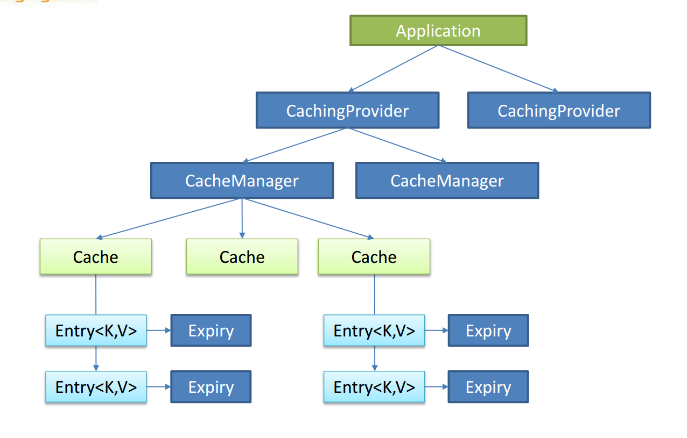
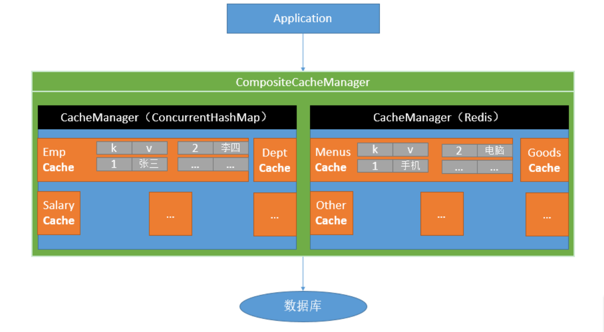
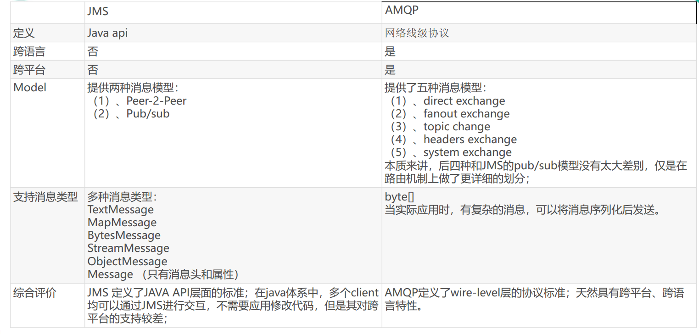
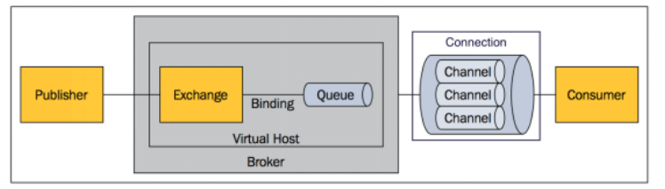
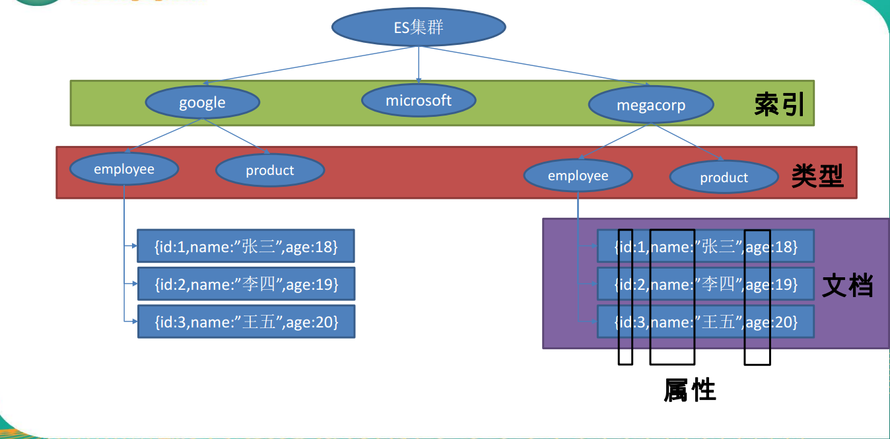

****SpringBoot**高级**


# 一、缓存

## 1、JSR107简介

Java Caching定义了5个核心接口，分别是**CachingProvider**, **CacheManager**, **Cache**, **Entry** 和 **Expiry**。 


- **CachingProvider**
  - 定义了创建、配置、获取、管理和控制多个**CacheManager**。一个应用可 以在运行期访问多个	CachingProvider。
- **CacheManager**
  - 定义了创建、配置、获取、管理和控制多个唯一命名的**Cache**，这些Cache 存在于CacheManager的上下文中。一个CacheManager仅被一个CachingProvider所拥有。
  - **例如：**一个是 redis 的    一个是 memcache
- **Cache**
  - 是一个类似Map的数据结构并临时存储以Key为索引的值。一个Cache仅被一个 CacheManager所拥有。
  - **例如：**一个是 缓存员工的， 一个是缓存部门的
-  **Entry**

  - 是一个存储在Cache中的key-value对。 
- **Expiry** 
  - 每一个存储在Cache中的条目有一个定义的有效期。一旦超过这个时间，条目为过期 的状态。一旦过期，条目将不可访问、更新和删除。缓存有效期可以通过ExpiryPolicy设置。  





## 2、Spring缓存抽象 

Spring从3.1开始定义了org.springframework.cache.Cache 和org.springframework.cache.CacheManager接口来统一不同的缓存技术； 并支持使用JCache（ JSR-107）注解简化我们开发；

- Cache接口为缓存的组件规范定义，包含缓存的各种操作集合；
- Cache接口下Spring提供了各种xxxCache的实现；如RedisCache， EhCacheCache , ConcurrentMapCache等；
- 每次调用需要缓存功能的方法时， Spring会检查检查指定参数的指定的目标方法是否 已经被调用过；如果有就直接从缓存中获取方法调用后的结果，如果没有就调用方法 并缓存结果后返回给用户。下次调用直接从缓存中获取。 
-  使用Spring缓存抽象时我们需要关注以下两点； 
  - 1、确定方法需要被缓存以及他们的缓存策略 
  - 2、从缓存中读取之前缓存存储的数据




## 3、几个重要概念&缓存注解

### 1、常用注解

| **Cache**          | **缓存接口，定义缓存操作。实现有：** RedisCache、EhCacheCache、ConcurrentMapCache等 |
| :----------------- | ------------------------------------------------------------ |
| **CacheManager**   | **缓存管理器，管理各种缓存（** **Cache**）**组件**           |
| **@Cacheable**     | **主要针对方法配置，能够根据方法的请求参数对其结果进行缓存** |
| **@CacheEvict**    | **清空缓存**                                                 |
| **@CachePut**      | **保证方法被调用，又希望结果被缓存。**                       |
| **@EnableCaching** | **开启基于注解的缓存**                                       |
| **keyGenerator**   | **缓存数据时key生成策略**                                    |
| **serialize**      | **缓存数据时value序列化策略**                                |

**@Cacheable**

​	如果方法上标注了 @Cacheable ，那么会先从缓存里面查询，没有就调用方法，有就不调用了

**@CachePut** 

​	方法总是调用，结果也会被缓存

### 2.@Cacheable/@CachePut/@CacheEvict **主要的参数** 

| value 与cacheNames互为@AliasFor     | 缓存的名称，在 spring 配置文件中定义，必须指定 至少一个      | 例如： @Cacheable(value=”mycache”) 或者 @Cacheable(value={”cache1”,”cache2”} |
| ----------------------------------- | ------------------------------------------------------------ | :----------------------------------------------------------- |
| **key**                             | **缓存的 key，可以为空，如果指定要按照 SpEL 表达 式编写，如果不指定，则缺省按照方法的所有参数 进行组合** | **例如： @Cacheable(value=”testcache”,key=”#userName”)**     |
| **condition**                       | **缓存的条件，可以为空，使用 SpEL 编写，返回 true 或者 false，只有为 true 才进行缓存/清除缓存，在 调用方法之前之后都能判断** | **例如： @Cacheable(value=”testcache”,condition=”#userNam e.length()>2”)** |
| **allEntries (@CacheEvict )**       | **是否清空所有缓存内容，缺省为 false，如果指定为 true，则方法调用后将立即清空所有缓存** | **例如： @CachEvict(value=”testcache”,allEntries=true)**     |
| **beforeInvocation (@CacheEvict)**  | **是否在方法执行前就清空，缺省为 false，如果指定 为 true，则在方法还没有执行的时候就清空缓存， 缺省情况下，如果方法执行抛出异常，则不会清空 缓存** | **例如： @CachEvict(value=”testcache”， beforeInvocation=true)** |
| **unless (@CachePut) (@Cacheable)** | **用于否决缓存的，不像condition，该表达式只在方 法执行之后判断，此时可以拿到返回值result进行判 断。条件为true不会缓存， fasle才缓存** | **例如： @Cacheable(value=”testcache”,unless=”#result == null”)** |


### 3.Cache SpEL available metadata 

| 名称          | 位置               | 描述                                                         | 示例                 |
| ------------- | ------------------ | ------------------------------------------------------------ | -------------------- |
| methodName    | root object        | 当前被调用的方法名                                           | #root.methodName     |
| method        | root object        | 当前被调用的方法                                             | #root.method.name    |
| target        | root object        | 当前被调用的目标对象                                         | #root.target         |
| targetClass   | root object        | 当前被调用的目标对象类                                       | #root.targetClass    |
| args          | root object        | 当前被调用的方法的参数列表                                   | #root.args[0]        |
| caches        | root object        | 当前方法调用使用的缓存列表(如@Cacheable(value={"cache1","cache2"})), 则有两个 cache | #root.caches[0].name |
| argument name | evaluation context | 方法参数的名字，可以直接 #参数名，也可以使用 #p0或a0的形式，0代表参数的索引 | #a0、#b1             |
| result        | evaluation context | 方法执行后的返回值(仅当方法执行之后的判断有效，如 'unless', 'cache put' 的表达式 'cache evict' 的表达式 beforeInvocation=false) | #result              |


## 4、缓存注解详解

### 1、使用@Cacheable

1. 开启基于注解的缓存

   @EnableCaching 

   ```JAVA
   // 开启基于注解的缓存
   @EnableCaching
   @MapperScan("cn.zhu.springboot01cache.mapper")
   @SpringBootApplication
   public class SpringBoot01CacheApplication {}
   
   ```
   

   ```pro
   #开启日志
   logging.level.cn.zhu.springboot01cache.mapper=debug
   ```

   ```java
   /**
   	先查询缓存有没有数据，没有调用方法，有就直接缓存取就不调用方法了
   	 * 将方法的运行结果进行缓存，以后再要相同的数据，直接从缓存中获取，不用调用方法
   	 *
   	 * CacheManager 管理多个 Cache 组件的，对缓存的真正的 CRUD 操作中，每一个缓存组件有自己唯一一个名字
   	 * 几个属性：
   	 *      cacheNames/value : 指定缓存的名字；是数组的方式，可以指定多个缓存Cache
   	 *      key 缓存数据使用的 key 可以用它来指定，
   	 *           默认使用方法参数的值作为 key ,返回值作为 value
   	 *           编写 SpEL 表达式
   	 *      keyGenerator : key 的生成器；可以自己指定 Key 的生成器；
   	 *          keyGenerator 和 key 二者只能指定一个 keyGenerator 优先
   	 *      cacheManager/cacheResolver 指定缓存管理器/缓存解析器
   	 *      condition : 指定符合条件的情况下才缓存; condition = "#id > 0"
                   @Cacheable 的 condition
                   符合条件的情况下才缓存
                   @Cacheable(confition="#a0>1")  a 可以是任意字符
                   第一个参数的值 > 1 的时候才进行缓存
                   
   	 *      unless: 除非,否定缓存，当 unless 指定的条件为 true,方法的返回值就不会被缓存;
   	 *          可以获取到结果进行判断 unless="#result == null"
   	 
   	 conditions和unless前者是对传入的参数进行筛选，后者可以对返回值进行筛选
   	 
   	 *      sync : 是否使用异步模式
   	 			sync 模式下 unless 就不支持了。因为 unless 是返回结果以后才进行判断的。而 		sync 模式下是拿到了 返回值就直接返回了，然后进行异步存储。
   	 *
   	 * @param id
   	 * @return
   	 */
   	@Cacheable(cacheNames = "emp", key = "#root.methodName+'['+#id+']'",condition = "#id > 0",unless="#result == null")
   	public Employee getEmp(Integer id) {
   		System.out.println("查询" + id + "号员工");
   		return employeeMapper.getEmployeeById(id);
   	}
   /* 自定义 key 的几种方法
    第一种方式 可以使用 '' 作为字符串，在 key="" 里面 进行字符串拼接
    		key = "#root.methodName+'['+#id+']'"
    
    */
   ```
   第二种方式


```java
@Configuration
public class MyCacheConfig {
   @Bean("myKeyGenrator")
   public KeyGenerator keyGenerator() {
      return new KeyGenerator(){
         @Override
         public Object generate(Object target, Method method, Object... params) {
            return method.getName()+"["+ Arrays.asList(params)+"]";
         }
      };
   }
}
// 然后使用 keyGenerator=“想用的自定义的 keyGenerator 的 id”
@Cacheable(cacheNames = "emp",keyGenerator = "myKeyGenrator",condition = "#id > 0",unless="#result == null")
	public Employee getEmp(Integer id) {
		System.out.println("查询" + id + "号员工");
		return employeeMapper.getEmployeeById(id);
	}

```


### 2、@Cacheable 原理

CacheAutoConfiguration 

```properties
debug=true #开启自动配置报告，在启动的时候，Console 会自动打印启用了哪些配置类
```

主要

#### 1、CacheAutoConfiguration 

```java
@Configuration
@ConditionalOnClass(CacheManager.class)
@ConditionalOnBean(CacheAspectSupport.class)
@ConditionalOnMissingBean(value = CacheManager.class, name = "cacheResolver")
@EnableConfigurationProperties(CacheProperties.class)
@AutoConfigureBefore(HibernateJpaAutoConfiguration.class)
@AutoConfigureAfter({ CouchbaseAutoConfiguration.class, HazelcastAutoConfiguration.class,
		RedisAutoConfiguration.class })
// 注册了 CacheConfigurationImportSelector 而这个类就在下面
@Import(CacheConfigurationImportSelector.class)
public class CacheAutoConfiguration {
	// 这里
	static class CacheConfigurationImportSelector implements ImportSelector {

		@Override
		public String[] selectImports(AnnotationMetadata importingClassMetadata) {
			// 获取了所有 CacheType 类型
            CacheType[] types = CacheType.values();
			String[] imports = new String[types.length];
			for (int i = 0; i < types.length; i++) {
               // 进入
				imports[i] = CacheConfigurations.getConfigurationClass(types[i]);
			}
			return imports;
		}
	}
}

public static String getConfigurationClass(CacheType cacheType) {
		Class<?> configurationClass = MAPPINGS.get(cacheType);
		Assert.state(configurationClass != null, () -> "Unknown cache type " + cacheType);
		return configurationClass.getName();
	}

Map<CacheType, Class<?>> mappings = new EnumMap<>(CacheType.class);
		mappings.put(CacheType.GENERIC, GenericCacheConfiguration.class);
		mappings.put(CacheType.EHCACHE, EhCacheCacheConfiguration.class);
		mappings.put(CacheType.HAZELCAST, HazelcastCacheConfiguration.class);
		mappings.put(CacheType.INFINISPAN, InfinispanCacheConfiguration.class);
		mappings.put(CacheType.JCACHE, JCacheCacheConfiguration.class);
		mappings.put(CacheType.COUCHBASE, CouchbaseCacheConfiguration.class);
		mappings.put(CacheType.REDIS, RedisCacheConfiguration.class);
		mappings.put(CacheType.CAFFEINE, CaffeineCacheConfiguration.class);
		mappings.put(CacheType.SIMPLE, SimpleCacheConfiguration.class);
		mappings.put(CacheType.NONE, NoOpCacheConfiguration.class);
		MAPPINGS = Collections.unmodifiableMap(mappings);

往容器中注入了 10 个 CacheConfiguration;

默认是注入 SimpleCacheConfiguration 类
然后我们看下  SimpleCacheConfiguration 类

```

####  2、SimpleCacheConfiguration 

```java
@Configuration
// 没有 CacheManager 
@ConditionalOnMissingBean(CacheManager.class)
@Conditional(CacheCondition.class)
class SimpleCacheConfiguration {

	private final CacheProperties cacheProperties;

	private final CacheManagerCustomizers customizerInvoker;

	SimpleCacheConfiguration(CacheProperties cacheProperties,
			CacheManagerCustomizers customizerInvoker) {
		this.cacheProperties = cacheProperties;
		this.customizerInvoker = customizerInvoker;
	}

	@Bean
	public ConcurrentMapCacheManager cacheManager() {
        // 主要往容器中注入了一个 ConcurrentMapCacheManager();
        // 按照前面的介绍 Spring缓存抽象和JSR107 那么应该就是 下面还有 Cache; 进入
		ConcurrentMapCacheManager cacheManager = new ConcurrentMapCacheManager();
        // 从 spring.cache.cacheNames List 里面获取用户先前配置过的 cache 名称
		List<String> cacheNames = this.cacheProperties.getCacheNames();
		if (!cacheNames.isEmpty()) {
            // this.cacheMap.put(name, createConcurrentMapCache(name)); 
            // 将其创建空 Cache 并将其以配置的名字存储
			cacheManager.setCacheNames(cacheNames);
		}
		return this.customizerInvoker.customize(cacheManager);
	}

}

```


#### 3、ConcurrentMapCacheManager

```java
org.springframework.cache.concurrent.ConcurrentMapCacheManager {
    // 以 Cache name 为 Key; value 内容为Cache 内部是一个 Map<> 
private final ConcurrentMap<String, Cache> cacheMap = new ConcurrentHashMap<>(16);
    // 应该是允许动态 添加 Cache
    private boolean dynamic = true;
	private boolean allowNullValues = true;
	private boolean storeByValue = false;
	@Nullable
	private SerializationDelegate serialization;


// 主要重点都在这个方法，存储获取一体。没有相应的 Cache 就将其创建，有就查询相应的 Cache
@Override
	@Nullable
	public Cache getCache(String name) {
        // 从 cacheMap 里面查询是否有相应的 cache
		Cache cache = this.cacheMap.get(name);
        // 如果等于空; 允许动态添加 Cache 就进入
		if (cache == null && this.dynamic) {
            // 加锁再次获取
			synchronized (this.cacheMap) {
				cache = this.cacheMap.get(name);
				if (cache == null) {
                    // 创建 cache
					cache = createConcurrentMapCache(name);
                    //将其保存到 cacheMap
					this.cacheMap.put(name, cache);
				}
			}
		}
		return cache;
	}
}
```


### 3、其执行过程

本质也是使用 Proxy 对象，使用一个 interceptor 来进行运作；

#### 1、CacheInterceptor

```java
public class CacheInterceptor extends CacheAspectSupport implements MethodInterceptor, Serializable {

	@Override
	@Nullable
	public Object invoke(final MethodInvocation invocation) throws Throwable {
		Method method = invocation.getMethod();
		// 这里是 java8 的 lambda 
        // 将 aopAllianceInvoker 里面的唯一一个 抽象方法 赋予一个匿名方法；如果有多个抽象方法就会报错；
		CacheOperationInvoker aopAllianceInvoker = () -> {
			try {
                // 这句话指结束这一次 invocation 开始下一个 interceptor
                // 就是 拦截链的调用，如果你下面的方法直接返回了，下面的拦截器就不会调用了，
                // 所以你必须调用这个方法
				return invocation.proceed();
			}
			catch (Throwable ex) {
				throw new CacheOperationInvoker.ThrowableWrapper(ex);
			}
		};

		try {
            // 进入这里
			return execute(aopAllianceInvoker, invocation.getThis(), method, invocation.getArguments());
		}
		catch (CacheOperationInvoker.ThrowableWrapper th) {
			throw th.getOriginal();
		}
	}

}
```


#### 2、CacheAspectSupport

```java
org.springframework.cache.interceptor.CacheAspectSupport#execute()
    
    protected Object execute(CacheOperationInvoker invoker, Object target, Method method, Object[] args) {
		// Check whether aspect is enabled (to cope with cases where the AJ is pulled in automatically)
		if (this.initialized) {
			Class<?> targetClass = getTargetClass(target);
            // 获取 标注了 @Cacheable 的方法的 Cache 的元数据
			CacheOperationSource cacheOperationSource = getCacheOperationSource();
			if (cacheOperationSource != null) {
            // 通过 class 获取其 CacheOperation 其实就是一个 解析@Cacheabe 等注解好的元数据 
				Collection<CacheOperation> operations = cacheOperationSource.getCacheOperations(method, targetClass);
				if (!CollectionUtils.isEmpty(operations)) {
                    // 进入
					return execute(invoker, method,
							new CacheOperationContexts(operations, method, args, target, targetClass));
				}
			}
		}
		// 这里就是调用那个 lambda ；进行下一次拦截连
		return invoker.invoke();
	}

```

 在这里我们引出了 ProxyCachingConfiguration 知道了其

​	BeanFactoryCacheOperationSourceAdvisor

​	CacheOperationSource

​	CacheInterceptor 哪里来的 我们可以看下代码

```java
@Configuration
@Role(BeanDefinition.ROLE_INFRASTRUCTURE)
public class ProxyCachingConfiguration extends AbstractCachingConfiguration {

	@Bean(name = CacheManagementConfigUtils.CACHE_ADVISOR_BEAN_NAME)
	@Role(BeanDefinition.ROLE_INFRASTRUCTURE)
	public BeanFactoryCacheOperationSourceAdvisor cacheAdvisor() {
		BeanFactoryCacheOperationSourceAdvisor advisor =
				new BeanFactoryCacheOperationSourceAdvisor();
		advisor.setCacheOperationSource(cacheOperationSource());
		advisor.setAdvice(cacheInterceptor());
		if (this.enableCaching != null) {
			advisor.setOrder(this.enableCaching.<Integer>getNumber("order"));
		}
		return advisor;
	}

	@Bean
	@Role(BeanDefinition.ROLE_INFRASTRUCTURE)
	public CacheOperationSource cacheOperationSource() {
		return new AnnotationCacheOperationSource();
	}

	@Bean
	@Role(BeanDefinition.ROLE_INFRASTRUCTURE)
	public CacheInterceptor cacheInterceptor() {
		CacheInterceptor interceptor = new CacheInterceptor();
		interceptor.setCacheOperationSources(cacheOperationSource());
		if (this.cacheResolver != null) {
			interceptor.setCacheResolver(this.cacheResolver);
		}
		else if (this.cacheManager != null) {
			interceptor.setCacheManager(this.cacheManager);
		}
		if (this.keyGenerator != null) {
			interceptor.setKeyGenerator(this.keyGenerator);
		}
		if (this.errorHandler != null) {
			interceptor.setErrorHandler(this.errorHandler);
		}
		return interceptor;
	}

}

```

#### 3、CacheOperationContexts

execute(invoker, method,new CacheOperationContexts(operations, method, args, target, targetClass));

首先是 new CacheOperationContexts();

```java
org.springframework.cache.interceptor.CacheAspectSupport.CacheOperationContexts#CacheOperationContexts

public CacheOperationContexts(Collection<? extends CacheOperation> operations, Method method,
				Object[] args, Object target, Class<?> targetClass) {

			for (CacheOperation operation : operations) {
                // 调用 getOperationContext() 方法
				this.contexts.add(operation.getClass(), getOperationContext(operation, method, args, target, targetClass));
			}
			this.sync = determineSyncFlag(method);
		}
```

先到这里了 太难了不行了

#### 4、运行流程

@Cacheable

1、方法运行之前，先去查询 Cache (缓存组件)，按照 cacheNames 指定的名字获取；

2、去 Cache 查找缓存的内容，使用一个 key，默认就是方法的参数

​	key 是按某种策略生成的; 默认是使用 keyGenerator 生成的,默认使用 SimpleKeyGenerator 生成  key;

​	如果没有参数 ; key = new SimpleKey();

​       如果有一个参数； key = 参数值

​	如果有多个参数 key = new SimpleKey(params);

3、 没有查到缓存就调用目标方法

4、将目标方法返回的结果，放进缓存

核心：

​	1)、使用 CacheManager【ConcurrentMapCacheManager】 得到 Cache 信息

​	2)、key 是使用  generateKey(); 生成的，默认是 SimpleKeyGenerator

Springboot 默认是使用 ConcurrentMapCacheManager==ConcurrentMapCache 将数据保存在一个map 中的


SimpleKeyGenerator;

generateKey();

```java
SimpleKeyGenerator
public static Object generateKey(Object... params) {
		if (params.length == 0) {
			return SimpleKey.EMPTY;
		}
		if (params.length == 1) {
			Object param = params[0];
			if (param != null && !param.getClass().isArray()) {
				return param;
			}
		}
		return new SimpleKey(params);
	}
```


### 4、@CachePut

```java
/**
	 * @CachePut 既调用方法，有更新缓存
	 * 修改了数据库的某个数据，同时更新缓存
	 * 运行时机：
	 *  1、先调用目标方法
	 *  2、将目标方法的结果缓存起来
	 *
	 * 测试步骤
	 *  1、查询 1 号员工，查到的结果会放在缓存中
	 *  2、以后查询还是之前的结果
	 *  3、更新一号员工
	 *  发现 和查询的员工在 Cache 里面用的不是一个 Key ;因为 key 默认是用 返回值来
	 *  做key 的，那么我们可以
	 *  key="#result.id"
	 *  key="#employee.id"
	 * @Cacheable 的key 是不能使用 key="#result.id" 的
	 * 因为它是在方法运行之前就要确定 key 进入查询的
	 *  让 key 统一
	 *
	 *
	 */
	@CachePut(value = "emp", key="#result.id")
	public Employee updateEmp(Employee employee) {
		System.out.println("updateEemplee");
		 employeeMapper.updateEmployee(employee);
		 return employee;
	}

```


### 5、@CacheEvict

```java
/**
	 * @CacheEvict 缓存清除  默认是在方法执行成功以后删除
	 * key: 指定要清除的数据
	 * allEntries 清空指定的 cache
	 * beforeInvocation defult false 缓存的清除是否在方法之前执行
	 *  默认是在方法之后执行
	 *
	 */
	@CacheEvict(value="emp",key="#id",allEntries = true, beforeInvocation = true)
	public void deleteEmp(Integer id) {
		System.out.println("deleteEmp" + id);
		employeeMapper.delEmployee(id);
	}
}
```


### 6、@Caching

```java
/**
	 * 定义复杂的缓存规则 要看估计得看 proxy 的执行链了。因为是多个注解，是多个执行链
	 这里是用 三个 LastName id email 的存储了 返回值。
	 然后因为有 #CachePut 所以一定会执行
	 */
	@Caching(
			cacheable = {
					@Cacheable(value = "emp", key = "#lastName")
			},
			put ={
					@CachePut(value="emp", key="#result.id"),
					@CachePut(value="emp", key="#result.email")
			}
	)
	public Employee getEmployeeByLastName(String lastName) {
		return employeeMapper.getEmployeeName(lastName);
	}
}
```


### 7、@CacheConfig

```java
/**
 *  指定这个类里面的公共属性，指定了这个类里面，如果没有指定就使用公共属性
 */
@CacheConfig(cacheNames="emp")
@Service
public class EmployeeService {}

@Target(ElementType.TYPE)
@Retention(RetentionPolicy.RUNTIME)
@Documented
public @interface CacheConfig {
	String[] cacheNames() default {};
	String keyGenerator() default "";
	String cacheManager() default "";
	String cacheResolver() default "";
}

```


## 5、redis

redis 集成 springboot

### 1、你需要配置 redis 的端口

```properties
#配置redis 详情请看 RedisProperties
spring.redis.host=192.168.0.102
    
```

### 2、然后我们看下 RedisAutoConfiguration

```java
@Configuration
@ConditionalOnClass(RedisOperations.class)
@EnableConfigurationProperties(RedisProperties.class)
@Import({ LettuceConnectionConfiguration.class, JedisConnectionConfiguration.class })
public class RedisAutoConfiguration {
	// 往容器中注入了 redisTemplate
	@Bean
	@ConditionalOnMissingBean(name = "redisTemplate")
	public RedisTemplate<Object, Object> redisTemplate(
			RedisConnectionFactory redisConnectionFactory) throws UnknownHostException {
		RedisTemplate<Object, Object> template = new RedisTemplate<>();
		template.setConnectionFactory(redisConnectionFactory);
		return template;
	}
	// 往容器中注入了 StringRedisTemplate
	@Bean
	@ConditionalOnMissingBean
	public StringRedisTemplate stringRedisTemplate(
			RedisConnectionFactory redisConnectionFactory) throws UnknownHostException {
		StringRedisTemplate template = new StringRedisTemplate();
		template.setConnectionFactory(redisConnectionFactory);
		return template;
	}
}

```

### 3、使用 RedisTemplate

```java
public class SpringBoot01CacheApplicationTests {
	// k-v 是 Obejct - Object
	@Autowired
	RedisTemplate redisTemplate;
	// k-v 是 String - String
	@Autowired
	StringRedisTemplate stringRedisTemplate;

	/**
	 * stringRedisTemplate.opsForValue();(String 字符串)
	 * stringRedisTemplate.oopsForHash();(Hash 散列)
	 * stringRedisTemplate.opsForList();(List 列表)
	 * stringRedisTemplate.opsForZSet();(ZSet 有序集合)
	 * stringRedisTemplate.opsForSet();(Set 集合)
	 * redisTemplate 也一样的
	 */
	@Test
	public void contextLoads() {
		// 默认如果保存对象，使用 JDK 序列化，序列化后的数据保存到 redis 中
		redisTemplate.opsForValue().set("", "");
		//1. 将数据以 json 的方式保存
		// 2. redisTemplate 默认的序列化规则
	}
}
```

4、RedisTemplate 的 serialiazable 方式

默认是

```java
if (defaultSerializer == null) {
			defaultSerializer = new JdkSerializationRedisSerializer(
					classLoader != null ? classLoader : this.getClass().getClassLoader());
		}
```

我们也可以自定义 RedisTemplate 的 Serializer

```java
常用的 Serializer
GenericJackson2JsonRedisSerializer.java
GenericToStringSerializer.java
Jackson2JsonRedisSerializer.java
JdkSerializationRedisSerializer.java
OxmSerializer.java
StringRedisSerializer.java
```


```java
@Configuration
public class MyRedisConfig {
	@Bean
	public RedisTemplate<Object, Employee> redisTemplate(
			RedisConnectionFactory redisConnectionFactory) throws UnknownHostException {
		RedisTemplate<Object, Employee> template = new RedisTemplate<>();
        // 设置 key 和 value 为 Jackson2JsonRedisSerializer
		template.setDefaultSerializer(new Jackson2JsonRedisSerializer<Employee>(Employee.class));
		template.setConnectionFactory(redisConnectionFactory);
        // 你也可以自定义 key 和 value 不同的 serializable
//		template.setKeySerializer();
		return template;
	}
}

```

### 4、整合 注解的原理

原理 ：CacheManager==Cache 缓存组件来实际给缓存中存取数据

1、引入了 redis 的 starter ，容器中保存的是 RedisCacheManager;

2、RedisCacheManager 帮我们创建 RedisCache 来作为缓存组件，RedisCache 通过操作 redis 缓存数据的

我们来看 RedisCacheConfiguration  CacheAutoConfiguration 自动注入的类。

在 RedisCacheConfiguration 里面配置了 CacheManager 

```java
class RedisCacheConfiguration {
@Bean
    // 这里传入了 redisTemplate 
	public RedisCacheManager cacheManager(RedisTemplate<Object, Object> redisTemplate) {
		RedisCacheManager cacheManager = new RedisCacheManager(redisTemplate);
        // key 多了一个前缀
        // 使用前缀，默认会将  CacehName 作为前缀
		cacheManager.setUsePrefix(true);
		List<String> cacheNames = this.cacheProperties.getCacheNames();
		if (!cacheNames.isEmpty()) {
			cacheManager.setCacheNames(cacheNames);
		}
		return this.customizerInvoker.customize(cacheManager);
	}
}
```

突然发现 springboot 在 redis 这块的不同版本的代码改动量非常大。同样的配置可能版本不同，就不能用了


自定义 RedisManager

```java
@Configuration
public class MyRedisConfig {
	@Bean
	public RedisTemplate<Object, Employee> empRedisTemplate(
			RedisConnectionFactory redisConnectionFactory) throws UnknownHostException {
		RedisTemplate<Object, Employee> template = new RedisTemplate<>();
        // 注意这个 manager 只能由 Employee 使用，因为它只 json 转换 Employee 的。
        // 我们不能使用 Object 因为 你转换回来的时候是根据你传的 泛型转换的
		template.setDefaultSerializer(new Jackson2JsonRedisSerializer<Employee>(Employee.class));
		template.setConnectionFactory(redisConnectionFactory);
//		template.setKeySerializer();
		return template;
	}
	@Bean
	// 这里传入了 redisTemplate
	public RedisCacheManager cacheManager(RedisTemplate<Object, Employee> empRedisTemplate) {	
        // 注意这个 manager 只能由 Employee 使用，因为它只 json 转换 Employee 的。
        // 我们不能使用 Object 因为 你转换回来的时候是根据你传的 泛型转换的
		RedisCacheManager cacheManager = new RedisCacheManager(empRedisTemplate);
		// key 多了一个前缀
		// 使用前缀，默认会将  CacehName 作为前缀
		cacheManager.setUsePrefix(true);

		return cacheManager;
	}
}
// 我们必须使用多个 RedisCacheManager 为每一个 bean 配置一个，这样非常麻烦
```

那么问题来了，如果要使用 json 序列化，非常困难，因为你不可能为 成千上百的 bean 都配置一个专门的 Manager


我们也可以直接注入 CacheManager  然后直接操作 CacheManager

一个通用的 template

```java
@Bean
	public RedisTemplate<Object, Object> redisTemplate(RedisConnectionFactory redisConnectionFactory) {
		RedisTemplate<Object, Object> redisTemplate = new RedisTemplate<>();
		redisTemplate.setConnectionFactory(redisConnectionFactory);

		// 使用Jackson2JsonRedisSerialize 替换默认序列化
		Jackson2JsonRedisSerializer jackson2JsonRedisSerializer = new Jackson2JsonRedisSerializer(Object.class);

		ObjectMapper objectMapper = new ObjectMapper();
		// PropertyAccessor.ALL
		objectMapper.setVisibility(PropertyAccessor.ALL, JsonAutoDetect.Visibility.ANY);
		//objectMapper.setVisibility(PropertyAccessor.NONE, JsonAutoDetect.Visibility.NONE);
		objectMapper.enableDefaultTyping(ObjectMapper.DefaultTyping.NON_FINAL);

		jackson2JsonRedisSerializer.setObjectMapper(objectMapper);

		// 设置value的序列化规则和 key的序列化规则
		redisTemplate.setValueSerializer(jackson2JsonRedisSerializer);
		//redisTemplate.setKeySerializer(new StringRedisSerializer());
		redisTemplate.setKeySerializer(jackson2JsonRedisSerializer);
		redisTemplate.afterPropertiesSet();
		return redisTemplate;
	}
其 ObjectMapper 主要使用了将类型存放在 JSON 中，来实现通用 JSON 转换器
[
    "cn.zhu.springboot01cache.bean.Employee",
    {
        "id": 1,
        "lastName": "小明",
        "email": "594012917.qq.con",
        "gender": 1,
        "dId": 1
    }
]
```


# 二、Spring Boot 与消息

JMS、AMQP、RebbitMQ

## 1、概述 

1、大多应用中,可通过**消息服务中间件**来提升**系统异步通信、扩展解耦能力**、**流量削峰**  

2、消息服务中两个重要的概念:

​	消息代理(message broker)和目的地(destination)

当消息发送者发送消息以后，将由消息代理接管，消息代理保证消息传递到指定目的地。

3、消息队列主要由两种形式的目的地

​	1、队列(queue)： 点对点消息通信(point-to-point)

​	2、主题(topic)：发布(publish)/订阅(subscribe)消息通信


​	可以给 消息队列一个数字比如 1W，只能 1W 个消息进队列，一旦超出就抛出异常

4、点对点式： – 消息发送者发送消息，消息代理将其放入一个队列中，消息接收者从队列中获取消息内容， 消息读取后被移出队列 – 消息只有唯一的发送者和接受者，但并不是说只能有一个接收者 

5、发布订阅式： – 发送者（发布者）发送消息到主题，多个接收者（订阅者）监听（订阅）这个主题，那么 就会在消息到达时同时收到消息 

6、JMS（ Java Message Service） JAVA消息服务： – 基于JVM消息代理的规范。 ActiveMQ、 HornetMQ是JMS实现 

7、AMQP（ Advanced Message Queuing Protocol） – 高级消息队列协议，也是一个消息代理的规范，兼容JMS – RabbitMQ是AMQP的实现

JMS和AMQP 比较





8、Spring支持 –

 **spring-jms提供了对JMS的支持**

 – **spring-rabbit提供了对AMQP的支持** 

– **需要ConnectionFactory的实现来连接消息代理** 

– **提供JmsTemplate、 RabbitTemplate来发送消息**

 – **@JmsListener（ JMS）、 @RabbitListener（ AMQP）注解在方法上监听消息代理发** **布的消息**

 – **@EnableJms、 @EnableRabbit开启支持** 

9、Spring Boot自动配置 – **JmsAutoConfiguration** – **RabbitAutoConfiguration**  


## 2、 RabbitMQ

### 1、**RabbitMQ简介**

​	RabbitMQ是一个由erlang开发的AMQP(Advanved Message Queue Protocol)的开源实现。 

### 2、**核心概念** 

#### **Message** 

消息，消息是不具名的，它由消息头和消息体组成。消息体是不透明的，而消息头则由一系列的可选属性组 成，这些属性包括routing-key（路由键）、 priority（相对于其他消息的优先权）、 delivery-mode（指出 该消息可能需要持久性存储）等。 

#### **Publisher** 

消息的生产者，也是一个向交换器发布消息的客户端应用程序。 

#### **Exchange** 

交换器，用来接收生产者发送的消息并将这些消息路由给服务器中的队列。 Exchange有4种类型： direct(默认)， fanout, topic, 和headers，不同类型的Exchange转发消息的策略有 所区别 

#### **Queue**

 消息队列，用来保存消息直到发送给消费者。它是消息的容器，也是消息的终点。一个消息 可投入一个或多个队列。消息一直在队列里面，等待消费者连接到这个队列将其取走。 

#### **Binding**

 绑定，用于消息队列和交换器之间的关联。一个绑定就是基于路由键将交换器和消息队列连 接起来的路由规则，所以可以将交换器理解成一个由绑定构成的路由表。 Exchange 和Queue的绑定可以是多对多的关系。

#### **Connection** 

网络连接，比如一个TCP连接。 

#### **Channel** 

信道，多路复用连接中的一条独立的双向数据流通道。信道是建立在真实的TCP连接内的虚 拟连接， AMQP 命令都是通过信道发出去的，不管是发布消息、订阅队列还是接收消息，这 些动作都是通过信道完成。因为对于操作系统来说建立和销毁 TCP 都是非常昂贵的开销，所 以引入了信道的概念，以复用一条 TCP 连接。

####  **Consumer** 

消息的消费者，表示一个从消息队列中取得消息的客户端应用程序。 **Virtual Host** 虚拟主机，表示一批交换器、消息队列和相关对象。虚拟主机是共享相同的身份认证和加 密环境的独立服务器域。每个 vhost 本质上就是一个 mini 版的 RabbitMQ 服务器，拥有 自己的队列、交换器、绑定和权限机制。 vhost 是 AMQP 概念的基础，必须在连接时指定， RabbitMQ 默认的 vhost 是 / 。 

#### **Consumer** 

消息的消费者，表示一个从消息队列中取得消息的客户端应用程序。 

#### **Virtual Host** 

虚拟主机，表示一批交换器、消息队列和相关对象。虚拟主机是共享相同的身份认证和加 密环境的独立服务器域。每个 vhost 本质上就是一个 mini 版的 RabbitMQ 服务器，拥有 自己的队列、交换器、绑定和权限机制。 vhost 是 AMQP 概念的基础，必须在连接时指定， RabbitMQ 默认的 vhost 是 / 。

####  **Broker** 

表示消息队列服务器实体  




### 3、RabbitMQ运行机制  

#### 1、AMQP 中的消息路由 

 AMQP 中消息的路由过程和 Java 开发者熟悉的 JMS 存在一些差别， AMQP 中增加了 **Exchange** 和 **Binding** 的角色。生产者把消息发布到 Exchange 上，消息最终到达队列并被 消费者接收，而 Binding 决定交换器的消息应该发送到那个队列。  

#### 2、Exchange 类型

**Exchange**分发消息时根据类型的不同分发策略有区别，目前共四种类型： **direct、 fanout、 topic、 headers** 。 headers 匹配 AMQP 消息的 header 而不是路由键， headers 交换器和 direct 交换器完全一致，但性能差很多， 目前几乎用不到了，所以直接看另外三种类型：  

##### direct

​	消息中的路由键（ routing key）如果和 Binding 中的 binding
	key 一致， 交换器就将消息发到对应的队列中。路由键与队
	列名完全匹配，如果一个队列绑定到交换机要求路由键为
	“ dog”，则只转发 routing key 标记为“ dog”的消息，不会转
	发“ dog.puppy”，也不会转发“ dog.guard”等等。它是完全
	匹配、单播的模式

##### fanout

​	每个发到 fanout 类型交换器的消息都会分到所 有绑定的队列上去。 fanout 交换器不处理路由键， 只是		简单的将队列绑定到交换器上，每个发送 到交换器的消息都会被转发到与该交换器绑定 的所有队列上。很像子网广播，每台子网内的 主机都获得了一份复制的消息。 fanout 类型转发 消息是最快的。  

##### topic

​	topic 交换器通过模式匹配分配消息的路由键属 性，将路由键和某个模式进行匹配，此时队列 需要绑定到一个模式上。它将路由键和绑定键 的字符串切分成单词，这些单词之间用点隔开。 它同样也会识别两个通配符：符号“ #”和符号 “ *” 。 *#*匹配*0*个或多个单词， *匹配一个单词。  

**通配符**

- 单个“.”把路由键分为几部分
- “*”匹配特定位置的任意文本
- “*”操作符将“.”视为分隔符，“#”操作符没有分块的概念，它将任意"."字符均视为关键词的匹配部分

为了实现匹配所有规则，你可以使用“#”


### 4、RabbitMQ整合 

docker  下载 rabbitmq 请下载在 management 的 tag ，这是带 web 管理页面的

```shell
[root@localhost ~]# docker run -d -p 5672:5672 -p 15672:15672 --name myrabbitmq docker.io/rabbitmq   
15672 是 webmanagment 图形页面的端口  5672 是通信的端口
```


默认的账号密码 都是 guest

整合 springboot 配置 

1、配置必须属性

```properties
spring.rabbitmq.host=192.168.0.102
spring.rabbitmq.username=guest
spring.rabbitmq.password=guest
#spring.rabbitmq.virtual-host=/ #默认就是
#spring.rabbitmq.port=5672  #默认就是
```

```java
/**
 * 自动配置类
 * 1、RabbitAutoConfiguration
 * 2、自动配置了连接工厂 CachingConnectionFactory
 * 3、RabbitProperties 封装了 RabbitMQ 的配置
 * 4、RabbitTemplate ：给 RabbitMQ 发送和接收消息
 * 5、AmqpAdmin : RabbitMQ 系统管理组件
 *  	 AmqpAdmin : 创建和删除 Queue,Exchange Binding
 * 6、@EnableRabbit + @RabbitListener 监听消息队列的内容
 */
```

2、开始注解支持

```java
@EnableRabbit// 开启注解 RabbitMQ 支持
@SpringBootApplication
public class Springboot02AmqpApplication {}
```

3、发送信息

```java
@Autowired
	private RabbitTemplate rabbitTemplate;
/**
	 * 1、单播 (点对点模式)
	 */
	@Test
	public void contextLoads() {
		// message 需要自己创键一个，定义消息体和消息头
		//rabbitTemplate.send(exchange, routingKey, message);

		// object 默认当成消息体 只需要传入要发送的对象，自动序列化发送给 rabbitmq;
		//rabbitTemplate.convertAndSend(exchange, routeKey,object );

		Map<String, Object> map = new HashMap<>();
		map.put("msg","这是第一个消息");
		map.put("data", Arrays.asList("helloworld",123,true));
		Book book = new Book("西游记", "吴承恩");

		// 对象被默认序列化以后发送出去
		//rabbitTemplate.convertAndSend("exchange.direct", "zhu.news", map);
		rabbitTemplate.convertAndSend("exchange.direct", "zhu.news", book);
	}

	// 接收数据
	@Test
	public void receive() {
		//rabbitTemplate.receiveAndConvert("routeKey");
		Object o = rabbitTemplate.receiveAndConvert("zhu.news");
		System.out.println(o.getClass());
		System.out.println(o);
	}
```

4、使用监听器接收信息

```java
// 首先你需要在 配置类上标注 @EnableRabbit 开始 RabbitMQ 注解支持
@Service
public class BookService {

	@RabbitListener(queues={"zhu.news"})
	public void receive(Book book) {

		System.out.println("收到消息：" + book);
	}

	// 如果你还想要消息头的话
	@RabbitListener(queues="zhu.news")
	public void receiveMessage(Message message) {

		System.out.println(message.getBody());
		System.out.println(message.getMessageProperties());
	}
}
```


5、创建 exchange  queue Binding

```java
@Autowired
	AmqpAdmin amqpAdmin;
public void createExchange() {
		// 创建 交换器
		//amqpAdmin.declareExchange(new DirectExchange("amqpadmin.exchange"));
		// 创建队列  是否是持久化
		// amqpAdmin.declareQueue(new Queue("amqpadmin.queue",true));

		// 	public Binding(String destination, DestinationType destinationType, String exchange, String routingKey,Map<String, Object> arguments) {}
		amqpAdmin.declareBinding(new Binding("amqpadmin.queue", Binding.DestinationType.QUEUE, "amqpadmin.exchange", "amqp.haha",null ));

	}
重复创建不会覆盖
```

# 三、 Spring Boot与检索 

docker : 

```shell
[root@localhost ~]#  docker run -e ES_JAVA_OPTS="-Xms256m -Xmx256m" -d -p 9200:9200 -p 9300:9300 --name ES01 docker.io/elasticsearch
elasticsearch默认会占用两个 G 堆内存；我们将其设置成  -e ES_JAVA_OPTS="-Xms256m -Xmx256m" 
9300 端口是 分布式的时候的端口
```

## 1、检索介绍 

我们的应用经常需要添加检索功能，开源的 ElasticSearch 是目前全文搜索引擎的 首选。 他可以快速的存储、搜索和分析海量数据。 Spring Boot通过整合Spring Data ElasticSearch为我们提供了非常便捷的检索功能支持； 

Elasticsearch是一个分布式搜索服务，提供Restful API，底层基于Lucene，采用 多shard（分片）的方式保证数据安全，并且提供自动resharding的功能， github 等大型的站点也是采用了ElasticSearch作为其搜索服务，  

## 2、概念 

以 员工文档 的形式存储为例：一个文档代表一个员工数据。存储数据到 ElasticSearch 的行为叫做 索引 ，但在索引一个文档之前，需要确定将文档存 储在哪里。

 • 一个 ElasticSearch 集群可以 包含多个 索引 ，相应的每个索引可以包含多 个 类型 。 这些不同的类型存储着多个 文档 ，每个文档又有 多个 属性 。 

 **类似关系：** 

– 索引-数据库 

– 类型-表 

– 文档-表中的记录 

– 属性-列  




## 3、使用

存储

```java
PUT /megacorp/employee/1
{
    "first_name" : "John",
    "last_name" :  "Smith",
    "age" :        25,
    "about" :      "I love to go rock climbing",
    "interests": [ "sports", "music" ]
}
megacorp 是索引，employee 是类型，1 是id
```

**搜索**

```java
GET /megacorp/employee/1
   
返回的数据
{
  "_index" :   "megacorp",
  "_type" :    "employee",
  "_id" :      "1",
  "_version" : 1,
  "found" :    true,
  "_source" :  {
      "first_name" :  "John",
      "last_name" :   "Smith",
      "age" :         25,
      "about" :       "I love to go rock climbing",
      "interests":  [ "sports", "music" ]
  }
}
_version 版本，每次使用 put 修改就会增加 _version
found 表示找到数据了
_source 代表找到的元数据

GET /megacorp/employee/_search
搜索 megacorp employee 下所有的 数据

GET /megacorp/employee/_search?q=last_name:Smith 
将查询本身赋值给参数 q= 
搜索 megacorp employee 下 last_name = Smith 的所有数据，是模糊查询


将 HTTP 命令由 PUT 改为 GET 可以用来检索文档，同样的，可以使用 DELETE 命令来删除文档，以及使用 HEAD 指令来检查文档是否存在。如果想更新已存在的文档，只需再次 PUT。
head 没有返回值，但是如果存在数据返回 200 状态码 不存在返回 404 状态码
```


**使用查询表达式搜索**

```java
GET /megacorp/employee/_search
{
    "query" : {
        "match" : {
            "last_name" : "Smith"
        }
    }
}
更多查看 elasticSearch 官方中文文档
```


## 4、SpingBoot整合

SpringBoot 默认使用 SpringData ElasticSearch 模块进行操作


```java
/**
 * SpringBoot 默认支持两种技术和 ES 交互
 * 1、Jest 默认不生效。我们需要导入 Jest 工具包
 * 2、SpringData ElasticSearch
 *     1) Client clusterNodes 节点信息
 *     2）ElasticsearchTemplate 操作 Elastic
 *     3) 编写一个 ElasticsearchRepository 子接口来操作 ES;
 */
```

Jset 工具包

```xml
<!-- https://mvnrepository.com/artifact/io.searchbox/jest -->
<dependency>
    <groupId>io.searchbox</groupId>
    <artifactId>jest</artifactId>
    <version>5.3.3</version>
</dependency>

```

### 1、Jest 使用

```properties
spring.elasticsearch.jest.uris=http://192.168.0.102:9200
```


```java
public class Article { 
	@JestId // 标注这是一个 主键 就不用写 id 了
	private Integer id;
	private String author;
	private String title;
	private String content;
}
```

```java
@Autowired
	JestClient jestClient;
	@Test
	public void contextLoads() {
		// 1、给 Es 中索引(保存)一个文档
		Article article = new Article();
		article.setId(1);
		article.setTitle("好消息");
		article.setAuthor("张三");
		article.setContent("Hello world!");

		// 构建一个索引功能
		Index index = new Index.Builder(article).index("zhu").type("news").build();
		try {
			// 执行
			jestClient.execute(index);
		} catch (IOException e) {
			e.printStackTrace();
		}
	}

	// 搜索
	@Test
	public void search() {
		// 查询表达式
		String json = "{\n" +
				"    \"query\" : {\n" +
				"        \"match\" : {\n" +
				"            \"content\" : \"hello\"\n" +
				"        }\n" +
				"    }\n" +
				"}";
		// 构建搜索功能
		Search search = new Search.Builder(json).addIndex("zhu").addType("news").build();

		try {
			// 执行
			SearchResult result = jestClient.execute(search);
			System.out.println(result.getJsonString());
		} catch (IOException e) {
			e.printStackTrace();
		}
	}


```


### 2、使用 SpringData

#### 1、版本适配

https://github.com/spring-projects/spring-data-elasticsearch

| spring data elasticsearch | elasticsearch |
| ------------------------- | ------------- |
| 3.1.x                     | 6.2.2         |
| 3.0.x                     | 5.5.0         |
| 2.1.x                     | 2.4.0         |
| 2.0.x                     | 2.2.0         |
| 1.3.x                     | 1.5.2         |

文档

https://docs.spring.io/spring-data/elasticsearch/docs/3.1.0.M3/reference/html/#elasticsearch.query-methods


```java
@Document(indexName = "zhu",type = "book")
public class Book {

	private Integer id;
	private String bookName;
	private String author;}

public interface BookRepository extends ElasticsearchRepository<Book, Integer> {
 	// 你可以自定义方法，按照官网的规则，详细请看官网规则
    Book findBybookName(String bookName);
}

@Autowired
	BookRepository bookRepository;

	@Test
	public void test02() {
		Book book = new Book();
		book.setId(1);
		book.setAuthor("吴承恩");
		book.setBookName("西游记");
		bookRepository.index(book);
	}


```


# 四、Spring Boot与任务 

## 一、异步任务 

在Java应用中，绝大多数情况下都是通过同步的方式来实现交互处理的；但是在 处理与第三方系统交互的时候，容易造成响应迟缓的情况，之前大部分都是使用 多线程来完成此类任务，其实，在Spring 3.x之后，就已经内置了@Async来完 美解决这个问题。 

两个注解： @EnableAysnc、 @Aysnc 

看了两个注解就知道了。不需要任何参数

## 二、定时任务 

项目开发中经常需要执行一些定时任务，比如需要在每天凌晨时候，分析一次前 一天的日志信息。 Spring为我们提供了异步执行任务调度的方式，提供 TaskExecutor 、 TaskScheduler 接口。 

**两个注解：** @EnableScheduling、 @Scheduled  

**cron表达式：** 

| 字段       | 允许值                                        | 允许的特殊字符  |
| ---------- | --------------------------------------------- | --------------- |
| 秒         | 0-59                                          | , - * /         |
| 分         | 0-59                                          | , - * /         |
| 小时       | 0-23                                          | , - * /         |
| 日期       | 1-31                                          | , - * ? / L W C |
| 月份       | 1-12                                          | , - * /         |
| 星期       | - *   / L C #   0-7 的 0 是星期天  7 是星期六 | , - * ? / L C # |
| 年（可选） | 留空, 1970-2099                               | , - * /         |


| **特殊字符** | **代表含义**                                                 |
| ------------ | ------------------------------------------------------------ |
| **,**        | 字符被用来指定另外的值。如：“MON,WED,FRI”在星期域里表示”星期一、星期三、星期五”. |
| **-**        | 字符被用来指定一个范围。如：“10-12”在小时域意味着“10点、11点、12点”。 |
| *****        | 字符被用来指定所有的值。如 "*" 在分钟的字段域里面表示每分钟。 |
| **/**        | 步长                                                         |
| **?**        | 字符只在日期域和星期域中使用。比如 你写了 * 每一天，然后写了 Mon 星期一。这样就冲突了。 你就必须将 * 每一天 改成 ?   日/星期冲突匹配 |
| **L**        | 最后                                                         |
| **W**        | 工作日                                                       |
| **C**        | 和 calendar 联系后计算过的值                                 |
| **#**        | 4#2 第二个星期四                                             |


     0  0 12 * * ? 每天 中午 12 点触发
     0 15 10 * * * 每天 上午 10 点 15 分触发
     0 15 10 * * ? 每天 上午 10 点 15 分触发
     0 15 10 * * ? * 每天 上午 10 点 15 分触发
     0 15 10 * * ? 2005  2005 年每天上午10点触发
     0 * 14 * * ?  每天 14点 到 14:59 期间的每一分钟触发一次
     0 0/5 14 * * ?  每天 14点 到 14:59 之间 5分钟触发一次  0/5 表示 从 0 开始，每5分钟触发一次
     0 0/5 14,18 * * ? 每天 14点 时间段和 18点时间段，从0分开始 5分钟触发一次
     0 0-5 14 * * ?  每天 14 点 0-5分钟 每一分钟触发一次
和 quartz 有点不一样

```java
@EnableAysnc

@Scheduled(cron = "0/1 * * * * 0")
	public void hello() {
		System.out.println("scheduled");
	}
```


## 三、邮件任务 

邮件发送需要引入spring-boot-starter-mail 

• Spring Boot 自动配置MailSenderAutoConfiguration 

• 定义MailProperties内容，配置在application.yml中

 • 自动装配JavaMailSender 

• 测试邮件发送  


首先

```properties
spring.mail.username=zhuxiaoqing1@foxmail.com
spring.mail.password=ehylbvrzsbxibfee  #是邮箱授权码
spring.mail.host=smtp.qq.com
spring.mail.properties.mail.smtp.ssl.enable=true # qq 邮箱要求开启 ssl
```

```java
	@Autowired
	JavaMailSenderImpl javaMailSender;
	// 发送简单邮件
	@Test
	public void contextLoads() {
		SimpleMailMessage message = new SimpleMailMessage();
//		message.setSubject("111");
//		message.setText("2222");
		message.setSubject("通知今晚开会");
		message.setText("今晚7:30开会");
		message.setTo("858189761@qq.com");
		message.setFrom("zhuxiaoqing1@foxmail.com");
		javaMailSender.send(message);
	}
// 发送复杂文件
@Test
	public void contextLoads02() throws MessagingException {
		// 创建复杂的邮件
		MimeMessage mimeMessage = javaMailSender.createMimeMessage();
		MimeMessageHelper helper = new MimeMessageHelper(mimeMessage, true);
//		message.setSubject("111");
//		message.setText("2222");
		helper.setSubject("通知今晚开会");
		helper.setText("<a href='http://www.baidu.com'>今晚7:30开会</a>",true);
		helper.setTo("858189761@qq.com");
		helper.setFrom("zhuxiaoqing1@foxmail.com");
		// 上传文件
		helper.addAttachment("1.jpg", new File("D:\\timg.jpg"));
		javaMailSender.send(mimeMessage);
	}
```


# 五、 Spring Boot与安全 


## 1、简介

Spring Security是针对Spring项目的安全框架，也是Spring Boot底层安全模 块默认的技术选型。他可以实现强大的web安全控制。对于安全控制，我们仅 需引入spring-boot-starter-security模块，进行少量的配置，即可实现强大的 安全管理。

 几个类：

 WebSecurityConfigurerAdapter：自定义Security策略 

AuthenticationManagerBuilder：自定义认证策略 

@EnableWebSecurity：开启WebSecurity模式  


应用程序的两个主要区域是“认证”和“授权”（或者访问控制）。 这两个主要区域是Spring Security 的两个目标。

 • “认证”（ Authentication）， 是建立一个他声明的主体的过程（一 个“主体”一般是指用户，设备或一些可以在你的应用程序中执行动 作的其他系统） 。

 • “授权”（ Authorization）指确定一个主体是否允许在你的应用程序 执行一个动作的过程。为了抵达需要授权的店，主体的身份已经有认 证过程建立。 

• 这个概念是通用的而不只在Spring Security中  


## 2、 Web&安全 

1、登陆/注销 – HttpSecurity配置登陆、注销功能 

2、Thymeleaf提供的SpringSecurity标签支持 – 需要引入thymeleaf-extras-springsecurity4 – sec:authentication=“name” 获得当前用户的用户名 – sec:authorize=“hasRole(‘ADMIN’)” 当前用户必须拥有ADMIN权限时才会显示标签内容 

3、remember me – 表单添加remember-me的checkbox – 配置启用remember-me功能 

4、CSRF（ Cross-site request forgery）跨站请求伪造 – HttpSecurity启用csrf功能，会为表单添加_csrf的值，提交携带来预防CSRF；  

5、讲和没讲一样。


# 六、小技巧

开发热部署  搜索 springboot 的文档的  devtools

```xml
<dependencies>
    <dependency>
        <groupId>org.springframework.boot</groupId>
        <artifactId>spring-boot-devtools</artifactId>
        <optional>true</optional>
    </dependency>
</dependencies>
```

Spring Boot Devtools（推荐）

 – 引入依赖 

– IDEA使用ctrl+F9 –

 或做一些小调整 Intellij IEDA和Eclipse不同， Eclipse设置了自动编译之后，修改类它会自动编译，而IDEA在非RUN或DEBUG情况下 才会自动编译（前提是你已经设置了Auto-Compile）。 

• 设置自动编译（ settings-compiler-make project automatically）

 • ctrl+shift+alt+/（ maintenance） 

• 勾选compiler.automake.allow.when.app.running  


## 2、监控管理 

通过引入spring-boot-starter-actuator，可以使用Spring Boot为我们提供的准 生产环境下的应用监控和管理功能。我们可以通过HTTP， JMX， SSH协议来进 行操作，自动得到审计、健康及指标信息等  


步骤： 

– 引入spring-boot-starter-actuator 

– 通过http方式访问监控端点 

– 可进行shutdown（ POST 提交，此端点默认关闭）  


### 监控和管理端点 

| 端口名       | 描述                        |
| ------------ | --------------------------- |
| *autoconfig* | 所有自动配置信息            |
| auditevents  | 审计事件                    |
| beans        | 所有Bean的信息              |
| configprops  | 所有配置属性                |
| dump         | 线程状态信息                |
| env          | 当前环境信息                |
| health       | 应用健康状况                |
| info         | 当前应用信息                |
| metrics      | 应用的各项指标              |
| mappings     | 应用@RequestMapping映射路径 |
| shutdown     | 关闭当前应用（默认关闭）    |
| trace        | 追踪信息（最新的http请求）  |


### 定制端点信息 

– 定制端点一般通过endpoints+端点名+属性名来设置。

 – 修改端点id（ endpoints.beans.id=mybeans）

 – 开启远程应用关闭功能（ endpoints.shutdown.enabled=true） 

– 关闭端点（ endpoints.beans.enabled=false） 

– 开启所需端点 • endpoints.enabled=false • endpoints.beans.enabled=true 

– 定制端点访问根路径 • management.context-path=/manage 

– 关闭http端点 • management.port= -1  

## 

