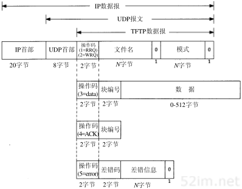
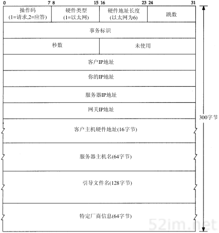

# 第15章 TFTP 简单文件传送协议

## 1、引言

```
TFTP(Trivial File Transfer Protocol)即文件传送协议，最初打算用于引导无盘系统(通常是工作站或X终端)。和将在第27章介绍的使用 TCP 的文件传送协议(FTP)不同，为了保持简单和短小，TFTP将使用UDP。TFTP的代码(和它所需要的UDP、IP和设备驱动程序)都能适合只读存储器。

本章对 TFTP 只作一般介绍，因为在下一章引导程序协议(Bootstrap Protocol)中还会遇到TFTP.
```

## 2、协议

```
在开始工作时，TFTP的客户与服务器交换信息，客户发送一个读请求或写请求给服务器。在一个无盘系统进行系统引导的正常情况下，第一个请求是读请求(RRQ).下图显示了5种TFTP报文格式(操作码为 1和 2 的报文使用相同的格式)。
```



```
TFTP报文的头两个字节表示操作码。对于读请求和写请求(WRQ)，文件名字段说明客户要读或写的位于服务器上的文件。这个文件字段以0字节作为结束。模式字段是一个ASCII码字符netascii 或 octet (可大小写任意组合)，同样以0字节结束。netascii 表示数据是以成行的 ASCII 码字符组成，以两个字节一回车字符后跟换行字符(称为CR/LF)作为行结束符。这两个行结束字符在这种格式和本地主机使用的行定界符之间进行转化。 octet 则将数据看作 8bit 一组的字节流而不作任何解释。
	每个数据分组包含一个块编号字段，它以后要在确认分组中使用。以读一个文件作为例子，TFTP 客户需要发送一个读请求说明要读的文件名和文件模式(mode).如果这个文件能被这个客户读取，TFTP服务器就返回一个块编号为1的数据分组。
```


# 16、BOOTP:引导程序协议




```
BOOTP 封装在了 UTP 中
```


```
操作码字段为1表示请求，为2表示应答。硬件类型字段为1表示10Mb/s的以太网，这和ARP请求或应答中同名字段表示的含义相同。类似的，对于以太网，硬件地址长度字段为6字节。
"跳数"字段由客户设置为0，但也能被一个代理服务器设置.
"事务标识"字段是一个由客户设置并由服务器返回的 32bit 整数。客户用它对请求和应答进行匹配。对每个请求，客户应该将该字段设置为一个随机数。
客户开始进行引导时，将"秒数"字段设置为一个时间值。服务器能够看到这个时间值，备用服务器在等待时间超过这个时间值后才会响应客户的请求，这意味着主服务器没有启动。

如果该客户已经知道自身的IP地址，它将写入"客户IP地址"字段。否则，它将该字段设置为0。对于后面这种情况，服务器用该客户的IP地址写入 "客户IP地址"。"服务器IP地址"字段则由服务器填写。如果使用了某个代理服务器，则该代理服务器就填写"网关IP地址"字段。

客户必须设置它的"客户硬件地址"字段。尽管这个值与以太网数据帧头中的值相同，UDP数据报中也设置这个字段但任何接收这个数据报的用户进程能很容易地获得它（例如一个BOOTP服务器）。一个进程通过查看UDP数据报来确定以太网帧首部中的该字段通常是很困难的（或者说是不可能的）。

"服务器主机名"字段是一个空值终止串，由服务器填写。服务器还将在"引导文件名字段"填入包括用于系统引导的文件名及其所在位置的路径全名。

“特定厂商区域”字段用于对BOOTP进行不同的扩展。16.6节将介绍这些扩展中的一些。
```


