# 第17章TCP：传输控制协议

## 1、TCP的服务

```
尽管TCP和UDP都使用相同的网络层(IP),TCP却向应用层提供与UDP完全不同的服务。TCP提供一种面向连接的、可靠的字节流服务。
```

```
面向连接意味着两个使用TCP的应用(通常是一个客户和一个服务器)在彼此交换数据之前必须先建立一个TCP连接。这一过程与打电话很相似，先拨号振铃，等待对方摘机说"喂"，然后才说明是谁。
```

```
在一个TCP连接中，仅有两方进行彼此通信。广播和多播不能用了TCP(可以由服务器与多个客户端创建TCP链接。)
```

```
TCP通过下列方式来提供可靠性:
	
	应用数据被分割成TCP认为最合适发送的数据块。这和UDP完全不同，应用程序产生的数据报长度将保持不变。由TCP传递给IP的信息单位称为报文段或段(segment).
	
	当TCP发出一个段后，它启动一个定时器，等待目的端确认收到这个报文段。如果不能及时收到一个确认，将重发这个报文段。
	
	当TCP收到发自TCP连接另一端的数据，它将发送一个确认。这个确认不是立即发送，通常将推迟几分之一秒
	
	TCP将保持它首部和数据的检验和。这是一个端到端的检验和，目的是检测数据在传输过程中的任何变化。如果收到端的检验和有差错，TCP将丢弃这个报文段和不确认收到此报文段(希望发端超时并重发)。
	
	既然TCP报文段作为IP数据报来传输，而IP数据报的到达可能会失序，因此TCP报文段的到达也可能会失序。如果必要，TCP将对收到的数据进行重新排序，将收到的数据以正确的顺序交给应用层。
	
	既然IP数据报会发送重复(是由于TCP的超时重发机制而导致的)，TCP的接收端必须丢弃重复的数据。
	
	TCP 还能提供流量控制。TCP连接的每一方都有固定大小的缓冲空间。TCP的接收端只允许另一端发送接收端缓冲区所能接纳的数据。这将防止较快主机致使较慢主机的缓冲区溢出。
```

```
两个应用程序通过TCP连接交换8bit字节构成的字节流。TCP不在字节流中插入记录标识符。我们将这称为字节流服务(byte stream service).如果一方的应用程序先传10字节，又传20字节，再传50字节，连接的另一方将无法了解发方每次发送了多少字节。收方可以分4次接收这80字节，每次接受20字节。一端将字节流放到TCP连接上，同样的字节流将出现在TCP连接的另一端

另外，TCP对字节流的内容不作任何解释。TCP不知道传输的数据字节流是二进制数据，还是ASCII字符、EBCDIC字符或者其他类型数据。对字节流的解释由TCP连接双方的应用层解释。
```

```
这种对字节流的处理方式与Unix操作系统对文件的处理方式很相似。Unix的内核对一个应用读或写的内容不作任何解释，而是交给应用程序处理。对Unix的内核来说，它无法区分一个二进制文件与一个文本文件。
```

## 2、TCP的首部

TCP数据被封装在一个IP数据包中。


显示TCP首部的数据格式。如果不计任选字段。它通常是20字节


```
每个TCP段都包含源端和目的端的端口号，用与寻找发端和收端应用进程。这两个值加上IP首部中的源端IP地址和目的端IP地址唯一确定一个TCP连接。
	有时，一个IP地址和一个端口号也称为一个插口(socket)。插口对(socketpair)(包含客户IP地址、客户端口号、服务器IP地址和服务器端口号的四元组)可唯一确定互联网络中每个TCP连接的双方。
	
	序号用来标识从TCP发端向TCP收端发送的数据字节流，它表示在这个报文段中的第一个数据字节。如果将字节流看作两个应用程序间的单向流动，则TCP用序号对每个字节进行计数。序号是32bit的无符号数，需要到达2^32 -1 后又从0开始。
	
	当建立一个新的连接时，SYN 标志变1,。序号字段包含这个主机选择的该连接的初始序号ISN(initial Sequence Number).该主机要发送数据的第一个字节序号为这个ISN加1，因为SYN标志消耗了一个序号。(是因为这个SYN 是客户端的确认已经连接上了返回回来的序号，如果再发送过去就要将序号+1嘛(因为要把返回回来的连接的序号+1 返会回来的序号是希望服务器再次发送的序号))。
	
	既然每个传输的字节都被计数，确认序号包含发送确认的一端所期望收到的下一个序号。因此，确认序号应当是上次已成功收到数据字节序号加1.只有ACK标志为1时确认序号字段才有效。ACK = 序号+有效数据字节(就是TCP体)
	因为SYN 和 FIN 也算是有效数据字节所以 ACK 会增加。

	
	
	发送ACK无需任何代价，因为32bit的确认序号字段和ACK标志一样，总是TCP首部的一部分。因此，我们看到一旦一个连接建立起来，这个字段总是被设置，ACK表示也总是被设置。
	
	TCP为应用层提供全双工服务。这意味数据能在两个方向上独立的进行传输。因此，连接的每一端必须保持每个方向上的传输数据序号。
	
	TCP可以表述为一个没有选择确认或否认的滑动窗口协议，我们说TCP缺少选择确认是因为TCP首部的确认序号表示发方已成功收到字节，但还不包含确认序号所指的字节(协议)。(就是确认了确认序号-1所指的字节(协议)但是确认字节本身的协议并没有确认发送)。当前还无法对数据流中选定的部分进行确认。
	例如，如果1～1024字节已经成功收到，下一报文段中包含序号从2049～3072的字节，收端并不能确认这个新的报文段。它所能做的就是发回一个确认序号为1025的ACK。它也无法对一个报文段进行否认。例如，如果收到包含1025～2048字节的报文段，但它的检验和错，TCP接收端所能做的就是发回一个确认序号为1025的ACK。在21.7节我们将看到重复的确认如何帮助确定分组已经丢失。
	
	
字节序号
TCP 连接中，为传送的字节流（数据）中的每一个字节按顺序编号。也就是说，在一次 TCP 连接建立的开始，到 TCP 连接的断开，你要传输的所有数据的每一个字节都要编号。这个序号称为字节序号。
```

```
	首部长度给出首部中32bit字的数目。需要这个值是因为任选字段的长度是可变的，这个字段占4bit，因此TCP最多有60字节的首部。然而，没有任选字段，正常的长度是20字节。
	在TCP首部中有6个比特。它们中的多个可同时被设置为1.
```


```
TCP的流量控制由连接的每一端通过声明的窗口大小来提供。窗口大小为字节数，起始于确认序号字段指明的值，这个值是接收端正期望接收的字节。窗口大小是一个16bit字段，因而窗口大小最大为 65535 字节。
```

```
	检验和覆盖了整个TCP报文段:TCP首部和TCP数据。这是一个强制性的字段，一定是由发端计算和存储，并由收端进行验证。TCP检验和的计算和UDP检验和的计算相似。使用一个伪首部。

	只有当URG表示置1时紧急指针才有效。紧急指针是一个正的偏移量，和序号字段中的值相加表示紧急数据最后一个字节的序号。TCP的紧急方式是发送端向另一端发送紧急数据的一种方式。
	
	最常见的可选字段是最长报文大小，又称为MSS(Maximum Segment Size).每个连接方通常都在通信的第一个报文段(为建立连接而设置SYN标志的那个段)中指明和这个选项。它指明本端所能接收的最大长度的报文段。
	
	从TCP协议的介绍图中我们注意到TCP报文段中的数据部分是可选的。我们将在18章中看到在一个连接建立和一个连接终止时，双方交换的报文段仅有TCP首部。如果一方没有数据要发送，也使用没有任何数据的首部来确认收到的数据。在处理超时的许多情况中，也会发送不带任何数据的报文段。
```

## 网页详细讲解

```
，我们通过 TCP 协议将数据发送给对方，就比如 helloworld，这一串字节流，假设被拆分成了三个 TCP 报文段，第一个报文段携带了 hel，第二个报文段携带了 lowo，第三个报文段携带了 rld，这三个报文段不一定是按照顺序送到对端的，那么对端收到这三个段是如何确定他们的顺序的呢？此时序号的意义就体现在这里。
```

### 1、序号

```
序号占用 4 字节，即 32 位。它的范围是 [0,232−1][0,232−1]，也就是说一共有 4 294 967 296 个序号。TCP 协议中的序号，指的是报文段序号。
```

```
字节序号
TCP连接中，为传送的字节流（数据）中的每一个字节按顺序编号。也就是说，在一次 TCP 连接建立的开始，到 TCP 连接的断开，你要传输的所有数据的每一个字节都要编号。这个序号称为字节序号。

初始序号 ISN
当新连接建立的时候，第一个字节数据的序号称为 ISN(Initial Sequence Number)，即初始序号。ISN 一开始并不一定就是 1。在 RFC (规定网络协议的文档)中规定，ISN 的分配是根据时间来的。当操作系统初始化的时候，有一个全局变量假设为 g_number 被初始化为 1（或 0），然后每隔 4us 加 1. 当 g_number 达到最大值的时候又绕回到 0.当新连接建立时，就把 g_number 的值赋值给 ISN.

在 BSD 系统中，这段代码实现时并未遵守协议，它将 g_number 初始化为 1，每 8us 加 1，也就是说，每隔 1 秒增加 125000，约 9.5 小时后 g_number 又绕回到了 0.

初始序号是非常非常重要的概念，它告诉对端，第一个报文段是谁！而三次握手的目的，就是为了确认初始序号，这个在后面会讲。

报文段序号
如果一个 TCP 报文段的序号为 301，它携带了 100 字节的数据，就表示这 100 个字节的数据的字节序号范围是 [301, 400]，该报文段携带的第一个字节序号是 301，最后一个字节序号是 400.

注意：序号字段只有在下面两种情况的任意一种才有意义：

数据字段至少包含一个字节
这是一个 SYN 段，或者是 FIN 段，或者是 RST 段。


. 确认号
如果你还记得前面你和你对象发短信的例子的话，这里就不难了。每传送一个 TCP 段，都要等待对方回复一个确认。不过这种方式效率太低，在 TCP 协议中，一般采用累积确认的方式，即每传送多个连续 TCP 段，可以只对最后一个 TCP 段进行确认。

对方通过回复一个确认号，来表示确认已经接收到了哪个 TCP 段。比如发送方发送了一个报文段序号为 301 的 TCP 段，这个段携带了 100 字节数据，则接收方应当回复的确认号是 401，它表示接收方已经收到了字节序号为 [0, 400] 的数据，现在期望你发送字节序号为 401 以及以后的数据。

```


## 3、小结

```
TCP提供了一种可靠的面向连接的字节流运输层服务。
TCP将用户数据打包构成报文段;它发送数据后启动一个定时器;另一端对收到的数据进行确认，对失序的数据重新排序，丢弃重复数据;TCP提供端到端的流量控制，并计算和验证一个强制性的端到端检验和。
```

## 4、习题

```
1、我们已经介绍了以下几种分组格式：IP、ICMP、IGMP、UDP和TCP。每一种格式的首部中均包含一个检验和。对每种分组，说明检验和包括IP数据报中的哪些部分，以及该检验和是强制的还是可选的。

除了UDP的检验和，其他都是必需的。IP检验和只覆盖了IP首部，而其他字段都紧接着IP首部开始。
```

```
2、为什么我们已经讨论的所有Internet协议（IP,ICMP,IGMP,UDP,TCP）收到有检验和错的分组都仅作丢弃处理？

答：源IP地址、源端口号或者协议字段可能被破坏了

3、TCP提供了一种字节流服务，而收发双方都不保持记录的边界。应用程序如何提供它们自己的记录标识？

答：很多Internet应用使用一个回车和换行来标记每个应用记录的结束。这是NVT ASCII采用的编码（26.4节）。另外一种技术是在每个记录之前加上一个记录的字节计数，DNS（习题14.4）和Sun RPC（29.2节）采用了这种技术。

4、为什么在TCP首部的开始便是源和目的的端口号？

答：就像我们在6.5节所看到的，一个ICMP差错报文必须至少返回引起差错的IP数据报中除了IP首部的前8个字节。当TCP收到一个ICMP差错报文时，它需要检查两个端口号以决定差错对应于哪个连接。因此，端口号必须包含在TCP首部的前8个字节里。

5、为什么TCP首部有一个首部长度字段而UDP首部（图11-2）中却没有？

答：TCP首部的最后有一些选项，但UDP首部中没有选项。


如果发送端没有计算检验和而接收端检测到检验和有差错，那么UDP数据报就要被悄悄地丢弃。不产生任何差错报文（当IP层检测到IP首部检验和有差错时也这样做）。
```

```
IP协议的检验和：
首先把检验和字段置为0.然后，对首部中每个16bit进行二进制反码求和(整个首部看成是由一串16 bit的字组成)，结果存在检验和字段中。(就是就ip首部的数据分割成一个一个16bit字节。然后将这些字节求和。将结果放在检验和字段中。)。 当收到一份IP数据报后，同样对首部中每个16bit进行二进制反码的求和。由于接收方在计算过程中包含了发送方存在首部中的检验和，因此，如果首部在传输过程中没有发生任何差错，那么接收方计算的结果应该为全1。如果结果不是全1（即检验和错误），那么IP就丢弃收到的数据报。但是不生成差错报文，由上层去发现丢失的数据报并进行重传。(就是说计算结果应该和检验和里面的16bit相同。不相同就丢弃)
```

## IP分片

```
IP在从上层接到数据以后，要根据IP地址来判断从那个接口发送数据(通过选路)，并进行MTU的查询，如果数据大小超过MTU就进行数据分片，数据的分片是对上层和下层透明，而数据也只是到达目的地还会被重新组装，不过不用担心，IP层提供了足够的信息进行数据的再组装。

在IP头里面，16bit识别号唯一记录了一个IP包的ID，具有同一个ID的IP片将会被重新组装，而13位偏移则记录了某IP片相对整个包的位置;而这两个表示中间的3bit标志则标示着该分片后面是否还有新的分片。(3bit标志里面有一个bit用来标识是否可以分片,不可以分片就发送ICMP差错报文)这三个标示就组成了 IP 分片的所有信息,接 受方就可以利用这些信息对 IP 数据 进行重新组织(就算是后面的分片比前面的分片先到,这些信息也是足够了

因为分片技术在网络上被经常的使用,所以伪造 IP 分片包进行流氓攻击的软件和人也就层出不穷。可以用 Trancdroute 程序来进行简单的 MTU 侦测。请参看教材。
```


## 5、笔记

### 1、概述

```
TCP和UDP处在同一层 --运输层，但是TCP和UDP最不同的地方是，TCP提供了一种可靠的数据传输服务，TCP是面向连接的，也就是说，利用TCP通信的两台主机首先要经历一个"拨打电话"的过程，等到通信准备结束才开始传输数据，最后结束通话。所以TCP要比UDP可靠的多，UDP是把数据直接发出去，而不管对方是不是在收信，,就算是 UDP 无法送达(无法送达的意思是不知道到底送达没有，有可能在计算检验和有差错，被抛弃，这样子算是没有送达)，也不会产生ICMP差错报文。(IP协议也一样)
	但是接收端一定会收到，就是计算检验和有差错,就算收到了也会被丢弃


如果发送端没有打开检验和选项,而接收端计算检验和有差错,那么 UDP 数据将会 被悄悄的丢掉(不保证送达)
```

### 2、TCP保证可靠性的简单工作原理摘抄如下

```
1、应用数据被分割成TCP认为最合适发送的数据块。这个UDP完全不同，应用程序产生的数据包长度将保持不变。由TCP传递给IP的信息单位成为报文段或段(Segment)

2、当TCP发出一个段后，它启动一个定时器，等待目的端收到这个报文段。如果不能及时收到一个确认，将重发这个报文段。

3、当TCP收到发自TCP连接另一端的数据，它将发送一个确认。这个确认不是发送，通常将推迟几分之一秒。

4、TCP将保持它首部和数据的检验和。这是一个端到端的检验和，目的是检验数据在传输过程中的任何变化。如果收到段的检验和有差错，TCP讲丢弃这个报文段和不确认收到此报文段(希望发端超时并重发)。

5、既然TCP报文段作为IP数据包来传输，而IP数据包的到达可能会失序，因此TCP报文段的到达也可能会失序，因此TCP报文段的达到也可能会失序。如果必要, TCP 将对收到的数据进行重新排序,将收到的数据以正确的顺序交给应用层。

6、 TCP 还能提供流量控制。TCP 连接的每一方都有固定大小的缓冲空间。TCP 的接收端只允许另一端发送接收端缓冲区所能接纳的数据。这将防止较快主机致使较慢主机的缓冲区溢出。

从上面这些话中可以看到,TCP 中保持可靠性的方式就是超时重发,这是有道理的,虽然 TCP 也可以用各种各样的 ICMP 报文来处理这些,但是这也不是可靠的,最可靠的方式就是只要不得到确认,就重新发送数据报,直到得到对方的确认为止。
```

```
TCP首部和UDP首部一样，都有发送端口号和接收端口号。但是显然，TCP的首部信息要比UDP得多，可以看到,TCP协议提供了发送和确认所需要的所有必要信息。

可以想象一个TCP数据的发送应该是如下的一个过程：

双方建立链接

发送方给接收方TCP数据报，然后等待对方的确认TCP数据报。如果没有，就重新发,如果有，就发送下一个数据报。

接收方等待发送方的数据报，如果得到数据报并检验无误，就发送ACK(确认)数据报，并等待下一个TCP数据报的到来。直到接收到FIN(发送完成数据报);

中止连接。

可以想见,为了建立一个 TCP 连接,系统可能会建立一个新的进程(最差也是一个线程),来进行数据的传送。
```


# 第18章、TCP连接的建立与终止

## 1、引言

```
TCP是一个面向连接的协议。无论哪一方向另一方发送数据之前，都必须先在双方之间建立一条连接。
```

## 2、连接的建立与终止

```
为了了解一个TCP连接在建立及终止时发生了什么，我们在系统svr4上键入下列命令:
```

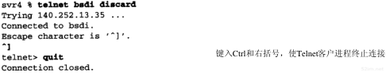

```
telnet 命令在丢弃(discard)服务对应的端口上与主机 bsdi 建立一条 TCP 连接。这服务类型正是我们需要观察的一条连接建立与终止的服务类型，而不需要服务器发起任何数据交换。
```

### 1、tcpdump的输出

```
这条命令产生TCP报文段的 tcpdump 输出。
```

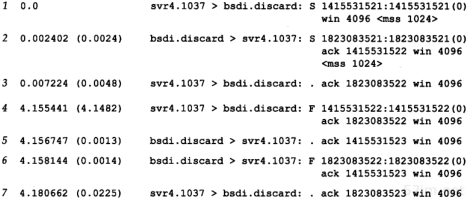


```
这7个TCP报文段仅包含TCP首部。没有任何数据。
对于TCP段，每个输出行开始按如下格式显示：
源 > 目的:标志

这里的标示代表TCP首部中6个标志比特中的4个。下图显示了表示标志的5个字符的含义。
```

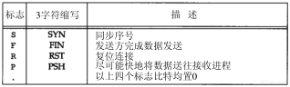

```
在这个例子中，我们看到了S、F和句点"."标志符。我们将在以后看到其他的两个标志(R和P)。TCP首部中的其他两个标志比特--ACK和URG--tcpdump 将作特殊显示。

上图中所示的4个标志比特中的多个可能同时出现在一个报文段中，但通常一次只见到一个。
```

```
RFC 1025[Postel 1987],“TCP and IP Bake Off”，将一种报文段称为Kamikaze分组Θ，在这样的报文段中有最大数量的标志比特同时被置为1（SYN,URG,PSH,FIN和1字节的数据）。这样的报文段也叫作nastygram,圣诞树分组，灯测试报文段(lamp test segment)。
```

```
在第1行中，字段1415531521:1415531521(0)表示分组的序号是1415531521，而报文段中数据字节数为0.tcpdump 显示这个字段的格式是开始的序号、一个冒号、隐含的结尾序号及圆括号内的数据字节数。这个字段只有在满足条件1 报文段中至少包含一个数据字节;或者2 SYN、FIN或RST被设置为1时才显示。图中的第 1、2、4、和6行是因为标志比特被置为1而显示这个字段的，在这个例子中通信双方没有交换任何数据。
	SYN 是在三次握手的时候的发送 握手协议也可以说是同步序号。也就是吧ISN(初始序号)序号发送给客户端或者服务器。让客户端和服务器知道。
	在第2行中，字段 ack1415531522 表示确认序号。它只有在首部中的ACK标志比特被设置1时才显示。
	
	每行显示的字段 win4096 表示发端通告的窗口大小。在这些例子中，我们没有交换任何数据，窗口大小就维持默认情况下4096.
	最后一个字段 <mss1024>表示由发端指明的最大报文段长度选项。发端将不接收超过这个长度的TCP报文段。这通常是为了避免分段。
```

### 2、时间系列

```
这些分组序列的时间系列。这个图显示出哪一端正在发送分组。
```

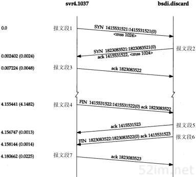

```
从上图中报文3-4说明了 ack 不会占用序号。 ack:1823083522 是确认序号。ack本身并没有占用序号
```


### 3、建立连接协议

```
为了建立一条TCP连接。

1、请求段(通常称为客户)发送一个SYN段指明客户打算连接的服务器的端口，以及初始序号(ISN, 在这个例子中为 1415531521)。这个SYN段为报文段1.

2、服务器发回包含服务器的初始序号的SYN报文段作为应答。同时，将确认序号设置为客户的ISN加1以对客户的SYN报文段进行确认。一个SYN将占用一个序号。

3、客户必须将确认序号设置为服务器的ISN加1以对服务器的SYN报文段进行确认。

这三个报文段完成连接的建立。这个过程也称为三次握手(three-way handshake).
```

```
发送第一个SYN的一端将执行主动打开(active open).接收这个SYN并发回下一个SYN的另一端执行被动打开(passive open).

当一端为建立连接而发送它的SYN时，它为连接选择一个初始序号。ISN随时间而变化，因此每个连接都将具有不同的ISN。RFC 793[Postel 1981c]指出ISN可看作是一个32比特的计数器，每4us加1。这样选择序号的目的在于防止在网络中被延迟的分组在以后又被传送，而导致某个连接的一方对它作错误的解释。
```

```
如何进行序号选择？在4.4BSD（和多数的伯克利的实现版）中，系统初始化时初始的发送序号被初始化为1。这种方法违背了Host Requirements RFC（在这个代码中的一个注释确认这是一个错误）。这个变量每0.5秒增加64000，并每隔9.5小时又回到0（对应这个计数器每8 us加1，而不是每4 us加1）。另外，每次建立一个连接后，这个变量将增加64000。
```

### 4、连接终止协议

```
建立一个连接需要三次握手，而终止一个连接要经过4次握手。这由TCP的半关闭(halfclose)造成的。既然一个TCP连接是全双工(即数据在两个方向上能同时传递)，因此每个方向必须单独地进行关闭。这原则就是当一方完成它的数据发送任务后就能发送一个FIN来终止这个方向连接。当一端收到一个FIN，它必须通知应用层另一端几经终止了那个方向的数据传送。发送FIN通常是应用层进行关闭的结果。

收到一个FIN只意味着在这一方向上没有数据流动。一个TCP连接在收到一个FIN后仍能发送数据。而这对利用半关闭的应用来说是可能的，尽管在实际应用中只有很少的TCP应用程序这样做。正常关闭过程如下图所示。
```

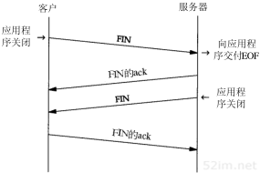

```
首先进行关闭的一方(即发送第一个FIN)将执行主动关闭，而另一方(收到这个FIN)执行被动关闭。通常乙方完成主动关闭而另一方完成被动关闭。
```

```
上图中报文段4发起终止连接，它有Telnet客户端关闭连接时发出。这在我们键入quit命令后发生。它将导致TCP客户端发送一个FIN，用来关闭从客户端到服务器的数据传送。
```

```
当服务器收到这个FIN，它发回一个ACK，确认序号为收到的序号加1.和SYN一样，一个FIN将占用一个序号。同时TCP服务器还向应用程序(即丢弃服务器)传送一个文件结束符。接着这个服务器程序就关闭它的连接，导致它的TCP端发送一个FIN，客户必须发回一个确认，并将确认序号设置为收到序号加1.

上图中显示了终止一个连接的典型握手顺序。我们省略了序号。在这个图中，发送FIN将导致应用程序关闭它们的连接，这些FIN的ACK是由TCP软件自动产生的.
```

```
连接通常是友客户端发起的，这样第一个SYN从客户传到服务器。每一端都能主动关闭这个连接(即首先发送FIN)。然而，一般由客户端决定何时终止连接，因为客户进程通常由用户交互控制，用户会键入诸如"quit"一样的命令来终止进程。在上图中，我们能改变上边的标识，将左方定为服务器，右方定为客户，一切仍将像显示的一样工作。
```

### 5、正常的tcpdump输出

```
对所有的数值很大的序号进行排序是很麻烦的，因此默认情况下 tcpdump只在显示SYN报文段时显示完整的序号，而对其后的序号则显示它们与初始序号的相对偏移值（为了得到图18-1的输出显示必须加上-S选项）。对应于图18-1的正常tcpdump显示如图18-5所示：

除非我们需要显示完整的序号，否则将在以下的例子中使用这种形式的输出显示。
```

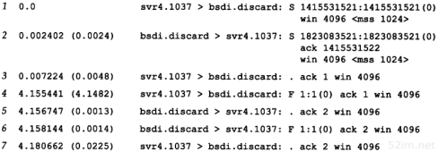


## 3、连接建立的超时

```
有很多情况导致无法建立连接。一种情况是服务器主机没有处于正常状态。为了模拟这种情况，我们断开了服务器主机的电缆线，然后向它发出telnet命令。下图显示了tcpdump的输出。
```

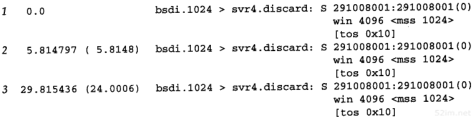

```
在这个输出中有趣的一点是客户间隔多长时间发送一个SYN，试图建立连接。第2个SYN与第一个的间隔是5.8秒，而第三个与第二个的间隔是24秒。

作为一个附注，这个例子运行38分钟后客户重新启动。这对应初始序号为291 008 001（约为38×60×64000×2）。我们曾经介绍过使用典型的伯克利实现版的系统将初始序号初始化为1，然后每隔0.5秒就增加64 000。

另外，因为这是系统启动后的第一个TCP连接，因此客户的端口号是1024。
```

```
图18-6中没有显示客户端在放弃建立连接尝试前进行SYN重传的时间。为了了解它我们必须对telnet命令进行计时:
```

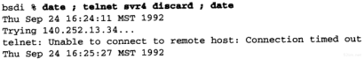

```
时间差值是76秒。大多数伯克利系统将建立一个新连接的最长时间限制为75秒。
我们将在21.4节看到由客户发出的第3个分组大约在16:25:29超时，客户在它第3个分组发出后48秒而不是75秒后放弃连接。
```

### 1、第一次超时时间

```
在上图中一个令人困惑的问题是第一次超时时间为5.8秒，接近6秒，但不准确，相比之下第二个超时时间几乎准确地为24秒。运行十多次测试，发现第一次超时时间在5.59秒~5.93秒之间变化。然而，第二次超时时间则总是24.00秒（精确到小数点后面两位）。
```

```
这是因为BSD版的TCP软件采用一种500ms的定时器。这种500ms的定时器用于确定本章中所有的各种各样的TCP超时。当我们键入telnet命令，将建立一个6秒的定时器(12个时钟滴答(tick)),但它可能在之后的5.5秒~6秒内的任意时刻超时。下图中显示了这一发生过程。尽管定时器初始化为12个时钟抵达，但定时计数器会在设置后的第一个0~500ms中的任意时秒刻减1。从那以后，定时计数器大约每隔500ms减1.但在第一个500ms内是可变的(我们使用限定词"大约"是因为在TCP每隔500ms获得系统控制的瞬间，系统内核可能会优先处理其他中断）。
```

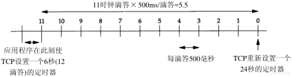


```
这里的 定时计数器会在设置后的第一个0~500ms中的任意时秒刻减1。 
是因为使用的是内核的定时器，第一个0~500ms 减一是和内核统一时间，然后大约减500ms减1，是因为系统内核可能会优先处理其他中断，再来处理定时器减一。

创建一个时钟滴答，每500ms减1，(比如要创建6秒的定时器，就创建 12 个数字，然后每500ms减1,直到为0就超时了。)在第一个减一操作的时候，因为是相对于内核的时间的，所以第一个减一 是根据内核时间的500ms溢出以后减1,所以第一个减一会随机在 1~500ms 内减去，以让 时钟滴答 和内核定时器统一。

6秒以后再24秒就统一了。因为24秒是在6秒超时以后立即创建的。

500ms减一可能会慢一点，因为内核可能会优先处理其他中断，再处理定时器减一。不过因为是根据内核的定时器的500ms移除来减一的，也不会太慢。
```


```
当滴答计数器为0时，6秒的定时器便会超时（见图18-7），这个定时器会在以后的24秒（48个滴答）重新复位。之后的下一个定时器将更接近24秒，因为当TCP的500 ms定时器被内核调用时，它就会被修改一次。应该是接下来是从6秒时候开始的，所以就不会不准确了
```

### 2、服务类型字段

```
在上图中，出现了符号[tos 0x10].这是IP数据报内的服务类型(TOS)字段。BSD/386中的Telnet 客户进程将这个字段设置为最小时延。
```

## 4、最大报文段长度

```
最大报文段长度(MSS)表示TCP传往另一端的最大块数据的长度。当一个连接建立时，连接的双方都要通告各自的MSS。我们已经见过MSS都是1024.这导致IP数据报通常是40字节长：20字节的TCP首部和20字节的IP首部。
```

```
在有些书中，将它看作可“协商”选项。它并不是任何条件下都可协商。当建立一个连接时，每一方都有用与通告它期望接收的MSS选项(MSS选项只能出现在SYN报文段中)。如果一方不接收来自另一方的MSS值，则MSS就定位默认值536（这个默认值允许20字节的IP首部和20字节的TCP首部以适合576字节IP数据报)。

一般来说，如果没有分段发生，MSS还是越大越好(这也并不总是正确)。报文段越大允许每个报文段传送的数据就越多，相对IP和TCP首部有更高的网络利用率。当TCP发送一个SYN时，或者是因为一个本地应用进程想发起一个连接，或者是因为另一端的主机收到了一个连接请求，它能将MSS值设置为外出接口上的MTU长度减去固定的IP首部和TCP首部长度。对于一个以太网，MSS值可达1460字节。使用IEEE 802.3的封装（参见2.2节），它的MSS可达1452字节。

外出接口应该是指链路层的第一段链路的MTU MSS最大报文长度= MTU(最大可传输字节长度)-20IP首部-20TCP首部。

在本章见到的涉及BSD/386和SVR4的MSS为1024，这是因为许多BSD的时间版本需要MSS为512的倍数。其他的系统如SunOS 4.1.3、Solaris 2.2和AIX 3.2.2，当双方都在一个本地以太网上时都规定MSS为1460。[Mogul 1993] 的比较显示了在以太网上1460的MSS在性能上比1024的MSS更好。
```

```
如果目的地地址为"非本地的(nonlocal)",MSS通常的默认值为536.而区分地址是本地还是非本地是简单的，如果目的IP地址的网络号与子网号都和我们的相同，则是本地的；如果目的IP地址的网络号与我们的完全不同，则是非本地的；如果目的IP地址的网络号与我们的相同而子网号与我们的不同，则可能是本地的，也可能是非本地的。大多数TCP实现版都提供了一个配置选项（附录E和图E-1），让系统管理员说明不同的子网是属于本地还是非本地。这个选项的设置将确定MSS可以选择尽可能的大（达到外出接口的MTU长度）或是默认值536。

MSS让主机限制另一端发送数据报的长度。加上主机也能控制它发送数据报的长度，这将使以较小MTU连接到一个网络上的主机避免分段。
```

考虑我们的主机slip，通过MTU为296的SLIP链路连接到路由器bsdi上。图18-8显示这些系统和主机sun。 

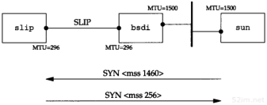

```
sun 向 slip 发起一个TCP连接，并使用 tcpdump 来观察报文段。下图显示这个连接的建立(省略了通告窗口大小)
```

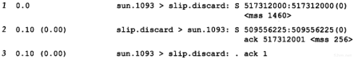

```
在这个例子中，sun发送的报文段不能超过256字节的数据，因为它收到的MSS选项值为256(第二行)。此外，由于 slip 知道它外出接口的MTU长度为296，即使 sun 已经通告它的MSS为1460，但为避免将数据分段，它不会发送超过256字节数据的报文段。系统允许发送的数据长度小于另一端的MSS值。
	只有当一端的主机以小于576字节的MTU直接连接到一个网络中，避免这种分段才会有效。如果两端的主机都连接到以太网上，都采用536的MSS，但中间网络采用296的MTU，也将会出现分段。使用路径上的MTU发现机制（参见24.2节）是关于这个问题的唯一方法。
```

## 5、TCP的半关闭

```
TCP提供了连接的一端在结束它的发送后还能接收来自另一端的能力。这就是所谓的半关闭。正如我们早些时候提到的只有很少的应用程序使用它。
```

```
为了使用这个特性，编程接口必须为应用程序提供一种方式来说明"我已经完成了数据传送，因此发送一个文件结束(FIN)给另一端，但我还想接收另一端发来的数据，直到它给我发来文件结束(FIN)".
	如果应用程序不调用close而调用shutdown，且第2个参数值为1，则插口的API支持半关闭。然而，大多数的应用程序通过调用close终止两个方向的连接。
```

```
图18-10显示了一个半关闭的典型例子。让左方的客户端开始半关闭，当然也可以由另一端开始。开始的两个报文段和图18-4是相同的：初始端发出的FIN，接着是另一端对这个FIN的ACK报文段。但后面就和图18-4不同，因为接收半关闭的一方仍能发送数据。我们只显示一个数据报文段和一个ACK报文段，但可能发送了许多数据报文段（将在第19章讨论数据报文段和确认报文段的交换）。当收到半关闭的一端在完成它的数据传送后，将发送一个FIN关闭这个方向的连接，这将传送一个文件结束符给发起这个半关闭的应用进程。当对第二个FIN进行确认后，这个连接便彻底关闭了。
```

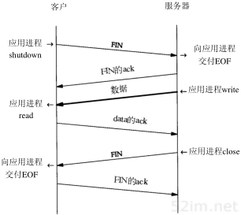

```
为什么要有半关闭？一个例子是Unix中的rsh(1)命令，它将完成在另一个系统上执行一个命令。
```

命令

```
sun % rsh bsdi sort < datafile

将在主机 bsdi 上执行 sort 排序命令，rsh 命令的标准输入来自文件 datafile。 rsh 将在它与在另一台主机上执行的程序间建立一个TCP连接。rsh 的操作很简单：它将标准输入(datafile)复制给TCP连接，并将结果从TCP连接中复制给标准输出(我们的终端)。下图显示了这个建立过程(牢记TCP连接是全双工的).
```

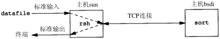

```
在远端主机bsdi上，rshd服务器将执行sort程序，它的标准输入和标准输出都是TCP连接。

sort程序只有读取到所有输入数据后才能产生输出。所有的原始数据通过TCP连接从rsh客户端传送到 sort 服务器进行排序。当输入(datafile)到达文件尾时，rsh客户端执行这个TCP连接的半关闭。接着 sort 服务器在它的标准输入(这个TCP链接)上收到一个文件结束符，对数据进行排序，并将结果写在他的标准输出上(TCP链接)。rsh客户端继续接收来自TCP连接另一端的数据，并将排序的文件复制到它的标准输出上。

没有半关闭，需要其他的一些技术让客户通知服务器,客户端已经完成了它的数据传送，但仍要接收来自服务器的数据。使用两个TCP连接也可作为一个选择，但使用半关闭的单连接更好。
```


