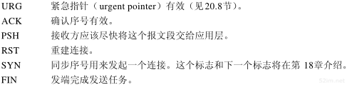

# 第17章TCP：传输控制协议

## 1、TCP的服务

```
尽管TCP和UDP都使用相同的网络层(IP),TCP却向应用层提供与UDP完全不同的服务。TCP提供一种面向连接的、可靠的字节流服务。
```

```
面向连接意味着两个使用TCP的应用(通常是一个客户和一个服务器)在彼此交换数据之前必须先建立一个TCP连接。这一过程与打电话很相似，先拨号振铃，等待对方摘机说"喂"，然后才说明是谁。
```

```
在一个TCP连接中，仅有两方进行彼此通信。广播和多播不能用了TCP(可以由服务器与多个客户端创建TCP链接。)
```

```
TCP通过下列方式来提供可靠性:
	
	应用数据被分割成TCP认为最合适发送的数据块。这和UDP完全不同，应用程序产生的数据报长度将保持不变。由TCP传递给IP的信息单位称为报文段或段(segment).
	
	当TCP发出一个段后，它启动一个定时器，等待目的端确认收到这个报文段。如果不能及时收到一个确认，将重发这个报文段。
	
	当TCP收到发自TCP连接另一端的数据，它将发送一个确认。这个确认不是立即发送，通常将推迟几分之一秒
	
	TCP将保持它首部和数据的检验和。这是一个端到端的检验和，目的是检测数据在传输过程中的任何变化。如果收到端的检验和有差错，TCP将丢弃这个报文段和不确认收到此报文段(希望发端超时并重发)。
	
	既然TCP报文段作为IP数据报来传输，而IP数据报的到达可能会失序，因此TCP报文段的到达也可能会失序。如果必要，TCP将对收到的数据进行重新排序，将收到的数据以正确的顺序交给应用层。
	
	既然IP数据报会发送重复(是由于TCP的超时重发机制而导致的)，TCP的接收端必须丢弃重复的数据。
	
	TCP 还能提供流量控制。TCP连接的每一方都有固定大小的缓冲空间。TCP的接收端只允许另一端发送接收端缓冲区所能接纳的数据。这将防止较快主机致使较慢主机的缓冲区溢出。
```

```
两个应用程序通过TCP连接交换8bit字节构成的字节流。TCP不在字节流中插入记录标识符。我们将这称为字节流服务(byte stream service).如果一方的应用程序先传10字节，又传20字节，再传50字节，连接的另一方将无法了解发方每次发送了多少字节。收方可以分4次接收这80字节，每次接受20字节。一端将字节流放到TCP连接上，同样的字节流将出现在TCP连接的另一端

另外，TCP对字节流的内容不作任何解释。TCP不知道传输的数据字节流是二进制数据，还是ASCII字符、EBCDIC字符或者其他类型数据。对字节流的解释由TCP连接双方的应用层解释。
```

```
这种对字节流的处理方式与Unix操作系统对文件的处理方式很相似。Unix的内核对一个应用读或写的内容不作任何解释，而是交给应用程序处理。对Unix的内核来说，它无法区分一个二进制文件与一个文本文件。
```

## 2、TCP的首部

TCP数据被封装在一个IP数据包中。


显示TCP首部的数据格式。如果不计任选字段。它通常是20字节


```
每个TCP段都包含源端和目的端的端口号，用与寻找发端和收端应用进程。这两个值加上IP首部中的源端IP地址和目的端IP地址唯一确定一个TCP连接。
	有时，一个IP地址和一个端口号也称为一个插口(socket)。插口对(socketpair)(包含客户IP地址、客户端口号、服务器IP地址和服务器端口号的四元组)可唯一确定互联网络中每个TCP连接的双方。
	
	序号用来标识从TCP发端向TCP收端发送的数据字节流，它表示在这个报文段中的第一个数据字节。如果将字节流看作两个应用程序间的单向流动，则TCP用序号对每个字节进行计数。序号是32bit的无符号数，需要到达2^32 -1 后又从0开始。
	
	当建立一个新的连接时，SYN 标志变1,。序号字段包含这个主机选择的该连接的初始序号ISN(initial Sequence Number).该主机要发送数据的第一个字节序号为这个ISN加1，因为SYN标志消耗了一个序号。(是因为这个SYN 是客户端的确认已经连接上了返回回来的序号，如果再发送过去就要将序号+1嘛(因为要把返回回来的连接的序号+1 返会回来的序号是希望服务器再次发送的序号))。
	
	既然每个传输的字节都被计数，确认序号包含发送确认的一端所期望收到的下一个序号。因此，确认序号应当是上次已成功收到数据字节序号加1.只有ACK标志为1时确认序号字段才有效。
	
	发送ACK无需任何代价，因为32bit的确认序号字段和ACK标志一样，总是TCP首部的一部分。因此，我们看到一旦一个连接建立起来，这个字段总是被设置，ACK表示也总是被设置。
	
	TCP为应用层提供全双工服务。这意味数据能在两个方向上独立的进行传输。因此，连接的每一端必须保持每个方向上的传输数据序号。
	
	TCP可以表述为一个没有选择确认或否认的滑动窗口协议，我们说TCP缺少选择确认是因为TCP首部的确认序号表示发方已成功收到字节，但还不包含确认序号所指的字节(协议)。(就是确认了确认序号-1所指的字节(协议)但是确认字节本身的协议并没有确认发送)。当前还无法对数据流中选定的部分进行确认。
	例如，如果1～1024字节已经成功收到，下一报文段中包含序号从2049～3072的字节，收端并不能确认这个新的报文段。它所能做的就是发回一个确认序号为1025的ACK。它也无法对一个报文段进行否认。例如，如果收到包含1025～2048字节的报文段，但它的检验和错，TCP接收端所能做的就是发回一个确认序号为1025的ACK。在21.7节我们将看到重复的确认如何帮助确定分组已经丢失。
```


```
	首部长度给出首部中32bit字的数目。需要这个值是因为任选字段的长度是可变的，这个字段占4bit，因此TCP最多有60字节的首部。然而，没有任选字段，正常的长度是20字节。
	在TCP首部中有6个比特。它们中的多个可同时被设置为1.
```




```
TCP的流量控制由连接的每一端通过声明的窗口大小来提供。窗口大小为字节数，起始于确认序号字段指明的值，这个值是接收端正期望接收的字节。窗口大小是一个16bit字段，因而窗口大小最大为 65535 字节。
```

```
	检验和覆盖了整个TCP报文段:TCP首部和TCP数据。这是一个强制性的字段，一定是由发端计算和存储，并由收端进行验证。TCP检验和的计算和UDP检验和的计算相似。使用一个伪首部。

	只有当URG表示置1时紧急指针才有效。紧急指针是一个正的偏移量，和序号字段中的值相加表示紧急数据最后一个字节的序号。TCP的紧急方式是发送端向另一端发送紧急数据的一种方式。
	
	最常见的可选字段是最长报文大小，又称为MSS(Maximum Segment Size).每个连接方通常都在通信的第一个报文段(为建立连接而设置SYN标志的那个段)中指明和这个选项。它指明本端所能接收的最大长度的报文段。
	
	从TCP协议的介绍图中我们注意到TCP报文段中的数据部分是可选的。我们将在18章中看到在一个连接建立和一个连接终止时，双方交换的报文段仅有TCP首部。如果一方没有数据要发送，也使用没有任何数据的首部来确认收到的数据。在处理超时的许多情况中，也会发送不带任何数据的报文段。
```


## 3、小结

```
TCP提供了一种可靠的面向连接的字节流运输层服务。
TCP将用户数据打包构成报文段;它发送数据后启动一个定时器;另一端对收到的数据进行确认，对失序的数据重新排序，丢弃重复数据;TCP提供端到端的流量控制，并计算和验证一个强制性的端到端检验和。
```

## 4、习题

```
1、我们已经介绍了以下几种分组格式：IP、ICMP、IGMP、UDP和TCP。每一种格式的首部中均包含一个检验和。对每种分组，说明检验和包括IP数据报中的哪些部分，以及该检验和是强制的还是可选的。

除了UDP的检验和，其他都是必需的。IP检验和只覆盖了IP首部，而其他字段都紧接着IP首部开始。
```

```
2、为什么我们已经讨论的所有Internet协议（IP,ICMP,IGMP,UDP,TCP）收到有检验和错的分组都仅作丢弃处理？

答：源IP地址、源端口号或者协议字段可能被破坏了

3、TCP提供了一种字节流服务，而收发双方都不保持记录的边界。应用程序如何提供它们自己的记录标识？

答：很多Internet应用使用一个回车和换行来标记每个应用记录的结束。这是NVT ASCII采用的编码（26.4节）。另外一种技术是在每个记录之前加上一个记录的字节计数，DNS（习题14.4）和Sun RPC（29.2节）采用了这种技术。

4、为什么在TCP首部的开始便是源和目的的端口号？

答：就像我们在6.5节所看到的，一个ICMP差错报文必须至少返回引起差错的IP数据报中除了IP首部的前8个字节。当TCP收到一个ICMP差错报文时，它需要检查两个端口号以决定差错对应于哪个连接。因此，端口号必须包含在TCP首部的前8个字节里。

5、为什么TCP首部有一个首部长度字段而UDP首部（图11-2）中却没有？

答：TCP首部的最后有一些选项，但UDP首部中没有选项。


如果发送端没有计算检验和而接收端检测到检验和有差错，那么UDP数据报就要被悄悄地丢弃。不产生任何差错报文（当IP层检测到IP首部检验和有差错时也这样做）。
```

```
IP协议的检验和：
首先把检验和字段置为0.然后，对首部中每个16bit进行二进制反码求和(整个首部看成是由一串16 bit的字组成)，结果存在检验和字段中。(就是就ip首部的数据分割成一个一个16bit字节。然后将这些字节求和。将结果放在检验和字段中。)。 当收到一份IP数据报后，同样对首部中每个16bit进行二进制反码的求和。由于接收方在计算过程中包含了发送方存在首部中的检验和，因此，如果首部在传输过程中没有发生任何差错，那么接收方计算的结果应该为全1。如果结果不是全1（即检验和错误），那么IP就丢弃收到的数据报。但是不生成差错报文，由上层去发现丢失的数据报并进行重传。(就是说计算结果应该和检验和里面的16bit相同。不相同就丢弃)
```

## IP分片

```
IP在从上层接到数据以后，要根据IP地址来判断从那个接口发送数据(通过选路)，并进行MTU的查询，如果数据大小超过MTU就进行数据分片，数据的分片是对上层和下层透明，而数据也只是到达目的地还会被重新组装，不过不用担心，IP层提供了足够的信息进行数据的再组装。

在IP头里面，16bit识别号唯一记录了一个IP包的ID，具有同一个ID的IP片将会被重新组装，而13位偏移则记录了某IP片相对整个包的位置;而这两个表示中间的3bit标志则标示着该分片后面是否还有新的分片。(3bit标志里面有一个bit用来标识是否可以分片,不可以分片就发送ICMP差错报文)这三个标示就组成了 IP 分片的所有信息,接 受方就可以利用这些信息对 IP 数据 进行重新组织(就算是后面的分片比前面的分片先到,这些信息也是足够了

因为分片技术在网络上被经常的使用,所以伪造 IP 分片包进行流氓攻击的软件和人也就层出不穷。可以用 Trancdroute 程序来进行简单的 MTU 侦测。请参看教材。
```


## 5、笔记

### 1、概述

```
TCP和UDP处在同一层 --运输层，但是TCP和UDP最不同的地方是，TCP提供了一种可靠的数据传输服务，TCP是面向连接的，也就是说，利用TCP通信的两台主机首先要经历一个"拨打电话"的过程，等到通信准备结束才开始传输数据，最后结束通话。所以TCP要比UDP可靠的多，UDP是把数据直接发出去，而不管对方是不是在收信，,就算是 UDP 无法送达(无法送达的意思是不知道到底送达没有，有可能在计算检验和有差错，被抛弃，这样子算是没有送达)，也不会产生ICMP差错报文。(IP协议也一样)
	但是接收端一定会收到，就是计算检验和有差错,就算收到了也会被丢弃


如果发送端没有打开检验和选项,而接收端计算检验和有差错,那么 UDP 数据将会 被悄悄的丢掉(不保证送达)
```

### 2、TCP保证可靠性的简单工作原理摘抄如下

```
1、应用数据被分割成TCP认为最合适发送的数据块。这个UDP完全不同，应用程序产生的数据包长度将保持不变。由TCP传递给IP的信息单位成为报文段或段(Segment)

2、当TCP发出一个段后，它启动一个定时器，等待目的端收到这个报文段。如果不能及时收到一个确认，将重发这个报文段。

3、当TCP收到发自TCP连接另一端的数据，它将发送一个确认。这个确认不是发送，通常将推迟几分之一秒。

4、TCP将保持它首部和数据的检验和。这是一个端到端的检验和，目的是检验数据在传输过程中的任何变化。如果收到段的检验和有差错，TCP讲丢弃这个报文段和不确认收到此报文段(希望发端超时并重发)。

5、既然TCP报文段作为IP数据包来传输，而IP数据包的到达可能会失序，因此TCP报文段的到达也可能会失序，因此TCP报文段的达到也可能会失序。如果必要, TCP 将对收到的数据进行重新排序,将收到的数据以正确的顺序交给应用层。

6、 TCP 还能提供流量控制。TCP 连接的每一方都有固定大小的缓冲空间。TCP 的接收端只允许另一端发送接收端缓冲区所能接纳的数据。这将防止较快主机致使较慢主机的缓冲区溢出。

从上面这些话中可以看到,TCP 中保持可靠性的方式就是超时重发,这是有道理的,虽然 TCP 也可以用各种各样的 ICMP 报文来处理这些,但是这也不是可靠的,最可靠的方式就是只要不得到确认,就重新发送数据报,直到得到对方的确认为止。
```

```
TCP首部和UDP首部一样，都有发送端口号和接收端口号。但是显然，TCP的首部信息要比UDP得多，可以看到,TCP协议提供了发送和确认所需要的所有必要信息。

可以想象一个TCP数据的发送应该是如下的一个过程：

双方建立链接

发送方给接收方TCP数据报，然后等待对方的确认TCP数据报。如果没有，就重新发,如果有，就发送下一个数据报。

接收方等待发送方的数据报，如果得到数据报并检验无误，就发送ACK(确认)数据报，并等待下一个TCP数据报的到来。直到接收到FIN(发送完成数据报);

中止连接。

可以想见,为了建立一个 TCP 连接,系统可能会建立一个新的进程(最差也是一个线程),来进行数据的传送。
```


# 第18章、TCP连接的建立与终止

## 1、引言

```
TCP是一个面向连接的协议。无论哪一方向另一方发送数据之前，都必须先在双方之间建立一条连接。
```


