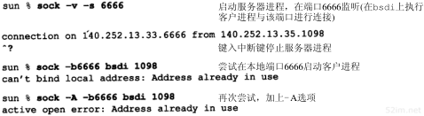

# 18、TCP链接的建立与终止

## 6、TCP的状态变迁图

```
我们已经介绍了许多有关发起和终止TCP连接的规则。这些规则都能从图18-12所示的状态变迁图中得出。
```


```
上面的收发是指，收到了什么发了什么，就会变成另一种状态
A 收到了"我是B" 发了"我是B" A就转变成了 B
A 收到了"我是B" 发了"我是DFFDS" A就转变成了 C

SYN收到就是 SYN_RCVD
```

```
在这个图中要注意的第一点是一个状态变迁的子集是"典型的"。我们用粗的实线箭头表示正常的客户端状态变迁，用粗的虚线箭头表示正常的服务器状态变迁。
```

```
第二点是两个导致进入ESTABLISH-ED状态的变迁对应打开一个连接，而两个导致从ESTABLISHED状态离开的变迁主动打开对应关闭一个连接。ESTABLISHED状态是连接双方能够进行双向数据传递的状态。以后的章节将介绍这个状态。
```

```
将图中左下角4个状态放在一个虚线框内，并标为“主动关闭”。其他两个状态(CLOSE_WAIT和LAST_ACK)也用虚线框住,并标为“被动关闭”。
```

```
这个图中11个状态的名称关闭) (CLOSED，LISTEN，SYN_SENT等)是有意与netstat命令显示的状态名称一致。netstat对状态的命名几乎与在RFC793中的最初描述一致。CLOSED状态不是一个真正的状态，而是这个状态图的假想起点和终点。
```

```
从LISTEN到SYN_SENT的变迁是正确的，但伯克利版的TCP软件并不支持它。
```

```
只有当SYN_RCVD状态是从LISTEN状态（正常情况）进入，而不是从SYN_SENT状态（同时打开）进入时，从SYN_RCVD回到LISTEN的状态变迁才是有效的。这意味着如果我们执行被动关闭（进入LISTEN），收到一个SYN，发送一个带ACK的SYN（进入SYN_RCVD），然后收到一个RST，而不是一个ACK，便又回到LISTEN状态并等待另一个连接请求的到来。
```

```
图18-13显示了在正常的TCP连接的建立与终止过程中，客户与服务器所经历的不同状态。它是图18-3的再现，不同的是仅显示了一些状态。
```


```
假定在图18-13中左边的客户执行主动打开，而右边的服务器执行被动打开。尽管图中显示出由客户端执行主动关闭，但和早前我们提到的一样，另一端也能执行主动关闭。

可以使用图18-12的状态图来跟踪图18-13的状态变化过程，以便明白每个状态的变化。
```

### 1、2MSL等待时间

```
TIME_WAIT 状态也称为2MSL 等待状态。每个具体TCP实现必须选择一个报文段最大生存时间MSL(Maximum Segment Lifetime).它是任何报文段被丢弃前在网络内的最长时间。我们知道这个时间是有限的，因为TCP报文段以IP数据报在网络内传输，而IP数据报则有限制其生存时间的TTL字段。

RFC 793 [Postel 1981c]指出MSL为2分钟。然而，实现中的常用值是30秒，1分钟，或2分钟。
```

```
从第8章我们知道在实际应用中，对IP数据报TTL的限制是基于跳数，而不是定时器。

对于一个具体实现所给定的MSL值，处理的原则是：当TCP执行一个主动关闭，并发回最后一个ACK,该连接必须在TIME_WAIT状态停留的时间为2倍的MSL。这样可让TCP再次发送最后的ACK以防这个ACK丢失(另一端超时并重发最后的FIN).
```

```
这种2MSL 等待的另一个结果是这个TCP连接在2MSL等待期间，定义这个连接的插口(客户的IP地址和端口号，服务器的IP地址和端口号)不能再被使用。这个连接只能在2MSL结束后才能再被使用。

遗憾的是，大多数TCP实现（如伯克利版）强加了更为严格的限制。在2MSL等待期间，插口中使用的本地端口在默认情况下不能再被使用。我们将在下面看到这个限制的例子。

	某些实现和API提供了一种避开这个限制的方法。使用插口API时，可说明其中的SO_REUSEADDR选项。它将让调用者对处于2MSL等待的本地端口进行赋值，但我们将看到TCP原则上仍将避免使用仍处于2MSL连接中的端口。

在连接处于2MSL等待时，任何迟到的报文段将被丢弃。因为处于2MSL等待的、由该插口对(socketpair)定义的链接在这段时间内不能被再用，因此当要建立一个有效的链接时，来自该连接的一个较早替身(incarnation)的迟到报文段作为新连接的一部分不可能不被曲解(一个连接由一个插口对 socketpair 来定义。一个连接的新的实例(instance)称为该连接的替身。)
```

```
我们说客户端执行主动关闭并进入TIME_WAIT是正常的。服务器通常执行被动关闭，不会进入TIME_WAIT状态。这暗示如果我们终止一个客户程序，并立即重新启动这个客户程序，则这个新客户程序不能重用相同的本地端口。这不会带来什么问题，因为客户使用本地端口，而并不关心这个端口号是什么。

然而，对于服务器，情况有所不同，因为服务器使用熟知端口。如果我们终止一个已经建立链接的服务器程序，并试图立即重新启动这个服务器程序，服务器程序将不能吧它的这个熟知端口赋值给它的端点，因为那个端口是处于2MSL连接的一部分。在重新启动服务器程序前，它需要1~4分钟。
```

可以通过sock程序看到这一切。我们启动服务器程序，从一个客户程序进行连接，然后停止这个服务器程序。 


```
当重新启动服务器程序时，程序报告一个差错信息说明不能绑定它的熟知端口，因为该端口已被使用(即它处于2MSL等待)。

LISTEN 被动打开 监听
SYN_SENT 主动打开 发送了 SYN(同步ISN 并且发送MSS最大报文段长度)
SYN_RCVD SYN_收到状态 就是收到了 SYN 状态
ESTABLISH_ED 建立链接 收到了 SYN 的 ACK 状态 
FIN_WAIT_1 发送了 FIN 状态
FIN_WAIT_2 收到了 FIN 的 ACK 状态
TIME_WAIT 响应了服务器发送的过来的 FIN ，也就是说发送了 ACK 状态 进入了 2MSL状态，
CLOSE_WAIT 服务器被动关闭，收到了客户端发送过来的 FIN 并且进行了 ACK 回复
LAST_ACK 发送了服务器段的 FIN 等待 客户端的 ACK 确认
CLOSED 收到了 客户端的ACK确认，结束链接
```

```
当重新启动服务器程序时，程序包报告一个差错信息说明不能绑定它的熟知端口，因为该端口已被使用(即它处于2MSL等待)。2MSLS(Maximum Segment Lifetime)

运行 netstat 程序来查看连接的状态，以证实它的确处于2MSL等待状态.

如果我们一直试图重新启动服务器程序，并测量它直到成功所需的时间，我们就能确定出2MSL值。对于SunOS 4.1.3、SVR4、BSD/386和AIX 3.2.2，它需要1分钟才能重新启动服务器程序，这意味着它们的MSL值为30秒。而对于Solaris 2.2，它需要4分钟才能重新启动服务器程序，这表示它的MSL值为2分钟。
```

```
如果一个客户程序试图申请一个处于2MSL等待的端口（客户程序通常不会这么做），就会出现同样的差错。
```


```
我们在第一次执行客户程序时采用 -v 选项来查看它使用的本地端口为 1162.第二次执行客户程序时采用 -b 选项来选择端口 1162 为它的本地端口。正如我们所预料的那样，客户程序无法那么做，因为那个端口是一个还处于2MSL等待连接的一部分。
```

```
一个IP地址和一个端口号也称为一个插口 socket. 
插口对 socketpair  pair(对) (包含客户IP地址、客户端口号、服务器IP地址和服务器端口号的四元组)可唯一确定互联网络中每个TCP连接的双方。

替身
```

```
需要再次强调2MSL等待的一个效果，因为我们将在27章的文件传输协议FTP中遇到它。和以前介绍的一样，一个插口对(即包含本地IP地址、本地端口、远端IP地址和远端端口的4元组合)在它处于2MSL等待时，将不能再被使用。尽管许多具体的实现中允许一个进程重新使用仍处于2MSL等待的端口(通常是设置选项 SO_REUSEADDR),但TCP不能允许一个新的连接建立在相同的插口对上。可通过下面的试验来看到这一点：
```



```
第1次运行 sock 程序中，我们将它作为服务器程序，端口号为6666，并从主机 bsdi 上的一个客户程序与她连接，这个客户程序使用的端口为 1098 。我们终止服务器程序，因此它将执行主动关闭。这将导致4元组140.252.13.33（本地IP地址）、6666（本地端口号）、140.252.13.35（另一端IP地址）和1098（另一端的端口号）在服务器主机进入2MSL等待。
```

```
在第2次运行sock程序时，我们将它作为客户程序，并试图将它的本地端口号指明为6666，同时与主机bsdi在端口1098上进行连接。但这个程序在试图将它的本地端口号赋值为6666时产生了一个差错，因为这个端口是处于2MSL等待4元组的一部分。

	为了避免这个差错，我们再次运行这个程序，并使用选项-A来设置前面提到的SO_REUSEADDR。这将让sock程序能将它的本地端口号设置为6666，但当我们试图进行主动打开时，又出现了一个差错。即使它能将它的本地端口设置为6666，但它仍不能和主机bsdi在端口1098上进行连接，因为定义这个连接的插口对仍处于2MSL等待状态。
	
	如果我们试图从其他主机来建立这个连接会如何？首先我们必须在sun上以-A标记来重新启动服务器程序，因为它需要的端口（6666）是还处于2MSL等待连接的一部分。
	
	sun % sock -A -s 6666    启动服务器程序，在端口6666监听
	
	接着，在2MSL等待结束前，我们在bsdi上启动客户程序：
	
	bsdi % sock -b1098 sun 6666
	
	connected on 140.252.13.35.1098 to 140.252.13.33.6666
	
	不幸的是它成功了！这违反了TCP规范，但被大多数的伯克利版实现所支持。这些实现允许一个新的连接请求到达仍处于TIME_WAIT状态的连接，只要新的序号大于该连接前一个替身的最后序号。在这个例子中，新替身的ISN被设置为前一个替身最后序号与128 000的和。附录的RFC 1185 [Jacobsan、Braden和Zhang 1990]指出了这项技术仍可能存在缺陷。

对于同一连接的前一个替身，这个具体实现中的特性让客户程序和服务器程序能连续地重用每一端的相同端口号，但这只有在服务器执行主动关闭才有效。我们将在图27-8中使用FTP时看到这个2MSL等待条件的另一个例子。也见习题18.5。
```

```
尽管许多具体的实现中允许一个进程重新使用仍处于2MSL等待的端口(通常是设置选项 SO_REUSEADDR),但TCP不能允许一个新的连接建立在相同的插口对上。
```


### 2、平静时间的概念

```
对于来自某个连接的较早替身的迟到报文段，2MSL等待可防止将它解释成相同插口对的新连接的一部分。但这只有在处于 2MSL 等待连接中的主机处于正常工作状态时才有效。

	如果使用处于2MSL等待端口的主机出现故障，它会在MSL秒内重新启动，并立即使用故障前仍处于2MSL的插口对来建立一个新的连接吗？如果是这样，在故障前从这个连接发出而迟到的报文段会被错误地当作属于重启后新连接的报文段。无论如何选择重启后新连接的初始序号，都会发生这种情况。
	为了防止这种情况，RFC 793指出TCP在重启动后的MSL秒内不能建立任何连接。这就称为平静时间(quiet time)。

只有极少的实现版遵守这一原则，因为大多数主机重启动的时间都比MSL秒要长。
```

### 3、FIN_WAIT_2状态

```
FIN_WAIT_2 客户端收到了来自服务器对客户端发送的FIN的确认ACK
COLSE_WAIT 服务器发送了 对客户端发送的FIN的确认 ACK
LAST_ACK 服务器发送了 FIN 并正在等待客户端的ACK
WIAT_TIME 客户端发送了 对服务器发送的FIN的确认 ACK，为了防止 ACK 超时，就要等待2MSL(Maximun Segment Lifetime) 时间
```

```
在 FIN_WAIT_2 状态我们已经发出了FIN，并且另一端也已对它进行确认。除非我们在实行半关闭，否则将等待另一端的应用层意识到它已收到一个文件结束符说明，并向我们发一个FIN来关闭另一方向的连接。只有当另一端的进程完成这个关闭，我们这端才会从FIN_WAIT_2状态进入TIME_WAIT状态。

	这意味着我们这端可能永远保持这个状态。另一端也将处于CLOSE_WAIT状态，并一直保持这个状态直到应用层决定进行关闭。
	
	许多伯克利实现采用如下方式来防止这种在FIN_WAIT_2状态的无限等待。如果执行主动关闭的应用层将进行全关闭，而不是半关闭来说明它还想接收数据，就设置一个定时器。如果这个连接空闲10分钟75秒，TCP将进入CLOSED状态。在实现代码的注释中确认这个实现代码违背协议的规范。
```


## 7、复位报文段

```
我们已经介绍了TCP首部的RST比特是用于"复位"的。一般来说，无论何时一个报文段发往基准的连接(referenced connection)出现错误，TCP都会发出一个复位报文段(这里提到的"基准的连接"是指由目的IP地址和目的端口号以及源IP地址和源端口号指明的连接。这就是为什么RFC 793 称之为插口)。
```

### 1、到不存在的端口的连接请求

```
产生复位的一种常见情况是当连接请求到达时，目的端口没有进程正在听。对于UDP，我们在6.5节看到这种情况，当一个数据报到达目的端口时，该端口没在使用，它将产生一个ICMP端口不可达的信息。而TCP则使用复位。
```

```
产生这个例子也很容易，我们可使用Telnet 客户程序来指明一个目的端口没在使用的情况：

bsdi % telnet svr4 20000    端口20000未使用

Trying 140.252.13.34...

telnet: Unable to connect to remote host: Connection refused
```

Telnet客户程序会立即显示这个差错信息。图18-14显示了对应这个命令的分组交换过程。 


```
在这个图中需要注意的值是复位报文段中的序号字段和确认序号字段。因为ACK比特在到达的报文段中没有被设置为1，复位报文段中的序号被置为0，确认序号被置为进入的ISN加上数据字节数。尽管在到达的报文段中没有真正的数据，但SYN比特从逻辑上占用了1字节的序号空间；因此，在这个例子中复位报文段中确认序号被置为ISN与数据长度（0）、SYN比特所占的1的总和。
```

### 2、异常终止一个连接

```
我们在18.2节中看到终止一个连接的正常方式是一方发送FIN。有时这也称为有序释放(orderly release)，因为在所有排队数据都已发送之后才发送FIN，正常情况下没有任何数据丢失。但也有可能发送一个复位报文段而不是FIN来中途释放一个连接。有时称这为异常释放（abortive release）。
```

```
异常终止一个连接对应用程序来说有两个优点：(1)丢弃任何待发数据并立即发送复位报文段;
(2)RST的接收方会区分另一端执行的是异常关闭还是正常关闭。应用程序使用的API必须提供产生异常关闭而不是正常关闭的手段。
```

```
使用sock程序能够观察这种异常关闭的过程。Socket API通过“linger on close”选项（SO_LINGER）提供了这种异常关闭的能力。我们加上-L选项并将停留时间设为0。这将导致连接关闭时进行复位而不是正常的FIN。我们连接到处于服务器上的sock程序，并键入一输入行：
```


```
图18-15是这个例子的tcpdump输出显示（在这个图中我们已经删除了所有窗口大小的说明，因为它们与讨论无关）。

第1~3行显示出建立连接的正常过程。第4行发送我们键入的数据行（12个字符和Unix换行符），第5行是对收到数据的确认。
```


```
第6行对应为终止客户程序而键入的文件结束符（Control_D）。由于我们指明使用异常关闭而不是正常关闭（命令行中的-L0选项），因此主机bsdi端的TCP发送一个RST而不是通常的FIN。RST报文段中包含一个序号和确认序号。需要注意的是RST报文段不会导致另一端产生任何响应，另一端根本不进行确认。收到RST的一方将终止该连接，并通知应用层连接复位。

我们在服务器上得到下面的差错信息：
```


```
这个服务器程序从网络中接收数据并将它接收的数据显示到其标准输出上。通常，从它的TCP上收到文件结束符后便将结束。但这里我们看到当收到RST时，它产生了一个差错。这个差错正是我们所期待的：连接被对方复位了。
```

### 3、检测半打开连接

```
如果一方已经关闭或异常终止连接而另一方却还不知道，我们将这样的TCP连接称为半打开（Half-Open）的。任何一端的主机异常都可能导致发生这种情况。只要不打算在半打开连接上传输数据，仍处于连接状态的一方就不会检测另一方已经出现异常。

半打开连接的另一个常见原因是当客户主机突然掉电而不是正常的结束客户应用程序后再关机。这可能发生在使用PC机作为Telnet的客户主机上，例如，用户在一天工作结束时关闭PC机的电源。当关闭PC机电源时，如果已不再有要向服务器发送的数据，服务器将永远不知道客户程序已经消失了。当用户在第二天到来时，打开PC机，并启动新的Telnet客户程序，在服务器主机上会启动一个新的服务器程序。这样会导致服务器主机中产生许多半打开的TCP连接（在第23章中我们将看到使用TCP的keepalive选项能使TCP的一端发现另一端已经消失）。
```

```
能很容易地建立半打开连接。在bsdi上运行Telnet客户程序，通过它和svr4上的丢弃服务器建立连接。我们键入一行字符，然后通过tcpdump进行观察，接着断开服务器主机与以太网的电缆，并重启服务器主机。这可以模拟服务器主机出现异常（在重启服务器之前断开以太网电缆是为了防止它向打开的连接发送FIN，某些TCP在关机时会这么做）。服务器主机重启后，我们重新接上电缆，并从客户向服务器发送另一行字符。由于服务器的TCP已经重新启动，它将丢失复位前连接的所有信息，因此它不知道数据报文段中提到的连接。TCP的处理原则是接收方以复位作为应答。图18-16是这个例子的tcpdump输出显示（已从这个输出中删除了窗口大小的说明、服务类型信息和MSS声明，因为它们与讨论无关）。
```


图18-16是这个例子的tcpdump输出显示(已从这个输出中删除了窗口大小的说明、服务类型信息和MSS声明,因为它们与讨论无关)。 


```
第1~3行是正常的连接建立过程。第4行向丢弃服务器发送字符行“hithere”，第5行是确认。

然后是断开svr4的以太网电缆，重新启动svr4，并重新接上电缆。这个过程几乎需要190秒。接着从客户端输入下一行（即“another line”），当我们键入回车键后，这一行被发往服务器（图18-16的第6行）。这导致服务器产生一个响应，但要注意的是由于服务器主机经过重新启动，它的ARP高速缓存为空，因此需要一个ARP请求和应答（第7、8行）。第9行表示RST被发送出去。客户收到复位报文段后显示连接已被另一端的主机终止（Te lnet客户程序发出的最后信息不再有什么价值）。

一个TCP三次握手的超时时间是
	6 24 48 76 到了 76 以后就报错了
但是已经建立了连接就不知道超时时间是多少了。
```

## 8、同时打开

```
两个应用程序同事彼此执行主动打开的情况是可能的，尽管发生的可能性极小。每一方必须发送一个SYN，且这些SYN必须传递给对方。这需要每一方使用一个对方熟知的端口作为本地端口。这又称为同时打开（simultaneous open）。

例如，主机A中的一个应用程序使用本地端口7777，并与主机B的端口8888执行主动打开。主机B中的应用程序则使用本地端口8888，并与主机A的端口7777执行主动打开。

这与下面的情况不同：主机A中的Telnet客户程序和主机B中Telnet的服务器程序建立连接，与此同时，主机B中的Telnet客户程序与主机A的Telnet服务器程序也建立连接。在这个Telnet例子中，两个Telnet服务器都执行被动打开，而不是主动打开，并且Telnet客户选择的本地端口不是另一端Te lnet服务器进程所熟悉的端口。
```


