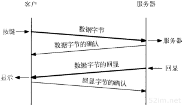

# 第19章TCP的交互数据流

## 1、引言

```
前一章我们介绍了TCP连接的建立与释放，现在来介绍使用TCP进行数据传输的有关问题。

一些有关TCP通信量的研究如[Caceres et al. 1991]发现，如果按照分组数量计算，约有一半的TCP报文段包含成块数据（如FTP、电子邮件和Usenet新闻），另一半则包含交互数据（如Telnet和Rlogin）。如果按字节计算，则成块数据与交互数据的比例约为90%和10%。这是因为成块数据的报文段基本上都是满长度（full-sized）的（通常为512字节的用户数据），而交互数据则小得多（上述研究表明Telnet和Rlogin分组中通常约90%左右的用户数据小于10个字节）。
```

```
很明显，TCP需要同时处理这两类数据，但使用的处理算法则有所不同。本章将以Rlogin应用为例来观察交互数据的传输过程。将揭示经受时延的确认是如何工作的以及Nagle算法怎样减少了通过广域网络传输的小分组的数目，这些算法也同样适用于Telnet应用。下一章我们将介绍成块数据的传输问题.
```

## 2、交互式输入

```
首先来观察在一个 Rlogin 连接上键入一个交互命令时所产生的数据流。许多TCP/IP的初学者很吃惊的发现通常每一个交互按键都会产生一个数据分组，也就是说，每次从客户传到服务器的是一个字节的按键(而不是每次一行)。而且，Rlogin 需要远程系统(服务器)回显我们(客户)键入的字符。这样就会产生4个报文段：(1)来自客户的交互按键;(2)来自服务器的按键确认;(3)来自服务器的按键回显(4)来自客户的按键回显确认
```



```
然而，我们一般可以将报文段2和3进行合并-按键确认与按键回显一起发送。下一节将描述这种合并的技术(称为经受时延的确认)。
```

## 3、经受时延的确认

```
吧从 bsdi 发送到 srv4 的7个ACK标记为经受时延的ACK。通常TCP在接收到数据时并不立即发送ACK；相反，它推迟发送，以便将ACK与需要沿该方向发送的数据一起发送(有时称这种现象为数据捎带ACK)。绝大多数实现采用的时延为200ms;也就是说，TCP将以最大200ms的时延等待是否有数据一起发送。
```

```
如果有一个约为16ms等待时间越过了内核的200ms时钟滴答的边界，则仍可以看到一个经受时延的ACK; 
从这里可以看出内核并没有为每个tcp发送数据的时候创建一个定时器来倒计时 n秒，到了n秒以后再确认是否超时，而是使用了一个统一的时钟好像是每 50 ms 滴答一次？

当为检测超时而使用500ms的TCP定时器时，我们会看到同样的情况。这两个200ms和500ms的定时器都在相对于内核引导的时间处溢出。不论tcp何时设置一个定时器，该定时器都可能在将来的1~200ms和1~500ms的任一处溢出。

Host Requirements RFC声明TCP需要实现一个经受时延的ACK，但时延必须小于500 ms。
```

```
百度到的解释：

TCP使用了一个200ms的定时器，该定时器以相对于内核引导的200ms固定时间溢出。由于将要确认的数据是随机到达的(在时刻 16.4, 474.3, 831.1等)，TCP在内核的200ms 定时器的下一次溢出时得到通知。这有可能是将来1~200ms中的任何一刻。

意思是：tcp不可能这样子干活，比如一个包接收到了,好，那从接收到这个包开始计时200ms,然后若期间有数据传回去，则立即携带ack一起发送，如果到了200ms还没有，那就只能传送一个不携带数据的ack了，也称受经时延的ack。因为数据传过来的时间是随机的，如果为每个包都搞一个计时器，那工作量就太大了。

所以，tcp会在内核搞一个定时器，200ms的。数据包收到之后，如果下一个定时器溢出(计算到200ms)的时候，还没有什么数据要跟着ack一起传过去的话，那就只能单独发送一个ack了。


18章的500ms溢出一次的超时定时器也是这个原理。
```

## 4、Nagle 算法

```
在前一节我们看到，在一个rlogin连接上客户一般每次发送一个字节到服务器，这就产生了一写41字节长的分组：20字节的ip首部、20字节的TCP首部和一个字节的数据。在局域网上，这些小分组(被成为微小分组(tinygram))通常不会引起麻烦，一局域网一般不会出现拥塞。但在局域网上，这些小分组则会增加拥塞出现的可能。一种简单和好的方法就是采用RFC 896 [Nagle 1984]中所建议的Nagle算法。
```

```
该算法要求一个TCP连接上最多只能有一个未被确认的未完成的小分组，在该分组的确认到达之前不能发送其他的小分组。相反，TCP收集这些少量的分组，并在确认到来时以一个分组的方式发出去。该算法的优越之处在于它是自适应的：确认到达的越快，数据也就发送的越快。而在希望减少微小分组数目的低速广域网上，则会发送更少的分组。

只能有一个未被确认的未完成的小分组，应用层产生的数据都会被合并到一个包中，直到确认到达，就把这包发送。

也就是说，在确人ack来之前不会再发送包，而是将将发送的包全部合并到一个包里面，直到ack来之前再发送该包。

nagle算法，只能有一个未被确认的小分组，在这个小分组的确认来之前不能发送其他小分组，相反的tcp会收集这些小分组，并在确认来到之时，将这些小分组以一个分组的方式发送出去。
这样就会是自适应的，确认到达的越快，数据也就发送的越快。而希望减少微小分组数目的低速广域网上，则会发送更小的分组。
```

```
对于上图例子来看，在以太网上一个字节被发送、确认和回显的平均往返时间约为16ms。为了产生比这个速度更快的数据，我们每秒键入的字符必须多于60个。这表明在局域网环境下两个主机之间发送数据时很少使用这个算法。
```

### 1、关闭Nagle算法

```
有时候我们也需要关闭Nagle算法。一个典型的例子是X窗口系统服务器：小消息(鼠标移动)必须无时延地发送，以便为进行某种操作的交互用户提供实时反馈。

插口API用户可以使用TCP_NODELAY选项来关闭Nagle算法。

Host Requirements RFC声明TCP必须实现Nagle算法，但必须为应用提供一种方法来关闭该算法在某个连接上执行。
```

## 5、小结

```
交互数据是以小鱼最大报文段长度的分组发送。在rlogin中通常只有一个字节从客户发送到服务器。TeInet 允许一次发送一行输入数据，但是目前大多数实现仍然发送一个字节。

对于这些小的报文段，接收方使用经受时延的确认方法来判断确认是否可被推迟发送，以便与会送数据一起发送。这样通常会减少报文段的数目，尤其是对于需要回显用户输入字符的Rlogin会话。

在较慢的广域网环境中，通常使用Nagle算法来减少这些小报文段的数目。这个算法限制发送者任何时候只能有一个发送的小报文段未被确认。但我们给出的一个例子也表明有时需要禁止Nagle算法的功能。
```


