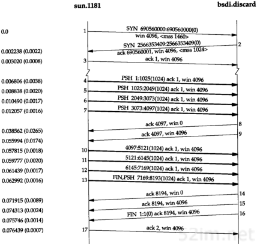
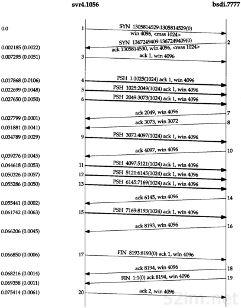
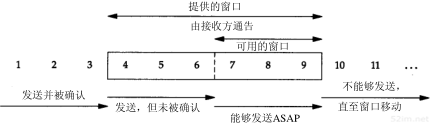
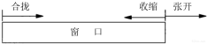
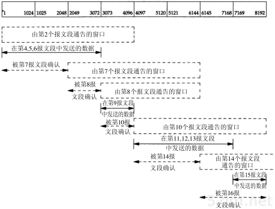
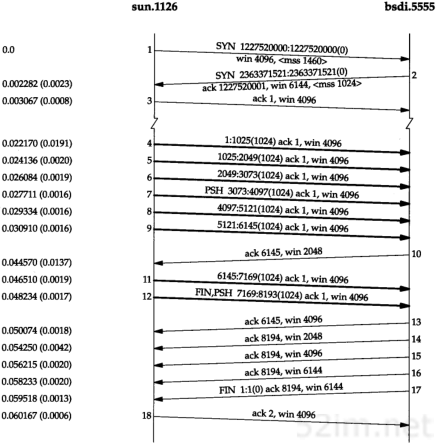
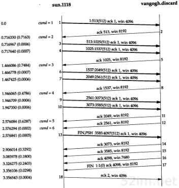
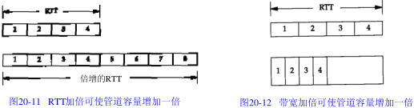

# 第20章TCP的成块数据流

## 1、引言

```
在第15章我们看到TFTP使用了停止等待协议。数据发送方在发送下一个数据块之前需要等待接收对已发送数据的确认。本章我们将介绍TCP所使用的被称为滑动窗口协议的另一种形式的流量控制方法。该协议允许发送方在停止并等待确认前可以连续发送多个分组。由于发送方不必每发一个分组就停下来等待确认，因此该协议可以加速数据的传输。
```

## 2、正常数据流



20-3



20-01

### 1、快的发送方和慢的接收方

```
当接受方的可用窗口为0时候，发送方将会停止发送，直到接收方再发送一个ack来更新win 窗口。这被称为窗口更新。
```

## 3、滑动窗口(通告窗口)



```
在这个图中，我们将字节从1至11进行标号。接收方通告的窗口称为提出的窗口(offered window),它覆盖了从第4字节到第9字节的区域，表明接收方已经确认了包括第3字节在内的数据，且通告窗口大小为6.
```

```
当接收方确认数据后，这个滑动窗口不时地向右移动。窗口两个边沿的相对运动增加或减少了窗口的大小。我们使用三个术语来描述窗口左右边沿的运动:
1、称窗口左边沿向右边靠近为窗口合拢。这种现象发生在另一端的接收进程读取已经被确认时。

2、当窗口右边沿向右移动时将允许发送更多的数据，我们称之为窗口张开。这种现象发生在另一端的接收进程读取已经确认的数据并释放了TCP的接收缓存时。

3、当右边沿向左移动时，我们称之为窗口收缩。Host Requirements RFC强烈建议不要使用这种方式。但TCP必须能够在某一端产生这种情况时进行处理。第22.3节给出了这样的一个例子，一端希望向左移动右边沿来收缩窗口，但没能够这样做。

图20-5表示了这三种情况。因为窗口的左边沿受另一端发送的确认序号的控制，因此不可能向左边移动。如果接收到一个指示窗口左边沿向左移动的ACK，则它认为是一个重复ACK，图20-5窗口边沿的移动并被丢弃。
```



```
如果左边沿到达右边沿，则称其为一个零窗口，此时发送方不能发送任何数据。

合拢：窗口数据被确认时候会合拢
张开：接收方窗口win变大时候会张开
收缩:win突然变小了？然后就收缩了吧
```

### 一个例子



```
以该图为例可以总结如下几点：
1、发送方不必发送一个全窗口大小的数据。
2、来自接受方的一个报文段确认数据并把窗口向右边滑动。这是因为窗口的大小是相对于确认序号的。
3、正如从报文段7到报文段8中变化的那样，窗口的大小可以减小，但是窗口的有边沿却不能够向左移动。
4、接收方在发送一个ACK前不必等待窗口被填满。在前面我们看到许多实现每收到两个报文段就会发送一个ACK。
```

## 4、窗口大小

```的
由接收方提供的窗口的大小通常可以由接收进程控制，这将影响TCP的性能。
显示了在改变发送和接收缓存大小（在单向数据流动的应用中，如文件传输，只需改变发送方的发送缓存和接收方的接收缓存大小）的情况下，位于以太网上的两个工作站之间进行文件传输时的一些结果。它表明对以太网而言，默认的4096字节并不是最理想的大小，将两个缓存增加到16384个字节可以增加约40%左右的吞吐量。
```

## 5、PUSH标志

```
在每一个TCP例子中，我们都看到了PUSH标志，但一直没有介绍它的用途。发送方使用该标志通知接收方将所收到的数据全部提交给接收进程。这里的数据包括与PUSH一起传送的数据以及接收方TCP已经为接收进程收到的其他数据。

在最初的TCP规范中，一般假定编程接口允许发送进程告诉它的TCP何时设置PUSH标志。例如，在一个交互程序中，当客户发送一个命令给服务器时，它设置PUSH标志并停下来等待服务器的响应。通过允许客户应用程序通知其TCP设置PUSH标志，客户进程通知TCP在向服务器发送一个报文段时不用因等待额外数据而使已提交数据在缓存中滞留。类似地，当服务器的TCP接收到一个设置了PUSH标志的报文段时，它需要立即将这些数据递交给服务器进程而不能等待判断是否还会有额外的数据到达。

然而，目前大多数的API没有向应用程序提供通知其TCP设置PUSH标志的方法。的确，许多实现程序认为PUSH标志已经过时，一个好的TCP实现能够自行决定何时设置这个标志。

如果待发送数据将清空发送缓存，则大多数的源于伯克利的实现能够自动设置PUSH标志。这意味着我们能够观察到每个应用程序写的数据均被设置了PUSH标志，因为数据在写的时候就立即被发送。

由于源于伯克利的实现一般从不将接收到的数据推迟交付给应用程序，因此它们忽略所接收的PUSH标志。

如果待发送数据将清空发送缓存，就会标记push。
```


20-3


20-01



20-07

```
在图20-1中我们观察到所有8个数据报文段（4~6、9、11~13和15）的PUSH标志均被置1，这是因为客户进行了8次1024字节数据的写操作，并且每次写操作均清空了发送缓存。

再次观察图20-7，我们预计报文段12中的PUSH标志被置1，因为它是最后一个报文段。为什么发送方知道有更多的数据需要发送还设置报文段7中的PUSH标志呢？这是因为虽然我们指定写的是8192个字节的数据，但发送方的发送缓存却是4096个字节。

作为push标志的另一个例子，再次回到20-3。我们之所以看到前4个报文段(4~7)的标志被设置，是因为它们每一个均使TCP产生了一个报文段并提交给IP层。但是随后，TCP停下来等待一个确认来移动4096字节的窗口。在此期间，TCP又得到了应用程序的最后4096个字节，当窗口张开时(报文段9)，发送方TCP知道它有4个可立即发送的报文段，因此它只设置了最后一个报文段(13)的PUSH标志。
为什么还是分4次发送呢 应该 接收方和发送方的最小的mss为1024;
```

## 6、慢启动

```
迄今为止，在本章所有的例子中，发送方一开始便向网络发送多个报文段，直至达到接收方通告窗口大小为止。当发送方和接收方处于同一个局域网时，这种方式是可以的。但是如果在发送方和接收方之间存在多个路由器和速率较慢的链路时，就有可能出现一些问题。一些中间路由器必须缓存分组，并有可能耗尽存储器的空间。耗尽了后面的数据就会被丢弃。

现在，TCP需要支持一种称为"慢启动(slow start)"的算法。该算法通过观察到新分组进入网络的速率应该与另一端返回确认速度相同而进行工作。
```

```
慢启动为发送方的TCP增加了另一个窗口：拥塞窗口(congestion window)，记为 cwnd。当与另一个网络主机建立TCP连接时，拥塞窗口被初始化为1个报文段(即另一端通告的报文段大小)。每收到一个ACK，拥塞窗口就增加一个报文段(cwnd以字节为单位，但是慢启动以报文段大小为单位进行增加)。发送方取拥塞窗口与通告窗口中的最小值为发送上限。拥塞窗口是发送方使用的流量控制，而通告窗口则是接收方使用的流量控制。

拥塞窗口是发送方使用的流量控制
通告窗口(滑动窗口)是接收方的流量控制。
```

```
发送方开始时发送一个报文段，然后等待ACK。当收到该ACK时，拥塞窗口从1增加到2，即可以发送两个报文段。当收到这两个报文段的ACK时，拥塞窗口就增加为4.这是一种指数增加的关系。

在某些点上可能达到了互联网的容量，于是中间路由器开始丢弃分组。这就通知发送它的拥塞窗口开的过大。当我们在下一章讨论TCP的超时和重传机制时，将会看到它们是怎样对拥塞窗口起作用的。现在，我们来观察一个实际中的慢启动。
```

### 一个例子



```
上图表示的是将从主机sun送到主机vangogh.cs.berkeley.edu的数据。这些数据将通过一个慢的SLIP链路，该链路是TCP连接上的瓶颈（我们已经在时间系列上去掉了连接建立的过程）。

我们观察到发送方发送一个长度为512字节的报文段，然后等待ACK。该ACK在716ms后收到。这个时间是一个往返时间的指示。于是拥塞窗口增加了2个报文段，且又发送了两个报文段。当收到报文段5的ACK后，拥塞窗口增加为3。此时尽管可发送多达3个报文段，可是在下一个ACK收到之前，只发送了2个报文段。
“拥塞避免”的技术来作为通常的实现。
在21.6节中我们将再次讨论慢启动，并介绍怎样采用另一种称为“拥塞避免”的技术来作为通常的实现。
```

## 7、成块数据的吞吐量

```
MSL: Maximum Segment Lifetime 的英文缩写，报文最大生存时间
	他是任何报文在网络上存在的最长时间，超过这个时间报文将被丢弃。

2MSL: 即两倍的MSL，TCP的TIME_WAIT状态也成为2MSL等待状态，当TCP的一端发起主动关闭，在发出最后一个ACK包后，即第3次握手完成后发送了第4次握手的ACK包后就进入了TIME_WAIT状态，必须在此状态上停留两倍的MSL时间，等待2MSL时间主要目的是怕最后一个ACK包对方没收到，那么对方在超时后将重发第三次握手的FIN包，主动关闭端接到重发的FIN包后可以再发一个ACK应答包。在TIME_WAIT状态时两端的端口不能使用，要等到2MSL时间结束才可继续使用。当连接处于2MSL等待阶段时任何迟到的报文段都将被丢弃。不过在实际应用中可以通过设置SO_REUSEADDR选项达到不必等待2MSL时间结束再使用此端口。

TTL: Time to live 的缩写，中文可以译为"生存时间"，这个生存时间是由源主机设置初始值但不是存的具体时间，而是存储了一个ip数据报可以经过的最大路由数，每经过一个处理他的路由器此值就减1，当此值为0则数据报将被丢弃，同时发送ICMP报文通知源主机。

RFC 793中规定MSL为2分钟，实际应用中常用的是30秒，1分钟和2分钟等。

RTT： 是客户到服务器往返所花时间(round-trip time，简称RTT).TCP含有动态估算RTT算法。TCP还持续估算一个给定连接的RTT，这是因为RTT受网络传输拥塞程序的变化而变化
```


### 1、带宽时延乘积

```
现在来回答窗口应该设置为多大的问题。在我们的例子中，作为最大的吞吐量，发送方在任何时候有8个已发送的报文段未被确认。接收方的通告窗口必须不小于这个数目，因为通告窗口限制了发送方能够发送的段的数目；

可以计算通道的容量为：
	capacity(bit) = bandwidth(b/s)   *   round-trip time(s)
	
一般称之为带宽时延乘积。这个值依赖于网络速度和两端的RTT，可以有很大的变动。例如，一条穿越美国(RTT约为60ms)的T1的电话线路(1544 000b/s)的带宽时延乘积为11580字节。但是一条穿越美国的T3电话线路（45 000 000 b/s）的带宽时延乘积则为337 500字节，这个数值超过了最大所允许的TCP通告窗口的大小（65535字节）。在24.4节我们将讨论能够避免当前TCP限制的新的TCP窗口大小选项。
```

```
不管是带宽还是时延均会影响发送方和接收方之间通路的容量。在图20-11中我们显示了一个增加了一倍的RT T会使通路容量也增加一倍。

在图20-11底下的说明部分，通过使用一个较长的RT T，这个管道能够容纳8个报文段而不是4个。

类似地，图20-12表示了增加一倍的带宽也可使该管道的容量增加一倍。
```



```
在图20-12的下部，假定网络速率已经加倍，使得我们能够只使用上面一半的时间来发送4个报文段。这样，该管道的容量再次加倍(假定该图的上半部分与下半部分中的报文段具有同样大小，即具有相同的比特数)。
```

### 2、拥塞

```
当数据到达一个大的管道(如一个快速局域网)并向一个较小的管道(如一个较慢的广域网)发送时便会发生拥塞。当多个输入流到达一个路由器，而路由器的输出流小于这些输入流的总和时也会发生拥塞。
```

## 8、紧急方式

```
TCP提供了"紧急方式(urgent mode)", 它使一端可以告诉另一端有些具有某种方式的"紧急数据"已经放置在普通的数据流中。另一端被通知这个紧急数据已被放置在普通数据流中，由接收方决定如何处理.

可以通过设置TCP首部中的两个字段来发出这种从一端到另一端的紧急数据已经被放置在数据流中的通知.URG比特被置为1.并且一个16bit的紧急指针被置为一个正的偏移量，该偏移量必须与TCP首部中的序号字段相加，以便得出紧急数据的最后一个字节的序号。
```

```
仍有许多关于紧急指针是指向紧急数据的最后一个字节还是指向紧急数据最后一个字节的下一个字节的争论。最初的TCP规范给出了两种解释，但Host RequirementsRFC确定指向最后一个字节是正确的。

然而，问题在于大多数的实现（包括源自伯克利的实现）继续使用错误的解释。所有符合Host Requirements RFC的实现都是可兼容的，但很有可能无法与其他大多数主机正确通信。
```

```
TCP必须通知接收进程，何时已接收到一个紧急数据指针以及何时某个紧急数据指针还不在此链接上，或者紧急指针是否在数据流中向前移动。接着接收进程可以读取数据流，并必须能够被告知何时碰到了紧急数据指针。只要从接收方当前读取位置到紧急数据指针之间有数据存在，就认为应用程序处于“紧急方式”。在紧急指针通过之后，应用程序便转回到正常方式。

TCP本身对紧急数据知之甚少。没有办法指明紧急数据从数据流的何处开始。TCP通过链接传送的唯一信息就是紧急方式已经开始(TCP首部中的URG比特)和指向紧急数据最后一个字节的指针。其他的事情留给应用程序去处理。

不幸的是，许多实现不正确的称TCP的紧急方式为带外数据(out-of-band data).如果一个应用程序确实需要一个独立的带外信道，第二个TCP连接是达到这个目的的最简单的方法(许多运输层确实提供许多人认为的那种真正的带外数据：使用同一个连接的独立的逻辑数据通道作为正常的数据通道。这是TCP所没有提供的）。)
```

```
紧急方式有什么作用呢？两个最常见的例子是Telnet和Rlogin。当交互用户键入中断键时，我们在第26章将看到使用紧急方式来完成这个功能的例子。另一个例子是FTP，当交互用户放弃一个文件的传输时，我们将在第27章看到这样的一个例子。
```

```
如果在接收方处理第一个紧急指针之前，发送方
```


