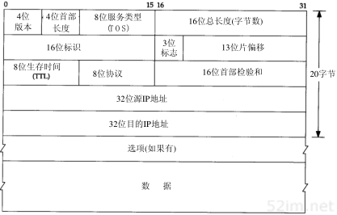

# 1、概述

## 1、引言

```
很多不同的厂家生产各种型号的计算机，它们运行完全不同的操作系统，但TCP/IP协议族允许它们互相进行通信。这一点很让人感到吃惊，因为它的作用已远远超出了起初的设想。TCP/IP起源于60年代末美国政府资助的一个分组交换网络研究项目，到90年代已发展成为计算机之间最常应用的组网形式。
```

## 2、分层


```
每一层负责不同的功能
1、链路层，有时也称作数据链路层或网络接口层，通常包括操作系统中的设备驱动程序和计算机中对应的网络接口卡。它们一起处理与电缆(或其他任何传输媒介)的物理接口细节。

2、网络层，有时也称作互联网层，处理分组在网络中的活动，例如分组的选路。在TCP/IP协议族中，网络层协议包括IP协议(网际协议)、ICMP协议(internet互联网控制报文协议)，以及IGMP协议(internet组管理协议)。

3、运输层主要为两台主机上的应用程序提供端到端的通信。在TCP/IP协议族中，有两个互不相同的传输协议:TCP(传输控制协议)和UDP(用户数据协议)。

TCP为两台主机提供高可靠性的数据通信。它所做的工作包括把应用程序交给它的数据分成合适的小块交给下面的网络层，确认接收到的分组，设置发送最后确认分组的超时时钟等。由于运输层提供了高可靠性的端到端的通信，因此应用层可以忽略所有这些细节。

而另一方面，UDP则为应用层提供一种非常简单的服务。它只是把称作数据报的分组从一台主机发送到另一台主机，但并不保证该数据报能到达另一端。任何必须的可靠性必须由应用层来提供。
这两种运输层协议分别在不同的应用程序中有不同的用途，这一点将在后面看到。

4、应用层负责处理特定的应用程序细节。几乎各种不同的 TCP/IP 实现都会提供下面这些通用的应用程序：
	TeInet 远程登录
    FTP 文件传输协议
    SMTP 简单邮件传送协议
    SNMP 简单网络管理协议
```

## 1、为什么要有网络协议呢

```
在 80 年代，网络不断增长的原因之一是大家都意识到只有一台孤立的计算机构成的"孤岛"没有太大意义，于是就把这些孤立的系统组在一起形成网络。随着这样的发展，到了90年代，我们又逐渐认识到这种由单个网络构成的新的更大的"岛屿"同样没有太大的意义。于是，人们又把多个网络连在一起形成一个网络的网络，或称作互联网(internet).一个互联网就是一组通过相同协议族互连在一起的网路。
```

```
网络层：
ip协议 网络层 网际协议
ICMP协议(internet 互联网控制报文协议)
IGMP协议(internet 组管理协议)


传输层：
tcp 传输层 传输控制协议
UDP 传输层 用户数据报协议
```


# 2、链路层

## 1、引言

```
链路层主要有三个目的：
1、为IP模块发送和接收IP数据报；
2、为ARP模块发送ARP请求和接收ARP应答。
3、为RARP发送RARP请求和接收RARP应答。
TCP/IP支持多种不同的链路层协议，这取决于网络所使用的硬件，如以太网、令牌环网、FDDI(光纤分布式数据接口)及RS-232串行线路等。
```

```
在本章中，我们将详细讨论以太网链路层协议，两个串行接口链路层协议(SLIP和PPP)，以及大多数实现都包含的环回(loopback)驱动程序。以太网和SLIP是本书中大多数例子使用的链路层。对MTU(最大传输单元)进行了介绍，这个概念在本书的后面章节中将多次遇到。我们还讨论了如何为串行线路选择MTU;
```

## 2、以太网和IEEE802封装

```
以太网这个术语一般是指数字设备公司、英特尔公司和Xerox公司在1982年联合公布的一个标准。它是当今TCP/IP采用的主要的局域网技术。它采用一种称作CSMA/CD的媒体接入放法， 其意思是带冲突检测的载波监听多路接入。它的速率为10Mb/s 地址为 48bit
```

```
几年后，IEEE(电子电气工程师协会)802委员会公布了一个稍有不同的标准集，其中802.3针对整个CSMA/CD网络，802.4针对令牌总线网络，802.5针对令牌环网络。这三者的共同特性由802.2标准来定义，那就是802网络共有的逻辑链路控制（LLC）。不幸的是，802.2和802.3定义了一个与以太网不同的帧格式。
```

```
在TCP/IP世界中，以太网IP数据报的封装是在RFC 894[Hornig 1984]中定义的，IEEE 802网络的IP数据报封装是在RFC 1042[Postel and Reynolds 1988]中定义的。主机需求RFC要求每台Internet主机都与一个10 Mb/s的以太网电缆相连接：

1、必须能发送和接收采用RFC 894（以太网）封装格式的分组。
2、应该能接收与RFC 894混合的RFC 1042（IEEE 802）封装格式的分组。
3、也许能够发送采用RFC 1042格式封装的分组。如果主机能同时发送两种类型的分组数据，那么发送的分组必须是可以设置的，而且默认条件下必须是RFC 894分组。
```


```
两种帧格式都采用48 bit（6字节）的目的地址和源地址（802.3允许使用16 bit的地址，但一般是48 bit地址）。这就是我们在本书中所称的硬件地址。ARP和RARP协议（第4章和第5章）对32 bit的IP地址和48 bit的硬件地址进行映射。
```

```
接下来的2个字节在两种帧格式中互不相同。在802标准定义的帧格式中，长度字段是指它后续数据的字节长度，但不包括CRC检验码。以太网的类型字段定义了后续数据的类型。在802标准定义的帧格式中，类型字段则由后续的子网接入协议(Sub-network Access Protocol, SNAP)的首部给出。幸运的是，802定义的有效长度值与以太网的有效类型值无一相同，这样，就可以对两种帧格式进行区分。
```

```
在以太网帧格式中，类型字段之后就是数据;而在802帧格式中，跟随在后面的是3字节的802.2LLC 和 5字节的802.2SNAP。目的服务访问点(Destination Service Access Point, DSAP)和源服务访问点(Source Service Access Point, SSAP)的值都设为0xaa. ctrl 字段的值设为3.随后的3个字节 org code 都置为 0. 再接下来的2个字节类型字段和以太网帧格式一样
```

```
CRC 字段用与帧内后续字节差错的循环冗余码检验(检验和)。(它也被称为FCS或帧检验序列)。
```

```
802.3标准定义的帧和以太网的帧都有最小长度要求。802.3规定数据部分必须至少为38字节，而对于以太网，则要求最少要有46字节。为了保证这一点，必须在不足的空间插入填充（pad）字节。在开始观察线路上的分组时将遇到这种最小长度的情况。

在本书中，我们在需要的时候将给出以太网的封装格式，因为这是最为常见的封装格式。
```

在本书中，我们在需要的时候将给出以太网的封装格式，因为这是最为常见的封装格式。 

### 3、尾部封装

```
RFC 893[Leffler and Karels 1984]描述了另一种用于以太网的封装格式，称作尾部封装（trailer encapsulation）。这是一个早期BSD系统在DEC VA X机上运行时的试验格式，它通过调整IP数据报中字段的次序来提高性能。在以太网数据帧中，开始的那部分是变长的字段（IP首部和TCP首部）。把它们移到尾部（在CRC之前），这样当把数据复制到内核时，就可以把数据帧中的数据部分映射到一个硬件页面，节省内存到内存的复制过程。TCP数据报的长度是512字节的整数倍，正好可以用内核中的页表来处理。两台主机通过协商使用ARP扩展协议对数据帧进行尾部封装。这些数据帧需定义不同的以太网帧类型值。

现在，尾部封装已遭到反对，因此我们不对它举任何例子。有兴趣的读者请参阅RFC 893以及文献[Leffler et al.1989]的11.8节。
```

### 4、SLIP：串行线路IP

```
SLIP的全称是Serial Line IP。它是一种在串行线路上对IP数据报进行封装的简单形式，在RFC 1055[Romkey 1988]中有详细描述。SLIP适用于家庭中每台计算机几乎都有的RS-232串行端口和高速调制解调器接入Internet。

下面的规则描述了SLIP协议定义的帧格式：

1、IP数据报以一个称作END（0xc0）的特殊字符结束。同时，为了防止数据报到来之前的线路噪声被当成数据报内容，大多数实现在数据报的开始处也传一个END字符（如果有线路噪声，那么END字符将结束这份错误的报文。这样当前的报文得以正确地传输，而前一个错误报文交给上层后，会发现其内容毫无意义而被丢弃）。
2、如果IP报文中某个字符为END，那么就要连续传输两个字节0xdb和0xdc来取代它。0xdb这个特殊字符被称作SLIP的ESC字符，但是它的值与ASCII码的ESC字符（0x1b）不同。
3、如果IP报文中某个字符为SLIP的ESC字符，那么就要连续传输两个字节0xdb和0xdd来取代它。

图2-2中的例子就是含有一个END字符和一个ESC字符的IP报文。在这个例子中，在串行线路上传输的总字节数是原IP报文长度再加4个字节。
```


```
SLIP是一种简单的帧封装方法，还有一些值得一提的缺陷：

1、每一端必须知道对方的IP地址。没有办法把本端的IP地址通知给另一端。
2、数据帧中没有类型字段（类似于以太网中的类型字段）。如果一条串行线路用于SLIP，那么它不能同时使用其他协议。
3、SLIP没有在数据帧中加上检验和（类似于以太网中的CRC字段）。如果SLIP传输的报文被线路噪声影响而发生错误，只能通过上层协议来发现（另一种方法是，新型的调制解调器可以检测并纠正错误报文）。这样，上层协议提供某种形式的CRC就显得很重要。在第3章和第17章中，我们将看到IP首部和TCP首部及其数据始终都有检验和。在第11章中，将看到UDP首部及其数据的检验和却是可选的。
```

### 5、 压缩的SLIP

```
由于串行线路的速率通常较低（19200 b/s或更低），而且通信经常是交互式的（如Telnet和Rlogin，二者都使用TCP），因此在SLIP线路上有许多小的TCP分组进行交换。为了传送1个字节的数据需要20个字节的IP首部和20个字节的TCP首部，总数超过40个字节（19.2节描述了Rlogin会话过程中，当敲入一个简单命令时这些小报文传输的详细情况）。

既然承认这些性能上的缺陷，于是人们提出一个被称作CSLIP（即压缩SLIP）的新协议，它在RFC 1144[Jacobson 1990a]中被详细描述。CSLIP一般能把上面的40个字节压缩到3或5个字节。它能在CSLIP的每一端维持多达16个TCP连接，并且知道其中每个连接的首部中的某些字段一般不会发生变化。对于那些发生变化的字段，大多数只是一些小的数字和的改变。这些被压缩的首部大大地缩短了交互响应时间。
```

### 6、点对点协议PPP

```
PPP,点对点协议修改了SLIP协议中的所有缺陷。PPP包括以下三个部分：
1、在串行链路上封装IP数据报的方法。PPP既支持数据为8位和无奇偶验证的异步模式，还支持面向比特的同步链接。

2、建立、配置及测试数据链路的链路控制协议(LCP:Link Control Protocol).它允许通信双方进行协商，以确定不同的选项。

3、针对不同网络层协议的网络控制协议（NCP：Network Control Protocol）体系。当前RFC定义的网络层有IP、OSI网络层、DECnet以及AppleTalk。例如，IP NCP允许双方商定是否对报文首部进行压缩，类似于CSLIP（缩写词NCP也可用在TCP的前面）。

每一帧都以标志字符0x7e开始和结束。紧接着是一个地址字节，值始终是0xff，然后是一个值为0x03的控制字节。
```


```
接下来是协议字段，类似于以太网中类型字段的功能。当它的值为 0x0021 时，表示信息字段是一个 IP 数据报;值为 0xc021 时,表示信息字段是链路控制数据;值为0x8021 时,表示信息字段是网络控制数据。

CRC 字段(或FCS，帧检验序列)是一个循环冗余验证码，已检测数据帧中的错误.


```

```
链路层简单了讲了下 slip ppp 以太网 ieee802 封装ip协议
```


# 3、Ip：网际协议

## 1、引言

```
IP是TCP/IP协议族中最为核心的协议。所有的TCP、UDP、ICMP及IGMP 数据都以IP数据报格式传输。许多刚开始接触TCP/IP的人对IP提供不可靠、无连接的数据报传输服务感到很奇怪。
```

```
不可靠（unreliable）的意思是它不能保证IP数据报能成功地到达目的地。IP仅提供最好的传输服务。如果发生某种错误时，如某个路由器暂时用完了缓冲区，IP有一个简单的错误处理算法：丢弃该数据报，然后发送ICMP消息报给信源端。任何要求的可靠性必须由上层来提供（如TCP）。
```

```
无连接（connectionless）这个术语的意思是IP并不维护任何关于后续数据报的状态信息。每个数据报的处理是相互独立的。这也说明，IP数据报可以不按发送顺序接收。如果一信源向相同的信宿发送两个连续的数据报（先是A，然后是B），每个数据报都是独立地进行路由选择，可能选择不同的路线，因此B可能在A到达之前先到达。
```

## 2、协议简介

IP数据报的格式如图3-1所示。普通的IP首部长为20个字节，除非含有选项字段。 




```
分析图的首部。最高位在左边，记为0bit; 最低位在右边，记为 31 bit。
```

```
4个字节的 32 bit 值以下面的次序传输：首先是 0~7bit, 其次8~15bit, 然后16~23bit，最后是24~31bit. 这种传输次序称作 big endian 字节序。由于 TCP/IP 首部中所有的二进制整数在网络中传输时都要求以这种次序，因此它又称作网络字节序。以其他形式存储二进制整数的机器，如 little endian 格式，则必须在传输数据之前把首部转换成网络字节序。
也就是说网络传输是 big endian 传输的 (大头传输) 符合人类阅读顺序。
```

```
首部长度指的是首部占32bit字的数目，包括任何选项.由于它是一个4比特字段，因此首部最长为60个字节。在第8章中，我们将看到这种限制使某些选项如路由记录选项在当今已没有什么用处。普通IP数据报（没有任何选择项）字段的值是5。
```

```
服务类型（TOS）字段包括一个3bit的优先权子字段（现在已被忽略），4bit的TOS子字段和1bit未用位但必须置0。4bit的TO S分别代表：最小时延、最大吞吐量、最高可靠性和最小费用。4bit中只能置其中1bit。如果所有4bit均为0，那么就意味着是一般服务。RFC 1340[Reynolds and Postel 1992]描述了所有的标准应用如何设置这些服务类型。RFC 1349[Almquist 1992]对该RFC进行了修正，更为详细地描述了TOS的特性。

现在大多数的TCP/IP实现都不支持TO S特性，但是自4.3BSD Reno以后的新版系统都对它进行了设置。另外，新的路由协议如OSPF和IS-IS都能根据这些字段的值进行路由决策。
就是没什么用。
```

```
总长度字段是指整个IP数据报的长度，以字节为单位。利用首部长度字段和总长度字段，就可以知道IP数据包中数据内容的起始位置和长度。由于该字段长16比特，所以ip数据报最长可达65535字节。当数据报被分片时，该字段的值也随着变化，这一点将在11.5节中进一步描述。
```

```
标识字段唯一地标识主机发送的每一份数据报。通常每发送一份报文它的值就会加1。在11.5节介绍分片和重组时再详细讨论它。同样，在讨论分片时再来分析标志字段和片偏移字段。
```

```
TTL（time-to-live）生存时间字段设置了数据报可以经过的最多路由器数。它指定了数据报的生存时间。TTL的初始值由源主机设置（通常为32或64），一旦经过一个处理它的路由器，它的值就减去1。当该字段的值为0时，数据报就被丢弃，并发送ICMP报文通知源主机。第8章我们讨论Tr aceroute程序时将再回来讨论该字段。
```


## 3、IP路由选择

# 4、ARP地址解析协议

## 1、ARP代理

```
如果arp 请求是从一个网络的主机发往另一个网络上的主机，那么链接这两个网路的路由器就可以
```


# 14、DNS：域名系统


这个报文由12字节长的首部和4个长度可变的字段组成。

```
标识：
标识字段由客户程序设置并由服务器返回结果。客户程序通过它来确定响应与查询是否匹配。
```


```
标志：
16bit的标识字段被划分为若干个子字段。
QR 是1bit字段： 0表示查询报文，1表示响应报文。

opcode 是一个4bit字段：通常值为 0(标准查询),值为1(反向查询)和2(服务器状态请求)

AA是1bit标志，1表示"授权回答(authoritative answer)". 该名字服务器是授权于该域的

TC是1bit字段,表示"可截断的(truncated)".使用UDP时,它表示当应答的总长度超过512字节时，只返回前512个字节。

RD是1bit字段表示"期望递归(recursion desired)".该比特能在一个查询中设置，并在响应中返回。这个标志告诉名字服务器必须处理这个查询，也称为一个递归查询。如果该位为0，且被请求的名字服务器没有一个授权回答，它就返回一个能解答该查询的其他名字服务器列表，这称为迭代查询。在后面的例子中，我们将看到这两种类型查询的例子。

RA是1bit字段，表示"可用递归"。如果名字服务器支持递归查询，则在响应中将该比特设置为1.在后面的例子中可看到大多数名字服务器都提供递归查询，除了某些根服务器。

随后的3bit字段必须为0

rcode是一个4bit的返回码字段。通常的值为0(没有差错)和3(名字差错)。名字差错只有从一个授权名字服务器上返回，它表示在查询中制定的域名不存在。
```

```
随后的4个16 bit字段说明最后4个变长字段中包含的条目数。对于查询报文，问题(question)数通常是1，而其他3项则均为0。类似地，对于应答报文，回答数至少是1，剩下的两项可以是0或非0。
```

## 1、DNS查询报文中的问题部分

问题部分中每个问题的格式如图所示，通常只有一个问题


```
查询名是要查找的名字，它是一个或多个标识符的序列。每个标识符以首字节的计数值来说明随后标识符的字节长度，每个名字以最后字节为0结束，长度为0的标识符是根标识符。计数字节的值必须是0~63的数，因为标识符的最大长度仅为63（在本节的后面我们将看到计数字节的最高两比特为1，即值192~255，将用于压缩格式）。不像我们已经看到的许多其他报文格式，该字段无需以整32 bit边界结束，即无需填充字节。
```

```
图14-6显示了如何存储域名gemini.tuc.noao.edu。
```


```
每个问题有一个查询类型，而每个响应(也称一个资源记录，我们下面将谈到)也有一个类型。大约有20个不同的类型值，其中的一些目前已经过时。查询类型是类型的一个超集(superset)；图中显示的类型值中只有两个能用于查询类型。
```


```
最常用的查询类型是A类型,表示期望获得查询名的ip地址。一个PTR查询则请求获得一个IP地址对应的域名。这是一个指针查询。
查询类通常是1,指互联网地址(某些站点也支持其他非IP地址)
```

## 2、DNS响应报文中的资源记录部分

```
DNS报文中最后的三个字段，回答字段、授权字段和附加信息字段，均采用一种资源记录RR(Resource Record)的相同格式。下图显示了资源记录的格式。
```


```
域名是记录中资源数据对应的名字。它的格式和前面介绍的查询名字段格式相同。
类型说明RR的类型码。它的值和前面介绍的查询类型值是一样的。类通常为1，指Internet数据。
生存时间字段是客户程序保留该资源记录的秒数。资源记录通常的生存时间值为2天。
资源数据长度说明资源数据的数量。该数据的格式依赖于类型字段的值。对于类型1(A记录)资源数据是4字节的Ip地址。
```

DNS报文被封装在UDP数据报中


