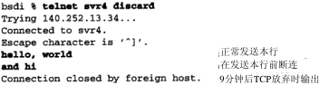
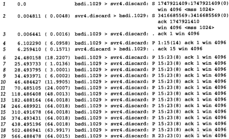
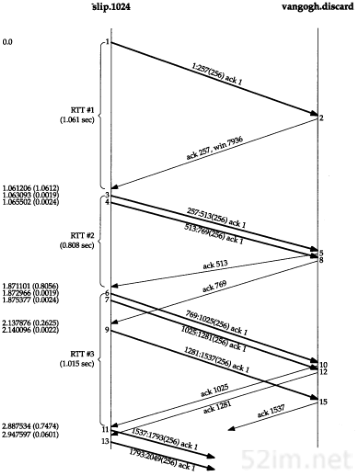
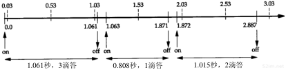
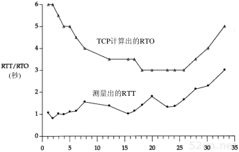
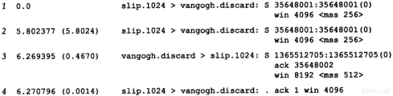
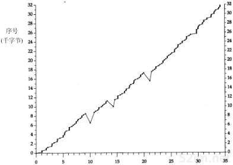
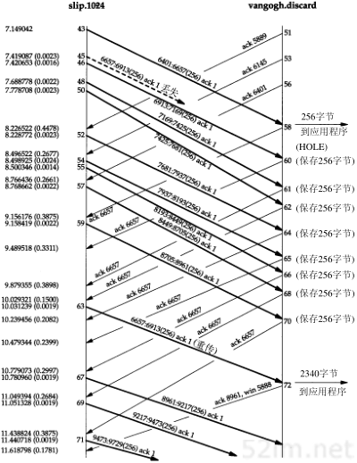

# 21 TCP的超时与重传

## 1、tcp协议中的RTO的计算

```
TCP超时与重传中一个最重要的部分是对一个给定连接的往返时间(RTT)的测量。由于网络流量的变化，这个时间会相应的发生变化，TCP需要跟踪这些变化并动态调整超时时间RTO。

RTT(Round Trip Time)由三部分组成：链路的传播时间(propagation delay),末端系统的处理时间，路由器缓存中的排队和处理时间(queuing delay).

链路的传播时间
末端系统的处理时间
路由器缓存中的排队和处理时间

其中，前两个部分的值对于一个TCP连接相对固定，路由器缓存中的排队和处理时间会随着整个网络拥塞程度的变化而变化。所以RTT的变化在一定程序上反应了网络的拥塞程度。
```


```
TCP协议中经常会发生超时重传的情况，我们知道超时重传中的"时"是即RTO. RTO是Retransmission Timeout 的缩写，该时间决定了发送方在发送数据后，在多长时间内如果没有收到ACK，就重置重传计时器，并重传上次发送失败的报文。那么RTO是如何计算的呢？

RTO说白了就是根据RTT(往返时延)而确定的。但是我们知道，RTT是一个不确定的数值，因为TCP以下的网络层相当负责，每个报文发送出去的RTT不一定相同。这样就使得RTO的计算也比较难。为了给出一个比较合理的RTO。我们需要采用统计学里面的一些方法。首先我们介绍几个RTT变量，分别是 RTTm(测量RTT)，RTTs(平滑RTT)，RTTD(偏差RTT).

RTTm：m可以看成 measure(测量)的缩写，他是本次时间测量的RTT值，当然本次测量不能代表着一个绝对正确的值。
 注意： 关于测量RTTm(measure)的获取，我们可以有不同的方法。我们可以在发送端设置计时器，也可以在发送的TCP报文选项中添加时间戳选项，用于记录发送时间，接收方接到该报文后，把该发送时间从报文中复制到ACK报文发回给发送端。所有，RTTm(measure)的计算方法并不唯一。
 
RTTs : s 是 Smoothed(平滑)的缩写，我们可以把RTTs(smoothed)看成一个平均的RTT，相当于一个累积的RTT的期望值，它不仅考虑本次测量的RTT值，还会吸取历史经验，考虑以前的RTT的值，且之前的RTT的值占的比重远高于本次测量的RTT(即RTTm(measure)).所以，RTTm(measure) 本次测到的RTT只是整体RTTs(smoothed)的一个样本。
注意：我们可以将RTTs看成RTT的一个平均值(或期望值)

RTTD: D是 Deviation(偏差)的缩写，偏差说白了就是误差值，它也是一个经验累加值。跟RTTm(measure)一样，它会将之前采用的 RTTD作为一个参考，同时加上当前的偏差
注意：偏差我们可以看做是测量值与平均值(或期望值)之差的绝对值。所以本次RTTD=|RTTm-RTTs|   deviation measure smoothed
```


```
RTP:RTO主要考虑RTT的期望值和偏差
综上的理解，我们就可以很快理解并记住一下公式。
第一次测量时候，RTTm是我们测量的结果，RTTs=RTTm,RTTD=RTTm/2

以后每次测量采用以下公式
	RTTs=(1-a)*RTTs+a*RTTm, a通常为1/8,即0.125 ...... 公式1
	RTTD=(1-b)*RTTD+b*|RTTm-RTTs|, b通常为1/4,即0.25 ...... 公式2
	RTO = RTTs+4RTTD ...... 公式3
	
	说明：公式3不管是第一次计算还是最后一次，都是采用该公式。
--------------------------------------------	
	也可以这样 两个公式之间可一互相转换
	RTTs=(1-a)*RTTs+a*RTTm
	= RTTs - a*RTTS + a*RTTm
	= RTTs + (a*RTTm - a*RTTs);
	= RTTs + a*(RTTm - RTTs);
	
	RTTD=(1-b)*RTTD+b*|RTTm-RTTs|
	= RTTD-b*RTTD + b*|RTTm-RTTs|
	= RTTD+(b*|RTTm-RTTs|- b*RTTD)
	= RTTD + b*(|RTTm-RTTs|-RTTD);
	
	RTTs + a*(RTTm - RTTs);
	RTTD + b*(|RTTm-RTTs|-RTTD);
	可以变为
	-------------------------------------
	最终：
	Err = RTTm-Rtts;
	RTTs = RTTs + a* Err;
	RttD = b*(|Err| - RTTD);
	RTO = RTTs + 4*RTTD;
	
	
	s = smoothed(平滑的)
	m = measure(测量)
	D = diviation(偏差)
```

```
FAQ(常见问题解答)：假设发送端发送一个报文后，在RTO内没有收到ACK，发送端重传该报文，并重置计时器。后来发送端收到了ACK，但是发送端比较困惑的是该报文的ACK是之前发送的报文段对应的ACK(可能在网络中呆了很长时间)还是本次发送的报文对应的ACK，由于这个事实不能确定，所以本次获得的RTTm是不准确的，那如何更新RTO呢？

方法一：放弃考虑本次获得的RTTm, 因为我们无法测得一个准确的信息(即该ACK到底对应哪个报文)，该处理方法称之为 Karn 算法。很明显，该算法的缺点是没有考虑本次测量值，例如，为什么会要求重传？如果不是网络不拥挤会要求重传吗？这些问题都被简单的抛弃了。


方法二：考虑到方法一的缺点和优点，通常采取的做法是：不考虑获取的RTTm,因为不确定是否正确(这是利用Karn算法的优点)，同时每发生一次重传，RTO就加倍，即RTO=2*RTO(弥补了Karn算法的不足)，该方法称为 指数退避。‘

这里的指针退避只加倍了 RTO 所以一旦正常，又会根据 RTTs,RTTd,RTTm 重新计算RTO。
```


## 1、引言

```
TCP提供可靠的运输层。它使用的方法之一就是确认从另一端收到的数据。但数据和确认都有可能会丢失。TCP通过在发送时设置一个定时器来解决这种问题。如果当定时器溢出时还没有收到确认，它就重传该数据。对任何实现而言，关键之处就在于超时和重传的策略，即怎样确定超时间隔和如何确定重传的频率
```

```
对于每个连接，TCP管理4个不同的定时器。
1、重传定时器使用于当希望收到另一端的确认。发送数据到收到ack的时间定时器
2、坚持(persist)定时器使窗口大小信息保持不断流动，即使另一端关闭了其接收窗口。
3、保活(keepalive)定时器可检测到一个空闲连接的另一端何时崩溃或重启。
4、2MSL定时器测量一个连接处于TIME_WAIT状态的时间。

本章以一个简单的TCP超时和重传的例子开始，然后转向一个更复杂的例子。该例子可以使我们观察到TCP时钟管理的所有细节。可以看到TCP的典型实现是怎样测量TCP报文段的往返时间以及TCP如何使用这些测量结果来为下一个将要传输的报文段建立重传超时时间。
接着我们将研究TCP的拥塞避免 -- 当分组丢失时TCP所采取的动作 -- 并提供一个分组丢失的实际例子，
我们还将介绍较新的快速重传和快速恢复算法，并介绍该算法如何使TCP检测分组丢失比等待时钟超时更快。
```


## 2、超时与重传的简单例子

```
首先观察TCP所使用的重传机制，我们将建立一个链接，发送一些分组来证明一切正常，然后拔掉电缆，发送更多的数据，再观察TCP行为。
```




下图表示的是tcpdump的输出结果（已经去掉了bsdi设置的服务类型信息）。 



```
第1、2和3行表示正常的TCP连接建立的过程，第4行是“hello,world”（12个字符加上回车和换行）的传输过程，第5行是其确认。接着我们从svr4拔掉了以太网电缆，第6行表示“and hi”将被发送。第7~18行是这个报文段的12次重传过程，而第19行则是发送方的TCP最终放弃并发送一个复位信号的过程.
```

```
现在检查连续重传之间不同的时间差，它们取整后分别为 1、3、6、12、24、48和多个64.在本章的后面，我们将看到当第一次发送后所设置的超时时间实际上为1.5秒(它在首次发送后的1.0136秒而不是精确的1.5秒后，因为定时器的第一个会在0-500ms时间同步至内核的时间，和内核的溢出时间一致，如果为230，溢出为300,那就再过70ms就相当于第一个300，以后就根据内核的300溢出就可以确定定时器的溢出)。此后该时间在每次重传时增加1倍并直至64秒。

这个倍乘关系被称为"指数退避(exponential backoff)"。

首次分组传输(第6行，24.480秒)与复位信号传输（第19行，566.488秒）之间的时间差约为9分钟，该时间在目前的TCP实现中是不可变的。

对于大多数实现而言，这个总时间是不可调整的。Solaris 2.2允许管理者改变这个时间（E.4节中的tcp_ip_abort_interval变量），且其默认值为2分钟，而不是最常用的9分钟。
```

## 3、往返时间测量

```
TCP超时与重传中最重要的部分就是对一个给定连接的往返时间(RTT)的测量。由于路由器和网络流量均会变化，因此我们认为这个时间可能经常会发生变化，TCP应该跟踪这些变化并相应的改变其超时时间。

首先TCP必须测量在发送一个带有特别序号的字节和接收到包含该字节的确认之间的RTT。在上一章中，我们曾提到在数据报文段和ACK之前通常并没有一一对应的关系。在图20.1中，这意味着发送方可以测量到的一个RT T，是在发送报文段4（第1~1024字节）和接收报文段7（对1~1024字节的ACK）之间的时间，用RTTM(measure)表示所测量到的RTT。
```

```
算法在xx.md的开头

RTTm(measure)
RTTs(smoothed)
RTTD(diviation)

RTTs =(1-a)RTTs + a*RTTm
RTTD = (1-b)RTTD + b*|RTTm - RTTs|
RTO = RTTs + 4RTTD;

偏差我们可以看做是测量值与平均值(或期望值)之差的绝对值。所以本次RTTD=|RTTm-RTTs|  
偏差是测量值和平均值之差的绝对值

第一次 RTTs = RTTm
RTTD = RTTm/2
RTO = RTTs + 4RTTD
```

### karn算法

```
在一个分组重传时会产生这样一个问题：假定一个分组被发送。当超时发生时候，RTO正如显示的那样进行退避，分组以更长的RTO进行重传，然后收到一个确认。那么这个ACK是针对第一个分组的还是针对第二个分组呢？这就是所谓的重传多义性问题。

[Karn and Partridge 1987]规定，当一个超时和重传发生时，在重传数据的确认最后到达之前，不能更新RTT估计器，因为我们并不知道ACK对应哪次传输(也许第一次传输被延迟而并没有被丢弃，也有可能第一次传输的ACK被延迟)。

并且，由于数据被重传，RTO已经得到了一个指数退避，我们在下一次传输时使用这个退避后的RTO。对一个没有重传的报文段而言，除非收到了一个确认，否则不要新的RTO。
```

## 4、往返时间RTT的例子

```
在本章中，我们将使用以下这些例子来检查TCP的超时和重传、慢启动以及拥塞避免等方方面面的实现细节。
```

### 1、往返时间RTT的测量

```
在图21-2左边的时间轴上有三个括号，它们表明为进行RTT计算对那些报文段进行了计时，并不是所有的报文段都被计时。

大都数源于伯克利的TCP实现在任何时候对只能存在一个测量RTT值的定时器。
在发送一个报文段时，如果给定连接的定时器已经被使用，则该报文段不被计时。
```



​							21-2图

```
在每次调用500ms的TCP的定时器程序时，就增加一个计数器来完成计时。这意味着，如果一个报文段的确认在它发送550ms后到达，则该报文段的往返时间RTT将是1个滴答（即500 ms）或是2个滴答(即1000 ms)。

对每个链接而言，除了这个滴答计数器，报文段中数据的起始序号也被记录下来。当收到一个包含这个序号的确认后，该定时器就被关闭。如果ACK到达时数据没有被重传，则被平滑的RTT和被平滑的均值偏差将基于这个新测量进行更新。

上图连接上的定时器在发送报文段1时启动，并在确认(报文段2)到达时终止。尽管它的RTT是1.061秒 (tcpdump的输出)，但插口排错的信息显示该过程经历了3个TCP时钟滴答，即RTT为1500ms.

下一个被计时的是报文段3.当2.4ms后传输报文段4时，由于连接的定时器已经被启动，因此该报文段不能被计时。当报文段5到达时，确认了正在被计时的数据。虽然我们从tcpdump的输出结果可以看到其RTT是0.808秒，但它的RTT被计算为1个滴答(500ms).

定时器在发送报文段6时再次被启动，并在1.015秒后接收到它的确认(报文段10)时终止。测量到的RTT是2个滴答。报文段7和9不能被计时，因为定时器已经被使用。而且，当收到报文段8(第769字节的确认)时，由于该报文段不是正在计时的数据的确认，因此什么也没有进行更新。
```

下图显示了本例中通过tcpdump的输出所得到的实际RTT与时钟滴答计数之间的关系。 




```
在图的上端表示间隔为500 ms的时钟滴答，图的下端表示tcpdump的输出时间及定时器何时被启动和关闭。在发送报文段1和接收到报文段2之间经历了3个滴答，时间为1.061秒，因此假定第1个滴答发生在0.03秒处（第1个滴答一定在0~0.061秒之间）。接着该图表示了第2个被测量的RTT为什么被记为1个滴答，而第3个被记为2个滴答。
```

```
在这个完整的例子中，128个报文段被传送，并收集了18个RTT采样。下图表示了测量的RTT(取自tcpdump的输出)和TCP为超时所使用的RTO(取字插口拍错的输出)。x轴从时间0开始，表示的是传输报文段1的时刻，而不是传输第一个SYN的时刻。
```



```
测量出RTT的前3个数据点对应21-2图的3个RTT。在时间10,14和21处的间隔是由在这些时刻附近发生的重传引起的。karn算法在另一个报文段被发送和确认之前阻止我们更新估计器。同样注意到在这个实现中，TCP计算的RTO总是500 ms的倍数。
```

### 2、RTT估计器的计算

```
让我们来看一下RTT估计器(平滑的RTT和平滑的均值偏差)是如何被初始化和更新，以及每个重传超时是怎样计算的。
	变量A和D分别被初始化为0和3秒。初始的重传超时使用下面的公式进行计算
	
	RTO = A + 2D = 0 + 2*3 = 6s
(因子2D只在这个初始化计算中使用，正如前面提到的，以后使用4D和A相加计算RTO)。这就是传输初始SYN所使用的RTO.

结果是这个初始SYN丢失了，然后超时并引起了重传。下图给出了tcpdump输出文件中的前4行。
```



```
当超时在5.802秒后发生时，计算当前的RTO值为
RTO = A + 4D = 0 + 4*3 = 12s

因此，应用于RTO的指数退避取为12。由于这是第1次超时，我们使用倍数2，因此下一个超时时间取值为24秒。再下一个超时时间的倍数为4，得出值为48秒（这些初始RTO，对于一个连接上的最初的SYN，取值为6秒，接下来为24秒）。

ACK在重传后467ms到达。A和D的值没有被更新，这是因为Karn算法对重传的处理比较模糊。下一个发送的报文段是第4行的ACK，但它只是一个ACK，所以没有被计时（只有数据报文段才会被计时）。

当第1个数据报文段的ACK(21-2中的报文段2)到达时，经历了3个时钟滴答，估计器被初始化为
RTTs = RTTm; 
RTTD = RTTs/2; ： 1.061ms 经历了 3个时钟滴答.
RTTm = 1.5；
RTTs = 1.5;
RTTD = 1.5/2 = 0.75;
RTO = RTTs+4*RTTD = 1.5+4*0.75 = 4.5;

当第2个数据报文段的ACK(图21-2中的报文段5)到达时，经历了1个时钟滴答(0.5秒)，估计器按如下更新：
	RTTs = (1-0.125)RTTs + 0.125*RTTm;
	RTTD = (1-0.25)RTTD + 0.25*|RTTs - RTTm|;
	RTO = RTTs + 4*RTTD;
	RTO = 4.75;
	
	    double RTTm = 1.5;
        double RTTs = 1.5;
        double RTTD = 1.5/2;
        double RTO = 0;
        RTTm = 0.5;
        RTTs = (1-0.125)*RTTs + 0.125*RTTm;
        RTTD = (1-0.25) * RTTD + 0.25 * Math.abs(RTTs - RTTm);
        RTO = RTTs + 4*RTTD;
        System.out.println(RTO);
     
RTO取值如果为 4.55秒;那么就会为 4.5秒。因为RTO必须为 500ms的倍数.
因为其超时重传的定时器为 500ms 一滴答.
```

### 3、慢启动

```
连接上最初只允许传输一个报文段，然后在发送下一个报文段之前必须等待接收它的确认。当报文段2被接收后，就可以再发送两个报文段。

我们在第20.6节介绍了慢启动算法，在图21-2中可再次看到它的工作过程。
```

## 5、拥塞举例

```
现在观察一下数据报文段的传输过程。下图显示了报文段中数据的起始序号与该报文段发送时间的对比图。它提供了一种较好的数据传输的可视化方法。通常代表数据的点将向上和向右移动，这些点的斜率就表示传输速率。当这些点向下和向右移动则表示发生了重传。

在21.4节开始时，我们曾提到整个传输的时间约为45秒，但在本图中只显示了35秒钟。这35秒只是数据报文段发送的时间。因为第1个SYN看来是丢失了并被重传（见图21-5），因此第1个数据报文段是在第1个SYN发送6.3秒后才发送的。而且，在发送最后一个数据报文段和FIN（图21-6中的34.1秒）之后，在接收方的FIN到达之前，又花费了另外的4.0秒接收来自接收方的最后14个ACK。
```



​								图21-6

```
可以立即看到图21-6发生在时刻10,14和21附近的3个重传。我们还可以看到在3个点中只进行了一次报文段的重传，因为只有一个点下垂低于向上的斜率。

仔细检查一下这几个下垂点中的第1个点(在10秒标记处的附近)。整理tcpdump的输出结果可以得到图21-7.

在这个图中，除了下面将要讨论的报文段72，已经去掉了其他所有的窗口通告。主机slip总是通告窗口大小为4096，而主机vangogh则通告窗口为8192。该图中报文段的编号可以看作是图21-2的延续，在那里报文段的编号从1开始。与图21-2一样，报文段根据在slip上发送和接收的顺序进行编号，tcpdump在主机slip上运行。我们还去掉了一些与讨论无关的段（第44,47和49以及所有来自vangogh的ACK）。
```



​							图21-7

```
看来报文段466丢失或损坏了，这一点无法从该输出上进行辨认。
```


