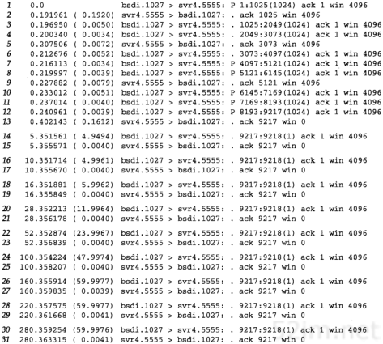

# 第22章 TCP的坚持定时器(零窗口探测定时器)

## 1、引言

```
我们已经看到TCP通过让接收方指明希望从发送方接收的数据字节数(即窗口大小)来进行流量控制。如果窗口大小为0会发生什么情况呢？这将有效地阻止发送方传送数据，直到窗口变为非0为止。
```

```
出现以下情况时，TCP接收方的接收缓冲区讲被塞满数据：
发送方的发送速度大于接收方的接收速度
接收方的应用程序未能及时从接收缓冲区中读取数据
```

```
当接收方的接收缓冲区满了以后，会把响应报文中的通告窗口字段置为0，从而阻止发送方的继续发送，这就是TCP的流控制。当接收方的应用程序读取了接收缓冲区中的数据以后，接收方会发送一个ACK，通过通告窗口字段告诉发送方自己又可以接收数据了，发送方收到这个ACK之后，就知道自己可以继续发送数据了。

ack会有延时发送的 默认200ms.所以win也就是接收窗口在200Ms以内被取走了部分数据的话就会空闲出一部分。
```

```
Q：那么问题来了，当接收方的接收窗口重新打开之后，如果它发送的ACK丢失了，发送方还能得知这一消息吗？
A：答案是不能。正常的ACK报文不需要确认，因而也不会被重传，如果这个ACK丢失了发送方将无法得知对端的接收窗口已经打开了，也就不会继续发送数据。这样以来，会造成死锁，接收方等待对端发送数据包，而发送方等待对端的ACK,直到连接超时关闭.
```

```
为了避免上述情况的发生，发送方实现了一个零窗口探测定时器，也叫持续定时器：
	当接收方的接收窗口为0时，每隔一段时间，发送方会主动发送探测包，通过迫使对端响应来得知其接收窗口有无打开。
	这就是山不过来，我就过去
```

## 1、激活

发送数据包时

```
在发送数据包时，如果发送失败，会检查是否需要启动零窗口探测定时器。

当网络中没有发送且未确认的数据包，且本端有待发送的数据包时，启动零窗口探测定时器。
为什么要有这两个限定条件呢？
如果网络中有发送且未确认的数据包，那这些包本身就可以作为探测包，对端的ACK即将到来。
如果没有待发送的数据包，那对端的接收窗口为不为0根本不需要考虑。

win为0时
网络中没有已经发送还未被确认的包
发送方还有待发送的数据的时候

会启动零窗口探测器
```

接收到ACK时

```
接收到ack时，会检查是否要删除或重置零窗口探测定时器。

 如果ACK打开了接收窗口，则删除零窗口探测定时器。否则根据退避指数，给予重置
 
 接收到一个ack的时候，如果之前网络中没有发送且未确认的数据段，本端又有待发送的数据段，说明可能遇到对端接收窗口为0的情况。
 这个时候会根据此ack是否打开了接收窗口来进行零窗口探测定时器的处理。
 1、如果此ack打开接收窗口。此时对端的接收窗口不为0了，可以继续发送数据包。
 那么清除超时时间的退避指针，删除零窗口探测定时器。
 2、如果此ACK是接收方对零窗口探测报文的响应，且它的接收窗口依然为0。
 那么根据指数退避算法重新设置零窗口探测定时器的下次超时时间，超时时间的设置和超时重传定时器的一样。零窗口探测定时器也使用退避指针来计算超时时间。
 
 会发送一个序号为snd_una - 1、长度为0的ACK包，对端收到此包后会发送一个ACK响应。
如此一来本端就能够知道对端的接收窗口是否打开了。
```

## 3、糊涂窗口综合征

```
就是指当发送端应用进程产生数据很慢，或接收端应用进程处理接收缓冲区数据很慢，或二者兼而有之；就会使应用进程间传送的报文段很小，特别是有效载荷很小； 极端情况下，有效载荷可能只有1个字节；传输开销有40字节(20字节的IP头+20字节的TCP头) 这种现象。
```


## 1、引言

```
我们已经看到TCP通过让接收方指明希望从发送方接收的数据字节数（即窗口大小）来进行流量控制。如果窗口大小为0会发生什么情况呢？这将有效地阻止发送方传送数据，直到窗口变为非0为止。

可以在图20-3中看到这种情况。当发送方接收到报文段9时，它打开被报文段8关闭的窗口并立即开始发送数据。TCP必须能够处理打开此窗口的ACK（报文段9）丢失的情况。ACK的传输并不可靠，也就是说，TCP不对ACK报文段进行确认，TCP只确认那些包含有数据的ACK报文段。

如果一个确认丢失了，则双方就有可能因为等待对方而使连接终止：接收方等待接收数据（因为它已经向发送方通告了一个非0的窗口），而发送方在等待允许它继续发送数据的窗口更新。为防止这种死锁情况的发生，发送方使用一个坚持定时器(persist timer)来周期性地向接收方查询，以便发现窗口是否已增大。这些从发送方发出的报文段称为窗口探查(window probe)。在本章中，我们将讨论窗口探查和坚持定时器，还将讨论与坚持定时器有关的糊涂窗口综合症。
```

## 2、例子

```
为了观察到实际中的坚持定时器，我们启动一个接收进程。它监听来自客户的连接请求，接受该连接请求，然后在从网上读取数据前休眠很长一段时间。

sock程序可以通过指定一个暂停选项-P使服务器在接受连接和进行第一次读动作之间进入休眠。我们以这种方式调用服务器：

svr4 % sock -i -s -P100000 5555

该命令在从网络上读数据之前休眠100 000秒（27.8小时）。客户运行在主机bsdi上，并向服务器的5555端口执行1024字节的写操作。图22-1给出了tcpdump的输出结果（我们已经在结果中去掉了连接的建立过程）。

报文段1~13显示的是从客户到服务器的正常的数据传输过程，有9216个字节的数据填充了窗口。服务器通告窗口大小为4096字节，且默认的插口缓存大小为4096字节。但实际上它一共接收了9216字节的数据，这是在SVR4中TCP代码和流子系统(stream subsystem)之间某种形式交互的结果。
```

```
在报文段13中，服务器确认了前面4个数据报文段，然后通告窗口为0，从而使客户停止发送任何其他的数据。这就引起客户设置其坚持定时器。如果在该定时器时间到时客户还没有接收到一个窗口更新，它就探查这个空的窗口以决定窗口更新是否丢失。由于服务器进程处于休眠状态，所以TCP缓存9216字节的数据并等待应用进程读取。

请注意客户发出的窗口探查之间的时间间隔。在收到一个大小为0的窗口通告后的第1个(报文段14)间隔为4.949秒，下一个(报文段16)间隔是4.996秒，随后的间隔分别约为6,12,24,48,60秒。

```




```
为什么这些间隔总是比5、6、12、24、48和60小一个零点几秒呢？因为这些探查被TCP的500ms定时器超时例程所触发。当定时器时间到时，就发送窗口探查，并大约在4ms之后收到一个应答。接收到应答使得定时器被重新启动，但到下一个时钟滴答之间的时间则约为500减4ms。 

坚持定时器要有ack回应之后才会触发。这里每次大概都是4ms收到ack。因为定时器的滴答是根据内核的，所以这里慢了4ms直接包含了。因为这个4m所以 每次 间隔都少了 4ms左右的时间。
```

```
计算坚持定时器时使用了普通TCP指数退避。对一个典型的局域网链接，首次超时时间算出来是1.5秒，第2次的超时值增加一倍，为3秒，再下次乘以4为6秒，之后再乘以8为12秒等。但是坚持定时器总是在5~60之间。所以计算的时间少于5秒会被当成5秒，而多于60秒就会变为60秒。
```

```
窗口探查包含一个字节的数据(序号为9217)。TCP总是允许在关闭连接前发送一个字节的数据(这里应该是指TCP允许只传输一个字节)。请注意，尽管如此，所返回的窗口为0的ACK并不是确认该字节（它们确认了包括9216在内的所有数据），因此这个字节被持续重传。
```

```
坚持状态与第21章中介绍的重传超时之间一个不同的特点就是TCP从不放弃发送窗口探查。这些探查每隔60秒发送一次，这个过程将持续到窗口被打开，或者应用进程使用的链接被终止。
```

## 3、糊涂窗口综合征

```
基于窗口的流量控制方案，如TCP所使用的，会导致一种被称为"糊涂窗口综合症SWS(Silly Window Syndrome)"的状况。如果发生这种情况，则少量的数据将通过连接进行交换，而不是满长度的报文段。

即很多低于TCP报文段头的长度的数据在进行交换，浪费资源

就是指当发送端应用进程产生数据很慢，或接收端应用进程处理接收缓冲区数据很慢，或二者兼而有之；就会使应用进程间传送的报文段很小，特别是有效载荷很小； 极端情况下，有效载荷可能只有1个字节；传输开销有40字节(20字节的IP头+20字节的TCP头) 这种现象。

就是指当发送端应用进程产生数据很慢，或接收端应用进程处理接收缓冲区数据很慢，或者二者兼而有之；就会使应用进程间传送的报文段很小，特别是有效载荷很小；极端情况下，有效载荷可能只有1个字节；传输开销有40字节(20字节的IP头+20字节的TCP头) 这种现象。
```


```
该现象可发生在两端中的任何一端：接收方可以通告一个小的窗口(而不是一直等到有大的窗口时才通告)，而发送方也可以发送少量的数据(而不是等待其他的数据以便发送一个大的报文段)。可以在任何一端采取措施避免出现糊涂窗口综合症的现象。
```

```
1、接收方不通告小窗口。通常的算法是接收方不通告小窗口(可以为0)，除非窗口可以增加一个报文段大小(也就是将要接收的MSS)或者可以接收方缓存空间的一半，不论实际有多少。
```

```
2、发送方避免出现糊涂窗口综合征的措施是只有以下条件之一满足才发送数据：(a)可以发送一个满长度的报文段;(b)可以发送至少是接收方通告窗口大小的一半的报文段；(c)没有已发送还没被确认的报文在网络中。
```

```
条件(b)主要对付那些总是通告小窗口(也许比1个报文段还小)的主机，条件(c)使我们在有尚未被确认的数据(正在等待被确认)以及在不能使用Nagle算法的情况下，避免发送小的报文段。如果应用进程在进行小数据的写操作(例如比该报文段还小)，条件(c)可以避免出现糊涂窗口综合症。

这三个条件也可以让我们回答这样一个问题：在尚未被确认数据的情况下，如果Nagle算法阻止我们发送小的报文段，那么多小才算是小呢？从条件(a)中可以看出所谓"小"就是指字节数小于报文段的大小。条件(b)仅用来对付较老的、原始的主机。

步骤2中的条件(b)要求发送方始终监听另一方通告的最大窗口大小
```


