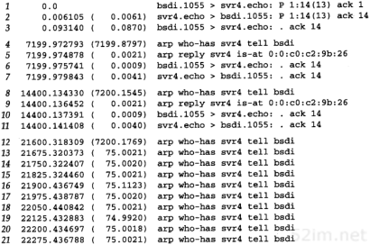
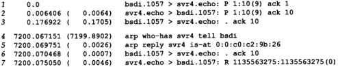
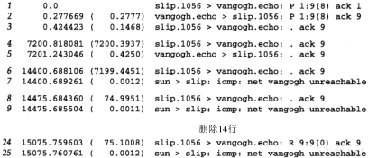

# 第23章 TCP的保活定时器

## 1、引言

```
许多TCP/IP的初学者会很惊奇的发现可以有一条没有任何数据流通过一个空闲的TCP连接。也就是说，如果TCP连接的双方都没有向对方发送数据，则在两个TCP模块之间不交换任何信息。例如，没有可以在其他网络协议中发现的轮询。这意味着我们可以启动一个客户与服务器建立一个连接，然后离去数小时、数天、数个星期或者数月，而连接依然保持。中间路由器可以崩溃和重启，电话线可以被挂断再连通，但是只要两端的主机没有被重启，则连接依然保持建立。
```

```
这意味着两个应用进程—客户进程或服务器进程—都没有使用应用级的定时器来检测非活动状态，而这种非活动状态可以导致应用进程中的任何一个终止其活动。回想在第10.7节末尾曾提到过的BGP每隔30秒就向对端发送一个应用的探查，就是独立于TCP的保活定时器之外的应用定时器。

然而，许多时候一个服务器希望知道客户主机是否崩溃并关机或者崩溃又重新启动。许多实现提供的保活定时器可以提供这种能力.

保活并不是TCP规范中的一部分。Host Requirements RFC提供了3个不使用保活定时器的理由：(1)在出现短暂差错的情况下，这可能会使一个非常好的连接释放掉；（2）它们耗费不必要的带宽；（3）在按分组计费的情况下会在互联网上花掉更多的钱。然而，许多实现提供了保活定时器。
```

```
保活定时器是一个有争论的功能。许多人认为如果需要，这个功能不应该在TCP中提供，而应该由应用程序来完成。这是应当认真对待的一些问题之一，因为在这个论题上有些人表达出了很大的热情。

在连接两个端系统的网络出现临时故障的时候，保活选项会引起一个实际上很好的连接终止。例如，如果在一个中间路由器崩溃并重新启动时发送保活探查，那么TCP会认为客户的主机已经崩溃，而实际上所发生的并非如此。
```

```
保活功能主要是为服务器应用程序提供的。服务器应用程序希望知道客户主机是否崩溃，从而可以代表客户使用资源。许多版本的Rlogin和Telnet服务器默认使用这个选项。

一个说明现在需要使用保活功能的常见例子是当个人计算机用户使用TCP/IP向一个使用Telnet的主机注册时。如果在一天结束时，他们仅仅关闭了电源而没有注销，那么便会留下一个半开放的连接。在图18-16中，我们看到通过一个半开放连接发送数据会导致返回一个复位，但那是在来自正在发送数据的客户端。如果客户已经消失了，使得在服务器上留下一个半开放连接，而服务器又在等待来自客户的数据，则服务器将永远等待下去。保活功能就是试图在服务器端检测到这种半开放的连接。
```

## 2、描述

```
在这个描述中，我们称使用保活选项的一端为服务器，而另一端则为客户。并没有什么使客户不能使用这个选项，但通常都是服务器设置这个功能。如果双方都特别需要了解对方是否已经消失，则双方都可以使用这个选项（在29章我们将看到NFS使用TCP时，客户和服务器都设置了这个选项。但在第26章讲到Telnet和Rlogin时，只有服务器设置了这个选项，而客户则没有）。
```

```
如果一个给定的连接在两个小时之内没有任何动作，则服务器就向客户发送一个探查报文段（我们将在随后的例子中看到这个探查报文段看起来像什么）。客户主机必须处于以下4个状态之一。

1、客户主机依然正常运行，并从服务器可达。客户的TCP响应正常，而服务器也知道对方是正常工作的。服务器在两个小时以后将保活定时器复位。如果在两个小时定时器到时间之前有应用程序的通信量通过此连接，则定时器在交换数据后的未来2小时再复位。

2、客户主机已经崩溃，并且关闭或正在重新启动。在任何一种情况下，客户的TCP都没有响应。服务器将不能够收到对探查的响应，并在75秒后超时。服务器总共发送10个这样的探查，每个间隔75秒。如果服务器没有收到一个响应，它就认为客户主机已经关闭并终止连接。

3、客户主机崩溃并已经重新启动。这时服务器将收到一个对其包活探查的响应，但是这个响应是一个复位，使得服务器终止这个连接。

4、客户主机正常运行。但是从服务器不可达。这与状态2相同，因为TCP不能够区分状态4与状态2之间的区别，它所能发现的就是没有收到探查的响应。 什么情况下会服务器不可达。中间路由崩溃了导致无法到达对端主机。
```

```
服务器不用关注客户主机被关闭和重新启动的情况(这指的是一个操作员的关闭，而不是主机崩溃)。当系统被操作员关闭时，所有的应用进程也被终止（也就是客户进程），这会使客户的TCP在连接上发出一个FIN。接收到FIN将使服务器的TCP向服务器进程报告文件结束，使服务器可以检测到这个情况。
```

```
在第1种情况下，服务器的应用程序没有感觉到保活探查的发生。TCP层负责一切。这个过程对应用程序都是透明的，直至第2、3或4种情况发生。在这三种情况下，服务器应用程序将收到来自它的TCP的差错报告（通常服务器已经向网络发出了读操作请求，然后等待来自客户的数据。如果保活功能返回一个差错，则该差错将作为读操作的返回值返回给服务器）。在第2种情况下，差错是诸如“连接超时”之类的信息，而在第3种情况则为“连接被对方复位”。第4种情况看起来像是连接超时，也可根据是否收到与连接有关的ICMP差错来返回其他的差错。在下一节中我们将观察这4种情况。

一个被人们不断讨论的关于保活选项的问题就是两个小时的空闲时间是否可以改变。通常他们希望该数值可以小得多，处在分钟的数量级。正如我们在附录E看到的，这个值通常可以改变，但是在该附录所描述的所有系统中，保活间隔时间是系统级的变量，因此改变它会影响到所有使用该功能的用户。

Host Requirements RFC提到一个实现可提供保活的功能，但是除非应用程序指明要这样，否则就不能使用该功能。而且，保活间隔必须是可配置的，但是其默认值必须不小于两个小时。
```

## 3、保活举例

```
现在详细讨论前一节提到的第2、3和4种情况。我们将在使用这个选项的情况下检查所交换的分组。
```

### 1、另一端奔溃

```
首先观察另一端崩溃且没有重新启动的情况下所发生的现象。为模拟这种情况，我们采用如下步骤：

在客户（主机bsdi上运行的sock程序）和主机svr4上的标准回显服务器之间建立一个连接。客
户使用-K选项使能保活功能。

验证数据可以通过该连接。

观察客户TCP每隔2小时发送保活分组，并观察被服务器的TCP确认。

将以太网电缆从服务器上拔掉直到这个例子完成，这会使客户认为服务器主机已经崩溃。

我们预期服务器在断定连接已中断前发送10个间隔为75秒的保活探查。
```

这里是客户端的交互输出结果：


```
图23-1显示的是tcpdump的输出结果（已经去掉了连接建立和窗口通告）。
```



​		图23-1 决定一个主机已经崩溃的保活分组 

```
客户在第1、2和3行向服务器发送“Hello,world”并得到回显。第4行是第一个保活探查，发生在两个小时以后（7200秒）。在第6行的TCP报文段能够发送之前，首先观察到的是一个ARP请求和一个ARP应答。第6行的保活探查引出来自另一端的响应（第7行）。两个小时以后，在第7和8行发生了同样的分组交换过程。
```

```
如果能够观察到第6和第10行的保活探查中的所有字段，我们就会发现序号字段比下一个将要发送的序号字段小1（在本例中，当下一个为14时，它就是13）。但是因为报文段中没有数据，tcpdump不能打印出序号字段（它仅能够打印出设置了SYN、FIN或RST标志的空数据的序号）。正是接收到这个不正确的序号，才导致服务器的TCP对保活探查进行响应。这个响应告诉客户，服务器下一个期望的序号是14。

一些基于4.2BSD的旧的实现不能够对这些保活探查进行响应，除非报文段中包含数据。某些系统可以配置成发送一个字节的无用数据来引出响应。这个无用数据是无害的，因为它不是所期望的数据（这是接收方前一次接收并确认的数据），因此它会被接收方丢弃。其他一些系统在探查的前半部分发送4.3BSD格式的报文段（不包含数据），如果没有收到响应，在后半部分则切换为4.2BSD格式的报文段。
```

```
接着我们拔掉电缆，并期望两个小时的再一次探查失败。当这下一个探查发生时，注意到从来没有看到电缆上出现TCP报文段，这是因为主机没有响应ARP请求。在放弃之前，我们仍可以观察到客户每隔75秒发送一个探查，一共发送了10次。从交互式脚本可以看到返回给客户进程的差错码被TCP转换为“连接超时”，这正是实际所发生的。
```

### 2、另一端崩溃并重新启动

```
在这个例子中，我们可以观察到当客户崩溃并重新启动时发生的情况。最初的环境与前一个例子相似，但是在我们验证连接有效之后，我们将服务器从以太网上断开，重新启动，然后再连接到网络上。我们希望看到下一个保活探查产生一个来自服务器的复位，因为现在服务器不知道关于这个连接的任何信息。这是交互会话的过程：
```


```
图23-2显示的是tcpdump的输出结果（已经去掉了连接建立和窗口通告）。
```



​			图23-2 另一端崩溃并重启时保活的例子 

```
我们建立了连接，并从客户发送9个字节的数据到服务器（第1~3行）。两个小时之后，客户发送第1个保活探查，其响应是一个来自服务器的复位。客户应用进程打印出“连接被对端复位”的差错，这是有意义的。
```

### 3、另一端不可达

```
在这个例子中，客户没有崩溃，但是在保活探查发送后的10分钟内无法到达，可能是一个中间路由器已经崩溃，或一条电话线临时出现故障，或发生了其他一些类似的情况。

为了仿真这个例子，我们从主机slip经过一个拨号SLIP链路与主机vangogh.cs.berkeley.edu建立一个连接，然后断掉链路。这里是交互输出的结果：
```


```
图23-3显示了在路由器bsdi上收集到的tcpdump输出结果（已经去掉了连接建立和窗口通告）。
```



​			图23-3 当另一端不可达时的保活例子 

```
我们与以前一样开始讨论这个例子：第1~3行证实连接是有效的。两个小时之后的第1个保活探查是正常的（第4、5行），但是在两个小时后发生下一个探查之前，我们断开在路由器sun和netb之间的SLIP连接（拓扑结构参见封）。

第6行的保活探查引发一个来自路由器sun的ICMP网络不可达的差错。正如我们在第21.10节描述的那样，对于主机slip上接收的TCP而言，这只是一个软差错。它报告收到了一个ICMP差错，但是差错的接收者并没有终止这个连接。在发送主机最终放弃之前，一共发送了9个保活探查，间隔为75秒。这时返回给应用进程的差错产生了一个不同的报文：“没有到达主机的路由”。我们在图6-12看到这对应于ICMP网络不可达的差错。
```

## 4、小结

```
正如我们在前面提到的，对保活功能是有争议的。协议专家继续在争论该功能是否应该归入运输层，或者应当完全由应用层来处理。

在连接空闲两个小时后，在一个连接上发送一个探查分组来完成保活功能。可能会发生4种不同的情况：对端仍然运行正常、对端已经崩溃、对端已经崩溃并重新启动以及对端当前无法到达。我们使用一个例子来观察每一种情况，并观察到在最后三个条件下返回的不同差错。

在前两个例子中，如果没有提供这种功能，并且也没有应用层的定时器，则客户将永远无法知道对端已经崩溃或崩溃并重新启动。可是在最后一个例子中，两端都没有发生差错，只是它们之间的连接临时中断。我们在使用保活时必须关注这个限制。
```


