# 1、IP


```
IP数据报的TTL：指的是可以跨越路由的数量。可以跨域几个路由。
	推荐的初始值由分配数字RFC指定，当前值为64。较老版本的系统经常初始化为15或32。我们从第7章中的一些ping程序例子中可以看出，发送ICMP回显应答时经常把TTL设为最大值255·
	
	TTL可以用来探测到目的地主机需要进过路由的数量。以便用来选择最短路径
	
	当路由器瘫痪或者两个路由器之间的连接丢失时，选路协议有时会去检测丢失的路由并一直进行下去。在这段时间内，数据报可能在循环回路被终止。TTL字段就是在这些循环传递的数据报上加上一个生存上限。

当路由器收到一份IP数据报，如果其TTL字段是0或1，则路由器不转发该数据报（接收到这种数据报的目的主机可以将它交给应用程序，这是因为不需要转发该数据报。但是在通常情况下，系统不应该接收TTL字段为0的数据报）。相反，路由器将该数据报丢弃，并给信源机发一份ICMP“超时”信息。Traceroute程序的关键在于包含这份ICMP信息的IP报文的信源地址是该路由器的IP地址。
```

```
IP的3位标志字段
标志字段用其中一个比特来表示“更多的片”。除了最后一片外，其他每个组成数据报的片都要把该比特置1。片偏移字段指的是该片偏移原始数据报开始处的位置。另外，当数据报被分片后，每个片的总长度值要改为该片的长度值。

最后，标志字段中有一个比特称作“不分片”位。如果将这一比特置1，IP将不对数据报进行分片。相反把数据报丢弃并发送一个ICMP差错报文（“需要进行分片但设置了不分片比特”，见图6-3）给起始端。在下一节我们将看到出现这个差错的例子。

当IP数据报被分片后，每一片都成为一个分组，具有自己的IP首部，并在选择路由时与其他分组独立。这样，当数据报的这些片到达目的端时有可能会失序，但是在IP首部中有足够的信息让接收端能正确组装这些数据报片。
```

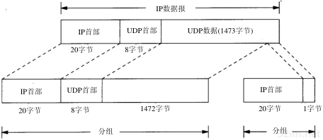


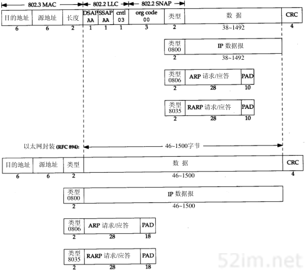

# 2、TCP选项

```
TCP头部的最后一个选项字段(options)是可变长的可选信息。这部分最多包含40字节，因为TCP头部最长是60字节(其中还包含前面讨论的20字节的固定部分)。典型的TCP头部选项结构
```


```
选项的第一个字段kind说明选项的类型

第二个字段length(如果有的话)制定该选项的总长度

第三个字段info(如果有的话)是选项的具体信息
```

## 1、常见的TCP选项有7种，如图所示

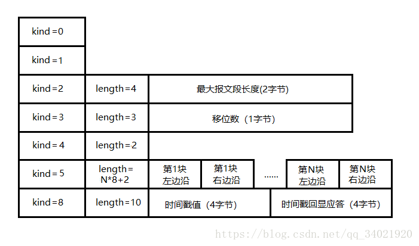

### 1、kind=0,选项表结束(EOP)选项

```
一个报文段仅用一次。放在末尾用于填充，用途是说明：首部已经没有更多的信息，应用数据在下一个32位字开始处
```

### 2、kind=1,空操作(NOP)选项

```
没有特殊含义，一般用于将TCP选项的总长度填充为4字节的整数倍
```

### 3、kind=2,最大报文段长度(MSS)选项

```
TCPTCP连接初始化时，通信双方使用该选项来协商最大报文段长度。TCP模块通常将MSS设置为（MTU-40）字节（减掉的这40字节包括20字节的TCP头部和20字节的IP头部）。这样携带TCP报文段的IP数据报的长度就不会超过MTU（假设TCP头部和IP头部都不包含选项字段，并且这也是一般情况），从而避免本机发生IP分片。对以太网而言，MSS值是1460（1500-40）字节。

以太网规定了 以太网数据链路的报文段的 报文体必须在 46~1500 区间呢，不够的就Padding 填充 
```

### 4、kind=3,窗口扩大因子选项

```
TCP连接初始化时，通信双方使用该选项来协商接收窗口的扩大因子。在TCP的头部中，接收窗口大小是用16位表示的，故最大为65535字节，但实际上TCP模块允许的接收窗口大小远不止这个数（为了提高TCP通信的吞吐量）。窗口扩大因子解决了这个问题。 

假设TCP头部中的接收通告窗口大小是N，窗口扩大因子(移位数)是M，那么TCP报文段的实际接收通告窗口大小是N*2^M,或者说N左移M位。注意，M的取值范围是0~14.

我们可以通过修改 /proc/sys/net/ipv4/tcp_window_scaling 内核变量来启用或关闭窗口扩大因子选项。 
只能在 SYN 报文段中使用，否则会被忽略

和MSS选项一样，窗口扩大因子选项只能出现在同步报文段中，否则将会被忽略。但同步报文段本身不执行窗口扩大操作，即同步报文段头部的接收窗口大小就是该TCP报文段的实际接收窗口大小。当连接建立好之后，每个数据传输方向的窗口扩大因子就固定不变了。
```

### 5、kind=4,选择性确认(Selective Acknowledgment, SACK)选项

```
TCP通信时，如果某个TCP报文段丢失，则TCP会重传最后被确认的TCP报文段后续的所有报文段，这样原先已经正确传输的TCP报文段也可能重复发送，从而降低了TCP性能。SACK技术正是为改善这种情况而产生的，它使TCP只重新发送丢失的TCP报文段，而不用发送所有未被确认的TCP报文段。选择性确认选项用在连接初始化时，表示是否支持SACK技术。我们可以通过修改 /proc/sys/net/ipv4/tcp_sack 内核变量来启用或关闭选择性确认选项。

只能在 SYN 报文段中使用，否则会被忽略 表示是否支持SACK技术
```

### 6、kind=5，ASCK实际工作的选项

```
该选项的参数告诉该选项的参数告诉发送方本端已经收到并缓存的不连续的数据块，从而让发送端可以据此检查并重发丢失的数据块。每个块边沿（edge of block）参数包含一个4字节的序号。其中块左边沿表示不连续块的第一个数据的序号，而块右边沿则表示不连续块的最后一个数据的序号的下一个序号。这样一对参数（块左边沿和块右边沿）之间的数据是没有收到的。因为一个块信息占用8字节，所以TCP头部选项中实际上最多可以包含4个这样的不连续数据块（考虑选项类型和长度占用的2字节）。
```

### 7、kind=8,时间戳选项

```
该选项提供了较为准确的计算通信双方之间的回路时间（Round Trip Time，RTT）的方法，从而为TCP流量控制提供重要信息。我们可以通过修改 /proc/sys/net/ipv4/tcp_timestamps 内核变量来启用或关闭时间戳选项。
```


# 3、第24章TCP的未来和性能

## 1、引言

```
TCP已经在从1200 b/s的拨号SLIP链路到以太数据链路上运行了许多年。在80年代和90年代初期，以太网是运行TCP/IP最主要的数据链路方式。虽然TCP在比以太网速率高的环境（如T2电话线、FDDI及千兆比网络）中也能够正确运行，但在这些高速率环境下，TCP的某些限制就会暴露出来。

本章讨论TCP的一些修改建议，这些建议可以使TCP在高速率环境中获得最大的吞吐量。首先要讨论前面已经碰到过的路径MTU发现机制，本章主要关注它如何与TCP协同工作。这个机制通常可以使TCP为非本地的连接使用大于536字节的MTU，从而增加吞吐量。
```

```
接收介绍长肥管道(long fat pipe)，也就是那些具有很大的带宽时延乘积的网络，以及TCP在这些网络上所具有的局限性。为处理长肥管道，我们描述两个新的TCP选项：窗口扩大选项(用来增加TCP的最大窗口，使之超过65535字节)和时间戳选项。后面这个选项可以使TCP对报文段进行更加精确的RT T测量，还可以在高速率下对可能发生的序号回绕提供保护。这两个选项在RFC 1323 [Jacobson,Braden,and Borman 1992]中进行定义。
```

```
我们还将介绍建议的T/TCP，这是为增加事务功能而对TCP进行的修改。通信的事务模式以客户的请求将被服务器应答的响应为主要特征。这是客户服务器计算的常见模型。T/TCP的目的就是减少两端交换的报文段数量，避免三次握手和使用4个报文段进行连接的关闭，从而使客户可以在一个RT T和处理请求所必需的时间内收到服务器的应答。
```

```
这些新选项（路径MTU发现、窗口扩大选项、时间戳选项和T/TCP）中令人印象最深刻的就是它们与现有的TCP实现能够向后兼容，即包括这些新选项的系统仍然可以与原有的旧系统进行交互。除了在一个ICMP报文中为路径MTU发现增加了一个额外字段之外，这些新的选项只需要在那些需要使用它们的端系统中进行实现。
```

## 2、路径MTU发现

```
在2.9节我们描述了路径MTU的概念。这是当前在两个主机之间的路径上任何网络上的最小MTU。路径MTU发现在IP首部中继承并设置"不要分片(DF)"比特，来发现当前路径上的路由器是否需要对正在发送的IP数据报进行分片。在11.6节我们观察到如果一个待转发的IP数据报被设置DF比特，而其长度又超过了MTU，那么路由器将返回ICMP不可达的差错。在11.7节我们显示了某版本的traceroute程序使用该机制来决定目的地的路径MTU。在11.8节我们看到UDP是怎样处理路径MTU发现的。在本节我们将讨论这个机制是如何按照RFC 1191 [Mogul and Deering 1990]中规定的那样在TCP中进行使用的。
```

```
TCP的路径MTU发现按如下方式进行：在连接建立时，TCP使用输出接口或对端声明的MSS中的最小MTU作为起始的报文段大小。路径MTU发现不允许TCP超过对端声明的MSS。如果对端没有指定一个MSS，则默认为536。一个实现也可以按21.9节中讲的那样为每个路由单独保存路径MTU信息。
```

```
一旦选定了起始的报文段大小，在该连接上的所有被TCP发送的IP数据报都将被设置DF比特。如果某个中间路由器需要对一个设置了DF标志的数据报进行分片，它就丢弃这个数据报，并产生一个我们在11.6节介绍的ICMP的“不能分片”差错。
```

```
如果收到这个ICMP差错，TCP就减少段大小并进行重传。如果路由器产生的是一个较新的该类ICMP差错，则报文段大小被设置为下一跳的MTU减去IP和TCP的首部长度。如果是一个较旧的该类ICMP差错，则必须尝试下一个可能的最小MTU（见图2-5）。当由这个ICMP差错引起的重传发生时，拥塞窗口不需要变化，但要启动慢启动。
```

```
由于路由可以动态变化，因此在最后一次减少路径MTU的一段时间以后，可以尝试使用一个较大的值(直到等于对端声明的MSS或输出接口MTU的最小值)RFC 1191推荐这个时间间隔为10分钟（我们在11.8节看到Solaris 2.2使用一个30分钟的时间间隔）。
```

```
在对非本地目的地，默认的MSS通常为536字节，路径MTU发现可以避免在通过MTU小于576（这非常罕见）的中间链路时进行分片。对于本地目的主机，也可以避免在中间链路（如以太网）的MTU小于端点网络（如令牌环网）的情况下进行分片。但为了能使路径MTU更加有用和充分利用MTU大于576的广域网，一个实现必须停止使用为非本地目的制定的536的MTU默认值。MSS的一个较好的选择是输出接口的MTU（当然要减去IP和TCP的首部大小）（在附录E中，我们将看到大多数的实现都允许系统管理员改变这个默认的MSS值）。
```

### 1、一个例子

```
在某个中间路由器的MTU比任一个端点接口MTU小的情况下，我们能够观察路径MTU发现是如何工作的。图24-1显示了这个例子的拓扑结构。
```

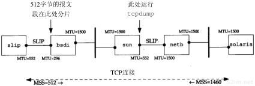

```
我们从主机solaris（支持路径MTU发现机制）到主机slip建立一个连接。这个建立过程与UDP的路径MTU发现（图11-13）中的一个例子相同，但在这里我们已经把slip接口的MTU设置为552，而不是通常的296。这使得slip通告一个512的MSS。但是在bsdi上的SLIP链路上的MTU为296，这就引起超过256的TCP报文段被分片。于是就可以观察在solaris上的路径MTU发现是如何进行处理的。

我们在solaris上运行sock程序并向slip上的丢弃服务器进行一个512字节的写操作：

solaris % sock -i -n1 -w512 slip discard

图24-2是在主机sun的SLIP接口上收集的tcpdump的输出结果。
```

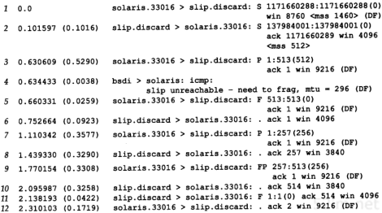

​			图24-2 路径MTU发现的tcpdump输出结果 

```
在第1和第2行的MSS值是我们所期望的。接着我们观察到solaris发送一个包含512字节的数据和对SYN的确认报文段(第3行)（在习题18.9中可以看到这种把SYN的确认与第一个包含数据的报文段合并的情况）。这就在第4行产生了一个ICMP差错，我们看到路由器bsdi产生较新的、包含输出接口MTU的ICMP差错。

看来在这个差错回到solaris之前，就发送了FIN（第5行）。由于slip从没有收到被路由器bsdi丢弃的512字节的数据，因此并不期望接收这个序号（513），所以在第6行用它期望的序号（1）进行了响应。

在这个时候，ICMP差错返回到了solaris，solaris用两个256字节的报文段（第7和第9行）重传了512字节的数据。因为在bsdi后面可能还有具有更小的MTU的路由器，因此这两个报文段都设置了DF比特。

接着是一个较长的传输过程（持续了大约15分钟），在最初的512字节变为256字节以后，solaris没有再尝试使用更大的报文段。
```

## 3、长肥管道

```
在20.7节，我们把一个连接的容量表示为

capacity(b) = bandwidth(b/s) × round-triptime(s)
容量 = 带宽(b/s)*RTT(s)
并称之为带宽时延乘积。也可称它为两端的管道大小。

当这个乘积变得越来越大时，TCP的某些局限性就会暴露出来。图24-5显示了多种类型的网络的某些数值。
```

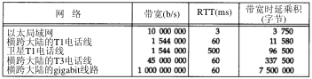

​				图24-5 多种网络的带宽时延乘积 

```
可以看到带宽时延乘积的单位是字节，这是因为我们用这个单位来测量每一端的缓存大小和窗口大小。

具有大的带宽时延乘积的网络被称为长肥网络（Long Fat Network，即LFN，发音为“elefan(t)s”），而一个运行在LFN上的TCP连接被称为长肥管道。回顾图20-11和图20-12，管道可以被水平拉长（一个长的RT T），或被垂直拉高（较高的带宽），或向两个方向拉伸。使用长肥管道会遇到多种问题。
```

```
问题：
1、TCP首部中窗口大小为16bit,从而将窗口限制在65535个字节内。但是从图24-5的最后一列可以看到，现有的网络需要一个更大的窗口来提供最大的吞吐量。在24.4节介绍的窗口扩大选项可以解决这个问题。

2、在一个长肥网络LFN内的分组丢失会使吞吐量急剧减少。如果只有一个报文段丢失，我们需要利用21.7节介绍的快速重传和快速恢复算法来使管道避免耗尽。但是即使使用这些算法，在一个窗口内发生的多个分组丢失也会典型地使管道耗尽（如果管道耗尽了，慢启动会使它渐渐填满，但这个过程将需要经过多个RTT）。

在RFC 1072 [Jacobson and Braden 1988]中建议使用有选择的确认（SACK）来处理在一个窗口发生的多个分组丢失。但是这个功能在RFC 1323中被忽略了，因为作者觉得在把它们纳入TCP之前需要先解决一些技术上的问题。

3、我们在第21.4节看到许多TCP实现对每个窗口的RTT仅进行一次测量。它们并不对每个报文段进行RTT测量。在一个长肥网络LFN上需要更好的RTT测量机制。我们将在24.5节介绍时间戳选项，它允许更多的报文段被计时，包括重传。

4、TCP对每个字节数据使用一个32 bit无符号的序号来进行标识。如果在网络中有一个被延迟一段时间的报文段，它所在的连接已被释放，而一个新的连接在这两个主机之间又建立了，怎样才能防止这样的报文段再次出现呢？首先回想起IP首部中的TTL为每个IP段规定了一个生存时间的上限—255跳或255秒，看哪一个上限先达到。在18.6节我们定义了最大的报文段生存时间（MSL）作为一个实现的参数来阻止这种情况的发生。推荐的MSL的值为2分钟（给出一个240秒的2MSL），但是我们在18.6节看到许多实现使用的MSL为30秒。

在长肥网络LFN上，TCP的序号会碰到一个不同的问题。由于序号空间是有限的，在已经传输了4294 967 296个字节以后序号会被重用。如果一个包含序号N字节数据的报文段在网络上被迟延并在连接仍然有效时又出现，会发生什么情况呢？这仅仅是一个相同序号N在MSL期间是否被重用的问题，也就是说，网络是否足够快以至于在不到一个MSL的时候序号就发生了回绕。在一个以太网上要发送如此多的数据通常需要60分钟左右，因此不会发生这种情况。但是在带宽增加时，这个时间将会减少：一个T3的电话线（45 Mb/s）在12分钟内会发生回绕，FDDI（100 Mb/s）为5分钟，而一个千兆比网络（1000 Mb/s）则为34秒。这时问题不再是带宽时延乘积，而在于带宽本身。
在24.6节，我们将介绍一种对付这种情况的办法：使用TCP的时间戳选项的PAW S(Protection Against Wrapped Sequence numbers)算法（保护回绕的序号）。


4.4BSD包含了我们将要在下面介绍的所有选项和算法：窗口扩大选项、时间戳选项和保护回绕的序号。许多供应商也正在开始支持这些选项。
```

### 千兆比网路

```
当网络的速率达到千兆比的时候，情况就会发生变化。[Partridge 1994]详细介绍了千兆比网络。在这里我们看一下在时延和带宽之间的差别 [Kleinrock 1992]。
```

```
考虑通过美国发送一个100万字节的文件的情况，假定时延为30 ms。图24-6显示了两种情况：上图显示了使用一个T1电话线（1544 000 b/s）的情况，而下图则是使用一个1Gb/s网络的情况。x轴显示的是时间，发送方在图的左侧，而接收方则在图的右侧，y轴为网络容量。两幅图中的阴影区域表示发送的100万字节。
```

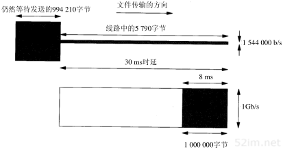

​			图24-6 以30 ms的延时通过网络发送100万字节的文件 

```
图24-6显示了30ms后这两个网络的状态。经过30ms(延时)以后数据的第1个比特都已到达对端。但对T1网络而言，由于管道容量仅为5790字节，因此发送方仍然有994 210个字节等待发送。而千兆比网络的容量则为3750 000字节，因此，整个文件仅使用了25％左右的带宽，此时文件的最后一个比特已经到达第1个字节后8ms处。

经过T1网络传输文件的总时间为5.211秒。如果增加更多的带宽，使用一个T3网络(45 000 000 b/s），则总时间减少到0.208秒。增加约29倍的带宽可以将总时间减小到约25分之一。

使用千兆比网络传输文件的总时间为0.038秒：30 ms的时延加上8ms的真正传输文件的时间。假定能够将带宽增加为2000 Mb/s，我们只能够将总时间减小为0.304 ms：同样30 ms的时延和4ms的真正传输时间。现在使带宽加倍仅能够将时间减少约10％。在千兆比速率下，时延限制占据了主要地位，而带宽不再成为限制。

时延主要是由光速引起的，而且不能够被减小（除非爱因斯坦是错误的）。当我们考虑到分组需要建立和终止一个连接时，这个固定时延起的作用就更糟糕了。千兆比网络会引起一些需要不同看待的连网观点。
```

## 4、窗口扩大选项

```
窗口扩大选项使TCP的窗口定义从16 bit增加为32 bit。这并不是通过修改TCP首部来实现的，TCP首部仍然使用16 bit，而是通过定义一个选项实现对16 bit的扩大操作(scaling operation)来完成的。于是TCP在内部将实际的窗口大小维持为32 bit的值。

在图18-20可以看到关于这个选项的例子。一个字节的移位记数器取值为0（没有扩大窗口的操作）和14。这个最大值14表示窗口大小为1073 725 440字节（65535×214）。
```

```
这个选项只能够出现在一个SYN报文段中，因此当连接建立起来后，在每个方向的扩大因子是固定的。为了使用窗口扩大，两端必须在它们的SYN报文段中发送这个选项。主动建立连接的一方在其SYN中发送这个选项，但是被动建立连接的一方只能够在收到带有这个选项的SYN之后才可以发送这个选项。每个方向上的扩大因子可以不同。

主动建立连接的一方在其SYN中发送这个选项，但是被动建立连接的一方只能够在收到带有这个选项的SYN之后才可以发送这个选项。每个方向上的扩大因子可以不同。

如果主动连接的一方发送一个非零的扩大因子，但是没有从另一端收到一个窗口扩大选项，它就将发送和接收的移位记数器置为0。这就允许较新的系统能够与较旧的、不理解新选项的系统进行互操作。

Host Requirements RFC要求TCP接受在任何报文段中的一个选项（只有前面定义的一个选项，即最大报文段大小，仅在SYN报文段中出现）。它还进一步要求TCP忽略任何它不理解的选项。这就使事情变得容易，因为所有新的选项都有一个长度字段（图18-20）。
```

```
假定我们正在使用窗口扩大选项，发送移位记数为S，而接收移位记数则为R。于是我们从另一端收到的每一个16 bit的通告窗口将被左移R位以获得实际的通告窗口大小。每次当我们向对方发送一个窗口通告的时候，我们将实际的32 bit窗口大小右移S比特，然后用它来替换TCP首部中的16 bit的值。

TCP根据接收缓存的大小自动选择移位记数。这个大小是由系统设置的，但是通常向应用进程提供了修改途径（我们在20.4节中讨论了这个缓存）。
```

### **一个例子** 

```
如果在4.4BSD的主机vangogh.cs.berkeley.edu上使用sock程序来初始化一个连接，我们可以观察到它的TCP计算窗口扩大因子的情况。下面的交互输出显示的是两个连续运行的程序，第1个指定接收缓存为128 000字节，而第2个的缓存则为220 000字节。
```

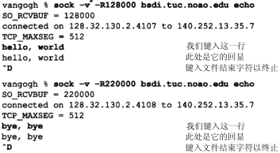

图24-7 显示了这两个连接的tcpdump输出结果（去掉了第2个连接的最后8行，因为没有什么新内容）。 

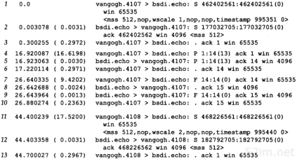

```
在第1行，vangogh通告一个65535的窗口，并通过设置移位计数为1来指明窗口扩大选项。这个通告的窗口是比接收窗口（128 000）还小的一个最大可能取值，因为在一个SYN报文段中的窗口字段从不进行扩大运算。

扩大因子为1表示vangogh发送窗口通告一直到131 070（65535×21）。这将调节我们的接收缓存的大小（12 8000）。因为bsdi在它的SYN（第2行）中没有发送窗口扩大选项，因此这个选项没有被使用。注意到vangogh在随后的连接阶段继续使用最大可能的窗口（65535）。

对于第2个连接vangogh请求的移位计数为2，表明它希望发送窗口通告一直为262 140（65535×22），这比我们的接收缓存（220 000）大。
```

## 5、时间戳选项

### 1、网页解释

#### 1、TCP可选项格式

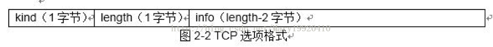

```
时间戳选项占10个字节= kind(1字节) ＋ length(1字节) + info (8字节)，其中kind=8，length=10，info由timestamp和timestamp echo 两个值组成，各4个字节的长度。
```

#### 2、TCP时间戳字段存放的内容注解

```
发送方在发送报文段时把当前时钟的时间放入时间戳字段，接收方在确认该报文段时把时间戳字段值复制到时间戳回送回答字段。因此，发送方在收到确认报文后，可以准确计算出RTT。

下面我们以一个例子理解 timestamp 和 timestamp echo 字段中存放的内容：假设a主机和b主机之间通信，a主机向b主机发送一个报文段，那么：

1）timestamp 字段中存放的内容：a主机向b主机发送报文s1,在s1报文段中 timestamp 存储的是a主机发送s1时的内核时间 ta1.

2)timestamp echo字段中存放的内容：b主机收到s1报文并向a主机发送含有确认ack的报文s2，在s2报文中，timestamp为b主机此时的内核时刻tb，而timestamp echo字段为从s1报文中解析出的ta1.

这些时刻具体的作用，我们继续向下看，将结合TCP时间戳选项的功能进行说明。
```

#### 3、TCP时间戳选项的功能

```
1、计算往返时延RTT：
	当a主机接收到b主机发送过来的确认ack报文s2时，a主机内核时刻为ta2;
	a主机从s2报文的timestamp echo选项中可以解析出该确认ack确认的报文的发送时刻为ta1.
那么：RTT＝接收ack报文的时刻－发送报文的时刻＝ta2 －ta1.
ta2和ta1都来自a主机的内核，所以不需要在tcp连接的两端进行任何时钟同步的操作。

2）防止回绕的序号：
	我们知道TCP报文的序列号只有32位，而没增加2^32个序列号后就会重复使用原来用过的序列号。假设我们有一条高速网络，通信的主机双方有足够大的带宽涌来快速的传输数据。例如1Gb/s的速率发送报文，则不到35秒报文的序号就会重复。这样对TCP传输带来混乱的情况。而采用时间戳选项，可以很容易的分辨出相同序列号的数据报，哪个是最近发送，哪个是以前发送的。
```

-----TCP/IP解释-----

```
时间戳选项使发送方在每个报文段中放置一个时间戳值。接收方在确认中返回这个数值，从而允许发送方为每一个收到的ACK计算RTT（我们必须说“每一个收到的ACK”而不是“每一个报文段”，是因为TCP通常用一个ACK来确认多个报文段）。我们提到过目前许多实现为每一个窗口只计算一个RTT，对于包含8个报文段的窗口而言这是正确的。然而，较大的窗口大小则需要进行更好的RTT计算。

RFC 1323的3.1节给出了需要为较大窗口进行更好的RTT计算的信号处理的理由。通常RTT通过对一个数据信号（包含数据的报文段）以较低的频率（每个窗口一次）进行采样来进行计算，这就将别名引入了被估计的RTT中。当每个窗口中有8个报文段时，采样速率为数据率的1/8，这还是可以忍受的。但是如果每个窗口中有100个报文段时，采样速率则为数据速率的1/100，这将导致被估计的RTT不精确，从而引起不必要的重传。如果一个报文段被丢失，则会使情况变得更糟。

图18-20显示了时间戳选项的格式。发送方在第1个字段中放置一个32 bit的值，接收方在应答字段中回显这个数值。包含这个选项的TCP首部长度将从正常的20字节增加为32字节。
```

```
时间戳是一个单调递增的值。由于接收方只需要回显收到的内容，因此不需要关注时间戳单元是什么。这个选项不需要在两个主机之间进行任何形式的时钟同步。RFC 1323推荐在1毫秒和1秒之间将时间戳的值加1。
推荐在 1毫秒 或者 一秒的时候将时间戳手动加1；

4.4BSD在启动时将时间戳始终设置为0，然后每隔500 ms将时间戳时钟加1。

在图24-7中，如果观察在报文段1和报文段11的时间戳，它们之间的差（89个单元）对应于每个单元500 ms的规定，因为实际时间差为44.4秒。
```

```
在连接建立阶段，对这个选项的规定与前一节讲的窗口扩大选项类似。主动发起连接的一方在它的SYN中指定选项。只有在它从另一方的SYN中收到了这个选项之后，该选项才会在以后的报文段中进行设置。

我们已经看到接收方TCP不需要对每个包含数据的报文段进行确认，许多实现每两个报文段发送一个ACK。如果接收方发送一个确认了两个报文段的ACK，那么哪一个收到的时间戳应当放入回显应答字段中来发回去呢？
```

```
为了减少任一端所维持的状态数量，对于每个连接只保持一个时间戳的数值。选择何时更新这个数值的算法非常简单：

1、TCP跟踪下一个ACK中将要发送的时间戳的值(一个名为tsrecent的变量)以及最后发送的ACK中的确认序号（一个名为lastack的变量）。这个序号就是接收方期望的序号。

2、当一个包含有字节号lastack的报文段到达时，则该报文段中的时间戳被保存在tsrecent中。

3、无论何时发送一个时间戳选项，tsrecent就作为时间戳回显应答字段被发送，而序号字段被保存在lastack中


简而言之就是：报文段到达时候，给了 timestamp ；在要返回的时候 ack 里面的 timestamp 填了接收方的时间戳(只是一个自增序列)，timestamp echo 里面填了发送方的报文段里面的 timestamp ,然后发送方接收到 ack以后就可以获取当前的 时间戳 再取出ack里面的 timestamp echo 时间戳

RTT = 当前的时间戳 - timestamp echo 里面的时间戳
这样就不用管两边的 时间戳增长频率是否相同，因为都是拿自己的时间戳进行计算的。
```

```
这个算法能够处理下面两种情况：
	1、如果ACK被接收方迟延，则作为回显值的时间戳值应该对应于最早被确认的报文段。
	
	例如，如果两个包含1~1024和1025~2048字节的报文段到达，每一个都带有一个时间戳选项，接收方产生一个ACK 2049来对它们进行确认。此时，ACK中的时间戳应该是包含字节1~1024的第1个报文段中的时间戳。这种处理是正确的，因为发送方在进行重传超时时间的计算时，必须将迟延的ACK也考虑在内。
	
	2、如果一个收到的报文段虽然在窗口范围内但同时又是失序，这就表明前面的报文段已经丢失。当那个丢失的报文段到达时，它的时间戳(而不是失序的报文段的时间戳)将被回显。

例如，假定有3个各包含1024字节数据的报文段，按如下顺序接收：包含字节1~1024的报文段1，包含字节2049~4072的报文段3和包含字节1025~2048的报文段2。
返回的ACK应该是带有报文段1的时间戳的ACK 1025（一个正常的所期望的对数据的ACK）
带有报文段1的时间戳的ACK 1025（一个重复的、响应位于窗口内但却是失序的报文段的ACK）
然后是带有报文段2的时间戳的ACK 3073（不是报文段3中的较后的时间戳）。
报文段3的时间戳要后面一点。因为报文段2是先发的

这与当报文段丢失时的对RT T估计过高具有同样的效果，但这比估计过低要好些。

而且，如果最后的ACK含有来自报文段3的时间戳，它可以包括重复的ACK返回和报文段2被重传所需要的时间，或者可以包括发送方的报文段2的重传超时定时器到期的时间。无论在哪一种情况下，回显报文段3的时间戳将引起发送方的RT T计算出现偏差。
```

## 6、PAWS：防止回绕的序号

```
考虑一个使用窗口扩大选项的TCP连接，其最大可能的窗口大小为1千兆字节（230）（最大的窗口是65535×214，而不是216×214，但只比这个数值小一点点，并不影响这里的讨论）。还假定使用了时间戳选项，并且由发送方指定的时间戳对每个将要发送的窗口加1（这是保守的方法。通常时间戳比这种方式增加得快）。图24-8显示了在传输6千兆字节的数据时，在两个主机之间可能的数据流。为了避免使用许多10位的数字，我们使用G来表示1073 741 824的倍数。我们还使用了tcpdump的记号，即用J:K来表示通过了J字节的数据，且包括字节K-1。
```

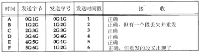

​		图24-8 在6个1千兆字节的窗口中传输6千兆字节的数据 

```
32 bit的序号在时间D和时间E之间发生了回绕。假定一个报文段在时间B丢失并被重传。还假定这个丢失的报文段在时间E重新出现。

这假定了在报文段丢失和重新出现之间的时间差小于MSL，否则这个报文段在它的TTL到期时会被某个路由器丢弃。正如我们前面提到的，这种情况只有在高速连接上才会发生，此时旧的报文段重新出现，并带有当前要传输的序号。

我们还可以从图24-8中观察到使用时间戳可以避免这种情况。接收方将时间戳视为序列号的一个32 bit的扩展。由于在时间E重新出现的报文段的时间戳为2，这比最近有效的时间戳小（5或6），因此PAWS算法将其丢弃。

PAWS算法不需要在发送方和接收方之间进行任何形式的时间同步。接收方所需要的就是时间戳的值应该单调递增，并且每个窗口至少增加1。
```

## 7、T/TCP

```
详情自行查看 TCP/IP详解
```

## 8、TCP的性能

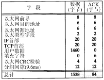

​			图24-9 计算以太网理论上最大 吞吐量的字段大小 


