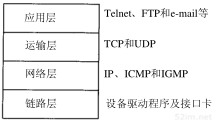

# 1、引言

```
很多不同的厂家生产各种型号的计算机，它们运行完全不同的操作系统，但TCP/IP协议族允许它们互相进行通信。这一点很让人感到吃惊，因为它的作用已远远超出了起初的设想。TCP/IP起源于60年代末美国政府资助的一个分组交换网络研究项目，到90年代已发展成为计算机之间最常应用的组网形式。
```

# 2、分层



```
每一层负责不同的功能
1、链路层，有时也称作数据链路层或网络接口层，通常包括操作系统中的设备驱动程序和计算机中对应的网络接口卡。它们一起处理与电缆(或其他任何传输媒介)的物理接口细节。

2、网络层，有时也称作互联网层，处理分组在网络中的活动，例如分组的选路。在TCP/IP协议族中，网络层协议包括IP协议(网际协议)、ICMP协议(internet互联网控制报文协议)，以及IGMP协议(internet组管理协议)。

3、运输层主要为两台主机上的应用程序提供端到端的通信。在TCP/IP协议族中，有两个互不相同的传输协议:TCP(传输控制协议)和UDP(用户数据协议)。

TCP为两台主机提供高可靠性的数据通信。它所做的工作包括把应用程序交给它的数据分成合适的小块交给下面的网络层，确认接收到的分组，设置发送最后确认分组的超时时钟等。由于运输层提供了高可靠性的端到端的通信，因此应用层可以忽略所有这些细节。

而另一方面，UDP则为应用层提供一种非常简单的服务。它只是把称作数据报的分组从一台主机发送到另一台主机，但并不保证该数据报能到达另一端。任何必须的可靠性必须由应用层来提供。
这两种运输层协议分别在不同的应用程序中有不同的用途，这一点将在后面看到。

4、应用层负责处理特定的应用程序细节。几乎各种不同的 TCP/IP 实现都会提供下面这些通用的应用程序：
	TeInet 远程登录
    FTP 文件传输协议
    SMTP 简单邮件传送协议
    SNMP 简单网络管理协议
```

## 1、为什么要有网络协议呢

```
在 80 年代，网络不断增长的原因之一是大家都意识到只有一台孤立的计算机构成的"孤岛"没有太大意义，于是就把这些孤立的系统组在一起形成网络。随着这样的发展，到了90年代，我们又逐渐认识到这种由单个网络构成的新的更大的"岛屿"同样没有太大的意义。于是，人们又把多个网络连在一起形成一个网络的网络，或称作互联网(internet).一个互联网就是一组通过相同协议族互连在一起的网路。
```

```
网络层：
ip协议 网络层 网际协议
ICMP协议(internet 互联网控制报文协议)
IGMP协议(internet 组管理协议)


传输层：
tcp 传输层 传输控制协议
UDP 传输层 用户数据报协议
```


