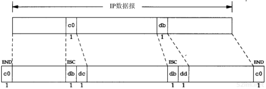

# 1、概述

## 1、引言

```
很多不同的厂家生产各种型号的计算机，它们运行完全不同的操作系统，但TCP/IP协议族允许它们互相进行通信。这一点很让人感到吃惊，因为它的作用已远远超出了起初的设想。TCP/IP起源于60年代末美国政府资助的一个分组交换网络研究项目，到90年代已发展成为计算机之间最常应用的组网形式。
```

## 2、分层


```
每一层负责不同的功能
1、链路层，有时也称作数据链路层或网络接口层，通常包括操作系统中的设备驱动程序和计算机中对应的网络接口卡。它们一起处理与电缆(或其他任何传输媒介)的物理接口细节。

2、网络层，有时也称作互联网层，处理分组在网络中的活动，例如分组的选路。在TCP/IP协议族中，网络层协议包括IP协议(网际协议)、ICMP协议(internet互联网控制报文协议)，以及IGMP协议(internet组管理协议)。

3、运输层主要为两台主机上的应用程序提供端到端的通信。在TCP/IP协议族中，有两个互不相同的传输协议:TCP(传输控制协议)和UDP(用户数据协议)。

TCP为两台主机提供高可靠性的数据通信。它所做的工作包括把应用程序交给它的数据分成合适的小块交给下面的网络层，确认接收到的分组，设置发送最后确认分组的超时时钟等。由于运输层提供了高可靠性的端到端的通信，因此应用层可以忽略所有这些细节。

而另一方面，UDP则为应用层提供一种非常简单的服务。它只是把称作数据报的分组从一台主机发送到另一台主机，但并不保证该数据报能到达另一端。任何必须的可靠性必须由应用层来提供。
这两种运输层协议分别在不同的应用程序中有不同的用途，这一点将在后面看到。

4、应用层负责处理特定的应用程序细节。几乎各种不同的 TCP/IP 实现都会提供下面这些通用的应用程序：
	TeInet 远程登录
    FTP 文件传输协议
    SMTP 简单邮件传送协议
    SNMP 简单网络管理协议
```

## 1、为什么要有网络协议呢

```
在 80 年代，网络不断增长的原因之一是大家都意识到只有一台孤立的计算机构成的"孤岛"没有太大意义，于是就把这些孤立的系统组在一起形成网络。随着这样的发展，到了90年代，我们又逐渐认识到这种由单个网络构成的新的更大的"岛屿"同样没有太大的意义。于是，人们又把多个网络连在一起形成一个网络的网络，或称作互联网(internet).一个互联网就是一组通过相同协议族互连在一起的网路。
```

```
网络层：
ip协议 网络层 网际协议
ICMP协议(internet 互联网控制报文协议)
IGMP协议(internet 组管理协议)


传输层：
tcp 传输层 传输控制协议
UDP 传输层 用户数据报协议
```


# 2、链路层

## 1、引言

```
链路层主要有三个目的：
1、为IP模块发送和接收IP数据报；
2、为ARP模块发送ARP请求和接收ARP应答。
3、为RARP发送RARP请求和接收RARP应答。
TCP/IP支持多种不同的链路层协议，这取决于网络所使用的硬件，如以太网、令牌环网、FDDI(光纤分布式数据接口)及RS-232串行线路等。
```

```
在本章中，我们将详细讨论以太网链路层协议，两个串行接口链路层协议(SLIP和PPP)，以及大多数实现都包含的环回(loopback)驱动程序。以太网和SLIP是本书中大多数例子使用的链路层。对MTU(最大传输单元)进行了介绍，这个概念在本书的后面章节中将多次遇到。我们还讨论了如何为串行线路选择MTU;
```

## 2、以太网和IEEE802封装

```
以太网这个术语一般是指数字设备公司、英特尔公司和Xerox公司在1982年联合公布的一个标准。它是当今TCP/IP采用的主要的局域网技术。它采用一种称作CSMA/CD的媒体接入放法， 其意思是带冲突检测的载波监听多路接入。它的速率为10Mb/s 地址为 48bit
```

```
几年后，IEEE(电子电气工程师协会)802委员会公布了一个稍有不同的标准集，其中802.3针对整个CSMA/CD网络，802.4针对令牌总线网络，802.5针对令牌环网络。这三者的共同特性由802.2标准来定义，那就是802网络共有的逻辑链路控制（LLC）。不幸的是，802.2和802.3定义了一个与以太网不同的帧格式。
```

```
在TCP/IP世界中，以太网IP数据报的封装是在RFC 894[Hornig 1984]中定义的，IEEE 802网络的IP数据报封装是在RFC 1042[Postel and Reynolds 1988]中定义的。主机需求RFC要求每台Internet主机都与一个10 Mb/s的以太网电缆相连接：

1、必须能发送和接收采用RFC 894（以太网）封装格式的分组。
2、应该能接收与RFC 894混合的RFC 1042（IEEE 802）封装格式的分组。
3、也许能够发送采用RFC 1042格式封装的分组。如果主机能同时发送两种类型的分组数据，那么发送的分组必须是可以设置的，而且默认条件下必须是RFC 894分组。
```


```
两种帧格式都采用48 bit（6字节）的目的地址和源地址（802.3允许使用16 bit的地址，但一般是48 bit地址）。这就是我们在本书中所称的硬件地址。ARP和RARP协议（第4章和第5章）对32 bit的IP地址和48 bit的硬件地址进行映射。
```

```
接下来的2个字节在两种帧格式中互不相同。在802标准定义的帧格式中，长度字段是指它后续数据的字节长度，但不包括CRC检验码。以太网的类型字段定义了后续数据的类型。在802标准定义的帧格式中，类型字段则由后续的子网接入协议(Sub-network Access Protocol, SNAP)的首部给出。幸运的是，802定义的有效长度值与以太网的有效类型值无一相同，这样，就可以对两种帧格式进行区分。
```

```
在以太网帧格式中，类型字段之后就是数据;而在802帧格式中，跟随在后面的是3字节的802.2LLC 和 5字节的802.2SNAP。目的服务访问点(Destination Service Access Point, DSAP)和源服务访问点(Source Service Access Point, SSAP)的值都设为0xaa. ctrl 字段的值设为3.随后的3个字节 org code 都置为 0. 再接下来的2个字节类型字段和以太网帧格式一样
```

```
CRC 字段用与帧内后续字节差错的循环冗余码检验(检验和)。(它也被称为FCS或帧检验序列)。
```

```
802.3标准定义的帧和以太网的帧都有最小长度要求。802.3规定数据部分必须至少为38字节，而对于以太网，则要求最少要有46字节。为了保证这一点，必须在不足的空间插入填充（pad）字节。在开始观察线路上的分组时将遇到这种最小长度的情况。

在本书中，我们在需要的时候将给出以太网的封装格式，因为这是最为常见的封装格式。
```

## 3、尾部封装

```
RFC 893[Leffler and Karels 1984]描述了另一种用于以太网的封装格式，称作尾部封装（trailer encapsulation）。这是一个早期BSD系统在DEC VA X机上运行时的试验格式，它通过调整IP数据报中字段的次序来提高性能。在以太网数据帧中，开始的那部分是变长的字段（IP首部和TCP首部）。把它们移到尾部（在CRC之前），这样当把数据复制到内核时，就可以把数据帧中的数据部分映射到一个硬件页面，节省内存到内存的复制过程。TCP数据报的长度是512字节的整数倍，正好可以用内核中的页表来处理。两台主机通过协商使用ARP扩展协议对数据帧进行尾部封装。这些数据帧需定义不同的以太网帧类型值。

现在，尾部封装已遭到反对，因此我们不对它举任何例子。有兴趣的读者请参阅RFC 893以及文献[Leffler et al.1989]的11.8节。
```

## 4、SLIP：串行线路IP

```
SLIP的全称是Serial Line IP。它是一种在串行线路上对IP数据报进行封装的简单形式，在RFC 1055[Romkey 1988]中有详细描述。SLIP适用于家庭中每台计算机几乎都有的RS-232串行端口和高速调制解调器接入Internet。

下面的规则描述了SLIP协议定义的帧格式：

1、IP数据报以一个称作END（0xc0）的特殊字符结束。同时，为了防止数据报到来之前的线路噪声被当成数据报内容，大多数实现在数据报的开始处也传一个END字符（如果有线路噪声，那么END字符将结束这份错误的报文。这样当前的报文得以正确地传输，而前一个错误报文交给上层后，会发现其内容毫无意义而被丢弃）。
2、如果IP报文中某个字符为END，那么就要连续传输两个字节0xdb和0xdc来取代它。0xdb这个特殊字符被称作SLIP的ESC字符，但是它的值与ASCII码的ESC字符（0x1b）不同。
3、如果IP报文中某个字符为SLIP的ESC字符，那么就要连续传输两个字节0xdb和0xdd来取代它。

图2-2中的例子就是含有一个END字符和一个ESC字符的IP报文。在这个例子中，在串行线路上传输的总字节数是原IP报文长度再加4个字节。
```



```
SLIP是一种简单的帧封装方法，还有一些值得一提的缺陷：

1、每一端必须知道对方的IP地址。没有办法把本端的IP地址通知给另一端。
2、数据帧中没有类型字段（类似于以太网中的类型字段）。如果一条串行线路用于SLIP，那么它不能同时使用其他协议。
3、SLIP没有在数据帧中加上检验和（类似于以太网中的CRC字段）。如果SLIP传输的报文被线路噪声影响而发生错误，只能通过上层协议来发现（另一种方法是，新型的调制解调器可以检测并纠正错误报文）。这样，上层协议提供某种形式的CRC就显得很重要。在第3章和第17章中，我们将看到IP首部和TCP首部及其数据始终都有检验和。在第11章中，将看到UDP首部及其数据的检验和却是可选的。
```


