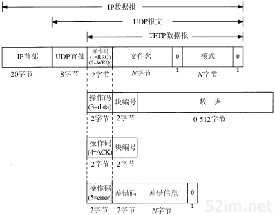

# 第15章 TFTP 简单文件传送协议

## 1、引言

```
TFTP(Trivial File Transfer Protocol)即文件传送协议，最初打算用于引导无盘系统(通常是工作站或X终端)。和将在第27章介绍的使用 TCP 的文件传送协议(FTP)不同，为了保持简单和短小，TFTP将使用UDP。TFTP的代码(和它所需要的UDP、IP和设备驱动程序)都能适合只读存储器。

本章对 TFTP 只作一般介绍，因为在下一章引导程序协议(Bootstrap Protocol)中还会遇到TFTP.
```

## 2、协议

```
在开始工作时，TFTP的客户与服务器交换信息，客户发送一个读请求或写请求给服务器。在一个无盘系统进行系统引导的正常情况下，第一个请求是读请求(RRQ).下图显示了5种TFTP报文格式(操作码为 1和 2 的报文使用相同的格式)。
```




