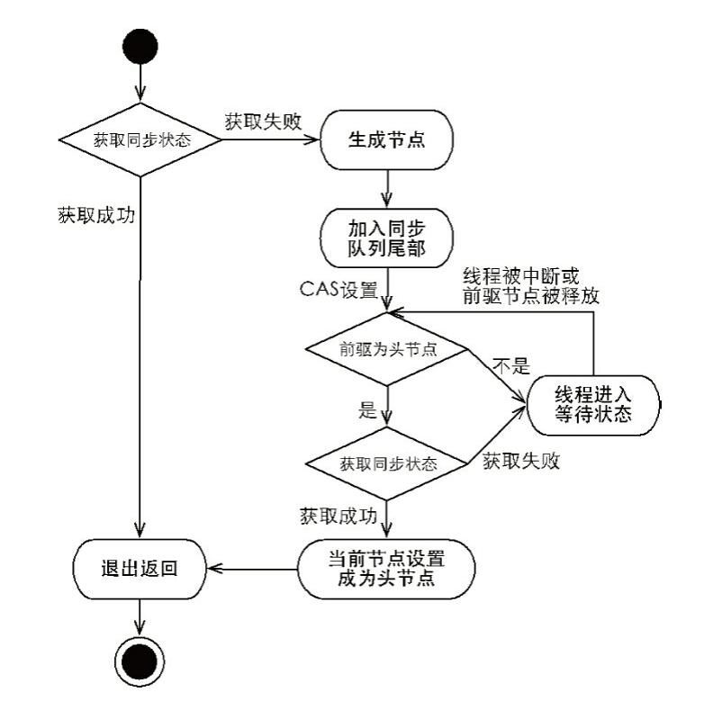

# 1、线程中断

```
调用线程的interrupt方法，并不能真正中断线程，只是给线程做了中断状态的标志
Thread.interrupted()：测试当前线程是否处于中断状态。执行后将中断状态标志为false
Thread.isInterrupte()： 测试线程Thread对象是否已经处于中断状态。但不具有清除功能
// 将线程置为 中断状态 就是 false
Thread.currentThread().interrupt();

// 查看线程的中断状态，并将其中断状态清除
	public static boolean interrupted () {
	     return currentThread().isInterrupted(true);}
	     
	// 查看线程的中断状态，不重置
	public boolean isInterrupted () {
	     return isInterrupted( false);}
	     
	     // 是否清除中断状态
	     //“中断状态将会根据传入的 xxx 参数值确定是否重置”
	     isInterrupted(xxx);
	     
true 表示是中断状态
false 表示不是中断状态


如果是wait、sleep以及jion三个方法引起的阻塞，那么会将线程的中断标志重新设置为false，并抛出一个InterruptedException；

如果是java.nio.channels.InterruptibleChannel进行的io操作引起的阻塞，则会对线程抛出一个ClosedByInterruptedException；（待验证）

如果是轮询（java.nio.channels.Selectors）引起的线程阻塞，则立即返回，不会抛出异常。（待验证）
```

```
首先，我们要明白，中断不是类似 Linux 里面的命令 kill -9 pid，不是说我们中断某个线程，这个线程就停止运行了。中断代表线程状态，每个线程都关联了一个中断状态，是一个 true 或 false 的 boolean 值，初始值为 false;
关于中断状态，我们需要重点关注以下几个方法：
上面的代码块介绍过了

```

```
如果线程处于以下三种情况，那么当线程被中断的时候，能自动感知到：
来自 Object 类的 wait()、wait(long)、wait(long, int)，

来自 Thread 类的 join()、join(long)、join(long, int)、sleep(long)、sleep(long, int)

这几个方法的相同之处是，方法上都有: throws InterruptedException

如果线程阻塞在这些方法上（我们知道，这些方法会让当前线程阻塞），这个时候如果其他线程对这个线程进行了中断，那么这个线程会从这些方法中立即返回，抛出 InterruptedException 异常，同时重置中断状态为 false。

实现了 InterruptibleChannel 接口的类中的一些 I/O 阻塞操作，如 DatagramChannel 中的 connect 方法和 receive 方法等

如果线程阻塞在这里，中断线程会导致这些方法抛出 ClosedByInterruptException 并重置中断状态。

Selector 中的 select 方法，一旦中断，方法立即返回

对于以上 3 种情况是最特殊的，因为他们能自动感知到中断（这里说自动，当然也是基于底层实现），并且在做出相应的操作后都会重置中断状态为 false。

那是不是只有以上 3 种方法能自动感知到中断呢？不是的，如果线程阻塞在 LockSupport.park(Object obj) 方法，也叫挂起，这个时候的中断也会导致线程唤醒，但是唤醒后不会重置中断状态，所以唤醒后去检测中断状态将是 true。
```

```
InterruptedException 概述
它是一个特殊的异常，不是说 JVM 对其有特殊的处理，而是它的使用场景比较特殊。通常，我们可以看到，像 Obejct 中的 wait()方法，ReentrantLock 中的 lockInterruptibly()方法，Thread 中的 sleep()方法等等,这些方法都带有  throws InterruptedException，我们通常称这些方法为阻塞方法（blocking method）。
阻塞方法一个很明显的特征是，它们需要花费比较长的时间（不是绝对的，只是说明时间不可控），还有它们的方法结束返回往往依赖于外部条件，如 wait 方法依赖于其他线程的 notify，lock 方法依赖于其他线程的 unlock等等。

当我们看到方法上带有 throws InterruptedException 时，我们就要知道，这个方法应该是阻塞方法，我们如果希望它能早点返回的话，我们往往可以通过中断来实现。

除了几个特殊类（如 Object，Thread等）外，感知中断并提前返回是通过轮询中断状态来实现的。我们自己需要写可中断的方法的时候，就是通过在合适的时机（通常在循环的开始处）去判断线程的中断状态，然后做相应的操作（通常是方法直接返回或者抛出异常）。当然，我们也要看到，如果我们一次循环花的时间比较长的话，那么就需要比较长的时间才能注意到线程中断了。

```


# 2、LockSupport

```
LockSupport是用来创建锁和其他同步类的基本线程阻塞基本体(primitives)。通过调用LockSupport的park方法可以申请一个许可，如果当前许可可用的话，那么则立即返回，否则则阻塞等待许可。直到另外一个线程调用unpark方法对被阻塞的线程的许可进行释放。(默认许可阻塞)

park方法还支持Blocker对象参数，在调用park方法对当前线程进行阻塞时候，可以把Blocker对象参数传递过来，LockSupport的park方法里会调用setBlocker方法把该对象参数存入到Thread里的parkBlocker变量里。我们可以通过getBlocker获取线程的parkBlocker变量，从而得知该线程正在被阻塞的原因。
```


```
public class LockSupport {
    private LockSupport() {} // 禁止创建对象

    // Unsafe实际上调用的都是本地方法native
    private static final Unsafe unsafe = Unsafe.getUnsafe();
    private static final long parkBlockerOffset;

    static {
        try {
        //获取Thread的成员变量parkBlocker的偏移量
            parkBlockerOffset = unsafe.objectFieldOffset
                (java.lang.Thread.class.getDeclaredField("parkBlocker"));
        } catch (Exception ex) { throw new Error(ex); }
    }
    //设置Blocker对象到Thread对象里面
    private static void setBlocker(Thread t, Object arg) {
        // Even though volatile, hotspot doesn't need a write barrier here.
        unsafe.putObject(t, parkBlockerOffset, arg);
    }

    //获取先前park时候存入的线程的Blocker，如果未存入或者当前线程并不在park里，则为null
    public static Object getBlocker(Thread t) {
        if (t == null)
            throw new NullPointerException();
        return unsafe.getObjectVolatile(t, parkBlockerOffset);
    }


    //对于给定的Thread释放它所占有的许可。如果当前线程已经占有许可，则释放。如果为占有也释放，那么下次调用该线程的unpark方法时候
    //会导致park直接获取了。因为上次已经释放了
    public static void unpark(Thread thread) {
        if (thread != null)
            unsafe.unpark(thread);
    }

    //挂起当前线程,且把Blocker存到线程中
    public static void park(Object blocker) {
        Thread t = Thread.currentThread();
        setBlocker(t, blocker);
    //false代表非绝对时间（即相对时间）
        unsafe.park(false, 0L);
        setBlocker(t, null);
    }
}
```


# 3、FIFO

```
Node prev
前驱节点，指向前一个节点
Node next
后续节点，指向后一个节点
Node nextWaiter
用于存储condition队列的后续节点
Thread thread
入队列时的当前线程
int waitStatus
有五种状态：

SIGNAL(signal 信号)：
	值为 -1，表示当前节点的后续节点中的线程通过 park 被阻塞了，当前节点在释放或取消时要通过 unpark 解除它的阻塞

CANCELLED(cancelled 取消)：
	值为 1， 表示当前节点的线程因为超时或中断被取消了

CONDITION(condition 状态，决定)
	值为 -2， 表示当前节点在 condition 队列中

PROPAGATE(propogate 传播)
	值为 -3， 共享模式的头结点可能处于此状态，表示无条件往下传播，引入此状态是为了优化锁竞争，时队列线程有序地一个一个唤醒。

0， 除了以上四种状态的第五种状态，一般是节点初始状态。
```

```
前驱节点prev的引入主要是为了完成超时及取消语义，前驱节点取消后只需向前找到一个未取消的前驱节点即可；
后续节点的引入主要是为了优化后续节点的查找，避免每次从尾部向前查找；nextWaiter用于表示condition队列的后续节点，此时prev和next属性将不再使用，而且节点状态处于Node.CONDITION; 
waitStatus表示的是后续节点状态，这是因为AQS中使用CLH队列实现线程的结构管理，而CLH结构正是用前一节点某一属性表示当前节点的状态，这样更容易实现取消和超时功能。
```


```

 /**
         * ConditionObject链表的后继节点或者代表共享模式的节点SHARED。Condition条件队列：因为Condition队列只能在独占模式下被能被访问,
         * 我们只需要简单的使用链表队列来链接正在等待条件的节点。再然后它们会被转移到同步队列（AQS队列）再次重新获取。
         * 由于条件队列只能在独占模式下使用，所以我们要表示共享模式的节点的话只要使用特殊值SHARED来标明即可。
         */
        Node nextWaiter;


//SHARED作为共享模式下的常量
 static final Node SHARED = new Node();
 //EXCLUSIVE作为独占模式下的常量
 static final Node EXCLUSIVE = null;

Node prev //前一个节点的地址
Node next //后一个节点的地址

int waitStatus // 当前 Thread 节点的状态
Thread thread // 当前节点的数据、

  final boolean isShared() {
            return nextWaiter == SHARED;
        }
```


```
int waitStatus 
	等待状态
	CANCELLED 值为1，由于在同步队列中等待的线程等待超时或者中断，需要从同步队列中取消等待(移除)，节点进入该状态将不会变化
	SIGNAL 值为 -1，后继节点的线程处于等待状态，而当前节点的线程如果释放了同步状态或者被取消，将会通知后继节点，使后继节点的线程得以运行。
	CONDITION 值为 -2，节点在等待队列中，节点线程等待在 Condition 上，当其他线程对 Condition 调用了 signal() 方法后，该节点将会从等待队列中转移到同步队列中，加入到对同步状态的获取中
	PROPAGATE 值为 -3，表示下一次共享式同步状态获取将会无条件被传播下去。
	INITIAL 值为 0，初始状态
	
Node nextWaiter
	等待队列中的后继节点。如果当前节点是共享的，那么这个字段将是一个 SHARED 常量，也就是说节点类型(独占和共享)和等待队列中的后继节点共用同一个字段。
	如果是独享的就为 null;


```

```java
 final boolean isShared() {
     return nextWaiter == SHARED;
 }
 
final Node predecessor() throws NullPointerException {
    Node p = prev;
    if (p == null)
        throw new NullPointerException();
    else
        return p;
}

Node(Thread thread, Node mode) {     // Used by addWaiter
            this.nextWaiter = mode;
            this.thread = thread;
        }
        Node(Thread thread, int waitStatus) { // Used by Condition
            this.waitStatus = waitStatus;
            this.thread = thread;
        }
```


```java
公共辅助方法
在 node 获取失败时，node 入队后，检测和更新 node 状态值
其实是尝试获取锁，没有获取时，尝试使用这方法
private static boolean shouldParkAfterFailedAcquire(Node pred, Node node) {
	 // 获取当前节点的前节点
        int ws = pred.waitStatus;
        //该节点如果状态如果为SIGNAL。则返回true，然后park挂起线程
        // Signal 代表后续节点的线程处于等待状态，当前节点的线程释放了通不状态或者被取消，将会通知后继节点，使后继节点的线程得以运行
        if (ws == Node.SIGNAL)
            return true;
       //表明该节点已经被取消，向前循环重新调整链表节点
        if (ws > 0) {
            /*
             * Predecessor was cancelled. Skip over predecessors and
             * indicate retry.
             */
     // 下面的循环就是不断点检测前节点，如果无效就将其 剔除
            do {
            	
            	// 讲 pred.prev 作为 node 的上一个节点，也就是说
            	// 当前线程被取消了，将 pred 剔除
                node.prev = pred = pred.prev;
            } while (pred.waitStatus > 0);
            // 因为 pred 已经是 pred.prev 也就是说，是上一个节点的前节点了
            // 如果为所以你必须让上一个节点也指向 node 
            pred.next = node;
        } else {

            //执行到这里代表节点是0或者PROPAGATE，然后标记他们为SIGNAL，但是
            //还不能park挂起线程。需要重试是否能获取，如果不能则挂起
            // 因为这里并没有循环进行设置，所以不能保证设置成功了。
            // 也不能 while 进行设置，因为如果状态改变了，说明 pred，被操作过了，需要重新进行，尝试获取锁和进行上面的剔除无效的节点
            // 所以就返回 false
            compareAndSetWaitStatus(pred, ws, Node.SIGNAL);
        }
        return false;
    }

一般用来进行 tryAcquire 等获取锁的方法，没有获取到锁，就将当前 node 的 pred 设置为 signal ，如果设置成功返回 true,否则 false; 

在 node 获取锁失败时，node 入队后，检测和更新 node 状态值
```


```java
/**
     * 突然发现 park 以后 thread.interrupt(); 竟然会瞬间醒过来
     * 运行结果 1 2 醒过来了啦！
     */
    @Test
    public void fun4() {
        Thread thread = Thread.currentThread();
        new Thread(()->{
            try {
                Thread.sleep(1000);
                thread.interrupt();
                System.out.println("2");
                //LockSupport.unpark(thread);
            } catch (InterruptedException e) {
                e.printStackTrace();
            }
        }).start();
        System.out.println("1");
        LockSupport.park();
        System.out.println("醒过来了啦！");
    }

```


```java
挂起当前线程，且返回线程的中断状态
private final boolean parkAndCheckInterrupt() {
        LockSupport.park(this);
        // 返回中断状态，并且清除
        return Thread.interrupted();
    }
```


```java

private void doAcquireShared(int arg) {
        final Node node = addWaiter(Node.SHARED);
        boolean failed = true;
        try {
            boolean interrupted = false;
            for (;;) {
                final Node p = node.predecessor();
                if (p == head) {
                    // 可能会抛异常，因为这里如果是中断状态，可能会抛异常，具体看是否支持中断。抛异常了 这个节点就没有被正常的回收，因为强引用没有断。所以需要调用取消节点
                    int r = tryAcquireShared(arg);
                    if (r >= 0) {
                        // 将 node 设置为 Head
                        setHeadAndPropagate(node, r);
                        p.next = null; // help GC
                        if (interrupted)
                            selfInterrupt();
                        failed = false;
                        return;
                    }
                }
                if (shouldParkAfterFailedAcquire(p, node) &&
                    parkAndCheckInterrupt())
                    interrupted = true;
            }
        } finally {
            if (failed)
                cancelAcquire(node);
        }
    }


取消节点
这个基本都是因为
private void cancelAcquire(Node node) {
        // Ignore if node doesn't exist
        if (node == null)
            return;
        // 将 node 也就是当前节点的线程置为 null
        node.thread = null;
        
       // 获取 当前节点的上一个节点
        Node pred = node.prev;
        // 不断的循环，去除 prev 的 waitStatus 为取消的节点
      //迭代剔除已被取消的节点
        while (pred.waitStatus > 0)
            node.prev = pred = pred.prev;
       
       // 获取有用的节点的下一个节点
       // 用来进行下面的 csa 操作
        Node predNext = pred.next;
       
       // 将其当前节点设置为 取消节点 也就是赋值 1.
       // waitStatus > 0, 就代表 该节点已经被取消 
        node.waitStatus = Node.CANCELLED;
        // If we are the tail, remove ourselves.
        // 如果当前的无效节点已经是 尾部节点，就将 上一个节点 替换为尾节点
        // 因为如果 node 是 tail 节点， 那么 tail 已经是无效节点，就必须替换节点，而上面已经
        if (node == tail && compareAndSetTail(node, pred)) {
            compareAndSetNext(pred, predNext, null);
        } else {
            // If successor needs signal, try to set pred's next-link
            // so it will get one. Otherwise wake it up to propagate.
            int ws;

// 如果 pred 就是 node 的 pred 的有效节点 不是头节点。
//将pred.waitStatus 赋给 ws, 并判断 ws 是不是 Node.SIGNAL 状态的或者 ws<0 也就是不是取消状态的， 就将 pred 赋予 SIGNAL，一定要成功。因为是 cas 失败就返会 false了。
// 并且 pred.thread != null 

// 所以就三个条件，pred 不是 head 节点，并且是 Node.SIGNAL 模式的，不是就将其赋值为 Node.SIGNAL 样式，并且 节点里面的 thread 不能为 Null
            if (pred != head &&
                ((ws = pred.waitStatus) == Node.SIGNAL ||
                 (ws <= 0 && compareAndSetWaitStatus(pred, ws, Node.SIGNAL))) &&
                pred.thread != null) {
                // 获取 node的下一个节点。
                Node next = node.next;
                if (next != null && next.waitStatus <= 0)
                // 将 node.next 变为 node.pred.next 的下一个节点
                    compareAndSetNext(pred, predNext, next);
            } else {
                /**
            1.头部head
            2.当前节点的前驱节点状态为SIGNAL + 前驱节点线程不为null
            3.如果前驱节点不是取消状态且修改前驱节点状态为SIGNAL成功 + 前驱节点线程不为null

             以上三总情况则会释放当前取消的节点的后继节点的线程（注意仅仅只是释放线程，并不代表能成功出队列。还需要在for(;;)重试truAcquire*）。 

           **/
           // 因为是抛出异常才来取消节点的，所以
                unparkSuccessor(node);
            }
            // 将其 自身引用自身。而 node.next 后面的节点 都已经赋给node.pred 了。 node 就会等待 GC 回收
            node.next = node; // help GC
        }
    }
    
用来取消节点，如果当前节点是 tail 就那 pred 代替 tail,如果当前节点的 pred 是 head 说明，
```


## 3.独占模式：

public final void acquire(int arg) 和public final boolean release(int arg)  先来看下独占模式的获取方法 

```java
/**
     * 忽略中断的（即不手动抛出InterruptedException异常）独占模式下的获取方法。该方法在成功返回前至少
     * 会调用一次tryAcquire()方法(该方法是子类重写的方法，如果返回true则代表能成功获取).否则当前线程会进入
     * 队列排队，重复的阻塞和唤醒等待再次成功获取后返回, 该方法可以用来实现Lock.lock
     *
     * @param arg 这个值被传递给tryAcquire使用，主要是用来作为state值处理的参数。可以根据需要灵活使用该值
     */
    public final void acquire(int arg) {
       //首先调用tryAcquire(arg)值尝试获取，如果成功则返回true。!true则等于false不需要进入 acquireQueued(addWaiter(Node.EXCLUSIVE), arg))
      //进行排队等待再次成功获取
        if (!tryAcquire(arg) &&
            acquireQueued(addWaiter(Node.EXCLUSIVE), arg))
            selfInterrupt();
    }


 /**
     * 尝试在独占模式下获取.这个方法应该查下该对象的状态是否被允许在独占模式下获取，如果是才获取
     * 这个方法通常由线程执行获取时调用，如果该方法返回false，且该线程还未进入队列，则该线程会进去AQS队列排队然后挂起线程，
     * 直到其他线程调用release进行通知已被的线程释放。该方法可以备用来实现Lock.tryLock
     *
     *默认抛出UnsupportedOperationException异常
     *
     */
    protected boolean tryAcquire(int arg) {
        throw new UnsupportedOperationException();
    }
```


```
根据参数 Mode（Node.EXCLUSIVE或者Node.SHARED）和 Thread.currentThread()创建一个节点 Node,然后加入到 AQS 链表队列

只有在 tryAcquire 获取失败时候，才进入 AQS 链表队列等待再次成功获取。
打个比方： 我们去医院看医生，挂号在某个特定教授。如果当前教授没有任何病人在看病(相当于 tryAcquired)，那么我们不需要排队就能进去看病。否则的话，我们要在门扣排队(相当于 addWaiter),等待当前在看病的病人出来，出来一个(相当于 release)则正在队列头部的病人可以进去看病了(大概相当于acquireQueued)。
```

```java
 private Node addWaiter(Node mode) {
        Node node = new Node(Thread.currentThread(), mode);
        // 尝试快速入队，即无竞争条件下肯定成功。如果失败，则进入enq自旋重试入队
        // 获取 尾节点
        Node pred = tail;
        if (pred != null) {
        	// 将新创建的节点的 prev 指向尾节点，因为是尾节点
        	// ，所以 node.next = null.
            node.prev = pred;
            //CAS替换当前尾部。成功则返回
            if (compareAndSetTail(pred, node)) {
            // 并且将先前的 尾节点的 next 指向 node
                pred.next = node;
                return node;
            }
        }
        enq(node);
        return node;
    }

就是将其Thread 封装为 node 并将其变为当前队列的 tail。然后将其返回 
```

插入节点到队列中，如果队列未初始化则初始化。然后再插入 

```java
private Node enq(final Node node) {
        for (;;) {
            Node t = tail;
            if (t == null) { // Must initialize
            	// 如果没有 尾节点，说明还没有队列。
            	// 创建一个节点作为 队列的 head 节点
                if (compareAndSetHead(new Node()))
                // 注意 head的 next 并没有指向下一个节点
                // 同时将其 tail = head 
                    tail = head;
            } else {
            // 如果有队列的话就将其 尾节点 变为当前节点的 prev
                node.prev = t;
                // 将 node 变为当前的尾节点
                if (compareAndSetTail(t, node)) {
                // 并且将先前的 尾节点的 next 指向 node
                    t.next = node;
                    return t;
                }
            }
        }
    }

//  反正就是吧当前节点添加到 尾节点
```


acquireQueued主要是处理正在排队等待的线程。自旋、阻塞重试获取。如果获取成功则替换当前节点为链表头，然后返回 .

```java
final boolean acquireQueued(final Node node, int arg) {
        boolean failed = true;
        try {
            boolean interrupted = false;
           
            for (;;) {
                //获取当前节点的前驱节点。
                final Node p = node.predecessor();
                //如果前驱节点是头节点且尝试获取成功，则替换当前节点会链表的头结点，然后返回
               //问题：为什么是前驱节点而不是当前节点？因为我们队列在初始化时候生成了个虚拟头节点，相当于多出来了个节点。
                
    // 主要判断当前节点的 pred 是 head 吗。是的话，再次尝试获取执行权
     // 并将 node 置为 head 返回  false
                if (p == head && tryAcquire(arg)) {
                    setHead(node);
                    //设置前驱节点的后继节点为null。使前驱节点成为不可达。方便GC回收
                    p.next = null; // help GC
                    failed = false;
                    return interrupted;
                }
                //判断当前节点的线程是否应该被挂起，如果应该被挂起则挂起。等待release唤醒释放 
                //问题：为什么要挂起当前线程？因为如果不挂起的话，线程会一直抢占着CPU
 // 主要就是判断 pred 是否为Node.SIGNAL 是的话返会 true.
// 不是的话 判断 pred 是否为 取消标识的节点，是的话就不断的将 xx.pred 取消标识的节点剔除.
// 如果是有效节点，就将其 pred 设置为 SIGNAL。最后返回 false
    // 如果是 true 查看是否被挂起，挂起就将  interrupted = true; 
    // 现在到了这里，当前线程就会被挂起，等待 release
                if (shouldParkAfterFailedAcquire(p, node) &&
                    parkAndCheckInterrupt())
                    interrupted = true;
            }
        } finally {
            if (failed)
                //在队列中取消当前节点,因为等唤醒以后，最终都会变成head
                // 变为 head 以后就 将当前节点设置为 取消状态
                cancelAcquire(node);
        }
    }
```


独占模式下的释放，如果方法返回true，可释放1个或者多个线程。该方法可以用来实现Lock.unlock方法 

```java
 public final boolean release(int arg) {
        if (tryRelease(arg)) {
            // 尝试释放，成功后判断 h 不是初始状态，也就是说不是刚初始化的无用 node (只是 new Node()。怎么参数都没有带的 node)
            Node h = head;
            if (h != null && h.waitStatus != 0)
                // 就调用 unpark 进行 唤醒
                unparkSuccessor(h);
            return true;
        }
     // 失败返会 false
        return false;
    }
```


## 4.共享模式：

public final void acquireShared(int arg)和public final boolean releaseShared(int arg) 
共享模式的典型例子就是信号量和闭锁了。

共享模式下忽略中断的获取，该方法至少会调用一次子类重写的tryAcquireShared方法，如果首次获取结果大于等于0.则完成获取 
否则进入AQS同步队列阻塞等待机会再次重新尝试获取，直到获取成功。

```java
 public final void acquireShared(int arg) {
        if (tryAcquireShared(arg) < 0)
            doAcquireShared(arg);
 }
 /**
     * 共享模式下尝试获取。该方法应该确定在共享模式下，Object的状态值是否允许被获取。
     * 如果该方法返回结果被认为失败（值<0），则当前线程会进入AQS的同步队列阻塞等待
     * 知道其他线程调用release释放。
     * 
     *
     * 默认抛出 UnsupportedOperationException异常
     */
     
      protected int tryAcquireShared(int arg) {
        throw new UnsupportedOperationException();
    }
```


共享模式获取的核心公共方法 

```java
private void doAcquireShared(int arg) {
        //添加当前线程为一个共享模式的节点
        final Node node = addWaiter(Node.SHARED);
        boolean failed = true;
        try {
            boolean interrupted = false;
            for (;;) {
                final Node p = node.predecessor();
                if (p == head) {
                    int r = tryAcquireShared(arg);
                   //如果当前节点的前驱节点==head 且 state值大于0则认为获取成功
                    if (r >= 0) {
                        setHeadAndPropagate(node, r);
                        p.next = null; // help GC
                        if (interrupted)
                            selfInterrupt();
                        failed = false;
                        return;
                    }
                }
                //判断当前节点是否应该被阻塞，是则阻塞等待其他线程release
                if (shouldParkAfterFailedAcquire(p, node) &&
                    parkAndCheckInterrupt())
                    interrupted = true;
            }
        } finally {
            //如果出异常，没有完成当前节点的出队，则取消当前节点
            if (failed)
                cancelAcquire(node);
        }
    }
```


设置节点node为AQS同步队列的头结点。如果后继节点为共享模式且参数propagate是否大于0或者PROPAGATE是否已被设置，则唤醒后继节点 

```
 private void setHeadAndPropagate(Node node, int propagate) {
        Node h = head; // Record old head for check below
        //首先设置node为头节点
        setHead(node);
        if (propagate > 0 || h == null || h.waitStatus < 0) {
            Node s = node.next;
            if (s == null || s.isShared())
                doReleaseShared();
        }
    }
```


共享模式下的释放，唤醒后继节点并且保证传播。  注意：在独占模式下，如果需要唤醒，仅仅相当于调用头节点的unparkSuccessor动作。 

```java
 private void doReleaseShared() {
        /*
         * 确保释放的传播性, 即使在并发情况下，多个线程在获取、释放。
         * 如果需要唤醒，则通常尝试头节点的unparkSuccessor 动作。
         * 但是如果他不符合唤醒的条件，为了确保能正确release，那么则把头节点的state设置为
         * 的state设置为PROPAGATE。此外，在执行该行为时，为了以防万一有新
         * 节点的加入我们的行为必须在循环中，而且如果在修改状态中，如果修改失败，那么
         * 也需要重新尝试修改。
         */
        for (;;) {
            Node h = head;
            if (h != null && h != tail) {
                int ws = h.waitStatus;
                if (ws == Node.SIGNAL) {
                    if (!compareAndSetWaitStatus(h, Node.SIGNAL, 0))
                        continue;            // loop to recheck cases
                    unparkSuccessor(h);
                }
                /**
                    为什么这里要把state状态修改为Node.PROPAGATE？可以想象一下在什么情况下节点的状态会被修改为0,。
                    线程1调用doReleaseShared的方法释放头节点，此时头节点的状态被设置为0，compareAndSetWaitStatus(h, Node.SIGNAL, 0)
                        然后unparkSuccessor(h);   AQS的头节点则被唤醒重试尝试出队。注意：此时的头节点状态为0！！
                    线程2调用且成功进入到doReleaseShared方法，此时获取头节点状态为0（新的头节点还未被setHead），既然能进入到这里，总不能释放失败吧？
                        然后则把头节点由0修改为Node.PROPAGATE,这样我们在关注下setHeadAndPropagate方法
                        if (propagate > 0 || h == null || h.waitStatus < 0) {
                                Node s = node.next;
                                if (s == null || s.isShared())
                                    doReleaseShared();
                          }
                        可以看到这时候h.waitStatus是小于0的。则保证了并发情况下线程2的释放成功！
                **/
                else if (ws == 0 &&
                         !compareAndSetWaitStatus(h, 0, Node.PROPAGATE))
                    continue;                // loop on failed CAS
            }
            /**
                    为什么这里要加个h == head？
                    思考什么情况下这里的头部会被改变。上面也说了：Additionally, we must loop in case a new node is addedwhile we are doing this
                    假设当前AQS队列没有任何等待的节点，即head==tail。这时候上面的if判断不成立，执行到这里适合再次判断h==head,如果有新节点添加
                    进来，则h!=head,会重新尝试释放。我结论：应该是为了保证在多线程情况下的尽可能成功性。
            **/
            if (h == head)                   // loop if head changed
                break;
        }
    }
```

不行了 以后再看吧


# 1、acquire

```java
/**
	acquire 方法对中断方法并不敏感。也就是
由于线程获取同步状态失败后进入同步队列中，后续对线程进行中断操作时，线程不会从同步队列中移出， 中断后，线程会停止阻塞醒过来
*/
public final void acquire(int arg) {
    if(!tryAcquire(arg)&&acquireQueue(addWaiter(Node.EXCLUSIVE)),arg)
        selfInterrupt():
}
```

```java
// 获取执行权失败的线程将会被加入队列的尾部。
private Node addWaiter(Node mode) {
	Node node = new Node(Thread.currentThread(), mode);
    Node pred = tail;
    // 尝试快速加入
    if(pred != tail) {
        node.prev = pred;
        if(compareAndSetTail(pred, node)) {
            pred.next = node;
        	return node;
        }
        enq(node);
        return node;
    }
}

// 进行循环 cas 和 初始化节点
private Node enq(node) {
    for(;;) {
        Node t = tail;
        if(t == null) {
            // 初始化 现在 head = tail 只有一个节点 n1
            // 后面有人插入就变成 n1 n2; 
            if(compareAndSetHead(new Node()))
                tail = head;
        } else {
            node.prev = t;
            if(compareAndSetTail(t, node)) {
                t.next = node;
                return t;
            }
        }
    }
}
```

```java
final boolean acquireQueued(final Node node, int arg) {
	boolean failed = true;
    try{
        boolean interrupted = false;
        Node p = node.predecessor();
        // 只有 head 一个节点的时候，新加入的节点就需要判断
        if(p == head && tryAcquire(node)) {
            /**
            	head = node;
            	node.thread = null;
            	node.prev = null;
            */
            setHead(node);
            p.next = null;//help GC
            failed = false;
            return interrupted;
        }
        // 必须先将 prev 设置为 signal 以后，才可以进行 prak，所以如果设置失败，就返回 false 没法继续下去了
        if(shouldParkAfterFailedAcquire(p, node) && prakAndCheckInterrupt())
            interrupted = true;
    } finally {
        if(failed) {
            cancleAcquire(node);
        }
    }
}

private final boolean parkAndCheckInterrupt() {
        LockSupport.park(this);
        return Thread.interrupted();
    }
```


```java
// 获取 pred 的状态将其变为 signal
// 检查和更新未获得的节点的状态。
private static boolean shouldParkAfterFailedAcquire(Node pred, Node node) {
    int ws = pred.waitStatus;
    if(ws == Node.SIGNAL)
        return true;
    if(ws > 0) {
        do {
           node.prev = pred = pred.prev;
        }while (pred.waitStatus > 0)
        pred.next = node;
    } else {
        // 调用者需要确保 park 之前 不能 acquire.
        // 因为阻塞线程的开销很大。所以必须确保  park 之前 不能 acquire.
        // 所以每次有变化以后就重新尝试 acquire.
        // 能不阻塞就尽量不要让它阻塞
         compareAndSetWaitStatus(pred, ws, Node.SIGNAL);
    }
    return false;
}
```

```java
/**
FIFO 的队列因为每次进行 检查是否是失效节点，检查失效节点
	Node pred = node.prev;
	do(pred.waitStatus < 0) 
		node.prev = pred = pred.prev;
	pred.next = node;
	
所以只有 prev 没有乱这个 FIFO 队列就没有乱
*/
private void cancelAcquire(Node node) {
	if(node == null)
        return;
    Node pred = node.prev;
    while(prev.waitStatus > 0)
        node.prev = pred = pred.prev;
    // 获取 pred 的 next 用来下面的 cas
    Node predNext = pred.next;
    
    // 判断 node 是否是 tail 节点
    // 这个地方的 cas 失败，说明 tail 改变了，那么 node 就不是为尾节点了
    if(node == tail && compareAndSetTail(node, pred)){
        // 设置 pred.next
	    // 这个地方失败了，说明 pred 的 next 变了，
        compareAndSetNext(pred, nextPred, null);
    } else {
        int ws;
        if(pred != head &&
            (
              ((ws=pred.waitStatus) == Node.SIGNAL) ||
              (ws <= 0 && compareAndSetWaitStatus(pred,ws,Node.SIGNAL))
            )
           && pred.thread != null
          ) {
             Node next = node.next;
            if (next != null && next.waitStatus <= 0)
                    compareAndSetNext(pred, predNext, next);
        } else {
            // 唤醒 node.next 节点
            // 为什么中断要唤醒，因为中断以后这个是该 FIFO 唯一活跃的线程，所以要唤醒线程
            unparkSuccessor(node);
        }
          
        node.next = node; // help GC
    }
        
}


 // 1、pred != head
 // 2、pred == signal 或者 可以 cas 成 signal
 // 3、pred.thread != null
1、pred != head
2、(ws = pred.waitStatus) == Node.SIGNAL
      || (ws <= 0 && compareAndSetWaitStatus(pred, ws,Node.SIGNAL)
      )
 
3、pred.thread != null)
```




```
线程被打断，说明是在运行的时候打断的。
线程中断是在 线程要 park 前后进行判断的，如果 interrupted 为 true;
就抛出异常
```

```java

/* 首先要明白 取消是在 进行 park 的时候进行的，也就是说没有获取到 锁的时候要 park 的时候
 if (shouldParkAfterFailedAcquire(p, node) &&
                    parkAndCheckInterrupt())
                    interrupted = true;
            }
  才会有取消节点.
*/

为什么要 cancelAcquire 方法要  unparkSuccessor(node); 

如果不唤醒等到自然醒的时候可能到了 Node  节点，就会从 tail 开始找没有  Cancelled 的

节点，
还不如将其唤醒，自己排除 prev 为 cancelled  的节点。

第二种情况是 已经可以将 pred 设置为 signal 了，不会遍历 tail 唤醒了，所以没事了。


  Node s = node.next;
        if (s == null || s.waitStatus > 0) {
            s = null;
            for (Node t = tail; t != null && t != node; t = t.prev)
                if (t.waitStatus <= 0)
                    s = t;
        }
        if (s != null)
            LockSupport.unpark(s.thread);
```


```java
 private void unparkSuccessor(Node node) {
       
        int ws = node.waitStatus;
        if (ws < 0)
            // 将当前状态变为 0;
            compareAndSetWaitStatus(node, ws, 0);

        Node s = node.next;
        if (s == null || s.waitStatus > 0) {
            s = null;
            // 如果当前节点的 waitStatus > 0;
            // 从 尾节点开始，直到 xxx.prev = null 或者，t == node 
            // 取节点 运行。因为 fifo 是以 node.prev 为中心的。
            // 所以的方法都好像以node.prev为标准
            for (Node t = tail; t != null && t != node; t = t.prev)
                if (t.waitStatus <= 0)
                    s = t;
        }
        if (s != null)
            LockSupport.unpark(s.thread);
    }
```


# 2、acquireInterruptibly

```java
public final void acquireInterruptibly(int arg)
            throws InterruptedException {
    	// 判断并初始化线程 interrupted; 
        if (Thread.interrupted())
            throw new InterruptedException();
        if (!tryAcquire(arg))
            doAcquireInterruptibly(arg);
    }
```

```java
 private void doAcquireInterruptibly(int arg)
        throws InterruptedException {
        final Node node = addWaiter(Node.EXCLUSIVE);
        boolean failed = true;
        try {
            for (;;) {
                final Node p = node.predecessor();
                if (p == head && tryAcquire(arg)) {
                    setHead(node);
                    p.next = null; // help GC
                    failed = false;
                    return;
                }
                // 因为是在 parkAndCheckInterrupt park的，park 醒来以后会返回并初始化 interrupted 的状态
                if (shouldParkAfterFailedAcquire(p, node) &&
                    parkAndCheckInterrupt())
                    // 判断是否中断, 中断就抛出异常
                    throw new InterruptedException();
            }
        } finally {
            if (failed)
                // 因为中断也是头结点中断了；
                cancelAcquire(node);
        }
    }

private final boolean parkAndCheckInterrupt() {
        LockSupport.park(this);
        return Thread.interrupted();
    }
```

```
因为每一个节点都是按顺序入队，按顺序唤醒，就算是中断也是在苏醒以后，或者入队列之前，因为中断以后的线程，不会入队列。
所以现在还想不到有什么线程会乱。
```

# 3、acquireShared

```java
 public final void acquireShared(int arg) {
        if (tryAcquireShared(arg) < 0)
            doAcquireShared(arg);
    }
```

```
这里tryAcquireShared()依然需要自定义同步器去实现。但是AQS已经把其返回值的语义定义好了：负值代表获取失败；0代表获取成功，但没有剩余资源；正数表示获取成功，还有剩余资源，其他线程还可以去获取。
```


```java
 private void doAcquireShared(int arg) {
        final Node node = addWaiter(Node.SHARED);
        boolean failed = true;
        try {
            boolean interrupted = false;
            for (;;) {
                final Node p = node.predecessor();
                if (p == head) {
                    // 尝试获取资源
                    int r = tryAcquireShared(arg);
                    if (r >= 0) {
                        //将head指向自己，还有剩余资源可以再唤醒之后的线程
                        setHeadAndPropagate(node, r);
                        p.next = null; // help GC
                        //如果等待过程中被打断过，此时将中断补上。
                        if (interrupted)
                            selfInterrupt();
                        failed = false;
                        return;
                    }
                }
                if (shouldParkAfterFailedAcquire(p, node) &&
                    parkAndCheckInterrupt())
                    interrupted = true;
            }
      //如果出异常，没有完成当前节点的出队，则取消当前节点
        } finally {
            if (failed)
                cancelAcquire(node);
        }
    }
```

```java
private void setHeadAndPropagate(Node node, int propagate) {
        Node h = head; // Record old head for check below
        setHead(node);
     //如果还有剩余量，继续唤醒下一个邻居线程
        if (propagate > 0 || h == null || h.waitStatus < 0 ||
            (h = head) == null || h.waitStatus < 0) {
            Node s = node.next;
            // 如果是共享的，就进行doReleaseShared();
            if (s == null || s.isShared())
                doReleaseShared();
        }
    }

private void setHead(Node node) {
        head = node;
        node.thread = null;
        node.prev = null;
    }
```


```java
private void doReleaseShared() {
    for (;;) {
        Node h = head;
        if (h != null && h != tail) {
            int ws = h.waitStatus;
            // 为什么要替换，因为我们是 Propagate,替换成功 解锁
            if (ws == Node.SIGNAL) {
                if (!compareAndSetWaitStatus(h, Node.SIGNAL, 0))
                        continue;            // loop to recheck cases
                unparkSuccessor(h);
            }
            else if (ws == 0 &&
                     !compareAndSetWaitStatus(h, 0, Node.PROPAGATE))
                continue;                // loop on failed CAS
        }
        if (h == head)                   // loop if head changed
            break;
    }
}
```

```java
 private void doReleaseShared() {
        /*
         * 确保释放的传播性, 即使在并发情况下，多个线程在获取、释放。
         * 如果需要唤醒，则通常尝试头节点的unparkSuccessor 动作。
         * 但是如果他不符合唤醒的条件，为了确保能正确release，那么则把头节点的state设置为
         * 的state设置为PROPAGATE。此外，在执行该行为时，为了以防万一有新
         * 节点的加入我们的行为必须在循环中，而且如果在修改状态中，如果修改失败，那么
         * 也需要重新尝试修改。
         */
        for (;;) {
            Node h = head;
            if (h != null && h != tail) {
                int ws = h.waitStatus;
                if (ws == Node.SIGNAL) {
                    if (!compareAndSetWaitStatus(h, Node.SIGNAL, 0))
                        continue;            // loop to recheck cases
                    unparkSuccessor(h);
                }
                /**
                    为什么这里要把state状态修改为Node.PROPAGATE？可以想象一下在什么情况下节点的状态会被修改为0,。
                    线程1调用doReleaseShared的方法释放头节点，此时头节点的状态被设置为0，compareAndSetWaitStatus(h, Node.SIGNAL, 0)
                        然后unparkSuccessor(h);   AQS的头节点则被唤醒重试尝试出队。注意：此时的头节点状态为0！！
                    线程2调用且成功进入到doReleaseShared方法，此时获取头节点状态为0（新的头节点还未被setHead），既然能进入到这里，总不能释放失败吧？
                        然后则把头节点由0修改为Node.PROPAGATE,这样我们在关注下setHeadAndPropagate方法
                        if (propagate > 0 || h == null || h.waitStatus < 0) {
                                Node s = node.next;
                                if (s == null || s.isShared())
                                    doReleaseShared();
                          }
                        可以看到这时候h.waitStatus是小于0的。则保证了并发情况下线程2的释放成功！
                **/
                else if (ws == 0 &&
                         !compareAndSetWaitStatus(h, 0, Node.PROPAGATE))
                    continue;                // loop on failed CAS
            }
            /**
                    为什么这里要加个h == head？
                    思考什么情况下这里的头部会被改变。上面也说了：Additionally, we must loop in case a new node is addedwhile we are doing this
                    假设当前AQS队列没有任何等待的节点，即head==tail。这时候上面的if判断不成立，执行到这里适合再次判断h==head,如果有新节点添加
                    进来，则h!=head,会重新尝试释放。我结论：应该是为了保证在多线程情况下的尽可能成功性。
            **/
            if (h == head)                   // loop if head changed
                break;
        }
    }
```

```
时刻1：线程 t3 调用 unparkSuccessor 方法，head 节点状态由 SIGNAL(-1) 变为0，并唤醒线程 t1。此时信号量数值为1。
时刻2：线程 t1 恢复运行，t1 调用 Semaphore.NonfairSync 的 tryAcquireShared，返回0。然后线程 t1 被切换，暂停运行。
时刻3：线程 t4 调用 releaseShared 方法，因 head 的状态为0，所以 t4 不会调用 unparkSuccessor 方法。
时刻4：线程 t1 恢复运行，t1 成功获取信号量，调用 setHeadAndPropagate。但因为 propagate = 0，线程 t1 无法调用 unparkSuccessor 唤醒线程 t2，t2 面临无线程唤醒的情况。因为 t2 无法退出等待状态，所以 t2.join 会阻塞主线程，导致程序挂住。
```


# 4、Condition

```java
public class ConditionObject implements Condition, java.io.Serializable {
        private static final long serialVersionUID = 1173984872572414699L;
    
// 注意 ConditionObejct 没有使用 volatile 关键字，因为能调用 await 进入条件队列的都是当前队列的 head 或者 阻塞队列中没有Node，反正就是当前持有锁的线程。
// 注意只能独占模式使用，Share 共享模式不能使用
        // 条件队列的第一个节点
          // 不要管这里的关键字 transient，是不参与序列化的意思
        private transient Node firstWaiter;
        // 条件队列的最后一个节点
        private transient Node lastWaiter;
        ......
```

```java
这里的阻塞队列如果叫做同步队列（sync queue）其实比较贴切，不过为了和前篇呼应，我就继续使用阻塞队列了。记住这里的两个概念，阻塞队列和条件队列。
```


```java
private void unlinkCancelledWaiters() {
            Node t = firstWaiter;
            Node trail = null;
            while (t != null) {
                Node next = t.nextWaiter;
                if (t.waitStatus != Node.CONDITION) {
                    t.nextWaiter = null;
                    if (trail == null)
                        // 为什么这里要使用 volatile 变量直接赋值呢？
                        // 为了让 firstWaiter 变量能随时可见
// 如果有其他节点添加进来，就可以实时更新 firstWaiter 而不用 从头开始遍历 
                        firstWaiter = next;
                    else
                        // 先将 next 保存起来，下一次循环判断;
                        // 如果是取消节点的话，下一个while 会将其替换掉的
                        trail.nextWaiter = next;
                    if (next == null)
                        // 这里因为只可能有一次赋值所以;
                        lastWaiter = trail;
                }
                else
                    // 如果不是取消节点将其 trail 替换掉
                    trail = t;
                t = next;
            }
        }
```

```java
private void unlinkCancelledWaiters() {
    Node t = firstWaiter;
    // 用来保存最后一个没有取消的节点
    Node trail = null;
    while(t != null) {
        Node next = t.nextWaiter;
        if(t.waitStatus != Node.CONDITION) {
            if(trail == null)
                firstWaiter = next;
            else
                trail.nextWaiter = next;
            if(next == null)
                // 将上一次确定没有取消的节点赋予 lastWaiter
                lastWaiter = trail;
        } else
            trail = t;
        t = next;
    }
}
```

```java
/**
 * 改编版
 * private void unlinkCancelledWaiters() {
 *     Node t = firstWaiter;
 *     Node trail = null;
 *     //  t 是临时变量
 *     while(t != null) {
 *         Node next = t.nextWaiter;
 *         if(t.waitStatus == Node.CONDITION) {
 *             if(trail == null) {
 *                  firstWaiter = t;
 *                  trail = t;
 *             } else
 *                  trail = trail.nextWaiter = t;
 *             if(next == null)
 *                  lastWaiter = trail;
 *         }
 *         t = next;
 *     }
 * }
 */

/**
 * // 先记住 next;如果不行就换,如果可以就不做修改;
 * private void unlinkCancelledWaiters() {
 *      Node t = firstWaiter;
 *      Node trail = null;
 *      while(t != null) {
 *          Node next = t.nextWaiter;
 *          if(t.waitStatus != Node.CONDITION) {
 *              if(trail == null)
 *                  // 在多线程下面排除掉一个就可以实时共享，上面的不可以
 *                  firstWaiter = next;
 *              else
 *                  trail.nextWaiter = next;
 *              if(next == null)
 *                  lastWaiter = trail;
 *          } else
 *              trail = t;
 *          t = next;
 *      }
 * }
 */

```

## 1、await

```java
 public final void await() throws InterruptedException {
     // 如果是中断状态就抛出异常
     // 进行 await 以后先判断是否为中断模式;是的话就不入队了
            if (Thread.interrupted())
                throw new InterruptedException();
     	// 进行入队操作 判断是否有取消节点
     // 如果有人在还没有获取信号量的时候就调用了 waiter 那么它就是取消节点
     // 但是不会去掉，而是在下一次添加新的节点的时候，进行遍历整个队列去除
            Node node = addConditionWaiter();
     // 将其进行 释放锁 如果有人在还没有获取信号量的时候就调用了 waiter 
     // 那么会抛出异常；主要是在 release() 的时候抛出异常;
     // 当然在 release 里面的 tryRelease() 就会抛出异常;而不是在 Condition 里面抛出的异常 会判断 unlock 的时候是不是持有锁的当前线程。也就是说如果没有 Lock 就 unlock 就会抛出异常;
    // 抛出异常的时候会将 Node.waitStatus = Node.CANCELLED
     // 因为已经入队了; 所以只能将其置为 CANCELLED 然后再下一个节点来的时候抛出异常;
            int savedState = fullyRelease(node);
     // 将其模式设置为 0
     /**
     中断一般都是两种，
     1、在 sleep() 之前进行抛出异常
     2、在 sleep() 醒来以后抛出异常
     interruptMode。interruptMode 可以取值为 
     	REINTERRUPT（1），THROW_IE（-1），0
     1、PRINTERRUPT:(reinterrupt)代表 await 返回的时候，需要重新设置中断状态
     2、THROW_IE:代表 await 返回的时候，需要抛出 InterruptedException 异常
     3、0:说明在 await 期间，没有发生中断
     */
     /**
     有以下三种情况会让 LockSupport.park(this) 这句返回继续往下执行
     1、常规路径：signal -> 转移节点到阻塞队列->获取了锁(unpark)
     2、线程中断：在 park 的时候，另外一个线程对这个线程进行了中断
     3、signal 的时候我们说过，转移以后的前驱节点取消了，或者对前驱节点的 CAS 操作失败了；
     4、假唤醒：这个也是存在的，和 Object.wait() 类似，都有这个问题
     */
            int interruptMode = 0;
     // 是否在 syncQueue 队列里面，应该是不可能的，因为在阻塞队列里面的
     // 也不可能在阻塞队列的时候，中断取消出来的;因为如果是这样的话，是没有持有锁的; 会在前面 fullyRelease 的时候抛出异常
            while (!isOnSyncQueue(node)) {
                LockSupport.park(this);
                if ((interruptMode = checkInterruptWhileWaiting(node)) != 0)
                    break;
            }
            if (acquireQueued(node, savedState) && interruptMode != THROW_IE)
                interruptMode = REINTERRUPT;
            if (node.nextWaiter != null) // clean up if cancelled
                unlinkCancelledWaiters();
            if (interruptMode != 0)
                reportInterruptAfterWait(interruptMode);
        }
```

```java
  private Node addConditionWaiter() {
      // 获取最后一个节点
      Node t = lastWaiter;
      // If lastWaiter is cancelled, clean out.
      // 如果最后一个节点是取消节点，就进行遍历全部节点来找取消节点
      if (t != null && t.waitStatus != Node.CONDITION) {
          // 遍历全部节点来去除取消节点
          unlinkCancelledWaiters();
          // 重新获取最后一个节点
          t = lastWaiter;
      }
      // 1、能 await 的线程肯定是head 或者没有进入阻塞队列的线程
      // 将 node 包装起来，入队列
      //  这里因为是刚创建的 Node;所以 prev next 什么都是没有赋值的
      Node node = new Node(Thread.currentThread(), Node.CONDITION);
      // 如果 lastWaiter 为 null，说明现在没有条件队列
      if (t == null)
          // 将 node 设置为 firstWaiter 
          firstWaiter = node;
      else
          // 否则的话就入队列，从尾部入队列
          // 因为 Condition 是一个单向队列，通过 nextWaiter 维护
          t.nextWaiter = node;
      // 将新入队的 node 设置为 lastWaiter
      lastWaiter = node;
      // 将入队以后的 Node 返回
      return node;
  }
```

```java
  private void unlinkCancelledWaiters() {
      // 获取第一个节点
            Node t = firstWaiter;
      // 声明一个变量来保存最后一个不是取消的节点
            Node trail = null;
      // 如果 t == null 说明已经没有节点可以遍历了，结束
            while (t != null) {
                Node next = t.nextWaiter;
                if (t.waitStatus != Node.CONDITION) {
                    t.nextWaiter = null;
                    if (trail == null)
                        firstWaiter = next;
                    else
                        trail.nextWaiter = next;
                    if (next == null)
                        lastWaiter = trail;
                }
                else
                    trail = t;
                t = next;
            }
        }
```

```java
 final int fullyRelease(Node node) {
        boolean failed = true;
        try {
       		// 获取 state 其实就是获取锁的重入次数
            int savedState = getState();
            // 将其解锁，冲入几次就解锁几次
            if (release(savedState)) {
                // release 成功就 failed = false;
                failed = false;
                // 将其冲入次数返回
                return savedState;
            } else {
                // 如果解锁失败就抛出异常;没有想出什么原因会抛出异常
                // 因为是独占锁，所以只有当前线程可以重入，但是当前线程在操作条件队列，所以不可能会抛出异常
                // 当然你在共享模式里面调用了这个就会抛出异常; 但是共享模式不能 newCondition
                throw new IllegalMonitorStateException();
            }
        } finally {
            // 如果入队失败就将其 waitStatus == Node.CANCELLED;
            if (failed)
                node.waitStatus = Node.CANCELLED;
        }
    }
```

```java
/**
判断当前节点是否在 Sync 队列中
*/   
final boolean isOnSyncQueue(Node node) {
    // 如果是刚入的节点 那么肯定为 false;
        if (node.waitStatus == Node.CONDITION || node.prev == null)
            return false;
    // 这里只能使用 next 来进行判断。prev 在 enq(Node node)的时候可能尝试了多次 compareAndTail；在这方法前面 node.perv = tail
   // 所以不能使用 node.prev 进行判断
        if (node.next != null) // If has successor, it must be on queue
            return true;
        /*
        遍历 Syno FIFO 队列，查看有没有节点;
         */
        return findNodeFromTail(node);
    }


 private boolean findNodeFromTail(Node node) {
        Node t = tail;
        for (;;) {
            if (t == node)
                return true;
            if (t == null)
                return false;
            t = t.prev;
        }
    }

```


## 2、signal

```java
public final void signal() {
    // 判断是否为 Exclusive 线程。
    if (!isHeldExclusively())
        throw new IllegalMonitorStateException();
    // 获取 firstWaiter 进行 signal
    Node first = firstWaiter;
    if (first != null)
        doSignal(first);
}
```

```java
private void doSignal(Node first) {
    do {
  // 将 firstWaiter 指向 first 节点后面的第一个
  // 如果将队头移除后，后面没有节点在等待了，那么需要将 lastWaiter 置为 null
        if ( (firstWaiter = first.nextWaiter) == null)
            lastWaiter = null;
        // 因为 first 马上要被移到阻塞队列了，和条件队列的链接关系在这里断掉
        first.nextWaiter = null;
    } while (!transferForSignal(first) &&
             (first = firstWaiter) != null);
    // 这里 while 循环，如果 first 转移不成功，那么选择 first 后面的第一个节点进行转移，依此类推
}
```

```java
final boolean transferForSignal(Node node) {
// 如果 将 CONDITION 替换为 0 失败，就说明 node.waitStatus 是CANCELLED 的
/**
1、因为 signal 是别的线程调用来唤醒当前线程的，所以如果别的线程在非法操作 await() 的时候，节点被取消了；到了 signal 的时候就不会唤醒取消的线程，而是唤醒取消线程的下一个，直到要唤醒的线程不是取消状态的为止
 CANCELLED 取消会在两个地方取消
 1、在下个 await 的时候，会进行遍历整个节点;排除 CONDITION 节点
 2、在 signal 的时候，如果要 signal 的节点是 CANCELLED 的，会将其去除；
 直到遍历到不是 signal 的节点才将其唤醒;
*/
    if (!compareAndSetWaitStatus(node, Node.CONDITION, 0))
        // 返回false; 
        return false;
// enq(node): 自旋进入阻塞队列的队尾
    // 注意，这里的返回值 p 是 node 在阻塞队列的前驱节点
    Node p = enq(node);
    int ws = p.waitStatus;
    /**
    如果 ws>0 说明 prev 被取消了;
    1、prev 之前是 tail; CANCELLED 以后应该会去除 tail;但是是多线程所以可能加入 enq 以后 失败; 
    如果 cas 失败
    */
    if (ws > 0 || !compareAndSetWaitStatus(p, ws, Node.SIGNAL))
        // 因为当前线程入队了
        LockSupport.unpark(node.thread);
    return true;
}

 // ws > 0 说明 node 在阻塞队列中的前驱节点取消了等待锁，直接唤醒 node 对应的线程。唤醒之后会怎么样，后面再解释
    // 如果 ws <= 0, 那么 compareAndSetWaitStatus 将会被调用，上篇介绍的时候说过，节点入队后，需要把前驱节点的状态设为 Node.SIGNAL(-1)


/**
因为 aqs cancelAcquire 那里如果 prev 如果是 tail 会尝试
 if(node == tail && compareAndSetTail(node, pred)) 
 compareAndSetNext(pred, predNext, null);
 所以如果你这里不唤醒的话，新加入的 Node 可能会被忽略掉。可能会消失;
 如果你唤醒了。node 会通过 prev 自动找到没有取消的 node;
*/
    
```

```
正常情况下，ws > 0 || !compareAndSetWaitStatus(p, ws, Node.SIGNAL) 这句中，ws <= 0，而且 compareAndSetWaitStatus(p, ws, Node.SIGNAL) 会返回 true，所以一般也不会进去 if 语句块中唤醒 node 对应的线程。然后这个方法返回 true，也就意味着 signal 方法结束了，节点进入了阻塞队列。

假设发生了阻塞队列中的前驱节点取消等待，或者 CAS 失败，只要唤醒线程，让其进到下一步即可。
```

## 3、await 接下来的方法

```java
public final void await() throws InterruptedException {
   if (Thread.interrupted())
   Node node = addConditionWaiter(); 
   int savedState = fullyRelease(node);
   int interruptMode = 0;
    /*
    如果醒来了说明，被 unpack 或者 interrupt 了
    如果被 interrupt 了，会运行checkInterruptWhileWaiting 进行相应的处理
    入队，或者已经入队，就等待 signal 入队
    那么就是 unpack 了;
    unpack 一种是人为的 LockSupport.park;
    另外一种是 UnLock();
    所以需要检查一下 Syno 队列中是不是已经有了 node;如果没有的话就继续park;
    这其实就是排除假唤醒
    */
   while (!isOnSyncQueue(node)) {
       LockSupport.park(this);
       if ((interruptMode = checkInterruptWhileWaiting(node)) != 0)
           break;
   }
  /** 如果在 THROW_IE 就是在 signal 之前就中断了;手动将其加入 
  enq(Node node); 
   */
   if (acquireQueued(node, savedState) && interruptMode != THROW_IE)
       interruptMode = REINTERRUPT;
   if (node.nextWaiter != null) // clean up if cancelled
       unlinkCancelledWaiters();
   if (interruptMode != 0)
       reportInterruptAfterWait(interruptMode);
}
/*
1、常规路劲。signal -> 转移节点到阻塞队列 -> 获取了锁（unpark）
2、线程中断。在 park 的时候，另外一个线程对这个线程进行了中断
3、signal 的时候我们说过，转移以后的前驱节点取消了，或者对前驱节点的CAS操作失败了
4、假唤醒。这个也是存在的，和 Object.wait() 类似，都有这个问题
*/
// REINTERRUPT（1），THROW_IE（-1），0
// 1. 如果在 signal 之前已经中断，返回 THROW_IE
// 2. 如果是 signal 之后中断，返回 REINTERRUPT
// 3. 没有发生中断，返回 0
private int checkInterruptWhileWaiting(Node node) {
    return Thread.interrupted() ?
        (transferAfterCancelledWait(node) ? THROW_IE : REINTERRUPT) :
        0;
}

Thread.interrupted()：如果当前线程已经处于中断状态，那么该方法返回 true，同时将中断状态重置为 false，所以，才有后续的 重新中断（REINTERRUPT） 的使用。
```

```java
// 只有线程处于中断状态，才会调用此方法
// 如果需要的话，将这个已经取消等待的节点转移到阻塞队列
// 返回 true：如果此线程在 signal 之前被取消，
final boolean transferAfterCancelledWait(Node node) {
    // 用 CAS 将节点状态设置为 0 
    // 如果这步 CAS 成功，说明是 signal 方法之前发生的中断，因为如果 signal 先发生的话，signal 中会将 waitStatus 设置为 0
    if (compareAndSetWaitStatus(node, Node.CONDITION, 0)) {
        // 将节点放入阻塞队列
        // 这里我们看到，即使中断了，依然会转移到阻塞队列
        enq(node);
        return true;
    }

    // 到这里是因为 CAS 失败，肯定是因为 signal 方法已经将 waitStatus 设置为了 0
    // signal 方法会将节点转移到阻塞队列，但是可能还没完成，这边自旋等待其完成
    // 当然，这种事情还是比较少的吧：signal 调用之后，没完成转移之前，发生了中断
    while (!isOnSyncQueue(node))
         //暗示调度器让当前线程出让正在使用的处理器。调度器可自由地忽略这种暗示。也就是说让或者不让是看心情哒
        Thread.yield();
    return false;
}
```

```java
 public final void await() throws InterruptedException { 
 /* 尝试解锁;使用 savedState 解锁;因为是在这边 pack 的，所以醒来以后肯定在
  这边；如果解锁失败也会停在 acquireQueued 里面。这样就可以将重入的锁还原
  acquireQueued 会返回 线程的中断状态;使用 interruptMode = REINTERRUPT; 将其还原;
 */
 if (acquireQueued(node, savedState) && interruptMode != THROW_IE)
     interruptMode = REINTERRUPT;
 /*
 node.nextWaiter != null 
 如果 signal 之前就中断了，也需要将节点进行转移到阻塞队列，这部分转移的时候，是没有设置 node.nextWaiter = null 的。
 所以需要手动来清除 CANCELLED 状态的 Node
 */
 if (node.nextWaiter != null) // clean up if cancelled
     unlinkCancelledWaiters();
  // 如果 interruptMode != 0 进行相应的处理 这些都是在从 acquireQueued 获取锁以后，才运行的
 if (interruptMode != 0)
     reportInterruptAfterWait(interruptMode);
 }
```

```java
 private void reportInterruptAfterWait(int interruptMode)
            throws InterruptedException {
     if (interruptMode == THROW_IE)
         // 抛出异常
         throw new InterruptedException();
     else if (interruptMode == REINTERRUPT)
         // 将其设置为中断
         selfInterrupt();
        }
```


