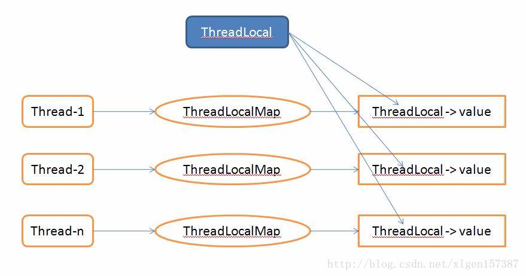

# 1、ThreadLocal

## 1、前提条件

```java
Thread 对象里面保存着
class Thread implements Runnable {
	 ThreadLocal.ThreadLocalMap threadLocals = null;
}
```

```java
ThreadLocalMap从字面上就可以看出这是一个保存ThreadLocal对象的map(其实是以它为Key)，不过是经过了两层包装的ThreadLocal对象：

（1）第一层包装是使用 WeakReference<ThreadLocal<?>> 将ThreadLocal对象变成一个弱引用的对象；

（2）第二层包装是定义了一个专门的类 Entry 来扩展 WeakReference<ThreadLocal<?>>：

static class Entry extends WeakReference<ThreadLocal<?>> {
            /** The value associated with this ThreadLocal. */
            Object value;

            Entry(ThreadLocal<?> k, Object v) {
            // 最终会把 this.referent = k; k 赋值给 referent
                super(k);
                value = v;
            }
        }
```


## 2、ThreadLocal 


### 1、set

```java
java.lang.ThreadLocal#set
public void set(T value) {
        Thread t = Thread.currentThread();
     /**
     ThreadLocal.ThreadLocalMap threadLocals = null;
     	ThreadLocalMap getMap(Thread t) {
        return t.threadLocals;
    	}
     */
     // 获取当前 Thread 里面的 threadLocals
        ThreadLocalMap map = getMap(t);
        if (map != null)
            map.set(this, value);
        else
            createMap(t, value);
    }


```

```java
java.lang.ThreadLocal.ThreadLocalMap#set 
map.set(this, value); 
 private void set(ThreadLocal<?> key, Object value) {

            // We don't use a fast path as with get() because it is at
            // least as common to use set() to create new entries as
            // it is to replace existing ones, in which case, a fast
            // path would fail more often than not.

            Entry[] tab = table;
            int len = tab.length;
     //	根据传入的 ThreadLocal 计算出在 table 的位置
            int i = key.threadLocalHashCode & (len-1);

            for (Entry e = tab[i];
                 e != null;
                 e = tab[i = nextIndex(i, len)]) {
                // 获取 tab[计算出的位置] 的  k
                /*
                public T get() {
                	// 因为 ThreadLocal 最终会被变成一个弱引用
                        return this.referent;
                    }
                */
                ThreadLocal<?> k = e.get();
			// 如果在 table 里面就将其 value 替换
                if (k == key) {
                     private T referent; 
                    e.value = value;
                    return;
                }
			// 如果 在 table 里面找不到就 创建一个 Entry
                if (k == null) {
                   // 取代不新鲜的 Entry
                    replaceStaleEntry(key, value, i);
                    return;
                }
            }
			// 创建一个 新的 Entry
            tab[i] = new Entry(key, value);
            int sz = ++size;
            if (!cleanSomeSlots(i, sz) && sz >= threshold)
                rehash();
        }


```


```java
createMap(t, value);
void createMap(Thread t, T firstValue) {
    // 将 Entry 也就是 值 value 保存在 Thread 自己的 threadLocals 里面
        t.threadLocals = new ThreadLocalMap(this, firstValue);
    }

ThreadLocalMap(ThreadLocal<?> firstKey, Object firstValue) {
    // INITIAL_CAPACITY = 16
    // 创建一个 new Entry 数组
     table = new Entry[INITIAL_CAPACITY];
    //根据传入的 ThreadLocal 计算出位置
     int i = firstKey.threadLocalHashCode & (INITIAL_CAPACITY - 1);
    // 在计算出的位置新建一个 Entry 保存起来
      table[i] = new Entry(firstKey, firstValue);
    // 设置 size 为 1
      size = 1;
    // 设置阈值 
    // threshold = len * 2 / 3; 到了 2/3 的时候就自动扩张
      setThreshold(INITIAL_CAPACITY);
        }
```

```java
总结：
get 方法本质是操作 Thread 的 ThreadLocal.ThreadLocalMap threadLocals = null;
属性，进行获取
ThreadLocalMap 内部维护着一个 
 private Entry[] table;
table 的 key 是通过当前的 ThreadLocal 计算得出的
table 的 Entry 的对象的
key 就是当前 ThreadLocal value 就是 数据

ThreadLocal 获取当前 Thread 的 ThreadLocalMap
Thread 里面有一个 ThreadLocal.ThreadLocalMap
是继承了 弱引用 的 对象.
Map 保存着 Entry table[]；
Entry 的 Key 为操作当前 Thread 的 ThreadLocal 
	value 就是 数据
	而 table[i] 的下标是通过 ThreadLocal 计算出来的
	
也就是说 数据其实都是保存在 Thread 本身里面，使用 Map 的方式保存的
而 Map 的 key 就是当前的 ThreadLocal 对象

```


### 2、get

```java
public T get() {
        Thread t = Thread.currentThread();
    /*
    ThreadLocalMap getMap(Thread t) {
        return t.threadLocals;
    }
    */
        ThreadLocalMap map = getMap(t);
        if (map != null) {
            ThreadLocalMap.Entry e = map.getEntry(this);
            if (e != null) {
                @SuppressWarnings("unchecked")
                T result = (T)e.value;
                // 从 Entry 里面找到就将其返回
                return result;
            }
        }
    // 初始化 Thread 里面的 ThreadLocalMap  
        return setInitialValue();
    }


 private Entry getEntry(ThreadLocal<?> key) {
            int i = key.threadLocalHashCode & (table.length - 1);
            Entry e = table[i];
            if (e != null && e.get() == key)
                return e;
            else
                return getEntryAfterMiss(key, i, e);
        }

如果找不到则调用getEntryAfterMiss（）方法。调用getEntryAfterMiss表示直接散列到的位置没找到，那么顺着hash表递增（循环）地往下找，从i开始，一直往下找，直到出现空的槽为止。
```


## 3、注意要点

### 1、线程池

```
1、为什么要用 ThreadLocalMap 来保存线程局部对象呢？

原因是一个线程拥有的的局部对象可能有很多，这样实现的话，那么不管你一个线程拥有多少个局部变量，都是使用同一个 ThreadLocalMap 来保存的，ThreadLocalMap 中 private Entry[] table 的初始大小是16。超过容量的2/3时，会扩容。
```



```
2、使用线程池要格外注意的一个地方

可以看到，在这个线程中的ThreadLocal变量的值始终是只有一个的，即以前的值被覆盖了的！这里是因为Entry对象是以该ThreadLocal变量的引用为key的，所以多次赋值以前的值会被覆盖，特此注意！

到这里应该可以清楚了的了解Thread、ThreadLocal和ThreadLocalMap之间的关系了！
```


### 2、ThreadLocal的内存回收

```
ThreadLocal 涉及到的两个层面的内存自动回收：
（1）在 ThreadLocal 层面的内存回收：
	当线程死亡时，那么所有的保存在的线程局部变量就会被回收，其实这里是指线程Thread对象中的 ThreadLocal.ThreadLocalMap threadLocals会被回收，这是显然的。
	
（2）ThreadLocalMap 层面的内存回收：
如果线程可以活很长的时间，并且该线程保存的线程局部变量有很多(也就是 Entry 对象很多)，那么就涉及到在线程的生命期内如何回收 ThreadLocalMap 的内存了，不然的话，Entry对象越多，那么ThreadLocalMap 就会越来越大，占用的内存就会越来越多，所以对于已经不需要了的线程局部变量，就应该清理掉其对应的Entry对象。
使用的方式是，Entry对象的key是WeakReference 的包装，当ThreadLocalMap 的 private Entry[] table，已经被占用达到了三分之二时 threshold = 2/3(也就是线程拥有的局部变量超过了10个) ，就会尝试回收 Entry 对象,我们可以看到 ThreadLocalMap.set（）方法中有下面的代码：

 if (!cleanSomeSlots(i, sz) && sz >= threshold)
                rehash();

```

### 3、ThreadLocal可能引起的OOM内存溢出问题简要分析

```
我们知道ThreadLocal变量是维护在Thread内部的，这样的话只要我们的线程不退出，对象的引用就会一直存在。当线程退出时，Thread类会进行一些清理工作，其中就包含ThreadLocalMap，Thread调用exit()方法
```

```
但是，当我们使用线程池的时候，就意味着当前线程未必会退出（比如固定大小的线程池，线程总是存在的）。如果这样的话，将一些很大的对象设置到ThreadLocal中（这个很大的对象实际保存在Thread的threadLocals属性中），这样的话就可能会出现内存溢出的情况。
一种场景就是说如果使用了线程池并且设置了固定的线程，处理一次业务的时候存放到ThreadLocalMap中一个大对象，处理另一个业务的时候，又一个线程存放到ThreadLocalMap中一个大对象，但是这个线程由于是线程池创建的他会一直存在，不会被销毁，这样的话，以前执行业务的时候存放到 ThreadLocalMap 中的对象可能不会被再次使用，但是由于线程不会被关闭，因此无法释放Thread 中的ThreadLocalMap对象，造成内存溢出。

也就是说，ThreadLocal在没有线程池使用的情况下，正常情况下不会存在内存泄露，但是如果使用了线程池的话，就依赖于线程池的实现，如果线程池不销毁线程的话，那么就会存在内存泄露。所以我们在使用线程池的时候，使用ThreadLocal要格外小心！

也就是说，以前的 ThreadLocal 不会再次使用，但是你的 线程的 ThreadLocalMap 里面还保存着 ThreadLocal 的对象，但是 ThreadLocal 再存入 entry 的时候被弱引用包装了，应该会被回收，在 GC 的下一次收集垃圾机制前
```

## 4、 总结

```
通过源代码可以看到每个线程都可以独立修改属于自己的副本而不会互相影响，从而隔离了线程和线程.避免了线程访问实例变量发生安全问题. 同时我们也能得出下面的结论：

（1）ThreadLocal只是操作Thread中的ThreadLocalMap对象的集合；

（2）ThreadLocalMap变量属于线程的内部属性，不同的线程拥有完全不同的ThreadLocalMap变量；

（3）线程中的ThreadLocalMap变量的值是在ThreadLocal对象进行set或者get操作时创建的；

（4）使用当前线程的ThreadLocalMap的关键在于使用当前的ThreadLocal的实例作为key来存储value值；

（5） ThreadLocal模式至少从两个方面完成了数据访问隔离，即纵向隔离(线程与线程之间的ThreadLocalMap不同)和横向隔离(不同的ThreadLocal实例之间的互相隔离)；

（6）一个线程中的所有的局部变量其实存储在该线程自己的同一个map属性中；

（7）线程死亡时，线程局部变量会自动回收内存；

（8）线程局部变量时通过一个 Entry 保存在map中，该Entry 的key是一个 WeakReference包装的ThreadLocal, value为线程局部变量，key 到 value 的映射是通过：ThreadLocal.threadLocalHashCode & (INITIAL_CAPACITY - 1) 来完成的；

（9）当线程拥有的局部变量超过了容量的2/3(没有扩大容量时是10个)，会涉及到ThreadLocalMap中Entry的回收；

对于多线程资源共享的问题，同步机制采用了“以时间换空间”的方式，而ThreadLocal采用了“以空间换时间”的方式。前者仅提供一份变量，让不同的线程排队访问，而后者为每一个线程都提供了一份变量，因此可以同时访问而互不影响。


```

```java
4、你可能会问道，弱引用被回收了只是回收了Entry的key引用，但是Entry应该还是存在的吧？

事情是这样的，我们的ThreadLocal已经帮我们把key为null的Entry清理了，在ThreadLocal的get(),set(),remove()的时候都会清除线程ThreadLocalMap里所有key为null的value。


并不是所有弱引用的对象都会在第二次GC回收的时候被回收，而是回收掉只被弱引用关联的对象。

也就是说 强软弱虚 引用，可以将强引用包装起来
String  str = "aaa";
WeakReference<String> weakRef = new WeakReference<>(str);
// 现在 "aaa" 有两个引用，一个 str强引用 . 一个 weakRef 弱引用。
str = null;
// 现在还有一个 弱引用
weakRef.get();
System.gc();
// 现在 没有引用在引用 "aaa" 了
记得使用 软弱虚引用的时候，一定要先把数据的强引用去除。这样 软弱虚引用 再能发挥相应的作用，因为你 数据的强引用还没去除，GC 怎么也回收不掉数据的。只有你数据强引用去除以后，只有一个软引用的时候，GC 才能去除。

使用方法，比如 List<User> list = new ArrayList<>();
		list.add(...);
	WeakHashMap<Coupan, List<WeakReference<User>>> ...
       
        你只需要去除 list 里面的User的强应用，弱引用会自动去除。
        也就是说 WeakHashMap 里面的 Lsit<User> user 就会自动去除。
```

```
当然出现这几种情况
（1）使用static的ThreadLocal，延长了ThreadLocal的生命周期，可能导致内存泄漏。
（2）分配使用了ThreadLocal又不再调用get(),set(),remove()方法，那么就会导致内存泄漏，因为这块内存一直存在。
```

```
三、为什么使用弱引用，OOM是否是弱引用的锅？
1、从表面上看内存泄漏的根源在于使用了弱引用。网上的文章大多着重分析ThreadLocal使用了弱引用会导致内存泄漏，但是另一个问题也同样值得思考：为什么使用弱引用而不是强引用？

（1）key 使用强引用：引用的ThreadLocal的对象被回收了，但是ThreadLocalMap还持有ThreadLocal的强引用，如果没有手动删除，ThreadLocal不会被回收，导致Entry内存泄漏。

（2）key 使用弱引用：引用的ThreadLocal的对象被回收了，由于ThreadLocalMap持有ThreadLocal的弱引用，即使没有手动删除，ThreadLocal也会被回收。value在下一次ThreadLocalMap调用set、get、remove的时候会被清除。

比较两种情况，我们可以发现：由于ThreadLocalMap的生命周期跟Thread一样长，如果都没有手动删除对应key，都会导致内存泄漏，但是使用弱引用可以多一层保障：弱引用ThreadLocal不会内存泄漏，对应的value在下一次ThreadLocalMap调用set、get、remove的时候会被清除。

因此，ThreadLocal内存泄漏的根源是：由于ThreadLocalMap的生命周期跟Thread一样长，如果没有手动删除对应key就会导致内存泄漏，而不是因为弱引用。

四、ThreadLocal 最佳实践

1、综合上面的分析，我们可以理解ThreadLocal内存泄漏的前因后果，那么怎么避免内存泄漏呢？

答案就是：每次使用完ThreadLocal，都调用它的remove()方法，清除数据。

在使用线程池的情况下，没有及时清理ThreadLocal，不仅是内存泄漏的问题，更严重的是可能导致业务逻辑出现问题。所以，使用ThreadLocal就跟加锁完要解锁一样，用完就清理。
```


