# 第一章 并发编程的挑战

```
并发编程的目的是为了让程序运行的更快，但是，并不是启动更多的线程就能让程序最大限度地并发执行。在进行并发编程时，如果希望通过多线程执行任务让程序运行得更快，会
面临非常多的挑战，比如上下文切换的问题、死锁的问题，以及受限于硬件和软件的资源限制问题，本章会介绍几种并发编程的挑战以及解决方案。
```

## 1.1 上下文切换

```
即使是单核处理器也支持多线程执行代码，CPU通过给每个线程分配CPU时间片来实现
这个机制。时间片是CPU分配给各个线程的时间，因为时间片非常短，所以CPU通过不停地切换线程执行，让我们感觉多个线程是同时执行的，时间片一般是几十毫秒（ms）。

CPU通过时间片分配算法来循环执行任务，当前任务执行一个时间片后会切换到下一个
任务。但是，在切换前会保存上一个任务的状态，以便下次切换回这个任务时，可以再加载这个任务的状态。所以任务从保存到再加载的过程就是一次上下文切换。

这就像我们同时读两本书，当我们在读一本英文的技术书时，发现某个单词不认识，于是
便打开中英文字典，但是在放下英文技术书之前，大脑必须先记住这本书读到了多少页的第多少行，等查完单词之后，能够继续读这本书。这样的切换是会影响读书效率的，同样上下文切换也会影响多线程的执行速度。
```


# 1、 Volatile

内存屏障列表

| 屏障类型            | 指令示例                 | 说明                                                         |
| ------------------- | ------------------------ | ------------------------------------------------------------ |
| LoadLoad Barriers   | Load1;LoadLoad;Load2     | 确保Load1数据的装载先于Load2及所有后续装载指令的装载         |
| StoreStore Barriers | Store1;StoreStore;Store2 | 确保Store1数据对其他处理器可见(刷新到内存)先于Store2及所有后续存储指令的存储 |
| LoadStore Barriers  | Load1;LoadStore;Store2   | 数据装载先于Store                                            |
| StoreLoad Barriers  | Store1;StoreLoad;Load2   | 会等该屏障之前的所有内存访问指令(存储和装载指令)完成之后，才执行该屏障之后的内存访问指令 |

```java
class VolatileBarrierExample {
    int a;
    volatile int v1 = 1;
    volatile int v2 = 2;
    void readAndWrite() {
        int i = v1;
        int j = v2;
        a = i + j;
        v1 = i + 1;
        v2 = j * 2;
    }
}
```

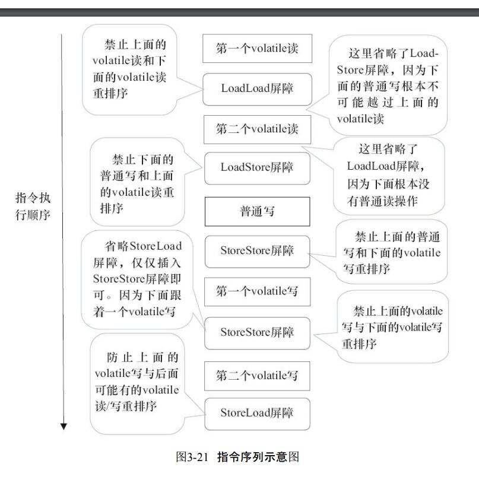

```
volatile写后面的StoreLoad屏障。此屏障的作用是避免volatile写与
后面可能有的volatile读/写操作重排序。因为编译器常常无法准确判断在一个volatile写的后面
是否需要插入一个StoreLoad屏障（比如，一个volatile写之后方法立即return）。为了保证能正确
实现volatile的内存语义，JMM在采取了保守策略：在每个volatile写的后面，或者在每个volatile
读的前面插入一个StoreLoad屏障。从整体执行效率的角度考虑，JMM最终选择了在每个
volatile写的后面插入一个StoreLoad屏障。因为volatile写-读内存语义的常见使用模式是：一个
写线程写volatile变量，多个读线程读同一个volatile变量。当读线程的数量大大超过写线程时，
选择在volatile写之后插入StoreLoad屏障将带来可观的执行效率的提升。从这里可以看到JMM
在实现上的一个特点：首先确保正确性，然后再去追求执行效率。

```

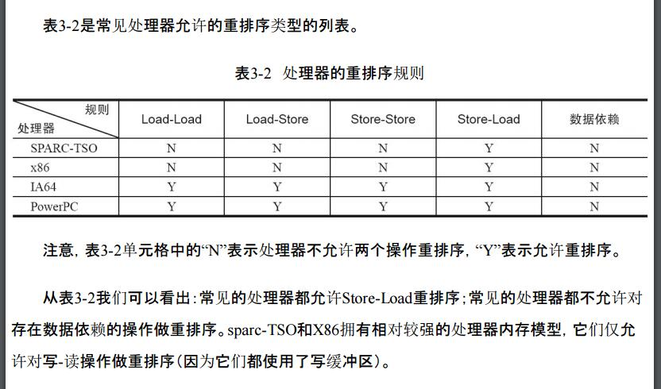


```
由于现代的处理器都会使用写缓冲区，因此现代的处理器都会允许对写-读操作进行重排序。

int a = 0;
int b = 0;
void fun1() {
    a = 2;
  	b = a;
}

因为写操作可以先将 a = 2 写入 缓存，然后从 主存读 a b=a，
最后先将 b 写回 主存， b 还是 0;
```


```
现代的处理器使用写缓冲区临时保存向内存写入的数据。写缓冲区可以保证指令流水线
持续运行，它可以避免由于处理器停顿下来等待向内存写入数据而产生的延迟。同时，通过以批处理的方式刷新写缓冲区，以及合并写缓冲区中对同一内存地址的多次写，减少对内存总线的占用。虽然写缓冲区有这么多好处，但每个处理器上的写缓冲区，仅仅对它所在的处理器可见。这个特性会对内存操作的执行顺序产生重要的影响：处理器对内存的读/写操作的执行顺序，不一定与内存实际发生的读/写操作顺序一致！
```

# 2、Final

## final 基础类型

```
1、Final 域的重排序规则可以确保：：在对象引用为任意线程可见之前，对象的final域已经被正确初始化过了，而普通域不具有这个保障。
```

读final域的重排序规则 

```
读final域的重排序规则是，在一个线程中，初次读对象引用与初次读该对象包含的final域，JMM禁止处理器重排序这两个操作（注意，这个规则仅仅针对处理器）。编译器会在读final域操作的前面插入一个LoadLoad屏障。
```

```
读final域的重排序规则可以确保：在读一个对象的final域之前，一定会先读包含这个final
域的对象的引用。在这个示例程序中，如果该引用不为null，那么引用对象的final域一定已经
被A线程初始化过了。
```

## final 引用类型

```
在构造函数内对一个final引用的对象的成员域
的写入，与随后在构造函数外把这个被构造对象的引用赋值给一个引用变量，这两个操作之
间不能重排序。
```

final引用不能从构造函数内“溢出” 

```java
// final引用不能从构造函数内“逸出”

public class Finalxxx {
    final int i;
	static Finalxxx f;
    // 这个就是溢出
    public Finalxxx() {
        i = 1; // 写 final 域
        f = this;// this 引用在此 "逸出"
    }
}
```

```
在构造函数返回前，被构造对象的引用不能为其他线程所见，因为此时的 final 域可能还没有被初始化。在构造函数返回后，任意线程都将保证能看到final域正确初始化之后的值。
```

```
1）在构造函数内对一个final域的写入，与随后把这个被构造对象的引用赋值给一个引用
变量，这两个操作之间不能重排序。

2）初次读一个包含final域的对象的引用，与随后初次读这个final域，这两个操作之间不能重排序。


```


```
final语义在处理器中的实现

写final域的重排序规则会要求编译器在final域的写之后，构造函数return
之前插入一个StoreStore障屏。读final域的重排序规则要求编译器在读final域的操作前面插入
一个LoadLoad屏障

由于X86处理器不会对写-写操作做重排序，所以在X86处理器中，写final域需要的
StoreStore障屏会被省略掉。同样，由于X86处理器不会对存在间接依赖关系的操作做重排序，
所以在X86处理器中，读final域需要的LoadLoad屏障也会被省略掉。也就是说，在X86处理器
中，final域的读/写不会插入任何内存屏障！
```

JSR-133为什么要增强final的语义 

```
在旧的Java内存模型中，一个最严重的缺陷就是线程可能看到final域的值会改变。比如，一个线程当前看到一个整型final域的值为0（还未初始化之前的默认值），过一段时间之后这个线程再去读这个final域的值时，却发现值变为1（被某个线程初始化之后的值）。最常见的例子就是在旧的Java内存模型中，String的值可能会改变。

为了修补这个漏洞，JSR-133专家组增强了final的语义。通过为final域增加写和读重排序规则，可以为Java程序员提供初始化安全保证：只要对象是正确构造的（被构造对象的引用在构造函数中没有“逸出”），那么不需要使用同步（指lock和volatile的使用）就可以保证任意线程都能看到这个final域在构造函数中被初始化之后的值。
```

```

```


# 3、happens-before的定义 

```
1）如果一个操作happens-before另一个操作，那么第一个操作的执行结果将对第二个操作可见，而且第一个操作的执行顺序排在第二个操作之前。
2）两个操作之间存在happens-before关系，并不意味着Java平台的具体实现必须要按照
happens-before关系指定的顺序来执行。如果重排序之后的执行结果，与按happens-before关系
来执行的结果一致，那么这种重排序并不非法（也就是说，JMM允许这种重排序）。

上面的1）
是JMM对程序员的承诺。从程序员的角度来说，可以这样理解happens-before关系：如果A happens-before B，那么Java内存模型将向程序员保证——A操作的结果将对B可见，且A的执行顺序排在B之前。注意，这只是Java内存模型向程序员做出的保证！
上面的2）
是JMM对编译器和处理器重排序的约束原则。正如前面所言，JMM其实是在遵
循一个基本原则：只要不改变程序的执行结果（指的是单线程程序和正确同步的多线程程序），编译器和处理器怎么优化都行。JMM这么做的原因是：程序员对于这两个操作是否真的被重排序并不关心，程序员关心的是程序执行时的语义不能被改变（即执行结果不能被改变）。因此，happens-before关系本质上和as-if-serial语义是一回事。

```


# 第三章 并发编程的挑战

## 1、Java内存模型的基础 


### 1、从源代码到指令序列的重排序 

```
在执行程序时，为了提高性能，编译器和处理器常常会对指令做重排序。
1、编译器的重排序
2、指令集平行的重排序
	现代处理器采用了指令级并行技术（Instruction-LevelParallelism，ILP）来将多条指令重叠执行。如果不存在数据依赖性，处理器可以改变语句对应机器指令的执行顺序。

3、内存系统的重排序
	由于处理器使用缓存和读/写缓冲区，这使得加载和存储操作看上去可能是在乱序执行。

```

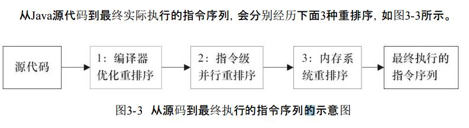

```
上述的1属于编译器重排序，2和3属于处理器重排序。这些重排序可能会导致多线程程序
出现内存可见性问题。对于编译器，JMM的编译器重排序规则会禁止特定类型的编译器重排序（不是所有的编译器重排序都要禁止）。对于处理器重排序，JMM的处理器重排序规则会要求Java编译器在生成指令序列时，插入特定类型的内存屏障（Memory Barriers，Intel称之为Memory Fence）指令，通过内存屏障指令来禁止特定类型的处理器重排序。
```

```
JMM 属于语言级的内存模型，它确保在不同的编译器和不同的处理器平台之上，通过禁止特定类型的编译器重排序和处理器重排序，为程序员提供一致的内存可见性保证。
```

### 2、并发编程模型的分类

```
现代的处理器使用写缓冲区临时保存向内存写入的数据。写缓冲区可以保证指令流水线的持续运行。他可以避免由于处理器停顿下来等待向内存写入数据而产生的延迟。同时，通过以批处理的方式刷新缓冲区，以及合并写缓冲区中对同一内存的多次写，减少对内存总线的占用。
虽然写缓冲区有这么多好处，但每个处理器上的写缓冲区，仅仅对它所在的处理器可见。这个特性会对内存操作的执行顺序产生重要的影响：处理器对内存的读/写操作的执行顺序，不一定与内存实际发生的读/写操作顺序一致！
```

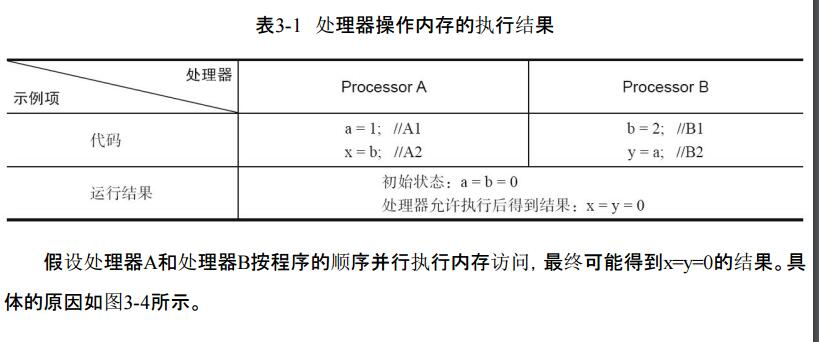

```
A : A1 为 a 赋值 a = 1;刷入写缓存	B : B1 为 b 赋值 b = 2;刷入写缓存
    A2 从主存中读取 x = b; 			 B2 从主存中读取 y = a; 
    A3将缓存a刷入主存					B3将缓存b刷入主存
    
    这样就导致了 x = y = 0;
```

```
这里处理器A和处理器B可以同时把共享变量写入自己的写缓冲区（A1，B1），然后从内存
中读取另一个共享变量（A2，B2），最后才把自己写缓存区中保存的脏数据刷新到内存中（A3，B3）。当以这种时序执行时，程序就可以得到x=y=0的结果。
从内存操作实际发生的顺序来看，直到处理器A执行A3来刷新自己的写缓存区，写操作
A1才算真正执行了。虽然处理器A执行内存操作的顺序为：A1→A2，但内存操作实际发生的顺序却是A2→A1。此时，处理器A的内存操作顺序被重排序了（处理器B的情况和处理器A一样，这里就不赘述了）。
```

```
这里的关键是，由于写缓冲区仅对自己的处理器可见，它会导致处理器执行内存操作的
顺序可能会与内存实际的操作执行顺序不一致。由于现代的处理器都会使用写缓冲区，因此
现代的处理器都会允许对写-读操作进行重排序。
```


```
Store-Load 可以重排序，是因为 实际上不可以，但是处理器将 store 刷到了写缓存中，然后从 主存中 load 数据。最后再将 store 刷新到缓存。
其实本质上顺序还是没变，但是由于你数据在写缓存里面，所以
对于主存来说你是 先 load 然后 Store 的。
```

```
为了保证内存可见性，Java编译器在生成指令序列的适当位置会插入内存屏障指令来禁
止特定类型的处理器重排序。JMM把内存屏障指令分为4类，如表3-3所示。
```

内存屏障列表

| 屏障类型            | 指令示例                 | 说明                                                         |
| ------------------- | ------------------------ | ------------------------------------------------------------ |
| LoadLoad Barriers   | Load1;LoadLoad;Load2     | 确保Load1数据的装载先于Load2及所有后续装载指令的装载         |
| StoreStore Barriers | Store1;StoreStore;Store2 | 确保Store1数据对其他处理器可见(刷新到内存)先于Store2及所有后续存储指令的存储 |
| LoadStore Barriers  | Load1;LoadStore;Store2   | 数据装载先于Store                                            |
| StoreLoad Barriers  | Store1;StoreLoad;Load2   | 会等该屏障之前的所有内存访问指令(存储和装载指令)完成之后，才执行该屏障之后的内存访问指令 |

```
硬件层的内存屏障：Load Barrier 和 Store Barrier

作用：阻止屏障两侧的指令重排序；

强制把写缓冲区/高速缓存中的脏数据等写回主内存，让缓存中相应的数据失效。

对于Load Barrier来说，在指令前插入Load Barrier，可以让高速缓存中的数据失效，强制从新从主内存加载数据；

对于Store Barrier来说，在指令后插入Store Barrier，能让写入缓存中的最新数据更新写入主内存，让其他线程可见。
```


```
storestore
	为了让后面 store 看见 前面的 store 。也就是说 前面的 store 必须先刷新进主存，后面的 store 才能看见
```

```
storeLoad
	为了让 store 能被后面的 Load 看见，必须将 store 刷新进主存，
	还要让后面的 load 从主存读取(让缓存失效)。
```

```
LoadStore 
	为了让后面的 store 能看见前面的 load. 必须让前面的 load 在  store 之后。其实没有什么用，防止了重排序。
```

```
LoadLoad 
	为了让后面的 laod 可以看见前面的 load ,也没什么关系。就是防止重排序。
```

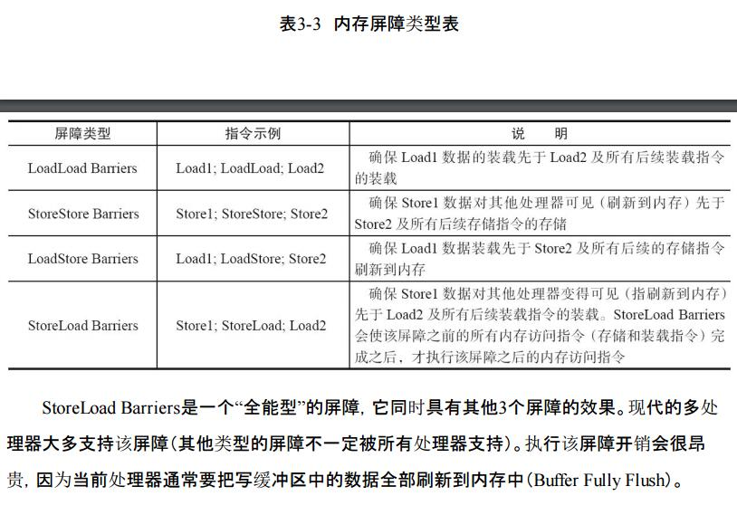


### 3、happens-before 简介

```
如果一个操作执行的结果需要对另一个操作可见，那么这两个操作之间必须要存在happens-before关系。

程序顺序规则：一个线程中的每个操作，happens-before于该线程中的任意后续操作。
监视器锁规则：对一个锁的解锁，happens-before于随后对这个锁的加锁。
volatile变量规则：对一个volatile域的写，happens-before于任意后续对这个volatile域的读。
传递性：如果A happens-before B，且B happens-before C，那么A happens-before C。


```

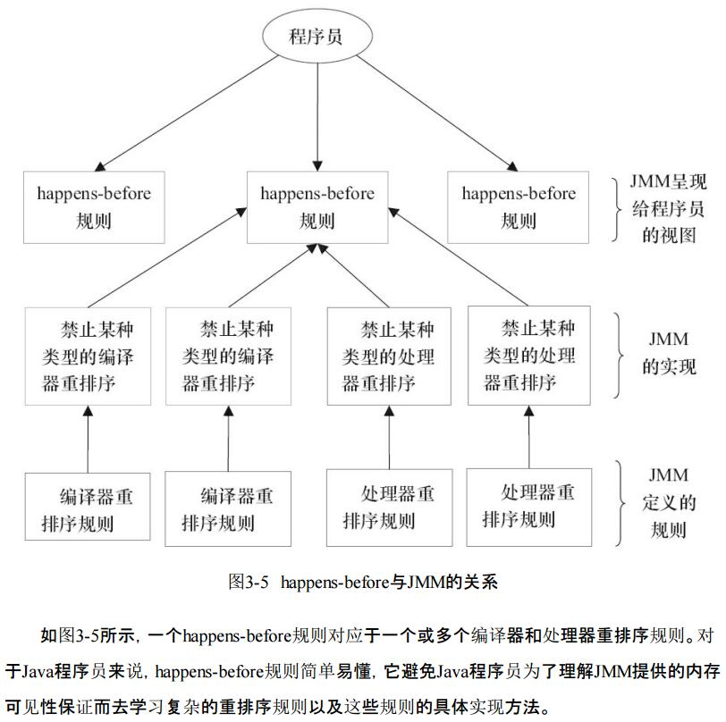


## 2、重排序

```
重排序是指编译器和处理器为了优化程序性能而对指令序列进行重新排序的一种手段。
```

### 1、数据依赖性

```
如果两个操作访问同一个变量，且这两个操作中有一个为写操作，此时这两个操作之间
就存在数据依赖性。数据依赖分为下列3种类型，如表3-4所示。

如果两个操作访问同一个变量，且两个操作有一个写操作，那么这两个操作之间就存在数据依赖性
```

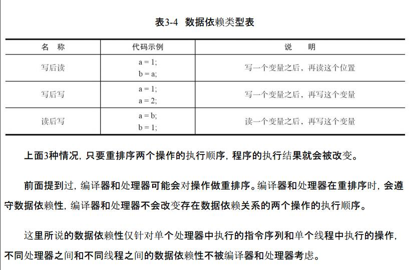

### 2 as-if-serial语义 

```
不管怎么重排序（编译器和处理器为了提高并行度），（单线程）
程序的执行结果不能被改变。编译器、runtime和处理器都必须遵守as-if-serial语义。
```

```
在计算机中，软件技术和硬件技术有一个共同的目标：在不改变程序执行结果的前提下，
尽可能提高并行度。编译器和处理器遵从这一目标，从happens-before的定义我们可以看出，
JMM同样遵从这一目标。
```

## 3、 顺序一致性

```
顺序一致性内存模型是一个理论参考模型，在设计的时候，处理器的内存模型和编程语
言的内存模型都会以顺序一致性内存模型作为参照.
```

### 1、 数据竞争与顺序一致性 

```
顺序一致性内存模型是一个被计算机科学家理想化了的理论参考模型，它为程序员提供
了极强的内存可见性保证。顺序一致性内存模型有两大特性。
1）一个线程中的所有操作必须按照程序的顺序来执行。

2）（不管程序是否同步）所有线程都只能看到一个单一的操作执行顺序。在顺序一致性内存模型中，每个操作都必须原子执行且立刻对所有线程可见。
```

### 2、 未同步程序的执行特性 

```
对于未同步或未正确同步的多线程程序，JMM只提供最小安全性：线程执行时读取到的
值，要么是之前某个线程写入的值，要么是默认值（0，Null，False），JMM保证线程读操作读取到的值不会无中生有（Out Of Thin Air）的冒出来。为了实现最小安全性，JVM在堆上分配对象时，首先会对内存空间进行清零，然后才会在上面分配对象（JVM内部会同步这两个操作）。因此，在已清零的内存空间（Pre-zeroed Memory）分配对象时，域的默认初始化已经完成了。

```

### 3、总线事务

 ```
在计算机中，数据通过总线在处理器和内存之间传递。每次处理器和内存之间的数据传递都是通过一系列步骤来完成的，这一系列步骤称之为总线事物(Bus Transaction).总线事物包括读事务(Read Transaction)和写事务(Write Transaction).
读事务从 内存 传送数据到 处理器。
写事务从 处理器 传送数据到 内存。
每个事务会读/写内存中一个或多个物理上连续的字。
这里的关键是，总线会同步试图并发使用总线的事物。
在一个处理器执行总线事务期间，总线会禁止其他的处理器和I/O设备执行内存的读/写。
 ```

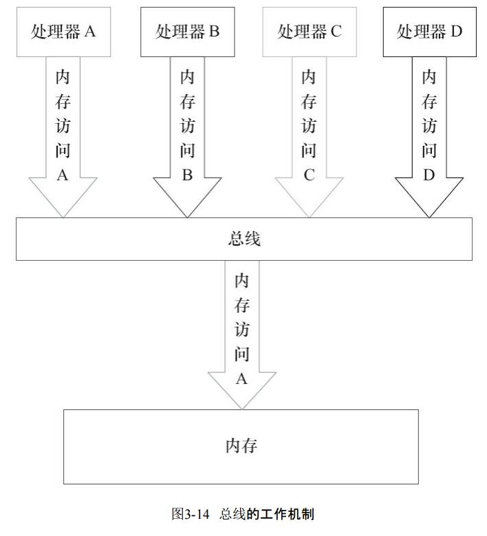


```
由图可知，假设处理器A，B和C同时向总线发起总线事务，这时总线仲裁会对竞争做出裁决，这里假设总线在仲裁后判定处理器A在竞争中获胜（总线仲裁会确保所有处理器都能公平的访问内存）。
此时处理器A继续它的总线事务，而其他两个处理器则要等待处理器A的总线事务完成后才能再次执行内存访问。
假设在处理器A执行总线事务期间（不管这个总线事务是读事务还是写事务），处理器D向总线发起了总线事务，此时处理器D的请求会被总线禁止。

```

```
总线的这些工作机制可以吧所有处理器对内存的访问以串行化的方式来执行。在任意时间点，最多只能有一个处理器可以访问内存。这个特征确保了单个总线事务之中的内存读/写操作具有原子性。
```


## 4、volatile 的内存语义

```
volatile 语义
当读一个volatile变量时，JMM会把该线程对应的本地内存置为无效。线程接下来将从主
内存中读取共享变量。
```


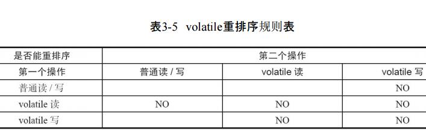

```
举例来说，第三行最后一个单元格的意思是：在程序中，当第一个操作为普通变量的读或
写时，如果第二个操作为volatile写，则编译器不能重排序这两个操作。 
```


```
为了实现volatile的内存语义，编译器在生成字节码时，会在指令序列中插入内存屏障来
禁止特定类型的处理器重排序。对于编译器来说，发现一个最优布置来最小化插入屏障的总
数几乎不可能。为此，JMM采取保守策略。下面是基于保守策略的JMM内存屏障插入策略。

在每个 volatile 写操作的前面插入一个 StoreStore 屏障
在每个 volatile 写操作的后面插入一个 StoreLoad 屏障
在每个 volatile 读操作的后面插入一个 LoadLoad 屏障
在每个 volatile 读操作的后面插入一个 LoadStore 屏障

只要不改变volatile写-读的内存语义，编译器可以根据具体情况省略不必要的屏障。
```

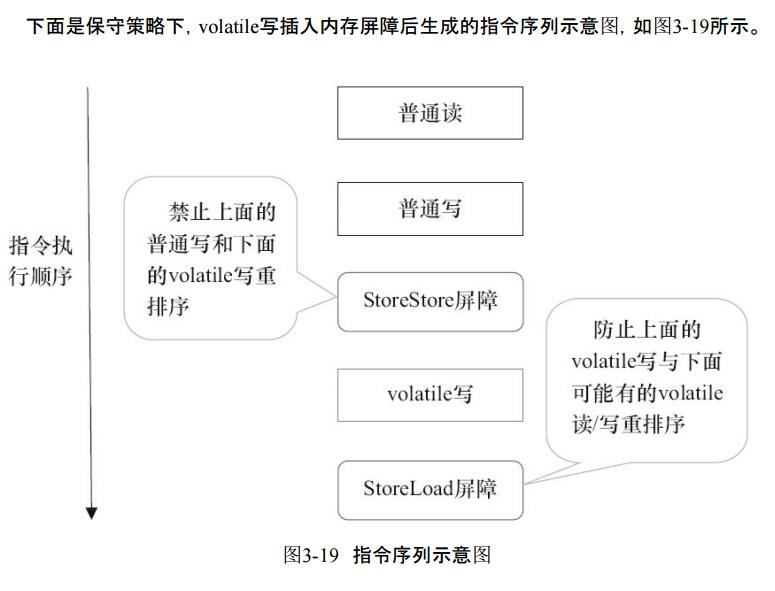

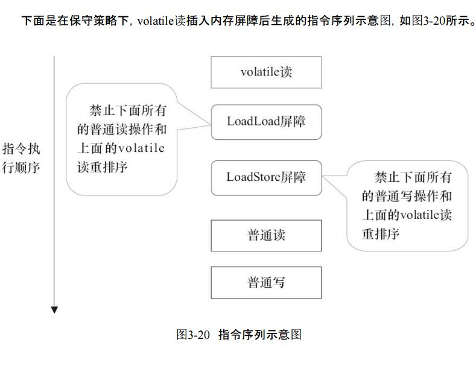

```java
class VolatileBarrierExample {
    int a;
    volatile int v1 = 1;
    volatile int v2 = 2;
    void readAndWrite() {
        int i = v1; // 第一个 volatile 读操作
        int j = v2; // 第二个 volatile 读操作
        a = i + j; // 普通写操作   
        v1 = i + 1; // 第一个 volatile 写操作 
        v2 = j * 2; // 第二个 volatile 写操作 
    }
}       
```

​                                      


```
注意，最后的StoreLoad屏障不能省略。因为第二个volatile写之后，方法立即return。此时编译器可能无法准确断定后面是否会有volatile读或写，为了安全起见，编译器通常会在这里插入一个StoreLoad屏障。
```

```
上面的优化针对任意处理器平台，由于不同的处理器有不同"松紧度"的处理器内存模型，内存屏障的插入还可以根据具体的处理器内存模型继续优化。
前文提到过，X86处理器仅会对写-读操作做重排序。X86不会对读-读、读-写和写-写操作做重排序，因此在X86处理器中会省略掉这3种操作类型对应的内存屏障。在X86中，JMM仅需在volatile写后面插入一个StoreLoad屏障即可正确实现volatile写-读的内存语义。这意味着在X86处理器中，volatile写的开销比volatile读的开销会大很多（因为执行StoreLoad屏障开销会比较大）。


上面的会被优化成下图
```

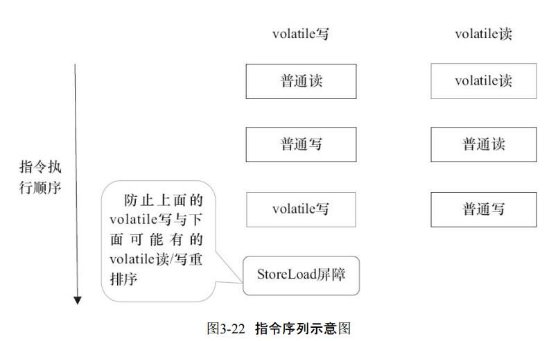


## 5、锁的内存语义

```
当线程释放锁时，JMM会把该线程对应的本地内存中的共享变量刷新到主内存中

当线程获取锁时，JMM会把该线程对应的本地内存置为无效。从而使得被监视器保护的
临界区代码必须从主内存中读取共享变量。

对比锁释放-获取的内存语义与volatile写-读的内存语义可以看出：锁释放与volatile写有相同的内存语义；锁获取与volatile读有相同的内存语义。
```

```
JDK文档对该方法的说明如下：如果当前状态值等于预期值，则以原子方式将同步状态
设置为给定的更新值。此操作具有volatile读和写的内存语义。
```

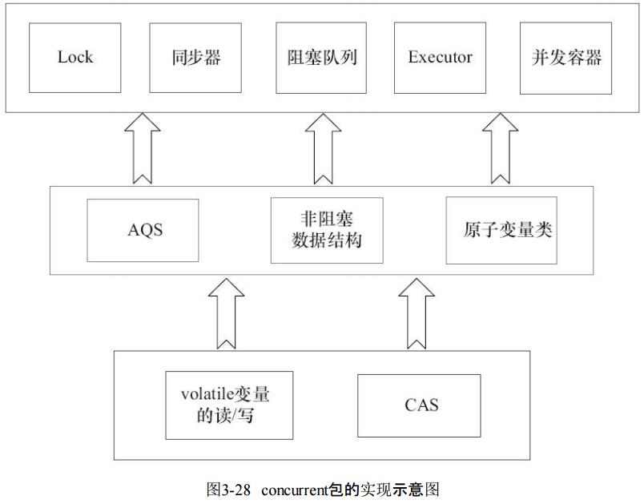

## 6、final域的内存语义 

```
1）在构造函数内对一个final域的写入，与随后把这个被构造对象的引用赋值给一个引用
变量，这两个操作之间不能重排序。

2）初次读一个包含final域的对象的引用，与随后初次读这个final域，这两个操作之间不能重排序。
```

### 1、 写final域的重排序规则 

```
1）JMM禁止编译器把final域的写重排序到构造函数之外。
2）编译器会在final域的写之后，构造函数return之前，插入一个StoreStore屏障。这个屏障
禁止处理器把final域的写重排序到构造函数之外。
```

### 2、读final域的重排序规则 

```
在一个线程中，初次读对象引用与初次读该对象包含的final域，JMM禁止处理器重排序这两个操作（注意，这个规则仅仅针对处理器）。编译器会在读 final 域操作的前面插入一个LoadLoad屏障。
```

```
初次读对象引用与初次读该对象包含的final域，这两个操作之间存在间接依赖关系。由于编译器遵守间接依赖关系，因此编译器不会重排序这两个操作。

大多数处理器也会遵守间接依赖，也不会重排序这两个操作。但有少数处理器允许对存在间接依赖关系的操作做重排序（比如alpha处理器），这个规则就是专门用来针对这种处理器的。
```

```
读final域的重排序规则可以确保：在读一个对象的final域之前，一定会先读包含这个final域的对象的引用。在这个示例程序中，如果该引用不为null，那么引用对象的final域一定已经被A线程初始化过了。 
```

### 3、final域为引用类型 

```
于引用类型，写final域的重排序规则对编译器和处理器增加了如下约束：
在构造函数内对一个final引用的对象的成员域的写入，与随后在构造函数外把这个被构造对象的引用赋值给一个引用变量，这两个操作之间不能重排序。

```

### 4、final引用不能从构造函数内“溢出” 

```java
// final引用不能从构造函数内“逸出”

public class Finalxxx {
    final int i;
	static Finalxxx f;
    // 这个就是溢出
    public Finalxxx() {
        i = 1; // 写 final 域
        f = this;// this 引用在此 "逸出"
    }
}
```

```
在构造函数返回前，被构造对象的引用不能为其他线程所见，因为此时的 final 域可能还没有被初始化。在构造函数返回后，任意线程都将保证能看到final域正确初始化之后的值。

因为 final 写操作，会在 constructor return 插入 StoreStore 所以你在 constructor 之前就吧 this 泄露出来，没有被 StoreStore 屏蔽到。这样 final 内存语义就被破坏了。
```

### 5、 final 语义在处理器的实现

```
现在我们以X86处理器为例，说明final语义在处理器中的具体实现。

上面我们提到，写 Final 域的重排序规则会要求编译器在 final 域的写之后，构造函数 return 之前插入一个 StoreStore 屏障。

读 final 域的重排序规则要求编译器在读final域的操作前面插入一个LoadLoad屏障。
```

## 7、JMM的设计 

```
首先，让我们来看JMM的设计意图。从JMM设计者的角度，在设计JMM时，需要考虑两个
关键因素。

·程序员对内存模型的使用。程序员希望内存模型易于理解、易于编程。程序员希望基于
一个强内存模型来编写代码。

·编译器和处理器对内存模型的实现。编译器和处理器希望内存模型对它们的束缚越少越
好，这样它们就可以做尽可能多的优化来提高性能。编译器和处理器希望实现一个弱内存模型。
```

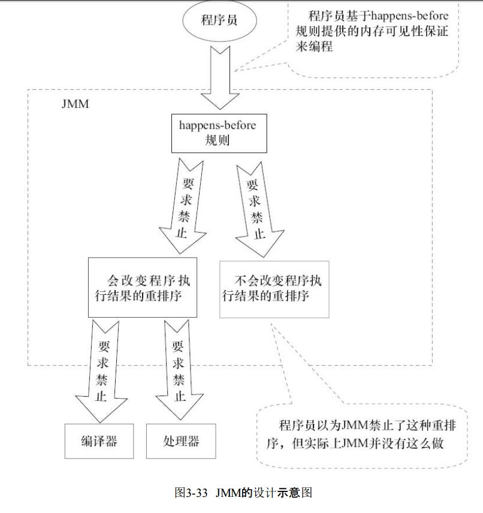

```
·JMM向程序员提供的happens-before规则能满足程序员的需求。
JMM的happens-before规则不但简单易懂，而且也向程序员提供了足够强的内存可见性保证（有些内存可见性保证其实并不一定真实存在，比如上面的A happens-before B）。

·JMM对编译器和处理器的束缚已经尽可能少。

从上面的分析可以看出，JMM其实是在遵循一个基本原则：
只要不改变程序的执行结果（指的是单线程程序和正确同步的多线程程序），编译器和处理器怎么优化都行。例如，如果编译器经过细致的分析后，认定一个锁只会被单个线程访问，那么这个锁可以被消除。再如，如果编译器经过细致的分析后，认定一个volatile变量只会被单个线程访问，那么编译器可以把这个volatile变量当作一个普通变量来对待。这些优化既不会改变程序的执行结果，又能提高程序的执行效率。
```


## 8、类的初始化

```java
// 内存初始化
memory = allocate(); // 1：分配对象的内存空间
instance = memory; // 3：设置instance指向刚分配的内存地址
// 注意，此时对象还没有被初始化！
ctorInstance(memory); // 2：初始化对象

/**
	一个对象的初始化可能对被重排序。可能先将引用指向了刚分配的内存地址。
	而对象还没有初始化，但是默认的初始化早就初始化好了
*/
```

```
jvm 在类的初始化阶段(即在 Class 被加载后，且被线程使用之前)，会执行类的初始化。在执行类的初始化期间，JVM 会去获取一个锁。这个锁可以同步多个线程对同一个类的初始化。
```

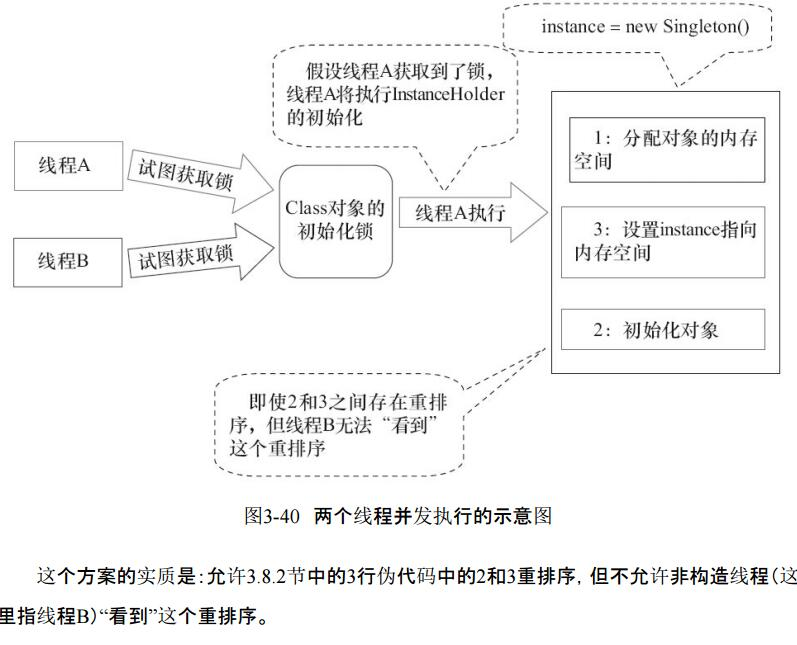

```
这个方案的实质是：允许3.8.2节中的3行伪代码中的2和3重排序，但不允许非构造线程（这里指线程B）“看到”这个重排序。

初始化一个类，包括执行这个类的静态初始化和初始化在这个类中声明的静态字段。根据java 语言规范，在首次发生下列任意一种情况时，一个类或接口类型T将被立即初始化。

1）T是一个类，而且一个T类型的实例被创建。
2）T是一个类，且T中声明的一个静态方法被调用。
3）T中声明的一个静态字段被赋值。
4）T中声明的一个静态字段被使用，而且这个字段不是一个常量字段。
5）T是一个顶级类（Top Level Class，见Java语言规范的§7.6），而且一个断言语句嵌套在T内部被执行。
```

```
在InstanceFactory示例代码中，首次执行getInstance()方法的线程将导致InstanceHolder类被初始化（符合情况4）。
```

```
由于java语言是多线程的，多个线程可能在同一时间尝试去初始化同一个类或接口(比如这里多个线程可能在同一时刻调用 getInstance()方法来初始化 InstanceHolder类)。因此，在java 中初始化一个类或者接口时，需要做细致的同步处理。
```

```
java 语言规范规定，对于每一个类或接口C，都有一个唯一的初始化锁LC与之对应。从C到LC的映射，有JVM具体实现去自由实现。JVM在类初始化期间会获取这个初始化锁，并且每个线程至少获取一次锁来确保这个类已经被初始化过了。
```

```
对于类或者接口的初始化，java 语言规范制定了精巧而复杂的类初始化处理过程。java 初始化一个类或者接口的处理过程如下:
```


第一阶段：

```
通过在 Class 对象上同步(即获取 Class 对象的初始化锁)，来控制类或接口的初始化。这个获取锁的线程会一直等待，直到当前线程能够获取到这个初始化锁。
```

```
假设Class对象当前还没有被初始化（初始化状态state，此时被标记为state=noInitialization），且有两个线程A和B试图同时初始化这个Class对象。图3-41是对应的示意图。
```

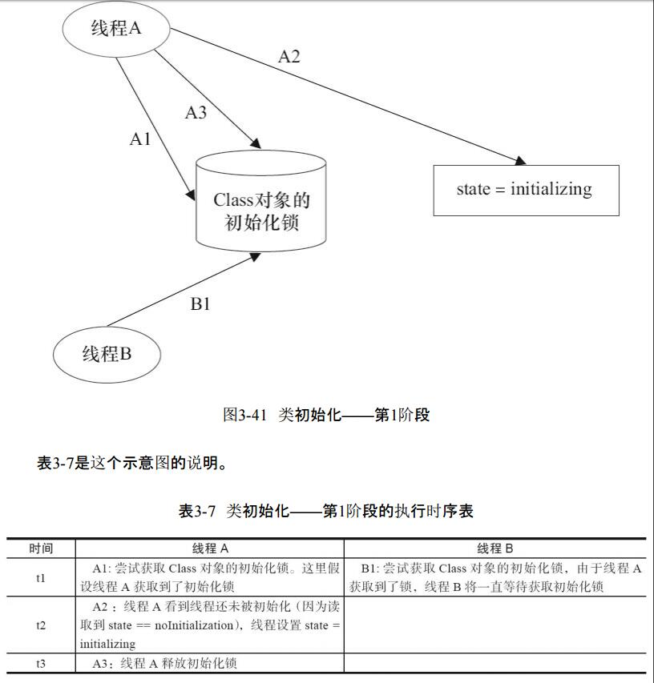

| 时间 | 线程A                                                        | 线程B                                                        |
| ---- | ------------------------------------------------------------ | ------------------------------------------------------------ |
| t1   | A1:尝试获取Class 对象的初始化锁。这里假设线程A获取到了初始化锁 | B1:尝试获取Class 对象的初始化锁，由于线程A获取到了锁，线程B将一直等待获取初始化锁 |
| t2   | A2:线程A看到了线程还未被初始化(因为读取到 state = noInitialization),线程设置 state= initalizing |                                                              |
| t3   | A3:线程A释放初始化锁                                         |                                                              |

```
初始化状态为 state=noInitialization  还没有初始化
争夺初始化锁，得到的去将 state 变为 initializing 。
```


第2阶段：

```
线程A执行类的初始化，同时线程B在初始化锁对应的condition上等待。
```

| 时间 | 线程A                                           | 线程B                            |
| ---- | ----------------------------------------------- | -------------------------------- |
| t1   | A1:执行类的静态初始化和初始化类中声明的静态字段 | B1:获取到初始化锁                |
| t2   |                                                 | B2:读取到state = initializing    |
| t3   |                                                 | B3:释放初始化锁                  |
| t4   |                                                 | B4:在初始化锁的 condition 中等待 |

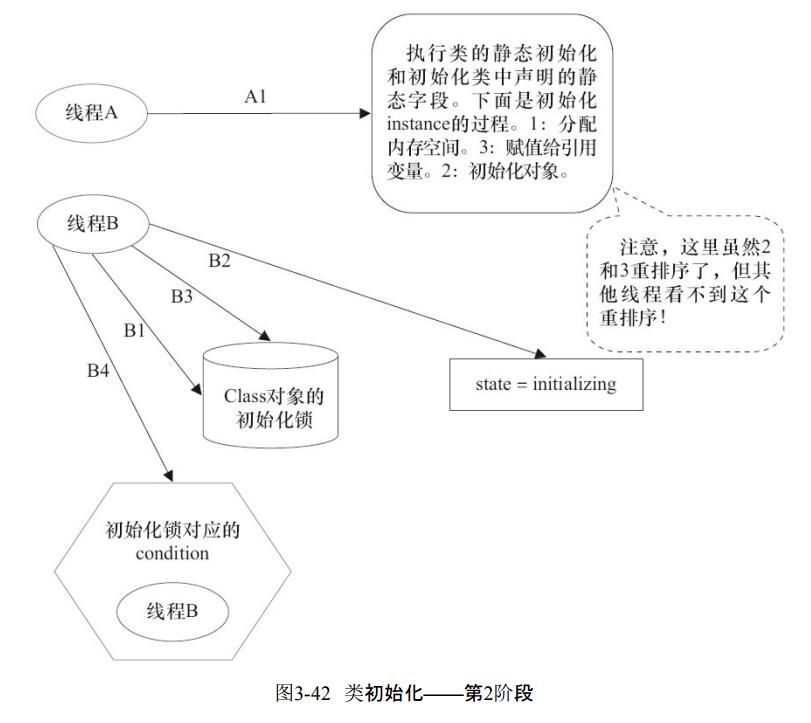

第三阶段：

```
线程A设置state=initalized,然后唤醒在Condition 中等待的所有线程。
```

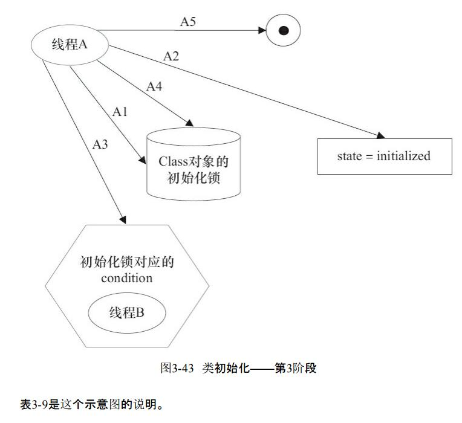

```
线程A在第2阶段的A1执行类的初始化，并在第3阶段的A4释放初始化锁；线程B在第4阶
段的B1获取同一个初始化锁，并在第4阶段的B4之后才开始访问这个类。

根据Java内存模型规范的锁规则，这里将存在如下的happens-before关系。
这个happens-before关系将保证：
线程A执行类的初始化时的写入操作（执行类的静态初始化和初始化类中声明的静态字段），线程B一定能看到。


这里的condition和state标记是本文虚构出来的。Java语言规范并没有硬性规定一
定要使用condition和state标记。JVM的具体实现只要实现类似功能即可。

注意 Java语言规范允许Java的具体实现，优化类的初始化处理过程（对这里的第5阶
段做优化），具体细节参见Java语言规范的12.4.2节。
```

```
通过对比基于volatile的双重检查锁定的方案和基于类初始化的方案，我们会发现基于类
初始化的方案的实现代码更简洁。
但基于volatile的双重检查锁定的方案有一个额外的优势：
除了可以对静态字段实现延迟初始化外，还可以对实例字段实现延迟初始化。
```


