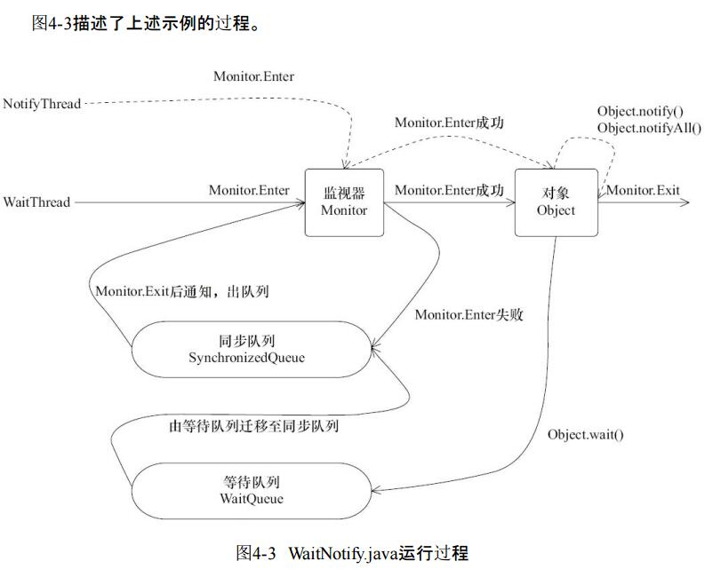

# 第4章 Java并发编程基础 

```
java 线程在运行的生命周期中可能初一下表的6种不同的状态，在给定的一个时刻，线程只能处于其中的一个状态
```

## 1、什么是线程

### 1、java 线程的状态

| 状态名称                              | 说明                                                         |
| ------------------------------------- | ------------------------------------------------------------ |
| NEW                                   | 初始状态，线程被构建，但是还没有调用start() 方法             |
| RUNNABLE                              | 运行状态，java 线程将操作系统中的就绪和运行两种状态笼统的称作"运行中" |
| BLOCKED                               | 阻塞状态，表示线程阻塞于锁                                   |
| WAITING                               | 等待状态，表示线程进入等待状态，进入该状态表示当前线程需要等待其他线程做出一些特定动作(通知或中断) |
| TIME_WAITING                          | 超时等待状态，该状态不同与waiting ，它是可以在指定的时间自行返回的 |
| TERMINATED terminated  终止的；有限的 | 终止状态，表示当前线程已经执行完毕                           |


```
由图4-1中可以看到，线程创建之后，调用start()方法开始运行。当线程执行wait()方法之后，线程进入等待状态。
进入等待状态的线程需要依靠其他线程的通知才能够返回到运行状态，而超时等待状态相当于在等待状态的基础上增加了超时限制，也就是超时时间到达时将会返回到运行状态。
当线程调用同步方法时，在没有获取到锁的情况下，线程将会进入到阻塞状态。线程在执行Runnable的run()方法之后将会进入到终止状态。
```

### 2、Daemon线程 

```
Daemon线程是一种支持型线程，因为它主要被用作程序中后台调度以及支持性工作。这
意味着，当一个Java虚拟机中不存在非Daemon线程的时候，Java虚拟机将会退出。可以通过调用Thread.setDaemon(true)将线程设置为Daemon线程。
注意 Daemon属性需要在启动线程之前设置，不能在启动线程之后设置。
Daemon线程被用作完成支持性工作，但是在Java虚拟机退出时Daemon线程中的finally块,并不一定会执行
```

```
main线程（非Daemon线程）在启动了线程DaemonRunner之后随着main方法执行完毕而终止，而此时Java虚拟机中已经没有非Daemon线程，虚拟机需要退出。Java虚拟机中的所有Daemon线程都需要立即终止，因此DaemonRunner立即终止，但是DaemonRunner中的finally块并没有执行。

 在构建Daemon线程时，不能依靠finally块中的内容来确保执行关闭或清理资源的逻辑。
```

```java
public Thread(Runnable target) {
        init(null, target, "Thread-" + nextThreadNum(), 0);
    }

  private void init (ThreadGroup g, Runnable target, String name,long stackSize,AccessControlContext acc){
      if (name == null) {
          throw new NullPointerException("name cannot be null");
      }
      // 当前线程就是该线程的父线程
      Thread parent = currentThread();
      this.group = g;
      // 将daemon、priority属性设置为父线程的对应属性
      this.daemon = parent.isDaemon();
      this.priority = parent.getPriority();
      this.name = name.toCharArray();
      this.target = target;
      setPriority(priority);
      // 将父线程的InheritableThreadLocal复制过来
      if (parent.inheritableThreadLocals != null)
          this.inheritableThreadLocals =         ThreadLocal.createInheritedMap(parent.inheritableThreadLocals);
      // 分配一个线程ID
      tid = nextThreadID();
  }
```


```
在上述过程中，一个新构造的线程对象是由其parent线程来进行空间分配的，而child线程继承了parent是否为Daemon、优先级和加载资源的contextClassLoader以及可继承的ThreadLocal，同时还会分配一个唯一的ID来标识这个child线程。

至此，一个能够运行的线程对象就初始化好了，在堆内存中等待着运行。
```

### 3、启动线程

```
线程对象在初始化完成之后，调用start()方法就可以启动这个线程。线程start()方法的含义是：
当前线程（即parent线程）同步告知Java虚拟机，只要线程规划器空闲，应立即启动调用start()方法的线程。

启动一个线程前，最好为这个线程设置线程名称，因为这样在使用jstack分析程序或者进行问题排查时，就会给开发人员提供一些提示，自定义的线程最好能够起个名字。
```

### 4、理解中断

```
中断可以理解为线程的一个标识位属性，它表示一个运行中的线程是否被其他线程进行
了中断操作。中断好比其他线程对该线程打了个招呼，其他线程通过调用该线程的interrupt()方法对其进行中断操作。

线程通过检查自身是否被中断来进行响应，线程通过方法isInterrupted()来进行判断是否被中断，也可以调用静态方法Thread.interrupted()对当前线程的中断标识位进行复位。如果该线程已经处于终结状态，即使该线程被中断过，在调用该线程对象的isInterrupted()时依旧会返回false。

从Java的API中可以看到，许多声明抛出InterruptedException的方法（例如Thread.sleep(longmillis)方法）这些方法在抛出InterruptedException之前，Java虚拟机会先将该线程的中断标识位清除，然后抛出InterruptedException，此时调用isInterrupted()方法将会返回false。

```

## 2、volatile 和 synchronized 关键字

### 1、synchronized

```
java 支持多个线程同时访问一个对象或者对象的成员变量，由于每个线程可以拥有这个
变量的拷贝（虽然对象以及成员变量分配的内存是在共享内存中的，但是每个执行的线程还是
可以拥有一份拷贝，这样做的目的是加速程序的执行，这是现代多核处理器的一个显著特
性），所以程序在执行过程中，一个线程看到的变量并不一定是最新的。
关键字volatile可以用来修饰字段（成员变量），就是告知程序任何对该变量的访问均需要从共享内存中获取，而对它的改变必须同步刷新回共享内存，它能保证所有线程对变量访问的可见性。

关键字synchronized可以修饰方法或者以同步块的形式来进行使用，它主要确保多个线程在同一个时刻，只能有一个线程处于方法或者同步块中，它保证了线程对变量访问的可见性和排他性。


```


```
上面class信息中，对于同步块的实现使用了monitorenter和monitorexit指令，而同步方法则是依靠方法修饰符上的ACC_SYNCHRONIZED来完成的。无论采用哪种方式，其本质是对一个对象的监视器（monitor）进行获取，而这个获取过程是排他的，也就是同一时刻只能有一个线程获取到由synchronized所保护对象的监视器。
```

```
任意一个对象都拥有自己的监视器，当这个对象由同步块或者这个对象的同步方法调用
时，执行方法的线程必须先获取到该对象的监视器才能进入同步块或者同步方法，而没有获取到监视器（执行该方法）的线程将会被阻塞在同步块和同步方法的入口处，进入BLOCKED状态。
```


### 2、 等待/通知机制 

| 方法名称        | 描述                                                         |
| --------------- | ------------------------------------------------------------ |
| notify()        | 通知一个在对象上等待的线程，使其从 wait()方法返回，而返回的前提是该线程获取到了对象的锁 |
| notifyAll()     | 通知所有等待在该对象上的线程                                 |
| wait()          | 调用该方法的线程进入 WAITING 状态，只有等待另外线程的通知或被中断才会返回，需要注意，调用 wait() 方法后，会释放对象的锁。 |
| wait(long)      |                                                              |
| wait(long, int) | 对于超时时间更细粒度的控制，可以达到纳秒                     |


```
1）使用wait()、notify()和notifyAll()时需要先对调用对象加锁。
2）调用wait()方法后，线程状态由RUNNING变为WAITING，并将当前线程放置到对象的
等待队列。
3）notify()或notifyAll()方法调用后，等待线程依旧不会从wait()返回，需要调用notify()或notifAll()的线程释放锁之后，等待线程才有机会从wait()返回。
4）notify()方法将等待队列中的一个等待线程从等待队列中移到同步队列中，而notifyAll()
方法则是将等待队列中所有的线程全部移到同步队列，被移动的线程状态由WAITING变为
BLOCKED。
5）从wait()方法返回的前提是获得了调用对象的锁。

```




```
在图4-3中，WaitThread首先获取了对象的锁，然后调用对象的wait()方法，从而放弃了锁并进入了对象的等待队列WaitQueue中，进入等待状态。
由于WaitThread释放了对象的锁，NotifyThread随后获取了对象的锁，并调用对象的notify()方法，将WaitThread从WaitQueue移到SynchronizedQueue中，此时WaitThread的状态变为阻塞状态。
NotifyThread释放了锁之后，WaitThread再次获取到锁并从wait()方法返回继续执行。
```

### 3、Thread.join()的使用 

```
如果一个线程A执行了thread.join()语句，其含义是：当前线程A等待thread线程终止之后才从thread.join()返回。线程Thread除了提供join()方法之外，还提供了join(long millis)和join(longmillis,int nanos)两个具备超时特性的方法。这两个超时方法表示，如果线程thread在给定的超时时间里没有终止，那么将会从该超时方法中返回。

```

```java
// 加锁当前线程对象
public final synchronized void join() throws InterruptedException {
    // 条件不满足，继续等待
    while (isAlive()) {
    wait(0);
}
// 条件符合，方法返回
}
// 但是你直接调用 wait(); 就会抛出异常，因为wait()在外面只有 synchronized

```


```java
只要 head!=tail 就说明有新的节点进来到队列的尾部了，如果 h.next == null, 说明正在初始化节点中，如果不是初始化中的话，只要 Head 的下一个节点不是 刚进来的 thread 的 的Node,如果是的话就说明没有正在等待的节点，
对了先补充下这个方法的意思，查询是否有任何线程等待获取比当前线程更长的时间。 
true如果有排队线前面的当前线程，并 false如果当前线程在队列或队列的头部是空的 


public final boolean hasQueuedPredecessors() {
    Node t = tail;
    Node h = head;
    Node s;
    // 如果 h != t;并且 h.next =null;说明节点正在初始化中
    // 就是 enq()；compareAndSetTail(xx); 然后下面的 tail.next 还没有运行到
    // 如果 h.next != null 的话就判断下 head.next 是不是当前的 thread 的节点，是的话就说明没有节点在等待。因为本来就轮到 currentThread 运行了。
    return h != t &&
        ((s = h.next) == null || s.thread != Thread.currentThread());
}

 Node t = tail;
Node h = head;
这两个顺序换了也会出错；
因为 enq() 是先初始化 head 再初始化 tail 的。
如果你先获取了 tail 那么就相当于 head 也已经固定了。
	如果 tail 为 null。head 可能为 null 可能不为 null;
	tail 不为 null 的话， head 一定不为 null

如果你先获取了  head ，tail 就会有安全隐患。
如果调换一下 Node t = tail; 和 Node h = head; 那么可能出现 h 为 null，t 不为 null， 这样就会报错。 h.next 会报空指针异常。
    

```


