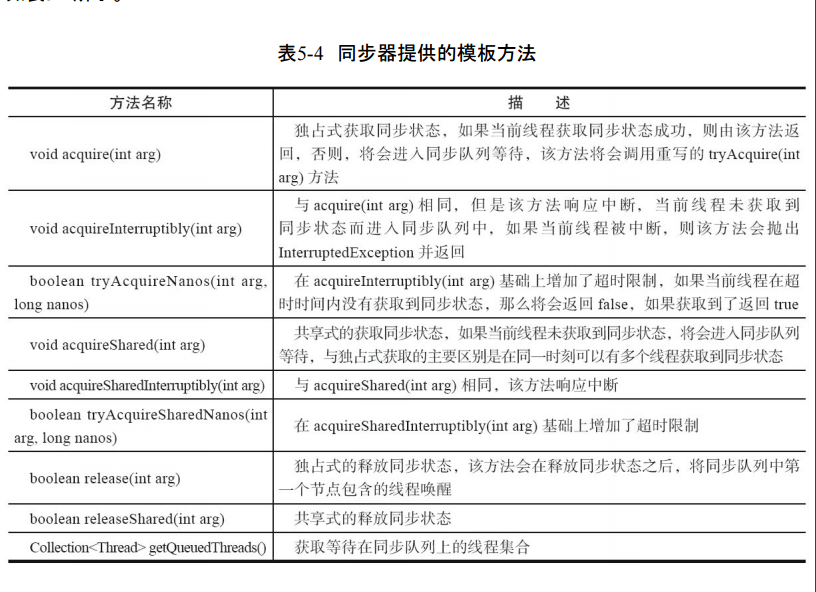
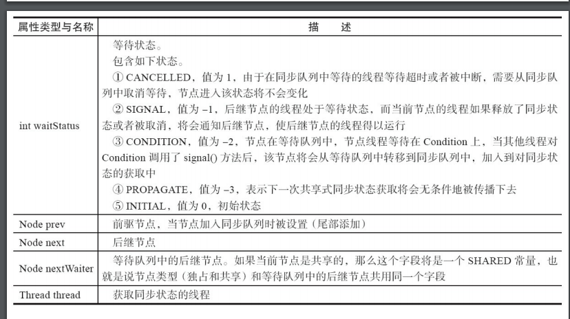
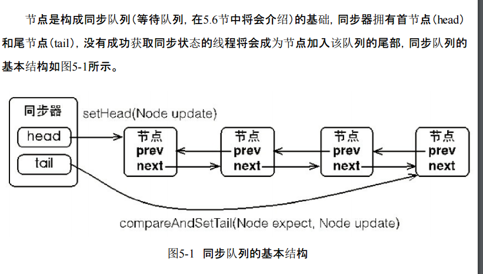
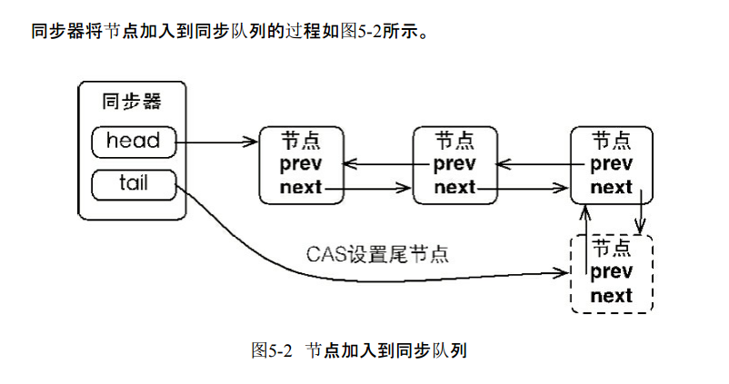
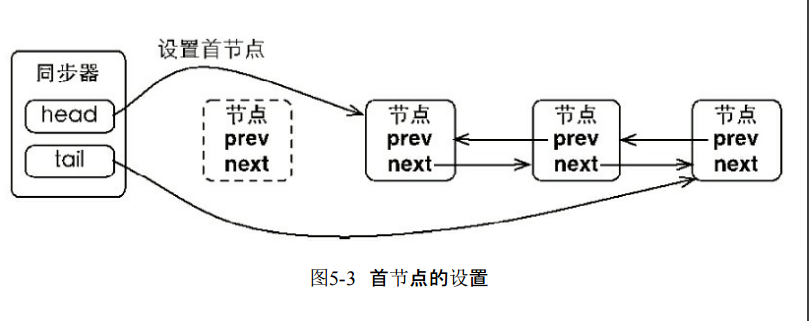
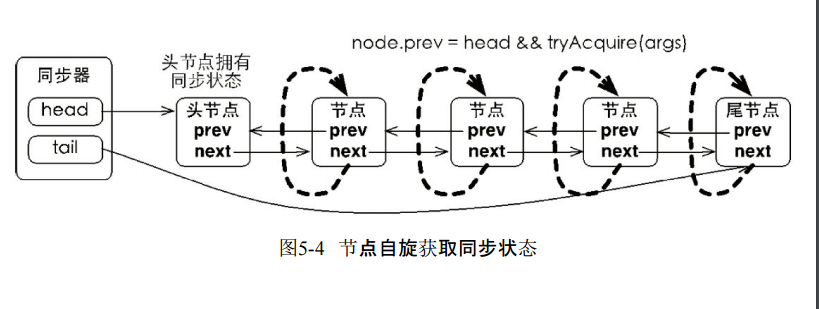
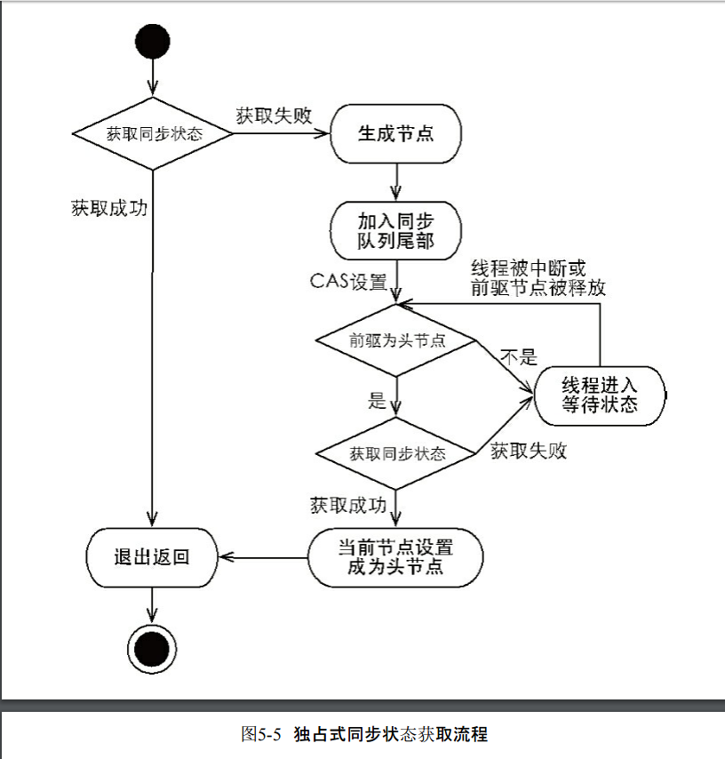
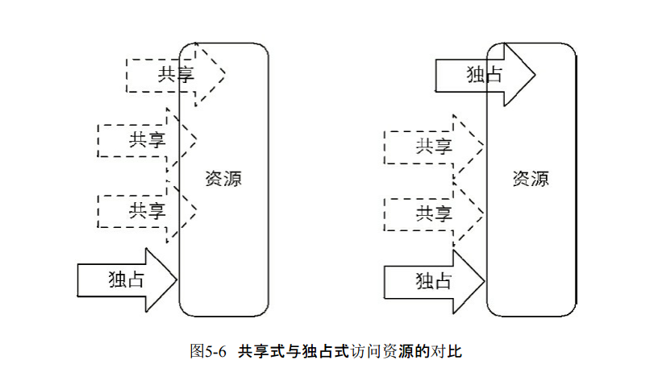

# 1、 队列同步器的接口与示例

```
同步器的设计是基于模板方法模式的，也就是说，使用者需要继承同步器并重写指定的
方法，随后将同步器组合在自定义同步组件的实现中，并调用同步器提供的模板方法，而这些
模板方法将会调用使用者重写的方法。
重写同步器指定的方法时，需要使用同步器提供的如下3个方法来访问或修改同步状态。
·getState()：获取当前同步状态。
·setState(int newState)：设置当前同步状态。
·compareAndSetState(int expect,int update)：使用CAS设置当前状态，该方法能够保证状态
设置的原子性。
```

 ```
protected boolean tryAcquire(int arg)
	独占式获取同步状态，实现该方法需要查询当前状态并判断同步状态是否符合预期，然后再进行 CAS 设置同步状态
	
protected boolean tryRelease(int arg)
	独占式释放同步状态，等待同步状态的线程将有机会获取同步状态

protected int tryAcquireShared(int arg)
	共享式获取同步状态，返回大于等于 0 的值，表示获取成功，反之，获取失败

protected boolean tryReleaseShared(int arg)
	共享式释放同步状态

protected boolean isHeldExlusively()
	当前同步器是否在独占模式下被线程使用，一般该方法表示是否被当前线程独占。
 ```


```
实现自定义同步组件时，将会调用同步器提供的模板方法
```




# 2、队列同步器的实现分析 

## 1.同步队列 

```
同步器依赖内部的同步队列(一个 FIFO 双向队列)来完成同步状态的管理，当前线程获取同步状态失败时，同步器会将当前线程以及等待状态等信息构造成为一个节点(Node)并将其加入同步队列，同时会阻塞当前线程，当同步状态释放时，会把首节点中的线程唤醒，使其再次尝试获取同步状态。
同步队列中的节点（Node）用来保存获取同步状态失败的线程引用、等待状态以及前驱和
后继节点，节点的属性类型与名称以及描述如表5-5所示。

```






```
在图5-1中，同步器包含了两个节点类型的引用，一个指向头节点，而另一个指向尾节点。
试想一下，当一个线程成功地获取了同步状态（或者锁），其他线程将无法获取到同步状态，转
而被构造成为节点并加入到同步队列中，而这个加入队列的过程必须要保证线程安全，因此
同步器提供了一个基于CAS的设置尾节点的方法：compareAndSetTail(Node expect,Node
update)，它需要传递当前线程“认为”的尾节点和当前节点，只有设置成功后，当前节点才正式
与之前的尾节点建立关联。

```



```
同步队列遵循FIFO，首节点是获取同步状态成功的节点，首节点的线程在释放同步状态
时，将会唤醒后继节点，而后继节点将会在获取同步状态成功时将自己设置为首节点，该过程
如图5-3所示。
```



```
在图5-3中，设置首节点是通过获取同步状态成功的线程来完成的，由于只有一个线程能
够成功获取到同步状态，因此设置头节点的方法并不需要使用CAS来保证，它只需要将首节
点设置成为原首节点的后继节点并断开原首节点的next引用即可。
```

## 2.独占式同步状态获取与释放 

```
通过调用同步器的acquire(int arg)方法可以获取同步状态，该方法对中断不敏感，也就是
由于线程获取同步状态失败后进入同步队列中，后续对线程进行中断操作时，线程不会从同
步队列中移出，该方法代码如代码清单5-3所示。
```

```java
public final void acquire(int arg) {
if (!tryAcquire(arg) &&
acquireQueued(addWaiter(Node.EXCLUSIVE), arg))
selfInterrupt();
}
```

```
上述代码主要完成了同步状态获取、节点构造、加入同步队列以及在同步队列中自旋等
待的相关工作，其主要逻辑是：首先调用自定义同步器实现的tryAcquire(int arg)方法，该方法
保证线程安全的获取同步状态，如果同步状态获取失败，则构造同步节点（独占式
Node.EXCLUSIVE，同一时刻只能有一个线程成功获取同步状态）并通过addWaiter(Node node)
方法将该节点加入到同步队列的尾部，最后调用acquireQueued(Node node,int arg)方法，使得该
节点以“死循环”的方式获取同步状态。如果获取不到则阻塞节点中的线程，而被阻塞线程的
唤醒主要依靠前驱节点的出队或阻塞线程被中断来实现。

```

```java
下面分析一下相关工作。首先是节点的构造以及加入同步队列，如代码清单5-4所示
private Node addWaiter(Node mode) {
Node node = new Node(Thread.currentThread(), mode);
// 快速尝试在尾部添加
Node pred = tail;
if (pred != null) {
node.prev = pred;private Node addWaiter(Node mode) {
        Node node = new Node(Thread.currentThread(), mode);
        // 尝试快速入队，即无竞争条件下肯定成功。如果失败，则进入enq自旋重试入队
        // 获取 尾节点
        Node pred = tail;
        if (pred != null) {
        	// 将新创建的节点的 prev 指向尾节点，因为是尾节点
        	// ，所以 node.next = null.
            node.prev = pred;
            //CAS替换当前尾部。成功则返回
            if (compareAndSetTail(pred, node)) {
            // 并且将先前的 尾节点的 next 指向 node
                pred.next = node;
                return node;
            }
        }
        enq(node);
        return node;
    }

private Node enq(final Node node) {
        for (;;) {
            Node t = tail;
            if (t == null) { // Must initialize
            	// 如果没有 尾节点，说明还没有队列。
            	// 创建一个节点作为 队列的 head 节点
                if (compareAndSetHead(new Node()))
                // 注意 head的 next 并没有指向下一个节点
                // 同时将其 tail = head 
                    tail = head;
            } else {
            // 如果有队列的话就将其 尾节点 变为当前节点的 prev
                node.prev = t;
                // 将 node 变为当前的尾节点
                if (compareAndSetTail(t, node)) {
                // 并且将先前的 尾节点的 next 指向 node
                    t.next = node;
                    return t;
                }
            }
        }
    }


```

```
上述代码通过使用compareAndSetTail(Node expect,Node update)方法来确保节点能够被线
程安全添加。试想一下：如果使用一个普通的LinkedList来维护节点之间的关系，那么当一个线
程获取了同步状态，而其他多个线程由于调用tryAcquire(int arg)方法获取同步状态失败而并发
地被添加到LinkedList时，LinkedList将难以保证Node的正确添加，最终的结果可能是节点的数
量有偏差，而且顺序也是混乱的。
```

```
在enq(final Node node)方法中，同步器通过“死循环”来保证节点的正确添加，在“死循
环”中只有通过CAS将节点设置成为尾节点之后，当前线程才能从该方法返回，否则，当前线
程不断地尝试设置。可以看出，enq(final Node node)方法将并发添加节点的请求通过CAS变
得“串行化”了。
```

```java
final boolean acquireQueued(final Node node, int arg) {
        boolean failed = true;
        try {
            boolean interrupted = false;
           
            for (;;) {
                final Node p = node.predecessor();
                if (p == head && tryAcquire(arg)) {
                    setHead(node);
                    //设置前驱节点的后继节点为null。使前驱节点成为不可达。方便GC回收
                    p.next = null; // help GC
                    failed = false;
                    return interrupted;
                }

                if (shouldParkAfterFailedAcquire(p, node) &&
                    parkAndCheckInterrupt())
                    interrupted = true;
            }
        } finally {
            if (failed)
                //在队列中取消当前节点,因为等唤醒以后，最终都会变成head
                // 变为 head 以后就 将当前节点设置为 取消状态
                cancelAcquire(node);
        }
    }


 private void setHead(Node node) {
        head = node;
        node.thread = null;
        node.prev = null;
    }
```

```
在acquireQueued(final Node node,int arg)方法中，当前线程在“死循环”中尝试获取同步状
态，而只有前驱节点是头节点才能够尝试获取同步状态，这是为什么？原因有两个，如下。
第一，头节点是成功获取到同步状态的节点，而头节点的线程释放了同步状态之后，将会
唤醒其后继节点，后继节点的线程被唤醒后需要检查自己的前驱节点是否是头节点。
第二，维护同步队列的FIFO原则。该方法中，节点自旋获取同步状态的行为如图5-4所示。
```




```
由于非首节点线程前驱节点出队或者被中断而从等待状态返回，随后检查自
己的前驱是否是头节点，如果是则尝试获取同步状态。可以看到节点和节点之间在循环检查
的过程中基本不相互通信，而是简单地判断自己的前驱是否为头节点，这样就使得节点的释
放规则符合FIFO，并且也便于对过早通知的处理（过早通知是指前驱节点不是头节点的线程
由于中断而被唤醒）。
独占式同步状态获取流程，也就是acquire(int arg)方法调用流程，如图5-5所示。
```



```
在图5-5中，前驱节点为头节点且能够获取同步状态的判断条件和线程进入等待状态是获
取同步状态的自旋过程。当同步状态获取成功之后，当前线程从acquire(int arg)方法返回，如果
对于锁这种并发组件而言，代表着当前线程获取了锁。
当前线程获取同步状态并执行了相应逻辑之后，就需要释放同步状态，使得后续节点能
够继续获取同步状态。通过调用同步器的release(int arg)方法可以释放同步状态，该方法在释
放了同步状态之后，会唤醒其后继节点（进而使后继节点重新尝试获取同步状态）。该方法代
码如代码清单5-6所示。

```

```java
public final boolean release(int arg) {
    if (tryRelease(arg)) {
    	Node h = head;
    if (h != null && h.waitStatus != 0)
    	unparkSuccessor(h);
    	return true;
    }
    return false;
}
```

```
该方法执行时，会唤醒头节点的后继节点线程，unparkSuccessor(Node node)方法使用
LockSupport（在后面的章节会专门介绍）来唤醒处于等待状态的线程。
分析了独占式同步状态获取和释放过程后，适当做个总结：在获取同步状态时，同步器维
护一个同步队列，获取状态失败的线程都会被加入到队列中并在队列中进行自旋；移出队列
（或停止自旋）的条件是前驱节点为头节点且成功获取了同步状态。在释放同步状态时，同步
器调用tryRelease(int arg)方法释放同步状态，然后唤醒头节点的后继节点。

```

## 3、共享式同步状态获取与释放 

```
共享式获取与独占式获取最主要的区别在于同一时刻能否有多个线程同时获取到同步状
态。以文件的读写为例，如果一个程序在对文件进行读操作，那么这一时刻对于该文件的写操
作均被阻塞，而读操作能够同时进行。写操作要求对资源的独占式访问，而读操作可以是共享
式访问，两种不同的访问模式在同一时刻对文件或资源的访问情况，如图5-6所示。
```




```java
 public final void acquireShared(int arg) {
        if (tryAcquireShared(arg) < 0)
            doAcquireShared(arg);
    }
    
    
    private void doAcquireShared(int arg) {
        final Node node = addWaiter(Node.SHARED);
        boolean failed = true;
        try {
            boolean interrupted = false;
            for (;;) {
                final Node p = node.predecessor();
                if (p == head) {
                    int r = tryAcquireShared(arg);
                    if (r >= 0) {
                        setHeadAndPropagate(node, r);
                        p.next = null; // help GC
                        if (interrupted)
                            selfInterrupt();
                        failed = false;
                        return;
                    }
                }
                if (shouldParkAfterFailedAcquire(p, node) &&
                    parkAndCheckInterrupt())
                    interrupted = true;
            }
        } finally {
            if (failed)
                cancelAcquire(node);
        }
    }

```

```
在acquireShared(int arg)方法中，同步器调用tryAcquireShared(int arg)方法尝试获取同步状
态，tryAcquireShared(int arg)方法返回值为int类型，当返回值大于等于0时，表示能够获取到同
步状态。因此，在共享式获取的自旋过程中，成功获取到同步状态并退出自旋的条件就是
tryAcquireShared(int arg)方法返回值大于等于0。可以看到，在doAcquireShared(int arg)方法的自
旋过程中，如果当前节点的前驱为头节点时，尝试获取同步状态，如果返回值大于等于0，表示
该次获取同步状态成功并从自旋过程中退出。
与独占式一样，共享式获取也需要释放同步状态，通过调用releaseShared(int arg)方法可以
释放同步状态，该方法代码如代码清单5-8所示。

```

```java
 public final boolean releaseShared(int arg) {
        if (tryReleaseShared(arg)) {
            doReleaseShared();
            return true;
        }
        return false;
    }
```

```
该方法在释放同步状态之后，将会唤醒后续处于等待状态的节点。对于能够支持多个线
程同时访问的并发组件（比如Semaphore），它和独占式主要区别在于tryReleaseShared(int arg)
方法必须确保同步状态（或者资源数）线程安全释放，一般是通过循环和CAS来保证的，因为
释放同步状态的操作会同时来自多个线程。

```


