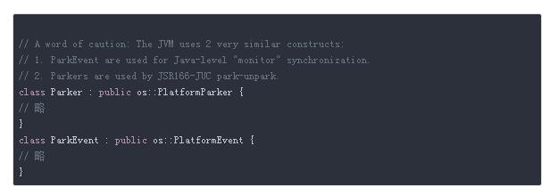

```
为保障多线程下处理共享数据的安全性，java 语言给我们提供了线程锁，保证同一时刻能处理共享数据。当一个锁被某个线程持有的时候，另一个线程尝试去获取这个锁将产生线程阻塞，直到持有锁的线程释放了该锁。
```

```
除了抢占锁的时候会出现线程阻塞，另外还有一些方法也会产生线程阻塞，比如：Object.wait(), Thread.sleep(), ArrayBloceingQueue.put()等等，他们都有一个共同特点： 不消耗  CPU 时间片。另外值得指出的是 Object.wait() 会释放持有的锁， 而 Thread.sleep() 不会。当然 while(true){} 也能产生阻塞线程的效果，自旋锁就是使用循环，配合 CAS(compareAndSet)实现的。
```

## 1、线程锁的三种方法的字节码

```
相信大家对线程锁很熟悉，目前有两种方法，准确的来说是三种， synchronized 方法， synchronized 区块， ReentrantLock。先说 synchronized, 代码如下：
```


```
可以看到方法表的访问标志位(flags)中多了个 ACC_SYNCHRONIZED，然后看字节码指令区域(Code), 和普通方法没有任何差别，猜测 java 虚拟机通过检查方法表中是否存在标志位 ACC_SYNCHRONIZED 来决定是否需要获取锁，至于获取锁的原理后文会讲到。
```


```
synchronized 区域的字节码相比较 synchronized 方法复杂了许多。每一行字节码的含义我都做了详细注释，可以看到此时是通过字节码指令 monitorenter,monitorexit 来进入和退出同步的。特别值得注意的是，我们并没有写 try.catch 捕获异常，但是字节码指令中 存在异常处理的代码，其实为了保证在方法异常完成时 monitorenter 和 monitorexit 指令依然可以正确配对执行，编译器会自动产生一个异常处理器，这个异常处理器声明可处理所有的异常，它的目的就是用来执行 monitorexit 指令。这个机制确保在 synchronized 区块中产生任何异常都可以正常退出同步，释放锁资源。
```

```
不管是检查标志位中的 ACC_SYNCHRONIZED，还是字节码指令 monitorenter，monitorexit，锁机制的实现最终肯定存在于 JVM 中，后面我们会再提到这点.
```

```
reentrantlock 就不看了 具体可以看 aqs.
```

```
LockSupport 内部调用了 UnSafe 类的 park 和 unpark, 是 native 代码，该类由虚拟机实现，以 Hotspot 虚拟机为例，查看 park 方法：
```


```
看 HOTSPOT_THREAD_PARK_BEGIN ;

调用了：thread -> parker() -> park(isAbslute != 0, time); 我们可以猜测这句代码阻塞了当前线程。 HotSpot 虚拟机里的 Thread 类对应着一个 OS 的 Thread, javaThread 类继承于 Thread， java Thread 实例对应着一个 java 层的 Thread。 
简而言之， java 层的 Thread 对应着一个 OS 的 Thread。 使用如下代码创建线程：
```


```
回到 Thread 类中的 Park ，我们查看 HotSpot 的 thread.hpp, 找到了 如下三个 park:
```


```
从注释上可以看出分别是用于 synchronized 的阻塞， Thread.sleep 的阻塞还有用于 unsafe 的线程阻塞，继续查看Park.hpp 节选：
```



```
注释上更近一步解释了两种 Parker 的区别，他们的实现非常相似，那为什么会存在两个呢？网络上有解释说是只是没重构而已。下面只看 Parker 的实现，发现 park.cpp 中并没有实现 park 方法，猜测应该是父类中实现了，因为这是和系统相关的操作，以 Linux 系统为例，查看 linux_os.cpp 找到了 park 的实现，截取了主要部分：
```


```
总共分三步走，先获取锁，再调用 pthread_cond_wait 阻塞线程，最后阻塞恢复了之后释放锁，是不是和我们使用 Object.wait 十分类似，事实上 Object.wait 底层也是这种方式实现的。为了更清楚的了解底层的实现，写了一段 c 代码看一下线程的创建和锁的使用：
```


```
使用 pthread_create 创建线程，使用 pthread_mutex_lock 获取锁，使用 pthread_mutex_unlock 释放锁。那既然 pthread_mutex_lock 和 pthread_mutex_unlock 就能实现锁了，那为什么锁实现的时候还要使用 pthread_cond_wait 来阻塞线程呢？回过头看 PlatformParker ：
```


```
每个javaThread 实例都有自己的 mutex，在上述自己写的例子中是多个线程竞争同一个 mutex, 阻塞线程队列管理的逻辑直接由 mutex 实现，而此处的 mutex 线程私有，不存在直接竞争关系。
事实上，JVM为了提升平台通用性，是提供了线程阻塞和恢复操作，阻塞线程队列的管理工作交给了 java 层，也就是前面提到的 AQS。对于 java 层来说 JVM 只需要提供 [阻塞] 和 [唤醒]的操作即可。
```

```
最后再简单谈一下阻塞中断，Java 层 Thread 中有个 interrupt 方法，它的作用是在线程收到阻塞的时候抛出一个中断信号，这样线程就会退出阻塞状态，但是并不是我们遇到的所有阻塞都会中断，要看是否会响应中断信号，Object.wait, Thread.join，Thread.sleep，ReentrantLock.lockInterruptibly 这些会抛出受检异常 InterruptedException 的都会被中断。synchronized，ReentrantLock.lock 的锁竞争阻塞是不会被中断的，interrupt 并不会强制终止线程，而是会将线程设置成 interrupted 状态，我们可以通过判断 isInterrupted 或 interrupted 来获取中断状态，区别在于后者会重置中断状态为 false。看一下底层线程中断的代码：
```


```
可以看到，线程中断也是由 unpark 实现的, 即恢复了阻塞的线程。并且对之前提到的三个 Parker (_ParkEvent，_SleepEvent，_parker) 都进行了 unpark。
```


