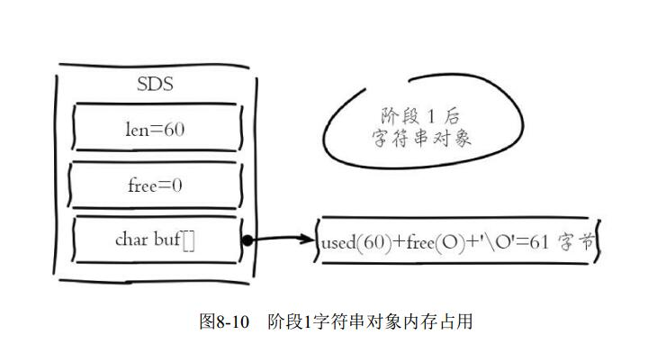
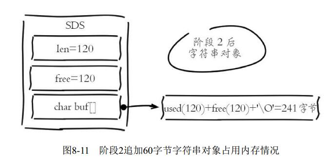
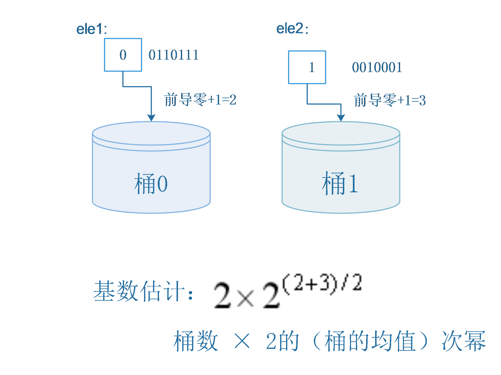
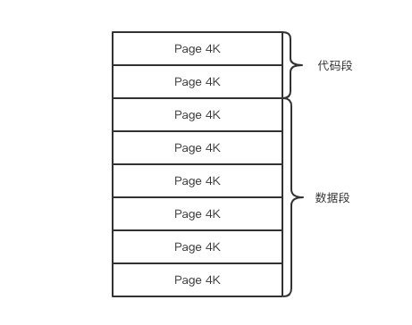
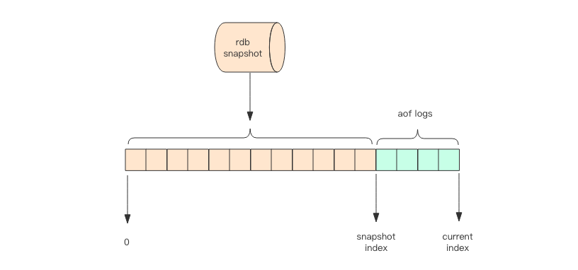
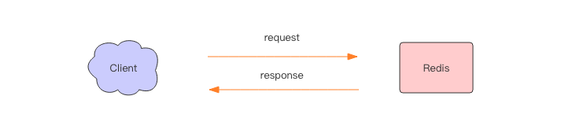
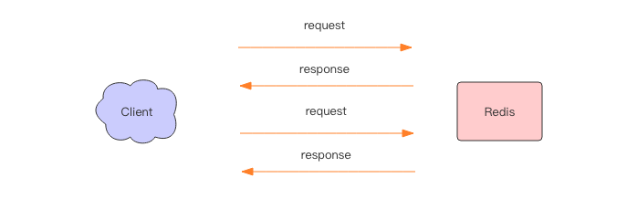
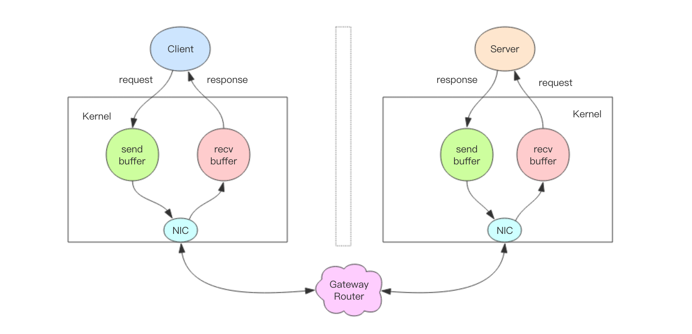

# 一、redis 基础数据结构

## 1、string

```
字符串 string 是 redis 最简单的数据结构。redis 所有的数据结构都是以唯一的 key 字符串作为名称，然后通过这个唯一 key 值来获取相应的 value 数据。不同类型的数据结构的差异就在于 value 的结构不一样。
```

```
字符串结构使用非常广泛，一个常见的用途就是缓存用户信息。我们将用户信息结构体使用 JSON  序列化成字符串，然后将序列化后的字符串塞进 redis 来缓存。同样，取用户信息会经过一次反序列化的过程。
```

```
string 有如下特点：
o(1) 时间复杂度获取：字符串长度、已用长度(len)、未用长度(free)
可用于保存字节数组，支持安全的二进制数据存储。
内部实现空间预分配机制，降低内存再分配次数
惰性删除机制，字符串缩减以后的空间不释放，作为预分配空间保留。
```

### 预分配机制



```
新插入的字符串 free=0; 总长度= len+"\0"; 总占用空间=实际占用空间+1字节。最后 1 字节保存 "\0" 标识结尾。这里忽略 int 类型 len 和 free 字段消耗的 8 字节.
```

追加字符串



```
但是使用 append 等追加字符串，字符串对象就会预分配一倍容量作为预留空间。而且大量追加操作需要内存重新分配，造成内存碎片率上升。
追加了 60 字节。变为了 120字节，然后 再给 free 120 字节； 就变为了现字符串的一倍大小；
```

```
字符串之所以采用预分配的方式是防止修改操作需要不断重分配内存和字节数据拷贝。但同样也会造成内存的浪费。字符串预分配每次并不都是翻倍扩容。
```

```
1) 第一次创建 Len 属性等于数据实际大小， free 等于 0，不做预分配
2) 追加字符串后如果已有 free 空间不够且数据小于 1M, 每次预分配一倍容量。修改后如果已有 free 空间不够且数据大于 1MB, 每次预分配 1Mb
```

quickList

```
首先在列表较少的情况下会使用一块连续的内存存储，这个结构是 zipList，也即是压缩列表。它将所有的元素紧挨着一起存储，分配的是一块连续的内存。当数据量比较多的时候才会改成 quicklist.因为普通的链表需要的附加指针空间太大，会浪费空间，而且会加重内存的碎片化。比如这个列表里存的只是 int 类型的数据，结构上还需要两个额外的指针 prev 和 next.所以 redis 将链表和 zipList 结合起来组成了 quickList. 也就是将多个 ziplist 使用双向指针串起来使用。这样既满足了快速的插入删除性能，又不会出现太大的空间冗余。
```

hash(字典)


# 2、HyperLogLog

```
最简单的一种优化方法显然就是把数据分成m个均等的部分，分别估计其总数求平均后再乘以m，称之为分桶。对应到前面抛硬币的例子，其实就是把硬币序列分成m个均等的部分，分别用之前提到的那个方法估计总数求平均后再乘以m，这样就能一定程度上避免单一突发事件造成的误差。
具体要怎么分桶呢？我们可以将每个元素的hash值的二进制表示的前几位用来指示数据属于哪个桶，然后把剩下的部分再按照之前最简单的想法处理。
还是以刚刚的那个集合{ele1,ele2}为例，假设我要分2个桶，那么我只要去ele1的hash值的第一位来确定其分桶即可，之后用剩下的部分进行前导零的计算，如下图：
```



```
为什么 2*2^((2+3)/2) 这里要 *2 因为每一个存在数据的桶就是 2^((2+3)/2) 的次数;
这里 一个桶就是 2^((2+3)/2) 次数; 而我们有两个元素; 两个元素就是投了两次 2^((2+3)/2) 
既然投了两次这种次数 那么就肯定要 *2； 这样就能降低误差;因为 次幂越大越难增加;那么我们只要将多个同样次幂的次数分开保存；
1、来了投了 2^((2+3)/2) 的正反反
2、又来了投了 2^((2+3)/2) 的正反反
如果是按照次幂的话第二次的投的次数就丢弃了;
因为并没有增加 次幂
但是我们将其分桶放,就可以将这两次都记录下来了
其实我们投了两次 x 的投硬币次数。但是因为是一样的这个次数就不是 2x 而是 x
但是如果是分桶放，那么就是 2x 因为 x 次数 * 桶数
```

```
为什么要 +1 其实 加不加1，无所谓的;正正正和反反反还有正反反和反反正出现的概率都是一样的;
那为什么不用 正正正和反反反 呢; 因为 正正正和反反反 容易出现一次都没有的情况;
臂如如果使用了 正正正 那么第一次就是反 这一次记录就会放弃;一次无所谓;如果好多次这样数据就更加不准确了
反反反 也是一样的情况;
所以就使用 正反反或反反正 不管怎么样只要投过就会记录下来这样好多了

经过试验。。发现 +1 不对 还是不能 +1 
```


# 3、Geo

```
地图元素的位置数据使用二维的经纬度表示，经度范围(-180,180] 纬度范围(-90,90],纬度正负以赤道为界，北正南负，经度正负以本初子午线(英国格林尼治天文台)为界，东正西负。
```

## GeoHash 算法

```
业界比较通用的地理位置距离排序算法是 GeoHash 算法，Redis 也使用 GeoHash 算法。GeoHash 算法将二维的经纬度数据映射到一维的整数，这样所有的元素都将在挂在到一条线上，距离靠近的二维坐标映射到一维后的点之间的距离也会很接近。当我们想要计算(附近的人时)，首先将目标位置映射到这条线上，然后在这个一维的线上获取附近的点就行了;
```

```
那这个映射算法具体是怎样的呢？它将整个地球看成一个二维平面，然后划分才成了一系列正方形的方格，就好比围棋棋盘。所有的地图元素坐标都将放置于唯一的方格中。方格越小，坐标越精确。
编码之后，每个地图元素的坐标都将变成一个整数，通过这个整数可以还原出元素的坐标，整数越长，还原出来的坐标值的损失程度就越小。
GeoHash 算法会继续对这个整数做一次 base32 编码(0-9,a-z去掉a,i,l,o 四个字母)变成一个字符串。在 Redis 里面，经纬度使用 52 位的整数进行编码，放进了 zset 里面， zset 的 value 是元素的 Key, score 是 GeoHash 的 52 位整数值。 zset 的 score 虽然是浮点数，但是对于 52 位的整数值，它可以无损存储

在使用 Redis 进行 Geo 查询时，我们要时刻想到它的内部结构实际上只是一个 zset(skiplist)。通过 zset 的 score 排序就可以得到坐标附近的其它元素 (实际情况要复杂一些，不过这样理解足够了)，通过将 score 还原成坐标值就可以得到元素的原始坐标。
```


### 增加

```shell
增加
geoadd 指令携带集合名称以及多个经纬度名称三元组，注意这里可以加入多个三元组

> geoadd company 116.48105 39.996794 juejin
> geoadd company 116.514203 39.905409 ireader
> geoadd company 116.562108 39.787602 jd 116.334255 40.027400 xiaomi
```

## 删除

```
没有删除指令。因为 geo 存储结构上使用的是 zset;意味着我们可以使用 zset 相关的指令来操作 geo 数据,所以删除指令可以直接使用 zrem 指令即可;
```

## 获取两者之间距离

```
距离 geodist 指令可以用来计算两个元素之间的距离，携带集合名称、2个名称和距离单位;
dist 距离
> geodist company juejin ireader km
"10.5501"
> geodist company juejin ireader km
"1.3878"
> geodist company juejin juejin km
"0.0000"
我们可以看到掘金和ireader的距离; 
距离单位可以是 m、km、mi、ft; 分别代表 米、千米、英里、尺

·m（meters） 代表米。
·km（kilometers） 代表公里。
·mi（miles） 代表英里。
·ft（feet） 代表尺
```

## 获取元素位置

```
geopos 指令可以获取集合中任意元素的经纬度坐标，可以一次获取多个;
pos position 位置
geopos 指令可以获取集合中任意元素的经纬度坐标，可以一次获取多个;

geopos company juejin
1) 1) "116.48104995489120483"
   2) "39.99679348858259686"
   
127.0.0.1:6379> geopos company juejin ireader
1) 1) "116.48104995489120483"
   2) "39.99679348858259686"
2) 1) "116.5142020583152771"
   2) "39.90540918662494363"
```

## 获取元素的 hash 值

```
geohash 可以获取元素的经纬度编码字符串，上面已经提到，它是 base32 编码。

127.0.0.1:6379> geohash company ireader
1) "wx4g52e1ce0"
127.0.0.1:6379> geohash company juejin
1) "wx4gd94yjn0"
```

## 附近的人

```
georadius和georadiusbymember两个命令的作用是一样的， 都是以一个地
理位置为中心算出指定半径内的其他地理信息位置， 不同的是georadius命令
的中心位置给出了具体的经纬度， georadiusbymember只需给出成员即可。 其
中radiusm|km|ft|mi是必需参数， 指定了半径（带单位） ， 这两个命令有很多
可选参数， 如下所示

·withcoord： 返回结果中包含经纬度。
·withdist： 返回结果中包含离中心节点位置的距离。
·withhash： 返回结果中包含geohash， 有关geohash后面介绍。
·COUNT count： 指定返回结果的数量。
·asc|desc： 返回结果按照离中心节点的距离做升序或者降序。
·store key： 将返回结果的地理位置信息保存到指定键。
·storedist key： 将返回结果离中心节点的距离保存到指定键。
```


```
以一个地理位置为中心算出指定半径内的其他地理信息位置
georadiusbymember 用来查询指定元素附近的其他元素，他的参数非常复杂。
radius 半径
// 范围 20 公里以内最多 3 个元素按距离正排，它不会排除自身 就是理他最近的三个元素
> georadiusbymember company ireader 20 km count 3 asc
1) "ireader"
2) "juejin"
3) "meituan"

// 范围 20 公里内最多 3 个元素按距离倒排 离他最远的三个元素
> georadiusbymember company ireader 20 km count 3 desc
1) "jd"
2) "meituan"
3) "juejin"

//三个可选参数 withcoord withdist withhash 用来携带附加参数
coord 目标坐标 dist 距离 hash 就是hash
georadiusbymember company ireader 20 km withcoord withdist withhash count 3 asc
1) 1) "ireader"
   2) "0.0000"
   3) (integer) 4069886008361398
   4) 1) "116.5142020583152771"
      2) "39.90540918662494363"
2) 1) "juejin"
   2) "10.5501"
   3) (integer) 4069887154388167
   4) 1) "116.48104995489120483"
      2) "39.99679348858259686"
3) 1) "meituan"
   2) "11.5748"
   3) (integer) 4069887179083478
   4) 1) "116.48903220891952515"
      2) "40.00766997707732031"
      
georadiusbymember cities:locations beijing 150 km
1) "beijing"
2) "tianjin"
3) "tangshan"
4) "baoding"
```

```
除了 georadiusbymember 指令根据元素查询附近的元素，Redis 还提供了根据坐标值来查询附近的元素，这个指令更加有用，它可以根据用户的定位来计算「附近的车」，「附近的餐馆」等。它的参数和 georadiusbymember 基本一致，除了将目标元素改成经纬度坐标值。
```

```
geiredius company 116.514202 39.905409 20 km withdist count 3 asc
1) 1) "ireader"
   2) "0.0000"
2) 1) "juejin"
   2) "10.5501"
3) 1) "meituan"
   2) "11.5748"
```

```
小结&注意事项
在一个地图应用中，车的数据、餐馆的数据、人的数据可能会有百万千万条，如果使用 redis 的 Geo 数据结构，它们将全部放在一个 zset 集合中。在 redis 的集群环境中，集合可能会从一个节点迁移到另一个节点，如果单个 key 的数据过大，会对集群的迁移工作造成较大的影响，在集群环境中单个 key 对应的数据量不宜超过 1M，否则会导致集群出现卡顿现象，影响线上服务的正常运行。

所以这里建议 Geo 的数据使用单独的 redis 实例部署，不使用集群环境

如果数据量过亿甚至更大，就需要对 Geo 数据进行拆分，按国家拆分、按省拆分，按市拆分，在人口特大城市甚至可以按区拆分。这样就可以显著降低单个 zset 集合的大小
```


# 4、持久化

## 快照原理

```
我们知道 redis 是单线程程序，这个线程要同时负责多个客户端套接字的并发读写操作和内存数据结构的逻辑读写;
在服务线上请求的同时,redis 还需要进行内存快照，内存快照要求 redis 必须进行文件 IO 操作，可文件 IO 操作是不能使用多路复用 API;
这意味着单线程同时在服务线上的请求还要进行文件 IO 操作，文件 IO 操作会严重拖垮服务器请求的性能。还有个重要的问题是为了不阻塞线上的业务，就绪需要边持久化边响应客户端。持久化的同时，内存数据结构还在改变，比如一个大型的 hash 字典正在持久化，结果一个请求把他给删掉了，还没持久化完呢？
```

## COW

```
reids 使用操作系统的多进程COW(Copy On Write)机制来实现快照持久化，这个机制能有意思，也少人知道。 
```

## fork(多进程)

```
redis 在持久化时会调用 glibc 的函数 fork 产生一个子进程，快照持久化完全交给子进程来处理，父进程继续处理客户端请求。子进程刚刚产生时，它和父进程共享内存里面的代码段和数据段。这时你可以将父子进程想象成一个连体婴儿共享身体，这是 Linux  操作系统的机制，为了节约内存资源，所以尽可能让它们共享起来。在进程分离的一瞬间，内存增长几乎没有明显变化。
```

```
fork 函数会在父子进程同时返回。在父进程里返回子进程的 pid, 在子进程里返回零。如果操作系统内存资源不足，pid 就会是负数，表示 fork 失败;
```

```python
pid = os.fork()
if pid > 0:
    handle_client_requests()  # 父进程继续处理客户端请求
if pid == 0:
    handle_snapshot_write()  # 子进程处理快照写磁盘
if pid < 0:
    # fork error
```

```
子进程做数据持久化，它不会修改现有的内存数据结构，它只是对数据结构进行遍历读取，然后序列化写到磁盘中。但是父进程不一样，它必须持续服务客户端请求，然后对内存数据结构进行不间断的修改。

这个时候就会使用操作提醒的 COW 机制来进行数据段页面的分离。数据段是由很多操作系统的页面组合而成，当父进程对其中一个页面的数据进行修改时，会将被共享的页面复制一份分离出来，然后对这个复制的页面进行修改。这时子进程相应的页面是没有变化的，还是进程产生时的那一瞬间的数据。
```



```
随着父进程修改操作的持续进行，越来越多的共享页面被分离出来，内存就会持续增长。但是也不会超过原有数据内存的 2 倍大小。另外一个 redis 实例里冷数据占用的比例往往是比较高的，所以很少会出现所有的页面都会被分离，被分离的往往只有其中一部分页面。每个页面的大小只有 4K，一个 redis 实例里面一般都会有成千上万的页面。

子进程因为数据没有变化，它就能看到的内存里的数据在进程产生的一瞬间就凝固了，再也不会改变，这也是为什么 redis 的持久化叫快照的原因。接下来子进程就可以非常安心的遍历数据了进行序列化写磁盘了。
```

## redis 4.0 混合持久化

```
重启 redis 时，我们很少使用 rdb 来恢复内存状态，因为会丢失大量数据。我们通常使用 AOF 日志重放，但是重放 AOF 日志性能相对 rdb 来说要慢很多，这样在 Redis 实例很大的情况下，启动需要花费很长的时间。

Redis 4.0 为了解决这个问题，带来了一个新的持久化选项——混合持久化。将 rdb 文件的内容和增量的 AOF 日志文件存在一起。这里的 AOF 日志不再是全量的日志，而是自持久化开始到持久化结束的这段时间发生的增量 AOF 日志，通常这部分 AOF 日志很小。

于是在 Redis 重启的时候，可以先加载 rdb 的内容，然后再重放增量 AOF 日志就可以完全替代之前的 AOF 全量文件重放，重启效率因此大幅得到提升。
```




```
1：定时快照，redis data base  rdb
2：操作日志，append only file aof


aof和rdb结合，aof一直开着，rdb手动触发，比如定时一周触发一次，触发时生成一个uuid，并写到aof中，也写到rdb中，恢复时使用较新的rdb，找到该rdb对应的uuid位置，从那个位置开始重放
```


# 5、管道

```
大多数同学一直以来对 redis 管道有一个误解，他们以为这是 redis 服务器提供的一种特别的技术，有了这种技术就可以加速redis的存取效率。但是实际上 reids 管道(pipeline)本身并不是 redis 服务器直接提供的技术，这个技术本质上是由客户端提供的，跟服务器没有什么直接的关系。
```

## redis 的消息交互

```
当我们使用客户端对 Redis 进行一次操作时，如下图所示，客户端将请求传送给服务器，服务器处理完毕后，再将响应回复给客户端。这要花费一个网络数据包来回的时间。
```



如果连续执行多条指令，那就会花费多个网络数据包来回的时间。如下图所示。 



回到客户端代码层面，客户端是经历了写-读-写-读四个操作才完整地执行了两条指令。 


现在如果我们调整读写顺序，改成写—写-读-读，这两个指令同样可以正常完成。 


两个连续的写操作和两个连续的读操作总共只会花费一次网络来回，就好比连续的 write 操作合并了，连续的 read 操作也合并了一样。 

```
这便是管道操作的本质，服务器根本没有任何区别对待，还是收到一条消息，执行一条消息，回复一条消息的正常的流程。客户端通过对管道中的指令列表改变读写顺序就可以大幅节省 IO 时间。管道中指令越多，效果越好。
```


## 深入理解管道本质

```
接下来我们深入分析一个请求交互的流程，真实的情况是它很复杂，因为要经过网络协议栈，这个就得深入内核了。
```



```
上图就是一个完整的请求交互流程图。我用文字来仔细描述一遍。
1、客户端进程调动 write 将消息写到操作系统内核为套接字分配的发送缓冲 send buffer.
2、客户端操作系统内核将发送缓冲的内容发送到网卡，网卡硬件将数据通过[网际路由]送到服务器的网卡。
3、服务器操作系统内核将网卡的数据放到内核为套接字分配的接收缓冲 recv buffer
4、服务器进程调用 read 从接受缓冲中取出消息进行处理。
5、服务器进程调用 write 将响应消息写到内核为套接字分配的发送缓冲 send buffer。
6、服务器操作系统内核将发送缓冲的内容发送到网卡，网卡硬件将数据通过「网际路由」送到客户端的网卡。
7、客户端操作系统内核将网卡的数据放到内核为套接字分配的接收缓冲recv buffer。
8、客户端进程调用read从接收缓冲中取出消息返回给上层业务逻辑进行处理。
9、结束。

其中步骤 5~8 和 1~4 是一样的，只不过方向是反过来的，一个是请求，一个是响应。

我们开始以为 write 操作是要等到对方收到消息才会返回，但实际上不是这样的。write 操作只负责将数据写到本地操作系统内核的发送缓冲然后就返回了。剩下的事交给操作系统内核异步将数据送到目标机器。但是如果发送缓冲满了，那么就需要等待缓冲空出空闲空间来，这个就是写操作 IO 操作的真正耗时。

我们开始以为 read 操作是从目标机器拉取数据，但实际上不是这样的。read 操作只负责将数据从本地操作系统内核的接收缓冲中取出来就了事了。但是如果缓冲是空的，那么就需要等待数据到来，这个就是读操作 IO 操作的真正耗时。

所以对于value = redis.get(key)这样一个简单的请求来说，write操作几乎没有耗时，直接写到发送缓冲就返回，而read就会比较耗时了，因为它要等待消息经过网络路由到目标机器处理后的响应消息,再回送到当前的内核读缓冲才可以返回。这才是一个网络来回的真正开销。

而对于管道来说，连续的write操作根本就没有耗时，之后第一个read操作会等待一个网络的来回开销，然后所有的响应消息就都已经回送到内核的读缓冲了，后续的 read 操作直接就可以从缓冲拿到结果，瞬间就返回了。

这就是管道的本质了，它并不是服务器的什么特性，而是客户端通过改变了读写的顺序带来的性能的巨大提升。
```

```
管道其实就是客户端调整了 write 和 read 的顺序 write 一次性大量写到 内核的套接字缓冲区。
而 read 只需要等待一个网络的来回开销，所有的响应消息就都已经回送到内核的读缓冲了
```

```
write 其实只是吧数据写到本地操作系统内核的发送缓冲区然后就返回了。剩下的事交给操作系统内核异步将数据送到目标机器。但是如果发送缓冲区满了，那么就需要等待缓冲空出空闲空间来，这个就是写操作 IO 操作的真正耗时。
```

```
write 其实只是吧数据写到本地操作系统内核的发送缓冲区就返回了，剩下的事交给操作系统内核异步将数据送到目标机器。但是如果写缓冲区满了，那么就需要等待缓冲区空出空闲空间来，这个就是写操作 IO 操作的真正耗时。
```

```
read 操作只负责将数据从本地操作系统的读缓冲区中读取数据就完事了，但是如果内核读缓冲区是空的，那么就需要等待数据到来，这个就是读操作 IO 操作的真正耗时
```

```
所以对于 value = redis.get(key) 这样一个简单的请求来说，write 操作几乎没有耗时，直接写到发送缓冲就返回，而 read 就会比较耗时了，因为它要等待消息经过网络路由到目标机器处理后的响应消息，再回送到当前的内核读缓冲才可以返回。这才是一个网络来回的真正开销。

而对于管道来说，连续的 write 操作根本就没有耗时，之后第一个 read 操作会等待一个网络的来回开销，然后所有的响应消息就都已经回送到内核胡读缓冲了，后续的 read 操作直接就可以从缓冲拿到结果，瞬间就返回了。
```


# 6、内存回收机制

```
redis 并不总是可以将空闲内存立即归还给操作系统。
如果当前 redis 内存有 10 G。当你删除了 1GB 的key后，再去观察内存，你会发现内存变化不会太大。原因是操作系统回收内存是以页为单位，如果这个页上只要有一个 key 还在使用，那么它就不能被回收。redis 虽然删除了 1GB 的key,但是这些 key 分散在了很多页面中，每个页面都还有其它 key 存在，这就导致了内存不会立即被回收。

不过，如果你执行 flushdb, 然后再观察内存会发现内存确实被回收了。原因是所有的 key 都干掉了，大部分之前使用的页面都完全干净了，会立即被操作系统回收。

redis 虽然无法保证立即回收已经删除的 key 的内存，但是它会重用那些尚未回收的空闲内存。这就好比电影院里虽然人走了，但是作为还在，下一波观众来了，直接坐就行。而操作系统回收内存就好比把座位都给搬走了。
```


