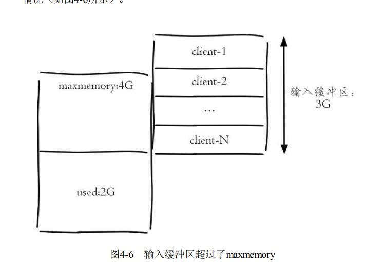
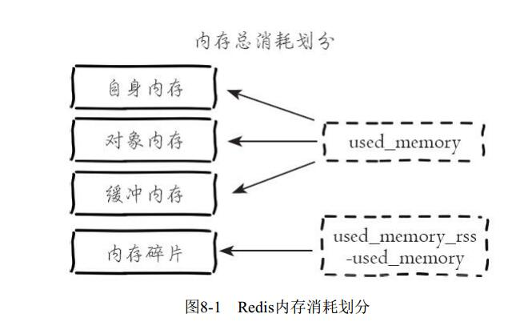

# 一、客户端API

```
1.client list
client list
client list 命令能列出与 redis 服务端相连的所有客户端连接信息
127.0.0.1:6379> client list
id=2 addr=127.0.0.1:58087 fd=9 name= age=328250 idle=0 flags=N db=0 sub=0 psub=0
 multi=-1 qbuf=0 qbuf-free=32768 obl=0 oll=0 omem=0 events=r cmd=client
127.0.0.1:6379>

```

## 1、标识  id、addr、fd、name

```
下面将选择几个重要的属性进行说明，其余通过表格的形式进行展示。
(1)标识 ： id、addr、fd、name
这四个属性属于客户端的标识
id : 客户端连接的唯一标识,这个 id 是随着 redis 的连接自增的，重启后会重置为 0.
addr: 客户端连接的 ip 和端口
fd: socket 的文件描述符，与 lsof 命令结果中的 fd 是同一个，如果 fd=-1 代表当前客户端不是外部客户端，而是 redis 内部的客户端
name: 客户端的名字，后面的 client setName 和 client getName 两个命令会对其进行说明。
```

## 2、输入缓冲区 qbuf、qbuf-free

### 1、输入缓冲区

```
(2)输入缓冲区 qbuf、qbuf-free
redis 为每个客户端分配了输入缓冲区，它的作用是将客户端发送的命令临时保存，同时 redis 会从输入缓冲区拉取命令并执行，输入缓冲区为客户端发送命令到 redis 提供了缓冲功能。
```


```
client list 中 qbuf 和 qbuf-free 分别代表这个缓冲区的总容量和剩余容量，redis 没有提供相应的配置来规定每个缓冲区的大小，输入缓冲区会根据输入内容大小的不同动态调整，只是要求每个客户端缓冲区的大小不能超过 1G, 超过后客户端将被关闭。
下面是Redis源码中对于输入缓冲区的硬编码：
/* Protocol and I/O related defines */
#define REDIS_MAX_QUERYBUF_LEN (1024*1024*1024) /* 1GB max query buffer. */
```

```
输入缓冲区不受 maxmenory 控制，假设一个 redis 实例设置了 maxmemory 为 4 G, 已经存储了 2G 数据, 但是如果此时输入缓冲区使用了 3G, 已经超过了 maxmemory 限制，可能会产生数据丢失、键值淘汰、 OOM 等情况
```



```
执行效果如下：
127.0.0.1:6390> info memory
# Memory
used_memory_human:5.00G
maxmemory_human:4.00G
```

```
上面已经看到，输入缓冲区使用不当造成的危害非常大，那么造成输入缓冲区过大的原因有哪些？ 输入缓冲区过大主要是因为 redis 的处理速度跟不上输入缓冲区的输入速度，并且每次进入输入缓冲区的命令包含了大量 bigkey，从而造成了输入缓冲区过大的情况。还有一种情况就是 redis 发生了阻塞，短期内不能处理命令，造成客户端输入的命令积压在了输入缓冲区，造成了输入缓冲区过大。
```

```
那么如何快速发现和监控呢？监控输入缓冲区异常的方法有两种：
通过定期执行 client list 命令, 收集 qbuf 和 qbuf-free 找到异常的连接记录并分析，最终找到可能出问题的客户端。

通过 info 命令的 info clients 模块，找到最大的输入缓冲区，例如下面命令中的其中client_biggest_input_buf代表最大的输入缓冲区，例如可以设置超过10M就进行报警：
127.0.0.1:6379> info clients
# Clients
connected_clients:1414
client_longest_output_list:0
client_biggest_input_buf:2097152
blocked_clients:0
```


```
输入缓冲区问题出现概率比较低，但是也要做好防范，在开发中要减少 bigkey、减少 redis 阻塞、合理的监控警报
```

## 3、输出缓冲区 obl、oll、omem

```
redis 为每个客户端分配了输出缓冲区，它的作用是保存命令执行的结果返回给客户端，为 redis 和客户端交互返回结果提供缓冲
```


```
与输入缓冲区不同的是，输出缓冲区的容量可以通过参数 client-output-buffer-limit 来进行设置，并且输出缓冲区做得更加细致，按照客户端的不同分为三种：普通客户端、发布订阅客户端、slave 客户端。
```


对应的配置规则是：

```shell
client-output-buffer-limit <class> <hard limit> <soft limit> <soft seconds>
```

```
<class>:客户端类型，分为三种
	a normal 普通客户端
	b slave slave 客户端 用于复制
	c pubsub 发布订阅客户端
	
<hard limit> 如果客户端使用的输出缓冲区大于<hard limit>,客户端会被立即关闭

<soft limit>和<soft seconds> 如果客户端使用的输出缓冲区超过了 <soft limit> 并且持续了 <soft limit>秒，客户端会被立即关闭。

redis 的默认配置是：
client-output-buffer-limit normal 0 0 0  (0 0 0 应该是指没有上限的意思。)
client-output-buffer-limit slave 256mb 64mb 60
client-output-buffer-limit pubsub 32mb 8mb 60
```

```
和输入缓冲区相同的是，输出缓冲区也不会受到 maxmemory 的限制，如果使用不当同样会造成 maxmemory 用满产生的数据丢失、键值对淘汰、OOM 等情况。
```

```
实际上输出缓冲区由两部分组成： 固定缓冲区(16KB) 和 动态缓冲区，其中固定缓冲区返回比较小的执行结果，而动态缓冲区返回比较大的结果，例如大的字符串、hgetall、smembers 命令的结果等，通过 redis 源码中 redis.h 的 redisClient 结构体(redis 3.2 版本变为 Client)可以看到两个缓冲区的实现细节： 
```

```c
typedef struct redisClient {
// 动态缓冲区列表
list *reply;
// 动态缓冲区列表的长度(对象个数)
unsigned long reply_bytes;
// 固定缓冲区已经使用的字节数
int bufpos;
// 字节数组作为固定缓冲区
char buf[REDIS_REPLY_CHUNK_BYTES];
} redisClient;
```

**固定缓冲区使用的是字节数组，动态缓冲区使用的是列表。**

```
固定缓冲区使用的是字节数组，动态缓冲区使用的是列表。当固定缓冲区存满后会将 redis 新的返回结果存放在动态缓冲区的队列中，队列中的每个对象就是每个返回结果
```


```
client list 中的 obl 代表固定缓冲区的长度，oll 代表动态缓冲区列表的长度，omem 代表使用的字节数。例如下面代表当前客户端的固定缓冲区的长度为 0, 动态缓冲区有 4869 个对象，两个部分共使用了 133081288字节=126M 内存：
id=7 addr=127.0.0.1:56358 fd=6 name= age=91 idle=0 flags=O db=0 sub=0 psub=0 multi=-1 qbuf=0 qbuf-free=0 obl=0 oll=4869 omem=133081288 events=rw cmd=monitor
```

### 监控输出缓冲区的方法

```
1、通过定期执行client list命令，收集obl、oll、omem找到异常的连接记录
并分析，最终找到可能出问题的客户端。

2、·通过info命令的info clients模块，找到输出缓冲区列表最大对象数，例
如：
127.0.0.1:6379> info clients
# Clients
connected_clients:502
client_longest_output_list:4869
client_biggest_input_buf:0
blocked_clients:0

```

```
其中，client_longest_output_list代表输出缓冲区列表最大对象数，这两
种统计方法的优劣势和输入缓冲区是一样的，这里就不再赘述了。相比于输
入缓冲区，输出缓冲区出现异常的概率相对会比较大，那么如何预防呢？方
法如下：

1、进行上述监控，设置阀值，超过阀值及时处理。
2、限制普通客户端输出缓冲区的，把错误扼杀在摇篮中，例如可以进行
如下设置：
client-output-buffer-limit normal 20mb 10mb 120

3、适当增大 slave 的输出缓冲区的，如果 master 节点写入较大，slave 客户端的输出缓冲区可能会比较大，一旦 slave 客户端连接因为输出缓冲区溢出被 kill， 会造成复制重连。

4、限制容易让输出缓冲区增大的命令，例如,高并发下的 monitor 命令就是一个危险的命令。

5、及时监控内存，一旦发现内存抖动频繁，可能就是输出缓冲区过大。
```


## 4、客户端的存活状态

```
client list 中的 age 和 idle 分别代表当前客户端已经连接的时间和最近一次的空闲时间：
id=2232080 addr=10.16.xx.55:32886 fd=946 name= age=603382 idle=331060 flags=N db=0
sub=0 psub=0 multi=-1 qbuf=0 qbuf-free=0 obl=0 oll=0 omem=0 events=r cmd=get

例如上面这条记录代表当期客户端连接Redis的时间为603382秒，其中
空闲了331060秒：
```

```
id=254487 addr=10.2.xx.234:60240 fd=1311 name= age=8888581 idle=8888581 flags=N db=0
sub=0 psub=0 multi=-1 qbuf=0 qbuf-free=0 obl=0 oll=0 omem=0 events=r cmd=get

例如上面这条记录代表当期客户端连接Redis的时间为8888581秒，其中
空闲了8888581秒，实际上这种就属于不太正常的情况，当age等于idle时，
说明连接一直处于空闲状态。

```

# 八、理解内存 

## 1、内存消耗

### 1、内存使用统计

```
首先需要了解Redis自身使用内存的统计数据， 可通过执行info memory
命令获取内存相关指标。 读懂每个指标有助于分析Redis内存使用情况， 表
8-1列举出内存统计指标和对应解释
```


```
需要重点关注的指标有：used_memory_rss 和 used_memory 以及它们的比值 mem_fragmentation_ratio.
```

```
当mem_fragmentation_ratio>1时， 说明used_memory_rss-used_memory多出
的部分内存并没有用于数据存储， 而是被内存碎片所消耗， 如果两者相差很
大， 说明碎片率严重。
```

```
当mem_fragmentation_ratio<1时， 这种情况一般出现在操作系统把Redis
内存交换（Swap） 到硬盘导致， 出现这种情况时要格外关注， 由于硬盘速
度远远慢于内存， Redis性能会变得很差， 甚至僵死。
```

### 2、内存消耗划分 

```
Redis进程内消耗主要包括： 自身内存+对象内存+缓冲内存+内存碎片，其中Redis空进程自身内存消耗非常少， 通常used_memory_rss在3MB左右，used_memory在800KB左右， 一个空的Redis进程消耗内存可以忽略不计。
```



#### 1、对象内存

```
对象内存是 redis 内存占用最大的一块，存储着用户所有的数据。redis所有的数据都采用 key对象和value对象。对象内存消耗可以简单理解为 sizeof(keys)+sizeof(values)。键对象键对象都是字符串， 在使用Redis时很容易忽略键对内存
消耗的影响， 应当避免使用过长的键。 value对象更复杂些， 主要包含5种基
本数据类型： 字符串、 列表、 哈希、 集合、 有序集合。 其他数据类型都是建
立在这5种数据结构之上实现的， 如： Bitmaps和HyperLogLog使用字符串实
现， GEO使用有序集合实现等。 每种value对象类型根据使用规模不同， 占
用内存不同。 在使用时一定要合理预估并监控value对象占用情况， 避免内
存溢出。
```

#### 2、缓冲内存

```
缓冲内存主要包括： 客户端缓冲、 复制积压缓冲区、 AOF缓冲区

从客户端： 主节点会为每个从节点单独建立一条连接用于命令复制，
默认配置是： client-output-buffer-limit slave256mb64mb60。 当主从节点之间
网络延迟较高或主节点挂载大量从节点时这部分内存消耗将占用很大一部
分， 建议主节点挂载的从节点不要多于2个， 主从节点不要部署在较差的网
络环境下， 如异地跨机房环境， 防止复制客户端连接缓慢造成溢出。
```

#### 3.内存碎片

```
Redis默认的内存分配器采用jemalloc， 可选的分配器还有： glibc、
tcmalloc。 内存分配器为了更好地管理和重复利用内存， 分配内存策略一般
采用固定范围的内存块进行分配。 例如jemalloc在64位系统中将内存空间划
分为： 小、 大、 巨大三个范围。 每个范围内又划分为多个小的内存块单位，
如下所示：
·小： [8byte]， [16byte， 32byte， 48byte， ...， 128byte]， [192byte，
256byte， ...， 512byte]， [768byte， 1024byte， ...， 3840byte]
·大： [4KB， 8KB， 12KB， ...， 4072KB]
·巨大： [4MB， 8MB， 12MB， ...]
```

```
比如当保存5KB对象时jemalloc可能会采用8KB的块存储， 而剩下的3KB空间变为了内存碎片不能再分配给其他对象存储。
```

```
数据对齐： 在条件允许的情况下尽量做数据对齐， 比如数据尽量采用
数字类型或者固定长度字符串等， 但是这要视具体的业务而定， 有些场景无
法做到。

·安全重启： 重启节点可以做到内存碎片重新整理， 因此可以利用高可
用架构， 如Sentinel或Cluster， 将碎片率过高的主节点转换为从节点， 进行
安全重启。
```

## 2 内存管理 

### 1、设置内存上限

```
Redis使用maxmemory参数限制最大可用内存。 限制内存的目的主要有：

·用于缓存场景， 当超出内存上限maxmemory时使用LRU等删除策略释放空间。
·防止所用内存超过服务器物理内存。
```

### 2、动态调整内存上限

```
Redis的内存上限可以通过config set maxmemory进行动态修改， 即修改
最大可用内存。 例如之前的示例， 当发现Redis-2没有做好内存预估， 实际
只用了不到2GB内存， 而Redis-1实例需要扩容到6GB内存才够用， 这时可以
分别执行如下命令进行调整：
Redis-1>config set maxmemory 6GB
Redis-2>config set maxmemory 2GB
```

**运维提示**

```
Redis默认无限使用服务器内存， 为防止极端情况下导致系统内存耗尽， 建议所有的Redis进程都要配置maxmemory。

在保证物理内存可用的情况下， 系统中所有Redis实例可以调整maxmemory参数来达到自由伸缩内存的目的。
```


### 3、内存回收策略

```
redis 的内存回收机制主要体现在一下两个方面：
-- 删除到达过期时间的键对象
-- 内存使用达到 maxmemory 上限时触发内存溢出控制策略


 删除过期键对象 和  内存溢出控制策略
```

#### 1、删除过期键对象

```
redis 所有的键都可以设置过期属性，内部保存在过期字典中。由于进程内保存大量的键，维护每个键精准的过期删除机制会导致消耗大量的 CPU, 对于单线程的 Redis 来说成本过高，因此 redis 采用惰性删除和定时任务删除机制实现过期键的内存回收。
```

#### 1、惰性删除

```
惰性删除用于当客户端读取带有超时属性的键时，如果已经超过键设置的过期时间，会执行删除操作并返回空，这种策略是出于节省 CPU 成本考虑，不需要单独维护 TTL 链来处理过期键的删除。但是单独用这种方式存在内存泄露的问题，当过期键一直没有访问将无法得到及时删除，从而导致内存不能及时释放。

就是访问的时候再检查，键是否过期 过期删除，但是由于这种方式会导致 redis 内存泄露，因为有大量无用的键没有删除
```

#### 2、定时任务删除

```
redis 内部维护一个定时任务，默认每秒运行 10 次(通过配置 hz 控制)。定时任务中删除过期键逻辑采用了自适应算法，根据键的过期比例、使用快慢两种速率模式回收键
```


```
流程说明
1、定时任务在每个数据库空间随机检查 20 个键，当发现过期删除对应的键
2、如果超过检查数25%的键过期，循环执行回收逻辑直到不足25%或运行超时为止，慢模式下超时时间为 25 毫秒
3、如果之前回收键逻辑时，则在 redis 触发内部事件之前再次以快模式运行回收过期键任务，快模式下超时时间为 1 毫秒且 2 秒内只能运行 1 次。
快慢两种模式内部删除逻辑相同， 只是执行的超时时间不同。
```

### 2、内存溢出控制策略

```
当 redis 所用内存达到 maxmemory 上限时会触发相应的溢出控制策略。
具体策略受 maxmemory-policy(策略) 参数控制，redis 支持 6 种策略；
```

```
1、noeviction (eviction 回收)
	默认策略，不会删除任何数据，拒绝所有写入操作并返回客户端错误信息 （error） OOM command not allowed when used memory， 此时Redis只响应读操作。
	
2、volatile(挥发)-lru ：根据 lru（Least Recently Used,即最近最久未使用的意思）算法删除设置了超时属性(expire)的键，直到腾出足够空间为止。如果没有可删除的键对象，回退到 noeviction 策略；

3、allkeys-lru： 根据LRU算法删除键， 不管数据有没有设置超时属性，直到腾出足够空间为止。

4、allkeys-random: 随机删除所有键，直到腾出足够空间为止。

5、volatile-random:随机阐述过期键，直到腾出足够空间为止。

6、volatile-ttl: 根据键值对象的ttl属性， 删除最近将要过期数据。 如果没有， 回退到noeviction策略。
```


```
内存溢出控制策略可以采用 config set maxmemory-policy{policy} 动态配置。redis 支持丰富的内存溢出应对策略，可以根据实际需求灵活定制，比如当设置 volatile-lru 策略时，保证具有过期属性的键可以根据LRU剔除， 而未设置超时的键可以永久保留。 还可以采用allkeys-lru策略把Redis变为纯缓存服务器使用。 当Redis因为内存溢出删除键时， 可以通过执行info stats命令查看evicted_keys指标找出当前Redis服务器已剔除的键数量。
```

```
每次Redis执行命令时如果设置了maxmemory参数， 都会尝试执行回收内存操作。 当Redis一直工作在内存溢出（used_memory>maxmemory） 的状态下且设置非noeviction策略时， 会频繁地触发回收内存的操作， 影响 Redis 服务器的性能。 

// 计算当前内存总量， 排除从节点输出缓冲区和AOF缓冲区的内存占用
// 如果当前使用小于等于maxmemory退出
// 如果设置内存溢出策略为noeviction（不淘汰） ， 返回错误。
// 计算需要释放多少内存
...
// 删除操作同步给从节点


```

```
建议线上Redis内存工作在maxmemory>used_memory状态下， 避免频繁
内存回收开销。
对于需要收缩Redis内存的场景， 可以通过调小maxmemory来实现快速
回收。 比如对一个实际占用6GB内存的进程设置maxmemory=4GB， 之后第一
次执行命令时， 如果使用非noeviction策略， 它会一次性回收到maxmemory指
定的内存量， 从而达到快速回收内存的目的。 注意， 此操作会导致数据丢失
和短暂的阻塞问题， 一般在缓存场景下使用。
```


## 3、内存优化

### 1、redisObejct 对象

```
redis 存储的所有值对象在内部定义为 redisObject 结构体，内部图：
```


```
redis 存储的数据都使用 redisObject 来封装，包括 string、hash、list、set、zset 在内的所有数据类型。
```

```
type 字段：表示当前对象使用的数据类型，redis 主要支持 5 种数据类型。 string、hash、list、set、zset。可以使用 type{key} 命令查看对象所属类型，type 命令返回的是值对象类型，键都是 string 类型。

encoding 字段:表示 redis 内部编码类型。encoding 在 redis 内部使用， 代表当前对象内部采用哪种数据结构来实现。

lru 字段：记录对象最后一次被访问的时间，当配置了 maxmemory 和 maxmemory-policy = volatile-lru 或者 allkeys-lru 时，用于辅助 LRU 算法删除键数据。可以使用 object idletime{key} 命令在不更新 lru 字段情况下查看当前键的空闲时间.

可以使用scan+object idletime命令批量查询哪些键长时间未被访问， 找
出长时间不访问的键进行清理， 可降低内存占用.

refcount 字段：记录当前对象被引用的次数，用于通过引用次数回收内存，当 refcount = 0 时，可以安全回收当前对象空间。使用 object refcount{key} 获取当前对象引用。当对象为整数且范围在 [0-9999]时，redis 可以使用共享对象的方式来节省内存。

.*ptr 字段：与对象的数据内容相关，如果是整数，直接存储数据；否则表示指向数据的指针。redis 在3.0之后对值对象是字符串且长度 <= 39 字节的数据，内部编码为 embstr 类型， 字符串sds和redisObject一起分配， 从而只要一次内存操作即可。

高并发写入场景中， 在条件允许的情况下， 建议字符串长度控制在39字节以内， 减少创建redisObject内存分配次数， 从而提高性能。
```

```
那么我们怎么来理解redisObjec结构的作用呢？为了便于操作，Redis采用redisObjec结构来统一五种不同的数据类型，这样所有的数据类型就都可以以相同的形式在函数间传递而不用使用特定的类型结构。同时，为了识别不同的数据类型，redisObjec中定义了type和encoding字段对不同的数据类型加以区别。简单地说，redisObjec就是string、hash、list、set、zset的父类，可以在函数间传递时隐藏具体的类型信息，只是C语言中没有“继承”的概念，所以作者抽象了redisObjec结构来到达同样的目的。
```


### 2、共享对象池

```
共享对象池是指 redis 内部维护 [0-9999] 的整数对象池。创建大量的整数类型 redisObject 存在内存开销，每个 redisObject 内部结构至少占 16 字节，甚至超过了证书自身空间消耗。所以 redis 内部维护一个[0-9999]的整数对象池， 用于节约内存。 除了整数值对象， 其他类型如list、 hash、 set、 zset内部元素也可以使用整数对象池。 因此开发中在满足需求的前提下， 尽量使用整数对象以节省内存。
```

```
整数对象池在Redis中通过变量REDIS_SHARED_INTEGERS定义， 不能通过配置修改。 可以通过object refcount命令查看对象引用数验证是否启用整数对象池技术， 如下：

redis> set foo 100
OK
redis> object refcount foo
(integer) 2
redis> set bar 100
OK
redis> object refcount bar
(integer) 3

设置键foo等于100时， 直接使用共享池内整数对象， 因此引用数是2，
再设置键bar等于100时， 引用数又变为3， 如图8-8所示。
```


```
使用共享对象池后， 相同的数据内存使用降低30%以上。 可见当数据大量使用[0-9999]的整数时， 共享对象池可以节约大量内存。 需要注意的是对象池并不是只要存储[0-9999]的整数就可以工作。 当设置maxmemory并启用LRU相关淘汰策略如： volatile-lru， allkeys-lru时， Redis禁止使用共享对象池
```

为什么开启maxmemory和LRU淘汰策略后对象池无效？

```
LRU算法需要获取对象最后被访问时间， 以便淘汰最长未访问数据， 每
个对象最后访问时间存储在redisObject对象的lru字段。 对象共享意味着多个
引用共享同一个redisObject， 这时lru字段也会被共享， 导致无法获取每个对
象的最后访问时间。 如果没有设置maxmemory， 直到内存被用尽Redis也不
会触发内存回收， 所以共享对象池可以正常工作。
```

```
综上所述， 共享对象池与maxmemory+LRU策略冲突， 使用时需要注
意。 对于ziplist编码的值对象， 即使内部数据为整数也无法使用共享对象
池， 因为ziplist使用压缩且内存连续的结构， 对象共享判断成本过高， ziplist
编码细节后面内容详细说明
```

为什么只有整数对象池

```
首先整数对象池复用的几率最大，其次对象共享的一个关键操作就是判断相等性，
Redis之所以只有整数对象池， 是因为整数比较算法时间复杂度
为O（1） ， 只保留一万个整数为了防止对象池浪费。 如果是字符串判断相
等性， 时间复杂度变为O（n） ， 特别是长字符串更消耗性能（浮点数在
Redis内部使用字符串存储） 。 对于更复杂的数据结构如hash、 list等， 相等
性判断需要O（n2） 。 对于单线程的Redis来说， 这样的开销显然不合理， 因
此Redis只保留整数共享对象池。
```

### 3、字符串优化

```
字符串对象是Redis内部最常用的数据类型。 所有的键都是字符串类
型， 值对象数据除了整数之外都使用字符串存储。 比如执行命令： lpush
cache： type"redis""memcache""tair""levelDB"， Redis首先创建"cache： type"键
字符串， 然后创建链表对象， 链表对象内再包含四个字符串对象， 排除
Redis内部用到的字符串对象之外至少创建5个字符串对象。 可见字符串对象
在Redis内部使用非常广泛， 因此深刻理解Redis字符串对于内存优化非常有
帮助
```

#### 1、字符串结构

```
edis没有采用原生C语言的字符串类型而是自己实现了字符串结构， 内部简单动态字符串（simple dynamic string， SDS） 
```


```
Redis自身实现的字符串结构有如下特点：
·O（1） 时间复杂度获取： 字符串长度、 已用长度、 未用长度。
·可用于保存字节数组， 支持安全的二进制数据存储。
·内部实现空间预分配机制， 降低内存再分配次数。
·惰性删除机制， 字符串缩减后的空间不释放， 作为预分配空间保留。
```

#### 2.预分配机制 

```
因为字符串（SDS） 存在预分配机制， 日常开发中要小心预分配带来的内存浪费， 例如表8-3的测试用例
```


```
阶段1插入新的字符串后， free字段保留空间为 0，总占用空间 = 实际占用空间 + 1字节， 最后1字节保存‘\0’标示结尾， 这里忽略int类型len和free字段
消耗的8字节。 在阶段1原有字符串上追加60字节数据空间占用如图8-11所
示。
```


追加操作后字符串对象预分配了一倍容量作为预留空间， 而且大量追加 操作需要内存重新分配， 造成内存碎片率（mem_fragmentation_ratio） 上 升。 直接插入与阶段2相同数据的空间占用， 如图8-12所示。    


阶段3直接插入同等数据后， 相比阶段2节省了每个字符串对象预分配的 空间， 同时降低了碎片率。

```
字符串之所以采用预分配的方式是防止修改操作需要不断重分配内存和
字节数据拷贝。 但同样也会造成内存的浪费。 字符串预分配每次并不都是翻
倍扩容， 空间预分配规则如下：
1） 第一次创建len属性等于数据实际大小， free等于0， 不做预分配。

2） 修改后如果已有free空间不够且数据小于1M， 每次预分配一倍容量。 如原有len=60byte， free=0， 再追加60byte， 预分配120byte， 总占用空间： 60byte+60byte+120byte+1byte。

3） 修改后如果已有free空间不够且数据大于1MB， 每次预分配1MB数
据。 如原有len=30MB， free=0， 当再追加100byte， 预分配1MB， 总占用空
间： 1MB+100byte+1MB+1byte。

尽量减少字符串频繁修改操作如append、 setrange， 改为直接使用set修
改字符串， 降低预分配带来的内存浪费和内存碎片化。
```

#### 3、字符串重构

```
字符串重构： 指不一定把每份数据作为字符串整体存储， 像json这样的数据可以使用hash结构， 使用二级结构存储也能帮我们节省内存。 同时可以使用hmget、 hmset命令支持字段的部分读取修改， 而不用每次整体存取。 例如下面的json数据：
```

```json
{
"vid": "413368768",
"title": "搜狐屌丝男士",
"videoAlbumPic":"http://photocdn.sohu.com/60160518/vrsa_ver8400079_ae433_pic26.jpg",
"pid": "6494271",
"type": "1024",
"playlist": "6494271",
"playTime": "468"
}
```

分别使用字符串和hash结构测试内存表现， 如表8-4所示    


```
根据测试结构， 第一次默认配置下使用hash类型， 内存消耗不但没有降
低反而比字符串存储多出2倍， 而调整hash-max-ziplist-value=66之后内存降
低为535.60M。 因为json的videoAlbumPic属性长度是65， 而hash-max-ziplistvalue默认值是64， Redis采用hashtable编码方式， 反而消耗了大量内存。 调
整配置后hash类型内部编码方式变为ziplist， 相比字符串更省内存且支持属
457性的部分操作。 下一节将具体介绍ziplist编码优化细节。
```


### 4、编码优化

#### 1.了解编码 

 ```json
Redis对外提供了string、 list、 hash、 set、 zet等类型， 但是Redis内部针对
不同类型存在编码的概念， 所谓编码就是具体使用哪种底层数据结构来实
现。 编码不同将直接影响数据的内存占用和读写效率。 使用object
encoding{key}命令获取编码类型。 如下所示：
 ```

```
redis> set str:1 hello
OK
redis> object encoding str:1
"embstr" // embstr编码字符串
redis> lpush list:1 1 2 3
(integer) 3
redis> object encoding list:1
"ziplist" // ziplist编码列表
```


#### 2、控制编码类型

```
编码类型转换在Redis写入数据时自动完成， 这个转换过程是不可逆
的， 转换规则只能从小内存编码向大内存编码转换。
```

```
以上命令体现了list类型编码的转换过程， 其中Redis之所以不支持编码
回退， 主要是数据增删频繁时， 数据向压缩编码转换非常消耗CPU， 得不偿
失。 以上示例用到了list-max-ziplist-entries参数， 这个参数用来决定列表长度
在多少范围内使用ziplist编码。 当然还有其他参数控制各种数据类型的编
460码， 如表8-6所示。
```


```\
理解编码转换流程和相关配置之后， 可以使用config set命令设置编码相
关参数来满足使用压缩编码的条件。 对于已经采用非压缩编码类型的数据如
hashtable、 linkedlist等， 设置参数后即使数据满足压缩编码条件， Redis也不
会做转换， 需要重启Redis重新加载数据才能完成转换.
```

#### 3、ziplist 编码

```
ziplist编码主要目的是为了节约内存， 因此所有数据都是采用线性连续
的内存结构。 ziplist编码是应用范围最广的一种， 可以分别作为hash、 list、
zset类型的底层数据结构实现。 首先从ziplist编码结构开始分析， 它的内部结
构类似这样： <zlbytes><zltail><zllen><entry-1><entry-2><....><entry-n>
<zlend>。 一个ziplist可以包含多个entry（元素） ， 每个entry保存具体的数据
（整数或者字节数组） ， 内部结构如图8-14所示。
```


```
ziplist 结构字段含义：

1）zlbytes: 记录整个压缩列表所占字节长度，方便重新调整 ziplist 空间。类型是 int-32,长度为 4 字节。

2）zltail: 记录距离尾节点的偏移量，方便尾节点弹出操作。类型是 Int-32，长度为 4 字节。

3）zllen: 记录压缩链表节点数量，当长度超过216-2时需要遍历整个列表获取长度，一般很少见。类型是int-16,长度为 2 字节。

4）entry 记录具体的节点，长度根据实际存储的数据而定。

	a) prevv_entry_bytes_length:记录前一个节点所占空间，用于快速定位上一个节点，可实现列表反向迭代。
	b) encoding: 标志当前节点编码和长度，前两位表示编码类型：字符串/整数，其余位表示数据长度。
	c) contents: 保存节点的值，针对实际数据长度做内存占用优化

5）zlend：记录列表结尾，占用一个字节。
```

```
根据以上对ziplist字段说明， 可以分析出该数据结构特点如下：

·内部表现为数据紧凑排列的一块连续内存数组。
·可以模拟双向链表结构， 以O（1） 时间复杂度入队和出队。
·新增删除操作涉及内存重新分配或释放， 加大了操作的复杂性。
·读写操作涉及复杂的指针移动， 最坏时间复杂度为O（n2） 。
·适合存储小对象和长度有限的数据。

下面通过测试展示ziplist编码在不同类型中内存和速度的表现， 如表8-7所示。
```


```
测试数据采用100W个36字节数据， 划分为1000个键， 每个类型长度统
一为1000。 从测试结果可以看出：
1） 使用ziplist可以分别作为hash、 list、 zset数据类型实现。
2） 使用ziplist编码类型可以大幅降低内存占用。
3） ziplist实现的数据类型相比原生结构， 命令操作更加耗时， 不同类型
耗时排序： list<hash<zset。
ziplist压缩编码的性能表现跟值长度和元素个数密切相关， 正因为如此
Redis提供了{type}-max-ziplist-value和{type}-max-ziplist-entries相关参数来做
控制ziplist编码转换。 最后再次强调使用ziplist压缩编码的原则： 追求空间和
时间的平衡。
```

```
针对性能要求较高的场景使用ziplist， 建议长度不要超过1000， 每个元素大小控制在512字节以内。

命令平均耗时使用info Commandstats命令获取， 包含每个命令调用次数、 总耗时、 平均耗时， 单位为微秒。
```

#### 4、intset 编码

```
intset编码是集合（set） 类型编码的一种， 内部表现为存储有序、 不重
复的整数集。 当集合只包含整数且长度不超过set-max-intset-entries配置时被
启用。 

以上命令可以看出intset对写入整数进行排序， 通过O（log（n） ） 时间
复杂度实现查找和去重操作， intset编码结构如图8-15所示。
```


```
intset 的字段结构含义：

1）encoding： 整数表示类型，根据集合内最长整数值确定类型，整数类型划分为三种： 
int-16、int -32、int-64；

2）length: 表示集合元素个数

3）contents: 整数数组，按从小到大顺序保存

intset 保存的整数类型根据长度划分，当保存的整数超出当前类型时，将会触发自动升级操作且升级后不再做回退。升级操作将会导致重新申请内存空间，把原有数据按转换类型后拷贝到新数组。
```

```
使用intset编码的集合时， 尽量保持整数范围一致， 如都在int-16范围内。 防止个别大整数触发集合升级操作， 产生内存浪费。
```


```
根据以上测试结果发现intset表现非常好， 同样的数据内存占用只有不
到hashtable编码的十分之一。 intset数据结构插入命令复杂度为O（n） ， 查询
命令为O（log（n） ） ， 由于整数占用空间非常小， 所以在集合长度可控的
基础上， 写入命令执行速度也会非常快， 因此当使用整数集合时尽量使用
intset编码。 表8-8测试第三行把ziplist-hash类型也放入其中， 主要因为intset
编码必须存储整数， 当集合内保存非整数数据时， 无法使用intset实现内存
优化。 这时可以使用ziplist-hash类型对象模拟集合类型， hash的field当作集
合中的元素， value设置为1字节占位符即可。 使用ziplist编码的hash类型依然
比使用hashtable编码的集合节省大量内存.
```

#### 5、控制键的数量

```
当使用Redis存储大量数据时， 通常会存在大量键， 过多的键同样会消
耗大量内存。 Redis本质是一个数据结构服务器， 它为我们提供多种数据结
构， 如hash、 list、 set、 zset等。 使用Redis时不要进入一个误区， 大量使用
get/set这样的API， 把Redis当成Memcached使用。 对于存储相同的数据内容
利用Redis的数据结构降低外层键的数量， 也可以节省大量内存。 如图8-16
所示， 通过在客户端预估键规模， 把大量键分组映射到多个hash结构中降低
键的数量。
```


```
hash结构降低键数量分析：

·根据键规模在客户端通过分组映射到一组hash对象中， 如存在100万个键， 可以映射到1000个hash中， 每个hash保存1000个元素.

·hash的field可用于记录原始key字符串， 方便哈希查找。

·hash的value保存原始值对象， 确保不要超过hash-max-ziplist-value限制
```


```
通过这个测试数据， 可以说明：
·同样的数据使用ziplist编码的hash类型存储比string类型节约内存。
·节省内存量随着value空间的减少越来越明显。
·hash-ziplist类型比string类型写入耗时， 但随着value空间的减少， 耗时逐渐降低。
```

```
使用hash重构后节省内存量效果非常明显， 特别对于存储小对象的场景， 内存只有不到原来的1/5。 下面分析这种内存优化技巧的关键点：

1） hash类型节省内存的原理是使用ziplist编码， 如果使用hashtable编码方式反而会增加内存消耗。

2） ziplist长度需要控制在1000以内， 否则由于存取操作时间复杂度在O（n） 到O（n2） 之间， 长列表会导致CPU消耗严重， 得不偿失。

3） ziplist适合存储小对象， 对于大对象不但内存优化效果不明显还会增加命令操作耗时。

4） 需要预估键的规模， 从而确定每个hash结构需要存储的元素数量。

5） 根据hash长度和元素大小， 调整hash-max-ziplist-entries和hash-maxziplist-value参数， 确保hash类型使用ziplist编码。
```

**关于hash键和field键的设计：**  

```
1)当键离散度较高时，可以按字符串位截取，把后三位作为哈希的 field, 之前作为哈希的键。如： key=1948480哈希key=group： hash：1948， 哈希field=480。
```

```
2)当键离散度较低时，可以使用哈希算法打散键，如： 使用 crc32(key)&10000 函数把所有的键映射到“0-9999”整数范围内， 哈希field存储键的原始值
```

```
3)尽量减少 hash 键和 field 的长度，如使用部分键内容。
```

```
使用hash结构控制键的规模虽然可以大幅降低内存， 但同样会带来问
题， 需要提前做好规避处理。 如下所示：

·客户端需要预估键的规模并设计hash分组规则， 加重客户端开发成本。
·hash重构后所有的键无法再使用超时（expire） 和LRU淘汰机制自动删除， 需要手动维护删除。
·对于大对象， 如1KB以上的对象， 使用hash-ziplist结构控制键数量反而得不偿失。

不过瑕不掩瑜， 对于大量小对象的存储场景， 非常适合使用ziplist编码的hash类型控制键的规模来降低内存。
```

**开发提示：**

```
使用ziplist+hash优化keys后， 如果想使用超时删除功能， 开发人员可以
存储每个对象写入的时间， 再通过定时任务使用hscan命令扫描数据， 找出
hash内超时的数据项删除即可。
```

```
1） Redis实际内存消耗主要包括： 键值对象、 缓冲区内存、 内存碎片。
2） 通过调整maxmemory控制Redis最大可用内存。 当内存使用超出时，
根据maxmemory-policy控制内存回收策略。
3） 内存是相对宝贵的资源， 通过合理的优化可以有效地降低内存的使
用量， 内存优化的思路包括：
内存是相对宝贵的资源， 通过合理的优化可以有效地降低内存的使
用量， 内存优化的思路包括：
·精简键值对大小， 键值字面量精简， 使用高效二进制序列化工具。
·使用对象共享池优化小整数对象。
·数据优先使用整数， 比字符串类型更节省空间。
·优化字符串使用， 避免预分配造成的内存浪费。
·使用ziplist压缩编码优化hash、 list等结构， 注重效率和空间的平衡。
·使用intset编码优化整数集合。
·使用ziplist编码的hash结构降低小对象链规模。
```


