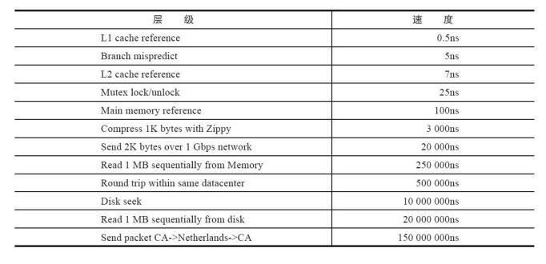

谷歌公司给出的各层级硬件执行速度 



```
寄存器 1cycle
L1 1ns 3-4cycle
L2 3ns 10cycle
L3 15ns 45cycle 共享
memory 100ns 
disk 1000W ns 1 毫秒=1000微妙  1微秒=1000纳秒
disk 也是 10毫秒
```


# 1、 配置、启动、操作、关闭Redis 

```
redis 安装之后，src和/usr/local/bin 目录下多了几个以redis开头可执行文件
```


## 1、启动 redis

```
有三种方法启动Redis：默认配置、运行配置、配置文件启动。
```

### 1、默认配置

```shell
redis-server
```


```
可以看到直接使用redis-server启动Redis后，会打印出一些日志，通过
日志可以看到一些信息，上例中可以看到：
当前的 redis 版本的是 3.0.503
Redis 的默认端口是 6379
redis 建议要使用配置文件来启动
因为直接启动无法自定义配置，所以这种方式是不会在生产环境中使用的。
```

### 2、运行启动

```
redis-server加上要修改配置名和值（可以是多对），没有设置的配置将
使用默认配置：
# redis-server --configKey1 configValue1 --configKey2 configValue2
例如，如果要用6380作为端口启动Redis，那么可以执行
# redis-server --port 6380
虽然运行配置可以自定义配置，但是如果需要修改的配置较多或者希望
将配置保存到文件中，不建议使用这种方式。
```

### 3、配置文件启动

```
将配置写到指定文件里，例如我们将配置写到了 /opt/redis/redis.conf 中，那么只需要执行如下命令即可启动Redis：
# redis-server /opt/redis/redis.conf
```

```
Redis有60多个配置，这里只给出一些重要的配置（参见表1-3），其他
配置会随着不断深入学习进行介绍，第14章会将所有的配置说明进行汇总。
```


```
redis 目录下都会有一个redis.conf配置文件，里面就是Redis的默认配置，通常来讲我们会在一台机器上启动多个Redis，并且将配置集中管理在指定目录下，而且配置不是完全手写的，而是将redis.conf作为模板进行修改。

显然通过配置文件启动的方式提供了更大的灵活性，所以大部分生产环境会使用这种方式启动Redis。
```


## 2、redis 命令行客户端

### 1、交互式方式链接客户端

```
通过redis-cli-h{host}-p{port}的方式连接到Redis
服务，之后所有的操作都是通过交互的方式实现，不需要再执行redis-cli
了，例如：
redis-cli -h 127.0.0.1 -p 6379
127.0.0.1:6379> set hello world
OK
127.0.0.1:6379> get hello
"world"
```

### 2、命令方式

```
：用redis-cli-h ip{host}-p{port}{command}就可以直
接得到命令的返回结果，例如：
redis-cli -h 127.0.0.1 -p 6379 get hello
"world"
```

```
这里有两点要注意：1）如果没有-h参数，那么默认连接127.0.0.1；如果没有-p，那么默认6379端口，也就是说如果-h和-p都没写就是连接127.0.0.1：6379这个Redis实例。
```

### 3、停止Redis服务

```
Redis提供了shutdown命令来停止Redis服务，例如要停掉127.0.0.1上
6379端口上的Redis服务，可以执行如下操作
$ redis-cli shutdown
```

```
日志输出如下:

# User requested shutdown... #客户端发出的shutdown命令
* Saving the final RDB snapshot before exiting.
#保存RDB持久化文件(有关Redis持久化的特性在1.2节已经进行了简单的介绍，RDB是Redis的一种
持久化方式)
* DB saved on disk #将RDB文件保存在磁盘上
# Redis is now ready to exit, bye bye... #关闭
```

```
1）Redis关闭的过程：断开与客户端的连接、持久化文件生成，是一种
相对优雅的关闭方式。
2）除了可以通过shutdown命令关闭Redis服务以外，还可以通过kill进程
号的方式关闭掉Redis，但是不要粗暴地使用kill-9强制杀死Redis服务，不但
不会做持久化操作，还会造成缓冲区等资源不能被优雅关闭，极端情况会造
成AOF和复制丢失数据的情况。
3）shutdown还有一个参数，代表是否在关闭Redis前，生成持久化文
件： redis-cli shutdown nosave|save
```

# 2、API的理解和使用 

## 1、全局命令

```
1、查看所有键
keys *
2、键总数
dbsize
会返回当前数据库中键的总数
dbsize命令在计算键总数时不会遍历所有键，而是直接获取redis内置的键总数变量，所以dbsize命令的时间复杂度是O(1).而keys命令会遍历所有键，所以它的时间复杂度是O(n)，当redis保存了大量键时，线上环境禁止使用
3、检查键是否存在
exists key
4、删除键
del key [key...]
5、键过期
expire key seconds
查询键的时间
ttl 命令会返回键的剩余过期时间，它有3种返回值：
大于等于0的整数：键剩余的过期时间
-1：键没设置过期时间
-2：键不存在

```


```shell
6、键的数据结构类型
type key

127.0.0.1:6379> set a b
OK
127.0.0.1:6379> type a
string
127.0.0.1:6379> rpush mylist a b c d e f g
(integer) 7
127.0.0.1:6379> type mylist
list
```


## 2、数据结构和内部编码

```
type 命令实际返回的是当前键的数据结构类型，它们分别是：string(字符串)、hash(哈希)、list(列表)、set(集合)、zset(有序集合)，但这些只是 redis 对外的数据结构。

实际上每种数据结构都有自己底层的内部编码实现，而且是多种实现，这样Redis会在合适的场景选择合适的内部编码，如图2-2所示。

可以通过object encoding命令查询内部编码：

127.0.0.1:6379> object encoding hello
"embstr"
127.0.0.1:6379> object encoding mylist
"ziplist"
```


```
redis 这样设计有两个好处：第一，可以改进内部编码，而对外的数据结构和命令没有影响，这样一旦开发出更优秀的内部编码，无需改动外部数
据结构和命令，例如Redis3.2提供了quicklist，结合了ziplist和linkedlist两者
的优势，为列表类型提供了一种更为优秀的内部编码实现，而对外部用户来
说基本感知不到。第二，多种内部编码实现可以在不同场景下发挥各自的优
势，例如ziplist比较节省内存，但是在列表元素比较多的情况下，性能会有
所下降，这时候Redis会根据配置选项将列表类型的内部实现转换为
linkedlist。
```

## 3、单线程架构

```
每次客户端调用都经历
了发送命令、执行命令、返回结果三个过程。
其中第2步是重点要讨论的，因为Redis是单线程来处理命令的，所以一条命令从客户端达到服务端不会立刻被执行，所有命令都会进入一个队列中，然后逐个被执行。
但是有多个客户端其命令的执行顺序是不确定的。
```

### 1、为什么单线程还能这么快

```
1、纯内存访问，redis将所有数据放在内存中，内存的响应时长大约为100纳秒，这是Redis达到每秒万级别访问的重要基础

2、非阻塞I/O, redis 使用 epoll 作为I/O多路复用技术的实现，再加上Redis自身的事件处理模型将epoll中的连接、读写、关闭都转换为事件，不在网络I/O上浪费过多的时间
```


```
3、单线程避免了线程切换he竞态生产的消耗
```

```
既然采用单线程就能达到如此高的性能，那么也不失为一种不错的选
择，因为单线程能带来几个好处：第一，单线程可以简化数据结构和算法的
实现。如果对高级编程语言熟悉的读者应该了解并发数据结构实现不但困难
而且开发测试比较麻烦。第二，单线程避免了线程切换和竞态产生的消耗，
对于服务端开发来说，锁和线程切换通常是性能杀手。
```

```
但是单线程会有一个问题：对于每个命令的执行时间是有要求的。如果
某个命令执行过长，会造成其他命令的阻塞，对于Redis这种高性能的服务
来说是致命的，所以Redis是面向快速执行场景的数据库。
```


## 4、字符串

### 1、介绍

```
字符串类型是Redis最基础的数据结构。首先键都是字符串类型，而且
其他几种数据结构都是在字符串类型基础上构建的，所以字符串类型能为其
他四种数据结构的学习奠定基础。

字符串类型的值实际可以
是字符串（简单的字符串、复杂的字符串（例如JSON、XML））、数字
（整数、浮点数），甚至是二进制（图片、音频、视频），但是值最大不能
超过512MB。
```


### 2、命令

#### 1、普通命令

```
1、设置值
set key value [ex seconds] [px milliseconds] [nx|xx]
    set命令有几个选项：
    ·ex seconds：为键设置秒级过期时间。
    ·px milliseconds：为键设置毫秒级过期时间。
    ·nx：键必须不存在，才可以设置成功，用于添加。
    ·xx：与nx相反，键必须存在，才可以设置成功，用于更新。
    
2、setex 和 setnx
setex 设置秒级别过期时间
setnx 键必须不存在，才可以设置成功，用于添加

3、mset 批量设置值
4、mget 批量获取值
如果有些键不存在，那么它的值为nil（空），结果是按照传入键的顺序返回
```

```
批量操作命令可以有效提高开发效率，假如没有mget这样的命令，要执
行n次get命令需要按照图2-8的方式来执行，具体耗时如下：
n次get时间 = n次网络时间 + n次命令时间

使用了 mget 需要执行
n次get时间 = 1次网络时间 + n次命令时间
```


```
Redis可以支撑每秒数万的读写操作，但是这指的是Redis服务端的处理
能力，对于客户端来说，一次命令除了命令时间还是有网络时间，假设网络
时间为1毫秒，命令时间为0.1毫秒（按照每秒处理1万条命令算），那么执
行1000次get命令和1次mget命令的区别如表2-1，因为Redis的处理能力已经
足够高，对于开发人员来说，网络可能会成为性能的瓶颈
```


#### 2、自增命令

```
自增命令
incr(自增)命令，Redis提供了decr（自减）、incrby（自增指定数字）、
decrby（自减指定数字）、incrbyfloat（自增浮点数）

incr 命令用于对值做自增操作，返回结果分为三种情况：
值不是整数，返回错误。
值是整数，返回自增后的结果。
键不存在，按照值为0自增，返回结果为1。

很多存储系统和编程语言内部使用CAS机制实现计数功能，会有一定的
CPU开销，但在Redis中完全不存在这个问题，因为Redis是单线程架构，任
何命令到了Redis服务端都要顺序执行。
```


#### 3、不常用命令

```
append key value  append可以向字符串尾部追加值
strlen key 字符串长度
getset key value  设置并返回设置前的原值
    127.0.0.1:6379> getset hello world
    (nil)
    127.0.0.1:6379> getset hello redis
    "world"
    
setrange key offset value 设置指定位置的字符
    127.0.0.1:6379> set redis pest
    OK
    127.0.0.1:6379> setrange redis 0 b
    (integer) 4
    127.0.0.1:6379> get redis
    "best"

getrange key start end	获取部分字符串
start和end分别是开始和结束的偏移量，偏移量从0开始计算
```

### 3、内部编码

```
字符串类型的内部编码有3种
int：8个字节的长整型。
embstr：小于等于39个字节的字符串。
raw：大于39个字节的字符串。

整数类型
127.0.0.1:6379> set key 8653
OK
127.0.0.1:6379> object encoding key
"int"

短字符串类型
#小于等于39个字节的字符串：embstr
127.0.0.1:6379> set key "hello,world"
OK
127.0.0.1:6379> object encoding key
"embstr"

长字符串类型
#大于39个字节的字符串：raw
127.0.0.1:6379> set key "one string greater than 39 byte........."
OK
127.0.0.1:6379> object encoding key
"raw"
127.0.0.1:6379> strlen key
(integer) 40
```

### 4、典型使用场景 

#### 1、缓存

开发提示

```
与MySQL等关系型数据库不同的是，Redis没有命令空间，而且也没有
对键名有强制要求（除了不能使用一些特殊字符）。但设计合理的键名，有
利于防止键冲突和项目的可维护性，比较推荐的方式是使用“业务名：对象
名：id：[属性]”作为键名（也可以不是分号）。例如MySQL的数据库名为
vs，用户表名为user，那么对应的键可以用"vs：user：1"，"vs：user：1：
name"来表示，如果当前Redis只被一个业务使用，甚至可以去掉“vs：”。如
果键名比较长，例如“user：{uid}：friends：messages：{mid}”，可以在能描
述键含义的前提下适当减少键的长度，例如变为“u：{uid}：fr：m：
{mid}”，从而减少由于键过长的内存浪费。
```

```
如果没有从Redis获取到用户信息，需要从MySQL中进行获取，并将
结果回写到Redis，添加1小时（3600秒）过期时间：

// 从MySQL获取用户信息
userInfo = mysql.get(id);
// 将userInfo序列化，并存入Redis
redis.setex(userRedisKey, 3600, serialize(userInfo));
// 返回结果
return userInfo
```

#### 2、限速

```
很多应用出于安全的考虑，会在每次进行登录时，让用户输入手机验证
码，从而确定是否是用户本人。但是为了短信接口不被频繁访问，会限制用
户每分钟获取验证码的频率，例如一分钟不能超过5次
```

```java
此功能可以使用Redis来实现，下面的伪代码给出了基本实现思路：

phoneNum = 138_xxxx_xxxx;
key = "shortMsg:limit:"+phoneNum;
//SET key value EX 60 NX
is Exists = redis.set(key,1,"EX 60","NX");
if(isExists != null || redis.incr(key) <= 5) {
    // 通过
} else {
    // 限速
}
```

### 字符串类型命令的时间复杂度


## 5、哈希

### 1、命令

```
1、设置值
hset key field value
如果设置成功会返回1，反之会返回0。此外Redis提供了hsetnx命令，它
们的关系就像set和setnx命令一样，只不过作用域由键变为field。
	nx 不存在设置 存在不设置
	xx 和 nx 相反
	ex 秒过期 px 毫秒过期

hget key field  获取值
hdel key field [field]   删除 field
hlen key 计算 field 个数
hmget key field [field ...]  
hmset key field value [field value ...]
hexists key field 判断 field 是否存在
hkeys key 获取所有 field 
hvals key 获取所有的 value
keys * 获取所有key
dbsize 获取当前数据库所有 Key 数
hgetall key 获取所有 field:value 键值对
```

### 开发提示

```
在使用 hgetall 时，如果哈希元素个数比较多，会存在阻塞 redis 的可能。如果开发人员只需要获取部分 field,可以使用 hmget 如果一定要获取全部field-value，可以使用hscan命令，该命令会渐进式遍历哈希类型，hscan将在2.7节介绍

hincrby hincrbyfloat
hincrby key field
hincrbyfloat key field
hincrby和hincrbyfloat，就像incrby和incrbyfloat命令一样，但是它们的作
用域是filed。
```

```
计算 value 的字符串长度(需要redis3.2以上)
hstrlen key field
```

### 2、哈希类型命令的时间复杂度


### 3、内部编码

```
ziplist（压缩列表）：当哈希类型元素个数小于hash-max-ziplist-entries
配置（默认512个）、同时所有值都小于hash-max-ziplist-value配置（默认64
字节）时，Redis会使用ziplist作为哈希的内部实现，ziplist使用更加紧凑的
结构实现多个元素的连续存储，所以在节省内存方面比hashtable更加优秀。


·hashtable（哈希表）：当哈希类型无法满足ziplist的条件时，Redis会使
用hashtable作为哈希的内部实现，因为此时ziplist的读写效率会下降，而
hashtable的读写时间复杂度为O（1）。
```

```
1、当field个数比较少且没有大的value时，内部编码为ziplist：
127.0.0.1:6379> hmset hashkey f1 v1 f2 v2
OK
127.0.0.1:6379> object encoding hashkey
"ziplist"

2、当有value大于64字节，内部编码会由ziplist变为hashtable：
127.0.0.1:6379> hset hashkey f3 "one string is bigger than 64 byte...忽略..."
OK
127.0.0.1:6379> object encoding hashkey
"hashtable"

3、当field个数超过512，内部编码也会由ziplist变为hashtable：
127.0.0.1:6379> hmset hashkey f1 v1 f2 v2 f3 v3 ...忽略... f513 v513
OK
127.0.0.1:6379> object encoding hashkey
"hashtable"
```


