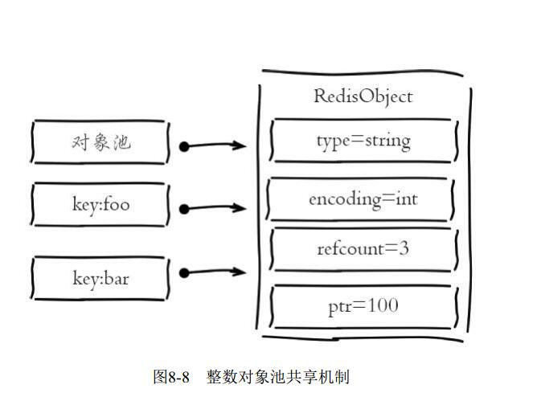
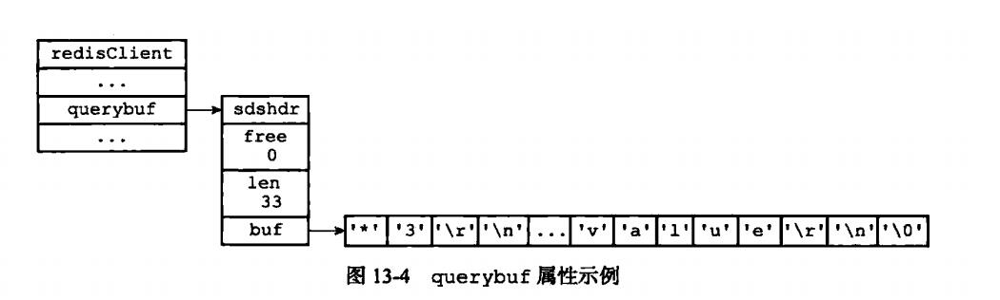
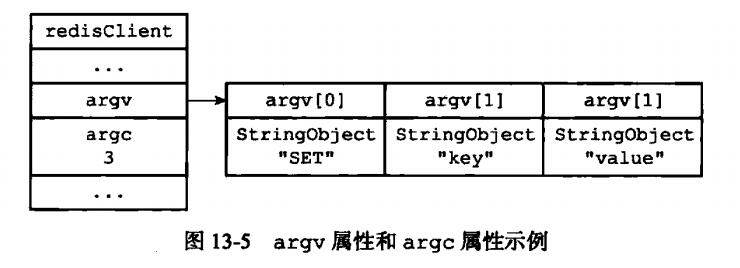

## 1、客户端简介

```
redis 服务器是典型的一对多服务器程序：一个服务器可以与多个客户端建立网络链接，每个客户端可以向服务器发送命令请求，而服务器则接收并处理客户端发送的命令请求，并向客户端返回命令回复。
```

```
通过使用由I/O多路复用技术实现的文件事件处理器，redis 服务器使用单线程单进程的方式来处理命令请求，并与多个客户端进行网络通信。

对于每个与服务器进行链接的客户端，服务器都为这些客户端建立了相应的 redis.h/redisClient 结构(客户端 状态)，这个结构保存了客户端当前的状态信息，以及执行相关功能时需要用到的数据结构。
 > 客户端的套接字描述符
 > 客户端的名字
 > 客户端的标志值(flag)
 > 指向客户端正在使用的数据库的指针，以及该数据库的号码。
 > 客户端当前要执行的命令、命令的参数、命令参数的个数，以及指向命令实现函数的指针。
 > 客户端的输入缓冲区和输出缓冲区
 > 客户端的复制状态信息，以及进行复制所需的数据结构
 > 客户端执行BRPOP、BLPOP等列表阻塞命令时使用的数据结构
 > 客户端的事务状态，以及执行WATCH命令时用到的数据结构
 > 客户端执行发布与订阅功能时用到的数据结构
 > 客户端的身份验证标志
 > 客户端的创建时间，客户端和服务器最后一次通信的时间，以及客户端的输出缓冲区大小超出软性限制(soft limit)的时间。
 
 redis 服务器状态结构的 clients 属性是一个链表，这个链表保存了所有与服务器链接的客户端的状态结构，对客户端执行批量操作，或者查找某个指定的客户端，都可以通过遍历 clients 链表来完成：
 
 struct redisServer {
     //...
     // 一个链表，保存了所有的客户端状态
     list *clients;
     //...
 }
```

## 2、客户端的属性

```
客户端状态包含的属性可以分为两类：
	一类是比较通用的属性，这些属性很少与特定功能相关，无论客户端执行的是什么工作，它们都要用到这些属性。
	另外一类是和特定功能相关的属性，比如操作数据库时需要用到的 db 属性和 dictid 属性，执行事务时需要用到的 mstate 属性，以及执行 WATCH 命令时需要用到的 watched_keys 属性等等;
```

### 1、套接字描述符

```
客户端状态的 fd 属性记录了客户端正在使用的套接字描述符：
	typedef struct redisClient {
        int fd;
	}
	
根据客户端的不同，fd 属性的值可以是 -1 或者是大于 -1 的整数：
   伪客户端(fake client)的 fd 属性的值为 -1：伪客户端处理的命令请求来源于 AOF 文件或者 Lua 脚本，而不是网络，所以这种客户端不需要套接字链接，自然也不需要记录套接字描述符。目前只有两个地方会用到伪客户端
   	一个用于载入 AOF 文件并还原数据库状态，
   	另一个用于执行 Lua 脚本中包含的 redis 命令。
   	

普通客户端的 fd 属性的值为大于 -1 的整数：普通客户端使用套接字来与服务器进行通信，所以服务器会用 fd 属性来记录客户端套接字的描述符。因为合法的套接字描述符不能是 -1,所以普通客户端的套接字描述符必然是大于 -1 的整数

执行 client list 命令可以列出目前所有连接到服务器的普通客户端，命令输出中的 fd 域显示了服务器链接客户端所使用的套接字描述符：
redis> client list
addr = 127.0.0.1:53428 fd = 6 name = age= 1242 idle = 0 ...
```

### 2、名字

```
在默认情况下，一个连接到服务器的客户端是没有名字的。
使用 client setname 命令可以为客户端设置一个名字，让客户端的身份变得更清晰。
如果客户端没有为自己设置名字，那么相应的客户端状态的 name 属性指向 null 指针;相反的，如果客户端为自己设置了名字，那么 name 属性将指向一个字符串对象，而该对象就保存着客户端的名字;

typedef struct redisClient {
    robj *name;
}
```

### 共享对象池

```
共享对象池里面 type 是 string 底层是 embstr 还是 raw 看底层
encoding = int 因为其他 linkedList 什么的底层嵌套这 stringObject 也就是 RedisObejct 的子类，也可以引用共享对象池里面的数据
```



## 3、标志

```
客户端的标志属性 flags 记录了客户端的角色(role),以及客户端目前所处的状态： 
typedef struct redisClient {
    int flags;
}
flags 属性的值可以是单个标志：
也可以是多个标志的二进制
每个标志使用一个常量表示，一部分标志记录了客户端的角色：
	标志现在不没有必要知道 放弃
```

## 4、输入缓冲区

```
输入缓冲区
客户端状态的输入缓冲区用于保存客户端发送的命令请求：
typedef struct redisClient {
    sds querybuf;
}
举个例子，如果客户端向服务器发送了以下命令请求：
set key value
3\r\n$3\r\nSET\r\n......

输入缓冲区的大小会根据输入内容动态的缩小或者扩大，但它的最大大小不能超过 1GB，否则服务器将关闭这个客户端
```



## 5、命令与命令参数

```
在服务器将客户端发送的命令请求保存到客户端状态的 querybuf 属性之后，服务器将对命令请求的内容进行分析，并将得出的命令参数以及命令参数的个数分别保存到客户端状态的 argv 属性和 argc 属性：
	typedef struct redisClient {
        robj *argv;
        int argc;
	}
	argv 属性是一个数组，数组中的每个项都是一个字符串对象，其中 argv[0] 是要执行的命令，而之后的其他项则是传给命令的参数。
	argc 属性则负责记录 argv 数组的长度
```




## 6、输出缓冲区

```
执行命令所得的命令回复会被保存在客户端状态的输出缓冲区里面，每个客户端都有两个输出缓冲区可用，一个缓冲区的大小是固定的，另一个缓冲区大小是可变的；
固定大小的缓冲区用于保存那些长度比较小的回复，比如：OK,简短的字符串值、整数值、错误回复等等；

可变大小的缓冲区用于保存那些长度比较大的回复，臂如一个非常长的字符串值，一个由很多项组成的列表，一个包含了很多元素的集合等等;
```

```
客户端的固定大小缓冲区由 buf 和 bufpos 两个属性组成：
typedef struct redisClient {
    char buf[REDIS_REPLY_CHUNK_BYTES];
    int bufpos;
}

buf 是一个数组，bufpos 记录了数组目前已使用的字节数量；
REDIS_REPLY_CHUNK_BYTES 常量目前的默认值为 16*1024,也即是说，buf 数组的默认大小为 16KB;
当 buf 数组的空间已经用完，或者回复因为太大而没办法放进 Buf 数组里面时，服务器就会开始使用可变大小缓冲区;
```


