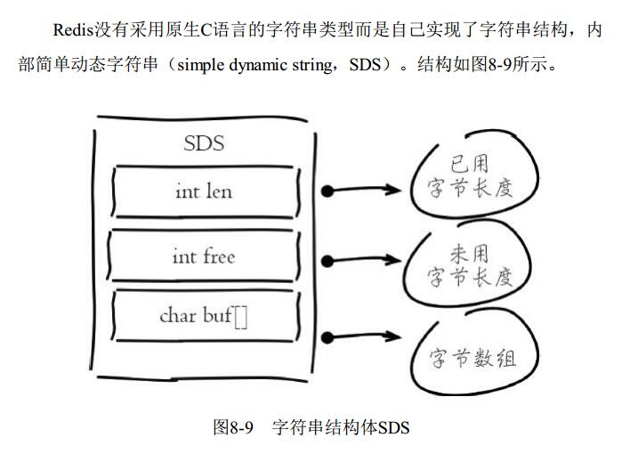
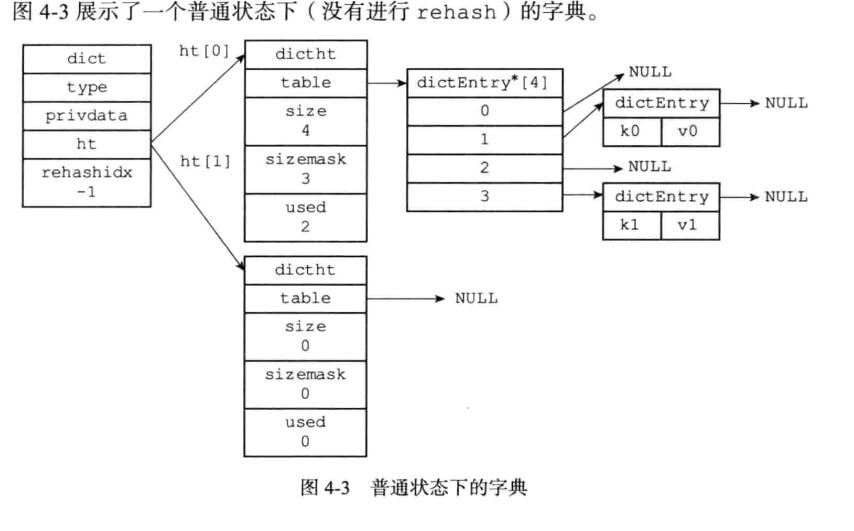
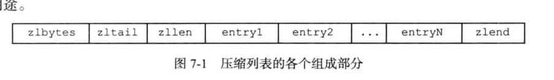
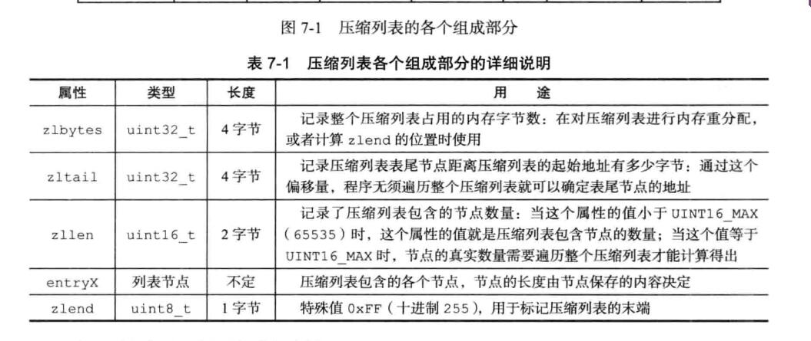
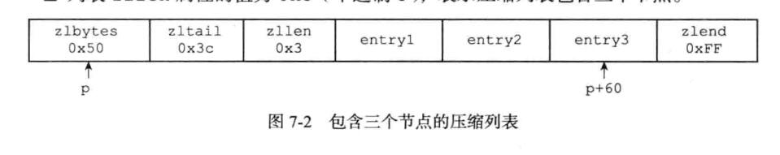
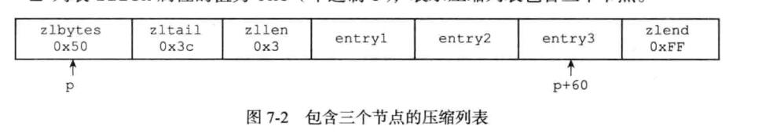

## 1、简单动态字符串



```
O(1) 时间复杂度获取： 字符串长度、已用长度、未用长度。
可用于保存字节数组，支持安全的二进制数据保存
内部实现空间预分配机制，降低内存再分配次数。
惰性删除机制，字符串缩减以后的空间不释放，作为预分配空间保留
```

```
第一次创建爱你 len 属性等于数据实际大小， free 等于 0，不做预分配
追加后如果已有 free 空间不够且数据小于 1m.为其分配和 len 一样大小的 free
如果free空间不够且数据大于 1m 为其分配 1m
```

```
为什么要有预分配空间，因为频繁的追加会导致不停的申请内存和数据拷贝。会造成内存碎片率上升。 内存都是被分配成一定规格的大小的臂如 8k 然后你的数据可能只有 5k 那么那 3k就是内存碎片无法被利用;
```

## 2、链表

```
redis的链表实现的特性：
双端：链表节点带有 prev 和 next 指针，获取某个节点的前置节点和后置节点的复杂度都是 O(1)

无环：表头节点的 prev 指针和表尾节点的 next 指针都指向 null; 对链表的访问以 null 为终点

带表头指针和表尾指针：通过 List 结构的 head 指针和 tail 指针，程序获取链表的表头节点和表尾节点的复杂度 O(1)

带链表长度计数器： 程序使用 list 结构的 len 属性来对 List 持有的链表节点进行技数，程序获取链表中节点数量的复杂度 O(1).

多态：链表节点使用 void* 指针来保存节点值，并且可以通过 list 结构的 dup、free、match 三个属性为节点值设置类型特定函数，所以链表可以用于保存各种不同类型的值。
```

## 3、字典(Dict)

### 1、简介

```c
typedef struct dict {
    // 类型特定函数
    dictType *type;
    // 私有数据
    void *privdata;
    // 哈希表
    dictht ht[2];
    // rehash 索引
    // 当 rehash 不在进行时，值为 -1
    in trehashidx;// -1
} dict;
```

```
	ht 属性是一个包含两个项的数组，数组中的每个项都是一个 dictht 哈希表，一般情况下，字典只使用 ht[0] 哈希表，ht[1] 哈希只会在对 ht[0] 哈希表进行 rehash 时使用。
	除了 ht[1]之外，另一个和 rehash 有关的属性就是 rehashidex, 它记录了 rehash 目前的进度，如果目前没有在进行的 rehash, 那么它的值为 -1;
```



### 2、键冲突

```
使用 链表的形式链接，添加在表头 是只有 next 的单向链表
```

### 3、rehash

redis 对字典的哈希表执行 rehash;

```
扩展和收缩
1、为字典 ht[1]哈希表分配空间；
	*如果执行的是扩展操作，那么 ht[1]的大小为第一个大于等于 ht[0].used*2 的 2^n 
	*如果执行的是收缩操作，那么 ht[1]的大小为第一个大于等于 ht[0].used 的 2^n
	
2、将保存在 ht[0] 中的所有键值对 rehash 到 ht[1] 上面：rehash 指的是重新计算键的哈希值和索引值，然后将键值对放置到 ht[1] 哈希表的指定位置上。

3、当 ht[0] 包含的所有键值对都迁移到了 ht[1]之后(ht[0]变为空表)，释放 ht[0] ,将 ht[1] 设置为 ht[0],并在 ht[1]新创建一个空白哈希表，为下一次 rehash 做准备；
```

### 4、哈希表的扩展与收缩条件

```
当以下条件中的任意一个被满足时，程序会自动开始对哈希表执行扩展操作：
1) 服务器目前没有执行 bgsave 或 bgrewriteAOF ，并且哈希表的负载因子大于等于1;

2) 服务器正在执行 bgsave 或 bgrewriteAOF ，并且哈希表的负载因子大于等于5;

哈希表的负载因子公式
 负载因子 = 哈希表以保存的节点数量 / 哈希表大小
 ht[0].used/ht[0].size
 
 另一方面，当哈希表的负载因子小于 0.1 时，程序自动开始对哈希表执行收缩操作
```

### 5、渐进式 rehash

```
扩展或收缩哈希表需要将 ht[0] 里面的所有键值对 rehash 到 ht[1]里面，但是，这个 rehash 动作不是一次性、集中式完成的，而是分多次、渐进式的完成的。
这样做的原因在于，如果 ht[0] 里只保存着四个键值对，那么服务器可以在瞬间就将这些键值对全部 rehash 到 ht[1]; 但是大量的键值对 1 亿个比如；庞大的计算量可能会导致服务器在一段时间内停止服务。

所以是渐进式的
```

```
以下是哈希表渐进式 rehash 的详细步骤：
1) 为 ht[1] 分配空间，让字典同时持有 ht[0] 和 ht[1] 两个哈希表;
2) 在字典中维持一个索引计数器变量 rehashidx. 并将它的值设置为 0; 表示 rehash 工作正式开始。
3) 在 rehash 进行期间，每次对字典执行添加、删除、查找或者更新操作时，程序除了执行执行的操作以外，还会顺带将 ht[0] 哈希表在 rehashidx 索引上的所有键值对 rehash 到 ht[1], 当 rehash 工作完成之后，程序将 rehashidx  属性的值增加 1;
4) 随着字典操作的不断执行，最终在某个时间点上，ht[0]的所有键值对后会被 rehash 到ht[1],这时程序将 rehashidx 属性的值设为 -1；表示 rehash 操作已完成；

渐进式 rehash 的好处在于它采取分而治之的方式，将 rehash 键值对所需的计算工作均摊到对字典的每个添加、删除、查找和更新操作上，从而避免了集中式的 rehash 而带来的庞大计算量；
```

```
渐进式 rehash 执行期间的哈希表操作
	因为在进行渐进式 rehash 的过程中，字典会同时使用 ht[0] 和 ht[1] 两个哈希表，所以在渐进式 rehash 进行期间，字典的删除 查找 更新等操作会在两个哈希表上进行。 
	例如：要在字典里面查找一个键的话，程序会先在 ht[0] 里面进行查找，如果没找到的话，就会继续到 ht[1] 里面进行查找。
	另外，在渐进式 rehash 执行期间，新添加到字段的键值对一律会被保存到 ht[1] 里面，而 ht[0] 则不再进行任何添加操作，这一措施保证了 ht[0] 包含的键值对数量会只减不增，并随着 rehash 操作的执行而最终变成空表；
```

## 4、整数集合

```c
整数集合(intset) 是 redis 用于保存整数值的集合抽象数据结构，他可以保存类型为 int16_t、int32_t、int64_t 的整数值，并且保证集合中不会出现重复元素。

typedef struct intset{
// 编码方式
uint32_t encoding;
// 集合包含的元素数量
uint32_t length;
// 保存元素的数组
int8_t contents[];
} intset;

contents 数组是整数集合的底层实现:整数集合的每个元素都是 contents 数组的一个数组项（item），各个项在数组中按值的大小从小到大有序的排列，并且不包含任何重复项；

```

```
升级
每当我们要讲一个新元素添加到整数集合里面，并且新元素的类型比整数集合现有所有元素的类型都要长时，整数集合需要先进行升级，然后才能将新元素添加到整数集合里面。

比如 int16_t 的数组，添加了一个 int32_t 的元素，所有的元素就要升级到 int32_t

不能降级
```

## 5、压缩列表

```
压缩列表 ziplist 是列表键和哈希键的底层实现之一。当一个列表键只包含少量列表项，并且每个列表项要么就是小整数值，要么就是长度比较短的字符串，那么 redis 就会使用压缩列表来做列表键的底层实现；
```

### 1、压缩列表的构成

```
压缩列表是 redis 为了节约内存开发的，是有一系列特殊编码的连续内存块组成的顺序型数据结构。一个压缩列表可以包含任意多个节点(entry)，每个节点可以保存一个字节数组或者一个整数值。
```







```
zlbytes uint32_t 4字节
	用途：记录整个压缩列表占用的内存字节数：在对压缩列表进行内存重分配，或者计算 zlend 的位置时使用；
	
zltail uint32_t 4字节
	用途：记录压缩列表尾节点距离压缩列表的起始地址有多少节点：通过这个偏移量，程序无需遍历整个压缩列表就可以确定表尾节点的地址
	
zllen uint16_t 2字节 
	用途：记录了压缩列表包含的节点数量：当这个属性的值小于 uint16_MAX(65535)时，这个属性的值就是压缩列表包含节点的数量；当这个值等于 uint16_MAX 时，节点的真实数量需要遍历整个压缩列表才能计算得出;

entryX 列表节点 不定
	用途：压缩列表包含的各个节点，节点的长度由节点保存的内容决定；

zlend uint8_t 1字节 
	特殊值 0xFF(十进制数 255)，用于标记压缩列表的末端
```



```
列表 zlbytes 属性的值为 0x50(十进制 80)，表示压缩列表的总长为 80 字节
列表 zltail 属性的值为 0x3c(十进制 60)，这表示如果我们有一个指向压缩列表起始地址的指针 p, 那么只要用指针 p 加上偏移量 60，就可以计算出表尾节点 entry3 的地址;
列表 zllen 属性的值为 0x3(十进制3)，表示压缩列表包含三个节点。
```




