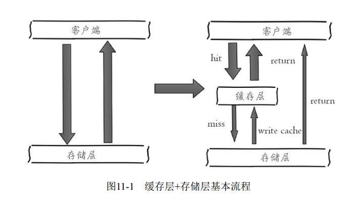
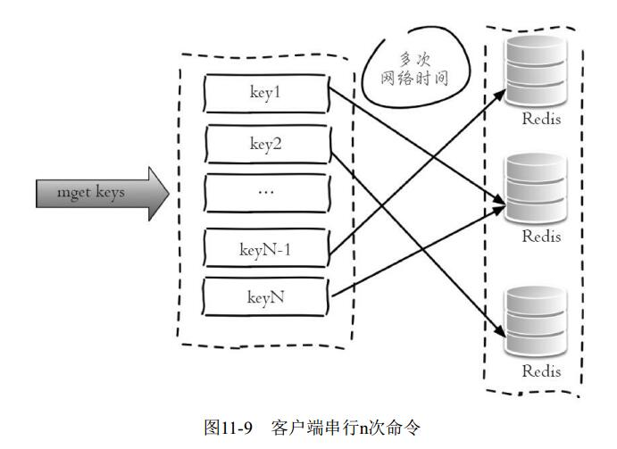
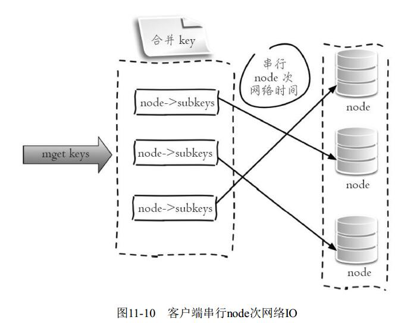
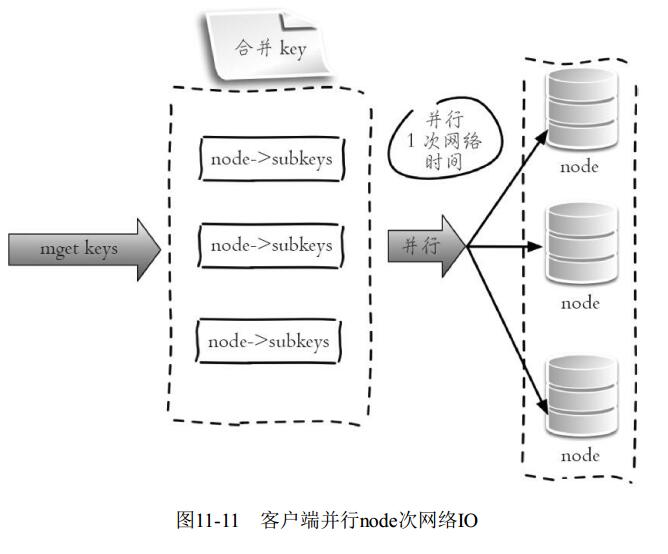
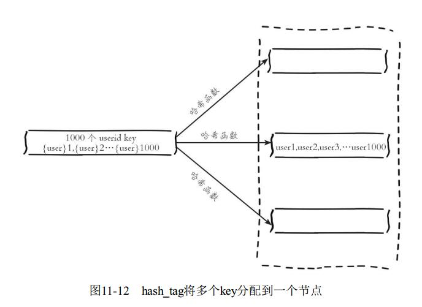
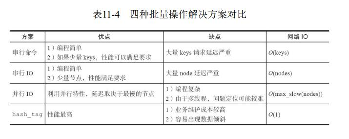
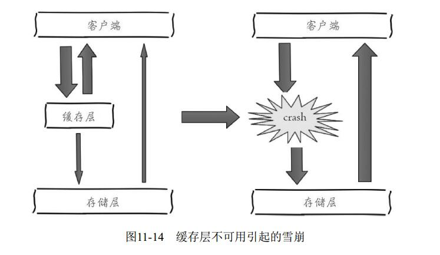
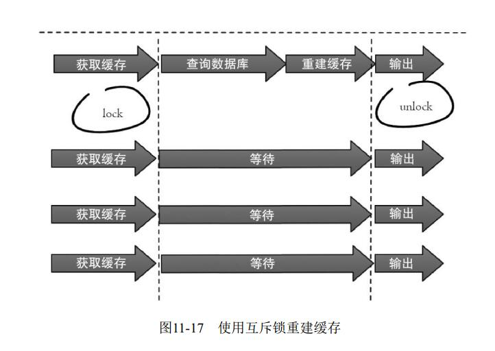
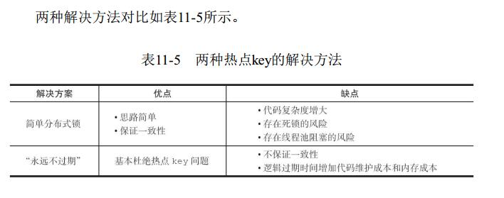

**第11章 缓存设计**     

```
缓存能够有效地加速应用的读写速度， 同时也可以降低后端负载， 对日
常应用的开发至关重要。 但是将缓存加入应用架构后也会带来一些问题， 本
章将针对这些问题介绍缓存使用技巧和设计方案， 包含如下内容：
·缓存的收益和成本分析。
·缓存更新策略的选择和使用场景。
·缓存粒度控制方法。
·穿透问题优化。
·无底洞问题优化。
·雪崩问题优化。
·热点key重建优化。
```

## 1、缓存的收益和成本

**收益：**

```
加速读写： 因为缓存通常都是全内存的（例如Redis、 Memcache） ， 而
存储层通常读写性能不够强悍（例如MySQL） ， 通过缓存的使用可以有效
地加速读写， 优化用户体验。
·降低后端负载： 帮助后端减少访问量和复杂计算（例如很复杂的SQL
语句） ， 在很大程度降低了后端的负载。
```



**成本如下：**

```
·数据不一致性： 缓存层和存储层的数据存在着一定时间窗口的不一致性， 时间窗口跟更新策略有关。

·代码维护成本： 加入缓存后， 需要同时处理缓存层和存储层的逻辑，增大了开发者维护代码的成本。

·运维成本： 以Redis Cluster为例， 加入后无形中增加了运维成本。
```

```
缓存的使用场景基本包含如下两种:
开销大的复杂计算：以MySQL为例子， 一些复杂的操作或者计算（例
如大量联表操作、 一些分组计算） ， 如果不加缓存， 不但无法满足高并发
量， 同时也会给MySQL带来巨大的负担。

·加速请求响应： 即使查询单条后端数据足够快（例如select*from table
where id=） ， 那么依然可以使用缓存， 以Redis为例子， 每秒可以完成数万
次读写， 并且提供的批量操作可以优化整个IO链的响应时间。
```

## 2、缓存更新策略

```
缓存中的数据通常都是有生命周期的，需要在指定时间后被删除或更
新， 这样可以保证缓存空间在一个可控的范围。 但是缓存中的数据会和数据
源中的真实数据有一段时间窗口的不一致， 需要利用某些策略进行更新。 下
面将分别从使用场景、 一致性、 开发人员开发/维护成本三个方面介绍三种
缓存的更新策略
```

### 1、LRU/LFU/FIFO算法剔除

**使用场景**

```
剔除算法通常用于缓存使用量超过了预设的最大值时候，如何对现有的数据进行剔除。例如 redis 使用 maxmemory-policy 这个配置作为内存最大值后对于数据的剔除策略。
```

**一致性**

```
要清理哪些数据是由具体算法决定， 开发人员只能决定使用哪种算法， 所以数据的一致性是最差的
```

**维护成本**

```
算法不需要开发人员自己来实现， 通常只需要配置最大maxmemory和对应的策略即可。 开发人员只需要知道每种算法的含义， 选择适合自己的算法即可。
```

### 2.超时剔除

**使用场景**

```
超时剔除通过给缓存数据设置过期时间，让其在过期时间后自动删除，例如 redis 提供的 expire 命令。如果业务可以容忍一段时间内，缓存层数据和存储层数据不一致，那么可以为其设置过期时间。在数据过期后，再从真实数据源获取数据，重新放到缓存并设置过期时间。 例如一个视频的描述信息， 可以容忍几分钟内数据不一致， 但是涉及交易方面的业务，后果可想而知。
```

**一致性**

```
一段时间窗口内（取决于过期时间长短） 存在一致性问题， 即缓存数据和真实数据源的数据不一致。
```

**维护成本**

```
维护成本不是很高，只需设置 expire 过期时间既可，当然前提是应用方允许这段时间可能发生的数据不一致。
```

### 3.主动更新 

**使用场景**   

```
应用方对于数据的一致性要求高， 需要在真实数据更新后，立即更新缓存数据。 例如可以利用消息系统或者其他方式通知缓存更新.
```

**一致性**

```
一致性最高， 但如果主动更新发生了问题， 那么这条数据很可能很长时间不会更新， 所以建议结合超时剔除一起使用效果会更好。
```

**维护成本**

```
维护成本会比较高， 开发者需要自己来完成更新， 并保证更新操作的正确性。
```


```
·低一致性业务建议配置最大内存和淘汰策略的方式使用。
·高一致性业务可以结合使用超时剔除和主动更新， 这样即使主动更新出了问题， 也能保证数据过期时间后删除脏数据
```

3、缓存粒度控制  (自己考虑)

## hash_tag 

```
/* 使用{和}之间的有效部分计算槽 */

127.0.0.1:6379> cluster keyslot key:test:111
(integer) 10050
127.0.0.1:6379> cluster keyslot key:{hash_tag}:111
(integer) 2515
127.0.0.1:6379> cluster keyslot key:{hash_tag}:222
(integer) 2515

如果键内容包含{和}大括号字符， 则计算槽的有效部分是括号内的内容； 否则采用键的全内容计算槽
```

## 4 、穿透优化 

```
建议使用 布隆过滤器 (有 redis 实现版本)
```

## 5、无底洞优化 

### 1、串行命令

```
由于n个key是比较均匀地分布在Redis Cluster的各个节点上， 因此无法
使用mget命令一次性获取， 所以通常来讲要获取n个key的值， 最简单的方法
就是逐次执行n个get命令， 这种操作时间复杂度较高， 它的操作时间=n次网
713络时间+n次命令时间， 网络次数是n。 很显然这种方案不是最优的， 但是实
现起来比较简单， 如图11-9所示
```




### 2、串行IO

```
2.串行IORedis Cluster使用CRC16算法计算出散列值， 再取对16383的余数就可以
算出slot值， 同时10.5节我们提到过Smart客户端会保存slot和节点的对应关
系， 有了这两个数据就可以将属于同一个节点的key进行归档， 得到每个节
点的key子列表， 之后对每个节点执行mget或者Pipeline操作， 它的操作时间
=node次网络时间+n次命令时间， 网络次数是node的个数， 整个过程如图11-
10所示， 很明显这种方案比第一种要好很多， 但是如果节点数太多， 还是有
一定的性能问题。
```



### 3、并行IO

```
此方案是将方案2中的最后一步改为多线程执行， 网络次数虽然还是节
点个数， 但由于使用多线程网络时间变为O（1） ， 这种方案会增加编程的
复杂度。 它的操作时间为：
max_slow(node网络时间)+n次命令时间
```



### 4、hash_tag实现 

```
10.5节介绍了Redis Cluster的hash_tag功能， 它可以将多个key强制分配到
一个节点上， 它的操作时间=1次网络时间+n次命令时间， 如图11-12所示。

这个不好因为集群就是为了降低压力,而我们强行将其放到了一个节点一个槽上面
```






## 6、雪崩优化

```
由于缓存层承载着大量请求， 有效地
保护了存储层， 但是如果缓存层由于某些原因不能提供服务， 于是所有的请
求都会达到存储层， 存储层的调用量会暴增， 造成存储层也会级联宕机的情
况。 缓存雪崩的英文原意是stampeding herd（奔逃的野牛） ， 指的是缓存层
宕掉后， 流量会像奔逃的野牛一样， 打向后端存储
```



## 7、热点key重建优化

```
开发人员使用"缓存+过期时间"的策略即可以加速数据读写，又保证数据的定期更新，这种模式七本能够满足绝大部分需求。但是有两个问题如果同时出现，可能就会对应用造成致命的危害：

1、当前 key 是一个热点 key(例如一个热门的娱乐新闻)，并发量非常大。
2、重建缓存不能在短时间完成，可能是一个复杂计算，例如复杂的 sql、多次IO、多个依赖等
3、在缓存失效的瞬间，有大量线程来重建缓存，造成后端负载加大，甚至可能会让应用奔溃。
```

要解决这个问题也不是很复杂，但是不能为了解决这个问题给系统带来更多的麻烦，所以需要制定如下目标：

```
1、减少重建缓存的次数
2、数据尽可能一致。
3、较少的潜在危险。
```

### 1、互斥锁 mutex key

```
此方法只允许一个线程重建缓存，其他线程等待重建缓存的线程执行完，重新从 缓存获取数据即可。
```



下面代码使用Redis的setnx命令实现上述功能：    

```java
String get(String key) {
    // 从 redis 中获取数据
    String value = reids.get(key);
    // 如果 value 为空，则开始重构缓存
    if(value == null) {
        // 只允许一个线程重构缓存，使用 nx. 并设置过期时间 ex
        String mutexKey = "mutex:key" + key;
        if(redis.set(mutexKey, "1", "ex 180", "nx")) {
            // 从数据源获取数据
            value = db.get(key);
            // 回写 redis, 并设置过期时间
            redis.setex(key, timeout, value);
        }
        // 其他线程休息 50 毫秒后重试
    	else {
        	Thread.sleep(50);
        	get(key);
    	}
 	}
    return value;
}
```

```
1)从 redis 获取数据，如果值不为空，则直接返回值;否则执行下面的 2.1) 和 2.2)步骤。
```

```
2.1)如果set(nx和ex)结果为true,说明此时没有其他线程重建缓存，那么当前线程执行缓存构建逻辑。

2.2)如果 set(nx和ex)结果为 false,说明此时已经有其他线程正在执行构建缓存的工作，那么当前线程将休息指定时间（例如这里是 50 毫秒，取决于构建缓存的速度）后，重新执行函数，知道获取到数据。
```

### 2、永不过期

```
"永不过期"包含两层意思：
1、从缓存层面来看，确实没有设置过期时间，所以不会出现 key 过期后产生的问题，也就是"物理"不过期。
2、从功能层面上来看，为每个 value 设置一个逻辑过期时间，当发现超过逻辑过期时间后，会使用单独的线程去构建缓存。

从实战看，此方法有效杜绝了热点 key 产生的问题，但唯一不足的就是重构缓存期间，会出现数据不一致的情况，这取决于应用方是否容忍这种不一致的情况，这取决于应用方是否容忍这种不一致。
```

```java
long logicTimeout = v.getLogicTimeout();
// 如果逻辑过期时间小于当前时间，开始后台构建
if(v.logicTimeout <= System.currentTimeMillis()) {
    String mutexKey = "mutex:key:"+key;
    if(redis.set(mutexKey, "1", "ex 180", "nx")) {
        // 重构缓存
        threadPool.execute(new Runnable()) {
            public void run() {
                String dbValue = db.get(key);
                redis.set(key, (dbvalue, newLogicTimeout));
                redis.delete(mutexKey);
            }
        }
    }
    return value;
}
```

```
作为一个并发量较大的应用，在使用缓存时有三个目标：
第一，加快用户访问速度，提高用户体验。
第二，降低后端负载，减少潜在的风险，保证系统平稳。
第三，保证数据"尽可能"及时更新。
```

```
互斥锁（mutex key） ： 这种方案思路比较简单， 但是存在一定的隐
患， 如果构建缓存过程出现问题或者时间较长， 可能会存在死锁和线程池阻
塞的风险， 但是这种方法能够较好地降低后端存储负载， 并在一致性上做得
比较好。

“永远不过期”： 这种方案由于没有设置真正的过期时间， 实际上已经
不存在热点key产生的一系列危害， 但是会存在数据不一致的情况， 同时代
码复杂度会增大
```




