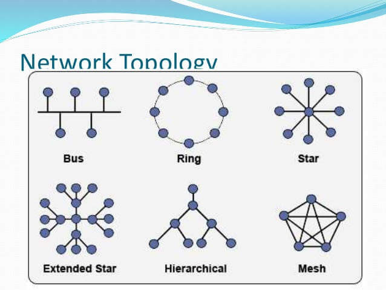
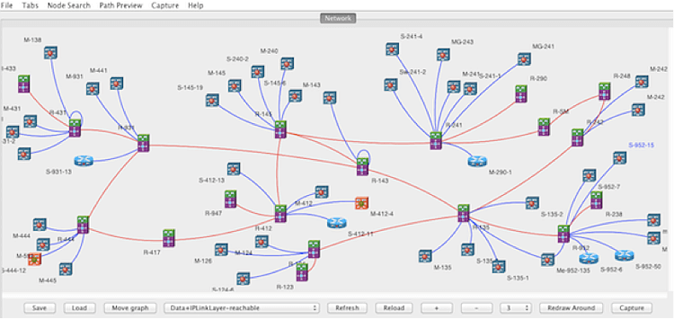
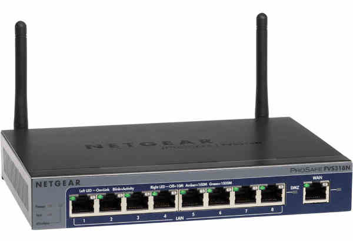
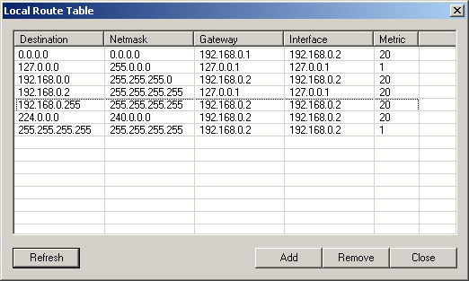
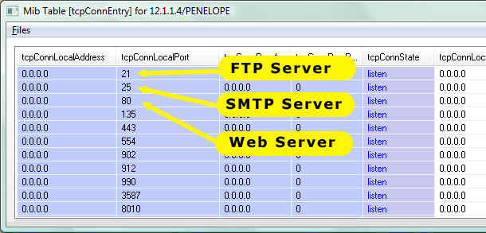
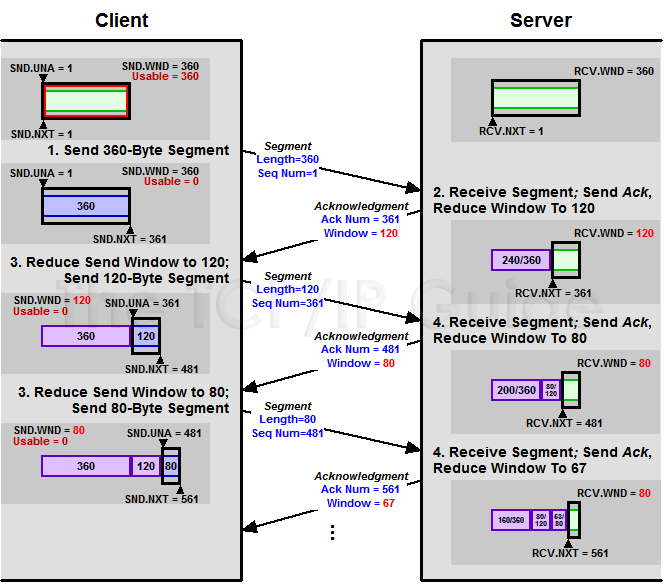
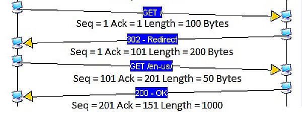
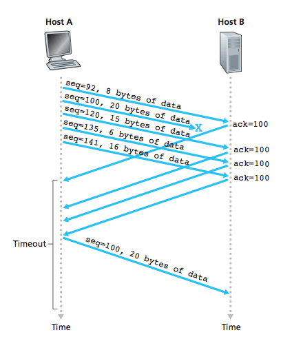

## 1、TCP协议的作用

```
互联网由一整套协议构成。TCP只是其中的一层，有着自己的分工。
```


```
图片说明：TCP是以太网协议和IP协议的上层协议，yes应用层协议的下层协议
```

```
最底层的以太网协议(Ethernet)规定了电子信号如何组成数据包(packet),解决了子网内部的点对点通信。
```



```
图片说明：以太网协议解决了局域网的点对点通信。
```

但是，以太网协议不能解决多个局域网如何通信，这由IP协议解决。



```
图片说明：IP协议可以链接多个局域网
```

```
IP协议定义了一套自己的地址规则，称为IP地址。它实现了路由功能，允许某个局域网的A主机，向另一个局域网的B主机发送消息。
```




图片说明：路由器就是基于 IP 协议。局域网之间要靠路由器链接。

```
路由的原理很简单。市场上所有的路由器，背后都有很多网口，要接入多根网线。路由器内部有一张路由表，规定了A段IP地址走出口一，B段地址走出口二，......通过这套"指路牌"，实现了数据包的转发。
```



```
图片说明：本机的路由表注明了不同IP目的地的数据包，要发送到哪一个网口(interface)
```

```
IP协议只是一个地址协议，并不保证数据包的完整。如果路由器丢包(比如缓存满了，新进爱的数据包就会丢失)，就需要发现丢了哪一个包，以及如何重新发送这个包。这就要依靠TCP协议。

简单说，TCP协议的作用是， 保证数据通信的完整性和可靠性，防止丢包
```

## 2、TCP数据包的大小

```
以太网数据包(packet)的大小是固定的，最初是1518字节，后来增加到1522字节。其中1500字节是负载(payload),22字节是头信息(head).

IP数据包在以太网数据包的负载里面，它也有自己的头信息，最少需要20字节，所以IP数据包的负载最多为1480字节。
```

```
TCP数据包在IP数据包的负载里面。它的头信息最少也需要20字节，因此TCP数据包的最大负载是 1480-20=1460 字节。由于 IP 和 TCP 协议往往有额外的头信息，所以TCP负载实际为 1400 字节左右。
```

```
因此，一条1500字节的信息需要两个TCP数据包(因为一个TCP包只能放 1400 字节，如果想要传输1500字节就需要两个TCP包，一个存放1400字节，一个存放100字节)。

HTTP/2协议的一大改进，就是压缩HTTP协议的头信息，使得一个HTTP请求可以放在一个TCP数据包里面，而不是分成多个，这样就提高了速度。
```


```
图片说明：以太网数据包的负载是1500字节，TCP数据包的负载在1400字节左右。
```

## 3、TCP数据包的编号(SEQ)

```
	一个包 1400 字节，那么一次性发送大量数据，就必须分成多个包。比如，一个10MB的文件，需要发送7100多个包。
	发送的时候，TCP协议为每个包编号(sequence number,简称 SEQ),以便接收的一方按照顺序还原。万一发生丢包，也可以知道丢失的是哪一个包。
	第一个包的编号是一个随机数。为了便于理解，这里就把它称为1号包。假定这个包的负载长度是 100 字节，那么可以推算出下一个包的编号应该是101。这就是说，每个数据包都可以得到两个编号：自身的编号，以及下一个包的编号。接收方由此知道，应该按照什么顺序将它们还原成原始文件。
```


```
图片说明：当前包的编号是 45943，下一个数据包的编号是 46183，由此可知，这个包的负载是 240 字节。
```

## 4、TCP数据包的组装

```
收到TCP数据包以后，组装还原是操作系统完成的。应用程序不会直接处理TCP数据包。

对于应用程序来说，不用关心数据通信的细节。除非线路异常，收到的总是完整的数据。应用程序需要的数据放在TCP数据包里面，有自己的格式(比如HTTP协议)。

TCP并没有提供任何机制，表示原始文件的大小，这由应用层的协议来规定。比如，HTTP协议就有一个头信息 Content-Length,表示信息体的大小。对于操作系统来说，就是持续的接受TCP数据包，将她们按照顺序组装好，一个包都不少。

操作系统不会去处理TCP数据包里面的数据。一旦组装好TCP数据包，就把它们转交给应用程序.TCP数据包里面由一个端口(port)参数，就是用来制定转交给监听该端口的应用程序。
```



```
图片说明:系统根据 TCP 数据包里面的端口，讲组装好的数据转交给相应的应用程序。上图中，21端口的 TTP服务器，25端口是SMTP协议，80端口是Web服务器。
```

```
应用程序收到组装好的原始数据，以浏览器为例，就会根据HTTP协议的 Content-Length 字段正确读出一段段的数据。这也意味着，一次TCP通信可以包括多个HTTP通信。
```

## 5、慢启动和 ACK

```
服务器发送数据包，当然越快越好，最好一次性全发出去。但是，发得太快，就有可能丢包。带宽小、路由器过热、缓存溢出等许多因素都会导致丢包。线路不好的话，发的越快，丢的越多。

最理想的状态是，在线路允许的情况下，设计一个慢启动(slow start)机制。开始的时候，发送的较慢，然后根据丢包的情况，调整速率：如果不丢包，就加快发送速度；如果丢包，就降低发送速度。

Linux 内核里面设定了(常量TCP_INIT_CWND),刚开始通信的时候，发送方一次性发送10个数据包，即"发送窗口"的大小为10。然后停下来，等待接收方的确认，在继续发送。

默认情况下，接收方每收到两个TCP数据包，就要发送一个确定消息。"确认"的英语是 acknowledgement,所以这个确认消息就简称 ACK。
```

ACK 携带两个信息

```
期待要收到下一个数据包的编号
接收方的接收窗口的剩余容量
```

```
发送方有了这两个信息，再加上自己已经发出的数据包的最新编号，就会推测出接收方大概的接收速度，从而降低或增加发送速率。这被称为"发送窗口"，这个窗口的大小是可变的。
```



```
图片说明：每个 ACK 都带有下一个数据包的编号，以及接收窗口的剩余容量。双方都会发送ACK.
```

```
注意，由于TCP通信是双向的，所以双方都需要发送ACK。两方的窗口大小，很可能是不一样的。而且ACK只是很简单的几个字段，通常与数据合并在一个数据包里面发送。
```



```
图片说明：上图一共4次通信。第一次通信，A主机发给B主机的数据包编号是1，长度是100字节，因此第二次通信B主机的ACK编号是1+100=101，第三次通信A主机的数据包编号也是101。同理，第二次通信B主机发给A主机的数据包编号是1，长度是200字节，因此第三次通信A主机的ACK是201，第四次通信B主机的数据包编号也是201。
```

```
即使对于带宽很大，线路很好的链接，TCP也总是从10个数据包开始慢慢试，过了一段时间以后，才大佬最高传输速率。这就是TCP的慢启动。

ACK两个信息  剩余可用接受窗口，下一个包的编号
```

## 6、数据包的遗失处理

```
TCP协议可以保证数据通信的完整性，这是怎么做到的?
前面说过，每一个数据包都带有下一个数据包的编号。如果下一个数据包没有收到，那么ACK的编号就不会发生变化。

举例来说，现在收到了 4 号包，但是没有收到 5 号包。ACK就会记录，期待收到 5 号包。过了一段时间，5号包收到了，那么下一轮ACK会更新编号。如果5号包还是没收到，但是收到了 6 号包或者7号包，那么ACK里面的编号不会变化，总是显示5号包。这会导致大量重复内容的ACK。

如果发送方发现收到了三个连续的重复ACK，或者超时了还没有收到任何ACK，就会确认丢包，即5号包遗失了，从而再次发送这个包。通过这种机制，TCP保证了不会有数据包丢失。
```



```
图片说明：Host B没有收到100号数据包，会连续发出相同的ACK，触发Host A 重发100号数据包。
```


