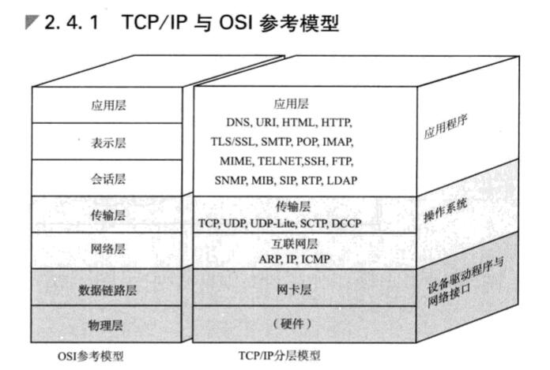
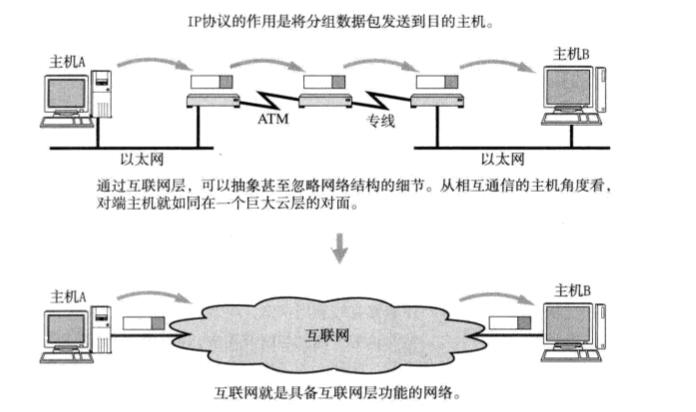
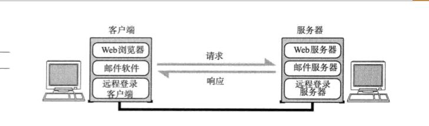
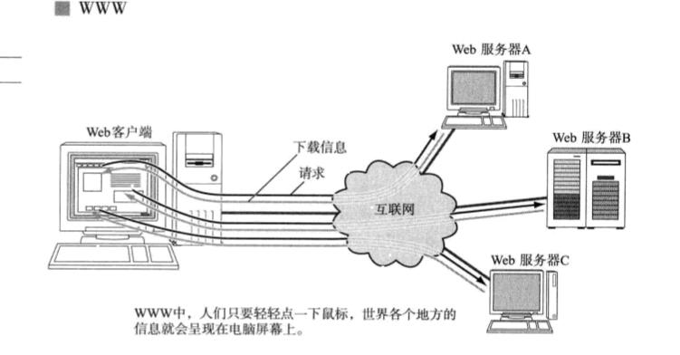
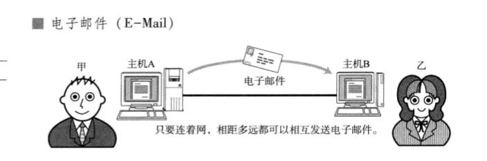
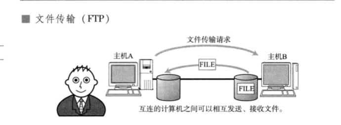
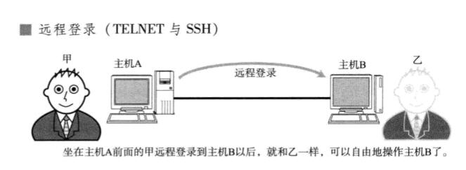
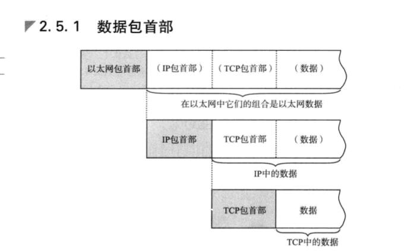
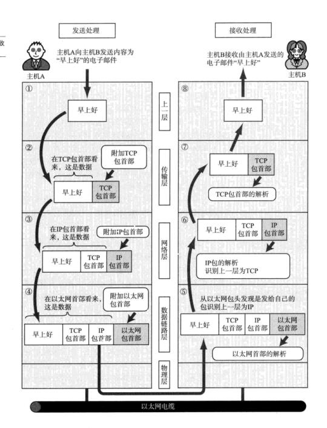
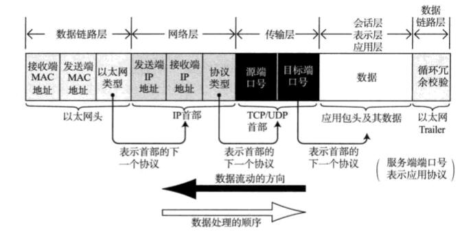

**TCP/IP基础知识**

## 1、TCP/IP 协议分层模型



### 1、硬件(物理层)

```
TCP/IP 的最底层是负责数据传输的硬件。这种硬件就相当于以太网或电话线路等物理层的设备。关于他的内容一直无法统一定义。因为只要人们在物理层面上所使用的传输媒介不同(如使用网线或无线)，网络的带宽、可靠性、安全性、延迟等都会有所不同，而在这些方面又没有一个既定的指标。总之，TCP/IP是在网络互连的设备之间能够通信的前提下才被提出的协议。
```

### 2、网络接口层(数据链路层)

```
网络接口层利用以太网中的数据链路层进行通信，因此属于接口层。也就是说，把它当做让NIC起作用的"驱动程序"也无妨。驱动程序是在操作系统与硬件之间起桥梁作用的软件。计算机的外围附加设备或扩展卡，不是直接查到电脑上或电脑的扩展槽上就能马上使用的，还需要有相应驱动程序的支持。例如换了一个新的 NIC 网卡，不仅需要硬件，还需要软件才能真正投入使用。因此，人们常常还需要在操作系统的基础上安装一些驱动软件以便使用这些附加硬件。
```

### 3、互联网层(网络层)

```
互联网层使用IP协议，它相当于OSI模型中的第3层网络层。IP协议给予IP地址转发分包数据。
```



```
TCP/IP 分层中的互联网层与传输层的功能通常由操作系统提供。尤其是路由器，他必须得实现通过互联网层转发分组数据包的功能。
此外，连接互联网的所有主机跟路由器必须都实现IP的功能。其他链接互联网的网络设备(如网桥、中继器或集线器)就没必要一定实现IP或TCP的功能。
网桥主要能链接不同的网络，根据数据帧的内容转发数据给相邻的其他网络
网桥没有链接网段个数的限制
数据链路的数据帧(就是包)中由一个数据位叫FCS。用以校验数据是否正确送达目的地。网桥通过检查这个域中的值，将那些损坏的数据丢弃，从而避免发送给其他网段。

中继器或集线器(集成了多个中继器叫做集线器。)用来放大物理层的数据。
中继器是对减弱的信号进行放大和发送的设备
```

#### IP

```
IP是跨越网络传送数据包，使整个互联网都能收到数据的协议。IP协议使数据能够发送到地球的另一端，这期间它使用IP地址作为主机的标识。

IP还隐含着数据链路层的功能。通过IP，互相通信的主机之间不论经过怎样的底层数据链路都能够实现通信。

虽然IP也是分组交换的一种协议，但是它不具有重发机制。即使分组数据包未能达到对端主机也不会重发。因此，属于非可靠性传输协议。
```

#### ICMP

```
IP数据包在发送途中一旦发生异常导致无法达到对端目标地址时，需要给发送端发送一个发生异常的通知。ICMP 就是为这一功能而制定的。它有时也被用来诊断网络的健康状况。
```

#### ARP

```
从分组数据包的IP地址中解析出物理地址(MAC地址)的一种协议。
```

### 4、传输层

```
TCP/IP的传输层有两个具有代表性的协议。该层的功能本身与OSI参考模型中的传输层类似。
```


```
传输层最主要的功能就是能够让应用程序之间实现通信。计算机内部，通常同一时间运行着多个程序。为此，必须分清是哪些程序与哪些程序在进行通信。识别这些应用程序的是端口号。
```

#### TCP

```
TCP 是一种面向有链接的传输层协议。它可以保证两端通信主机之间的通信可达。TCP能够正确处理在传输过程中丢包、传输顺序乱掉等异常情况。此外，TCP还能够有效利用带宽，缓解网络拥堵。

然而，为了建立与断开连接，有时它需要至少7次的发包收包，导致网络流量的浪费。此外，为了提高网络的利用率，TCP协议中定义了各种各样复杂的规范，因此不利于视频会议(音频、视频的数据量既定)等场合使用。
```

#### UDP

```
UDP有别于TCP。它是一种面向无连接的传输层协议。UDP不会关注对端是否真的收到了传送过去的数据，如果需要检查对端是否收到分组数据包，或者对端是否连接到网路，则需要在应用程序中实现。

UDP常用于分组数据较少或多播、广播通信以及视频通信等多媒体领域。
```

### 5、应用层(会话层以上的分层)

```
TCP/IP的分层中，将OSI参考模型中的会话层、表示层和应用层的功能都集中到了应用程序中实现。这些功能有时有一个单一的程序实现，有时也可能会由多个程序实现。因此，细看TCP/IP的应用程序功能会发现，它不仅实现OSI模型中应用层的内容，还要实现会话层与表示层的功能。
```



```
TCP/IP应用的架构绝大多数属于客户端/服务端模型。提供服务的程序叫服务端，接受服务的程序叫客户端。在这种通信模式中，提供服务的程序会预先被部署到主机上，等待接受任何时刻客户可能发送的请求。

客户断可以随时发送请求给服务端。有时会有服务端可能会有处理异常、超出负载等情况，这时客户端可以在等待片刻后重发一次请求。
```

#### WWW



```
WWW 可以说是互联网能够如此普及的一个重要原动力。用户在一种叫 Web 浏览器的软件上借助鼠标和键盘就可以轻轻松松地在网上自由的冲浪。也就是说轻按一下鼠标架设在远端服务器上的各种信息就会呈现到浏览器上。浏览器中既可以显示文字、图片、动画等信息，还能播放声音以及运行程序。

浏览器与服务端之间所用的协议是HTTP。所传输数据的主要格式是HTML。WWW中的HTTP属于OSI应用层的协议，而HTML属于表示层的协议。
```

#### 电子邮件(E-Mail)



```
电子邮件其实就是指在网络上发送的信件。有了电子邮件，不管距离多远的人，只要连着互联网就可以互相发送邮件。发送电子邮件时用到的协议叫做 SMTP(Simple Mail Tranfer Protocol).

最初，人们只能发送文本格式的电子邮件。然而现在，电子邮件的格式由MIME协议扩战以后，就可以发送声音、图像等各式各样的信息。甚至还可以修改邮件文字的大小、颜色。这里提到的MIME属于OSI参考模型的第6层--表示层。
```

#### 电子邮件与TCP/IP的发展

```
有人可能会说"TCP/IP的发展离不开电子邮件！" 这句话可能有两方面的含义。
	一方面，电子邮件使用起来非常方便，便于讨论TCP/IP协议的进度和细节。而另一方面，为了正常使用电子邮件，需要具备完善的网络环境并对某些协议进行。
```

#### 文件传输(FTP)



```
文件传输是指将保存在其他计算机硬盘上的文件转移到本地的硬盘上，或将本地硬盘的文件传送到其他机器硬盘上的意思。

该过程使用的协议叫做 FTP (File Tranfer Protocol)。FTP 很早就已经投入使用，传输过程中可以选择用二进制方式还是文本方式。

在FTP中进行文件传输时会建立两个TCP链接，分别是发出传输请求时所要用到的控制连接与实际传输数据时要用到的数据连接。
```

#### 远程登录(SSH与 TELNET)



```
远程登录是指登录到远程的计算机上，使那台计算机上的程序得以运行的一种功能。TCP/IP网络中远程登录常用TELNET和SSH两种协议。其实还有很多其他可以实现远程登录的协议，如BSD UNIX 系统中 rlogin 的 r命令协议以及X Window System 中的 X 协议.
```

#### 网络管理(SNMP)


```
在TCP/IP中进行网络管理时，采用SNMP(Simple Network Managerment Protocol)协议。使用SNMP管理的主机、网桥、路由器等乘坐SNMP代理(Agent),而进行管理的那一段叫做管理器(Manager).SNMP 正是这个 Manager 与 Agent 所用到的协议。
```

```
在SNMP的代理端，保存着网络接口的信息、通信数据量、异常数据量以及设备温度等信息。这些信息可以通过MIB访问。

一个网络范围越大，结构越复杂，就越需要对其进行有效的管理。而SNMP 可以让管理员及时检查网络拥堵情况。及早发现故障，也可以为以后扩大网络收集必要的信息。
```


## 2、TCP/IP分层模型与通信示例

### 1、数据包简介



```
每个分层中，都会对所发送的数据附加一个首部，在这个首部中包含了该层必须要的信息，如发送的目标地址以及协议相关信息。通常，为协议提供的信息为包首部，所要发送的内容为数据。在下一层的角度看，从上一分层收到的包全部都被认为是本层的数据。
```

#### 包、帧、数据报、段、消息

```
以上五个术语都用来表述数据的单位，大致区分如下：
包可以说是全能性术语。帧用于表示数据链路层中包的单位。而数据报是IP和UDP等网络层以上的分层中包的单位。段则表示TCP数据流中的信息。最后，消息是指应用协议中数据的单位。
```

### 2、发送数据包

```
假设甲给乙发送电子邮件，内容为：“早上好”。而从TCP/IP通信上看，是从一台计算机A向一台计算机B发送电子邮件。我们就通过这例子来讲解一下TCP/IP通信的过程。
```

#### 1、应用程序处理

```
启动应用程序新建邮件，将收件人邮箱填好，再由键盘输入邮件内容"早上好"，鼠标点击"发送"按钮就可以开始TCP/IP的通信了。
	首先，应用程序中会进行编码处理。例如，日文电子邮件使用ISO-2022-JP或UTF-8进行编码。这些编码相当于OSI的表示层功能。
	编码转化后，实际邮件不一定会马上被发送出去，因为有些邮件的软件有一次同时发送多个邮件的功能，也可能会有用户点击"收信"按钮以后才一并接收新邮件的功能。像这种何时建立通信链接何时发送数据的管理功能，从某种宽泛的意义上看属于OSI参考模型中会话层的功能。
```

#### 2、TCP模块的处理

```
	TCP根据应用的指示，负责建立链接、发送数据以及断开连接。TCP提供将应用层发来的数据顺利发送至对端的可靠传输。
	为了实现TCP的这一功能，需要在应用层数据的前端附加一个TCP首部。TCP首部中包括源端口号和目标端口号(用以识别发送主机跟接收主机上的应用)、序号(用以标识发送的包中的数据的编号)以及校验(用以判断数据是否损坏)。最后将附加了TCP首部的包再发送给IP。
	首部包含：源端口，目标端口号，序号，校验
```

#### 3、IP模块的处理

```
	IP将TCP传过来的TCP首部和TCP数据合起来当做自己的数据，并在TCP首部的前端加上自己的IP首部。因此，IP数据包中IP首部后面紧跟着TCP首部，然后才是应用的数据首部和数据本身。	
	IP首部中包含接收端IP地址以及发送端IP地址。紧随IP首部的还有用来判断其后面数据是TCP还是UDP的信息。
```

```
IP包生成后，参考路由控制表决定接收此IP包的路由或主机。随后，IP包将被发送给连接这些路由器或主机网络接口的驱动程序，以实现真正发送数据。

首部：IP源地址和IP目标地址。
```

```
如果尚不知道接收端的MAC地址，可以利用ARP(Address Resolution Protocol)查找。只要知道了对端的MAC地址，就可以将MAC地址和IP地址交给以太网的驱动程序，实现数据传输。
```

#### 4、网络接口(以太网驱动)的处理

```
从IP传过来的IP包，对于以太网驱动来说不过就是数据。给这数据附加上以太网首部并进行发送处理。以太网首部中包含接收端MAC地址、发送端MAC地址以及标志以太网类型的以太网数据的协议。根据上述信息产生的以太网数据包将通过物理层传输给接收端。发送处理中的FCS由硬件计算，添加到包的最后。设置FCS的目的是为了判断数据包是否由于噪声而被破坏。
FCS:Frame Check Sequence
首部：MAC源地址 MAC目标地址
```



### 3、经过数据链路的包

```
分组数据包(一下简称包)经过以太网的数据链路时的大致流程图（上图）。
```

```
包流动时，从前往后依次被附加了以太网包首部、IP包首部、TCP包首部(或者UDP包首部)以及应用自己的包首部和数据。而包的最后则追加了以太网包尾(Ethernet Trailer).

	每个包首部中至少都会包含两个信息：一个是发送端和接收端地址，另一个是上一层的协议类型。
	经过每个协议分层时，都必须有识别包发送端和接收端的信息。
	以太网会用MAC地址，IP会用IP地址，而TCP/UDP则会用端口号作为识别两端主机的地址。即使是在应用程序中，像电子邮件地址这样的信息也是一种地址标识。这些地址信息都在每个包经由各个分层时，附加到协议对应的包首部里边。
```



```
此外，每个分层的包首部中还包含一个识别位，它是用来标识上一层协议的种类信息。
例如以太网的包首部中的以太网类型，IP中的协议类型以及TCP/UDP中两个端口的端口号等都起着识别协议类型的作用。就是在应用的首部信息中，有时也会包含一个用来识别其数据类型的标签。
```

### 4、数据包接收处理

```
包的接收流程是发送流程的逆序过程。
```

#### 1、网络接口(以太网驱动)的处理

```
主机收到以太网包以后，首先从以太网的包首部找到 MAC 地址判断是否为发给自己的包。如果不是发给自己的包则丢弃数据。

而如果接收到了恰好是发给自己的包，就查找以太网包首部中的类型域从而确定以太网协议所传送过来的数据类型。在这个例子中数据类型显然是IP包，因此再将数据传给处理IP的子程序，如果这时不是IP而是其他诸如ARP的协议，就把数据传给ARP处理。

总之，如果以太网包首部的类型域包含了一个无法识别的协议类型，则丢弃数据。
```

#### 2、IP模块的处理

```
IP模块收到IP包首部及后面的数据部分以后，也做类似的处理。如果判断得出包首部中的 IP地址与自己的 IP 地址匹配，则可接受数据并从中查找上一层的协议。如果上一层是TCP就将IP包首部之后的部分传给TCP处理;如果是UDP则将IP包首部后面的部分传给UDP处理。对于有路由器的情况下，接收端地址往往不是自己的地址，此时，需要借助路由控制表，在调查应该送达的主机或路由器以后再转发数据。
```

#### 3、TCP模块的处理

```
在TCP模块中，首先会计算一下校验和，判断数据是否被破坏。然后检查是否在按照序号接收数据。最后检查端口号，确定具体的应用程序。
	数据接受完毕后，接收端发送一个"确认回执"给发送端。如果这个回执信息未能达到发送端，那么发送端会认为接收端没有接收到数据而一直反复发送。
	数据被完整的接收以后，会传给由端口号识别的应用程序。
```

#### 4、应用程序的处理

```
接收端应用程序会直接接收发送端发送的数据。用过解析数据可以获取邮件的收件人地址是乙的地址。如果主机B上没有乙的邮件信箱，那么主机B返回给发送端一个"无此收件地址"的报错信息。
```

```
但在这个例子中，主机B上恰好有乙的收件箱，所以解析数据可以获知邮件的收件人地址是乙的地址。如果主机B上没有乙的邮件信箱，那么主机B返回给发送端一个"无此收件地址"的报错信息。
```

## SNS中的通信示例

```
SNS(Social Network Service),中文叫社交网络，是一种即时共享，即时发布消息给圈内特定联系人的一种服务。如前面电子邮件中通信过程的描述一样，也可以分析用移动终端发送或接收SNS消息的过程。
```

```
首先，由于移动电话、智能手机、平板电脑等在进行分组数据的通信，因此在它们装入电池开机的那一刻，已经由通信运营商设定了具体的IP地址。
```


```
类似地，通过SNS轻轻一点就能够运行各种工具、发送文本动画等，这都基于互联网的TCP/IP应用。因此，在排查这些应用的问题时，TCP/IP的知识是必不可少的。
```


