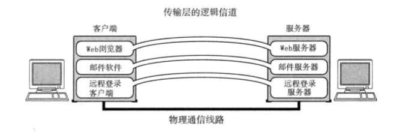

**TCP/IP基础知识**

## 1、TCP/IP 协议分层模型


### 1、硬件(物理层)

```
TCP/IP 的最底层是负责数据传输的硬件。这种硬件就相当于以太网或电话线路等物理层的设备。关于他的内容一直无法统一定义。因为只要人们在物理层面上所使用的传输媒介不同(如使用网线或无线)，网络的带宽、可靠性、安全性、延迟等都会有所不同，而在这些方面又没有一个既定的指标。总之，TCP/IP是在网络互连的设备之间能够通信的前提下才被提出的协议。
```

### 2、网络接口层(数据链路层)

```
网络接口层利用以太网中的数据链路层进行通信，因此属于接口层。也就是说，把它当做让NIC起作用的"驱动程序"也无妨。驱动程序是在操作系统与硬件之间起桥梁作用的软件。计算机的外围附加设备或扩展卡，不是直接查到电脑上或电脑的扩展槽上就能马上使用的，还需要有相应驱动程序的支持。例如换了一个新的 NIC 网卡，不仅需要硬件，还需要软件才能真正投入使用。因此，人们常常还需要在操作系统的基础上安装一些驱动软件以便使用这些附加硬件。
```

### 3、互联网层(网络层)

```
互联网层使用IP协议，它相当于OSI模型中的第3层网络层。IP协议给予IP地址转发分包数据。
```


```
TCP/IP 分层中的互联网层与传输层的功能通常由操作系统提供。尤其是路由器，他必须得实现通过互联网层转发分组数据包的功能。
此外，连接互联网的所有主机跟路由器必须都实现IP的功能。其他链接互联网的网络设备(如网桥、中继器或集线器)就没必要一定实现IP或TCP的功能。
网桥主要能链接不同的网络，根据数据帧的内容转发数据给相邻的其他网络
网桥没有链接网段个数的限制
数据链路的数据帧(就是包)中由一个数据位叫FCS。用以校验数据是否正确送达目的地。网桥通过检查这个域中的值，将那些损坏的数据丢弃，从而避免发送给其他网段。

中继器或集线器(集成了多个中继器叫做集线器。)用来放大物理层的数据。
中继器是对减弱的信号进行放大和发送的设备
```

#### IP

```
IP是跨越网络传送数据包，使整个互联网都能收到数据的协议。IP协议使数据能够发送到地球的另一端，这期间它使用IP地址作为主机的标识。

IP还隐含着数据链路层的功能。通过IP，互相通信的主机之间不论经过怎样的底层数据链路都能够实现通信。

虽然IP也是分组交换的一种协议，但是它不具有重发机制。即使分组数据包未能达到对端主机也不会重发。因此，属于非可靠性传输协议。
```

#### ICMP

```
IP数据包在发送途中一旦发生异常导致无法达到对端目标地址时，需要给发送端发送一个发生异常的通知。ICMP 就是为这一功能而制定的。它有时也被用来诊断网络的健康状况。
```

#### ARP

```
从分组数据包的IP地址中解析出物理地址(MAC地址)的一种协议。
```

### 4、传输层

```
TCP/IP的传输层有两个具有代表性的协议。该层的功能本身与OSI参考模型中的传输层类似。
```



```
传输层最主要的功能就是能够让应用程序之间实现通信。计算机内部，通常同一时间运行着多个程序。为此，必须分清是哪些程序与哪些程序在进行通信。识别这些应用程序的是端口号。
```

#### TCP

```
TCP 是一种面向有链接的传输层协议。它可以保证两端通信主机之间的通信可达。TCP能够正确处理在传输过程中丢包、传输顺序乱掉等异常情况。此外，TCP还能够有效利用带宽，缓解网络拥堵。

然而，为了建立与断开连接，有时它需要至少7次的发包收包，导致网络流量的浪费。此外，为了提高网络的利用率，TCP协议中定义了各种各样复杂的规范，因此不利于视频会议(音频、视频的数据量既定)等场合使用。
```

#### UDP

```
UDP有别于TCP。它是一种面向无连接的传输层协议。UDP不会关注对端是否真的收到了传送过去的数据，如果需要检查对端是否收到分组数据包，或者对端是否连接到网路，则需要在应用程序中实现。

UDP常用于分组数据较少或多播、广播通信以及视频通信等多媒体领域。
```

### 5、应用层(会话层以上的分层)

```
TCP/IP的分层中，将OSI参考模型中的会话层、表示层和应用层的功能都集中到了应用程序中实现。这些功能有时有一个单一的程序实现，有时也可能会由多个程序实现。因此，细看TCP/IP的应用程序功能会发现，它不仅实现OSI模型中应用层的内容，还要实现会话层与表示层的功能。
```


```
TCP/IP应用的架构绝大多数属于客户端/服务端模型。提供服务的程序叫服务端，接受服务的程序叫客户端。在这种通信模式中，提供服务的程序会预先被部署到主机上，等待接受任何时刻客户可能发送的请求。

客户断可以随时发送请求给服务端。有时会有服务端可能会有处理异常、超出负载等情况，这时客户端可以在等待片刻后重发一次请求。
```

#### WWW


```
WWW 可以说是互联网能够如此普及的一个重要原动力。用户在一种叫 Web 浏览器的软件上借助鼠标和键盘就可以轻轻松松地在网上自由的冲浪。也就是说轻按一下鼠标架设在远端服务器上的各种信息就会呈现到浏览器上。浏览器中既可以显示文字、图片、动画等信息，还能播放声音以及运行程序。

浏览器与服务端之间所用的协议是HTTP。所传输数据的主要格式是HTML。WWW中的HTTP属于OSI应用层的协议，而HTML属于表示层的协议。
```

#### 电子邮件(E-Mail)


```
电子邮件其实就是指在网络上发送的信件。有了电子邮件，不管距离多远的人，只要连着互联网就可以互相发送邮件。发送电子邮件时用到的协议叫做 SMTP(Simple Mail Tranfer Protocol).

最初，人们只能发送文本格式的电子邮件。然而现在，电子邮件的格式由MIME协议扩战以后，就可以发送声音、图像等各式各样的信息。甚至还可以修改邮件文字的大小、颜色。这里提到的MIME属于OSI参考模型的第6层--表示层。
```

#### 电子邮件与TCP/IP的发展

```
有人可能会说"TCP/IP的发展离不开电子邮件！" 这句话可能有两方面的含义。
	一方面，电子邮件使用起来非常方便，便于讨论TCP/IP协议的进度和细节。而另一方面，为了正常使用电子邮件，需要具备完善的网络环境并对某些协议进行。
```

#### 文件传输(FTP)


```
文件传输是指将保存在其他计算机硬盘上的文件转移到本地的硬盘上，或将本地硬盘的文件传送到其他机器硬盘上的意思。

该过程使用的协议叫做 FTP (File Tranfer Protocol)。FTP 很早就已经投入使用，传输过程中可以选择用二进制方式还是文本方式。

在FTP中进行文件传输时会建立两个TCP链接，分别是发出传输请求时所要用到的控制连接与实际传输数据时要用到的数据连接。
```

#### 远程登录(SSH与 TELNET)


```
远程登录是指登录到远程的计算机上，使那台计算机上的程序得以运行的一种功能。TCP/IP网络中远程登录常用TELNET和SSH两种协议。其实还有很多其他可以实现远程登录的协议，如BSD UNIX 系统中 rlogin 的 r命令协议以及X Window System 中的 X 协议.
```

#### 网络管理(SNMP)


```
在TCP/IP中进行网络管理时，采用SNMP(Simple Network Managerment Protocol)协议。使用SNMP管理的主机、网桥、路由器等乘坐SNMP代理(Agent),而进行管理的那一段叫做管理器(Manager).SNMP 正是这个 Manager 与 Agent 所用到的协议。
```

```
在SNMP的代理端，保存着网络接口的信息、通信数据量、异常数据量以及设备温度等信息。这些信息可以通过MIB访问。

一个网络范围越大，结构越复杂，就越需要对其进行有效的管理。而SNMP 可以让管理员及时检查网络拥堵情况。及早发现故障，也可以为以后扩大网络收集必要的信息。
```


