**数据链路**

```
本章主要介绍计算机网络最基本的内容——数据链路层。如果没有数据链路层，基于TCP/IP的通信也就无从谈起。因此，本章将着重介绍TCP/IP的具体数据链路，如以太网、无线局域网、PPP等。
```


## 1、数据链路的作用

```
数据链路，指OSI参考模型中的数据链路层，有时也指以太网、无线局域网等通信手段。

TCP/IP中对于OSI参考模型的数据链路层以下部分(物理层)未作定义。因为TCP/IP以这两层的功能是透明的为前提。然而，数据链路的知识对于深入理解TCP/IP与网络起着至关重要的作用。
数据链路层的协议定义了通过通信媒介互连的设备之间传输的规范。通信媒介包括双绞线电缆、同轴电缆、光纤、电波以及红外线等介质。此外，各个设备之间有时也会通过交换机、网桥、中继器等中转数据。

实际上，各个设备之间在数据传输时，数据链路层和物理层都是必不可少的。众所周知，计算机以二进制0、1来表示信息，然而实际的通信媒介之间处理的却是电压的高低、光的闪灭以及电波的强弱等信号。把这些信号与二进制的0、1进行转换正是物理层的责任。数据链路层处理的数据也不是单纯的0、1序列，该层把它们集合为一个叫做"帧"的块，然后再进行传输。

在以太网与FDDI(Fiber Distributed Data Interface,光纤分布式数据接口)的规范中，不仅包含OSI参考模型的第2层数据链路层，也规定了第一层物理层的规范。而在ATM(Asynchronous Tranfer Mode,异步传输方式)的规范中，还包含了第三层网络层的一部分功能。
```


#### 数据链路的段

```
数据链路的段是指一个被分割的网络。然而根据使用者不同。其含义也不尽相同。例如，引入中继器将两条网线相连组成一个网络。
这种情况下有两条数据链路：
	从网络层的概念看，它是一个网络(逻辑上)——>即，从网络层的立场出发，这两条网线组成一个段。
	
	从物理层的概念看，两条网线分别是两个物体(物理上)——>即，从物理层的观点出发，一条网线是一个段。
```


#### 网络拓扑


## 2、数据链路相关技术

### 1、MAC地址

```
MAC地址用于识别数据链路中互连的节点。以太网或FDDI中，根据 IEEE802.3 的规范使用MAC地址。其他无线LAN、蓝牙等设备也是用相同规格的MAC地址。
```


```
MAC地址长48比特，结构如图3.5所示。在使用网卡(NIC)的情况下，MAC地址一般会被烧入到ROM中。因此，任何一个网卡的MAC地址都是唯一的，在全世界都不会有重复。
```


```
MAC地址中 3~24位(比特位)表示厂商识别码，每个NIC厂商都有特定唯一的识别数字。25~48位是厂商内部为识别每个网卡而用。因此，可以保证全世界不会有相同MAC地址的网卡。

IEEE802.3制定MAC地址规范时没有限定数据链路的类型，即不论哪种数据链路的网络(以太网、FDDI、ATM、无线LAN、蓝牙等)，都不会有相同的MAC地址出现。
```


### 2、共享介质型网络

```
从通信介质(通信，介质)的使用方法上看，网络可分为共享介质型和非共享介质型。

共享介质型网络指由多个设备共享一个通信介质的一种网络。最早的以太网和FDDI(光纤分布式数据接口)就是介质共享型网络。在这种方式下，设备之间使用同一个载波信道进行发送和接收。为此，基本上采用半双工通信方式，并有必要对介质进行访问控制。
```

```
共享介质型网络中有两种介质控制方式：一种是争用方式，另一种是令牌传递方式。
```

#### 1、争用方式

```
争用方式(Contention)是指争夺获取数据传输的权利，也叫CSMA(载波监听多路访问)。这种方法通常令网络中的各个站(数据链路中很多情况下称节点为"站")采用先到先得的方式占用信道发送数据，如果多个站同时发送帧，则会产生冲突现象。也因此会导致网络拥堵与性能下降。
```


```
在一部分以太网中，采用了改良CSMA的另一种方式————CSMA/CD 方式。CSMA/CD要求每个站提前检查冲突，一旦发生冲突，则尽早释放信道。其具体工作原理如下：
	如果载波信道上没有数据流动，则任何站都可以发送数据。
	检查是否会发生冲突。一旦发生冲突时，放弃发送数据，同时立即释放载波信道.
	放弃发送以后,随机延时一段时间,在重新争用介质,重新发送帧.
	CSMA/CD 工作原理图
```

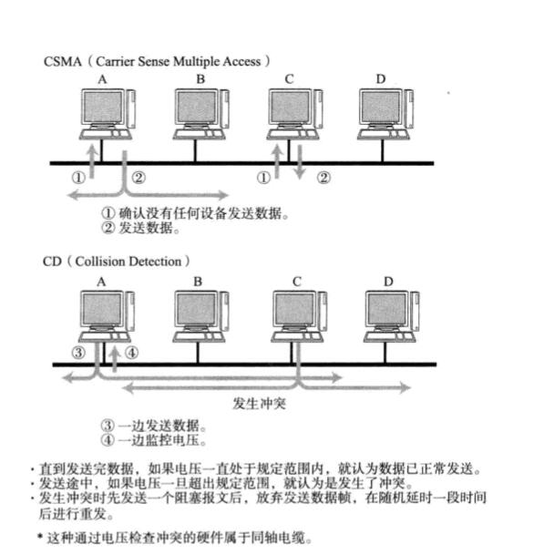

```
实际上会发送一个32位特别的信号，在阻塞报文以后再停止发送。接收端通过发生冲突时帧的FCS，判断出该帧不正确从而丢弃帧。
```

#### 2、令牌传递方式

```
令牌传递方式是沿着令牌环发送一种叫做"令牌"的特殊报文，是控制传输的一种方式。只有获得令牌的站才能发送数据。这种方式有两个特点：
1、是不会有冲突
2、每个站都有通过平等循环获得令牌的机会。
因此，即使网络拥堵也不会导致性能下降。

	当然，这种方式中，一个站在没有收到令牌前不能发送数据帧，因此在网络不太拥堵的情况下数据链路的利用率也就达不到100%。为此，衍生了多种令牌传递的技术。例如，早期令牌释放、令牌追加等方式以及多个令牌同时循环等方式。这些方式的目的都是为了尽可能的提高网络性能。
```

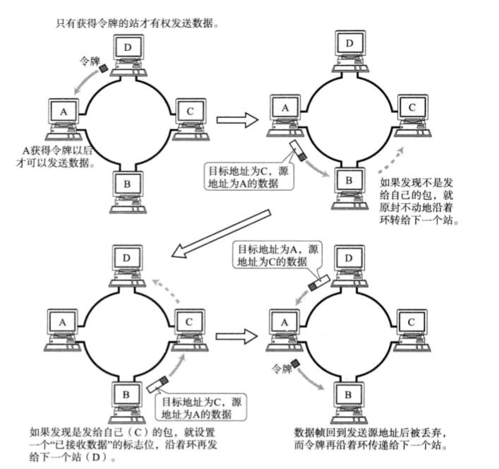

### 3、共享介质型网络

```
非共享介质网络是指不共享介质，是对介质采取专用的一种传输控制方式。在这种方式下，网络中的每个站直连交换机，由交换机负责转发数据帧。此方式下，发送端与接收端并不共享通信介质，因此很多情况下采用全双工通信方式。
```

```
不仅ATM采用这种传输控制方式，最近它也成为了以太网的主流方式。通过以太网交换机构建网络，从而使计算机与交换机端口之间形成一对一的链接，既可实现全双工通信。在这种一对一连接全双工通信的方式下不会发送冲突，因此不需要CSMA/CD的机制就可以实现更高效的通信。
```

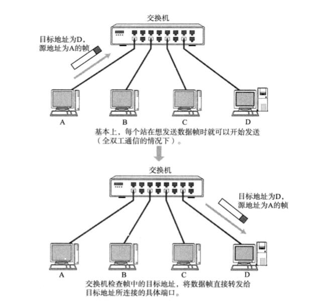

### 4、半双工和全双工通信

```
半双工是指，只发送或接收的通信方式。
全双工是指。允许在同一时间即可以发送数据也可以接收数据。
```

```
半双工例子： 采用 CSMA/CD 方式的以太网，首先要判断是否可以通信，如果可以就独占通信介质发送数据。因此，它像无线电收发器一样，不能同时接收和发送数据。
```

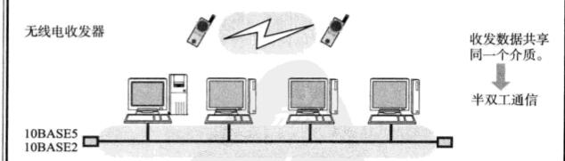

```
全双工例子： 采用交换机与双绞电缆(或者光纤电缆)的情况下，即可以通过交换机的端口与计算机之间进行一对一的连接，也可以通过相连电缆内部的收发线路分别进行一对一的连接，也可以通过相连电缆内部的收发线路分别进行接收和发送数据。因此，交换机的端口与计算机之间可以实现同时收发的全双工通信。因此，交换机的端口与计算机之间可以实现同时收发的全双工通信。
网线头有8个触点,4个传输，4个接收，所以可以实现全双工
```

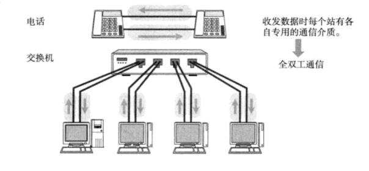

### 5、根据mac地址转发

```
在使用同轴电缆的以太网(10BASE5、10BASE2)等介质共享网络中，同一时间只能有一台主机发送数据。当连网的主机数量增加时，通信性能明显下降。若将集线器或集中器设备以星型连接，就出现了一款新的网络设备————交换集线器，这是一种将非介质共享网络中所使用的交换机用在以太网中的技术，交换集线器也叫做以太网交换机。
```

```
以太网交换机就是持有多个端口的网桥。它们根据数据链路层中的每个帧的目标MAC地址，决定从哪个网络接口发送数据。这时所参考的、用以记录发送接口的表就叫做转发表(Forwarding Table).

这种转发表的内容不需要使用者在每个终端或交换机上手工设置，而是可以自动生成， 数据链路层的每个通过点在接到包时，会从中源MAC地址以及曾经接收该地址发送的数据包的接口作为对应关系记录到转发表中。以某个MAC地址作为源地址的包由某一接口接收，实质上可以理解为该MAC地址就是该接口的目标。因此也可以说，以该MAC地址作为目标地址的包，经由该接口送出即可。这一过程也叫自学过程。
```

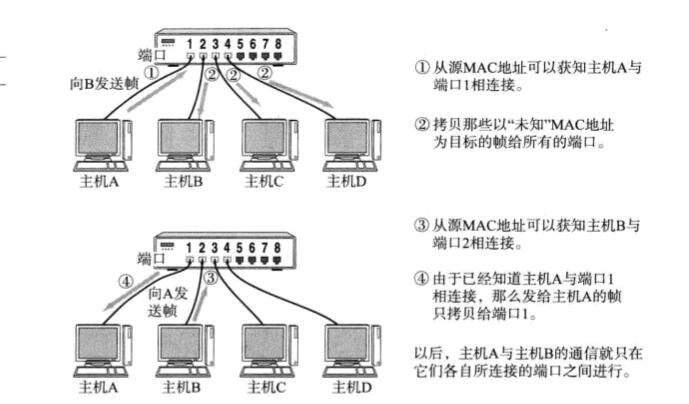

```
由于MAC地址没有层次性，转发表中的入口个数与整个数据链路中所有网络设备的数量有关。当设备数量增加时，转发表也会随之变大，检索转发表所用的时间也就越来越长。当连接多个终端时，有必要将网络分成多个数据链路，采用类似于网络层IP地址一样对地址进行分层管理。
```

#### 1、交换机转发方式

```
存储转发，直通转发
```

```
存储转发方式：检查以太网数据帧末尾的FCS位后再进行转发。因此，可以避免发送由于冲突而被破坏的帧或噪声导致的错误帧。

直通转发方式：不需要将整个帧全部接收下来以后再进行转发。只需要得知目标地址既可开始转发。因此，它具有延迟较短的优势。但同时也不可避免的有发送错误帧的可能性。
```

### 6、环路检测技术

```
通过网桥连接网络时，一旦出现环路该如何处理？这与网络的拓扑结构和所使用的网桥种类有直接关系。最坏的情况下，数据帧会在环路中被一而再再而三的持续转发。而一旦这种数据帧越积越多将会导致网络瘫痪。

为此，有必要解决网络中的环路问题。具体有 生成树 与 源路由 两种方式。如果使用具有这些功能的网桥，那么即使构建了一个带有环路的网络，也不会造成那么严重的问题。只要搭建格式的环路，就能分散网络流量，在发生某一处路由故障时选择绕行，可以提高容灾能力。
```

7、VLAN

```
进行网络管理的时候，时常会遇到分散网络负载、变换部署网络设备的位置等情况。而有时管理员在做这些操作时，不得不修改网络的拓扑结构，这也就意味着必须进行硬件线路的改造。然而，如果采用带有VLAN技术的网桥，就不用实际修改网络布线，只需要修改网络的结构即可。
```

```
那么VLAN究竟是什么？该交换机按照其端口区分了多个网段，从而区分了广播数据传播的范围、减少了网络负载并提高了网络的完全性。然而异构的两个网段之间，就需要利用具有路由功能的交换机，或在各段中间通过路由器的链接才能实现通信。
```

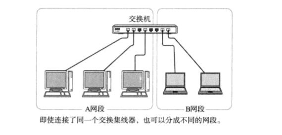

```
对于这种VLAN进行了扩展，又定义了IEEE802.1Q的标准(也叫TAG VLAN),该标准允许包含跨越异构交换机的网段。TAG VLAN中对每个网段都用一个VLAN ID 的标签进行唯一标识。在交换机中传输帧时，在以太网首部加入这个VID标签，根据这个值决定讲数据帧发送给哪个网段。各个交换机之间流动的数据帧的格式看下图。
	随着VLAN技术的应用，不必再重新修改布线，只要修改网段既可。当然，有时物理网络结构与逻辑网络结构也可能会出现不一致的情况。导致不易管理。为此，应该加强对网段构成以及网络运行等的管理
```

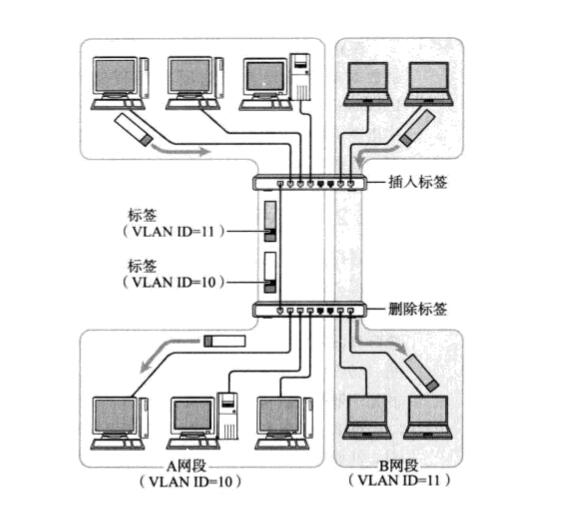

## 3、以太网

```
在众多数据链路中最为著名、使用最为广泛的莫过于以太网(Ethernet).它的规范简单，易于NIC(网卡)以及驱动程序实现。因此，在LAN普及初期，以太网网卡相对其他网卡，价格也比较低廉。这也同时促进了以太网自身的普及。从最初的10Mbps...10Gbps.
```

### 1、以太网连接形式

```
在以太网普及之初，一般采用多台终端使用同一根电缆的共享介质型连接方式。
```

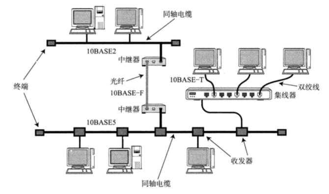

```
而现在，随着互连设备的处理能力以及传输速度的提高，一般都采用终端与交换机之间独占电缆的方式实现以太网通信。
```

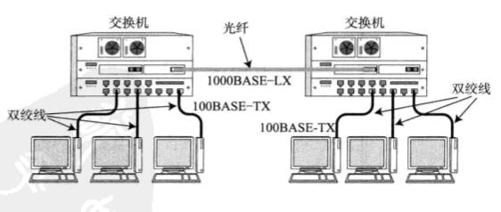


### 2、以太网帧的格式

```
以太网前端有一个叫做前导码(Preamble)的部分，它由0、1数字交替组合而成，表示一个以太网帧的开始，也是对端网卡能够确保与其同步的标志。前导码末尾是一个叫做SFD(Start Frame Delimiter)的域，她的值是"11"。在这个域之后就是以太网帧的本体。前导码与SFD合起来占8个字节。
```

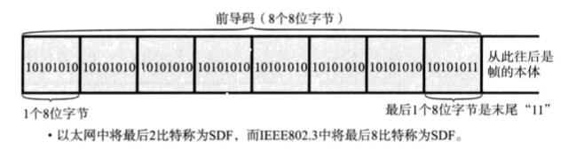

```
以太网帧的前端是以太网的首部，它总共占14个字节。分别是6个字节的目标 MAC 地址、6个字节的源MAC地址以及2个字节的上层协议类型。
```

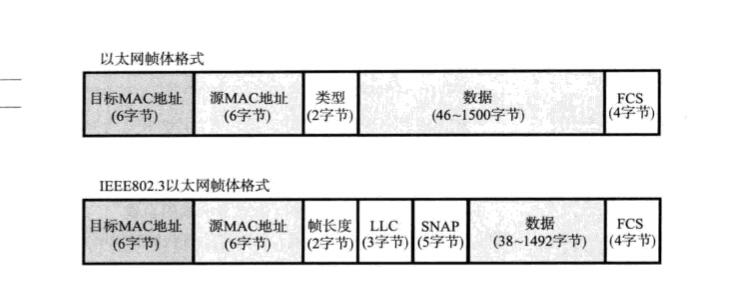

```
紧随帧头后面的是数据。一个数据帧所能容纳的最大数据范围是46~1500个字节。帧尾是一个叫做FCS(Frame Check Sequence, 帧检验序列)的4个字节。

在目标MAC地址中存放了目标工作站的物理地址。源MAC地址中则存放构造以太网帧的发送端工作站的物理地址。

类型通常跟数据一起传送，它包含用以标识协议类型的编号，既表明以太网的再上一层网络协议的类型。
```

```
帧尾最后出现的是FCS。用她可以检查帧是否有所损坏。在通信传输过程中如果出现电子噪声的干扰，可能会影响发送数据导致乱码位的出现。因此，通过检查这个FCS字段的值可以将那些受到噪声干扰的错误帧丢弃。
```

```
FCS中保存着整个帧除以生成多项式的余数。在接收端也用同样的方式计算，如果得到FCS的值相同，就判定所接收的帧没有差错。
```

```
IEEE802.3 Ethernet 与一般的以太网在帧的首部上稍有区别。一般以太网帧中表示类型的字段，在IEEE802.3以太网中却表示帧的长度。此外，数据部分的前端还有LLC和SNAP等字段。
```

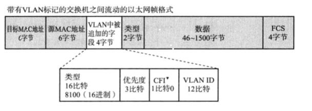

### 3、数据链路层分为两层

```
如果在进一步细分，还可以讲数据链路层分为 介质访问控制层 和 逻辑链路控制层。
```

```
介质控制层根据以太网或FDDI等不同数据链路所持有的首部信息进行控制。
与之相比，逻辑链路层则根据以太网或FDDI等不同数据链路所共有的帧头信息进行控制。

IEEE802.3 Ethernet 的帧格式中附加的 LLC 和 SNAP 就是由逻辑链路控制的首部信息。
```

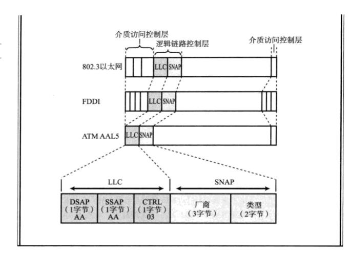


IP地址的分类·

```
Ip地址分为四个级别，分别为A类、B类、C类、D类。它根据IP地址中从第一位到第四位的比特列对其网络标识和主机标识进行区分。
```

A类地址

```
A类IP地址是首位以"0"开头的地址。从第一位到第八位是它的网络标识。用十进制表示的话，0.0.0.0~127.0.0.0 是A类的网络地址。A类地址的后24位相当于主机标识。因此，一个网段内可以容纳的主机地址上限为16，777，214个;
```

B类地址

```
B类地址是前两位为"10"开头的地址。从第一位到第16位是它的网络标识.用十进制表示的话，
128.0.0.1~191.255.0.0 是B类的网络地址。B类地址的后16位相当于主机标识。因此，一个网段内可容纳的主机地址上限为65,534个。
```

C类地址

```
C类IP地址是前三位为"110"的地址。从第1位到第24位是它的网络标识。用十进制表示的话，192.168.0.0~239.255.255.0 是C类的网络地址。C类地址的后8位相当于主机标识。因此，一个网段内可容纳的主机地址上限为254个
```

D类地址

```
D类IP地址是前四位为"1110"的地址。从第1位到第32位是它的网络标识。用十进制表示的话，224.0.0.0~239.255.255.255是D类的网络地址。D类地址没有主机标识，常被用于多播。
```

关于分配IP主机地址的注意事项

```
在分配IP地址时关于主机标识有一点需要注意。即要用比特位表示主机地址时，不可以全部为0或全部为1。因为全部为0只有在表示对应的网络地址或IP地址不可获取的情况下才使用。而全部为1的主机地址通常作为广播地址。

	因此，在分配过程中，应该去掉这两种情况。这也是为什么C类地址每个网段只能有254(2^8-2=254)个主机地址的原因.
```


