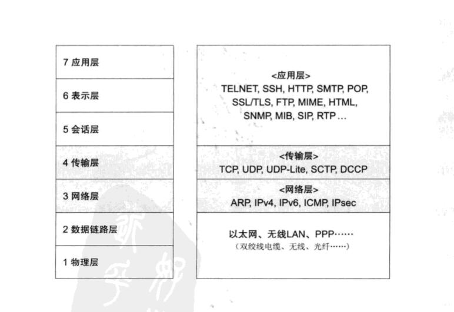
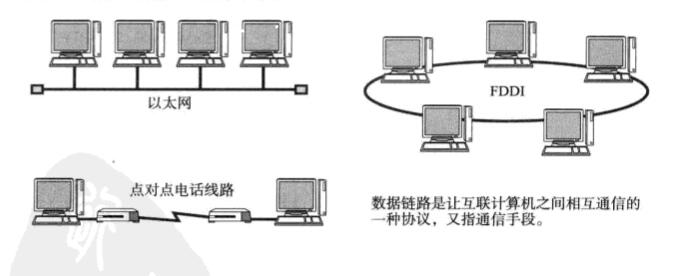
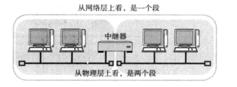
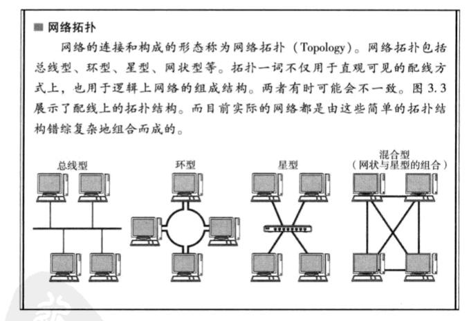
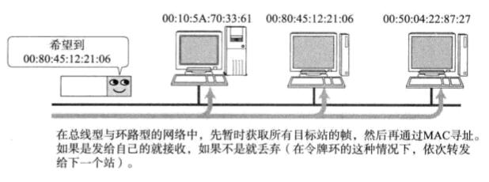
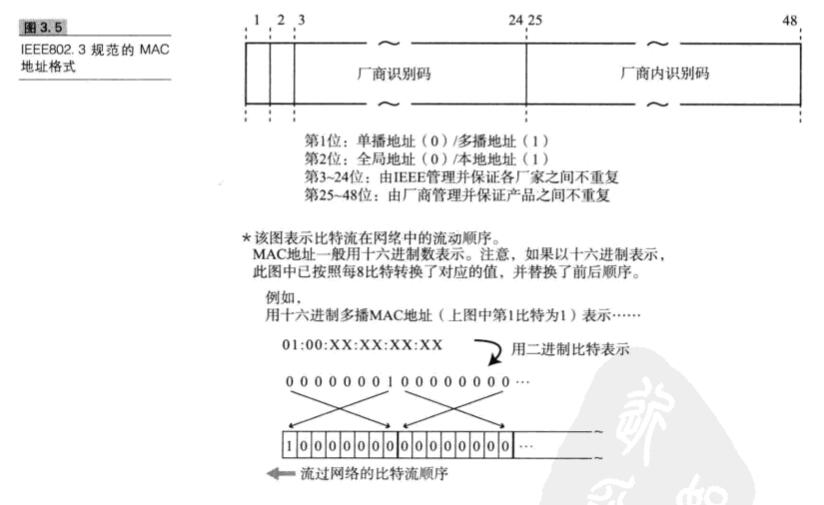
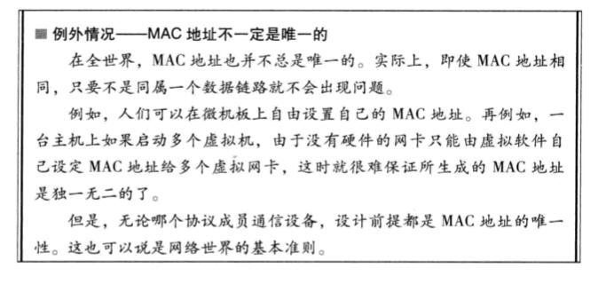
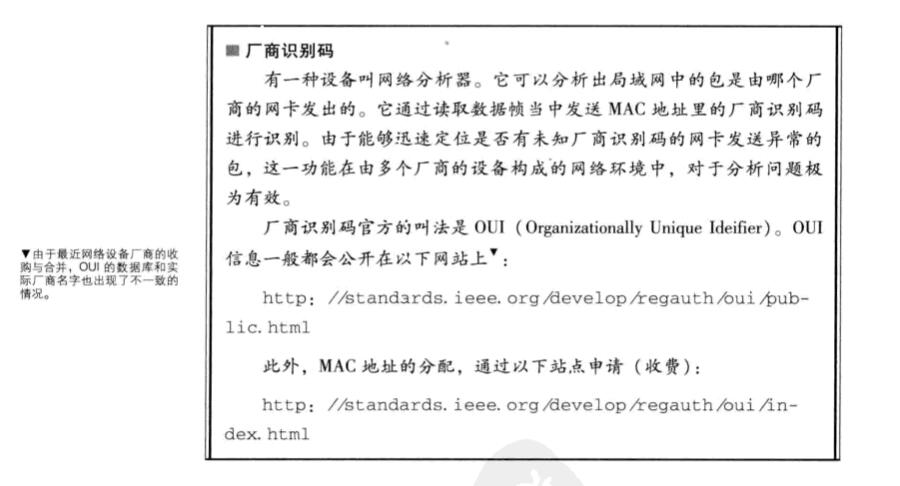
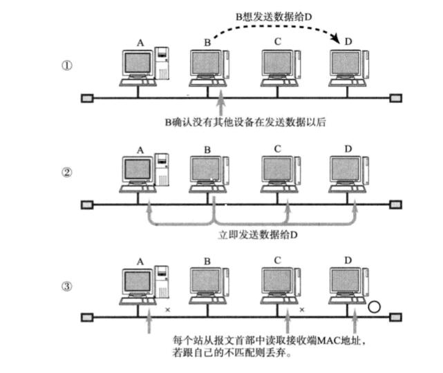

**数据链路**

```
本章主要介绍计算机网络最基本的内容——数据链路层。如果没有数据链路层，基于TCP/IP的通信也就无从谈起。因此，本章将着重介绍TCP/IP的具体数据链路，如以太网、无线局域网、PPP等。
```



## 1、数据链路的作用

```
数据链路，指OSI参考模型中的数据链路层，有时也指以太网、无线局域网等通信手段。

TCP/IP中对于OSI参考模型的数据链路层以下部分(物理层)未作定义。因为TCP/IP以这两层的功能是透明的为前提。然而，数据链路的知识对于深入理解TCP/IP与网络起着至关重要的作用。
数据链路层的协议定义了通过通信媒介互连的设备之间传输的规范。通信媒介包括双绞线电缆、同轴电缆、光纤、电波以及红外线等介质。此外，各个设备之间有时也会通过交换机、网桥、中继器等中转数据。

实际上，各个设备之间在数据传输时，数据链路层和物理层都是必不可少的。众所周知，计算机以二进制0、1来表示信息，然而实际的通信媒介之间处理的却是电压的高低、光的闪灭以及电波的强弱等信号。把这些信号与二进制的0、1进行转换正是物理层的责任。数据链路层处理的数据也不是单纯的0、1序列，该层把它们集合为一个叫做"帧"的块，然后再进行传输。

在以太网与FDDI(Fiber Distributed Data Interface,光纤分布式数据接口)的规范中，不仅包含OSI参考模型的第2层数据链路层，也规定了第一层物理层的规范。而在ATM(Asynchronous Tranfer Mode,异步传输方式)的规范中，还包含了第三层网络层的一部分功能。
```



#### 数据链路的段

```
数据链路的段是指一个被分割的网络。然而根据使用者不同。其含义也不尽相同。例如，引入中继器将两条网线相连组成一个网络。
这种情况下有两条数据链路：
	从网络层的概念看，它是一个网络(逻辑上)——>即，从网络层的立场出发，这两条网线组成一个段。
	
	从物理层的概念看，两条网线分别是两个物体(物理上)——>即，从物理层的观点出发，一条网线是一个段。
```



#### 网络拓扑



## 2、数据链路相关技术

### 1、MAC地址

```
MAC地址用于识别数据链路中互连的节点。以太网或FDDI中，根据 IEEE802.3 的规范使用MAC地址。其他无线LAN、蓝牙等设备也是用相同规格的MAC地址。
```



```
MAC地址长48比特，结构如图3.5所示。在使用网卡(NIC)的情况下，MAC地址一般会被烧入到ROM中。因此，任何一个网卡的MAC地址都是唯一的，在全世界都不会有重复。
```



```
MAC地址中 3~24位(比特位)表示厂商识别码，每个NIC厂商都有特定唯一的识别数字。25~48位是厂商内部为识别每个网卡而用。因此，可以保证全世界不会有相同MAC地址的网卡。

IEEE802.3制定MAC地址规范时没有限定数据链路的类型，即不论哪种数据链路的网络(以太网、FDDI、ATM、无线LAN、蓝牙等)，都不会有相同的MAC地址出现。
```





### 2、共享介质型网络

```
从通信介质(通信，介质)的使用方法上看，网络可分为共享介质型和非共享介质型。

共享介质型网络指由多个设备共享一个通信介质的一种网络。最早的以太网和FDDI(光纤分布式数据接口)就是介质共享型网络。在这种方式下，设备之间使用同一个载波信道进行发送和接收。为此，基本上采用半双工通信方式，并有必要对介质进行访问控制。
```

```
共享介质型网络中有两种介质控制方式：一种是争用方式，另一种是令牌传递方式。
```

#### 1、争用方式

```
争用方式(Contention)是指争夺获取数据传输的权利，也叫CSMA(载波监听多路访问)。这种方法通常令网络中的各个站(数据链路中很多情况下称节点为"站")采用先到先得的方式占用信道发送数据，如果多个站同时发送帧，则会产生冲突现象。也因此会导致网络拥堵与性能下降。
```



```
在一部分以太网中，采用了改良CSMA的另一种方式————CSMA/CD 方式。CSMA/CD要求每个站提前检查冲突，一旦发生冲突，则尽早释放信道。其具体工作原理如下：
	如果载波信道上没有数据流动，则任何站都可以发送数据。
	检查是否会发生冲突。一旦发生冲突时，放弃发送数据，同时立即释放载波信道.

```

```
实际上会发送一个32位特别的信号，在阻塞报文以后再停止发送。接收端通过发生冲突时帧的FCS，判断出该帧不正确从而丢弃帧。
```


