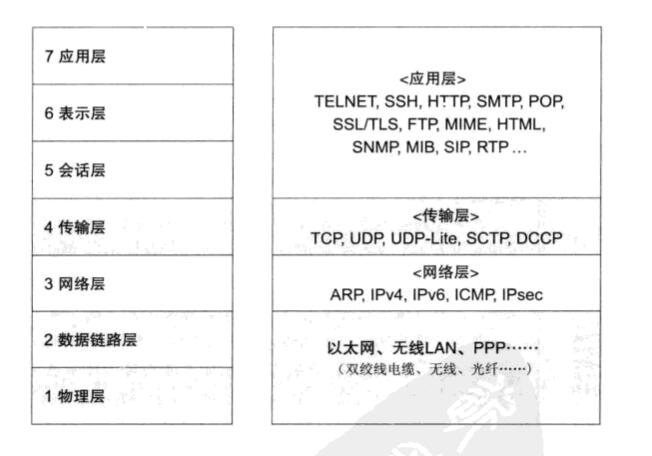
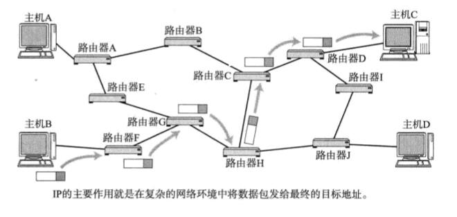
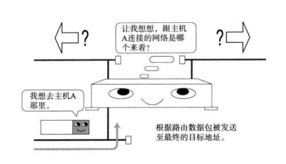
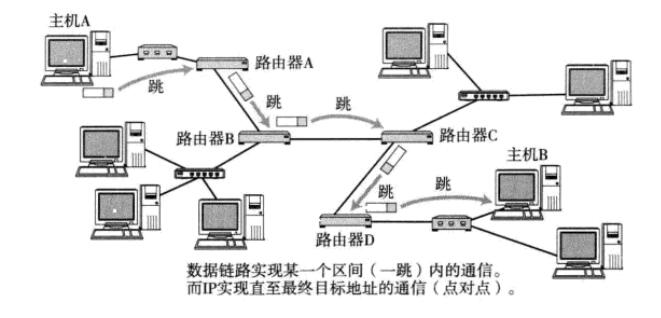
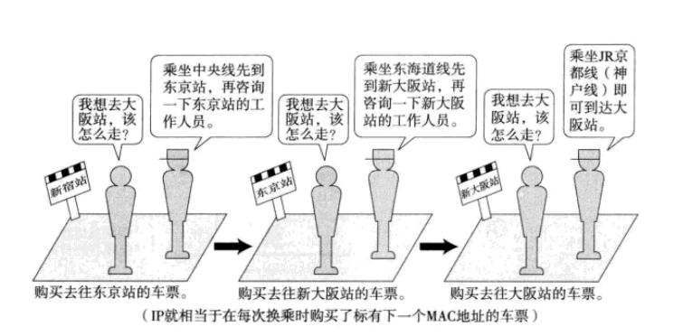
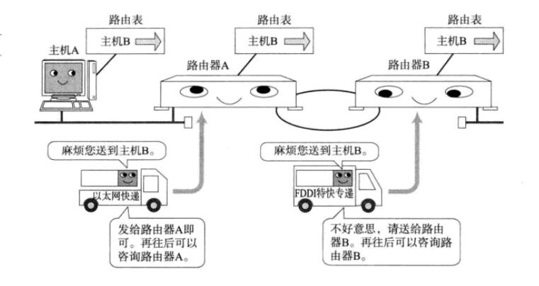
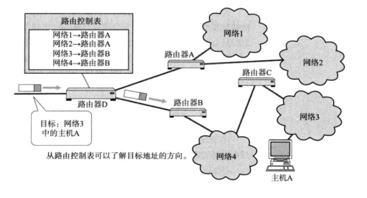
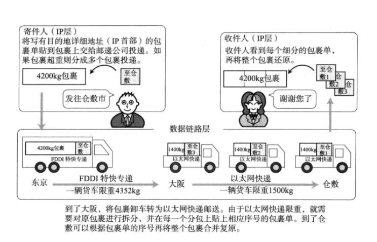

IP协议



## 1、IP即网际协议

### 1、IP相当于OSI参考模型的第3层

```
IP(IPv4、IPv6)相当于OSI参考模型中的第三层——网络层。
网络层的主要作用是"实现终端节点之间的通信"。这种终端节点之间的通信也叫"点对点通信(end to end)"。

从前面的章节可知，网络层的下一层————数据链路层的主要作用是在互连同一种数据链路的节点之间进行包传递。而一旦跨越多种数据链路，就需要借助网络层。网络层可以跨越不同的数据链路，即使是在不同的数据链路上也能实现两端节点之间的数据包传输。
```



```
主机与节点

在互联网世界中，将那些配有IP地址的设备叫做"主机"。这里的主机可以是超大型计算机，也可以是小型计算机。这是因为互联网在当初刚发明的时候，只能连接这类大型的设备，因此习惯上就将配有 IP 地址的设备称为"主机"。

然而，准确的说，主机的定义应该是指"配置有IP地址，但是不进行路由控制的设备"。
既配有IP地址又具有路由控制能力的设备叫做"路由器"，跟主机有所区别。而节点则是主机和路由器的统称。
```

### 2、网络层用户数据链路层的关系

```
数据链路层提供直连两个设备之间的通信功能。与之相比，作为网络层的IP则负责在没有直连的两个网络之间进行通信传输。
```

## 2、IP基础知识

```
IP大致分为三大作用模块，他们是IP寻址、路由以及IP分包与组包。
```

### 1、IP地址属于网络层地址

```
在计算机通信中，为了识别通信对端，必须要有一个类似于地址的识别码进行标识。
MAC地址用来标识同一个链路中不同计算机的一种识别码。
IP地址用于在"连接到网路中的所有主机中识别出进行通信的目标地址"。因此，在TCP/IP通信中所有主机或路由器必须设定自己的IP地址。
```

```
不论一台主机与那种数据链路链接，其IP地址的形式都保持不变。
另外，在网桥或交换集线器等物理层或数据链路层数据包转发设备中，不需要设置IP地址。因为这些设备只负责将IP包转化为 0、1 比特流转发或对数据链路帧的数据部分进行转发，而不需要应对IP协议。
```

### 2、路由控制

```
路由控制(Routing)是指将分组数据发送到最终目标地址的功能。即使网络非常复杂，也可以通过路由控制确定到达目标地址的通路。一旦这个路由控制的运行出现异常，分组数据极有可能"迷失"，无法达到目标地址。因此，一个数据包之所以能够成功的到达最终的目标地址，全靠路由控制。
```



#### 1、发送数据至最终目标地址

```
Hop 译为中文叫"跳"。它是指网络中的一个区间。IP包正是在网络中一个个跳间被转发。因此IP路由也叫做多跳路由。在每一个区间内决定着包在下一跳被转发的路径。
```



```
一跳的范围
一跳(1 Hop)是指利用数据链路层以下分层的功能传输数据帧的一个区间。
	以太网等数据链路中使用MAC地址传输数据帧。此时的一跳是指从源MAC地址到目标MAC地址之间传输帧的区间。也就是说它是主机或路由器网卡不经其他路由器而能直接到达的相邻主机或路由器网卡之间的一个区间。在一跳这个区间内，电缆可以通过网桥或交换集线器相连，不会通过路由器或网关相连。
```

```
多跳路由是指路由器或主机在转发IP数据包时只指定下一个路由器或主机，而不是将到最终目标地址为止的所有通路全部指定出来。因为每一个区间(跳)在转发IP数据包时会分别指定下一跳的操作，直至包达到最终的目标地址。

如下图，一乘坐火车旅游为例具体说明：
```



```
在前面的例子中，虽然已经确定了最终的目标车站，但是一开始还是不知道如何换乘才能达到这个终极目标地址。因此，工作人员给出的方法是首先去往最近的一个车站，再咨询这一车站的工作人员。而导了这个车站以后再询问工作人员如何才能达到最终的目标地址时，仍然得到同样的建议：乘坐某某线列车到某某车站以后再询问那里的工作人员。
```

```
于是，该乘客就按照每一个车站工作人员的指示，达到下一车站以后再继续询问车站的工作人员，得到类似的建议。
```

```
因此，即使乘客不知道其最终目的地的方向也没有关系。可以通过每到一个车站咨询工作人员的这种及其偶然的方法继续前进，也可以到达最终的目标地址。

上文中偶然的意思：英文叫做 "Ad Hoc",是指具有偶然性的、在各跳之间无计划传输的意思。尤其在谈到IP时经常会用到该词。
```

```
IP数据包的传输亦是如此。可以将旅行者看做IP数据包，将车站和工作人员看做路由器。当某个IP包到达路由器时，路由器首先查找其目标地址，从而在决定下一步应该将这个包发往哪个路由器，然后将包发送出去。当这个IP包到达那个路由器以后，会再次经历查找下一个目标地址的过程，并由该路由器转发给下一个被找到的路由器。这个过程可能会反复多次，直到找到最终的目标地址将数据包发送给这个节点。
```

```
IP包被转发到途中的某个路由器时，实际上是装入数据链路层的数据帧以后再被送出。以以太网为例，目标MAC地址就是下一个路由器的MAC地址。
```

```
这里还可以用快递的送货方式来打比方。IP数据包犹如包裹，而送货车犹如数据链路。包裹不可能自己移动，必须有送火车承载转运。而一辆送火车只能将包裹送到某个区间范围内。每个不同区间的包裹将由对应的送货车承载、运输。IP的工作原理也是如此。
```



#### 2、路由控制表

```
为了将数据包发给目标主机，所有主机都维护着一张路由控制表(Routing Table).该表记录IP数据在下一步应该发给哪个路由器.IP包将根据这个路由表在各个数据链路上传输。
```



### 3、数据链路的抽象化

```
IP是实现多个数据链路之间通信的协议。数据链路根据种类的不同各有特点。对这些不同数据链路的相异特性进行抽象化也是 IP 的重要作用之一。数据链路的地址可以被抽象为 IP 地址。因此，对IP的上一层来说，不论底层数据链路使用以太网还是无线LAN亦或是PPP，都将被一视同仁。
```

```
不同数据链路有个最大的区别，就是它们各自的最大传输单位(MTU:Maxi-mum Transmission Unit) 不同。就好像人们在邮寄包裹或行李时有各自的大小限制一样。
```



```
MTU的值在以太网中是 1500 字节，在FDDI(光纤)中是 4352 字节，而ATM则为9180字节。IP的上一层可能会要求传送比这些MTU更多字节的数据，因此必须在线路上传送比包长还要小的MTU.
```

```
为了解决这个问题，IP进行分片处理(IP Fragmentation).顾名思义，所谓分片处理是指，将较大的IP包分成多个较小的IP包。分片的包导了对端目标地址以后会再被组合起来传给上一层。即从 IP 的上次层看，它完全可以忽略数据包在途中的各个数据链路上的MTU，而只需要按照源地址发送的长度接收数据包。IP就是以这种方式抽象化了数据链路层，使得从上层更不容易看到底层网络构造的细节。
```

### 4、IP属于面向无连接型

```
IP面向无连接。即在发包之前，不需要建立与对端目标地址之间的连接。上层如果遇到需要发送给IP的数据，该数据会立即被压缩成IP包发送出去。
```

```
在面向有连接的情况下，需要事先建立连接。如果对端主机关机或不存在，也就不可能建立连接。反之，一个没有建立链接的主机也不可能发送数据过来。
```

```
而面向无连接的情况则不同。即使对端 主机关机或不存在，数据包还是会被发送出去。反之，对于一台主机来说，它会何时从哪里收到数据也是不得而知的。通常应该进行网络监控，让主机只接收发给自己的数据包。若没有做好准备很有可能会错过一些该收的包。因此，在面向无连接的方式下可能会有很多冗余的通信。
```

```
那么，为什么IP要采用面向无连接呢？
	主要有两个原因：
	1、是为了简化，2、是为了提速。
	
	面向连接比起面向无连接处理相对复杂。甚至管理每个链接本身就是一个相当繁琐的事情。此外，每次通信之前都要事先建立链接，又会降低处理速度。需要有连接时，可以委托上一层提供此项服务。因此，IP为了实现简单化与高速化采用面向无连接的方式。
```

### 1、为了提高可靠性，上一层的 TCP 采用面向有连接型

```
IP提供尽力服务(Best Effort),意指"为了把数据包发送到最终目标地址，尽最大努力"。然而，它并不做"最终收到与否的验证"。IP数据包在途中可能会发生丢包、错位以及数据量翻倍等问题。如果发送端的数据未能真正发送到对端目标主机会造成严重的问题。所以需要 TCP来负责保证对端主机确实收到数据。

为什么不让IP具有可靠传输的功能，从而吧这两种协议合并到一起呢？

 	这其中的缘由就在于，如果要一种协议规定所有的功能和作用，那么该协议的具体实施和编程就会变得非常复杂，无法轻易实现。相比之下，按照网络分层，明确定义每层协议的作用和责任以后，针对每层具体的协议进行编程会更加有利于该协议的实现。
 	
 	网络通信中如果能进行有效分层，就可以明确TCP与IP各自协议的最终目的，也有利于后续对这些协议进行扩展和性能上的优化。分层也简化了每个协议的具体实现。互联网能够发展到今天，与网络通信的分层密不可分。
```

3、IP地址的基础知识


