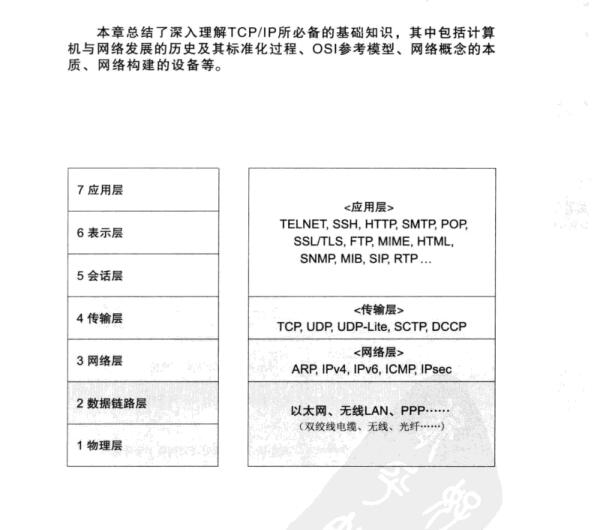
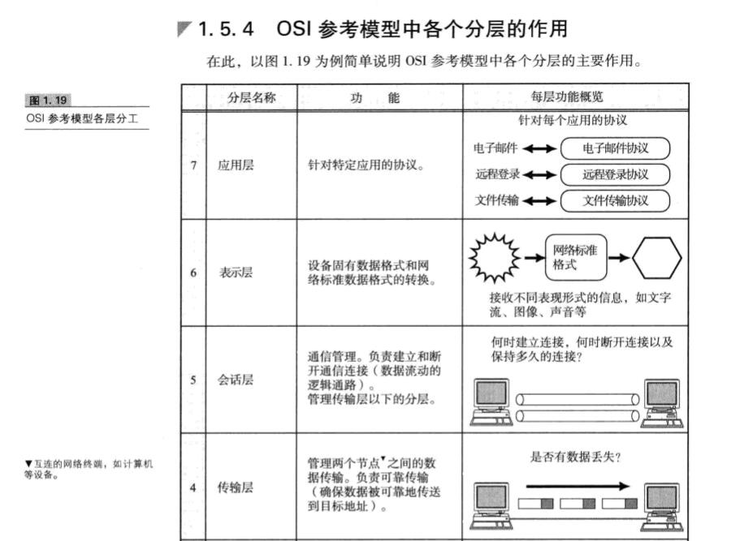
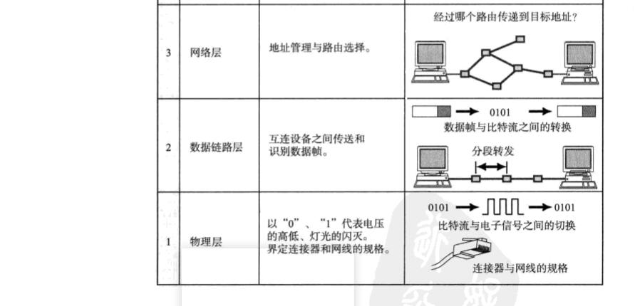
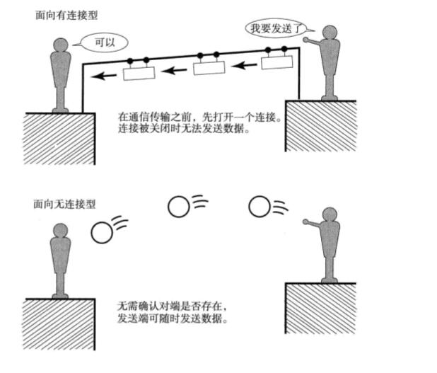
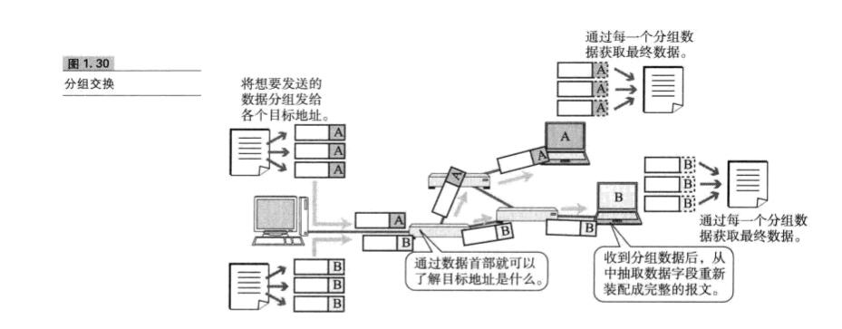
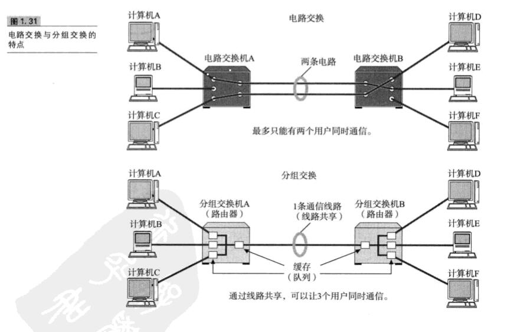
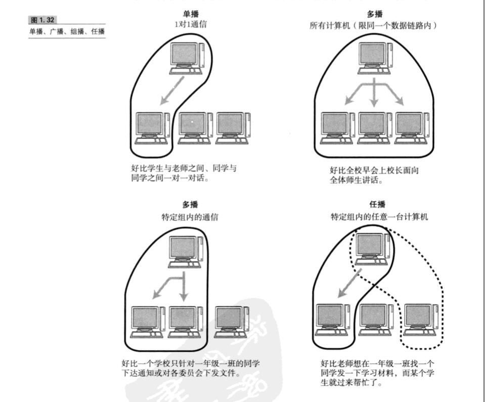
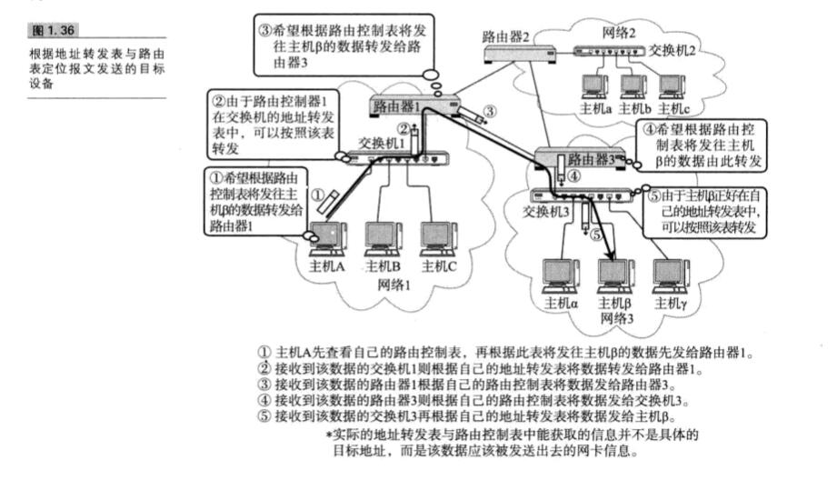
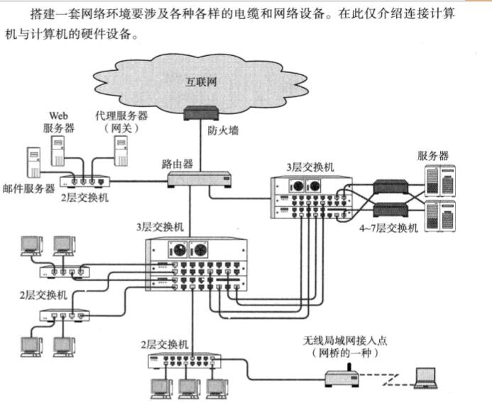
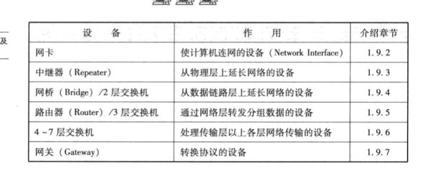

## 1、OSI

```
物理层 链路层 网络层 传输层 会话层 表现层 应用层
```



### 1、OSI 参考模型中各个分层的作用





```
物理层和数据链路负责数据转换
网络层负责寻址和路由选择
数据链路层负责数据的可靠性，如果丢失数据了重发什么的
会话层负责管理链接，进行连接，断开链接。或者说创建会话，断开会话。
	或者这里有5个数据要打开一条通道一次性传输，或者分5次传输，一次打开一个通道。
表示层负责将设备固有的数据结构转换为标准的数据结构
应用层就是负责针对不同应用的 协议
```


**应用层** 

针对特定应用的协议

```
为应用程序提供服务并规定应用程序中通信相关的细节。包括文件传输、电子邮件、远程登录(虚拟终端)等协议.

```

**表现层**

设备固有数据格式和网络标准格式的转换；讲文字、图像等转换

```
将应用层处理的信息转换为适合网络传输的格式，或将来自下一层的数据转换为上层能够处理的格式。因此它主要负责数据格式的转换。
	
	具体来说，就是将设备固有的数据格式转换为网络标准传输格式。不同设备对同一比特流解释的结果可能会不同。因此，使它们保持一致是这一层的主要作用。
```

**会话层**

通信管理

```
负责建立和断开通信连接(数据流动的逻辑通路)，以及数据的分割等数据传输相关的管理。
何时建立链接，何时断开链接以及保持多久的连接
```

**传输层**

管理两个节点之间的数据传输。负责可靠传输

```
确保数据被可靠的传送到目标地址。
起着可靠的传输的作用。只在通信双方节点上进行处理，而无需在路由器上处理
是否有数据丢失
```

**网络层**

地址管理和路由选择

```
经过哪个路由传递到目标地址？
将数据传输到目标地址。目标地址可以是多个网络通过路由器连接而成的某一个地址。因此这一层主要负责寻址和路由选择。
```

**数据链路层**

```
负责物理层面上互连的、节点之间的通信传输。例如与 1 个以太网相连的 2个节点之间的通信。
将 0、1 序列划分为具有意义的数据帧传送给对端(数据帧的生成与接收)
```

**物理层**

```
负责0、1比特流(0、1序列)与电压高低、光的闪灭之间的互换。
```


## 2、传输方式的分类

### 1、面向有链接型与面向无连接型



#### 1、面向有链接型

```
面向有连接型中，在发送数据之前，需要在收发主机之间连接一条通信线路。

面向有连接型就好比人们平常打电话，输入完对方电话号码拨出之后，只有对端拿起电话才能真正通话，通话结束后将电话机扣上就如同切断电源。因此在面向有连接的方式下，必须在通信 传输前后，专门进行建立和断开链接的处理
```

#### 2、面向无连接型

```
面向无连接型则不要求建立和断开连接。发送端可于任何时候自由发送数据。反之接收端也永远不知道自己会在何时从哪里收到数据。因此，在面向无连接的情况下，接收端需要确认是否收到了数据。

这就如同人们去邮局寄包裹一样。负责处理邮递业务的营业员，不需要确认收件人的详细地址是否真的存在，也不需要确认收件人是否能收到包裹，只要发件人有寄件地址就可以办理邮寄包裹的业务。

因此，在面向无连接的通信中，不需要确定对端是否存在。即使接收端不存在或无法接收数据，发送端也能将数据发送出去.
```

### 2、电路交换与分组交换

```
目前，网络通信方式大致分为两种 —— 电路交换和分组交换。电路交换技术的历史相对久远，主要用与过去的电话网。而分组交换技术则是一种较新的通信方式。TCP/IP 正是采用了分组交换技术。
```


#### 1、电路交换

```
在电路交换中，交换机主要负责数据的中转处理。计算机首先被连接到交换机上，而交换机与交换机之间则由众多通信线路在继续连接。因此计算机之间在发送数据时，需要通过交换机与目标主机建立通信电路。我们将连接电路称为建立连接。
建立好链接以后，用户就可以一直使用这条电路，直到该连接被断开为止。
```

```
如果某条电路只是用来连接两台计算机的通信线路，就意味着只需要在这两台计算机之间实现通信，因此这两台计算机是可以独占线路进行数据传输的。

但是，如果一条电路上连接了多台计算机，而这些计算机之间需要互相传递数据，就会出现新的问题。

鉴于一台计算机在收发信息时会独占整个电路，其他计算机只能等待这台计算机处理结束以后才有机会使用这条件路收发数据。

并且在此过程中，谁也无法预测某一台计算机的数据传输从何时开始又在何时结束，

如果并发用户数超过交换机之前的通信线路数，就意味着通信根本无法实现。
```

#### 2、分组交换

```
为此，人们想到了一个新的方法，即让链接到通信电路的计算机将所要发送的数据分成多个数据包，按照一定的顺序排序之后分别发送。这就是分组交换。
有了分组交换，数据被细分后，所有的计算机就可以一齐收发数据，这样也就提高了通信线路的利用率。
由于在分组的过程中，已经在每个分组的首部写入了发送端和接收端的地址，所以即使同一条线路同时为多个用户提供服务，也可以明确区分每个分组数据发往的目的地，以及它是与哪台计算机进行的通信。
```



```
在分组交换中，由分组交换机(路由器)链接通信线路。
分组交换的大致处理过程是：发送端计算机将数据分组发送给路由器，路由器收到这些分组数据以后，缓存到自己的缓冲区，然后再转发给目标计算机。

因此，分组交换也有另一个名称：蓄积交换。

路由器接收到数据以后会按照顺序缓存到相应的队列当中，再以先进先出的顺序将他们逐一发送出去。

在分组交换中，计算机与路由器之间以及路由器与路由器之间通常只有一条通信线路。
因此，这条线路其实是一条共享线路。在电路交换中，计算机之间传输速度不变。
然而在分组交换中，通信线路的速度可能会有所不同。根据网络拥堵的情况，数据达到目标地址的时间又长又短。另外，路由器的缓存饱和或溢出时，甚至可能会发生分组数据丢失、无法发送到对端的情况。
```




### 3、根据接收端数量分类

#### 1、单播(Unicast)

```
字面上，'Uni'表示 1， 'cast' 意为 '投掷'。组合起来就是指 1对1通信。
早先的固定电话就是单播通信的一个典型例子。
```

#### 2、广播(Broadcast)

```
字面上具有'播放'之意。因此它指是将消息从 1 台主机发送给与之相连的所有其他主机。广播通信的一个典型例子就是电视播放，它将电视信号一齐发送给非特定的多个接收对象。

此外，我们知道电视信号一般都有自己的频段。只有在相应频段的可接收范围内才能收到电视信号。与之类似，进行广播通信的计算机也有它们的广播范围。只有在这个范围内的计算机才能收到相应的广播消息。这个范围叫做广播域。
```

#### 3、多播(Muticast)

```
多播与广播类似，也是将消息发给多个接收主机。不同之处在于多播要限定某一组主机作为接收端。
多播通信最典型的例子就是电视会议，这是由多组人在不同的地方参加的一种远程会议。在这种形势下，会由一台主机发送消息给特定的多台主机。电视会会议通常不能使用广播方式。否则将无从掌握是谁在哪儿参与电视会议。
```

#### 4、任播(Anycast)

```
任播是指在特定的多台主机中选出一台作为接收端的一种通信方式。
```



## 3、地址

#### 1、地址的唯一性

```
地址必须唯一
```

#### 2、地址的层次性

```
MAC 地址和 IP 地址在标识一个通信主体时虽然都具有唯一性，但是它们当中只有 IP 地址具有层次性。
```

```
MAC 地址由设备的制造厂商针对每块网卡进行分别指定。人们可以通过制造商识别号、制造商内部产品编号以及产品通用编号确保 MAC 地址唯一性。

然而，人们无法确定哪家厂商的哪个网卡被用到了哪个地方。虽然 MAC 地址中的制造商识别号、产品编号以及通用编号等信息在某种程序上也具有一定的层次性，但是对于寻找地址并没有起到任何作用，所以并不能算有层次的地址。

虽然 MAC 地址是真正负责最终通信的地址，但是在实际寻址过程中，IP 地址却必不可少。
```

```
IP 地址由网络号和主机号两部分组成。即使通信主体的 IP 地址不同，若主机号不同，网络号相同，说明他们处于同一个网段。网络号相同的主机在组织结构、提供商类型和地域分布上都比较集中，也为 IP 寻址带来了极大的方便。
```

网络传输

```
网络传输中，每个节点会根据分组数据的地址信息，来判断该报文应该由哪个网卡发送出去。为此，各个地址会参考一个发出接口列表。在这一点上 MAC 寻址与 IP 寻址是一样的。
只不过Mac寻址中所参考的这张表叫做地址转发表。
IP寻址中做参考的叫做路由控制表。
MAC地址转发表中所记录的是实际的MAC地址本身，而路由表中记录的IP地址则是集中了之后的网络号
```




## 4、网络的构成要素





#### 1、通信媒介与数据链路

```
计算机网络是指计算机与计算机相连而组成的网络。那么现实当中计算机之间又是怎样连接的呢?

计算机之间通过电缆互相连接。
```


