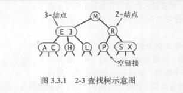
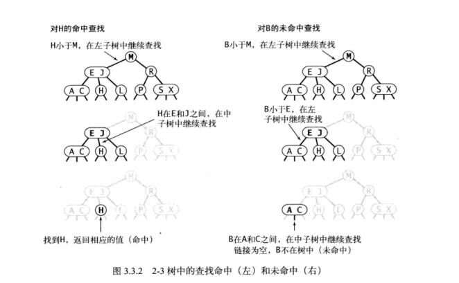
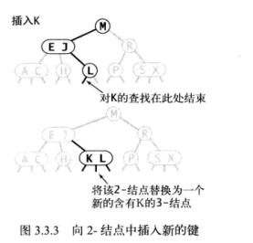

# 2-3查找树

# 1、定义

```
为了保证查找树的平衡，我们需要一些灵活性，因此在这里我们允许树中的一个节点保存多个键。确切的说，我们将一颗标准的二查找树中的节点称为 2- 节点(含有一个间和两条链接)，而现在我们引入 3- 节点,它含有两个键三个链接。 2-节点 和 3-节点中的每条连接都对应着其中保存的键所分割的一个区间。
```

```
定义 一颗 2-3 查找树或为一颗空树，或由以下节点组成：
	2-节点，含有一个键(及其对应的值)和两条链接，左链接指向的2-3树中的键都小于该节点，右链接指向的2-3树中的键都大于该节点。

	3-节点，含有两个键(及其对应的值)和三条链接，左链接指向的 2-3 树中的键都小于该节点，中链接指向的 2-3 树中的键都位于该节点的两个键之间。右链接指向的 2-3 树中的键都大于该节点。

和以前一样，我们将指向一颗空树的链接称为空连接。 
```



# 2、查找

```
将二叉查找树的查找算法一般化我们就能够直接得到 2-3 树的查找算法。要判断一个键是否在树中，我们先将它和根节点中的键比较。如果它和其中任意一个相等，查找命中；否则我们就根据比较的结果找到指向相应区间的链接，并在其只想的子树中递归的继续查找。如果这是个空连接，查找未命中。
```



# 3、插入

## 1、向 2- 节点中插入新键

```
要在 2-3 树中插入一个新节点，我们可以和二叉查找树一样先进行一次未命中的查找，然后吧新节点挂在树的底部。但这样的话树就无法保持完美平衡性。我们使用 2-3 树的主要原因就在于它能够在插入后继续保持平衡。
如果未命中的查找结束于一个 2- 节点，事情就好办了：我们只要把这个 2- 节点替换为一个 3- 节点，将要插入的键保存在其中。如果未命中的查找结束于一个 3- 节点，事情就要麻烦一些
```




## 2、向一颗只含有一个 3- 节点的树插入新键

```
在考虑一般情况之前，先假设我们需要向一颗只要有一个 3- 节点的树中插入一个新键。这棵树中有两个键，所以在它唯一的节点中已经没有可插入新键的空间了。为了将新键插入，我们先临时将新键存入该节点中，使之成为一个 4- 节点。它很自然的扩展了以前的节点并含有 3 个键和 4 条链接。
创建一个 4- 节点很方便，因为很容易将它转换为一颗由 3 个 2- 节点组成的 2-3 树。
```


