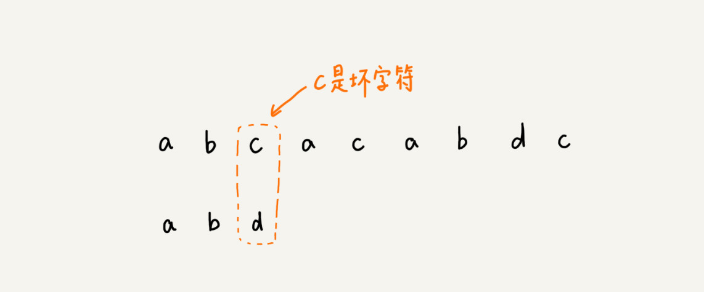

# 1、BF 算法

## 1、BF 算法简介

```
BF 算法 中的 BF 是 Brute(禽兽) Force(力量) 的缩写，中文叫作暴力匹配算法，也叫朴素匹配算法。从名字可以看出，这种算法的字符串匹配方式很"暴力"，当然也就会比较简单、好懂，但相应的性能也就不高。

就是一个一个比较
```


## 2、时间复杂度

```
从上面的算法思想和例子，我们可以看出，在极端情况下，比如主串是“aaaaa…aaaaaa”（省略号表示有很多重复的字符 a），模式串是“aaaaab”。我们每次都比对 m 个字符，要比对 n-m+1 次，所以，这种算法的最坏情况时间复杂度是 O(n*m)。
```


# 2、RK 算法

```
RK 算法的全称叫 Rabin-Karp 算法，是由它的两位发明者 Rabin 和 Karp 的名字来命名的。这个算法理解起来也不是很难。我个人觉得，它其实就是刚刚讲的 BF 算法的升级版
```

### 1、RK 算法的思路

```
RK 算法的思路是这样的：我们通过哈希算法对主串算法对主串中的 n-m+1 个子串分别求哈希值，然后逐个与模式串的哈希值比较大小。如果某个子串的哈希值与模式串相等，那就说明对应的子串和模式串匹配了(这里先不考虑哈希冲突的问题，)。华为哈希值是一个数字，数字之间比较是否相等是非常快速的。
```


# 3、BM 算法

```
文本编辑器中的查找替换功能，我想你应该不陌生吧？臂如，我们在 Word 中把一个单词统一替换成另一个，用的就是这个功能。你有没有想过，它是怎么实现的呢？

今天，我们就来学习 BM(Boyer-Moore)算法。它是一种非常高效的字符串匹配算法，有实验统计，他的性能是著名的 KMP 算法的 3 到 4倍。BM 算法的原理很复杂。
```

## 1、BM算法的核心思想

```
我们把模式串和主串的匹配过程，看作模式串在主串中不停的往后滑动。当遇到不匹配的字符时，BF算法和RK算法的做法是，模式串往后滑动一位，然后从模式串的第一个字符开始重新匹配。
```

``` 
BM 算法包含两部分，分别是 坏字符规则(bad character rule)
和 好后缀规则(good suffix shift)
```

### 1、坏字符规则(bad character rule)

```
前面两节讲的算法，在匹配的过程中，我们都是按模式串的下标从小到大的顺序，依次与主串中的字符进行匹配的。这种匹配顺序比较符合我们的思维习惯，而 BM 算法的匹配顺序比较特别，它是按照模式串下表从大到小的顺序，倒着匹配的。
```


```
我们从模式串末尾往前倒着匹配，当我们发现某个字符没法匹配的时候。我们吧这个没有匹配的字符叫做坏字符(主串中的字符)
```



```
我们拿坏字符 c 在模式串中查找，发现模式串中并不存在这个字符，也就是说，字符c 与模式串中的任何字符都不可能匹配。这个时候，我们可以将模式串直接往后滑动三位，将模式串滑动到 c 后面的位置，再从模式串的末尾字符开始比较。
```


```
这个时候，我们发现，模式串中最后一个字符d，还是无法跟主串中的 a 匹配，这个时候，还能将模式串往后滑动三位吗？答案是不行的。因为这个时候，坏字符 a 在模式串中是存在的，模式串中下标是 0 的位置也是字符 a。这种情况下，我们可以将模式串往后滑动两位，让两个a上下对齐，然后再从模式串的末尾字符开始，重新匹配。
```


```
第一次不匹配的时候，我们滑动了三位，第二次不匹配的时候，我们将模式串后移两位。
```

```
当发生不匹配的时候，我们吧坏字符串对应的模式串中的字符串下标记作 si.如果坏字符在模式串中存在，我们把这个坏字符在模式串中的下标记作 xi.如果不存在，我们把 xi 记作 -1。 那模式串往后移动的位数就等于 si-xi;(注意，我这里说的下标，都是字符在模式串的下标)。
```


```
这里我要特别说明一点，如果坏字符在模式串里多次出现，那我们在计算 xi 的时候，选择最靠后的那个，因为这样不会让模式串滑动过多，导致本来可能匹配的情况被滑动略过。
```

```
利用坏字符规则，BM 算法在最好情况下的时间复杂度非常低，是 O(n/m)。比如，主串是 aaabaaabaaabaaab，模式串是 aaaa。每次比对，模式串都可以直接后移四位，所以，匹配具有类似特点的模式串和主串的时候，BM 算法非常高效。
```

```
不过，单纯使用坏字符规则还是不够的。因为根据 si-xi 计算出来的移动位数，有可能是负数，比如主串是 aaaaaaaaaaaaaaaa，模式串是 baaa。不但不会向后滑动模式串，还有可能倒退。所以，BM 算法还需要用到“好后缀规则”。
```

### 2、好后缀规则

```
好后缀规则实际上跟坏字符规则的思路很类似。当模式串滑动到图中的位置的时候，模式串和主串有 2 个字符是匹配的，倒数第 3 个字符发生了不匹配的情况。
```


```
这个时候该如何滑动模式串呢？当然，我们还可以利用坏字符规则来计算模式串的滑动位数，不过，我们也可以使用好后缀处理规则。两种规则到底如何选择，我稍后会讲。抛开这个问题，现在我们来看，好后缀规则是怎么工作的？
```

```
我们把已经匹配的 bc 叫做好后缀，记作{u}.我们拿它在模式串中查找，如果找到了另一个跟{u}相匹配的子串{u*},那我们就将模式串滑动到子串{u*}与主串{u}对齐的位置。
```


```
如果在模式串中找不到另一个等于{u}的子串，我们就直接将模式串，滑动到主串中{u}的后面，因为之前的任何一次往后滑动，都没有匹配主串中{u}的情况。
```


```
不过，当模式串中不存在等于{u}的子串时，我们直接将模式串滑动到主串{u}的后面。这样做是否有点太过头呢？我们来看下面这个例子。这里面 bc 是好后缀，尽管在模式串中没有另外一个相匹配的子串{u*},但是如果我们将模式串移动到好后缀的后面，如下图所示，那就会错过模式串和主串可以匹配的情况。
```


