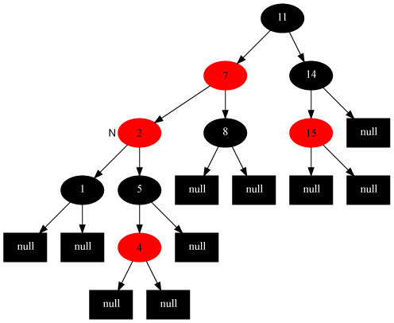
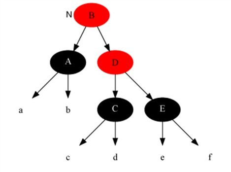

# Red-Black Tree

# 0、科普

```
为什么顺时针是 往右转(右旋)
逆时针是 往左转(左旋)
往右转,,一直玩右转,时钟怎么转就是怎么转。因为我们人往右转就是顺着转,往左转就是逆时针着转。

这个是无法说的，比如说你在操场上顺时针跑步，你所弯曲的方向是你的右手方向。而如果设想你脚下的地面是一面镜子，镜中的世界，你弯曲的方向是你的左手。
所以向右转还是向左转是看你的观测方向而言的。

```


# 1、简介

```
R-B Tree，全称是Red-Black Tree，又称为“红黑树”，它一种特殊的二叉查找树。红黑树的每个节点上都有存储位表示节点的颜色，可以是红(Red)或黑(Black)。
```

```
红黑树的特性：
1、每个节点是黑色或者是红色
2、根节点是黑色
3、每个叶子节点(Null)是黑色。[注意：这里叶子节点，是指为空(null)的叶子节点]
4、如果一个节点是红色的，则它的子节点必须是黑色的
5、从一个节点到该节点的子孙节点的所有路径上包含相同数目的黑节点

注意：
(01) 特性(3)中的叶子节点，是只为空(NIL或null)的节点。
(02) 特性(5)，确保没有一条路径会比其他路径长出俩倍。因而，红黑树是相对是接近平衡的二叉树。
```


# 2、应用

```
红黑树的应用比较广泛，主要是用它来存储有序的数据，它的时间复杂度是O(lgn)，效率非常之高。
例如，Java集合中的TreeSet和TreeMap，C++ STL中的set、map，以及Linux虚拟内存的管理，都是通过红黑树去实现的。
```

# 3、红黑树的基本操作(一) 左旋和右旋

```
红黑树的基本操作是添加、删除。
在对红黑树进行添加或删除之后，都会用到旋转方法。为什么呢？

道理很简单，添加或删除红黑树的节点之后，红黑树就发生了变化，可能不满足红黑树的 5 条性质，也就不再是一颗红黑树了，而是一颗普通的树。而通过旋转，可以使这颗树重新成为红黑树。
简单点说，旋转的目的是让树保持红黑树的特性。
```


```
每个节点要么是红色，要么是黑色。
根节点必须是黑色
红色节点不能连续（也即是，红色节点的孩子和父亲都不能是红色）。
对于每个节点，从该点至null（树尾端）的任何路径，都含有相同个数的黑色节点。
```

# 4、修复红黑树

```
红黑树出现的三种情况：
1、如果当前节点的父节点是红色且祖父节点是另一个子节点(叔叔节点)是红色
2、当前节点的父节点是红色，叔叔节点是黑色，当前节点是其父节点的右子
2、当前节点的父节点是红色，叔叔节点是黑色，当前节点是其父节点的左子

只会出现这三种情况,其他情况都不会有问题。
```

```
RB-INSERT(T, z)
y ← nil
x ← T.root
while x ≠ T.nil
	do y ← x
	if z.key < x.key
		then x ← x.left
	else x ← x.right
z.p ← y
if y == nil[T]
	then T.root ← z
else if z.key < y.key
	then y.left ← z
else y.right ← z
z.left ← T.nil
z.right ← T.nil
z.color ← RED
RB-INSERT-FIXUP(T, z)
--------------------- 
把上面这段红黑树的插入代码，跟之前看到的二叉查找树的插入代码比较一下可以看出，RB-INSERT(T, z)前面的第1～13行代码基本上就是二叉查找树的插入代码，然后第14～16行代码把z的左孩子和右孩子都赋为叶结点nil，再把z结点着为红色，最后为保证红黑性质在插入操作后依然保持，调用一个辅助程序RB-INSERT-FIXUP来对结点进行重新着色，并旋转。

换言之，如果插入的是根结点，由于原树是空树，此情况只会违反性质2，因此直接把此结点涂为黑色；如果插入的结点的父结点是黑色，由于此不会违反性质2和性质4，红黑树没有被破坏，所以此时什么也不做。
--------------------- 
```


## 第一种情况

```java
1、当前节点的父节点是红色，祖父节点的另一个子节点(叔叔节点)是红色	

while z.p.color = RED
	do if z.p == z.p.p.right
		then y ← z.p.p.right
		if y.color == RED
```

```
此时父节点的父节点一定存在，否则插入前就已不是红黑树。与此同时，又分为父节点是祖父节点的左孩子还是右孩子，根据对称性，我们只要解开一个方向就可以了。这里只考虑父节点为祖父左孩子的情况，如下图所示（勘误：图中15节点应改为13，特此说明，下同）：
```


``` JAVA
对此我们的解决策略是：将当前节点的父节点和叔叔节点涂黑，祖父节点涂红，吧当前节点指向祖父节点，从新的当前节点重新开始算法。即如下代码所示
while z.p.color = RED
	do if z.p == z.p.p.right
		then y ← z.p.p.right
		if y.color == RED
		
then z.p.color  ← BLACK
y.color  ← BLACK
z.p.p.color  ← RED
z  ← z.p.p 
所以，变化后如下图所示：
```


```
于是插入修复情况1转换成了插入修复情况2
```

插入修复情况2：当前节点的父节点是红色，叔叔节点是黑色，当前节点是其父节点的右子。

## 第二种情况

```
此时，解决对策是：当前节点的父节点作为新的当前节点，以新当前节点为支点左旋。即如下代码所示：
while z.p.color = RED
	do if z.p == z.p.p.right
		then y ← z.p.p.right
		if y.color == RED
		
then z.p.color  ← BLACK
y.color  ← BLACK
z.p.p.color  ← RED
z  ← z.p.p 

else if z== z.p.right
then z ← z.p
LEFT-ROTATE(T, z)   
变化为
```



从而插入修复 去情况2转换成了插入修复情况3

## 第三种情况

插入修复情况3：当前节点的父节点是红色，叔叔节点是黑色，当前节点是其父节点的左孩子

```
解决对策是：父节点变为黑色，祖父节点变为红色，在祖父节点为支点右旋 操作代码为：
		z.p.color ← BLACK                        ▹ Case 3
		z.p.p.color ← RED                         ▹ Case 3
		RIGHT-ROTATE(T, z.p.p)                  ▹ Case 3

最后，把根结点涂为黑色，整棵红黑树便重新恢复了平衡。所以红黑树由之前的：
```


```
汇总三种问题的解决方案：
1、当前节点的父节点是红色，祖父节点的另一个子节点(叔叔节点)是红色。
解决方案：将父节点和叔叔节点染黑。祖父节点染红。
把当前节点指向祖父节点。

2、当前节点的父节点是红色，祖父节点的另一个子节点(叔叔节点)是黑色。当前节点是其父节点的右子。
解决方案：将当前节点的父节点作为新的当前节点，以新当前节点为支点左旋。

3、当前节点的父节点是红色，叔叔节点是黑色，当前节点是其父节点的左孩子。
解决方案：父节点变为黑色，祖父节点变为红色，在祖父节点为支点右旋。
```


# 5、红黑树的删除

```
接下来，咱们最后来讲解，红黑树的删除操作
我们删除的节点的方法与常规二叉树搜索树中删除节点的方法是一样的，如果被删除的节点不是有双非空子女，则直接删除这个节点，用它唯一子节点顶替它的位置，如果它的子节点分是空节点，那就用空节点顶替他的位置，
如果它的双子全为非空，我们就把它的直接后继节点内容复制到它的位置，之后以同样的方式删除它的后继节点，它的后继节点不可能是双子非空，因此此传递过程最多只进行一次。
```

```
二叉查找树的删除
继续讲解之前，补充说明下二叉树节点删除的几种情况，待删除的节点按照儿子的个数可以分为三种：
1、没有儿子，即为叶节点。直接把父节点对应儿子指针设为 Null，删除儿子节点就ok了
2、只有一个儿子。那么把父节点的相应儿子指针指向儿子的独生子，删除儿子节点也ok了
3、有两个儿子。这是最麻烦的情况，因为你删除节点之后，还要保证满足搜索二叉树的结构。其实也比较容易，我们可以选择左儿子中的最大元素或者右儿子中的最小元素放到待删除节点的位置，就可以保证节点不变，当然，你要记得调整子树，毕竟又出现了节点删除。习惯上大家选择左儿子的最大元素，其实选择右儿子的最小元素也一样，没有任何差别，只是人们习惯从左向右。这里咱们也选择左儿子的最大元素，将它放到待删节点的位置。左儿子的最大元素其实很好找，只要顺着左儿子不断的去搜索右子树就可以了，直到找到一个没有右子树的节点，那就是最大的了
```

```
在删除节点后，原红黑树的性质可能被改变，如果删除的是红色节点，那么原红黑树的性质依旧保持，此时不用做修正操作，
如果删除的节点是黑色节点，原红黑树的性质可能会被改变，我们要对其做修正操作。
```

```java
while x ≠ root[T] and color[x] = BLACK  
   do if x = left[p[x]]  
         then w ← right[p[x]]  
              if color[w] = RED  
                 then color[w] ← BLACK                        ▹  Case 1  
                      color[p[x]] ← RED                       ▹  Case 1  
                      LEFT-ROTATE(T, p[x])                    ▹  Case 1  
                      w ← right[p[x]]                         ▹  Case 1  
              if color[left[w]] = BLACK and color[right[w]] = BLACK  
                then color[w] ← RED                          ▹  Case 2  
                     x ← p[x]                                ▹  Case 2  
               else if color[right[w]] = BLACK  
                       then color[left[w]] ← BLACK          ▹  Case 3  
                             color[w] ← RED                  ▹  Case 3  
                             RIGHT-ROTATE(T, w)              ▹  Case 3  
                             w ← right[p[x]]                 ▹  Case 3  
                      color[w] ← color[p[x]]                 ▹  Case 4  
                      color[p[x]] ← BLACK                    ▹  Case 4  
                      color[right[w]] ← BLACK                ▹  Case 4  
                      LEFT-ROTATE(T, p[x])                   ▹  Case 4  
                      x ← root[T]                            ▹  Case 4  
     else (same as then clause with "right" and "left" exchanged)  
 	color[x] ← BLACK  

```


```
我们从被删节点后来顶替它的那个节点开始调整，并认为它有额外的一重黑色。这里额外一重黑色是什么意思呢，我们不是把红黑树的节点加上除红与黑的另一种颜色，这里只是一种假设，我们认为我们当前指向它，因此空有额外一种黑色，可以认为它的黑色是从它的父节点被删除后继承给它的，它现在可以容纳两种颜色，如果它原来是红色，那么现在是红+黑，如果原来是黑色，那么它现在的颜色是黑+黑。有了这重额外的黑色，原红黑树性质5就能保持不变。现在只要恢复其它性质就可以了，做法还是尽量向根移动和穷举所有可能性。"--saturnman。

如果是以下情况，恢复比较简单：

a)当前节点是红+黑色
解法，直接把当前节点染成黑色，结束此时红黑树性质全部恢复。
b)当前节点是黑+黑且是根节点， 解法：什么都不做，结束。

如果是一下情况呢：
删除修复情况1：当前节点是黑+黑且兄弟节点为红色(此时父节点和兄弟节点的子节点分为黑)
删除修复情况2：当前节点是黑+黑且兄弟节点的两个子节点全为黑色。
删除修复情况3：当前节点颜色是黑+黑，兄弟节点是黑色，兄弟的左子是红色，右子是黑色
删除修复情况4：当前节点颜色是黑-黑色，它的兄弟节点是黑色，但是兄弟节点的右子是红色，兄弟节点左子的颜色任意
```

## 第一种

```
删除修复情况1：当前节点是黑+黑且兄弟节点为红色(此时父节点和兄弟节点的子节点分为黑)。
解法：把父节点染成红色，吧兄弟节点染成黑色，以当前节点的父节点为支点，进行左旋
之后重新进入算法（我们只讨论当前节点是其父节点左孩子时的情况）。此变换后原红黑树性质5不变，而把问题转化为兄弟节点为黑色的情况(注：变化前，原本就未违反性质5，只是为了把问题转化为兄弟节点为黑色的情况)。 即如下代码操作：
```


变化后


```
//调用RB-DELETE-FIXUP(T, x) 的1-8行代码
 1 while x ≠ root[T] and color[x] = BLACK
 2     do if x = left[p[x]]
 3           then w ← right[p[x]]
 4                if color[w] = RED
 5                   then color[w] ← BLACK                        ▹  Case 1
 6                        color[p[x]] ← RED                       ▹  Case 1
 7                        LEFT-ROTATE(T, p[x])                    ▹  Case 1
 8                        w ← right[p[x]]                         ▹  Case 1

```

## 第二种

```
删除修复情况2：当前节点是黑加黑且兄弟是黑色，且兄弟节点的两个子节点全为黑色。
解法：把当前节点和兄弟节点中抽取一重黑色追加到父节点上，把父节点当成新的当前节点，重新重新进入算法。（此变换后性质5不变），即调用RB-INSERT-FIXUP(T, z) 的第9-10行代码操作，如下：

if color[left[w]] = BLACK and color[right[w]] = BLACK
      then color[w] ← RED                                                 		x p[x] 
 看不懂就是把兄弟节点变为了黑色
```


变化后




--------------------------

# 算法书里面的红黑树删除代码解析

```java
/**
     * 反着来 将 三个 2- 节点变成一个 4- 节点
     * @param h
     */
    private void flipColorsDel(Node h) {
        h.color = Color.BLACK;
        h.right.color = Color.RED;
        h.left.color = Color.RED;
    }
相当于下图的操作
```


```java
private Node moveRedLeft(Node h){
        /**
         * 当前节点的左右子节点都是2-节点，左右节点需要从父节点中借一个节点
         * 如果该节点的右节点的左节点是红色节点，说明兄弟节点不是2-节点，可以从兄弟节点中借一个
         */
    // 因为 h.right 一定是黑色的.不然就不是红黑树了
    // 进来了 h 是红色的; h.left 是黑色的 h.righr 是黑色的
    // 反转颜色 就相当于将 h.left 和 h.right 还有 h 节点变为 3- 节点
        moveflipColors(h);     // 从父节点中借一个
    // 判断是不是图2 的情况 ab cde     
    if(isRed(h.right.left)){    // 判断兄弟节点，如果是红节点，也从兄弟节点中借一个
        // 如果是图二的情况,那么 moveflipColors 做的就是获取 abd ce 
        // 旋转得到 abcde
            h.right = rotateRight(h.right);
        // 就是 将 c 提取上去 最终得到下图
            h = rotateLeft(h);
        	// 反转颜色
        	flipColors(h);
        }
        return h;
    }
```


