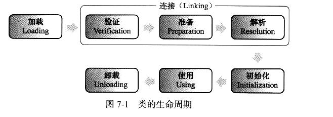
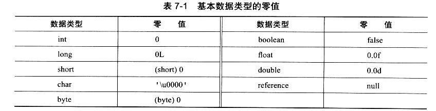

七、**类加载机制**

# 一、类加载的时机

## 1、类的加载阶段简介

下述的 **类没有特殊提示都是指类和接口**

```
类从被加载到虚拟机内存中开始，到卸载出内存为止，它的整个生命周期包括：
加载(Loading)、
验证(verification)、
准备(preparation)、
解析(Resolution)、
初始化(Initialization)、
使用(using)、
卸载(unloading) 7个阶段.
其中验证、准备、解析 3个部分统称为链接(linking),这 7个阶段的发生顺序如下图所示
下述的 类没有特殊提示都是指类和接口
```



```
加载、验证、准备、初始化和卸载这5个阶段的顺序是确定的，类的加载过程必须按照这种顺序按部就班的开始，而解析阶段不一定：它在某些情况下可以在初始化阶段之后再开始，这是为了支持 java 语言的运行时绑定(也称为动态绑定或晚期绑定)。注意这里是按部就班的开始 而不是按部就班的进行或完成. 这些阶段通常都是互相交叉地混合式进行的，通常会在一个阶段执行的过程中调用、激活另外一个阶段。
```

## 2、初始化的时机

### 1、主动引用

```
对于初始化阶段，虚拟机规范则是严格规定了有且只有 5 种情况必须立即对类进行"初始化"(而加载、验证、准备自然需要在此之前开始)：
```

#### 1、

```
1、遇到 new 、getstatic、putstatic 或 invokestatic 这 4条字节码指令时，如果类没有进行过初始化，则需要先触发其初始化。
这4条指令最常见的 java 代码场景是: 使用 new 关键字实例化对象的时候、读取或设置一个类的静态字段(被 final 修饰、已在编译器把结果放入常量池的静态字段除外)的时候，以及调用一个类的静态方法的时候
```

#### 2、

```
使用 java.lang.reflect 包的方法对类进行反射调用的时候，如果类没有进行过初始化，则需要先触发其初始化。
```

#### 3、

```
当初始化一个类的时候，如果发现其父类还没有进行过初始化，则需要先触发其父类的初始化。

这里有例外 当一个类在初始化时，要求其父类全部都已经初始化过了，但是一个接口在初始化时，并不要求其父类接口全部都完成了初始化，只有在真正使用到父接口的时候(如引用接口中定义的常量)才会初始化
```

#### 4、

```
当虚拟机启动时，用户需要指定一个要执行的主类(包含 main() 方法的那个类)，虚拟机会先初始化这个主类。
```

#### 5、

```
当使用 jdk 1.7 的动态语言支持时，如果一个 java.lang.invoke.MethodHandle 实例最后的解析结果 REF_getStatic、REF_putStatic、REF_invokeStatic 的方法句柄，并且这个方法句柄所对应的类没有进行过初始化,则需要先触发其初始化。
```


```
对于这 5 种会触发类进行初始化的场景，虚拟机规范中使用了一个很强烈的限定语:"有且只有"，这 5 种场景中的行为称为对一个类进行主动引用。除此之外，所有引用类的方式都不会触发初始化，称为被动引用。
```


### 2、被动引用

#### 1、

```java
// 通过子类引用父类的静态字段，不会导致子类初始化
public class SuperClass {
    static{
        System.out.println("Super Init!!!");
    }
    public static int value = 123;
}

public class SubClass extends SuperClass {
    static {
        System.out.println("Sub Init!!!");
    }
}

public class Main1{
    public static void main(String[] args) {
        System.out.println(SubClass.value);
    }
}

```

```
上述代码运行之后，只会输出 "SuperClass init!",而不会输出"Sub Init!"。对于静态字段，只有直接定义这个字段的类才会被初始化，因此通过其子类来引用父类中定义的静态字段，只会触发父类的初始化而不会触发子类的初始化。至于是否要触发子类的加载和验证，在虚拟机规范中并未明确规定，这点取决于虚拟机的具体实现.
```

#### 2、

```java
// 通过数组定义来引用类，不会触发子类的初始化
public class Main1{
    public static void main(String[] args) {
        SuperClass[] sca = new SuperClass[10];
    }
}
```

```
运行之后发现没有输出 "SuperClass init!",说明并没有触发类 org.fenixsoft.classloading.SuperClass 的初始化阶段。但是这段代码里面触发了另外一个名为"[Lorg.fenixsoft.classloading.SuperClass"的类的初始化阶段，对于用户代码来说，这并不是一个合法的类名称，它是一个由虚拟机自动生成的、直接继承于 java.lang.Obejct 的子类，创建动作由字节码指令 newarray 触发。

这个类代表了一个元素类型为 org.fenixsoft.classloading.SuperClass 的一维数组，数组中应有的属性和方法(length 属性 clone()方法)都实现在这个类里。
```


#### 3、

```java
// 常量在编译阶段会存入调用类的常量池中，本质上并没有直接引用到定义常量的类，因此不会触发定义常量的类的初始化。

public class ConstClass {
    static{
        System.out.println("Super Init!!!");
    }
    public static final String HELLO = "hello world";
}

public class Main1{
    public static void main(String[] args) {
        System.out.println(ConstClass.HELLO);
    }
}
```


```
上述代码运行之后，也没有输出"ConstClass init!",这是因为虽然在java源码中引用了 ConstClass 类中的常量 HELLO，但其实在编译阶段通过常量传播优化，已经将此常量的值"hello world" 存储到了 Main1 的常量池中，以后 Main1 对常量 ConstClass.HELLO 的引用实际都被转化为 Main1 类对自身常量池的引用了。也就是说，实际上 Main1 的 Class 文件之中并没有 ConstClass 类的符号引用入口。这两个类在编译成 Class 之后就不存在任何联系了。
```


# 3、类的加载过程

```
接下来我们详细讲解一下 java 虚拟机中类加载的全过程，也就是加载、验证、准备、解析和初始化这 5 个阶段所执行的具体动作。
```

## 1、加载

```
"加载"是"类加载"(Class Loading) 过程的一个阶段，希望读者没有混淆这两个看起来很相似的名词。在加载阶段，虚拟机需要完成以下 3 件事情：
1、通过一个类的全限定名来获取定义此类的二进制字节流。
2、将这个字节流所代表的静态存储结构转化为方法区的运行时数据结构
3、在内存中生成一个代表这个类的 java.lang.Class 对象，作为方法区这个类的各种数据的访问入口。
```

```
通过一个类的全限定名来获取定义此类的二进制字节流。 
虚拟机并没有指明二进制字节流要从一个 Class 文件中获取，准确地说根本没有指明要从哪里获取、怎样获取。
可以从
1、从 ZIP 包中读取，这很常见，最终成为日后 JAR、EAR、WAR 格式的基础
2、从网络中获取，这种场景最典型的应用就是 Applet.
3、运行时计算生成，这种场景使用的最多的就是动态代理技术
4、由其他文件生成，典型场景是 JSP 应用，即由 JSP 文件生成对应的 Class 类
5、从数据库中读取，这种场景相对少见些，例如有些中间件服务器(如 SAP Netweaver)可以选择把程序安装到数据库中来完成程序代码在集群间的分发
```

```
加载阶段完成后，虚拟机外部的二进制字节流就按照虚拟机所需的格式存储在方法区之中，方法区中的数据存储格式由虚拟机实现自行定义，虚拟机规范未规定此区域的具体数据结构。然后在内存中实例化一个 java.lang.Class 类的对象(并没有明确规定是在 java 堆中，对于 HotSpot 虚拟机而言，Class对象比较特殊，它虽然是对象，但是存放在方法区里面)，这个对象将作为程序访问方法区中的这些类型数据的外部接口
```

```
加载阶段与链接阶段的部分内容(如一部分字节码文件格式验证工作)是交叉进行的，加载阶段尚未完成，链接阶段可能已经开始了，但这些夹在加载阶段之中进行的动作，任然属于连接阶段的内容，这两个阶段的开始时间仍然保持着固定的先后顺序。
```

## 2、验证

```
验证是链接阶段的第一步，这一阶段的目的是为了确保 Class 文件的字节流中包含的信息符合当前虚拟机的要求，并且不会危害虚拟机自身的安全。
验证阶段大致上需要下面 4 个阶段的验证动作。

1、文件格式验证
2、元数据验证
3、字节码验证
4、符号引用验证

验证失败将会抛出各种 Error 错误
```

## 3、准备

```
准备阶段是正式为类变量分配内存并设置类变量初始值的阶段，这些变量所使用的内存都将在方法区中进行分配。这个阶段中有两个容易产生混淆的改变需要强调下，首先，这时候进行内存分配的仅包括类变量(被 static 修饰的变量)，而不包括实例变量，实例变量将会在对象实例化时随着对象一起分配在 java 堆中。其次，这里所说的初始值"通常情况"下是数据类型的零值，假设一个类变量的定义为：
public static int value = 123;
那变量 value 在准备阶段过后的初始值为 0 而不是 123，因为这时候尚未开始执行任何 java 方法，而把 value 赋值为 123 的 putstatic 指令是程序被编译后，存放于类构造器<clinit>()方法之中，所以把 value 赋值为 123 的动作将在初始化阶段才会执行。
```




```
上面提到，在 "通常情况"下初始值是零值，那相对的会有一些"特殊情况"：如果类字段的字段属性表中存在 ConstantValue 属性，那在准备阶段变量 value 就会被初始化为 ConstantValue 属性所指定的值，假设上面类变量 value 的定义变为：
public static final int value = 123;
编译时 javac  将会为 value 生成 ConstantValue 属性，在准备阶段虚拟机就会根据 ConstantValue 的设置将 value 赋值为 123;
```

## 4、解析

```
解析阶段是虚拟机将常量池内的符号引用替换为直接引用的过程
```

### 1、符号引用

```
符号引用(Symbolic References): 符号引用以一组符号来描述所引用的目标，符号可以是任何形式的字面量，只要使用时能无歧义的定位到目标即可。符号引用与虚拟机实现的内存布局无关，引用的目标并不一定已经加载到内存中。各种虚拟机实现的内存布局可以各不相同，但是它们能接受的符号引用必须都是一致的，因为符号引用的字面量形式明确定义在 java 虚拟机规范的 Class 文件格式中。
```

### 2、直接引用

```
直接引用可以是直接指向目标的指针、相对偏移量或是一个能间接定位到目标的句柄。直接引用是和虚拟机实现的内存布局相关的，同一个符号引用在不同的虚拟机实例上翻译出来的直接引用一般不会相同。如果有了直接引用，那引用的目标必定已经在内存中存在。
```

## 5、初始化

```
类初始化阶段是类加载过程中的最后一步，前面的类加载过程中，除了在加载阶段用户应用程序可以通过自定义类加载器参与之外，其余动作完全由虚拟机主导和控制。到了初始化阶段，才真正开始执行类中定义的 java 程序代码(或者说是字节码)。
```

```
<clinit>() 方法是由编译器自动收集类中的所有类变量的赋值动作和静态语句块(static{}块)中的语句合并产生的，编译器收集的顺序是由语句在源文件中出现的顺序所决定的，静态语句块中只能访问到定义在静态语句块之前的变量，定义在它之后的变量，在前面的静态语句块可以赋值，但是不能访问(因为在准备阶段已经初始化过了)
```

```
<clinit>() 方法与类的构造函数(或者说实例构造器<init>() 方法)不同，它不需要显式地调用父类构造器，虚拟机会保证在子类的<clinit>() 方法执行之前，父类的<clinit>() 方法已经执行完毕。因此在虚拟机中第一个被执行的<clinit>() 方法的类肯定是 java.lang.Object
```

```
由于父类的<clinit>() 方法先执行，也就意味着父类中定义的静态语句块要优先于子类的变量赋值操作。
```

```
<clinit>() 方法对于类或接口来说并不是必需的，如果一个类中没有静态语句块，也没有对变量的赋值操作，那么编译器可以不为这个类生成<clinit>() 方法
```

```
接口中不能使用静态语句块，但仍然有变量初始化的赋值操作，因此接口与类一样都会生成<clinit>() 方法。但接口与类不同的是，执行接口中的<clinit>()方法不需要先执行父接口的 <clinit>()方法。只有当父接口中定义的变量使用时，父接口才会初始化。另外，接口的实现类在初始化时也一样不会执行接口的 <clinit>() 方法
```

```
虚拟机会保证一个类的<clinit>() 方法在多线程中被正确的加锁、同步，如果多个线程同时去初始化一个类，那么只会有一个线程去执行这个类的 <clinit>() 方法，其他线程都需要阻塞等待，直到活动线程执行<clinit>() 方法完毕。如果在一个类的<clinit>() 方法中有耗时很长的操作，就可能造成多个进程阻塞，在实际应用中这种阻塞往往是很隐蔽的。
```


