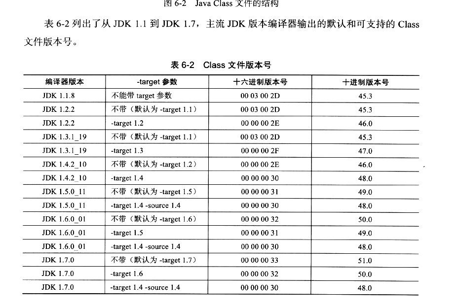
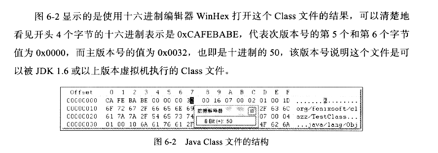
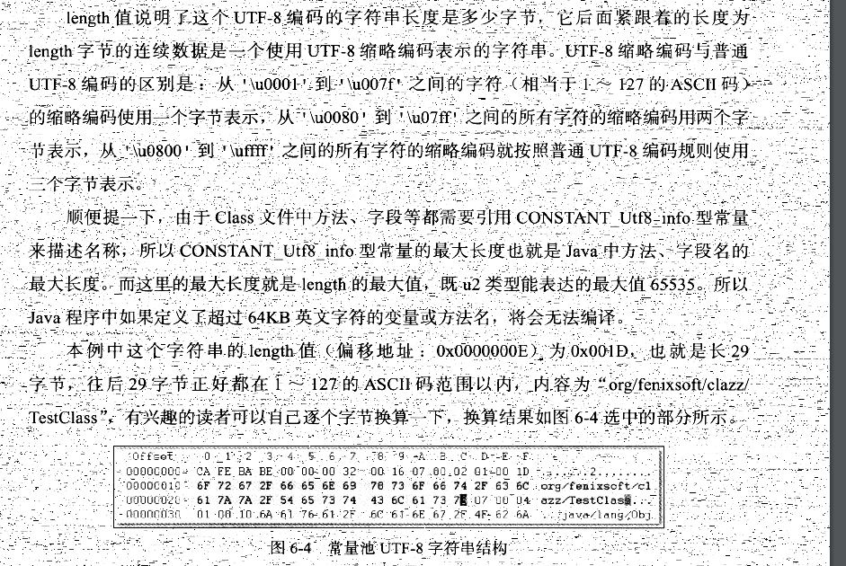
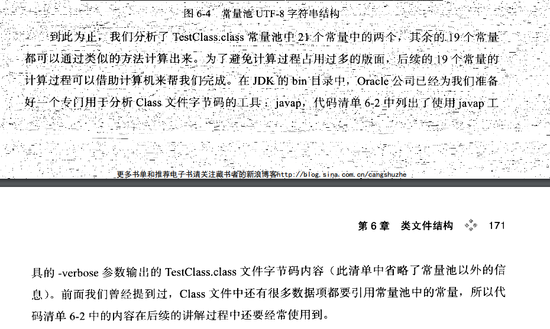
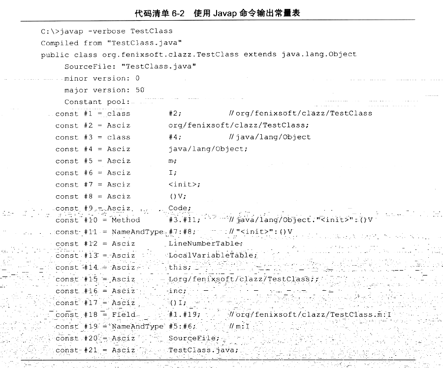
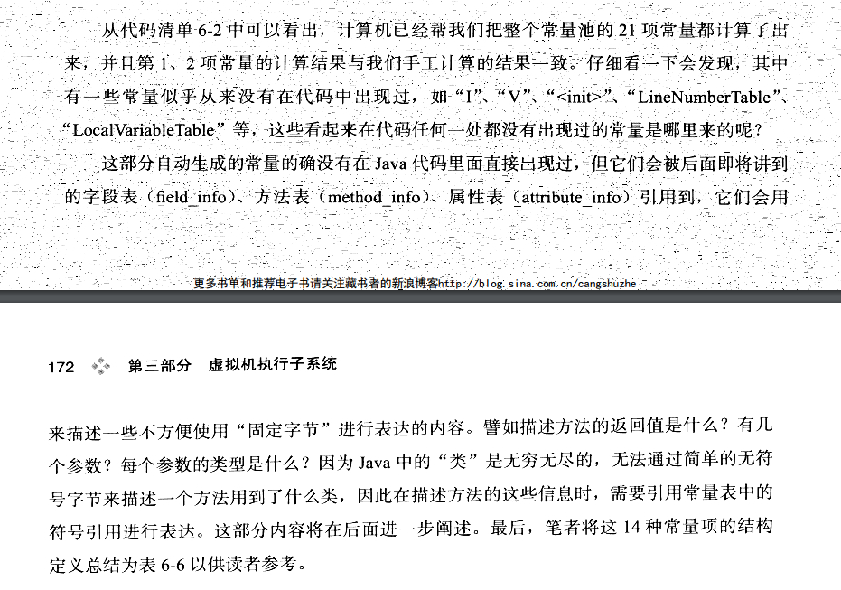
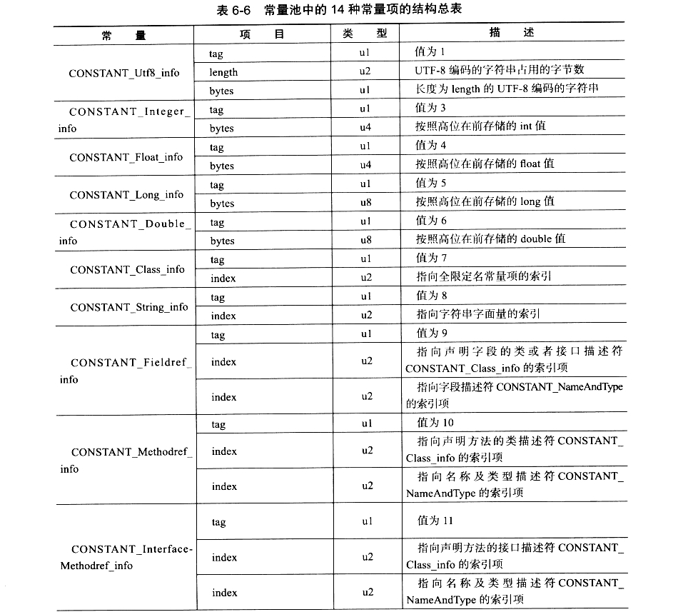

# 六、类文件结构

```
代码编译的结果从本地机器码转变为字节码 ，是存储格式发展的一小步，却是编程语言发展的一大步。
```

## 1、无关性的基石

```
字节序之Little-Endian&Big-Endian
1）Little-endian：将低序字节存储在起始地址（低位编址） 
2）Big-endian：将高序字节存储在起始地址（高位编址） 符合人类的思维 java 采用
	网络传输采用
```

| address | big-endian | little-endian |
| ------- | ---------- | ------------- |
| 0x0000  | 0x12       | 0xcd          |
| 0x0001  | 0x34       | 0xab          |
| 0x0002  | 0xab       | 0x34          |
| 0x0003  | 0xcd       | 0x12          |

```
对于 虚拟机的语言无关性
实现语言无关性的基础仍然是虚拟机和字节码存储的格式。java 虚拟机不和包括java在内的任何语言绑定，它只与 "Class 文件"这种特定的二进制文件格式所关联，Class 文件中包含了 java 虚拟机指令集和符号以及若干其他辅助信息。基于安全方面考虑，java 虚拟机规范要求在 Class 文件中使用许多强制性的语法和结构化约束，但任一门功能性语言都可以表示为一个能被 java 虚拟机所接受的有效的 Class 文件。作为一个通用的、机器无关的执行平台，任何其他语言的实现者都可以将java虚拟机作为语言的产品交付媒介。比如 JRuby等其他语言的编译器一样可以吧程序代码编译成 Class文件，来在虚拟机上运行。
```

```
java 语言中的各种变量、关键字和运算符号的语义最终都是由多条字节码命令组合而成的，因此字节码命令所能提供的语义描述能力肯定会比java语言本身更为强大。因此，有一些java语言本身无法有效支持的语言特性不代表字节码本身无法有效支持，这也为其他语言实现一些有别于java 的语言特性提供了基础。
```


## 2、Class 类文件的结构

```
任何一个 Class 文件都对应着唯一一个类或接口的定义信息，但反过来说，类或结构并不一定都得定义在文件里(臂如类或接口也可以通过类加载器直接生成)。任意一个有效的类或者接口所应当满足的格式称为 "Class 文件格式"，实际上它并不一定以磁盘文件的形式存在。
```


```
Class文件是一组以8位字节为基础单位的二进制流，各个数据项目严格按照顺序紧凑地排列在 Class 文件之中，中间没有添加任何分隔符，这使得整个 Class 文件中存储的内容几乎全部是程序运行的必要数据，没有空隙存在。当遇到需要占用 8 位字节以上空间的数据项时，则会按照高位在前的方式分割成若干个 8 位字节进行存储
```

```
Class 文件 采用伪结构来存储数据。只有两种数据类型 无符号数和表。
```

```
无符号数属于基本的数据类型，以 u1、u2、u4、u8 来分别表示 1 个字节、 2 个字节、 4 个字节、 8 个字节的无符号数，无符号数可以用来描述数字、索引类型、数量值或者按照 UTF-8 编码构成的字符串值。
```

```
表是由多个无符号数或者其他表作为数据项构成的复合数据类型，所有表都习惯性的以 "_info" 结尾。表用于描述有层次关系的复合结构的数据，整个 Class 文件本质上就是一张表，它有下表所示的数据项构成。 
```

| 类型           | 名称                                            | 数量                  |
| :------------- | :---------------------------------------------- | :-------------------- |
| u4             | magic(魔术)                                     | 1                     |
| u2             | minor_version(次要的版本)                       | 1                     |
| u2             | major_version(主要的版本)                       | 1                     |
| u2             | constant_pool_count(常量池的数量 是从 1 开始的) | 1                     |
| cp_info        | constant_pool(常量池是从 0 开始的，所以要减 1)  | constant_pool_count-1 |
| u2             | access_flags(使用标记)                          | 1                     |
| u2             | this_class                                      | 1                     |
| u2             | super_class                                     | 1                     |
| u2             | interfaces_count                                | 1                     |
| u2             | interfaces                                      | interfaces_count      |
| u2             | fields_count                                    | 1                     |
| field_info     | fields                                          | fields_count          |
| u2             | methods_count                                   | 1                     |
| method_info    | methods                                         | methods_count         |
| u2             | attributes_count(属性)                          | 1                     |
| attribute_info | attributes                                      | 1                     |

```
无论是无符号数还是表，当需要描述同一类型但数量不定的多个数据时，经常会使用一个前置的容量计数器加若干个连续的数据项的形式，这时称这一系列连续的某一类型的数据为某一类型的集合。
```

```
Class 结构无论是顺序还是数量，甚至与数据存储的字节序(Byt Ordering, Class 文件中字节序为 Big-Endian) 这样的细节，都是被严格限定的，哪个字节代表什么含义，长度是多少，先后顺序如何，都不允许改变。接下来我们将一起看看这个表中各个数据项的具体含义。
```


### 1、魔术与 Class 文件的版本

```
每个 Class 文件的头 4 个字节成为魔数(Magic Number),它的唯一作用是确定这个文件是否为一个能被虚拟机接受的 Class 文件。很多文件存储标准中都使用魔数来进行身份识别，臂如图片格式，如gif 或者 jpeg 等在文件头中都存有魔数。使用魔数而不是扩展名来进行识别主要是基于安全方面的考虑，因为文件扩展名可以随意的改动。文件格式的制定者可以自由的选择魔数值，java选择了 0xCAFEBABE (咖啡宝贝)，和java 的商标也扯上了关系。
```

```
紧接着魔数的 4个字节存储的是 Class 文件的版本号，第5个和第6个字节是次版本号(Minor Version),第 7 和第 8 个字节是主版号(Major Version).java 的版本号是从 45 开始的，jdk1.1 之后的每个JDK大版本发布主版本号向上加 1.(JDK 1.0 ~ 1.1 使用了 45.0 ~ 45.3 的版本号)，高版本的 JDK 能向下兼容以前的版本的 Class 文件，但不能运行以后版本的 Class 文件，即使文件格式并未发生任何改变，虚拟机也必须拒绝执行超过其版本号的 Class 文件。 
```

```
例如：JDK 1.1 能支持版本号为 45.0 ~ 45.65535 的 Class 文件，无法执行版本号为 46.0 以上的 Class 文件，而 JDK1.2 则能支持 45.0~46.65535 的 Class 文件。JDK1.7最大可生成Class文件的主版本号为 51.0
```



### 2、常量池

```
紧接着主次版本号之后的是常量池入口，常量池可以理解为 Class 文件之中的资源仓库，它是 Class 文件结构中与其他项目关联最多的数据类型，也是占用 Class 文件空间最大的数据项目之一，同时它还是在 Class 文件中第一次出现的表类型数据项目。
```

```
由于常量池中常量的数量是固定不变的，所以在常量池的入口需要放置一项 u2 类型的数据，代表常量池计数值(constant_poot_count)。与java 中语言习惯不一样的是，这个容量计数是从 1 而不是 0 开始的(一般是从0开始的，你从1开始就说明你必须 减1在计算总数的时候，因为  01234 你只用道了 1234 所以这length是 5-1 等于 4)，臂如下图。常量池容量(偏移地址：0x0000 0008)为十六进制数的 0x0016，即十进制的22，这就代表常量池中有21项常量，索引值范围为 1 ~ 21 。在 Class 文件格式规范制定之时，设计者将第0项常量空出来是有特殊考虑的，这样做的目的在于满足后面某些指向常量池的索引值的数据在特定的情况下需要表达"不引用任何一个常量池"的项目的含义，这种情况就可以把索引值置为 0 来表示。Class 文件结构中只有常量池的容量计数是从 1 开始，对于其他集合类型，包括接口索引集合、字段表集合、方法表集合等的容量计数都与一般习惯相同，是从 0 开始。
```

```
是16进制数的编译器打开的所以显示的是 16进制的
为什么用16的 因为 二进制的 0000 等于16 的 0，所以 0000 0000 一字节可以表现为 00 的十六进制，因为 1+2+4+8=15 嘛
```





```
常量池中主要存放两大类常量，字面量(Literal)和符号引用(Symbolic References).字面量比较接近于 java 语言层面的常量概念，如文本字符串、声明为 Final 的常量值等。而符号引用则属于编译原理方面的概念。包括了下面三类常量：

类和接口的全限定名(Fully Qualified Name)
字段的名称和描述符(Descriptor)
方法的名称和描述符
```

```
java 代码在 进行 javac 编译的时候，并不像C和C++ 那那样有"连接"这一步骤，而是在虚拟机加载 Class 文件的时候进行动态链接。也就是说，在Class 文件中不会保存各个方法、字段的最终内存布局信息，因此这些字段、方法的符号引用不经过运行期转换的话无法得到真正的内存入口地址，也就无法直接被虚拟机使用。当虚拟机运行时，需要从常量池获得对应的符号引用，再在类创建时或运行时解析、翻译到具体的内存地址之中。
```

```
常量池中每一项常量都是一个表，在 JDK1.7 之前共有11种结构各不相同的表结构数据，在JDK1.7中为了更好地支持动态语言调用，又额外增加了3种
MethodHandle_info
CONSTANT_MethodType_info
CONSTANT_InvokeDynamic_info
```

常量池的项目类型 表6-3

| 类型                             | 标志 | 描述                   |
| -------------------------------- | ---- | ---------------------- |
| CONSTANT_Utf8_info               |      | UTF-8编码的字符串      |
| CONSTANT_Integer_info            | 3    | 整型字面量             |
| CONSTANT_Float_info              | 4    | 浮点型字面量           |
| CONSTANT_Long_info               | 5    | 长整型字面量           |
| CONSTANT_Double_info             | 6    | 双精度浮点型字面量     |
| CONSTANT_Class_info              | 7    | 类或接口的符号引用     |
| CONSTANT_String_info             | 8    | 字符串类型字面量       |
| CONSTANT_Fieldref_info           | 9    | 字段的符号引用         |
| CONSTANT_Methodref_info          | 10   | 类中方法的符号引用     |
| CONSTANT_InterfaceMethodref_info | 11   | 接口中方法的符号引用   |
| CONSTANT_NameAndType_info        | 12   | 字段或方法的符号引用   |
| CONSTANT_MethodHandle_info       | 15   | 表示方法句柄           |
| CONSTANT_MethodType_info         | 16   | 标识方法类型           |
| CONSTANT_InvokeDynamic_info      | 18   | 表示一个动态方法调用点 |

```
之所以说常量池是最繁琐的数据，是因为这14中常量类型各自均有自己的结构。回头看看图6-2 中常量池的第一项常量，它的标志位(偏移地址：0x0000 000A) 是 0x007,查表6-3(就是上表)的标志列发现这个常量属于 CONSTANT_Class_info类型，此类型的常量代表一个类或者接口的符号引用。CONSTANT_Class_info的结构比较简单。见下表
```

CONSTANT_Class_info型常量的结构 表 6-4

| 类型 | 名称       | 数量 |
| ---- | ---------- | ---- |
| u1   | tag        | 1    |
| u2   | name_index | 1    |

```
tag是标志位，上面已经讲过了，它用于区分常量类型；name_index是一个索引值，它指向常量池中一个 CONSTANT_Utf8_info 类型常量，此常量代表了这个类(或者接口)的全限定名，这里 name_index 值(偏移位置：0x0000 000B) 为 0x0002,也即是指向了常量池中的第二项常量。继续从图 6-3 中查找第二项常量，它的标志位(地址： 0X0000 000D) 是 0x001,查表6-3 可知确实是一个 CONSTANT_Utf8_info 类型的常量。CONSTNAT_Utf8_info 类型的结构见表6-5就是下表
```

CONSTANT_Utf8_info型常量的结构

| 类型 | 名称   | 数量   |
| ---- | ------ | ------ |
| u1   | tag    | 1      |
| u2   | length | 1      |
| u1   | bytes  | length |

```
length 值说明了 UTF-8 编码的字符串长度是多少字节，它后面紧跟着的长度为length字节的连续数据是一个使用  UTF-8的缩略编码表示的字符串。
```









```
汇编中ascii和asciz的异同
.ascii和.asciz的区别是，.asciz会在字符串后自动添加结束符\0.

.ascii "string" …
    在对象文件中按照指定的方法插入数字字符串,该字符串末尾没有NUL字符。该命令一次可以插入多个字符串,字符串之间用","分隔。下面的例子在对象文件中插入3个字节长的字符串。
    .ascii "JNZ"      ; 插入3个字节: 0x4A 0x4E 0x5A
 
.asciz "string" …
    和.ascii相似,只是生成的字符串以NUL(0x00)结尾。下面的例子在对象文件中插入4个字节长的字符串。
    .ascii "JNZ"      ; 插入4个字节: 0x4A 0x4E 0x5A 0x00
```

```
所以 asciz 应该是 utf-8 的缩略编码
```



常量池中14种常量项的结构总表




### 3、访问标志

```
在常量池结束之后，紧接着的两个字节代表访问标志(access_flags)，这个标志用来识别一些类或者接口层次的访问信息，包括：这个Class是类还是接口；是否定义为 public 类型; 是否定义为 abstract 类型; 如果是类的话，是否被声明为 final等。具体的标志为以及标志的含义见表6-7
```

表6-7 访问标志

| 标志名称                        | 标示值 | 含义                                                         |
| ------------------------------- | ------ | ------------------------------------------------------------ |
| ACC_PUBLIC                      | 0x0001 | 是否为public类型                                             |
| ACC_FINAL                       | 0x0010 | 是否被声明为final,只有类可设置                               |
| ACC_SUPER                       | 0x0020 | 是否允许使用 invokespecial 字节码指令的新语义，invokespecial 指令的语意在JDK1.2发生过改变，为了区别这条指令使用哪种语意，JDK1.0.2之后编译出来的类的这个标志都必须为真 |
| ACC_INTERFACE                   | 0x0200 | 标识这是一个接口                                             |
| ACC_ABSTRACT                    | 0x0400 | 是否为abstract类型，对于接口或者抽象类来说，此标志为真，其他类值为假 |
| ACC_SYNTHETIC synthetic(合成的) | 0x1000 | 标识这个类并非由用户代码产生的                               |
| ACC_ANNOTATION                  | 0x2000 | 标识这是一个注解                                             |
| ACC_ENUM                        | 0x4000 | 标识这是一个枚举                                             |

