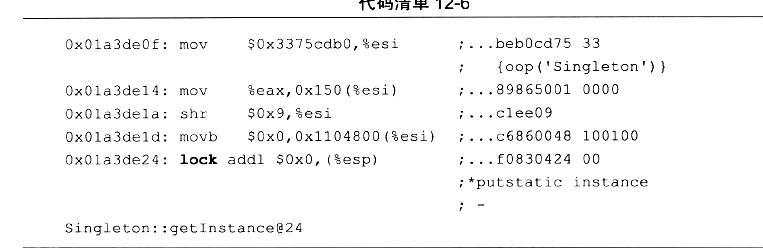
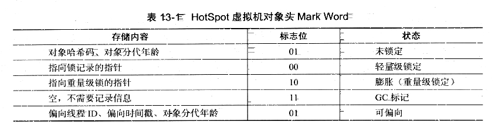
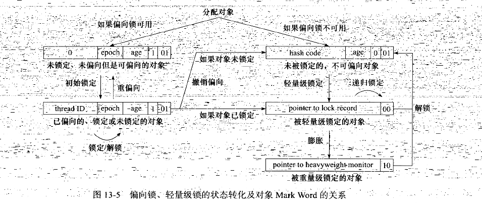

# 1、内存间交互操作

```
为了屏蔽不同平台上的内存模型的差异，所以有了 java 内存模型
```

```
java 内存模型的变量代表了。 实例字段，静态字段和构成数组对象的元素，但不包括局部变量与方法参数。因为后者是线程私有的不会被共享，自然就不存在竞争问题。
```


```
lock(锁定)：作用于主内存的变量，它把一个变量标识为一条线程独占的状态
unlock(解锁)：作用于主内存的变量，它把一个处于锁定状态的变量释放出来，释放后的变量才可以被其他线程锁定。
read(读取): 作用于主内存的变量，它把一个变量的值从主内存传输到线程的工作内存中，以便随后的 Load 动作使用
load(加载)：作用于工作内存的变量，它把 read 操作从主内存中得到的变量值放入工作内存的变量副本中。
use(使用)：作用于工作内存的变量，它把工作内存中一个变量的值传递给执行引擎，每当虚拟机遇到一个需要使用到变量的值的字节码指令时将会执行这个操作。
assign(赋值):作用于工作内存的变量，它把一个从执行引擎接受到的值赋给工作内存的变量，每当虚拟机遇到一个给变量赋值的字节码指令时执行这个操作。
store(存储):作用于工作内存的变量，它把工作内存中一个变量的值传送到主内存中，以便随后的 write 操作使用
write(写入): 作用于主内存的变量，它把 store 操作从工作内存中得到的变量的值放入主内存的变量。

lock unlock
read 将主内存变量读取到工作内存中
load 将 read 传过来的变量放入工作内存的副本变量中
use 将工作内存的变量传递给执行引擎。在遇到需要变量的字节码的时候需要
assign: 将执行引擎的变量传递给工作内存，在遇到需要赋值的字节码的时候需要
store:将工作内存的变量读取到主内存中
write: 将 store 读取过来的变量放入到主内存中
```


```
read和load、store和write 操作之一单独出现，而且必须顺序执行
java模型只要求两个操作必须按顺序执行，而没有保证连续执行，也就是说在 read和load操作之间可以插入其他的指令的

java 内存模型规定了在执行上述8种基本操作时必须满足如下规则。
1、不允许read和load、store和write 操作之一单独出现，而且必须顺序执行。即不允许一个变量从主内存读取了但工作内存不接受，或者从工作内存发起回写了但主内存不接受的情况出现。

2、不允许一个线程丢弃它最近的 assign 操作，即变量在工作内存中改变了之后必须把该变化同步回主内存。

3、不允许一个线程无原因的(没有发生过任何 assign 操作)把数据从线程的工作内存同步回主内存中

4、一个新的变量只能在主内存中"诞生"，不予许在工作内存中直接使用一个未被初始化(load或assign)的变量，换句话说，就是对一个变量实施 use、store 操作之前，必须先执行过了 load 和 assign 操作 

5、一个变量在同一个时刻只允许一条线程对其进行 lock 操作，但 lock 操作可以被同一条线程重复执行多次，多次执行 Lock 后，只有执行相同次数的 unlock 操作，变量才会被解锁。

6、如果对一个变量执行 Lock 操作，那将会清空工作内存中此变量的值，在执行引擎使用这个变量前，需要重新执行 load 或 assign 操作初始化变量的值。

7、如果一个线程事先没有被 lock 操作锁定，那就不允许对它进行 unlock 操作，也不允许去 unlock 一个被其他线程锁定的变量

8、对一个变量执行 unlock 操作前，必须先把此变量同步回主内存中(执行 store write 操作)
```


# 2、对于 volatile 型变量的特殊规则

```
规定了 read load use     assign store write 必须同时进行 而且必须连续一起、
i++ 先read ， 运算assign，然后write 
read write assign这个才是原子性的


但是如果你使用了 volatile 变量的时候，对其进去加减的时候就不行了，因为这不是原子操作，比如 v = v + 30; 要使用 v 了所以你要进行 read load use
v+30; 然后使用 assign store write;然后刷新为 主内存，

v = v + 40; v + 40 操作一样，但这两个是两个线程并行的是，所以 v+30;以后马上 v+40 给覆盖了。

不会 v+40 在前面 v+30 在后面，因为 指令重排序被禁止了。
保证了代码的执行顺序与程序顺序相同。
```


```
虽然 java 内存模型允许虚拟机不保证 64 位数据类型的 load、store read write 这4个操作的原子性 也就是说 Load 可能只读取到 半个变量，其他的也一样，这就是 long 和 double 的非原子性协定。

但是现在各种商用虚拟机几乎都选择吧 64 位数据的读写操作作为原子操作来对待。
```




```
lock 前缀作用是使 CPU 的 Cache 写入了内存，该写入动作也会引起别的 CPU 或者别的内核无效化。 因为 Lock 指令吧 修改 同步到内存时，意味着所有之前的操作都已经执行完成，这样就形成了"指令重排序无法越过内存屏障"的效果。

volatile  变量读操作的性能消耗与普通变量几乎没有什么差别，但是写操作则可能会慢一些，因为它需要在本地代码中插入许多内存屏障指令来保证处理器不会发生乱序执行

lock前缀的指令在多核处理器下会引发了两件事情。
将当前处理器缓存行的数据会写回到系统内存。
这个写回内存的操作会引起在其他CPU里缓存了该内存地址的数据无效。

和缓存一致性没有关系，如果没有使用到 缓存一致性的话，那就没有问题了。


下面的话没有作用 
这样的话就会一直使用 缓存一致性，cpu 的 缓存就会频繁失效，也需要开始监听状态，来监听其他 cpu 的在缓存内的改动，也需要修改以后就要写回内存，不能发挥 cpu 缓存的作用
因为缓存一致性的关系，所以是内存可见性的，所以 禁止了重排序，因为每次都刷新到内存了，所以就要考虑到 内存的执行结果。所以就在 volatile 前后调换指令
但是只是在 lock 那个指令时才有的 缓存一致性
```


```
.读取变量的初始值(如果是第一次，还要将该变量copy一份然后放入工作内存作为高速cache使用)

2.cpu进行加1操作

3.cpu将修改后的值写入工作内存。


其实i++分为3步，即3条指令集，读取值i；i+1；i写主存

1. 线程1读取的时候

2.线程2执行i++，i=11

3.i=11刷新到线程1，但是线程1可能执行到第3步写主存了，然后i强制失效，拉取主存值11。

4.线程1写主存，i=11.相当于线程1的i++未执行。

根本原因：i++不能保证原子性


假如现在线程A读取了inc(假设此时值为10)的值，此时线程A阻塞，线程B开始抢占cpu资源，继续读取主存中Inc的值，并copy一份放入自己的工作内存中，然后进行加1操作，写入工作内存后立即(如果不用volatile，很难保证系统什么时候会回刷主存)回刷到主存中(此时volatile值为11)。此时A线程重新进入可运行状态并获得cpu资源开始运行，由于B线程已经修改了Inc的值，所以此时A线程的工作内存中的缓存已经失效，但由于A线程在阻塞前已经执行了inc的读取操作，所以线A继续执行inc+1操作，此时执行完自增操作，写入工作内存Inc的值是11，最后回刷到主存中。因此此时主存中的最终值是11，而不是12.  正是因为这样，虽然使用volatile修饰，最终运行结果仍然不是我们所期待的。究其原因，还是因为volatile只保证了数据的可见性，并不能保证对被修饰的变量的操作的原子性。
```


# 3、现行发生原则

```
happens-before
下面的 现行发生原则不需要任何的同步块同步
1、程序次序规则
	在一个线程内，按照程序代码顺序，书写在前面的操作先行发生于书写在后面的操作。准确的说，应该是控制流顺序而不是程序代码顺序，因为要考虑分支、循环。其实就是程序在逻辑上的顺序
	
2、管程锁定规则
	一个 unlock 操作先行发生于后面对同一个锁的 lock 操作。这里必须强调的是同一个锁，而"后面"是指时间上的先后顺序
	
3、volatile 变量规则
	对一个 volatile 变量的写操作先行发生于后面对这个变量的读操作，这里的"后面"同样是指时间上的先后顺序。 
	也就是说 volatile i; i = 2;  int s = i;
	这样子 s=i 不能排序到 i = 2 前面。
	但是  volatile i; int s = i; i = 2; 读操作本来就在写操作前面就没事了
	其实 现行发生 指的就是 并发下；
	
4、线程启动规则
	Thread 对象的 start()方法先行发生于此线程的每一个动作。
	
5、线程中断规则：对线程interrupt()方法的调用先行发生于被中断线程的代码检测到中断事件的发生

6、线程终结规则：线程中所有的操作都先行发生于线程的终止检测，我们可以通过Thread.join()方法结束、Thread.isAlive()的返回值手段检测到线程已经终止执行

7、对象终结规则：一个对象的初始化完成先行发生于他的finalize()方法的开始

8、传递规则：如果操作A先行发生于操作B，而操作B又先行发生于操作C，则可以得出操作A先行发生于操作C
```


# 4、锁

```
Java虚拟机对synchronized的优化
```


```
从上面的对象头 Mark Word
可以看出 锁不同时，对象的 Mark Word 保存的东西不同
```




```
自旋锁和自适应自旋
在要获取重量级锁的时候，首先会尝试使用 CAS 加自旋来获取，自旋次数自适应
```

```
锁消除 如果 JVM即时编译器 认为它们是线程私有的，就会吧锁消除掉 是在jvm 里面 消除的。不是在 class 编译器 编译的
```

```
锁粗化
	如果JVM 探测到有这样一串零碎的操作都对同一个对象加锁，将会把枷锁同步的范围扩展到(粗化)到整个操作序列的外部。
	比如 StringBuffer sb = new StringBuffer();
	sb.append(s1);
	sb.append(s2);
	
	每一个 append 都是加锁的
	
	就会将其扩展到 第一个 append() 操作之前直到最后一个 append() 操作之后，这样只需要加锁一次就可以了。
```


## 轻量级锁

```
在代码进入同步块的时候，如果此同步对象没有被锁定(锁标志位为"01"状态)，虚拟机首先将当前线程的栈帧中建立一个名为锁记录(Lock Record)的空间，用于存储锁对象目前的 Mark Word 的拷贝(官方吧这份拷贝加了一个 Displaced 前缀，即 Displaced Mark Word),这时候线程堆栈与对象头的状态如下图。现在只是有了这个空间，还并没有保存着对象锁的 Mark Word
```


```
然后，虚拟机将使用 CAS 操作尝试将对象的 Mark Word 更新为指向 Lock Record 的指针。如果这个更新动作成功了，那么这个线程就拥有了该对象的锁。并且对象 Mark Word 的锁标志位(Mark Word 的最后 2 bit)将转变为 "00"，即表示此对象处于轻量级锁定状态，这时候线程堆栈与对象头的状态如下图
```


```
如果这个更新操作失败了，虚拟机首先会检查对象的 Mark Word 是否指向当前线程的栈帧，如果当前线程已经拥有了这个对象的锁，那就可以直接进入同步快继续执行，否则说明这个锁对象已经被其他线程抢占了。如果有两条以上的线程争用同一锁，那轻量级锁就不再有效，要膨胀为重量级的锁，锁标志的状态值变为"10",Mark Word 中存储的就是指向重量级锁(互斥锁)的指针，后面等待锁的线程也要进入阻塞状态。
```

```
解锁：
	它的解锁过程也是通过 CAS 操作来进行的，如果对象的 Mark Word 仍然指向着线程的锁记录，那就用 CAS 操作吧对象当前的 Mark Word 和 线程中复制的 Displaced Mark Word 替换回来，如果替换成功，整个同步过程就完成了。如果替换失败，说明有其他线程尝试过获取该锁，那就要在释放锁的同时，唤醒被挂起的线程。
	
	轻量级锁能提升程序同步新能的依据是"对于绝大部分的锁，在整个同步周期内都是不存在竞争的"，这是一个经验数据。如果没有竞争，轻量级锁使用 CAS 操作避免了使用互斥量的开销，但如果存在锁竞争，除了互斥量的开销外，还额外发生了 CAS 操作，因此在有竞争的情况下，轻量级锁会比传统的重量级锁更慢。
```


## 偏向锁

```
如果说轻量级锁是在无竞争的情况下使用 CAS 操作去消除同步使用的互斥量，那偏向锁就是在无竞争的情况下吧整个同步都消除掉，连 CAS 操作都不做了
```

```
这个锁会偏向于第一个获得它的线程，如果在接下来的执行过程中，该锁没有被其他的线程获取，则持有偏向锁的线程将永远不需要再进行同步。
```

```
假设当前虚拟机启用了偏向锁(jdk1.6默认开启)，那么，当锁对象第一次被线程获取的时候，虚拟机将会把对象头中的标志位设为"01",即偏向模式。同时使用 CAS 操作把获取到这个锁的线程的 ID 记录在对象的 Mark Word 之中，如果 CAS 操作成功，持有偏向锁的线程以后每次进入这个锁相关的同步块时，虚拟机都可以不再进行任何同步操作。
```

```
当有另外一个线程去尝试获取这个锁时，偏向模式就宣告结束。根据锁对象目前是否处于被锁定的状态，撤销偏向(Revoke Bias)后恢复到未锁定(标志位为"01")或轻量级锁定(标志位为"00")的状态, 后续的同步操作就如上面介绍的轻量级锁那样执行。
```



```
偏向锁的值为 01; 就说明偏向锁在 jdk 开启了，进入锁的时候会自动使用偏向锁
00 说明没有开启，jdk 里面关闭了
```

```
偏向锁可以提高带有同步同步但无竞争的程序性能。它同样是一个带有效益权衡性质的优化，也就是说，它并不一定总是对程序运行有利，如果程序中大多数的锁总是被多个不同的线程访问，那偏向模式就是多余的。在具体分析的前提下，有时候使用参数
-XX:-UseBiasedLocking 来禁止偏向锁优化反而可以提高性能
```

```
偏向锁一旦有其他线程竞争同一个锁，如果其他线程来了以后发现是偏想锁，但是对象头指向的 JavaThread 对象的指针地址的线程没有运行方法块，就将其偏向锁对象头改为即将要进入同步块的 JavaThread 对象的指针地址。不升级成轻量级锁

如果偏向锁有两个线程争夺。就会升级成轻量级锁，没有获取锁的就 cas 自旋， 自旋到临界点，就升级成重量级锁
```


# 5、synchronized实现原理

```
关键字synchronized可以修饰方法或者以同步块的形式来进行使用，它主要确保多个线程在同一个时刻，只能有一个线程处于方法或者同步块中，它保证了线程对变量访问的可见性和排他性。
```

```
对于同步块的实现是通过 monitorenter 和 monitorexit 指令，而同步方法是依靠方法修饰符上面的 ACC_SYNCHRONIZED 来完成的。

上述的两种方式，无论采用的是哪一种方式，其本质是对一个对象的监视器(monitor)进行获取，而这个获取过程是排他的，也就是说同一时刻只有一个线程获取到由 synchronized 所保护对象的监视器。

ynchronized允许使用任何的一个对象作为同步的内容，因此任意一个对象都应该拥有自己的监视器（monitor），当这个对象由同步块或者这个对象的同步方法调用时，执行方法的线程必须先获取到该对象的监视器才能进入同步块或者同步方法，而没有获取到监视器（执行该方法）的线程将会被阻塞在同步块和同步方法的入口处，进入BLOCKED状态。

下图描述了对象、对象的监视器、同步队列和执行线程之间的关系：
```


```
从上图中我们可以看到，任意线程对Object（Object由synchronized保护）的访问，首先要获得Object的监视器。如果获取失败，线程进入同步队列，线程状态变为BLOCKED。当访问Object的前驱（获得了锁的线程）释放了锁，则该释放操作唤醒阻塞在同步队列中的线程，使其重新尝试对监视器的获取。
```


