# 1、java内存区域与内存溢出异常

## 1、运行时数据区域

```
java虚拟机在执行 java 程序的过程中会把它所管理的内存划分为若干个不同的数据区域。这些区域都有各自的用途，以及创建和销毁的时间，有的区域随着虚拟机进程的启动而存在，有些区域则依赖用户线程的启动和结束而建立和销毁。
```

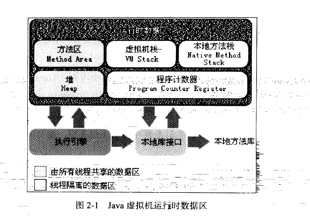


### 1、程序计数器

```
程序计数器(Program Counter Register) 是一块较小的内存空间，它可以看作是当前线程所执行的字节码的行号指示器。在虚拟机的概念模型里(仅是概念模型，各种虚拟机可能会通过一些更高效的方式去实现)，字节码解释器工作时就是通过改变这个计数器的值来选取下一条需要执行的字节码指令，分支、循环、跳转、异常处理、线程恢复等基础功能都需要依赖这个计数器来完成。

由于 java 虚拟机的多线程是通过线程轮流切换并分配处理器执行时间的方式来实现的，在任何一个确定的时刻，一个处理器(对于多核处理器来说是一个内核)都只会执行一条线程中的指令。因此，为了线程切换后能恢复到正确的执行位置，每条线程都需要有一个独立的程序计数器，各条线程之间计数器互不影响，独立存储，我们称这类内存区域为"线程私有"的内存。

如果线程正在执行的是一个 java 方法，这个计数器记录的是正在执行的虚拟机字节码指令的地址，如果正在执行的是 Native 方法，这个计数器值则为空(undifined). 此内存区域是唯一一个在 java 虚拟机规范中没有规定任何 OutOfMemoryError 情况的区域。

总而言之，就是记录每个线程正在执行的字节码指令的地址，好让线程切换回来的时候，能够找到它被切换到其他线程时，正在执行的字节码指令的地址。是线程私有的
```

### 2、java 虚拟机栈

```
与程序计数器一样，java 虚拟机栈(java Virtual(虚拟) Machine(机械) Stacks)也是线程私有的，它的生命周期与线程相同。虚拟机栈描述的是 java 方法执行的内存模型，每个方法在执行的同时都会创建一个栈帧(Stack-Frame) 用于存储局部变量表、操作数栈、动态链接、方法出口等信息。每个方法从调用直至完成的过程，就对应这一个栈帧在虚拟机栈中入栈到出栈的过程。

经常有人吧 java 内存区分为 堆内存(Heap)和栈内存(Stack),这种分法比较粗糙，java内存区域的划分实际上远比这复杂。这种划分方式的流行只能说明大多数程序员最关注的、与对象内存分配关系最密切的内存区域就是这两块。其中所指的"堆"后面讲述，二所指的"栈"就是现在讲的虚拟机栈，或者说是虚拟机栈中局部变量表部分。

局部变量表存放了编译期可知的各种基本数据类型(boolean、byte、char、short、int、float、long、double)、对象引用(reference类型，它不等同于对象本身，可能是一个指向对象起始地址的引用指针，也可能是指向一个代表对象的句柄或其他与此对象相关的位置)和 returnAddress 类型(指向了一条字节码指令的地址)

其中 64 位长度的 long 和 double 类型的数据会占用2个局部变量空间(Slot),其余的数据类型只占用1个。局部变量表所需的内存空间在编译期间完成分配，当进入一个方法时，这个方法需要在帧中分配多大的局部变量空间是完全确定的，在方法运行期间不会改变局部变量表的大小。

在 java 虚拟机规范中，对这个区域规定了两种异常状况：如果线程请求的栈深度大于虚拟机所运行的深度，将抛出 StackOverflowError 异常;如果虚拟机栈可以动态扩展(当前大部分的 java 虚拟机都可动态扩展，只不过 java 虚拟机规范中也允许固定长度的虚拟机栈)，如果扩展无法申请到足够的内存，就会抛出 OutOfMemoryError 异常。
```

### 3、本地方法栈

```
本地方法栈(Native Method Stack)与虚拟机栈所发挥的作用是非常相似的，它们之间的区别不过是虚拟机栈为虚拟机执行 java 方法(也就是字节码)服务，而本地方法栈则为虚拟机使用到的 Native 方法服务。在虚拟机规范中对本地方法栈中方法使用的语言、使用方法与数据结构并没有强制规定，因此具体的虚拟机可以自由实现它。甚至有的虚拟机(比如 Sun HotSpot 虚拟机)直接就把本地方法栈和虚拟机栈合二为一。与虚拟机栈一样，本地方法栈也会抛出 StackOverflowError 和 OutOfMemoryError 异常。

```

### 4、java 堆

```
对于大多数应用来说，java 堆(java Heap) 是 java 虚拟机所管理的内存中最大的一块。java 堆是被所有线程共享的一块内存区域，在虚拟机启动时创建。此内存区域的唯一目的就是存放对象实例，几乎所有的对象实例都在这里分配内存。这一点在 java 虚拟机规范中的描述是 ： 所有的对象实例以及数组都要在堆上分配，但是随着 JIT 编译器的发展与逃逸分析技术逐渐成熟，栈上分配、标量替换优化技术将会导致一些微妙的变化发生，所有的对象都分配在堆上也渐渐变得不是那么"绝对"了。

java 堆是垃圾收集器管理的主要区域，因此很多时候也被称作"GC堆"(Garbage Collected Heap) 从内存回收的角度来看，现在收集器基本采用分代收集算法，所以java堆中还可以细分为:新生代和老年代;再细致一点的有 Eden 空间、From Survivor 空间、To Survivor 空间等。从内存分配的角度来看，线程共享的java 堆中可能划分出多个线程私有的分配缓冲区(Thread Local Allcation Buffer, TLAB)。不过无论如何划分，都与存放内容无关，无论哪个区域，存储的都仍然是对象实例，进一步划分的目的是为了更好的回收内存，或者更快的分配内存。在本章中，我们仅仅针对内存区域的作用进行讨论，java 堆中的上述各个区域的分配、回收等细节将是第三涨的主题。

根据java 虚拟机规范的规定，java 可以处于物理上不连续的内存空间中，只要逻辑上是连续的即可，就像我们的磁盘空间一样。在实现时，既可以实现成固定大小的，也可以是可扩展的，不过当前主流的虚拟机都是按照可扩展来实现的(通过 -Xmx 和 -Xms 来控制)。如果在堆中没有内存完成势力分配，并且堆也无法再扩展时，将会抛出 OutOfMemoryError 异常。

```

### 5、方法区

```
 方法区(Method Area) 与java 堆一样，是各个线程共享的内存区域，它用于存储已被虚拟机加载的类信息、常量、静态变量、即时编译器编译后的代码等数据。虽然 java 虚拟机规范把方法区描述为堆的一个逻辑部分，但是它却有一个别名叫做 Non-Heap(非堆)，目的应该是与 java 堆区分开。
 
 对于习惯在 HotSpot 虚拟机上开发、部署程序的开发者来说，很多人都更愿意吧方法区称为"永久代"(Permanent Generation)，本质上两者并不等价，仅仅是因为HotSpot 虚拟机的设计团队选择吧 GC 分代收集扩展至方法区，或者说使用永久代来实现方法区而已，这样 HotSpot 的垃圾收集器可以像管理java堆一样管理这部分内存，能够省去专门为方法区编写内存管理代码的工作。对于其他虚拟机(如BEA JRockit IBM J9等) 来说是不存在永久代的概念的。原则上，如何实现方法区属于虚拟机实现细节，不受虚拟机规范约束，但使用永久代来是实现方法区，现在看来不是一个好主意，因为这样更容易遇到内存溢出问题(永久代有 -XX:MaxPermSize 的上限，j9和 JRockit 只要没有触碰到进程可用内存的上限，如：32位系统的4GB内存,就不会出现问题)，而且有极少数方法(例如：String.intern())会因为这个原因导致不同的虚拟机下有不同的表现。因此，对于HotSpot 虚拟机，根据官方发布的路线图信息，现在也有放弃永久代并逐步改为采用 Native Memory 来实现方法区的规划了，在目前已经发布的 JDK1.7的HotSpot中，已经吧原本方法永久代的字符常亮池移出。(java1.8好像已经将方法区独立出来了)
 
    java 虚拟机规范对方法区的限制非常宽松，除了和java 堆一样不需要连续的内存和可以选择固定大小或者可扩展外，还可以选择不实现垃圾收集。相对而言，垃圾收集行为在这个区域是比较少出现的，但并非数据进入了方法区就如永久代的名字一样"永久"存在了。这区域的内存回收目标主要是针对常量池的回收和对类型的卸载，一般来说，这个区域的回收"成绩"比较难以令人满意的，尤其是类型的卸载，条件相当苛刻，但是这部分区域的回收确实是必要的。在 Sun 公司的 BUG 列表中，曾出现过若干个严重的 BUG 就是由于低版本的 HotSpot 虚拟机对此区域未完全回收而导致内存泄露。
    根据 java 虚拟机规范的规定，当方法区无法满足内存分配需求时，将抛出 OutOfMemoryError 异常。
```


### 6、运行时常量池

```
运行时常量池(Runtime Constant Pool) 是方法区的一部分。Class 文件中除了有类的版本、字段、方法、接口等描述信息外，还有一项信息是常量池(Constant Pool Table), 用于存放编译期生成的各种字面量和符号引用，这部分内容将在类加载后进入方法区的运行时常量池存放。

java 虚拟机对 Class 文件每一部分(自然也包括常量池)的格式都有严格规定，每一个字节用于存储哪种数据都必须符合规范上的要求才会被虚拟机认可、装载和执行，但对于运行时常量池，java虚拟机规范没有做任何细节的要求，不同的提供商实现的虚拟机可以按照自己的需求来实现这个内存区域。不过，一般来说，除了保存 Class 文件中描述的符号引用外，还会把翻译出来的直接引用也存储来运行时常亮池中。

运行时常量池相对于 Class 文件常量池的另外一个重要特征是具备动态性，java 语言并不要求常亮一定只有编译期才能产生，也就是说并非预置入 Class 文件中常量池的内容才能进入方法区运行时常量池，运行期间也可能将新的常亮放入池中，这种特性被开发人员利用得比较多的便是 String 类的 intern() 方法

既然运行时常量池是方法区的一部分，自然受到方法区内存的限制，当常量无法再申请到内存时会抛出 OutOfMemoryError 异常。
```


### 7、直接内存

```
直接内存(Direct Memory)并不是虚拟机运行时数据区的一部分，也不是java 虚拟机规范中定义的内存区域。但是这部分内存也被频繁地使用，而且也可能导致 OutOfMemoryError 异常出现，所以我们放到这里一起讲解。

在 JDK1.4中新加入了 NIO(New Input/Output) 类，引入了一种基于通道(Channel)与缓冲区(Buffer)的 I/O 方式，它可以使用 Native 函数库直接分配堆外内存，然后通过一个存储在java堆中的 DirectByteBuffer 对象作为这块内存的引用进行操作。这样能在一些场景中显著提高性能，因为避免了在 java 堆和 Native 堆来回复制数据。

显然，本机直接内存的分配不会受到 java 堆大小的限制，但是，既然是内存，肯定还是会受到本机总内存(包括 RAM 以及 SWAP 区或者分页文件)大小以及处理器寻址空间的限制。服务器管理员在配置虚拟机参数时，会根据实际内存设置 -Xmx 等参数信息，但经常忽略直接内存，使得各个内存区域总和大于物理内存限制(包括物理的和操作系统级的限制)，从而导致动态扩展时出现 OutOfMemoryError 异常。
```


## 2、HotSpot虚拟机对象探秘

### 1、对象的创建

```
java 是一门面向对象的编程语言，在 java 程序运行过程中无时无刻都有对象被创建出来。在语言层面上，创建对象(例如克隆、反序列化)通常仅仅是一个 new 关键字而已，而在虚拟机中，对象(稳重讨论的对象限于普通 java 对象，不包括数组和 Class对象等)的创建又是怎样一个过程呢？
```

```
虚拟机遇到一条 new 指令时，首先将去检查这个指令的参数是否能在常量池中定位到一个类的符号引用，并且检查这个符号引用代表的类是否已被加载、解析和初始化过。如果没有，那必须先执行相应的类加载过程。
	
	在类加载检查通过后，接下来虚拟机将为新生对象分配内存。对象所需内存的大小在类加载完成后便可完全确定,为对象分配空间的任务等同于把一块确定大小的内存从java 堆中划分出来，假设 java 堆中内存是并不是绝对规整的，所有用过的内存都放在一边，空闲的内存放在另一边，中间放着一个指针作为分界点的指示器，那所分配的内存就仅仅是吧那个指针向空闲空间那边挪动一段与对象大小相等的距离，这种分配方式称之为"指针碰撞(Bump the Pointer)".如果java 堆中的内存并不是规整的，已使用的内存和空闲的内存相互交错，那就没有办法简单的进行指针碰撞了，虚拟机必须维护一个列表，记录上哪些内存快是可用的，在分配的时候从列表中插找到一块足够大的空间划分给对象实例，并更新列表上的记录，这种分配方式称为"空间列表"(Free List). 选择哪种分配方式由 java 堆是否规整决定，而 java 堆是否规整又由所采用的而垃圾收集器是否带有压缩整理功能决定。因此，在使用 Serial、ParNew 等带有 Compact 过程的收集器时，系统采用的分配算法是指针碰撞，而使用 CMS 这种给予 Mark-Sweep 算法的收集器时，通常采用空闲列表。
	
	除如何划分可用空间之外，还有另外一个需要考虑的问题是对象创建在虚拟机中是非常频繁的行为，即使是仅仅修改一个指针所只想的位置，在并发情况下也并不是线程安全的，可能出现正在给对象 A 分配内存，指针还没来得及修改，对象B 又同时使用了原来的指针分配内存的情况。解决这个问题有两种方案，一种是对分配内存空间的动作进行同步处理 --- 实际上虚拟机采用 CAS 配上失败重试的方式保证更新操作的原子性；另一种是把内存分配的动作按照线程划分在不同的空间之中进行，即每个线程在 java 堆中预先分配一小块内存，成为本地线程分配缓冲(Thread Local Allocation Buffer,TLAB)
。哪个线程要分配内存，就在哪个线程的 TLAB 上分配，只有 TLAB 用完并分配新的 TLAB 时，才需要同步锁定。虚拟机是否使用 TLAB，可以通过 -XX:+/-UseTLAB 参数来设定。

内存分配完成后，虚拟机需要将分配到的内存空间都初始化为零值(不包括对象头)，如果使用 TLAB,这一工作过程也可以提前至 TLAB 分配时进行。这一步操作保证了对象的实例字段在 java 代码中可以不赋初始值就直接使用，程序能访问到这些字段的数据类型所对应的零值。

主要就是讲了 对象初始话后，分配内存，
	有两种方式
		指针碰撞: 堆内存是一边空闲，一边已使用的状态的时候使用，利用指针移动来为对象分配地址
		空闲列表：堆内存 空闲和已使用掺和在一起的 就维护一个列表，列表里面记
			录着空闲的空间的地址，从列表中查找空闲空间来为对象分配地址。
	根据垃圾回收机制来确定分配内存的方式。

还有就是 对象分配内存空间的时候不是线程安全的，可能你分配完内存，而指针还没有移动，就又使用了原来的指针来分配内存了。一般采用
	1、CAS和失败重试方式保证更新操作的原子性
	2、为每个线程在堆中预先分配一小块内存，称为 本地线程分配缓冲(TLAB)。
		只有 TLAB 用完了要分配新的 TLAB 的时候才同步锁定

```


```

接下来，虚拟机要对对象进行必要的设置，例如这个对象是哪个类的实例、如何才能找到类的元数据信息、对象的哈希吗、对象的GC分代年龄等信息。这些信息存放在对象的对象头(Obejct Header)之中。根据虚拟机当前的运行状态的不同，如是否启用偏向锁等，对象头会有不同的设置方式。

在上面工作都完成之后，从虚拟机的视角来看，一个新的对象已经产生了，但从 java 程序的视角来看，对象创建才刚刚开始 ---<init> 方法还没有执行，所有的字段都还为零。所以一般来说(有字节码中是否跟随 invokespecial 指令所决定)，执行 new 指令之后会接着执行 <init> 方法，把对象按照程序员的意愿进行初始话，这样一个真正可用的对象才算完全产生出来。

主要就是讲了 指针碰撞和空闲列表
	CAS失败重试 和 本地线程分配缓存(TLAB)

```


### 2、对象的内存布局

```
在 HotSpot 虚拟机中，对象在内存中存储的布局可以分为 3块区域：对象头(Header)、实例数据(Instance Data)和 对齐填充(Padding).
```


```
HotSopt 虚拟机中的对象头包括两部分信息，第一部分用于存储对象自身的运行时数据，如哈希吗(HashCode)、GC 分代年龄、锁状态标志、线程持有的锁、偏向线程ID、偏向时间戳等，这部分数据的长度在 32位和 64位的虚拟机(未开启压缩指针)中分别为 32bit和64bit，官方称它为"Mark Word"。对象需要存储的运行时数据很多，其实已经超出了32位、64位 Bitmap 结构所能记录的限度，但是对象头信息是与对象自身定义的数据无关的格外存储成本，考虑到虚拟机的空间效率，Mark Word 被设计成一个非固定的数据结构以便在极小的空间内存储尽量多的信息，它会根据对象的状态复用自己的存储空间。

例如：在 32 位的 HotSpot 虚拟机中，如果对象处于未被锁定的状态下，那么 Mark Word 的 32bit空间中的 25bit 用于存储对象哈希码，4bit用于存储对象分代年龄，
2bit 用于存储锁标志位，1bit 固定为0, 而在其他状态(轻量级锁定、重量级锁定、GC标记、可偏向)下对象存储内容见下表
```


```
HotSpot 虚拟机对象头 Mark Word
```


| 存储内容                             | 标志位 | 状态             |
| ------------------------------------ | ------ | ---------------- |
| 对象哈希码、对象分代年龄             | 01     | 未锁定           |
| 指向锁记录的指针                     | 00     | 轻量级锁定       |
| 指向重量级锁的指针                   | 10     | 膨胀(重量级锁定) |
| 空，不需要记录信息                   | 11     | GC标记           |
| 偏向线程ID、偏向时间戳、对象分代年龄 | 01     | 可偏向           |

```
对象头的另外一部分是类型指针，即对象指向它的类元数据的指针，虚拟机通过这个指针来确定这个对象是哪个类的实例。并不是所有的虚拟机实现都必须在对象数据上保留类型指针，换句话说，查找对象的元数据信息并不一定要经过对象本身。
另外，如果对象是一个 java 数组，那在对象头中还必须有一快用于记录数组长度的数据，因为虚拟机可以通过普通 java 对象的元数据信息确定 java 对象的大小，但是从数组的元数据中却无法确定数组的大小。

主要就是讲了 对象头存储了 
	1、对象自身运行时数据 
		哈希码，GC 分代年龄等
	2、类型指针
		就是指向对象的 类元数据的地址
	3、length
		只有数组才有


```

```
实例数据：
实力数据部分是对象真正存储的有效信息，也是在程序代码中所定义的各种类型的字段内容。无论是从父类继承下来的，还是在子类中定义的，都需要记录起来。这部分的存储顺序会受到虚拟机分配策略(Fields Allocation Style) 和字段在 java 源码中定义顺序的影响。 HotSpot 虚拟机默认的分配策略为 longs/doubles、ints、shorts/chars、bytes/booleans、oops(Ordinary(普通) Object Pointers) ，从分配策略中可以看出，相同宽度的字段总是被分配到一起。在满足这个前提条件的情况下，在父类中定义的变量会出现在子类之前。如果 CompactFields 参数值为true(默认为true),那么子类之中较窄的变量也可能会插入到父类变量空隙之中。

就是存储了 int 什么的你声明的成员变量的数据，只是数据。你声明什么类型就给你多大的堆空间。
```


```
对齐填充
	对齐填充并不是必然存在的，也没有特别的含义，它仅仅起着占位符的作用。由于HotSpot 的自动内存管理系统要求对象起始地址必须是 8字节的整数倍，换句话说，就是对象的大小必须是 8字节的整数倍。而对象头部分正好是 8字节的倍数(1倍或者2倍)，因此，当对象实例
	
	因为HotSpot 的自动内存管理系统要求对象起始地址必须是 8 字节的整数倍。
	所以如果对象的结束地址不是 8 字节的整数倍的话，就必须要将其填充
```


### 3、对象的访问定位

```
建立对象是为了使用对象，我们的java程序需要通过栈上的 reference 数据来操作堆上的具体对象。由于 reference 类型在 java 虚拟机规范中只规定了一个指向对象的引用，并没有定义这个引用应该通过何种方式 去定位、去访问 堆中的具体位置，所以对象访问方式也是取决于虚拟机实现而定的。目前主流的访问方式有 
 使用句柄 和 直接指针 两种
```

通过句柄访问对象

```
相当于 就是一个 集合保存了 其到对象实例数据的指针 和 到对象类型数据的指针。 然后 Stack 的 refrence 拥有着指向 这个集合的指针。
```


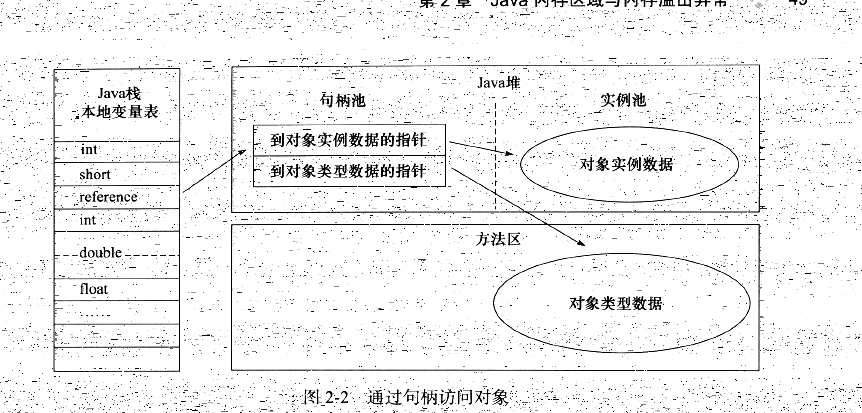


使用直接指针访问，那么 java 堆对象的布局中就必须考虑如何放置   访问类型数据的相关信息，而 reference 中存储的直接就是对象地址

```
相当于 直接指向了 堆中的对象类型的指针，而 Heap 的对象类型里面保存了
指向 method Area 的对象类型数据的指针
```


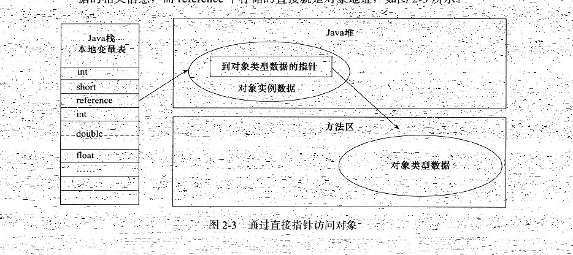


```
这两种对象访问方式各有优势，使用句柄来访问的最大好处就是 reference 中存储的是稳定的句柄地址，在对象被移动(垃圾收集时移动对象是非常普遍的行为)时只会改变句柄中的实例数据指针，而 reference 本身不需要修改。

使用直接指针访问方式的最大好处就是速度更快，她节省了一次指针定位的时间开销，由于对象的访问在 java 中非常频繁，因此这类开销积少成多后yes一项非常可观的执行成本。就 Sun HotSpot 而言，它使用第二种方式进行对象访问的，但从整个软件开发的范围来看，各种语言和框架使用句柄来访问的情况也十分常见。
```


## 3、实战：OutMemoryError 异常（OOM）

### 1、虚拟机栈和本地方法栈溢出

```
由于 HotSpot 虚拟机中并不区分虚拟机栈和本地方法栈，因此，对于 HotSpot 来说，虽然 -Xoss 参数(设置本地方法栈大小)存在，但实际上是无效的，栈容量只由 -Xss 参数设定。关于虚拟机栈和本地方法栈，在java虚拟机规范中描述了两种异常：

如果线程请求的栈深度大于虚拟机所允许的最大深度，讲抛出 StackOverflowError 异常
如果虚拟机在扩展栈时，无法申请到足够的内存空间，则抛出 OutOfMemoryError 异常

StackOverflowError  一般都是内存不足以支撑现在的栈

OutOfMemoryError 一般都多线程开的太多了
```

```
在单个线程下，无论是由于栈帧太大还是虚拟机栈容量太小，当内存无法分配的时候，虚拟机抛出的都是 StackOverflowError 异常。

如果测试时不限于单线程，通过不断的建立线程的方式倒是可以产生内存溢出异常，但是这样产生的内存溢出异常与栈空间是否足够大并不存在任何联系，或者准确地来说，在这种情况下，为每个线程的栈分配的内存越大，反而越容易产生内存溢出异常。

其实原因不难理解，操作系统分配给每个进程的内存是有限制的，臂如 32 位的 windows 限制为 2GB，虚拟机提供了参数来控制 java 堆和方法区的这两部分内存的最大值。剩余的内存为2GB(操作系统限制)减去 Xmx(最大堆容量，如果没有设置其实是可以动态扩展的)，再减去 MaxPermSize(最大方法区容量(java1.8已经没有永久代了，所以这个参数没有用了))，程序计数器消耗内存很小，可以忽略掉。如果虚拟机进程本身耗费的内存不计算在内，剩下的内存就由虚拟机栈和本地方法栈"瓜分了"。每个线程分配到的栈容量越大，可以建立的线程数量自然就越少，建立线程时就越容易把剩下的内存耗尽。

这一点读者需要在开发多线程的应用时特别注意，出现 StackOverflowError 异常时有错误堆栈可以阅读，相对来说，比较容易找到问题的所在。而且，如果使用虚拟机默认参数，栈深度在大多数情况下(因为每个方法压入栈的帧大小并不是一样的，所以只能说在大多数情况下)达到 1000~2000 完全没有问题，对于正常的方法调用(包括递归)，这个深度应该完全够用了。但是，如果是建立过多线程导致的内存溢出，在不能减少线程数或者更换 64 位虚拟机的情况下，就只能通过减少最大堆和减少栈容量来换取更多的线程。如果没有这方面的处理经验，这种通过"减少内存"的手段来解决内存溢出的方式会比较难以想到

```

### 2、方法区和运行时常量池溢出

```
由于运行时常量池是方法区的一部分，因此这两个区域的溢出测试就放在一起进行。前面提到 JDK1.7 开始逐步 "去永久代" 的事情。
```

```
String.intern() 是一个 Native 方法，它的作用是: 如果字符串常量池中已经包含一个等于此 String 对象的字符串，则返回代表池中这个字符串的 String 对象； 否则，将此 String 对象包含的字符串添加到常量池中，并且返回此 String 对象的引用。在JDK1.6 及之前的版本中，由于常量池分配在永久代内，我们可以通过 -XX:PermSize 和 -XX:MaxPermSize 限制方法区大小，从而间接限制其中常量池的容量。

intern() 会将 你的字符串(new 出来的，如果是 ""出来的，在编译期间就已经将其加入到常量池了)，在常量池中查找，如果查找到了，就将其常量池中的字符串的引用返回。如果找不到就将其加入到常量池中并将其加入到常量池中的String对象返回。

至于怎么加入
jdk1.6 是将 String 对象复制一份，加入到常量池中，然后将刚刚加入到其常量池的对象的引用返回，虽然复制了，但正是因为复制，所以不是同一个对象了。地址就不一样了

jdk1.7 是将 String 对象的引用加入到常量池中，然后将刚刚加入到其常量池的引用返回，因为只是引用所以就相等了，本质指向的还是同一个地址。
```

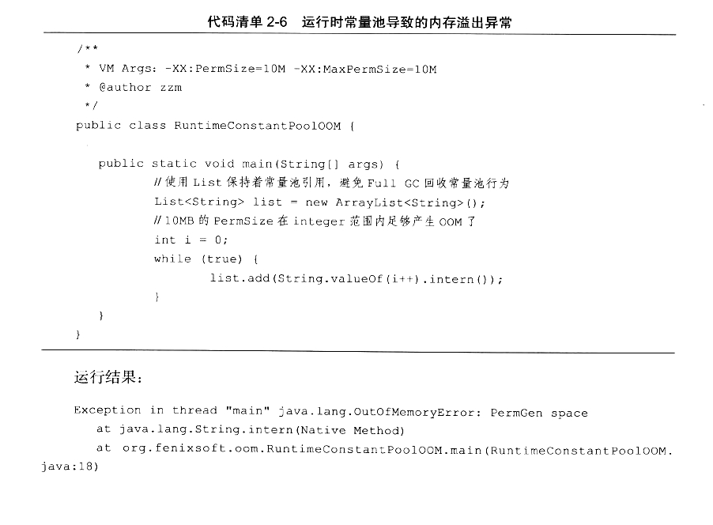

```
从运行结果中可以看到，运行时常量池溢出，在 OutOfMemoryError 后面跟随的提示信息是 "PermGen space", 说明运行时常量池属于方法区(HotSpot 虚拟机中的永久代)的一部分。

而使用 JDK1.7运行这段程序就不会得到相同的结果，while 循环将一直进行下去。关于这个字符串常量池的实现问题，还可以引申出一个更有意思的影响。
```

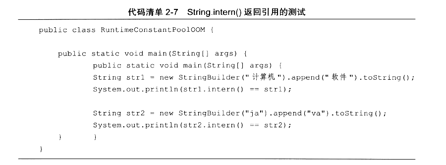

```
这段代码在 JDK1.6 中运行，会得到两个 false, 而在 JDK1.7 中运行，会得到一个 true 和一个 false . 产生差异的原因是：在 JDK 1.6 中， intern()方法会把首次遇到的字符串实例复制到永久代中， 返回的也是永久代中这个字符实例的引用，而由 StringBuilder 创建的字符串实例在 java 堆上，所以必然不是同一个引用，将返会 false. 而 JDK1.7 (以及部分其他虚拟机，例如：JRockit)的 intern()实现不会再复制实例，只是在常量池中记录首次出现的实例引用，因此intern() 返回的引用和由 StringBuilder 创建的那个字符串实例是同一个。
```

```
方法区用于存放 Class 的相关信息，如类名、访问修饰符、常量池、字段描述、方法描述等。对于这些区域的测试，基本的思路就是运行时产生大量的类去填充方法区，直到溢出。虽然直接使用 java se API 也可以动态产生类(如反射时的 GeneratedConstructorAccessor 和 动态代理等)，但在本次实验中操作起来比较麻烦。借助了 CGLIB 直接操作字节码运行时生成了大量动态类。
```


```
方法区溢出也是一种常见的内存溢出异常，一个类要被垃圾收集器回收掉，判定条件是比较苛刻的。在经常动态生成大量 Class 的应用中，需要特别注意类回收状况。这类场景除了上面提到的程序使用了 CGLIB  还有 JSP  OSGI 的应用等。
```

### 3、本机直接内存溢出

```
DirectMemory 容量可以通过 -XX: MaxDirectMemorySize 指定，如果不指定，则默认与 java 堆最大值(-Xmx指定)一样，代码清单下图 越过了 DirectByteBuffer 类，直接通过返会获取 Unsafe 实例进行内存分配(Unsafe 类的 getUnsafe()方法限制了只有引导类加载器才会返会实例，也就是设计者希望只有 rt.jar 中的类才能使用 Unsafe 的功能)。因为，虽然使用 DirectByteBuffer 分配内存也会抛出内存溢出异常，但它抛出异常时并没有真正向操作系统申请分配内存，而是通过计算得知内存无法分配，于是手动抛出异常，真正申请分配内存的方法是 unsafe.allocateMemory();
```

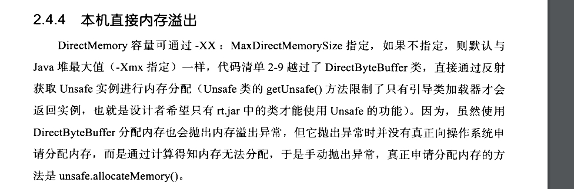


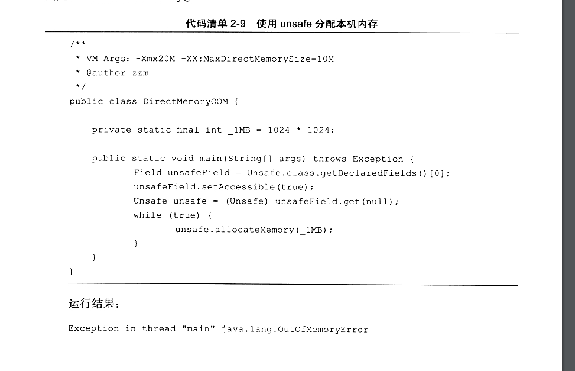


```
由 DirectMemory 导致的内存溢出，一个明显的特征是在 Heap Dump 文件中不会看见明显的异常，如果读者发现 OOM 之后 Dump 文件很小，而程序中又直接或间接使用了 NIO， 那就可以考虑一下是不是这方面的原因。
```


# 三、垃圾收集器与内存分配策略

```
java 与 C++ 之间有一堵由内存动态分配和垃圾收集技术所围成的"高墙"，墙外面的人想进去，墙里面的人却想出来。
```

## 1、对象已死吗

### 1、引用计数算法

```
很多教科书判断对象是否存货的算法是这样：给对象中添加一个引用计数器，每当有一个地方引用它时，计数器值就加 1； 当引用失效时，计数器值就减 1； 任何时刻计数器为 0 的对象就是不可能再被使用的。
```

```
客观的说，引用技术算法(Reference Counting) 的实现简单，判断效率也很高，在大部分情况下它都是一个不错的算法，但是它很难解决对象之间互相引用的问题。
```

```
举个简单的例子，对象 objA 和 objB 都有字段 instance，赋值令 objA.instance=objB.instance ，除此之外，这两个对象再无任何引用，实际上这两个对象已经不可能再被访问，但是它们因为互相引用着对方，导致它们的引用计数都不为0.于是引用计数算法无法通知 GC 收集器回收它们。
```

### 2、可达性分析算法

```
这个算法的基本思路就是通过一系列的被称为引用链(Reference Chain),当一个对象到 GC Roots 没有任何引用链相连(用图论的话来说，就是从GC Root到这个对象不可达)时，则证明此对象是不可用的。
```


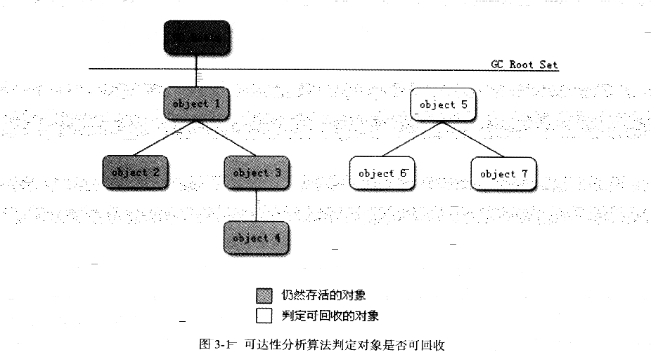

```
在 java 语言中，可作为 GC Roots 的对象包括下面几种：
虚拟机栈(栈帧中的本地变量表)中引用的对象
方法区中类静态属性引用的对象
方法区中常量引用的对象
本地方法栈中JNI(即一般说的 Native 方法)引用的对象
```

### 3、再谈引用

```
无论是通过引用计数算法判断对象的引用数量，还是通过可达性分析算法判断对象的引用链是否可达，判断对象是否 存活都与"引用"有关。在 JDK1.2以前，java中引用的定义很传统：如果 reference 类型的数据中存储的数值代表的是因为一块内存的起始地址，就称这块内存代表着一个引用。这种定义很纯粹，但是太过狭隘，一个对象在这种定义下只有被引用或者没有被引用两种状态，我们希望能描述这样一类对象：当内存空间还足够时，则能保留在内存之中；如果内存空间在进行垃圾收集后还是非常紧张，则可以抛弃这些对象。很多系统的缓存功能都符合这样的应用场景。

```

```
在 jdk1.2之后，java 对引用的概念进行了扩充，将引用分为 
强引用(Strong Reference)
软引用(Soft Reference)
弱引用(Weak Reference)
虚引用(Phantom Reference)
4种，这4种引用强度依次逐渐减弱。

强引用
	就是指在程序代码之中普遍存在的，类似"Object obj = new Object()" 这类的引用，只要强应用还存在，垃圾收集器永远不会回收掉被引用的对象。
	
软引用
	是用来描述一些还有用但并非必需的对象。对于软应用关联着的对象，在系统将要发生内存溢出异常之前，将会把这些对象列进回收范围之中进行第二次回收。如果这次回收还没有足够的内存才会抛出内存溢出异常。在JDK1.2之后，提供了 SoftReference 类来实现软引用
	
弱引用
	也是用来描述非必需对象的，但是它的强度比软引用更弱一些，被弱引用关联的对象只能生存到下一次垃圾收集发生之前。当垃圾收集器工作时，无论当前内存是否足够，都会回收掉只被弱引用关联的对象。在JDK1.2之后，提供了 WeakReference 类来实现弱引用
	
虚引用
	也成为幽灵引用或者幻影引用，它是最弱的一种引用关系。一个对象是否有虚引用的存在，完全不会对其生存时间构成影响，也无法通过虚引用来取得一个对象实例。为一个对象设置虚引用关联的唯一目的就是能在这个对象被收集器回收时收到一个系统通知。在JDK1.2 之后，提供了 PhantomReference 类来实现虚引用。
```


### 4、生存还是死亡

```
即使现在可达性分析算法中不可达的对象，也并非是"非死不可"的，这时候它们暂时处于"缓刑"阶段，要真正宣告一个对象死亡，至少要经历两次标记过程：如果对象在进行可达性分析后发现没有与 GC Root 相连接的引用链，那它将会被第一次标记并且进行一次筛选，筛选的条件是此对象是否有必要执行 finalize() 方法。当对象没有覆盖 finalize() 方法，或者 finalize()方法已经被虚拟机调用过，虚拟机将这两种情况都视为"没有必要执行"。
	
	如果这个对象被判定为有必要执行 finalize() 方法，那么这个对象将会放置在一个叫做 F-Queue 的队列之中，并在稍后由一个由虚拟机自动建立的、低优先级的 Finalizer 线程去执行它。这里所谓的"执行"是指虚拟机会触发这个方法，但并不承诺会等待它运行结束，这样做的原因是，如果一个对象在 finalize() 方法中执行缓慢，或者是发生了死循环(更极端的情况)，将很可能会导致 F-Queue 队列中其他对象永久处于等待，甚至导致整个内存回收系统崩溃。finalize() 方法是对象逃脱死亡命运的最后一次机会，稍后 GC 将对 F-Queue 中的对象进行第二次小规模标记，如果对象要在 finalize() 中成功拯救自己 ---  只要重新与引用链上的任何一个对象建立关联即可，臂如吧自己(this 关键字)赋值给某个类变量或者对象的成员变量，那在第二次标记时它被移除出"即将回收"的集合；如果对象这时候还没有逃脱，那基本上它就真的被回收了。从下图中我们可以看到一个对象的 finalize() 被执行，但是它仍然可以存活。
```

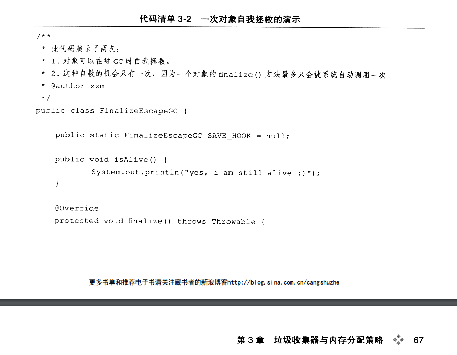

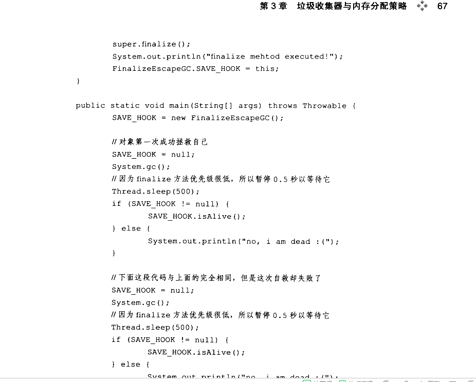

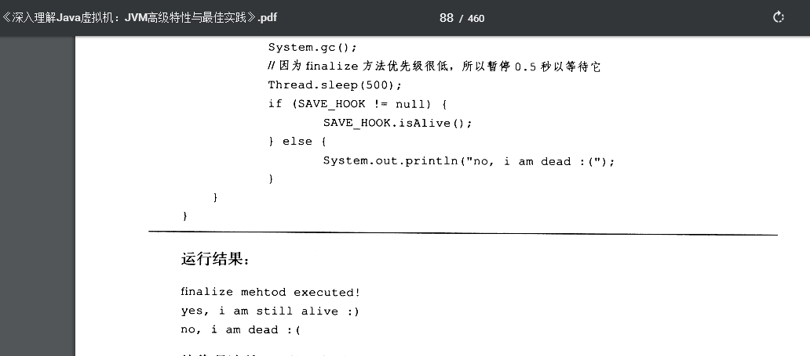


```
从代码清单 3-2 的运行结果可以看出， SAVE_HOOK 对象的 finalize() 方法确实被 GC 收集器触发过，并且在被收集前成功逃脱了。

另外一个值得注意的地方是，代码中有两段完全一样的代码片段，执行结果却是一次逃脱成功，一次失败，这是因为任何一个对象的 finalize() 方法都只会被系统自动调用一次，如果对象面临下一次回收，它的 finalize() 方法不会被再次执行，因此第二段代码的自救行动失败了。
```

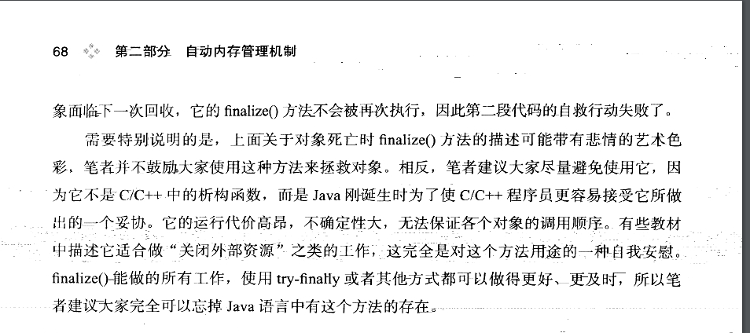

### 5、回收方法区

```
很多人认为方法区(或者HotSpot 虚拟机中的永久代)是没有垃圾收集的，java 虚拟机规范中确实说过可以不要求虚拟机在方法区是实现垃圾收集，而且在方法区中进行垃圾收集的"性价比"一般比较低: 在堆中，尤其是在新生代中，常规应用进行一次垃圾收集一般可以回收 70%-95% 的空间，而永久代的垃圾收集效率远低于此。

```

```
永久代的垃圾收集主要回收两部分内容： 废弃常量和无用的类。
回收废弃常量与回收 java 堆中的对象非常类似。以常量池中字面量的回收为例，假如一个字符串"abc" 已经进入了常量池中，但是当前系统没有任何一个 String 对象是叫做 "abc" 的，换句话说，就是没有任何 String 对象引用常量池中的 "abc" 常量，也没有其他地方引用了这个字面量，如果这时发生内存回收，而且必要的话，这个 "abc" 常量就会被系统清理出常量池。常量池中的其它类(接口)、方法、字段的符号引用也与此类似。

判断一个常量是否是 "废弃常量" 比较简单，而要判定一个类是否是"无用的类"的条件则相对苛刻许多。类需要同时满足下面 3个条件才能算是"无用的类"

该类所有的实例都已经被回收，也就是说 java 堆中不存在该类的任何实例
加载该类的 ClassLoader 已经被回收。
该类对象的额java.lang.Class 对象没有在任何地方被引用，无法在任何地方通过反射访问该类的方法。
```

## 2、垃圾收集算法

### 1、标记 - 清除算法

```
最基础的收集算法是 "标记 - 清除"(Mark - Sweep)算法，如同它的名字一样，算法分为"标记" 和 "清除" 两个阶段：
首先 标记出所有需要回收的对象，在标记完成后统一回收所有被标记的对象，它有两个不足的地方：
	一个是效率问题，标记和清除两个过程的效率都不高；
	另外一个是空间问题，标记清除之后会产生大量不连续的内存碎片，空间碎片太多可能会导致以后在程序运行过程中需要分配较大的对象时，无法找到足够连续而不得不提前触发另一次垃圾收集动作。
```

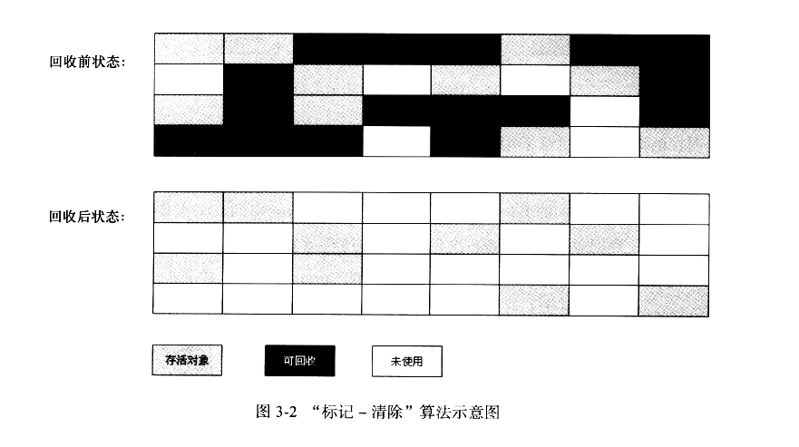

### 2、复制算法

```
为了解决效率问题，一种成为"复制"的收集算法出现了，它讲可用内存按容量划分为大小相等的两块，每次只使用其中的一块。当这一块的内存用完了，就将还存活着的对象复制到另外一块上面，然后再把已使用过的内存空间一次清理掉。这样使得每次都是对整个半区进行内存回收，内存分配时也就不用考虑内存碎片等复杂情况，只要移动堆顶指针，按顺序分配内存即可，实现简单，运行高效。只是这种算法的代价是将内存缩小为了原来的一半，未免太高了一点。
```

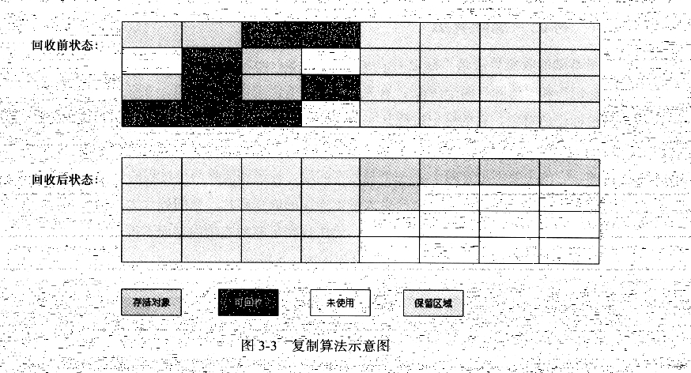


```
现在的商业虚拟机都采用这种收集算法来回收新生代，IBM 公司的专门研究表明，新生代中的对象 98% 是"朝生夕死的"，所以并不需要按照 1：1 的比例来划分内存空间，而是将内存分为一块较大的 Eden 空间和两快较小的 Survivor 空间，每次使用 Eden 和其中一块 Survior 空间上，最后清理掉 Eden 和刚才用过的 Survivor 空间。HotSpot 虚拟机默认 Eden 和 Survivor 的大小比例是 8:1 ，也就是每次新生代中可用内存空间为整个新生代容量的 90% (80%+10%)，只有 10% 的内存会被"浪费". 当然，98% 的对象可回收只是一般场景下的数据，我们没有办法保证每次回收都只有不多于 10% 的对象存活，当 Survivor 空间不够用时，需要依赖其他内存(这里指老年代)进行分配担保(Handle Promotion).

	如果另外一块 Survivor 空间没有足够空间存放上一次新生代收集下来的存活对象时，这些对象将直接通过分配担保机制进入老年代。
	
这里指的 Eden 和 Survivor 都是新生代的分区 
新生代有  一个 Eden 和 两个 Survivor  Eden(80%) 两个Survivor一共(20%)
每次使用 一个 Eden 和 一个 Survivor, 使用的是复制算法，将 Eden 和 Surivor
里面的存活的对象复制到另外一个 没有使用的 Survivor 里面，然后就依次这样弄，如果 Survivor 里面放不下了。就按照分配机制将其分配到老年代。

```


### 3、标记 - 整理算法

```
复制收集算法在对象存活率较高时就要进行较多的复制操作，效率将会变得很低。

因为老年代最极端的情况应该是 100% 的对象都存活。根据老年代的特点，有人提出了另外一种 "标记 - 整理算法"，标记过程仍然与 "标记 - 清除"算法一样，但后续步骤不是直接对可回收对象进行清理，而是让所有存活的对象都向一端移动，然后直接清理掉端边界以外的内存，

标记算法就是 可达性算法，不可达的就将其标记出来。
```

​	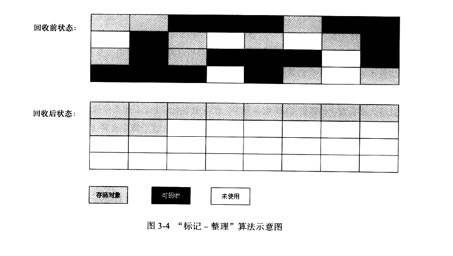

### 4、分代收集算法

```
当前商业虚拟机的垃圾收集都采用"分代收集"(Generational Conllection) 算法，这种算法并没有什么新的思想，只是根据对象存活周期的不同将内存划分为几块。一般是吧 java 堆分为 新生代和老年代，这样就可以根据各个年代的特点采用最适当的收集算法。在新生代中，每次垃圾收集时都发现有大批对象死去，只有少量存活，就使用复制算法，只需要付出少量存活对象的复制成本就可以完成收集。而老年代中因为对象存活率高、没有额外空间对它进行分配担保，就必须使用 "标记-清理" 或者 "标记 - 整理"算法来进行回收。
```


## 3、HotSpot 的算法实现

暂时略过...没有看


### 4、内存分配与回收策略

```
对象的内存分配，往大方向讲，就是在堆上分配(但也可能经过 JIT 编译后被拆散为标量类型并间接地栈上分配)，对象主要分配在新生代的 Eden 区上，如果启动了本地线程分配缓冲，将按线程优先在 TLAB 上分配。少数情况下也可能会直接分配在老年代中，分配的规则并不是百分之百固定的，其细节取决于当前使用的是哪一种垃圾收集器组合，还有虚拟机与内存相关的参数的设置。
```

  没看

# 