## 1、简介

### 2、并行编程的目标

```
相对于串行编程来说，并行吧编程有如下三个主要目标：
性能
生产率
通用性
```


#### 1、性能

```
大多数并行编程的目的主要是性能。
毕竟，如果不考虑性能，为什么不编写串行代码，这样不是更 happy 嘛？
```

```
注意：
	性能是一个总的概念，包含可扩展性(每 CPU 性能)及效率(如每瓦特性能)。
	
	也就是说，关注焦点已经从硬件转向并行软件。
	这是由于虽然摩尔定律仍然在晶体管密度有效，但是在提高单线程性能方面已经不再有效。
	这可从图 1.1 看出来
```


```
mips = Million Instructions Per Second
到了 2015 年 MIPS 几乎没有再增加了

每秒处理的百万级的机器语言指令数
注：这表明最新 CPUs 时钟频率的理论上的能力，它可以在一个时钟周期执行一个或者多个指令。

对以前的CPUs 来说，即使最简单的指令也需要多个时钟周期。
采取这个方案的原因是新 CPUs 执行多个指令的能力受到内存系统性能的限制。
```

```
这意味着编写单线程代码并简单的等待 CPUs 一两年时间并不再是一个可行的方法。

所有主流厂商最近的趋势是朝多核/多线程系统发展，并行是充分利用这些系统性能的好办法。
```

```
因此，首要目的是性能而不是可扩展性。
特别是提供一个简单的方法达到线性的扩展性能的目标，而不用扩展每  CPU 性能。
```

```
也就是说，你拥有多核 CPUs，这并不是必然要全部使用它们的原因，特别是最近以来，多核系统的价格已经下降很多。

理解这一点的关键是：并行编程主要是性能优化，因为它是众多优化措施中的一种。

如果您当前的程序已经足够快了，没有必要再优化，也不必将它并行化。
```


#### 2、生产率

```
数十年来，生产率已经变得更加重要。
要明白这点，考虑价值数百万美元的早期计算机时代，一个工程师的年薪只有几千美元。
为这样一台机器奉献十个工程师的项目组，将它的性能提高 10%，这相当于他们薪水的很多倍。
```


```
1.2该图 标示出过去三十年内计算能力增长的近似值。
请注意，由于多核 CPUs 的出现，使得这种增长趋势没有减弱，即使在 2003 年开始遇到了 CPU 频率方面的瓶颈。
```

```
硬件加个不断下降的后果之一，就是软件生产率越来越重要。
仅仅搞笑的使用硬件已经不再足够，搞笑的利用开发者已经变得同样重要。
串行硬件时代已经很久了，仅仅在最近一段时期，并行硬件才变成低成本商品。
因此，高生产率的创建并行软件仅仅在最近才变得非常重要。
```


#### 3、通用性

```
为开发并行程序的高费用进行辩护的方式之一是争取更大的通用性。
一个更通用的软件能够比一个不怎么通用的软件更能分散费用。
```

```
不幸的是，通用性会带来更大的性能损失和生产率损失。
要明白这点，考虑下面这些流行的并发编程环境。

C/C++:
	"锁及线程"：这包含 POSIX 线程(pthreads)，Windows 线程，以及很多操作环境内核环境。
	他们提供了优秀的性能(至少在 SMP 系统上是如此)，也提供了良好的通用性。可惜的是生产率较低。
	
Java:这个编程环境与生俱来就有多线程能力，广泛的认为它比 C/C++ 更有生产率。
他能够自动进行垃圾收集，并且拥有大量的类型库。
但是，虽然它的性能在过去十年间有了长足的进步，但是通常被认为低于 C/C++。
```


```
要从并行编程环境中解脱出来，并且提供优秀的性能、生产率、通用性，这样的环境仍然不存在。

在这样的环境产生以前，需要在性能、生产率、通用性之间进行权衡。
其中一种权衡如图 1.3 所示：
```


```
application 应用
middleware 中间件
System Libraries 系统库
Operating System Kernel 操作系统内核
Hardware 硬件

performance 性能
generality 通用性
productivity 生产力
```

```
它说明一个事实：
越往上层，生产率是如何变得越来越重要的。
然而越往下层，性能和通用性就变得越来越重要。
一方面，大量的开发工作消耗在上层，并且必须考虑通用性以降低成本。
下层的性能损失很不容易在上层得到恢复。
在靠近堆栈的顶端，也许只有少数的用户工作于特定的应用。
这种情况下，生产率是最重要的。
这解释了这样一种趋势：
	越往上层，采用额外的硬件通常比额外的开发者更划算。
```

```
我们要时刻牢记，并行计算的性能、生产率和通用性之间经常互相冲突，现在，是时候进行深入分析来避免这些并行计算冲突的解决方案了。
```


### 3、并行编程的替代方案

```
在考虑并行计算的代替方案前，必须先想想自己希望并行计算能为你做什么。
并行计算的目标是 性能、生产率，通用性

尽管从历史说，大多数开发者最关心第一个目标，其他目标的好处是可以减轻您为使用并行计算进行辩护的必要。
这节剩下部分只关注性能方面的提升。
并行计算只是提高性能的方案之一。
其他熟知的方案按实现难度递增的顺序罗列如下：
-运行多个顺序应用实例。
-利用现有的并行软件构建应用
-对串行应用进行逻辑优化
```


#### 3、性能优化


```
还有一点:不同的程序会有不同的性能瓶颈。
并行计算智能淡化某些瓶颈。
比如，假设你的程序花费最多的时间在等待磁盘驱动的数据。
在这种情况下，让你的程序在多CPU下运行并不大可能会改善性能。

实际上，如果有进程正在读取一个旋转的磁盘上的大型顺序文件，并行设计程序也许会使它变得更慢。
相反，你应该添加更多的磁盘、优化数据已使这个文件能变得更小(因此读的更快)，或者，如果可能的话，避免读取如此多的数据。
```

### 4、是什么使并行编程变得复杂

```
需要注意的是：并行计算的困难，有人为因素的原因与并行计算本身的技术属性的原因，二者给并行计算带来的困难是差不多的。
这是由于我们需要人为干涉并行计算的过程，人和计算机间的双向交互需要人和机器都执行同等复杂的操作。
因此，采用抽象或者数学分析将极大的限制实用性。
```


```
work partitioning 工作分割
resource partitioning and replication 资源分割和复制
parallel access control 并行访问控制
interacting with hardware 与硬件交互
```

#### 1、工作分割

```
工作分割绝对是并行计算需要的：如果存在一个小型的工作，那么它同时只能被一个 CPU 执行，这是由顺序执行所定义的。
但是，分割代码需要十分小心，比如，不均匀的分割一旦分割结束后，会导致顺序执行的结果。
在不是很极端的情况下，负载均衡能被用来完全利用硬件，因此获取更优化的性能。
```

```
另外，工作分割可能导致全局错误和事件处理变得复杂：一个并行程序可能需要实施一些同步措施以便安全的处理这些全局事件。
```


```
最后，合法的并行线程会大量增加程序的状态空间，导致程序难以理解，降低生产率。
在其他条件相同的情况下，更小的状态空间有更通用的结构，更容易被理解。
好的并行设计可能拥有大量及其巨大的状态空间，不过却由于他们采用了通用的结构，而便于理解，可是糟糕的设计可能会难以理解，就算他们采用相对小的状态空间。

最好的设计采用尴尬的并行主义，或者将问题转交给尴尬并行解决方案。
在以上情况中，尴尬并行实际上是财富的尴尬。
当前的状态催生优秀的设计，更多的工作需要被引入以在状态空间大小和结构上作出更好的判断。
```

#### 2、并行访问控制

```
给定一个单线程的顺序进程，单线程对所有进程的资源都有访问权。
这些资源主要是内存数据结构，但也可能是 CPU,内存(包括cache)，I/O设备，计算机加速器，文件，以及更多其他的。
```

```
第一个并行访问控制问题是访问特定的资源是否受限于资源的位置。

其他的并行访问控制问题是线程如何协调访问资源。
这种协调是由非常多的同步机制通过提供不同的并行语言和环境来实施的，包括消息传递，加锁，事务，引用计数，显式计时，共享原子变量，以及数据所有权。
```

#### 3、资源分割和复制

```
最有效的并行算法和系统，专注于资源并行算法，所以比较明智的做法是通过分割写资源操作和读资源操作来开始并行化。
问题是这些频繁访问的数据，可能会在计算机系统间，大存储设备间，NUMA 节点间，CPU之间(或者核与硬件线程)，页面，cache缓存线，同步原语的实例，或者代码临界之间造成问题。
```


#### 4、与硬件交互

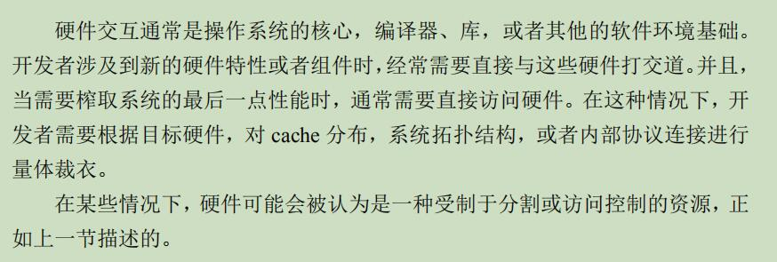


#### 5、组合使用

```
尽管这四种功能是基础性的(可单独存在)，但好的工程实践会组合使用这些功能。

比如，数据并行方案首先把数据分割以便于减少组件内的交互需求，然后分割相应的代码，最后对数据分区和线程进行映射以便提升吞吐和减少线程内交互，如图1.6所示。
开发者于是对每个分区单独进行考虑，显著减少了相关状态空间的大小，进而增加生产率。
当然，有些问题是不可分割的，但是从另外一个角度来说，巧妙的变换成可分区的架构，可以大大提高性能和扩展性。
```

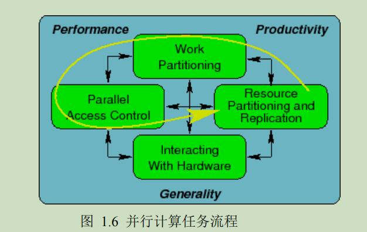


## 2、硬件的习惯

### 1、概述

```
如果只是粗略的扫过计算机系统规范手册，很容易让人觉得 CPU 的性能就像在一条清晰跑道上的赛跑，如下图所示，总是最快的人赢得比赛。
```

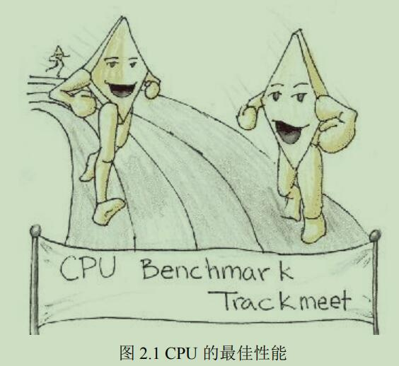

```
虽然有一些只限于 CPU 的基准测试能够让 CPU 达到上图中显示的理想情况，但是典型的程序不像跑道，更像一条带有障碍的道路。
托摩尔定律的福，最近几十年间CPU的内部架构发生了急剧的变化。
```


#### 1、CPU 流水线

```
在上世纪80年代初，典型的微处理器在处理下一条指令之前，至少需要取指，解码和执行3个时钟周期来完成本条指令。
与之形成鲜然对比的是，上世纪90年代末期和本世纪初的 CPU 可以同时处理多条指令，通过一条很长的"流水线"来控制CPU内部的指令流。
```

```
带有长流水线的 CPU 想要达到最佳性能，需要程序给出高度可预测的控制流。
代码主要在紧凑循环中执行的程序，可以 提供恰当的控制流，比如大型矩阵或者向量中做算术计算的程序。
此时CPU可以正确预测在大多数情况下，代码循环结束后的分支走向。
在这种程序中，流水线可以一直保持在满状态，CPU高速运行。
```

```
另一方面，如果程序中带有许多循环，且循环计数都比较小；
或者面向对象的程序中带有许多虚对象，每个虚对象都可以引用不同的实对象，而这些实对象都有频繁被调用的成员函数的不同实现，此时CPU很难或者完全不可能预测某个分支的走向。

这样CPU要么等待控制流进行到足以知道分支走向的方向时，要么干脆猜测-由于此时程序的控制流不可预测--CPU常常猜错。
在这两种情况中，流水线都是空的，CPU需要等待流水线被新指令填充，这将大幅降低CPU的性能，就像图中的画一样。
```

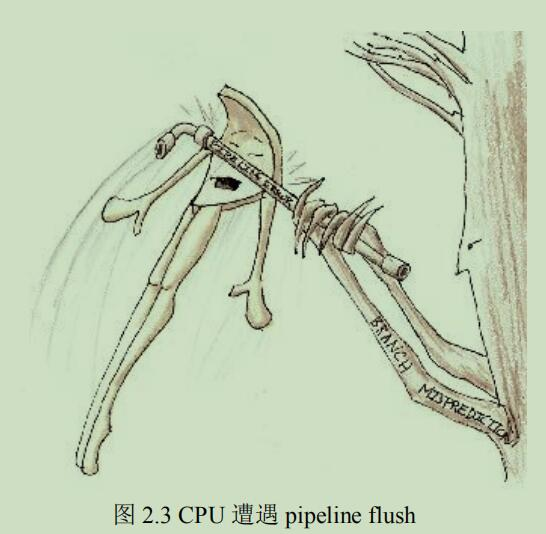

```
不幸的是，流水线冲刷并不是唯一影响现代CPU运行性能的障碍。
下一节将讲述内存引用带来的危害。
```

#### 2、内存引用

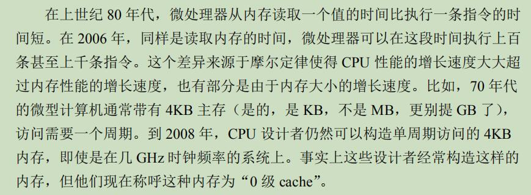

```
虽然现代微型计算机上的大型缓存极大的减少了内存访问延迟，但是只有高度可预测的数据访问模式才能让缓存发挥最大效用。
不幸的是，一般像遍历链表这样的操作的内存访问模式非常难以预测 ———— 毕竟如果这些模式是可预测的，我们也就不会被指针所困扰了，是吧？
```

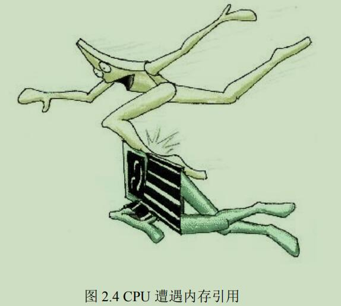

```
因此，正如图中显示的，内存引用常常是影响现代CPU性能的重要因素。
```

```
到现在为止，我们只考虑了CPU在单线程代码中执行会遭遇的性能障碍。
多线程会为CPU带来额外的性能障碍。
我们将在下面的章节中接着讲述。
```

#### 3、原子操作

```
其中一种障碍是原子操作。
原子操作的概念在某种意义上与CPU流水线上的一次执行一条的汇编操作冲突了。
拜硬件设计者的精密设计所赐，现代CPU使用了很多非常聪明的手段让这些操作看起来是原子的，即使这些指令实际上不是原子的。
不过即使如此，也还是有一些指令是流水线必须延迟甚至需要冲刷，以便一条原子操作成功完成。
```

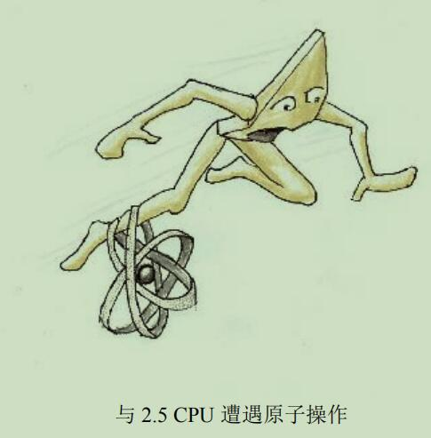

```
原子指令对性能的影响见上图。

不幸的是原子操作通常只用于数据的单个元素。
由于许多并行算法都需要在更新多个数据元素时，保证正确的执行顺序，大多数CPU都提供了内存屏障。
内存屏障也是影响性能的因素之一。
```

#### 4、内存屏障

```
锁操作原语必须包含或显式或隐式的内存屏障。
内存屏障的作用是防止 CPU 为了 提升性能而进行的乱序执行，所以内存屏障几乎一定会降低CPU性能。
```

#### 5、Cache Miss

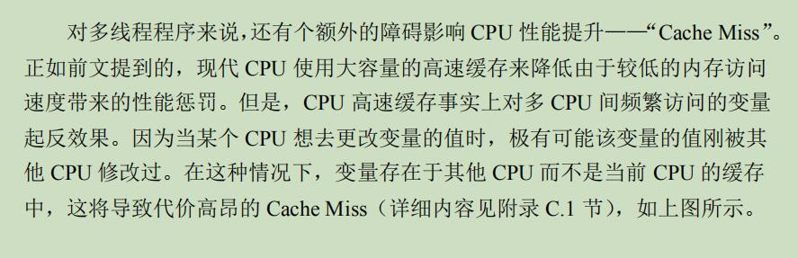

#### 6、I/O操作

```
缓存未命中可以视为 CPU 之间的 I/O 操作，这应该是代价最低廉的 I/O 操作之一。
I/O 操作涉及网络、大容量存储器，或者(更糟的)人类本身，I/O操作对性能的影响远远大于之前几个章节提到的各种障碍。
```


### 2、开销

```
本节将概述前一节列出的性能障碍的实际开销。
```

#### 1、硬件体系结构

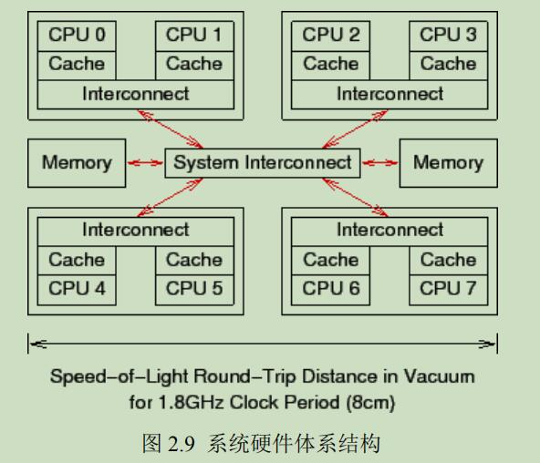

```
上图是一个粗略的八核计算机系统概要图。
每个管芯有两个 CPU 核，每个核带有自己的高速缓存，管芯内还带有一个互联模块，使管芯内的两个核可以互相通信。
在图中央的系统互联模块可以让四个管芯互相通信，并且将管芯与主存连接起来。
```

```
数据以"缓存线(就是上下层缓存交换的块)"为单位在系统中传输，"缓存线"对应于内存中一个2的幂大小的字节块，大小通常为32到256字节之间。
当CPU 从内存中读取一个变量到它的寄存器中时，必须首先将包含了该变量的缓存线读取到 CPU 高速缓存。
同样的，CPU 将寄存器中的一个值存储到内存时，不仅必须将包含了该值的缓存线读到 CPU 高速缓存，还必须确保没有其他 CPU 拥有该缓存线的拷贝。
```

```
比如，如果 CPU0 在对一个变量执行"比较并交换"(CAS)操作，而该变量所在的缓存线在 CPU7 的高速缓存中，就会发生以下简化的事件序列：

1、CPU0 检查本地高速缓存，没有找到缓存线
2、请求被转发到CPU0和 CPU1的互联模块，检查CPU1的本地高速缓存，没有找到缓存线。
3、请求被转发到系统互联模块，检查其他三个管芯，得知缓存线被CPU6和CPU7所在的管芯持有。
4、请求被转发到CPU6和CPU7的互联模块，检查这两个CPU的高速缓存，在CPU7的高速缓存中找到缓存线。
5、CPU7将缓存线发送给所属的互联模块，并且刷新自己高速缓存中的缓存线。
6、CPU6和CPU7的互联模块将缓存线发送给系统互联模块。
7、系统互联模块将缓存线发送给CPU0和CPU1的互联模块。
8、CPU0和CPU1的互联模块将缓存线发送给CPU0的高速缓存。
9、CPU0现在可以对高速缓存中的变量执行CAS操作了。
```


#### 2、操作的开销

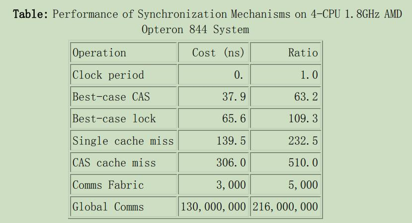

```
一些在并行程序中很重要的常见操作开销如上图所示。
该系统的时钟周期为 0.6ns。
虽然在现代微处理器上每时钟周期 retire(淘汰) 多条指令并不常见，但是在表格的第三列，操作被标准化到了整个时钟周期，称作"比率"。
关于上表需要注意的是比率的值都很大。
```

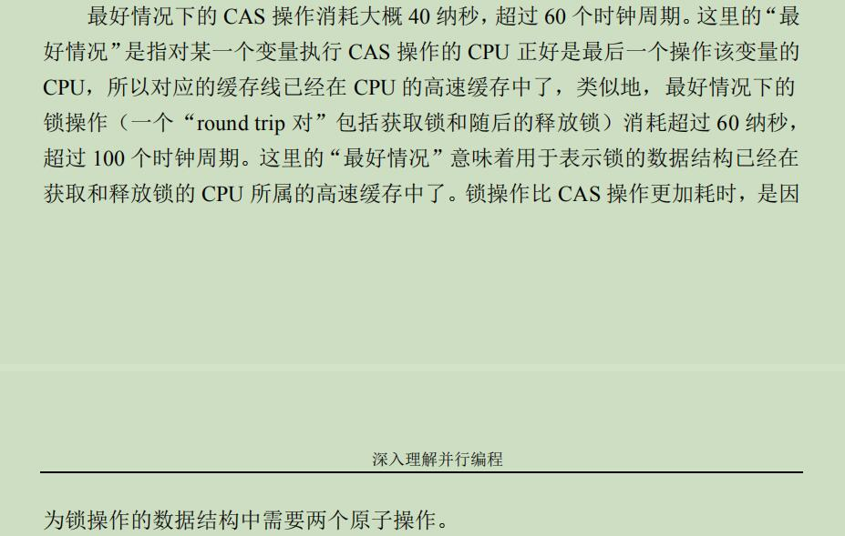


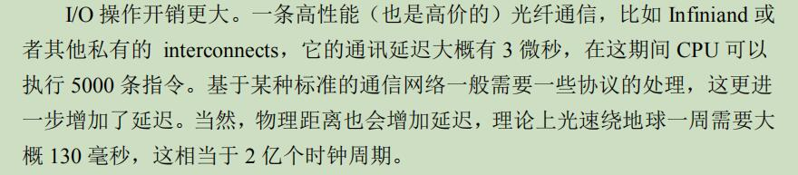


