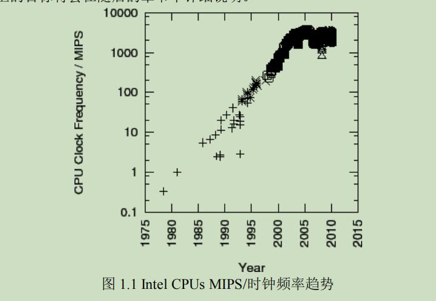

## 1、简介

### 2、并行编程的目标

```
相对于串行编程来说，并行吧编程有如下三个主要目标：
性能
生产率
通用性
```


#### 1、性能

```
大多数并行编程的目的主要是性能。
毕竟，如果不考虑性能，为什么不编写串行代码，这样不是更 happy 嘛？
```

```
注意：
	性能是一个总的概念，包含可扩展性(每 CPU 性能)及效率(如每瓦特性能)。
	
	也就是说，关注焦点已经从硬件转向并行软件。
	这是由于虽然摩尔定律仍然在晶体管密度有效，但是在提高单线程性能方面已经不再有效。
	这可从图 1.1 看出来
```



```
mips = Million Instructions Per Second
到了 2015 年 MIPS 几乎没有再增加了

每秒处理的百万级的机器语言指令数
注：这表明最新 CPUs 时钟频率的理论上的能力，它可以在一个时钟周期执行一个或者多个指令。

对以前的CPUs 来说，即使最简单的指令也需要多个时钟周期。
采取这个方案的原因是新 CPUs 执行多个指令的能力受到内存系统性能的限制。
```

```
这意味着编写单线程代码并简单的等待 CPUs 一两年时间并不再是一个可行的方法。

所有主流厂商最近的趋势是朝多核/多线程系统发展，并行是充分利用这些系统性能的好办法。
```

```
因此，首要目的是性能而不是可扩展性。
特别是提供一个简单的方法达到线性的扩展性能的目标，而不用扩展每  CPU 性能。
```

```
也就是说，你拥有多核 CPUs，这并不是必然要全部使用它们的原因，特别是最近以来，多核系统的价格已经下降很多。

理解这一点的关键是：并行编程主要是性能优化，因为它是众多优化措施中的一种。

如果您当前的程序已经足够快了，没有必要再优化，也不必将它并行化。
```


#### 2、生产率

```
数十年来，生产率已经变得更加重要。
要明白这点，考虑价值数百万美元的早期计算机时代，一个工程师的年薪只有几千美元。
为这样一台机器奉献十个工程师的项目组，将它的性能提高 10%，这相当于他们薪水的很多倍。
```


```
1.2该图 标示出过去三十年内计算能力增长的近似值。
请注意，由于多核 CPUs 的出现，使得这种增长趋势没有减弱，即使在 2003 年开始遇到了 CPU 频率方面的瓶颈。
```

```
硬件加个不断下降的后果之一，就是软件生产率越来越重要。
仅仅搞笑的使用硬件已经不再足够，搞笑的利用开发者已经变得同样重要。
串行硬件时代已经很久了，仅仅在最近一段时期，并行硬件才变成低成本商品。
因此，高生产率的创建并行软件仅仅在最近才变得非常重要。
```


#### 3、通用性

```
为开发并行程序的高费用进行辩护的方式之一是争取更大的通用性。
一个更通用的软件能够比一个不怎么通用的软件更能分散费用。
```

```
不幸的是，通用性会带来更大的性能损失和生产率损失。
要明白这点，考虑下面这些流行的并发编程环境。

C/C++:
	"锁及线程"：这包含 POSIX 线程(pthreads)，Windows 线程，以及很多操作环境内核环境。
	他们提供了优秀的性能(至少在 SMP 系统上是如此)，也提供了良好的通用性。可惜的是生产率较低。
	
Java:这个编程环境与生俱来就有多线程能力，广泛的认为它比 C/C++ 更有生产率。
他能够自动进行垃圾收集，并且拥有大量的类型库。
但是，虽然它的性能在过去十年间有了长足的进步，但是通常被认为低于 C/C++。
```


```
要从并行编程环境中解脱出来，并且提供优秀的性能、生产率、通用性，这样的环境仍然不存在。

在这样的环境产生以前，需要在性能、生产率、通用性之间进行权衡。
其中一种权衡如图 1.3 所示：
```


```
application 应用
middleware 中间件
System Libraries 系统库
Operating System Kernel 操作系统内核
Hardware 硬件

performance 性能
generality 通用性
productivity 生产力
```

```
它说明一个事实：
越往上层，生产率是如何变得越来越重要的。
然而越往下层，性能和通用性就变得越来越重要。
一方面，大量的开发工作消耗在上层，并且必须考虑通用性以降低成本。
下层的性能损失很不容易在上层得到恢复。
在靠近堆栈的顶端，也许只有少数的用户工作于特定的应用。
这种情况下，生产率是最重要的。
这解释了这样一种趋势：
	越往上层，采用额外的硬件通常比额外的开发者更划算。
```

```
我们要时刻牢记，并行计算的性能、生产率和通用性之间经常互相冲突，现在，是时候进行深入分析来避免这些并行计算冲突的解决方案了。
```


### 3、并行编程的替代方案

```
在考虑并行计算的代替方案前，必须先想想自己希望并行计算能为你做什么。
并行计算的目标是 性能、生产率，通用性

尽管从历史说，大多数开发者最关心第一个目标，其他目标的好处是可以减轻您为使用并行计算进行辩护的必要。
这节剩下部分只关注性能方面的提升。
并行计算只是提高性能的方案之一。
其他熟知的方案按实现难度递增的顺序罗列如下：
-运行多个顺序应用实例。
-利用现有的并行软件构建应用
-对串行应用进行逻辑优化
```


#### 3、性能优化


```
还有一点:不同的程序会有不同的性能瓶颈。
并行计算智能淡化某些瓶颈。
比如，假设你的程序花费最多的时间在等待磁盘驱动的数据。
在这种情况下，让你的程序在多CPU下运行并不大可能会改善性能。

实际上，如果有进程正在读取一个旋转的磁盘上的大型顺序文件，并行设计程序也许会使它变得更慢。
相反，你应该添加更多的磁盘、优化数据已使这个文件能变得更小(因此读的更快)，或者，如果可能的话，避免读取如此多的数据。
```

### 4、是什么使并行编程变得复杂

```
需要注意的是：并行计算的困难，有人为因素的原因与并行计算本身的技术属性的原因，二者给并行计算带来的困难是差不多的。
这是由于我们需要人为干涉并行计算的过程，人和计算机间的双向交互需要人和机器都执行同等复杂的操作。
因此，采用抽象或者数学分析将极大的限制实用性。
```


```
work partitioning 工作分割
resource partitioning and replication 资源分割和复制
parallel access control 并行访问控制
interacting with hardware 与硬件交互
```

#### 1、工作分割

```
工作分割绝对是并行计算需要的：如果存在一个小型的工作，那么它同时只能被一个 CPU 执行，这是由顺序执行所定义的。
但是，分割代码需要十分小心，比如，不均匀的分割一旦分割结束后，会导致顺序执行的结果。
在不是很极端的情况下，负载均衡能被用来完全利用硬件，因此获取更优化的性能。
```

```
另外，工作分割可能导致全局错误和事件处理变得复杂：一个并行程序可能需要实施一些同步措施以便安全的处理这些全局事件。
```


```
最后，合法的并行线程会大量增加程序的状态空间，导致程序难以理解，降低生产率。
在其他条件相同的情况下，更小的状态空间有更通用的结构，更容易被理解。
好的并行设计可能拥有大量及其巨大的状态空间，不过却由于他们采用了通用的结构，而便于理解，可是糟糕的设计可能会难以理解，就算他们采用相对小的状态空间。

最好的设计采用尴尬的并行主义，或者将问题转交给尴尬并行解决方案。
在以上情况中，尴尬并行实际上是财富的尴尬。
当前的状态催生优秀的设计，更多的工作需要被引入以在状态空间大小和结构上作出更好的判断。
```

#### 2、并行访问控制

```
给定一个单线程的顺序进程，单线程对所有进程的资源都有访问权。
这些资源主要是内存数据结构，但也可能是 CPU,内存(包括cache)，I/O设备，计算机加速器，文件，以及更多其他的。
```


