**程序的机器级表示**

## 1、历史观点

```
计算机执行机器代码，用字节序列编码低级的操作，包括处理数据、管理内存、读写存储设备上的数据，以及利用网络通信。编译器基于编程语言的规则、目标机器的指令集合操作系统遵循的惯例，经过一系列的阶段生成机器代码。 GCC C语言编译器以汇编代码的形式产生输出，汇编代码生成可执行的机器代码。在本章中，我们会近距离地观察机器代码，以及人类可读的表示-汇编代码。

当我们用高级语言编程的时候(例如：C语言，java)，机器屏蔽了程序的细节，即机器级的实现。与此相反，当用汇编代码编程的时候(就像早期的计算)，程序员必须使用指定的程序用来执行计算的低级指令。高级语言提供的抽象级别比较高，大多数时候，在这种抽象级别上工作效率会更高，也更可靠。编译器提供的类型检查能帮助我们发现许多程序错误，并能够保证按照一致的方式来引用和处理数据。通常情况下，使用现代的优化编译器产生的代码至少与一个熟练的汇编语言程序员手工编写的代码一样有效。最大的优点是，用高级语言编写的程序可以在很多不同的机器上编译和执行，而汇编代码则是与特定机器密切相关的。

```

## 2、程序编码

```
计算机系统使用了多种不同形式的抽象，利用更简单的抽象模型来隐藏实现的细节。对于机器级编码来说，其中两种抽象尤为重要。
第一种是由 指令集体系结构或指令集架构· Instruction Set Architecture 来定义机器级程序和格式和行为，它定义了处理器状态、指令的格式，以及每条指令对状态的影响。大多数ISA,包括x86-64,将程序的行为描述成好像每条指令都是按顺序执行的，一条指令结束后，下一条再开始。处理器的硬件远比描述的精细复杂，他们并发的执行许多指令，但是可以采取措施保证整体行为与ISA指定的顺序执行的行为完全一致。

第二个抽象是，机器级程序使用的内存地址时虚拟地址，提供的内存模型看上去是一个非常大的字节数组。存储器系统的实现实现是将多个硬件存储器和操作系统组合起来。
```

```
在整个编译过程中，编译器会完成大部分的工作，将把用C语言提供的相对比较抽象的执行模型表示的程序转化成处理器执行的非常基本的指令。汇编代码表示非常接近于机器代码。于机器代码的二进制格式项目，汇编代码的主要特点是它用可读性更好的文本格式表示。
```

```
程序计数器(通常称为"pc"，在x86-64中用 %rip 表示)，给出将要执行的下一条指令在内存中的地址。

整数寄存器文件包括16个命名的位置，分别存储64位的值。这些寄存器可以存储地址(对应于C语言的指针)或整数数据。有的寄存器被用来记录某些重要的程序状态，而其他的寄存器用来保存临时数据，例如过程的参数和局部变量，以及函数的返回值。

条件码寄存器保存着最近执行的算术或逻辑指令的状态信息。它们用来实现控制或数据流中的条件变化，比如说用来实现if和 while 语句。

一组向量寄存器可以存放一个或者多个整数或浮点数值。
```

```
虽然C语言提供了一种模型，可以再内存中声明和分配各种数据类型的对象，但是机器代码只是简单地将内存看成一个很大的、按字节寻址的数组。C语言中的聚合数据类型，例如数组和结构，在机器代码中用一组连续的字节来表示。即使是对标量数据类型，汇编也不区分有符号和无符号整数，不区分各种类型的指针，甚至于不区分指针和整数。
```

```
程序内存包含：程序的可执行机器代码，操作系统需要的一些信息，用来管理过程调用和返回的运行时栈，以及用户分配的内存块(比如用 malloc 库函数分配的)。正如前面提到的，程序内存用虚拟地址来寻址。在任意给定的时刻，只有有限的一部分虚拟地址被认为是合法的。例如：x86-64的虚拟地址是由64位的字来表示的。在目前的实现中，这些地址的高16位必须设置为0，所以一个地址实际上能够指定的是 2^48 或 64TB 范围内的一个字节。操作系统负责管理虚拟地址空间，将虚拟地址翻译成实际处理器内存中的物理地址。
```

## 3、数据格式

```
由于是从16位体系结构扩展成32位,Intel用术语"字(word)"表示16位数据类型。因此，称32位数为"双字(double words 或 long words)"，称64位数为"四字(quad words)". 标准 int 值存储为双字(32位)。指针(在此用 char * 表示)存储为8字节的四字，64位机器本就预期如此。
```

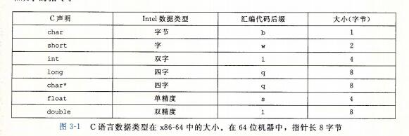


```
浮点数主要有两种形式:单精度(4字节)值，对应于C语言数据类型float;双精度(8字节)值，对应于C语言数据类型double.x86家族的微处理器历史上实现过对一种特殊的80位(10字节)浮点格式进行全套的浮点运算。

大多数GCC生成的汇编代码指令都有一个字符的后缀，表明操作数的大小。例如：数据传送指令有四个变种：movb传送字节  movw传送字 movl传送双字 movq传送四字。

汇编代码 也用浮点数 l 来表示 double .这不会产生歧义，因为浮点数使用的是一组完全不同的指令和寄存器。
```


## 4、访问信息

```
一个x86-64的中央处理单元(CPU)包含一组16个存储64位值得通用目的寄存器。这些寄存器用来存储整数数据和指针。图3-2显示了这16个寄存器。他们的名字都以%r开头，不过后面还跟着一些不同命名规则的名字，这是由于指令集历史演化造成的。
```

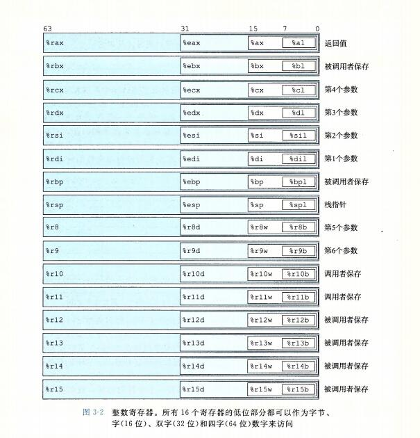

```
指令可以对这16分寄存器的地位字节中存放的不同大小的数据进行操作。字节级操作可以访问最低的字节，16位操作可以访问最低的2个字节，32位操作可以访问最低的4个字节，而64位操作可以访问整个寄存器。

在后面的章节中，我们会展现很多指令，复制和生成1字节、2字节、4字节和8字节值。当这些指令以寄存器作为目标时，对于生成小于8字节结果的指令，寄存器中剩下的字节会怎么样，对此有两条规则：生成1字节和2字节数字的指令会保持剩下的字节不变；生成4字节数字的指令会把高位4个字节置为0.后面这条规则是作为从IA32到x86-64的扩展的一部分而采用的。

其中最特别的是栈指针 %rsp ，用来指明运行时栈的结束位置。有些程序会明确的读写这个寄存器。另外15个寄存器的用法更灵活。少量指令会使用某些特定的寄存器。更重要的是，有一组标准的编程规范控制着如何使用寄存器来管理栈、传递函数参数、从函数的返回值，以及存储局部和临时数据。
```

### 1、操作数指示符

```
大多数指令有一个或多个操作指令数(operated),指示出执行一个操作中要使用的源数据值，以及放置结果的目的的位置。x86-64支持多种操作数格式。源数据值可以以常数形式给出，或是从寄存器或内存中读出。结果可以存放在寄存器或内存中。因此，各种不同的操作数的可能性被分为三种类型。
第一种类型是立即数(immediate),用来表示常数数值。在ATT格式的汇编代码中，立即数的书写方式是“$”后面跟一个用标准C表示法表示的整数，比如：$-577或$0x1F。

第二种类型是寄存器register 它表示某个寄存器的内容，16个寄存器的低位1字节、2字节、4、8字节中的一个作为操作数， 我们用符号 r(a) 来表示任意寄存器a, 用引用 R[r(a)] 来表示它的值，这是将寄存器集合看成一个数组 R，用寄存器标识符作为索引。

第三类操作数是内存引用，它会根据计算出来的地址(通常称为有效地址)访问某个内存位置。因为将内存看成一个很大的字节数组，我们用符号M(b)[Addr] 表示对存储在内存中从地址 Addr 开始的 b 个字节值 的引用。
```

### 寻址

```
表中底部用语法 Imm(r1,r2,s)表示的是最常见的形式。这样的引用有四个组成部分：一个立即数偏移Imm,一个基址寄存器r1,一个变址寄存器r2和一个比例因子s,这里s必须是1、2、4或者8.基址和变址寄存器都必须是64位寄存器。有效地址被计算为 Imm+R[r1]+R[ri]*s 。引用数组元素时，会用到这种通用形式。当引用数组和结构元素时，比较复杂的寻址模式是很有用的。
```

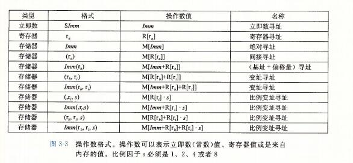


### 2、数据传送指令

```
mov 指令的
源操作数指定的值是一个立即数，存储在寄存器或者内存中。或者 $直接标记的
目的操作数指定一个位置，要么是一个寄存器或者要么是一个内存地址。

x86-64加了一条限制，传送指令的两个操作数不能都指向内存位置。（$不算内存位置， 可以当做寄存器给 mov 指令定义大小）

寄存器部分的大小必须与指令最后一个字符 (b,w,l,q) 指定的大小匹配。

大多数情况中，mov 指令只会更新目的操作数指定的那些寄存器字节或内存位置。唯一的例外是 movl 指令以寄存器作为目的时，它会把寄存器的高位4字节设置为0.

movabsq 是将$8字 8字的立即数 传送到寄存器里面
一般指令不可以传送 8字的立即数
```


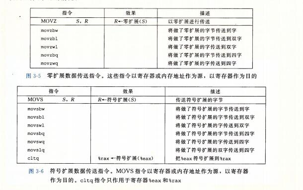


### 3、压入和弹出栈数据

```
最后两个数据传送操作可以将数据压入程序栈中，以及从程序栈中弹出数据，正如我们将看到的，栈 在处理过程调用中起到至关重要的作用。栈是一种数据结构，可以添加或者删除值，不过要遵循"后进先出"的原则。通过push操作把数据压入栈中，通过pop操作删除数据；它具有一个属性：弹出的值永远是最近被压入而且仍然才栈中的值。
栈向下增长，这样一来，栈顶元素的地址是所有栈中元素地址最低的。(按照惯例，我们的栈是倒过来画的，栈"顶"在图的底部。)栈指针 %rsp 保存着栈顶元素的地址。
```

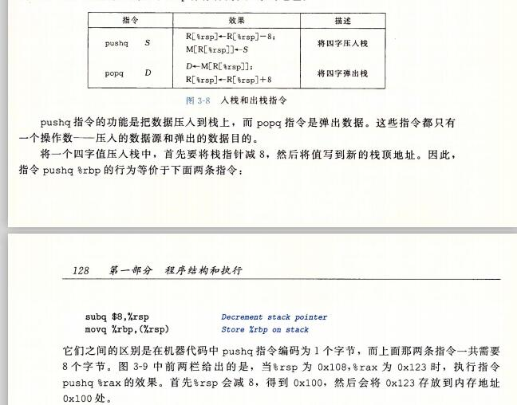


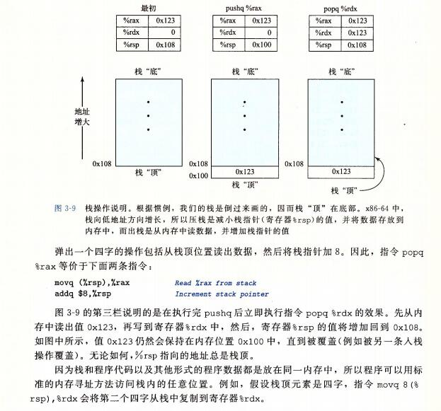

```
push
	sub $8 %rsp
	movq %rbp,(%rsp)
	
pop 
	movq (%rsp) %rax
	add $8 %rsp
```


## 5、算术和逻辑操作

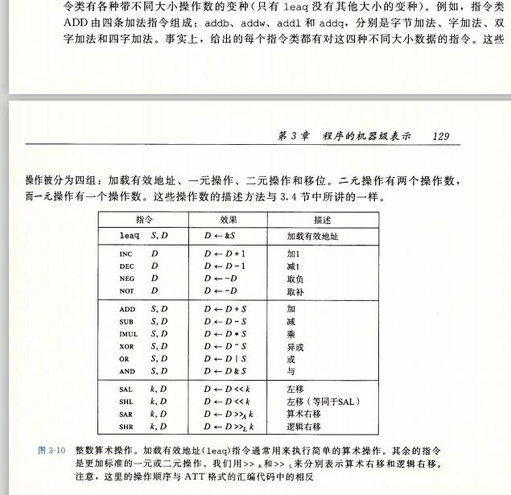

```
NEG  NOT 
negative  not

求反 和 求补(不管是正数负数都要 取反 + 1)
的存在的必要性

求补运算是种运算，这种运算是由补码的转换过程升级而来。
有了补码，为什么还要提出求补运算这种新的运算？
要理解求补运算的提出原因，还要从补码说起。

求补运算的运算法则：将一个数（包括正数和负数）所有二进制位（包括符号位和数值位）取反，然后在最低位加上1。

求补运算的适用范围：将减法运算转换为加法运算，而且只能进行这类的运算转换。

求补运算的触发条件：遇到主动给定的减法运算符。比如遇到汇编语言中的SUB，SBB指令。
触发条件必须人为给出，毕竟计算机只是机器，它只做你编程安排好的事，不可能做仅仅在你心中所想的事。

求补运算的转换过程：遇到减法运算符，马上将减法运算符右边数据转换成其补码形式，然后将减法运算符左边的数据加上前面所得的补码形式。例如 3-(2*1) 3-2 00000011(-)00000010 00000011(+)11111110
结果为100000001，最高位第8位自动丢弃变成00000001 ，(-)这里是运算符不再当成数的符号，这是由指令中直接给出的mov ax,3 mov bx,2 sub ax,bx。

例如 5-(-9/3) 5-(-3) 00000101(-)11111101 00000101(+)00000011结果为00001000十进制的8。

求补运算的正确性是如何得到保障的：将运算符当成负号处理了。A-(B)变为A+(-B)，问题是如何用B表示-B，而补码编码刚好能正确地实现这种表达方式。求补运算的正确性是由补码码制的正确性来保障的。
```


### 1、加载有效地址

```
加载有效地址(load effective address)指令 leaq 实际上是movq指令的变形。它的指令形式是从内存读数据到寄存器，但实际上它根本就没有引用内存。它的第一个操作数看上去是一个内存引用，但该指令并不是从指定的位置读入数据，而是将有效地址写入到目的操作数。
```

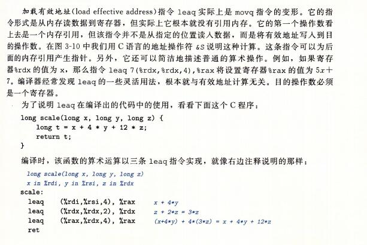

```
为什么不直接 leaq(,%rdx,12) 呢 ，因为 s 比例因子s,这里s必须是1、2、4或者8
只能是 1,2,4,8
所以必须分开。
```


### 2、一元和二元操作

```
第二组中的操作是一元操作，只有一个操作数，既是源又是目的。这个操作数可以是一个寄存器，也可以是一个内存位置。比如说，指令 incq(%rsp) 会使栈顶的8字节元素加一。

第三组是二元操作，其中，第二个操作数既是源又是目的。
如 subq %rax, %rdx 使寄存器 %rdx 的值减去 %rax 中的值。（将指令解读成 "从 %rdx 中减去 %rax "会有所帮助）

第一个操作数可以是立即数、寄存器或是内存位置。
第二个操作数可以是寄存器或者是内存位置。

注意，当第二个操作数为内存地址时，处理器必须从内存读出值，执行操作，再把结果写回内存。
```

### 3、移位操作

```
最后一组是移位操作，先给出移位量，然后第二项给出的是要移位的数。可以进行算术和逻辑右移。移位量可以是一个立即数，或者放在单字节寄存器 %cl 中。(这些指令很特别，因为只允许以这个特定的寄存器作为操作数)原则上来说，1个字节的移位量使得移位量的编码范围可以达到 2^8 - 1 = 255. x86-64 中， 移位操作对 w 位长的数据值进行操作，移位量是由 %cl 寄存器的低 m 位决定的，这里 2^m = w. 高位会被忽略。所以，例如当寄存器 %cl 的十六进制值为 0xFF 时，指令 salb 会移 7 位，salw 会移 15位 ， sall 会移31位， 而 salq 会移动63位。
```

```
 左移指令有两个名字： SAL 和 SHL 。A代表算术左移  arithmetic  H表示逻辑左移  shift arithmetic left .
 
 SAL 和 SHL 两者的效果是一样的，都是将右边填上 0.右移指令不同，SAR执行算术位移(填上符号位)，而 SHR 执行逻辑位移(填上 0)。移位操作的目的操作数可以是一个寄存器或是一个内存位置。
 
```


### 4、特殊的算术操作

```
两个 64 位有符号或无符号整数相乘得到的乘积需要 128 位来表示。x86-64 指令集对 128 位(16字节)数的操作提供了有限的支持。延续字(2字节)、双字、四字的命名惯例，Intel 吧 16字节的数称为 八字(oct word). 下图描述的是支持产生两个 64 位数字的全 128 位乘积以及整数除法的指令。
```

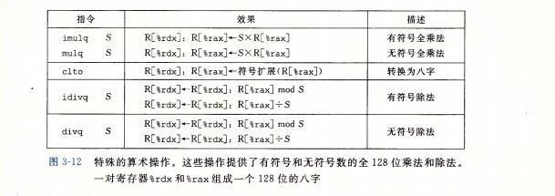


```
imulq 指令有两种不同的形式。其中一种，是 "双操作数" 乘法指令。它从两个 64 位操作数产生一个 64 位乘积。

此外，x86-64 指令还提供了两条不同的 "单操作数" 乘法指令，以计算两个 64 位值的全 128 位乘积 -- 一个是无符号数乘法 mulq,  而另一个是一个补码乘法(imulq).
这两条指令都要求一个参数必须在寄存器 %rax 中，而另一个作为指令的源操作数给出。然后乘积存放在寄存器 %rdx(高64位)和%rax(低64位)中。虽然 imulq 这个名字可以用于两个不同的乘法操作，但是汇编器能够通过计算操作数的数目，分辨出想用哪条指令。
```


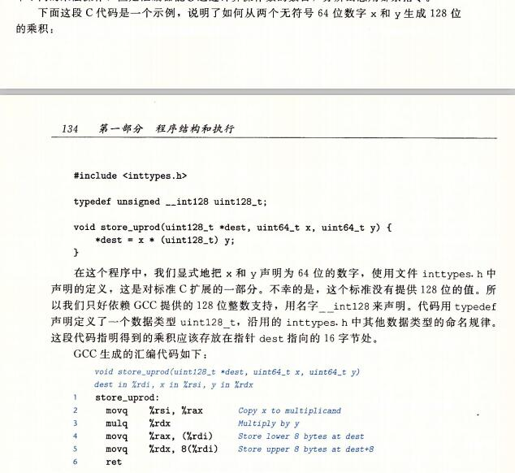


```
可以观察到，存储乘积需要两个 movq 指令： 一个存储低 8 个字节(第4行)，一个存储高 8 个字节(第5行)。由于生成这段代码针对的是小端法机器，所以高位字节存储在大地址，正如地址8(%rdi)表明的那样。
```


```
前面的算术运算表没有列出除法或取模操作。这些操作是由单操作数除法指令来提供的，类似于单操作数乘法指令。有符号除法指令 idivl 将寄存器 %rdx（高64位 寄存器里面代表第三个参数）。和 %rax (低64位 寄存器里面代表返回值)。中的 128 位数作为被除数，而除数作为指令的操作数给出。指令将商存储在寄存器%rax 中，将余数存储在寄存器 %rdx 中。

对于大多数 64 位除法应用来说，除数也常常是一个 64 位的值。这个值应该存放在 %rax 中， %rdx 的位应该设置为 0(无符号运算)或者%rax 的符号位(有符号运算)。后面这个操作可以用指令 cqto 来完成。这条指令不需要操作数 -- 它隐含读出 %rax 的符号位，并将它复制到 %rdx 的所有位. 
```


## 6、控制

### 1、条件码

```
除了整数寄存器，CPU还维护着一组单个位的条件码(condition code) 寄存器，它们描述了最近的算术或逻辑操作的属性。可以检测到这些寄存器来执行条件分支指令。最常用的条件码有：
	CF: 进位标志。最近的操作使最高位产生了进位。可用来检查无符号操作的溢出。
	ZF: 零标志。最近的操作得到的结果为 0
	SF：符号标志。最近的操作得到的结果为负数。
	OF: 溢出标志。
	
CF  carry bit 进位
ZF  ZERO 
SF  SIGN 符号
OF  overflow 溢出
```

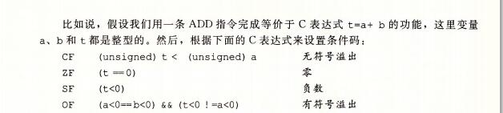


```
leaq 指令不改变任何条件码，因为它是用来进行地址计算的。除此之外，图3-10(就是算术指令)。的所有指令都会设置条件码。对于逻辑操作，例如 XOR(^异或)，进位标志和溢出标志会设置成 0。对于移位操作，进位标志将设置为最后一个被移出的位，而溢出的标志设置为 0 。 INC 和 DEC 指令会设置溢出和零标志，但是不会改变进位标志。
```


### 2、CMP 和 TEST 指令

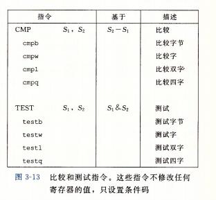


```
除了图 3-10中(算术指令)会设置条件码，还有两类指令(有 8、16、32、64位形式)，它们只设置条件码而不改变任何其他寄存器;

CMP 指令根据两个操作数之差来设置条件码。
除了只设置条件码而不更新目的寄存器之外， CMP 指令与 SUB 指令的行为是一样的。
如果两个操作数相等，这些指令会将零标志设置为 1， 而其他标志可以用来确定两个操作数之间的大小关系。

TEST 指令的行为和 AND 指令一样，除了他们只设置条件码而不改变目的寄存器的值。
典型的用法是，两个操作数是一样的(例如，testq %rax,%rax 用来检查 %rax 是负数，零还是 正数)，或其中的一个操作数是一个掩码，用来指示哪些位应该被测试。
```


### 3、访问条件码

```
条件码通常不会直接读取，常用的使用方法有三种：
1、可以根据条件码的某种组合，将一个字节设置为 0 或者 1

2 可以条件跳转到程序的某个其他的部分。

3、可以有条件的传送数据

对于第一种情况，图3-14中描述的指令根据条件码的某种组合，将一个字节设置为 0 或者 1. 
我们将这一类指令成为 SET 指令; 它们之间的区别就在于它们考虑的条件码的组合是什么，这些指令名字的不同后缀指明了它们所考虑的条件码的组合。
这些指令的后缀表示不同的条件而不是操作数的大小，了解这一点很重要。

例如：指令 setl 和 setb 表示"小于时设置(set less)" 和 "低于时设置(set below)".

一条 SET 指令的目的操作数是低位单字节寄存器元素之一，或是一个字节的内存位置，指令会将这个字节设置成 0 或者 1。为了得到一个 32位 或 64位结果，我们必须对高位清零。
```


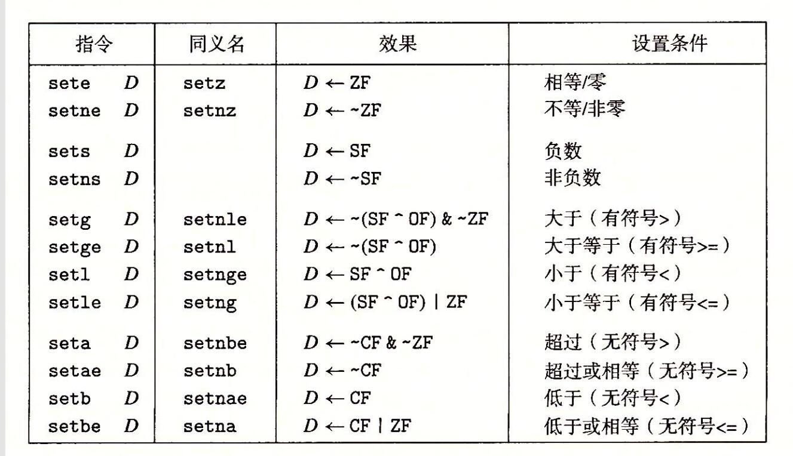

```
sete /setz  ZF 1 就是 0
setne/ setnz ~ZF 就是相反

sets SF 符号位是负数就为 1 
setns ~SF 取反

setg/setnle (greater 较大的 less较小的) 大于(有符号大于)
	~(SF^OF)& ~ZF  ~ZF 不等于 0;
	~(SF^OF) 溢出就取反，没有溢出就取 SF ，然后取反，就是大于
	
	greater 大于
	less  小于
	above 超过
	below 低于

```


### 4、跳转指令

```
正常的情况下，指令按照它们出现的顺序一条一条的执行。跳转(jump)指令会导致执行切换到程序中一个全新的位置。在汇编代码中，这些跳转的目的地通常用 一个(label) 指明。
```

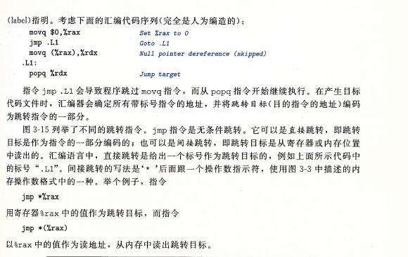


### 5、跳转指令的编码

```

```


